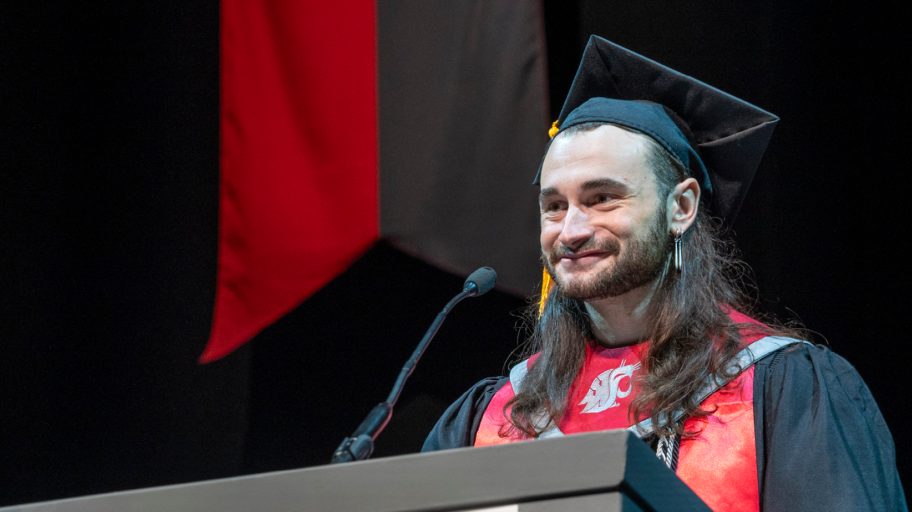

# 📄 Page Scan Report

> **URL:** https://nursing.wsu.edu/  
> **Captured:** 2026-02-16 22:20:09 UTC  
> **Status:** ✅ 200  

---

## 📑 Contents

- [Summary](#-summary)
- [Screenshots](#-screenshots)
- [Page Images](#-page-images)
- [JavaScript Errors](#-javascript-errors)
- [Actions](#-actions)
- [Files](#-files)

---

## 📋 Summary

| Field | Value |
|-------|-------|
| URL | https://nursing.wsu.edu/ |
| Title | College of Nursing | Washington State University |
| Status | ✅ 200 |
| HTML Size | 290.7 KB |
| Screenshots | 1 (1.9 MB) |
| Images | 11 (2.8 MB) |
| Images Missing Alt | ✅ 0 |
| JS Errors | 🔴 3 |
| JS Warnings | 0 |
| Auth | none |
| Captured | 2026-02-16T22:20:09.4879001Z |

## 🔴 JavaScript Errors

<details>
<summary><strong>3 error(s) detected</strong></summary>

```
Failed to load resource: the server responded with a status of 405 ()
Failed to load resource: the server responded with a status of 405 ()
Failed to load resource: the server responded with a status of 405 ()
```

</details>

## 🔧 Actions

<details>
<summary><strong>2 action(s) performed</strong></summary>

- Screenshot #1: page-loaded (1.9 MB)
- Downloaded 11 images to /images/

</details>

## 📸 Screenshots

<table>
<tr>
<td align="center" width="50%">
<a href="01-page-loaded.png">

</a>
<br /><strong>1. page-loaded</strong>
<br /><sub>1.9 MB</sub>
</td>
<td></td>
</tr>
</table>

## 🖼️ Page Images (11)

<details open>
<summary><strong>📋 Image Index</strong> — 11 images, 2.8 MB</summary>

| # | Image | Alt Text | Size |
|--:|-------|----------|-----:|
| 1 | [25Fall_EOY-WebHeaders_cropped.png](images/25Fall_EOY-WebHeaders_cropped.png) | Max Pearl, '25 BSN | 2.2 MB |
| 2 | [image-2.jpg](images/image-2.jpg) | Relief Pain Hub logo, overlayed on an... | 64.2 KB |
| 3 | [nursing1-1024x685-1-792x530.jpg](images/nursing1-1024x685-1-792x530.jpg) | WSU College of Nursing will transitio... | 83.8 KB |
| 4 | [J1-Orientation-010826A6708263-16x9-1-792x445.jpg](images/J1-Orientation-010826A6708263-16x9-1-792x445.jpg) | New BSN students during the Spring 20... | 83.0 KB |
| 5 | [Adam-and-Meredith-Richards-image002-16x9-1-792x446.jpg](images/Adam-and-Meredith-Richards-image002-16x9-1-792x446.jpg) | Meredith and Adam Richards smiling to... | 50.5 KB |
| 6 | [2025-In-Review-IMG_7040-bw-16x9-1-792x446.jpg](images/2025-In-Review-IMG_7040-bw-16x9-1-792x446.jpg) | Large "2025" numerals in the foregrou... | 65.6 KB |
| 7 | [Anne-Mason_final_3-composite-100-bkgd-16x9-v2-792x446.jpg](images/Anne-Mason_final_3-composite-100-bkgd-16x9-v2-792x446.jpg) | Portrait of Anne Mason. | 48.5 KB |
| 8 | [Welcome-sign-with-headshot-792x444.jpg](images/Welcome-sign-with-headshot-792x444.jpg) | A "Dr. Hernandez-Silva" welcome sign ... | 57.7 KB |
| 9 | [Clarks-Recurring-Gifts-Pg-9-792x594.jpg](images/Clarks-Recurring-Gifts-Pg-9-792x594.jpg) | Bob and Charlene Clark | 103.1 KB |
| 10 | [Huebner-photo-for-annual-report-16x9-1-792x445.jpg](images/Huebner-photo-for-annual-report-16x9-1-792x445.jpg) | Carol Huebner, Professor Emerita of N... | 51.0 KB |
| 11 | [SEA-to-GEG-e1697567786392.png](images/SEA-to-GEG-e1697567786392.png) | Seattle to Spokane skyline silhouette | 10.5 KB |

</details>

<details open>
<summary><strong>🖼️ Gallery</strong></summary>

<table>
<tr>
<td align="center" width="33%">
<a href="images/25Fall_EOY-WebHeaders_cropped.png">

</a>
<br /><sub>25Fall_EOY-WebHeaders_cropped.png</sub>
</td>
<td align="center" width="33%">
<a href="images/image-2.jpg">

</a>
<br /><sub>image-2.jpg</sub>
</td>
<td align="center" width="33%">
<a href="images/nursing1-1024x685-1-792x530.jpg">

</a>
<br /><sub>nursing1-1024x685-1-792x530.jpg</sub>
</td>
</tr>
<tr>
<td align="center" width="33%">
<a href="images/J1-Orientation-010826A6708263-16x9-1-792x445.jpg">

</a>
<br /><sub>J1-Orientation-010826A6708263-16x9-1-792x445.jpg</sub>
</td>
<td align="center" width="33%">
<a href="images/Adam-and-Meredith-Richards-image002-16x9-1-792x446.jpg">

</a>
<br /><sub>Adam-and-Meredith-Richards-image002-16x9-1-792x446.jpg</sub>
</td>
<td align="center" width="33%">
<a href="images/2025-In-Review-IMG_7040-bw-16x9-1-792x446.jpg">

</a>
<br /><sub>2025-In-Review-IMG_7040-bw-16x9-1-792x446.jpg</sub>
</td>
</tr>
<tr>
<td align="center" width="33%">
<a href="images/Anne-Mason_final_3-composite-100-bkgd-16x9-v2-792x446.jpg">

</a>
<br /><sub>Anne-Mason_final_3-composite-100-bkgd-16x9-v2-792x446.jpg</sub>
</td>
<td align="center" width="33%">
<a href="images/Welcome-sign-with-headshot-792x444.jpg">

</a>
<br /><sub>Welcome-sign-with-headshot-792x444.jpg</sub>
</td>
<td align="center" width="33%">
<a href="images/Clarks-Recurring-Gifts-Pg-9-792x594.jpg">

</a>
<br /><sub>Clarks-Recurring-Gifts-Pg-9-792x594.jpg</sub>
</td>
</tr>
<tr>
<td align="center" width="33%">
<a href="images/Huebner-photo-for-annual-report-16x9-1-792x445.jpg">

</a>
<br /><sub>Huebner-photo-for-annual-report-16x9-1-792x445.jpg</sub>
</td>
<td align="center" width="33%">
<a href="images/SEA-to-GEG-e1697567786392.png">

</a>
<br /><sub>SEA-to-GEG-e1697567786392.png</sub>
</td>
<td></td>
</tr>
</table>

</details>

## 📁 Files

| File | Description |
|------|-------------|
| `01-page-loaded.png` | page-loaded (1.9 MB) |
| `page.html` | Rendered HTML content |
| `metadata.json` | Machine-readable scan data |
| `errors.log` | JavaScript console errors |
| `warnings.log` | JavaScript console warnings |
| `info.log` | Navigation and timing details |
| `actions.log` | Interactions performed |
| `images/` | 11 page images (2.8 MB) |

---

*Generated by AccessibilityScanner (FreeTools) v1.0*
