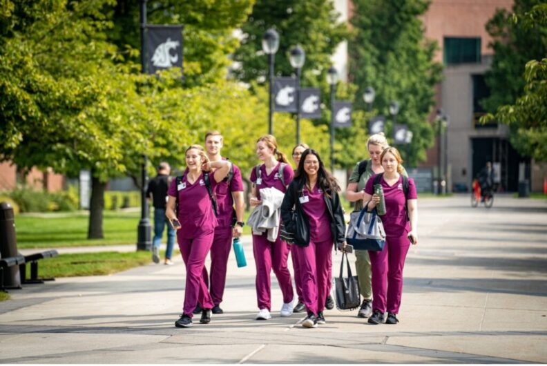
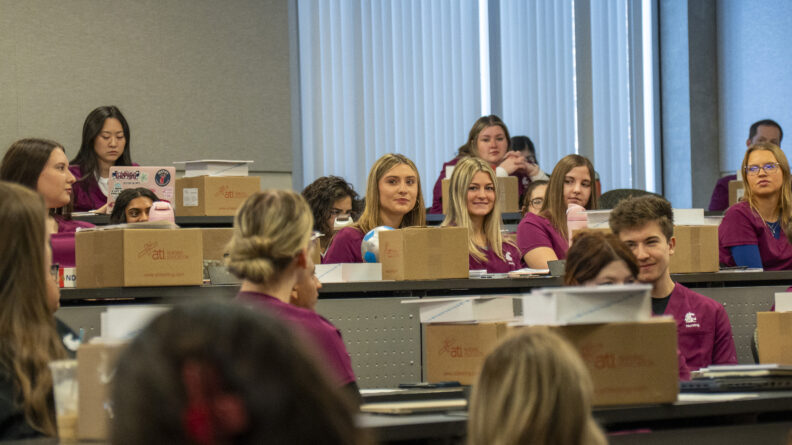
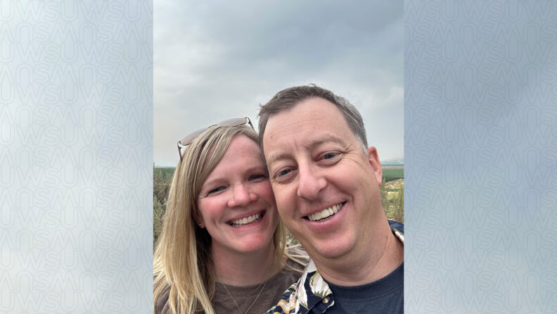
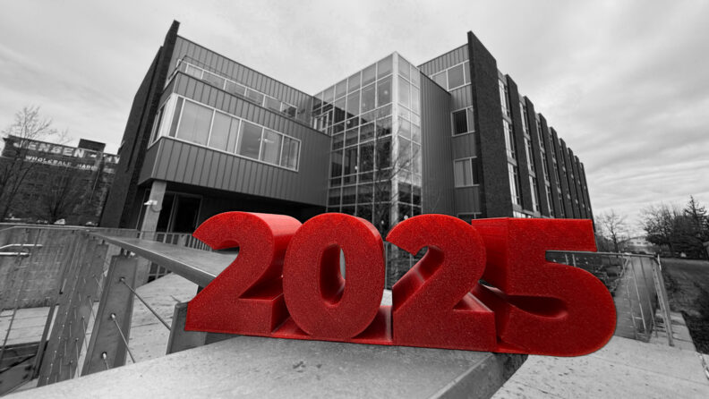
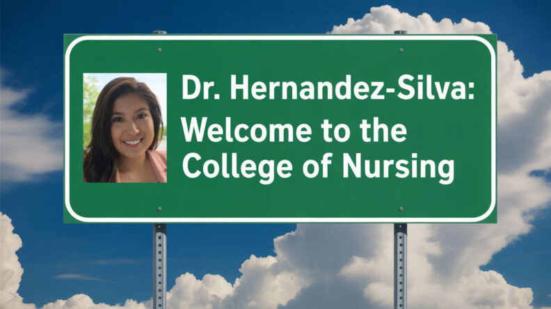
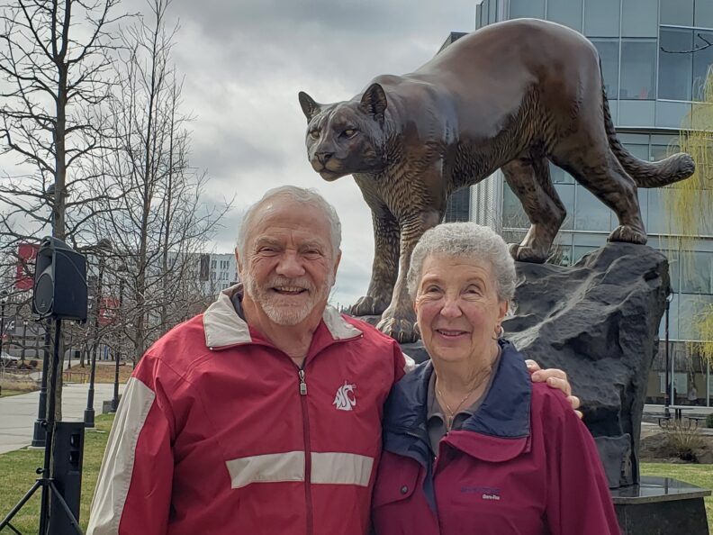
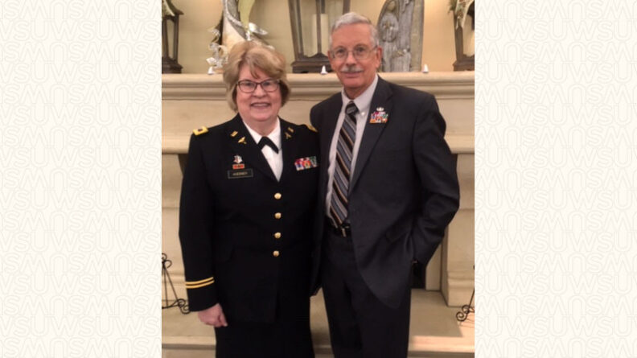

# Page Scan Report

| Field | Value |
|-------|-------|
| URL | https://nursing.wsu.edu/ |
| Title | College of Nursing | Washington State University |
| Status | ❌ 0 |
| HTML Size | 284.5 KB |
| Screenshots | 1 (1.4 MB) |
| Images | 10 (617.8 KB) |
| Images Missing Alt | 0 |
| JS Errors | 2 |
| JS Warnings | 0 |
| Auth | none |
| Captured | 2026-02-16T20:58:42.4657280Z |

## JavaScript Errors

- `Failed to load resource: net::ERR_SOCKET_NOT_CONNECTED`
- `Failed to load resource: net::ERR_SOCKET_NOT_CONNECTED`

## Actions

- Screenshot #1: page-loaded (1.4 MB)
- Downloaded 10 images to /images/

## Screenshots

### 1. page-loaded

## Page Images (10)

| # | Image | Alt Text | Size |
|---|-------|----------|------|
| 1 | [image-1.jpg](images/image-1.jpg) | Relief Pain Hub logo, overlayed on an... | 64.2 KB |
| 2 | [nursing1-1024x685-1-792x530.jpg](images/nursing1-1024x685-1-792x530.jpg) | WSU College of Nursing will transitio... | 83.8 KB |
| 3 | [J1-Orientation-010826A6708263-16x9-1-792x445.jpg](images/J1-Orientation-010826A6708263-16x9-1-792x445.jpg) | New BSN students during the Spring 20... | 83.0 KB |
| 4 | [Adam-and-Meredith-Richards-image002-16x9-1-792x446.jpg](images/Adam-and-Meredith-Richards-image002-16x9-1-792x446.jpg) | Meredith and Adam Richards smiling to... | 50.5 KB |
| 5 | [2025-In-Review-IMG_7040-bw-16x9-1-792x446.jpg](images/2025-In-Review-IMG_7040-bw-16x9-1-792x446.jpg) | Large "2025" numerals in the foregrou... | 65.6 KB |
| 6 | [Anne-Mason_final_3-composite-100-bkgd-16x9-v2-792x446.jpg](images/Anne-Mason_final_3-composite-100-bkgd-16x9-v2-792x446.jpg) | Portrait of Anne Mason. | 48.5 KB |
| 7 | [Welcome-sign-with-headshot-792x444.jpg](images/Welcome-sign-with-headshot-792x444.jpg) | A "Dr. Hernandez-Silva" welcome sign ... | 57.7 KB |
| 8 | [Clarks-Recurring-Gifts-Pg-9-792x594.jpg](images/Clarks-Recurring-Gifts-Pg-9-792x594.jpg) | Bob and Charlene Clark | 103.1 KB |
| 9 | [Huebner-photo-for-annual-report-16x9-1-792x445.jpg](images/Huebner-photo-for-annual-report-16x9-1-792x445.jpg) | Carol Huebner, Professor Emerita of N... | 51.0 KB |
| 10 | [SEA-to-GEG-e1697567786392.png](images/SEA-to-GEG-e1697567786392.png) | Seattle to Spokane skyline silhouette | 10.5 KB |

### Gallery

## Files

- `01-page-loaded.png` — page-loaded (1.4 MB)
- `page.html` — rendered HTML content
- `metadata.json` — machine-readable scan data
- `errors.log` — JavaScript console errors
- `warnings.log` — JavaScript console warnings
- `info.log` — navigation and timing details
- `actions.log` — interactions performed on the page
- `images/` — 10 page images (617.8 KB)
