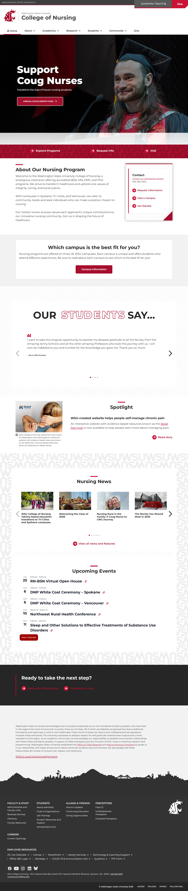
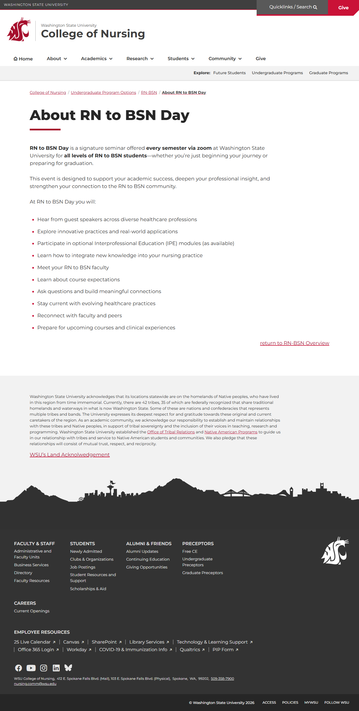
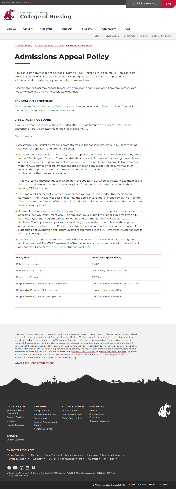
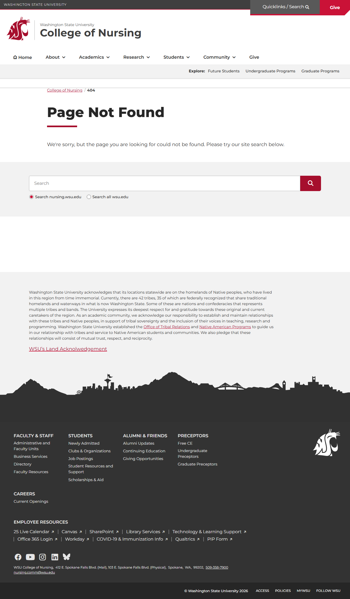
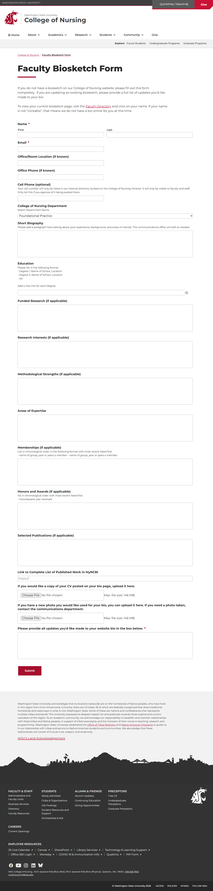
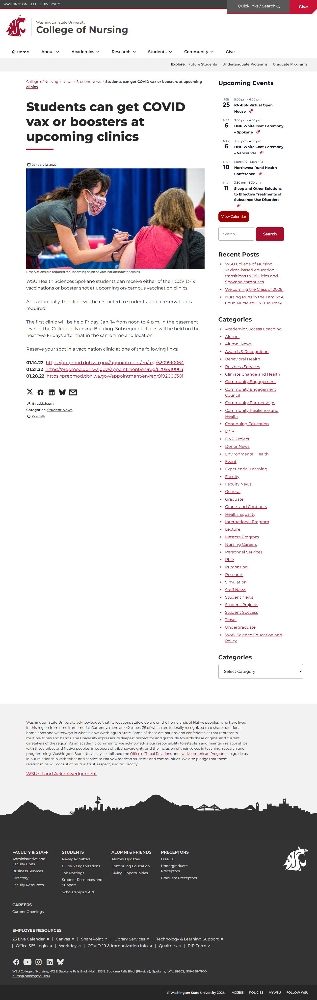

# Site Report: https://nursing.wsu.edu/

| Metric | Value |
|--------|-------|
| Status | ⚠️ 5/7 pages OK |
| Pages Scanned | 7 |
| Pages Passed | 5 |
| Pages Failed | 2 |
| Total JS Errors | 22 |
| Total JS Warnings | 2 |
| Total HTML | 1.8 MB |
| Total Screenshots | 4.1 MB |
| Folder | `nursing-wsu-edu/` |

## Pages

| Status | Page | HTTP | Title | JS Errors | JS Warnings | Screenshots |
|--------|------|------|-------|-----------|-------------|-------------|
| ✅ | [/](_root/report.md) | 200 | College of Nursing \| Washington Stat... | 2 | 0 | 1 |
| ✅ | [/about/](about/report.md) | 200 | About RN to BSN Day \| College of Nur... | 3 | 0 | 1 |
| ✅ | [/admissions/](admissions/report.md) | 200 | Admissions Appeal Policy \| College o... | 3 | 0 | 1 |
| ❌ | [/contact/](contact/report.md) | 404 | Page not found \| College of Nursing ... | 4 | 1 | 1 |
| ✅ | [/faculty/](faculty/report.md) | 200 | Faculty Biosketch Form \| College of ... | 3 | 0 | 1 |
| ❌ | [/programs/](programs/report.md) | 404 | Page not found \| College of Nursing ... | 4 | 1 | 1 |
| ✅ | [/students/](students/report.md) | 200 | Students can get COVID vax or booster... | 3 | 0 | 1 |

## Page Screenshots

### [/](_root/report.md)

### [/about/](about/report.md)

### [/admissions/](admissions/report.md)

### [/contact/](contact/report.md)

### [/faculty/](faculty/report.md)

### [/programs/](programs/report.md)

### [/students/](students/report.md)

## Failed Pages

### /programs/

- **URL:** https://nursing.wsu.edu/programs/
- **Status:** 404

### /contact/

- **URL:** https://nursing.wsu.edu/contact/
- **Status:** 404

## Pages with JavaScript Errors

### /programs/ (4 errors)

- `Failed to load resource: the server responded with a status of 404 ()`
- `Failed to load resource: the server responded with a status of 405 ()`
- `Failed to load resource: the server responded with a status of 405 ()`
- `Failed to load resource: the server responded with a status of 405 ()`

### /contact/ (4 errors)

- `Failed to load resource: the server responded with a status of 404 ()`
- `Failed to load resource: the server responded with a status of 405 ()`
- `Failed to load resource: the server responded with a status of 405 ()`
- `Failed to load resource: the server responded with a status of 405 ()`

### /about/ (3 errors)

- `Failed to load resource: the server responded with a status of 405 ()`
- `Failed to load resource: the server responded with a status of 405 ()`
- `Failed to load resource: the server responded with a status of 405 ()`

### /admissions/ (3 errors)

- `Failed to load resource: the server responded with a status of 405 ()`
- `Failed to load resource: the server responded with a status of 405 ()`
- `Failed to load resource: the server responded with a status of 405 ()`

### /students/ (3 errors)

- `Failed to load resource: the server responded with a status of 405 ()`
- `Failed to load resource: the server responded with a status of 405 ()`
- `Failed to load resource: the server responded with a status of 405 ()`

### /faculty/ (3 errors)

- `Failed to load resource: the server responded with a status of 405 ()`
- `Failed to load resource: the server responded with a status of 405 ()`
- `Failed to load resource: the server responded with a status of 405 ()`

### / (2 errors)

- `Failed to load resource: net::ERR_SOCKET_NOT_CONNECTED`
- `Failed to load resource: net::ERR_SOCKET_NOT_CONNECTED`

---

*Generated by AccessibilityScanner (FreeTools) v1.0*
