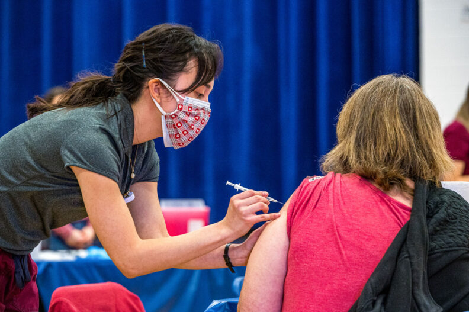

# Page Scan Report

| Field | Value |
|-------|-------|
| URL | https://nursing.wsu.edu/students/ |
| Redirected To | https://nursing.wsu.edu/2022/01/12/students-can-get-covid-vax-or-boosters-at-upcoming-clinics/ |
| Title | Students can get COVID vax or boosters at upcoming clinics | College of Nursing | Washington State University |
| Status | ❌ 0 |
| HTML Size | 250.3 KB |
| Screenshots | 1 (865.0 KB) |
| Images | 2 (122.7 KB) |
| Images Missing Alt | 0 |
| JS Errors | 3 |
| JS Warnings | 0 |
| Auth | none |
| Captured | 2026-02-16T20:38:57.3774120Z |

## JavaScript Errors

- `Failed to load resource: the server responded with a status of 405 ()`
- `Failed to load resource: the server responded with a status of 405 ()`
- `Failed to load resource: the server responded with a status of 405 ()`

## Actions

- Screenshot #1: page-loaded (865.0 KB)
- Downloaded 2 images to /images/

## Screenshots

### 1. page-loaded

## Page Images (2)

| # | Image | Alt Text | Size |
|---|-------|----------|------|
| 1 | [Vaccination-Clinic-nursing-MLK-Jr.-Center-28-792x527.jpg](images/Vaccination-Clinic-nursing-MLK-Jr.-Center-28-792x527.jpg) | Student giving a vaccination. | 112.2 KB |
| 2 | [SEA-to-GEG-e1697567786392.png](images/SEA-to-GEG-e1697567786392.png) | Seattle to Spokane skyline silhouette | 10.5 KB |

### Gallery

## Files

- `01-page-loaded.png` — page-loaded (865.0 KB)
- `page.html` — rendered HTML content
- `metadata.json` — machine-readable scan data
- `errors.log` — JavaScript console errors
- `warnings.log` — JavaScript console warnings
- `info.log` — navigation and timing details
- `actions.log` — interactions performed on the page
- `images/` — 2 page images (122.7 KB)
