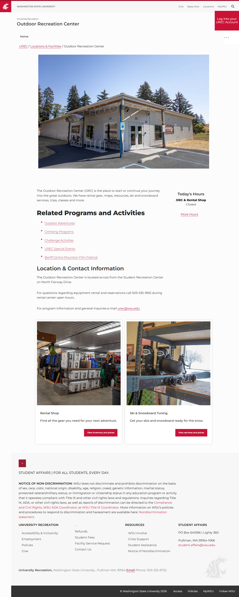
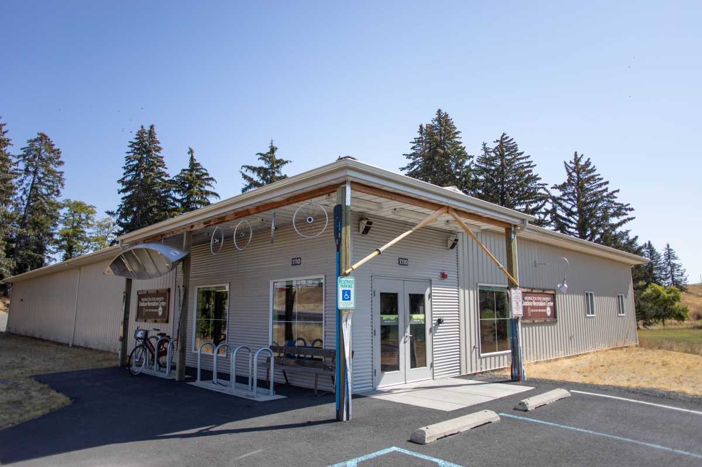
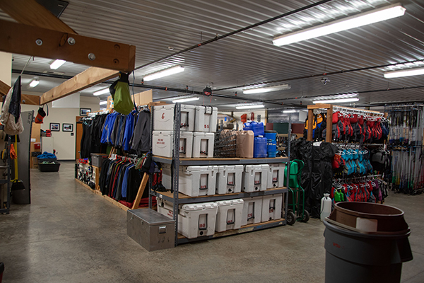
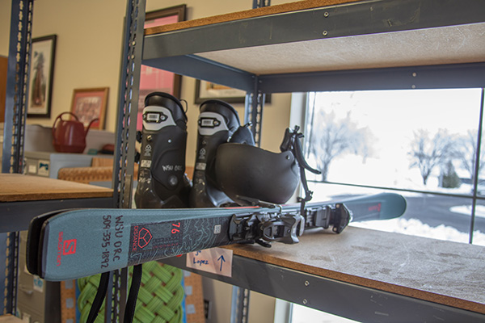

# Page Scan Report

| Field | Value |
|-------|-------|
| URL | https://orc.wsu.edu/trips/ |
| Redirected To | https://urec.wsu.edu/locations-facilities/outdoor-recreation-center |
| Title | Outdoor Recreation Center |
| Status | ❌ 0 |
| HTML Size | 76.9 KB |
| Screenshots | 1 (1.4 MB) |
| Images | 3 (427.5 KB) |
| Images Missing Alt | 0 |
| JS Errors | 0 |
| JS Warnings | 0 |
| Auth | none |
| Captured | 2026-02-16T21:00:49.7802721Z |

## Actions

- Screenshot #1: page-loaded (1.4 MB)
- Downloaded 3 images to /images/

## Screenshots

### 1. page-loaded

## Page Images (3)

| # | Image | Alt Text | Size |
|---|-------|----------|------|
| 1 | [orc-header.jpg](images/orc-header.jpg) | Outdoor Recreation Center Exterior Fa... | 88.8 KB |
| 2 | [orc-page-rental-shop-content-card.jpg](images/orc-page-rental-shop-content-card.jpg) | Rental Shop | 239.9 KB |
| 3 | [orc-page-ski-tune-up-content-card.jpg](images/orc-page-ski-tune-up-content-card.jpg) | Ski & Snowboard Tuning | 98.8 KB |

### Gallery

## Files

- `01-page-loaded.png` — page-loaded (1.4 MB)
- `page.html` — rendered HTML content
- `metadata.json` — machine-readable scan data
- `errors.log` — JavaScript console errors
- `warnings.log` — JavaScript console warnings
- `info.log` — navigation and timing details
- `actions.log` — interactions performed on the page
- `images/` — 3 page images (427.5 KB)
