# 📄 Page Scan Report

> **URL:** https://pharmacy.wsu.edu/  
> **Captured:** 2026-02-16 22:17:24 UTC  
> **Status:** ✅ 200  

---

## 📑 Contents

- [Summary](#-summary)
- [Screenshots](#-screenshots)
- [Page Images](#-page-images)
- [JavaScript Errors](#-javascript-errors)
- [Actions](#-actions)
- [Files](#-files)

---

## 📋 Summary

| Field | Value |
|-------|-------|
| URL | https://pharmacy.wsu.edu/ |
| Title | Pharmacy and Pharmaceutical Sciences | Washington State University |
| Status | ✅ 200 |
| HTML Size | 333.1 KB |
| Screenshots | 1 (1.8 MB) |
| Images | 20 (6.6 MB) |
| Images Missing Alt | ⚠️ 14 |
| JS Errors | 🔴 4 |
| JS Warnings | 0 |
| Auth | none |
| Captured | 2026-02-16T22:17:24.5547830Z |

## 🔴 JavaScript Errors

<details>
<summary><strong>4 error(s) detected</strong></summary>

```
Failed to load resource: the server responded with a status of 405 ()
Failed to load resource: the server responded with a status of 405 ()
Failed to load resource: the server responded with a status of 405 ()
Failed to load resource: the server responded with a status of 405 ()
```

</details>

## 🔧 Actions

<details>
<summary><strong>2 action(s) performed</strong></summary>

- Screenshot #1: page-loaded (1.8 MB)
- Downloaded 20 images to /images/

</details>

## 📸 Screenshots

<table>
<tr>
<td align="center" width="50%">
<a href="01-page-loaded.png">

</a>
<br /><strong>1. page-loaded</strong>
<br /><sub>1.8 MB</sub>
</td>
<td></td>
</tr>
</table>

## 🖼️ Page Images (20)

<details open>
<summary><strong>📋 Image Index</strong> — 20 images, 6.6 MB</summary>

| # | Image | Alt Text | Size |
|--:|-------|----------|-----:|
| 1 | [Dr.-Paine-Lab-Pharmacy-Oct-2022-8-scaled.jpg](images/Dr.-Paine-Lab-Pharmacy-Oct-2022-8-scaled.jpg) | ⚠️ *(missing)* | 573.2 KB |
| 2 | [image-2.jpg](images/image-2.jpg) | ⚠️ *(missing)* | 578.6 KB |
| 3 | [image-3.jpg](images/image-3.jpg) | ⚠️ *(missing)* | 537.9 KB |
| 4 | [Pharmacy-group-2023-2-scaled-e1685125356229.jpg](images/Pharmacy-group-2023-2-scaled-e1685125356229.jpg) | ⚠️ *(missing)* | 1.4 MB |
| 5 | [Pharmacy-point-of-care-Aug-2022-56-scaled-e1671572456261.jpg](images/Pharmacy-point-of-care-Aug-2022-56-scaled-e1671572456261.jpg) | ⚠️ *(missing)* | 496.7 KB |
| 6 | [DSC_8387-scaled.jpg](images/DSC_8387-scaled.jpg) | ⚠️ *(missing)* | 503.5 KB |
| 7 | [DSC_06491-scaled.jpg](images/DSC_06491-scaled.jpg) | ⚠️ *(missing)* | 677.6 KB |
| 8 | [SAS-EarlyAdmissions_header.jpg](images/SAS-EarlyAdmissions_header.jpg) | ⚠️ *(missing)* | 148.6 KB |
| 9 | [11-gaddameedhi-lab_27_49134620932_o-scaled.jpg](images/11-gaddameedhi-lab_27_49134620932_o-scaled.jpg) | Bachelor of Science in Pharmaceutical... | 593.4 KB |
| 10 | [Senthil-Natesan-Lab-Oct-2022-10-scaled-e1755879716397.jpg](images/Senthil-Natesan-Lab-Oct-2022-10-scaled-e1755879716397.jpg) | PhD in Pharmaceutical Sciences and Mo... | 311.3 KB |
| 11 | [20210816_Co25_3-792x526.jpg](images/20210816_Co25_3-792x526.jpg) | class of 2025 group white coat photo | 189.5 KB |
| 12 | [image-792x523.jpeg](images/image-792x523.jpeg) | close up of a care provider holding s... | 65.3 KB |
| 13 | [Praventa-Telehealth-Training_18-792x528.jpg](images/Praventa-Telehealth-Training_18-792x528.jpg) | Pharmcotherapy department faculty loo... | 80.7 KB |
| 14 | [Palouse-6-792x528.jpg](images/Palouse-6-792x528.jpg) | ⚠️ *(missing)* | 147.5 KB |
| 15 | [gloves-holding-smartphone-and-glucose-monitor-792x523.jpg](images/gloves-holding-smartphone-and-glucose-monitor-792x523.jpg) | ⚠️ *(missing)* | 53.0 KB |
| 16 | [Jared-Kavanaugh-headshot-scaled-e1762816581496-792x570.jpg](images/Jared-Kavanaugh-headshot-scaled-e1762816581496-792x570.jpg) | ⚠️ *(missing)* | 50.0 KB |
| 17 | [Communications-Lab-Multicultural-communication-291-792x528.jpg](images/Communications-Lab-Multicultural-communication-291-792x528.jpg) | A photo of Doctor of Pharmacy student... | 95.7 KB |
| 18 | [Deans-photos_6-792x528.jpg](images/Deans-photos_6-792x528.jpg) | ⚠️ *(missing)* | 111.0 KB |
| 19 | [Neumiller-Joshua-scaled-e1762454694150-792x495.jpg](images/Neumiller-Joshua-scaled-e1762454694150-792x495.jpg) | ⚠️ *(missing)* | 90.0 KB |
| 20 | [Pharmacy-Quality-Improvement-photoshoot_9-792x530.jpg](images/Pharmacy-Quality-Improvement-photoshoot_9-792x530.jpg) | ⚠️ *(missing)* | 107.6 KB |

</details>

<details open>
<summary><strong>🖼️ Gallery</strong></summary>

<table>
<tr>
<td align="center" width="33%">
<a href="images/Dr.-Paine-Lab-Pharmacy-Oct-2022-8-scaled.jpg">
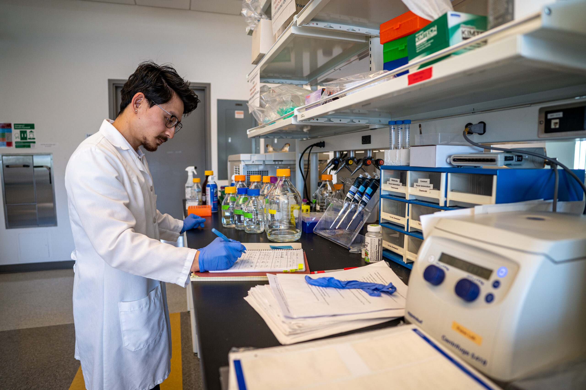
</a>
<br /><sub>Dr.-Paine-Lab-Pharmacy-Oct-2022-8-scaled.jpg ⚠️</sub>
</td>
<td align="center" width="33%">
<a href="images/image-2.jpg">
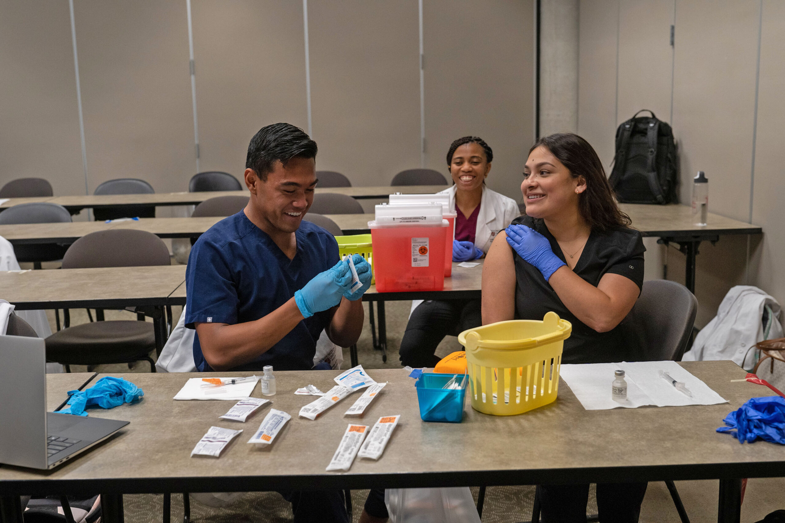
</a>
<br /><sub>image-2.jpg ⚠️</sub>
</td>
<td align="center" width="33%">
<a href="images/image-3.jpg">

</a>
<br /><sub>image-3.jpg ⚠️</sub>
</td>
</tr>
<tr>
<td align="center" width="33%">
<a href="images/Pharmacy-group-2023-2-scaled-e1685125356229.jpg">
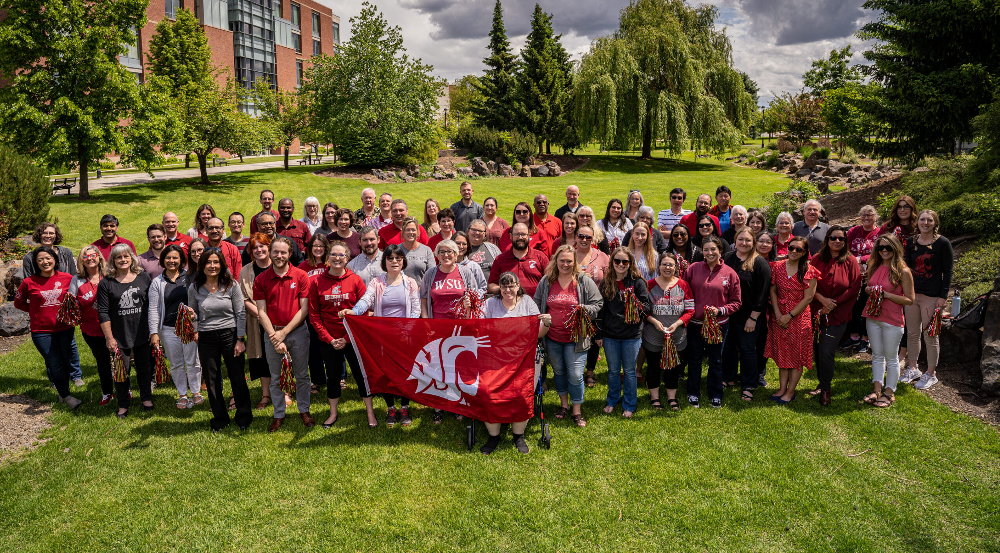
</a>
<br /><sub>Pharmacy-group-2023-2-scaled-e1685125356229.jpg ⚠️</sub>
</td>
<td align="center" width="33%">
<a href="images/Pharmacy-point-of-care-Aug-2022-56-scaled-e1671572456261.jpg">
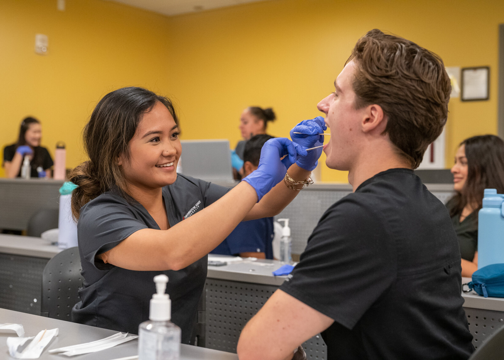
</a>
<br /><sub>Pharmacy-point-of-care-Aug-2022-56-scaled-e1671572456261.jpg ⚠️</sub>
</td>
<td align="center" width="33%">
<a href="images/DSC_8387-scaled.jpg">

</a>
<br /><sub>DSC_8387-scaled.jpg ⚠️</sub>
</td>
</tr>
<tr>
<td align="center" width="33%">
<a href="images/DSC_06491-scaled.jpg">
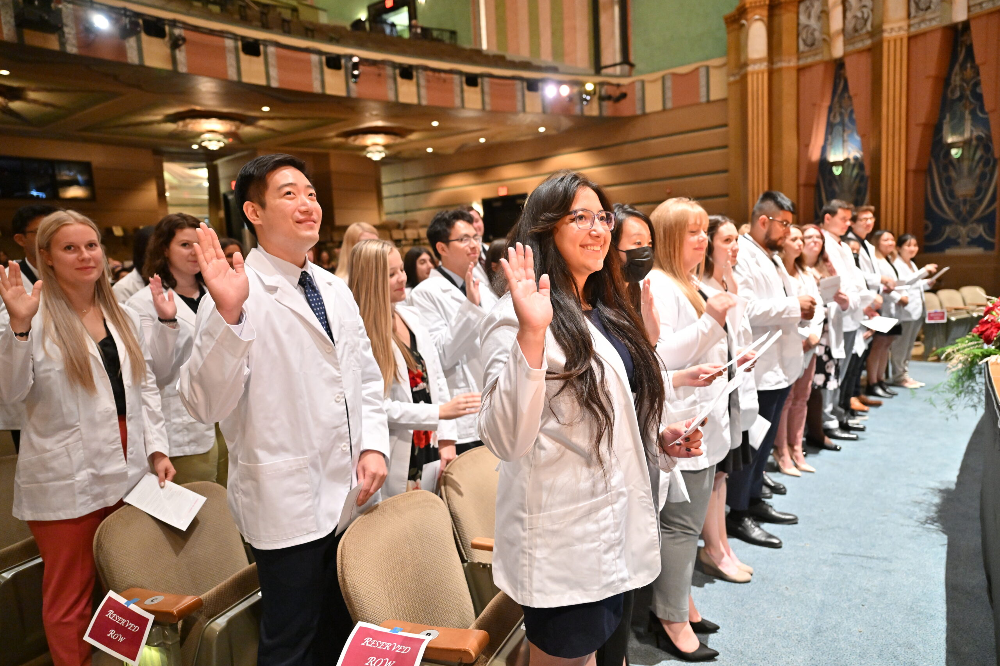
</a>
<br /><sub>DSC_06491-scaled.jpg ⚠️</sub>
</td>
<td align="center" width="33%">
<a href="images/SAS-EarlyAdmissions_header.jpg">

</a>
<br /><sub>SAS-EarlyAdmissions_header.jpg ⚠️</sub>
</td>
<td align="center" width="33%">
<a href="images/11-gaddameedhi-lab_27_49134620932_o-scaled.jpg">
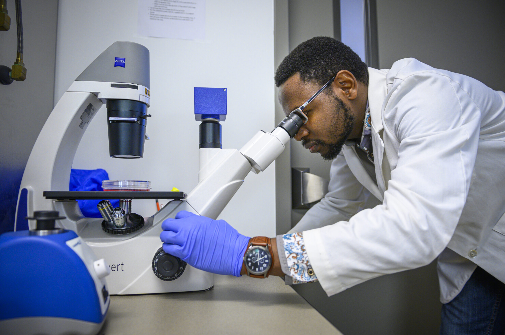
</a>
<br /><sub>11-gaddameedhi-lab_27_49134620932_o-scaled.jpg</sub>
</td>
</tr>
<tr>
<td align="center" width="33%">
<a href="images/Senthil-Natesan-Lab-Oct-2022-10-scaled-e1755879716397.jpg">
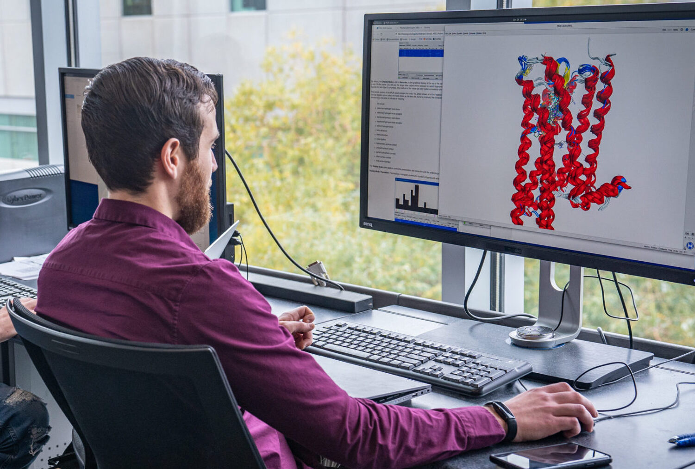
</a>
<br /><sub>Senthil-Natesan-Lab-Oct-2022-10-scaled-e1755879716397.jpg</sub>
</td>
<td align="center" width="33%">
<a href="images/20210816_Co25_3-792x526.jpg">
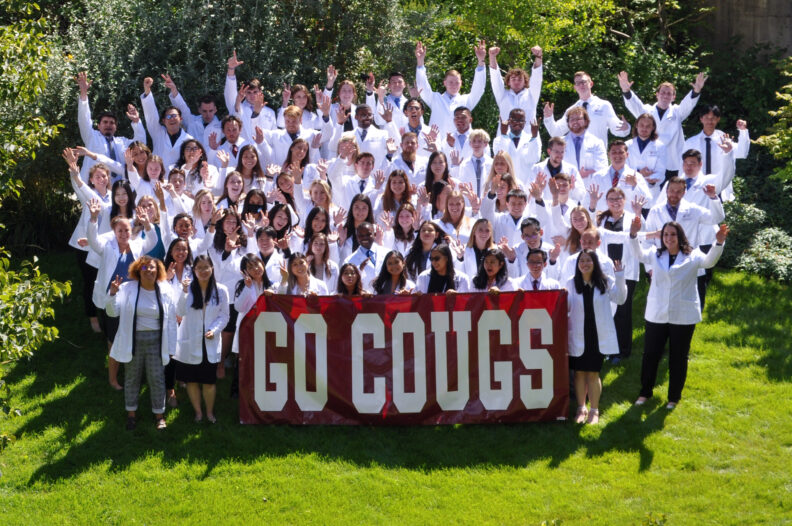
</a>
<br /><sub>20210816_Co25_3-792x526.jpg</sub>
</td>
<td align="center" width="33%">
<a href="images/image-792x523.jpeg">

</a>
<br /><sub>image-792x523.jpeg</sub>
</td>
</tr>
<tr>
<td align="center" width="33%">
<a href="images/Praventa-Telehealth-Training_18-792x528.jpg">
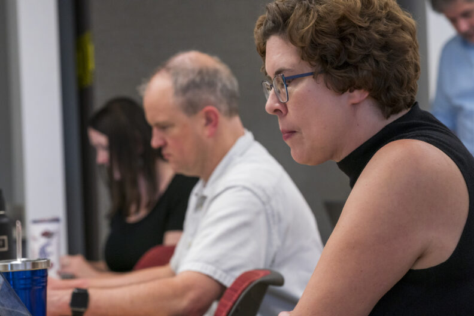
</a>
<br /><sub>Praventa-Telehealth-Training_18-792x528.jpg</sub>
</td>
<td align="center" width="33%">
<a href="images/Palouse-6-792x528.jpg">
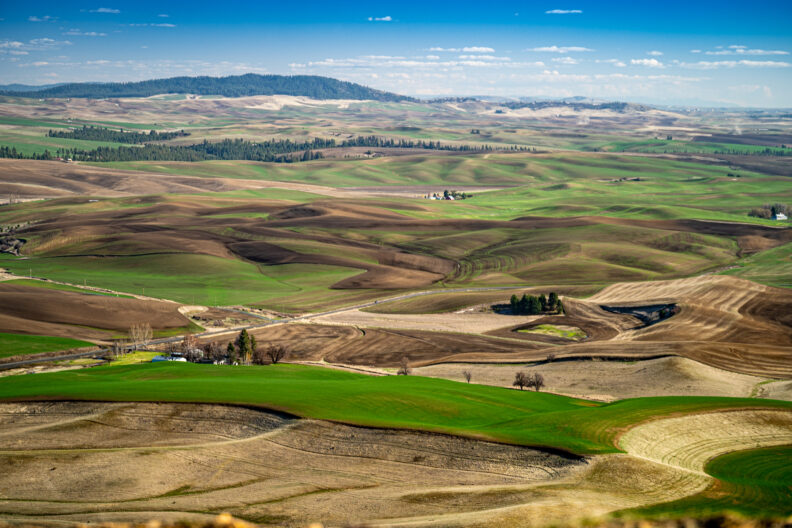
</a>
<br /><sub>Palouse-6-792x528.jpg ⚠️</sub>
</td>
<td align="center" width="33%">
<a href="images/gloves-holding-smartphone-and-glucose-monitor-792x523.jpg">
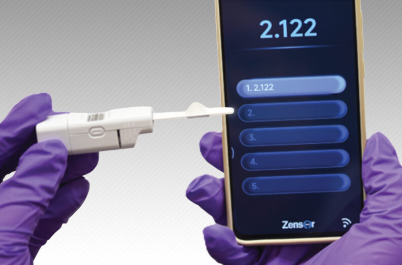
</a>
<br /><sub>gloves-holding-smartphone-and-glucose-monitor-792x523.jpg ⚠️</sub>
</td>
</tr>
<tr>
<td align="center" width="33%">
<a href="images/Jared-Kavanaugh-headshot-scaled-e1762816581496-792x570.jpg">

</a>
<br /><sub>Jared-Kavanaugh-headshot-scaled-e1762816581496-792x570.jpg ⚠️</sub>
</td>
<td align="center" width="33%">
<a href="images/Communications-Lab-Multicultural-communication-291-792x528.jpg">
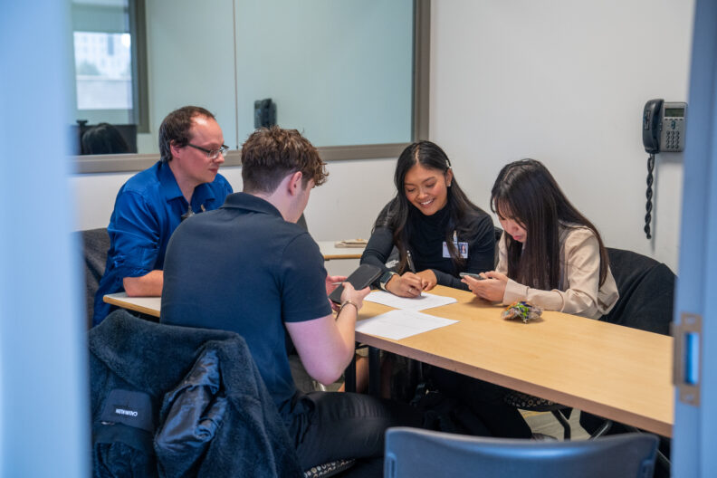
</a>
<br /><sub>Communications-Lab-Multicultural-communication-291-792x528.jpg</sub>
</td>
<td align="center" width="33%">
<a href="images/Deans-photos_6-792x528.jpg">
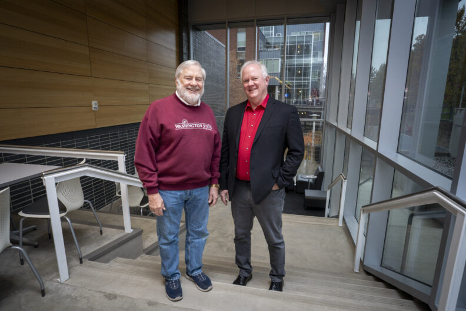
</a>
<br /><sub>Deans-photos_6-792x528.jpg ⚠️</sub>
</td>
</tr>
<tr>
<td align="center" width="33%">
<a href="images/Neumiller-Joshua-scaled-e1762454694150-792x495.jpg">

</a>
<br /><sub>Neumiller-Joshua-scaled-e1762454694150-792x495.jpg ⚠️</sub>
</td>
<td align="center" width="33%">
<a href="images/Pharmacy-Quality-Improvement-photoshoot_9-792x530.jpg">
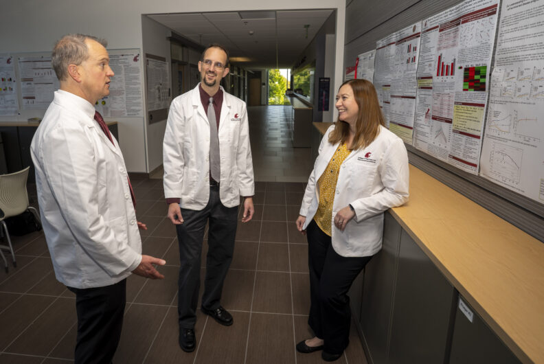
</a>
<br /><sub>Pharmacy-Quality-Improvement-photoshoot_9-792x530.jpg ⚠️</sub>
</td>
<td></td>
</tr>
</table>

</details>

<details>
<summary>⚠️ <strong>Images Missing Alt Text</strong> (14)</summary>

| Image | Source URL |
|-------|-----------|
| `Dr.-Paine-Lab-Pharmacy-Oct-2022-8-scaled.jpg` | https://wpcdn.web.wsu.edu/wp-spokane/uploads/sites/3060/2023/07/Dr.-Paine-Lab... |
| `image-2.jpg` | https://wpcdn.web.wsu.edu/wp-spokane/uploads/sites/3060/2023/08/Pharmacy-Immu... |
| `image-3.jpg` | https://wpcdn.web.wsu.edu/wp-spokane/uploads/sites/3060/2023/04/Pharmacy-Comp... |
| `Pharmacy-group-2023-2-scaled-e1685125356229.jpg` | https://wpcdn.web.wsu.edu/wp-spokane/uploads/sites/3060/2023/05/Pharmacy-grou... |
| `Pharmacy-point-of-care-Aug-2022-56-scaled-e1671572456261.jpg` | https://wpcdn.web.wsu.edu/wp-spokane/uploads/sites/3060/2022/12/Pharmacy-poin... |
| `DSC_8387-scaled.jpg` | https://wpcdn.web.wsu.edu/wp-spokane/uploads/sites/3060/2022/05/DSC_8387-scal... |
| `DSC_06491-scaled.jpg` | https://wpcdn.web.wsu.edu/wp-spokane/uploads/sites/3060/2022/09/DSC_06491-sca... |
| `SAS-EarlyAdmissions_header.jpg` | https://wpcdn.web.wsu.edu/wp-spokane/uploads/sites/3060/2022/07/SAS-EarlyAdmi... |
| `Palouse-6-792x528.jpg` | https://wpcdn.web.wsu.edu/wp-spokane/uploads/sites/3060/2022/09/Palouse-6-792... |
| `gloves-holding-smartphone-and-glucose-monitor-792x523.jpg` | https://wpcdn.web.wsu.edu/wp-spokane/uploads/sites/3060/2026/02/gloves-holdin... |
| `Jared-Kavanaugh-headshot-scaled-e1762816581496-792x570.jpg` | https://wpcdn.web.wsu.edu/wp-spokane/uploads/sites/3060/2025/11/Jared-Kavanau... |
| `Deans-photos_6-792x528.jpg` | https://wpcdn.web.wsu.edu/wp-spokane/uploads/sites/3060/2025/11/Deans-photos_... |
| `Neumiller-Joshua-scaled-e1762454694150-792x495.jpg` | https://wpcdn.web.wsu.edu/wp-spokane/uploads/sites/3060/2024/07/Neumiller-Jos... |
| `Pharmacy-Quality-Improvement-photoshoot_9-792x530.jpg` | https://wpcdn.web.wsu.edu/wp-spokane/uploads/sites/3060/2025/10/Pharmacy-Qual... |

</details>

## 📁 Files

| File | Description |
|------|-------------|
| `01-page-loaded.png` | page-loaded (1.8 MB) |
| `page.html` | Rendered HTML content |
| `metadata.json` | Machine-readable scan data |
| `errors.log` | JavaScript console errors |
| `warnings.log` | JavaScript console warnings |
| `info.log` | Navigation and timing details |
| `actions.log` | Interactions performed |
| `images/` | 20 page images (6.6 MB) |

---

*Generated by AccessibilityScanner (FreeTools) v1.0*
