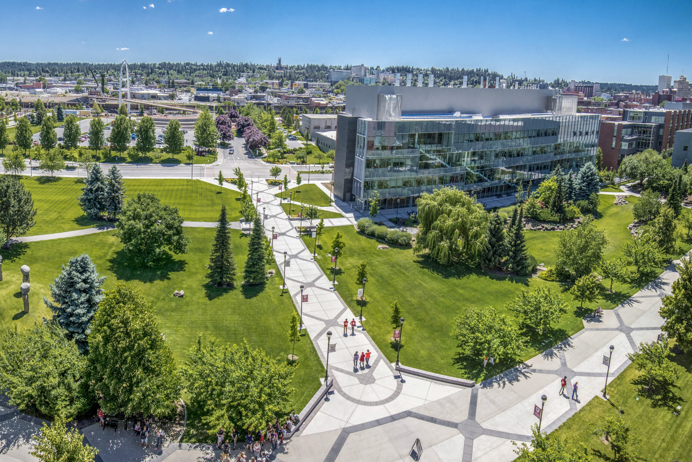

# 📄 Page Scan Report

> **URL:** https://pharmacy.wsu.edu/about/  
> **Captured:** 2026-02-16 22:17:32 UTC  
> **Status:** ✅ 200  

---

## 📑 Contents

- [Summary](#-summary)
- [Screenshots](#-screenshots)
- [Page Images](#-page-images)
- [JavaScript Errors](#-javascript-errors)
- [Actions](#-actions)
- [Files](#-files)

---

## 📋 Summary

| Field | Value |
|-------|-------|
| URL | https://pharmacy.wsu.edu/about/ |
| Title | About the College | Pharmacy and Pharmaceutical Sciences | Washington State University |
| Status | ✅ 200 |
| HTML Size | 290.8 KB |
| Screenshots | 1 (2.3 MB) |
| Images | 11 (4.5 MB) |
| Images Missing Alt | ⚠️ 8 |
| JS Errors | 🔴 4 |
| JS Warnings | 0 |
| Auth | none |
| Captured | 2026-02-16T22:17:32.1582932Z |

## 🔴 JavaScript Errors

<details>
<summary><strong>4 error(s) detected</strong></summary>

```
Failed to load resource: the server responded with a status of 405 ()
Failed to load resource: the server responded with a status of 405 ()
Failed to load resource: the server responded with a status of 405 ()
Failed to load resource: the server responded with a status of 405 ()
```

</details>

## 🔧 Actions

<details>
<summary><strong>2 action(s) performed</strong></summary>

- Screenshot #1: page-loaded (2.3 MB)
- Downloaded 11 images to /images/

</details>

## 📸 Screenshots

<table>
<tr>
<td align="center" width="50%">
<a href="01-page-loaded.png">

</a>
<br /><strong>1. page-loaded</strong>
<br /><sub>2.3 MB</sub>
</td>
<td></td>
</tr>
</table>

## 🖼️ Page Images (11)

<details open>
<summary><strong>📋 Image Index</strong> — 11 images, 4.5 MB</summary>

| # | Image | Alt Text | Size |
|--:|-------|----------|-----:|
| 1 | [Pharmacy-group-2023-2-scaled-e1685125356229.jpg](images/Pharmacy-group-2023-2-scaled-e1685125356229.jpg) | ⚠️ *(missing)* | 1.4 MB |
| 2 | [42481766195_1a27065e6c_o-edited-scaled.jpg](images/42481766195_1a27065e6c_o-edited-scaled.jpg) | ⚠️ *(missing)* | 1.3 MB |
| 3 | [Point-of-Care-Day-2_24-792x528.jpg](images/Point-of-Care-Day-2_24-792x528.jpg) | Fred Meyer Resident guides second-yea... | 108.3 KB |
| 4 | [Senthil-Natesan-Lab-Oct-2022-12-792x528.jpg](images/Senthil-Natesan-Lab-Oct-2022-12-792x528.jpg) | ⚠️ *(missing)* | 140.2 KB |
| 5 | [20230724_104655_cropped-792x792.jpg](images/20230724_104655_cropped-792x792.jpg) | ⚠️ *(missing)* | 167.9 KB |
| 6 | [image-6.jpg](images/image-6.jpg) | Events | 809.4 KB |
| 7 | [Campus-in-the-Fall-2020-22-1-792x519.jpg](images/Campus-in-the-Fall-2020-22-1-792x519.jpg) | ⚠️ *(missing)* | 186.6 KB |
| 8 | [CougaRx-Nation-Josh-Neumiller-WSUAA-Award-4-792x468.jpg](images/CougaRx-Nation-Josh-Neumiller-WSUAA-Award-4-792x468.jpg) | ⚠️ *(missing)* | 133.2 KB |
| 9 | [Pharmacy-Compound-Lab-shoot-Sep-2022-77-792x528.jpg](images/Pharmacy-Compound-Lab-shoot-Sep-2022-77-792x528.jpg) | ⚠️ *(missing)* | 118.9 KB |
| 10 | [Palouse-6-792x528.jpg](images/Palouse-6-792x528.jpg) | ⚠️ *(missing)* | 147.4 KB |
| 11 | [2017-0913_drug-info-center_by-Lori-J-Maricle_2-792x526.jpg](images/2017-0913_drug-info-center_by-Lori-J-Maricle_2-792x526.jpg) | The Drug Information Center Team work... | 98.0 KB |

</details>

<details open>
<summary><strong>🖼️ Gallery</strong></summary>

<table>
<tr>
<td align="center" width="33%">
<a href="images/Pharmacy-group-2023-2-scaled-e1685125356229.jpg">

</a>
<br /><sub>Pharmacy-group-2023-2-scaled-e1685125356229.jpg ⚠️</sub>
</td>
<td align="center" width="33%">
<a href="images/42481766195_1a27065e6c_o-edited-scaled.jpg">

</a>
<br /><sub>42481766195_1a27065e6c_o-edited-scaled.jpg ⚠️</sub>
</td>
<td align="center" width="33%">
<a href="images/Point-of-Care-Day-2_24-792x528.jpg">

</a>
<br /><sub>Point-of-Care-Day-2_24-792x528.jpg</sub>
</td>
</tr>
<tr>
<td align="center" width="33%">
<a href="images/Senthil-Natesan-Lab-Oct-2022-12-792x528.jpg">

</a>
<br /><sub>Senthil-Natesan-Lab-Oct-2022-12-792x528.jpg ⚠️</sub>
</td>
<td align="center" width="33%">
<a href="images/20230724_104655_cropped-792x792.jpg">

</a>
<br /><sub>20230724_104655_cropped-792x792.jpg ⚠️</sub>
</td>
<td align="center" width="33%">
<a href="images/image-6.jpg">

</a>
<br /><sub>image-6.jpg</sub>
</td>
</tr>
<tr>
<td align="center" width="33%">
<a href="images/Campus-in-the-Fall-2020-22-1-792x519.jpg">

</a>
<br /><sub>Campus-in-the-Fall-2020-22-1-792x519.jpg ⚠️</sub>
</td>
<td align="center" width="33%">
<a href="images/CougaRx-Nation-Josh-Neumiller-WSUAA-Award-4-792x468.jpg">

</a>
<br /><sub>CougaRx-Nation-Josh-Neumiller-WSUAA-Award-4-792x468.jpg ⚠️</sub>
</td>
<td align="center" width="33%">
<a href="images/Pharmacy-Compound-Lab-shoot-Sep-2022-77-792x528.jpg">

</a>
<br /><sub>Pharmacy-Compound-Lab-shoot-Sep-2022-77-792x528.jpg ⚠️</sub>
</td>
</tr>
<tr>
<td align="center" width="33%">
<a href="images/Palouse-6-792x528.jpg">

</a>
<br /><sub>Palouse-6-792x528.jpg ⚠️</sub>
</td>
<td align="center" width="33%">
<a href="images/2017-0913_drug-info-center_by-Lori-J-Maricle_2-792x526.jpg">

</a>
<br /><sub>2017-0913_drug-info-center_by-Lori-J-Maricle_2-792x526.jpg</sub>
</td>
<td></td>
</tr>
</table>

</details>

<details>
<summary>⚠️ <strong>Images Missing Alt Text</strong> (8)</summary>

| Image | Source URL |
|-------|-----------|
| `Pharmacy-group-2023-2-scaled-e1685125356229.jpg` | https://wpcdn.web.wsu.edu/wp-spokane/uploads/sites/3060/2023/05/Pharmacy-grou... |
| `42481766195_1a27065e6c_o-edited-scaled.jpg` | https://wpcdn.web.wsu.edu/wp-spokane/uploads/sites/3060/2025/08/42481766195_1... |
| `Senthil-Natesan-Lab-Oct-2022-12-792x528.jpg` | https://wpcdn.web.wsu.edu/wp-spokane/uploads/sites/3060/2023/11/Senthil-Nates... |
| `20230724_104655_cropped-792x792.jpg` | https://wpcdn.web.wsu.edu/wp-spokane/uploads/sites/3060/2023/10/20230724_1046... |
| `Campus-in-the-Fall-2020-22-1-792x519.jpg` | https://wpcdn.web.wsu.edu/wp-spokane/uploads/sites/3060/2023/08/Campus-in-the... |
| `CougaRx-Nation-Josh-Neumiller-WSUAA-Award-4-792x468.jpg` | https://wpcdn.web.wsu.edu/wp-spokane/uploads/sites/3060/2025/11/CougaRx-Natio... |
| `Pharmacy-Compound-Lab-shoot-Sep-2022-77-792x528.jpg` | https://wpcdn.web.wsu.edu/wp-spokane/uploads/sites/3060/2023/08/Pharmacy-Comp... |
| `Palouse-6-792x528.jpg` | https://wpcdn.web.wsu.edu/wp-spokane/uploads/sites/3060/2022/06/Palouse-6-792... |

</details>

## 📁 Files

| File | Description |
|------|-------------|
| `01-page-loaded.png` | page-loaded (2.3 MB) |
| `page.html` | Rendered HTML content |
| `metadata.json` | Machine-readable scan data |
| `errors.log` | JavaScript console errors |
| `warnings.log` | JavaScript console warnings |
| `info.log` | Navigation and timing details |
| `actions.log` | Interactions performed |
| `images/` | 11 page images (4.5 MB) |

---

*Generated by AccessibilityScanner (FreeTools) v1.0*
