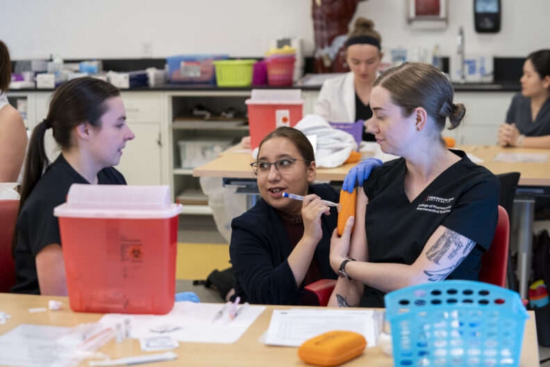
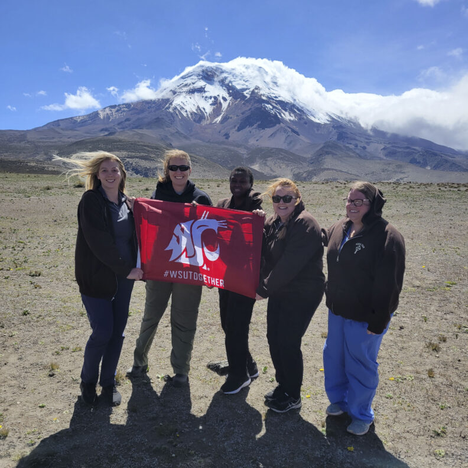
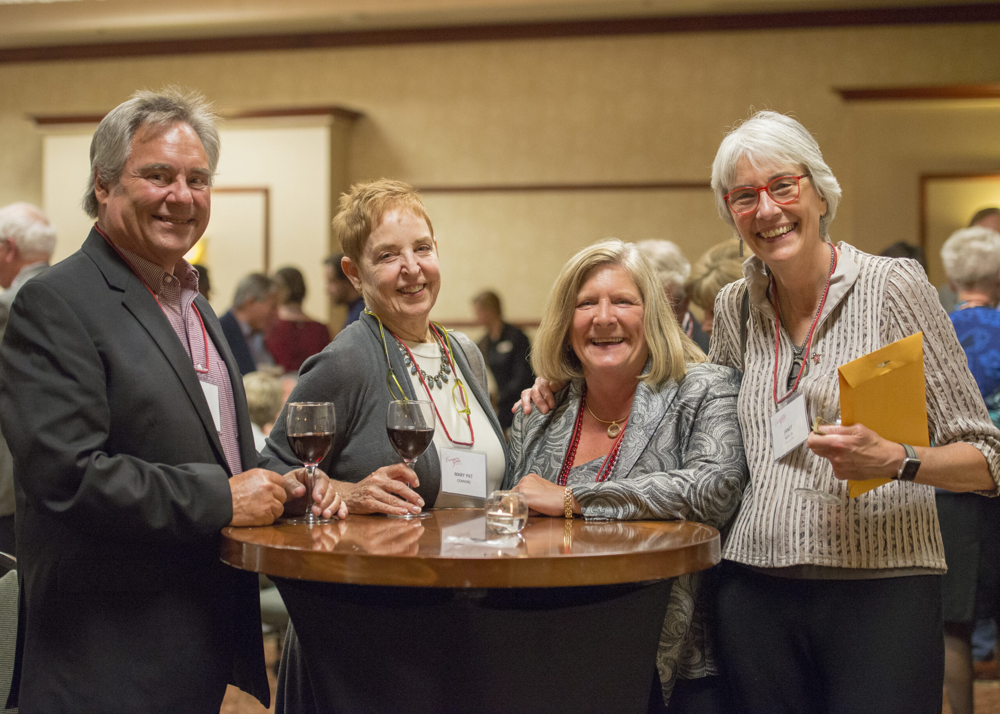
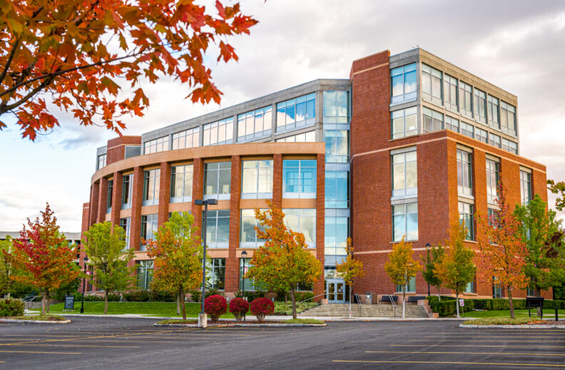
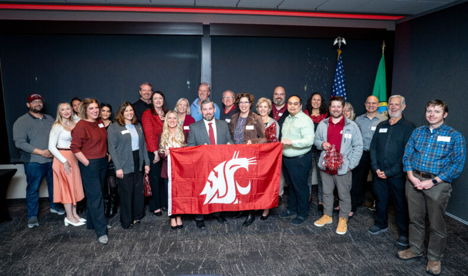
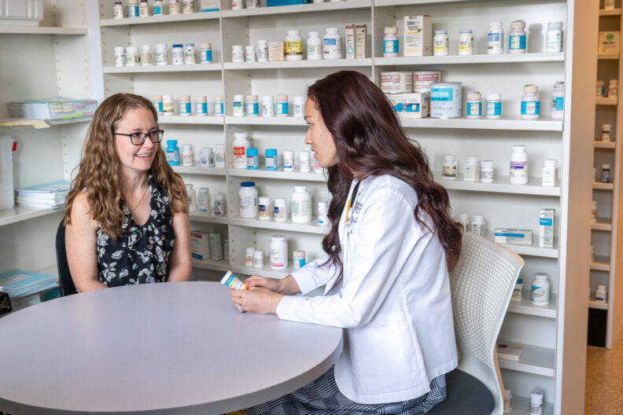
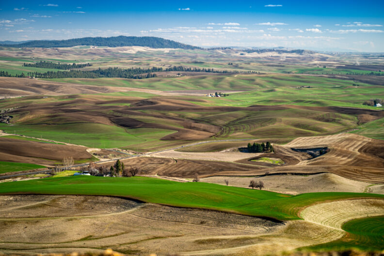
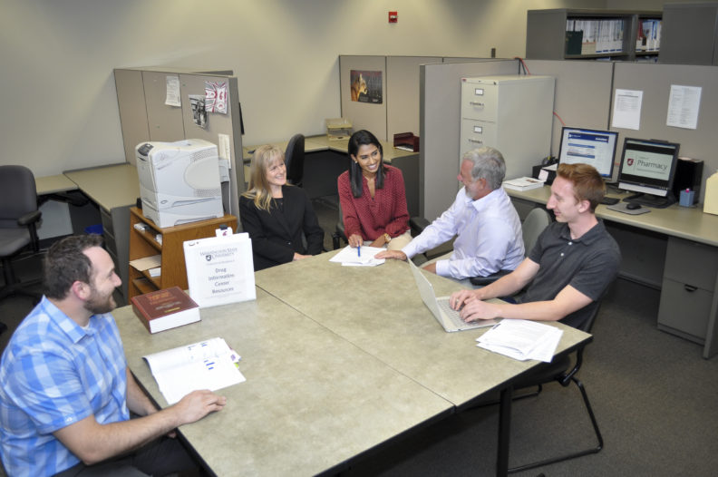

# Page Scan Report

| Field | Value |
|-------|-------|
| URL | https://pharmacy.wsu.edu/about/ |
| Title | About the College | Pharmacy and Pharmaceutical Sciences | Washington State University |
| Status | ❌ 0 |
| HTML Size | 281.2 KB |
| Screenshots | 1 (2.4 MB) |
| Images | 9 (1.9 MB) |
| Images Missing Alt | 6 |
| JS Errors | 4 |
| JS Warnings | 0 |
| Auth | none |
| Captured | 2026-02-16T21:00:20.7743452Z |

## JavaScript Errors

- `Failed to load resource: the server responded with a status of 405 ()`
- `Failed to load resource: the server responded with a status of 405 ()`
- `Failed to load resource: the server responded with a status of 405 ()`
- `Failed to load resource: the server responded with a status of 405 ()`

## Actions

- Screenshot #1: page-loaded (2.4 MB)
- Downloaded 9 images to /images/

## Screenshots

### 1. page-loaded

## Page Images (9)

| # | Image | Alt Text | Size |
|---|-------|----------|------|
| 1 | [Point-of-Care-Day-2_24-792x528.jpg](images/Point-of-Care-Day-2_24-792x528.jpg) | Fred Meyer Resident guides second-yea... | 108.3 KB |
| 2 | [Senthil-Natesan-Lab-Oct-2022-12-792x528.jpg](images/Senthil-Natesan-Lab-Oct-2022-12-792x528.jpg) | *(none)* | 140.2 KB |
| 3 | [20230724_104655_cropped-792x792.jpg](images/20230724_104655_cropped-792x792.jpg) | *(none)* | 167.9 KB |
| 4 | [image-4.jpg](images/image-4.jpg) | Events | 809.4 KB |
| 5 | [Campus-in-the-Fall-2020-22-1-792x519.jpg](images/Campus-in-the-Fall-2020-22-1-792x519.jpg) | *(none)* | 186.6 KB |
| 6 | [CougaRx-Nation-Josh-Neumiller-WSUAA-Award-4-792x468.jpg](images/CougaRx-Nation-Josh-Neumiller-WSUAA-Award-4-792x468.jpg) | *(none)* | 133.2 KB |
| 7 | [Pharmacy-Compound-Lab-shoot-Sep-2022-77-792x528.jpg](images/Pharmacy-Compound-Lab-shoot-Sep-2022-77-792x528.jpg) | *(none)* | 118.9 KB |
| 8 | [Palouse-6-792x528.jpg](images/Palouse-6-792x528.jpg) | *(none)* | 147.4 KB |
| 9 | [2017-0913_drug-info-center_by-Lori-J-Maricle_2-792x526.jpg](images/2017-0913_drug-info-center_by-Lori-J-Maricle_2-792x526.jpg) | The Drug Information Center Team work... | 98.0 KB |

### Gallery

### ⚠️ Images Missing Alt Text (6)

- `Senthil-Natesan-Lab-Oct-2022-12-792x528.jpg` — https://wpcdn.web.wsu.edu/wp-spokane/uploads/sites/3060/2023/11/Senthil-Natesan-Lab-Oct-2022-12-792x528.jpg
- `20230724_104655_cropped-792x792.jpg` — https://wpcdn.web.wsu.edu/wp-spokane/uploads/sites/3060/2023/10/20230724_104655_cropped-792x792.jpg
- `Campus-in-the-Fall-2020-22-1-792x519.jpg` — https://wpcdn.web.wsu.edu/wp-spokane/uploads/sites/3060/2023/08/Campus-in-the-Fall-2020-22-1-792x519.jpg
- `CougaRx-Nation-Josh-Neumiller-WSUAA-Award-4-792x468.jpg` — https://wpcdn.web.wsu.edu/wp-spokane/uploads/sites/3060/2025/11/CougaRx-Nation-Josh-Neumiller-WSUAA-Award-4-792x468.jpg
- `Pharmacy-Compound-Lab-shoot-Sep-2022-77-792x528.jpg` — https://wpcdn.web.wsu.edu/wp-spokane/uploads/sites/3060/2023/08/Pharmacy-Compound-Lab-shoot-Sep-2022-77-792x528.jpg
- `Palouse-6-792x528.jpg` — https://wpcdn.web.wsu.edu/wp-spokane/uploads/sites/3060/2022/06/Palouse-6-792x528.jpg

## Files

- `01-page-loaded.png` — page-loaded (2.4 MB)
- `page.html` — rendered HTML content
- `metadata.json` — machine-readable scan data
- `errors.log` — JavaScript console errors
- `warnings.log` — JavaScript console warnings
- `info.log` — navigation and timing details
- `actions.log` — interactions performed on the page
- `images/` — 9 page images (1.9 MB)
