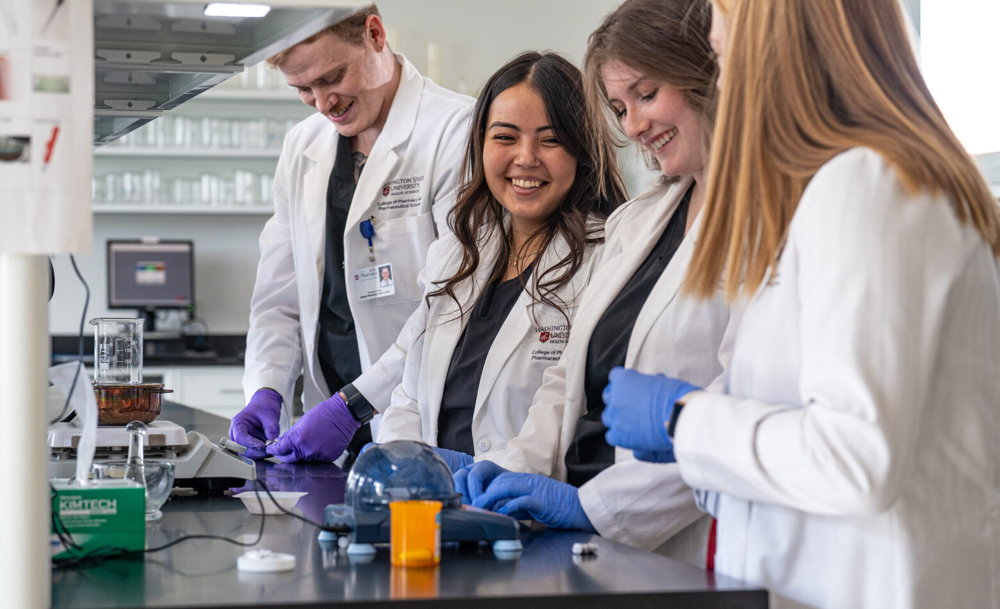
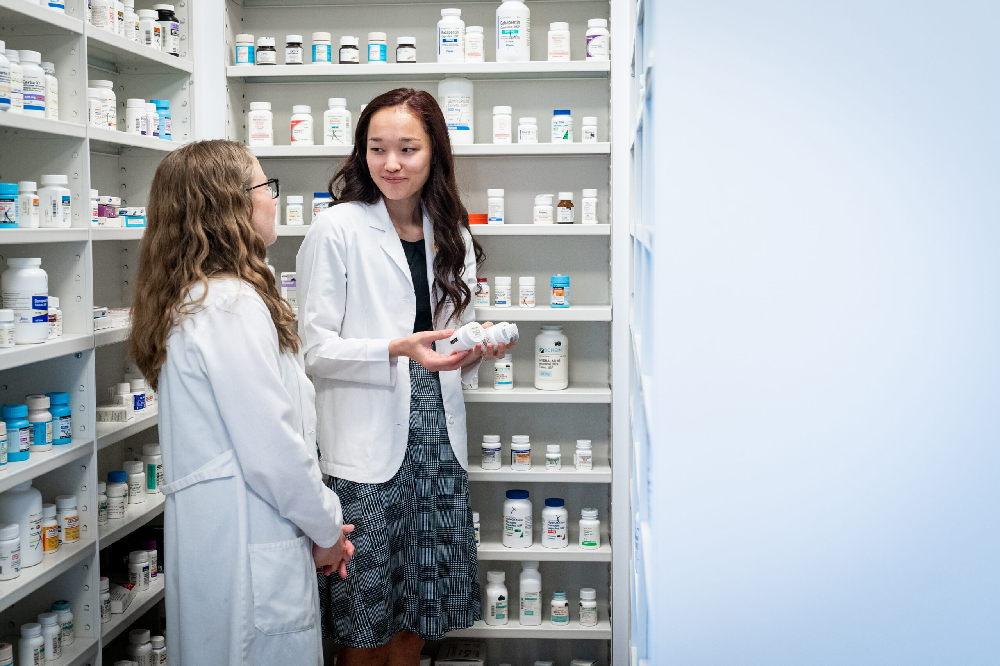

# Page Scan Report

| Field | Value |
|-------|-------|
| URL | https://pharmacy.wsu.edu/admissions/ |
| Redirected To | https://pharmacy.wsu.edu/pharmd/admissions/ |
| Title | PharmD Admissions | Pharmacy and Pharmaceutical Sciences | Washington State University |
| Status | ❌ 0 |
| HTML Size | 315.3 KB |
| Screenshots | 1 (2.3 MB) |
| Images | 2 (1.1 MB) |
| Images Missing Alt | 2 |
| JS Errors | 4 |
| JS Warnings | 0 |
| Auth | none |
| Captured | 2026-02-16T20:39:40.7108499Z |

## JavaScript Errors

- `Failed to load resource: the server responded with a status of 405 ()`
- `Failed to load resource: the server responded with a status of 405 ()`
- `Failed to load resource: the server responded with a status of 405 ()`
- `Failed to load resource: the server responded with a status of 405 ()`

## Actions

- Screenshot #1: page-loaded (2.3 MB)
- Downloaded 2 images to /images/

## Screenshots

### 1. page-loaded

## Page Images (2)

| # | Image | Alt Text | Size |
|---|-------|----------|------|
| 1 | [image-1.jpg](images/image-1.jpg) | *(none)* | 537.9 KB |
| 2 | [Pharmacy-Compound-Lab-shoot-Sep-2022-69-scaled.jpg](images/Pharmacy-Compound-Lab-shoot-Sep-2022-69-scaled.jpg) | *(none)* | 562.7 KB |

### Gallery

### ⚠️ Images Missing Alt Text (2)

- `image-1.jpg` — https://wpcdn.web.wsu.edu/wp-spokane/uploads/sites/3060/2023/04/Pharmacy-Compound-Lab-shoot-Sep-2022-39-scaled-e1681407575281.jpg
- `Pharmacy-Compound-Lab-shoot-Sep-2022-69-scaled.jpg` — https://wpcdn.web.wsu.edu/wp-spokane/uploads/sites/3060/2023/08/Pharmacy-Compound-Lab-shoot-Sep-2022-69-scaled.jpg

## Files

- `01-page-loaded.png` — page-loaded (2.3 MB)
- `page.html` — rendered HTML content
- `metadata.json` — machine-readable scan data
- `errors.log` — JavaScript console errors
- `warnings.log` — JavaScript console warnings
- `info.log` — navigation and timing details
- `actions.log` — interactions performed on the page
- `images/` — 2 page images (1.1 MB)
