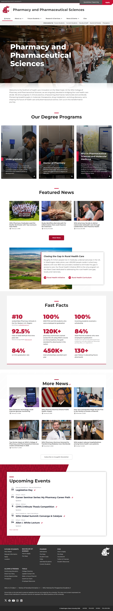
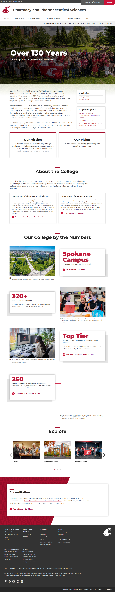
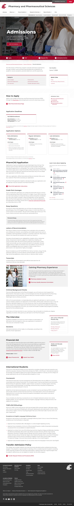
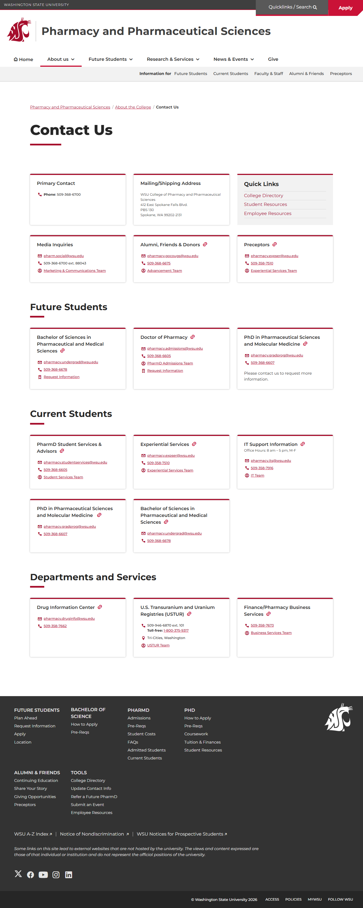
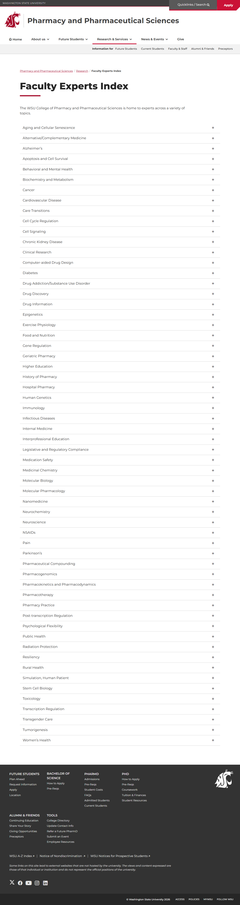
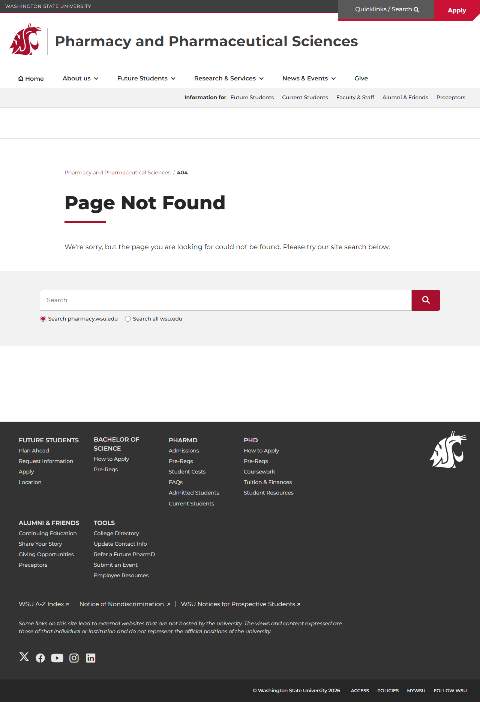

# Site Report: https://pharmacy.wsu.edu/

| Metric | Value |
|--------|-------|
| Status | ⚠️ 5/7 pages OK |
| Pages Scanned | 7 |
| Pages Passed | 5 |
| Pages Failed | 2 |
| Total JS Errors | 101 |
| Total JS Warnings | 1 |
| Total HTML | 2.2 MB |
| Total Screenshots | 12.4 MB |
| Folder | `pharmacy-wsu-edu/` |

## Pages

| Status | Page | HTTP | Title | JS Errors | JS Warnings | Screenshots |
|--------|------|------|-------|-----------|-------------|-------------|
| ❌ | [/](_root/report.md) | 0 | Pharmacy and Pharmaceutical Sciences ... | 1 | 0 | 1 |
| ✅ | [/about/](about/report.md) | 200 | About the College \| Pharmacy and Pha... | 4 | 0 | 1 |
| ✅ | [/admissions/](admissions/report.md) | 200 | PharmD Admissions \| Pharmacy and Pha... | 4 | 0 | 1 |
| ✅ | [/contact/](contact/report.md) | 200 | Contact Us \| Pharmacy and Pharmaceut... | 4 | 0 | 1 |
| ✅ | [/faculty/](faculty/report.md) | 200 | Faculty Experts Index \| Pharmacy and... | 79 | 0 | 1 |
| ❌ | [/programs/](programs/report.md) | 404 | Page not found \| Pharmacy and Pharma... | 5 | 1 | 1 |
| ✅ | [/research/](research/report.md) | 200 | Research \| Pharmacy and Pharmaceutic... | 4 | 0 | 1 |

## Page Screenshots

### [/](_root/report.md)

### [/about/](about/report.md)

### [/admissions/](admissions/report.md)

### [/contact/](contact/report.md)

### [/faculty/](faculty/report.md)

### [/programs/](programs/report.md)

### [/research/](research/report.md)

## Failed Pages

### /

- **URL:** https://pharmacy.wsu.edu/
- **Status:** 0

### /programs/

- **URL:** https://pharmacy.wsu.edu/programs/
- **Status:** 404

## Pages with JavaScript Errors

### /faculty/ (79 errors)

- `Failed to load resource: the server responded with a status of 405 ()`
- `Failed to load resource: the server responded with a status of 405 ()`
- `Failed to load resource: the server responded with a status of 405 ()`
- `Failed to load resource: the server responded with a status of 405 ()`
- `Access to fetch at 'https://people.wsu.edu/wp-json/peopleapi/v1/people?count=10&page=1&nid=travis.denton,%20senthil.n...`
- `Failed to load resource: net::ERR_FAILED`
- `TypeError: Failed to fetch
    at new G (https://cdn.web.wsu.edu/designsystem/2.x/dist/bundles/standalone/people-list...`
- `Access to fetch at 'https://people.wsu.edu/wp-json/peopleapi/v1/people?count=10&page=1&nid=levient&university-organiz...`
- `Failed to load resource: net::ERR_FAILED`
- `TypeError: Failed to fetch
    at new G (https://cdn.web.wsu.edu/designsystem/2.x/dist/bundles/standalone/people-list...`
- ... and 69 more (see `faculty/errors.log`)

### /programs/ (5 errors)

- `Failed to load resource: the server responded with a status of 404 ()`
- `Failed to load resource: the server responded with a status of 405 ()`
- `Failed to load resource: the server responded with a status of 405 ()`
- `Failed to load resource: the server responded with a status of 405 ()`
- `Failed to load resource: the server responded with a status of 405 ()`

### /about/ (4 errors)

- `Failed to load resource: the server responded with a status of 405 ()`
- `Failed to load resource: the server responded with a status of 405 ()`
- `Failed to load resource: the server responded with a status of 405 ()`
- `Failed to load resource: the server responded with a status of 405 ()`

### /admissions/ (4 errors)

- `Failed to load resource: the server responded with a status of 405 ()`
- `Failed to load resource: the server responded with a status of 405 ()`
- `Failed to load resource: the server responded with a status of 405 ()`
- `Failed to load resource: the server responded with a status of 405 ()`

### /research/ (4 errors)

- `Failed to load resource: the server responded with a status of 405 ()`
- `Failed to load resource: the server responded with a status of 405 ()`
- `Failed to load resource: the server responded with a status of 405 ()`
- `Failed to load resource: the server responded with a status of 405 ()`

### /contact/ (4 errors)

- `Failed to load resource: the server responded with a status of 405 ()`
- `Failed to load resource: the server responded with a status of 405 ()`
- `Failed to load resource: the server responded with a status of 405 ()`
- `Failed to load resource: the server responded with a status of 405 ()`

### / (1 errors)

- `Failed to load resource: net::ERR_SOCKET_NOT_CONNECTED`

---

*Generated by AccessibilityScanner (FreeTools) v1.0*
