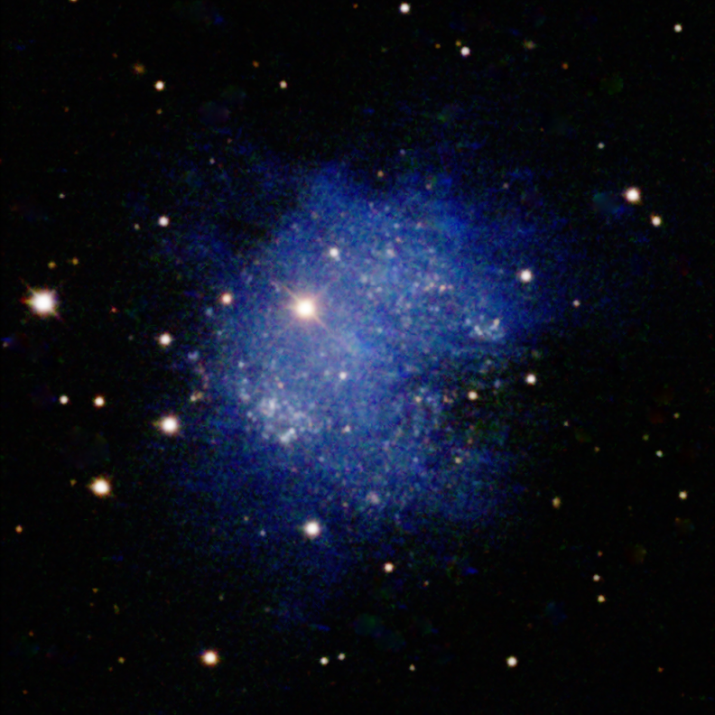
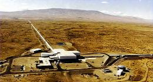
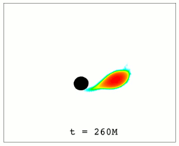
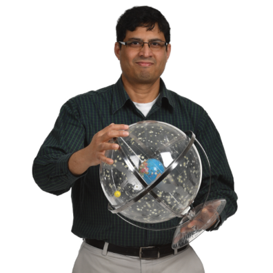
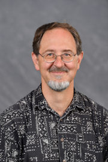

# Page Scan Report

| Field | Value |
|-------|-------|
| URL | https://physics.wsu.edu/astronomy/ |
| Redirected To | https://physics.wsu.edu/overview-research/astronomy-and-astrophysics/ |
| Title | Astronomy and astrophysics | Department of Physics & Astronomy | Washington State University |
| Status | ❌ 0 |
| HTML Size | 228.5 KB |
| Screenshots | 1 (911.6 KB) |
| Images | 10 (1.4 MB) |
| Images Missing Alt | 7 |
| JS Errors | 0 |
| JS Warnings | 0 |
| Auth | none |
| Captured | 2026-02-16T21:00:52.1741398Z |

## Actions

- Screenshot #1: page-loaded (911.6 KB)
- Downloaded 10 images to /images/

## Screenshots

### 1. page-loaded

## Page Images (10)

| # | Image | Alt Text | Size |
|---|-------|----------|------|
| 1 | [sex_a_987px-792x792.png](images/sex_a_987px-792x792.png) | The dwarf irregular galaxy Sextans A. | 763.3 KB |
| 2 | [LIGO-Hanford-small.jpg](images/LIGO-Hanford-small.jpg) | Aerial view of the LIGO facility. | 11.9 KB |
| 3 | [bhns.gif](images/bhns.gif) | Animation of a neutron star being dis... | 48.8 KB |
| 4 | [Allen_Michael1.jpg](images/Allen_Michael1.jpg) | *(none)* | 72.8 KB |
| 5 | [Baldassare-Vivienne.jpg](images/Baldassare-Vivienne.jpg) | *(none)* | 27.5 KB |
| 6 | [Bose-Sukanta-e1733406722960-396x396.png](images/Bose-Sukanta-e1733406722960-396x396.png) | *(none)* | 148.2 KB |
| 7 | [MariaCharisi-396x396.png](images/MariaCharisi-396x396.png) | *(none)* | 212.4 KB |
| 8 | [Duez_Matthew1.jpg](images/Duez_Matthew1.jpg) | *(none)* | 54.3 KB |
| 9 | [Michael-Forbes-scaled-e1715792875176-396x453.jpeg](images/Michael-Forbes-scaled-e1715792875176-396x453.jpeg) | *(none)* | 24.4 KB |
| 10 | [Worthey-G.jpg](images/Worthey-G.jpg) | *(none)* | 19.5 KB |

### Gallery

### ⚠️ Images Missing Alt Text (7)

- `Allen_Michael1.jpg` — https://s3.wp.wsu.edu/uploads/sites/908/2023/11/Allen_Michael1.jpg
- `Baldassare-Vivienne.jpg` — https://s3.wp.wsu.edu/uploads/sites/908/2023/11/Baldassare-Vivienne.jpg
- `Bose-Sukanta-e1733406722960-396x396.png` — https://s3.wp.wsu.edu/uploads/sites/908/2023/11/Bose-Sukanta-e1733406722960-396x396.png
- `MariaCharisi-396x396.png` — https://s3.wp.wsu.edu/uploads/sites/908/2023/11/MariaCharisi-396x396.png
- `Duez_Matthew1.jpg` — https://s3.wp.wsu.edu/uploads/sites/908/2023/11/Duez_Matthew1.jpg
- `Michael-Forbes-scaled-e1715792875176-396x453.jpeg` — https://s3.wp.wsu.edu/uploads/sites/908/2017/11/Michael-Forbes-scaled-e1715792875176-396x453.jpeg
- `Worthey-G.jpg` — https://s3.wp.wsu.edu/uploads/sites/908/2023/11/Worthey-G.jpg

## Files

- `01-page-loaded.png` — page-loaded (911.6 KB)
- `page.html` — rendered HTML content
- `metadata.json` — machine-readable scan data
- `errors.log` — JavaScript console errors
- `warnings.log` — JavaScript console warnings
- `info.log` — navigation and timing details
- `actions.log` — interactions performed on the page
- `images/` — 10 page images (1.4 MB)
