# Page Scan Report

| Field | Value |
|-------|-------|
| URL | https://physics.wsu.edu/faculty/ |
| Redirected To | https://physics.wsu.edu/faculty-staff/ |
| Title | Faculty | Department of Physics & Astronomy | Washington State University |
| Status | ❌ 0 |
| HTML Size | 278.2 KB |
| Screenshots | 1 (1.6 MB) |
| Images | 31 (1.5 MB) |
| Images Missing Alt | 31 |
| JS Errors | 0 |
| JS Warnings | 0 |
| Auth | none |
| Captured | 2026-02-16T21:00:21.2714845Z |

## Actions

- Screenshot #1: page-loaded (1.6 MB)
- Downloaded 31 images to /images/

## Screenshots

### 1. page-loaded

## Page Images (31)

| # | Image | Alt Text | Size |
|---|-------|----------|------|
| 1 | [Allen_Michael1.jpg](images/Allen_Michael1.jpg) | *(none)* | 72.8 KB |
| 2 | [Baldassare-Vivienne.jpg](images/Baldassare-Vivienne.jpg) | *(none)* | 27.5 KB |
| 3 | [Bose-Sukanta-e1733406722960-396x396.png](images/Bose-Sukanta-e1733406722960-396x396.png) | *(none)* | 148.2 KB |
| 4 | [Cerruti_Nicholas1.jpg](images/Cerruti_Nicholas1.jpg) | *(none)* | 51.3 KB |
| 5 | [MariaCharisi-396x396.png](images/MariaCharisi-396x396.png) | *(none)* | 212.4 KB |
| 6 | [Brian-Collins-DSC_6256-396x396.jpg](images/Brian-Collins-DSC_6256-396x396.jpg) | *(none)* | 34.4 KB |
| 7 | [Faculty_Dolan-396x390.jpg](images/Faculty_Dolan-396x390.jpg) | *(none)* | 34.9 KB |
| 8 | [Duez_Matthew1.jpg](images/Duez_Matthew1.jpg) | *(none)* | 54.3 KB |
| 9 | [Eilers_2021-scaled-e1668459340879-396x416.jpg](images/Eilers_2021-scaled-e1668459340879-396x416.jpg) | *(none)* | 46.2 KB |
| 10 | [Peter-Engels-scaled-1-e1733405784172-396x380.jpg](images/Peter-Engels-scaled-1-e1733405784172-396x380.jpg) | *(none)* | 25.1 KB |
| 11 | [Michael-Forbes-scaled-e1715792875176-396x453.jpeg](images/Michael-Forbes-scaled-e1715792875176-396x453.jpeg) | *(none)* | 24.4 KB |
| 12 | [Gittes-2020Awards-e1733511135964.jpg](images/Gittes-2020Awards-e1733511135964.jpg) | *(none)* | 33.6 KB |
| 13 | [Yi-Gu.jpg](images/Yi-Gu.jpg) | *(none)* | 29.5 KB |
| 14 | [picture-e1733436510415.png](images/picture-e1733436510415.png) | *(none)* | 49.5 KB |
| 15 | [AnyaGuy.jpg](images/AnyaGuy.jpg) | *(none)* | 28.0 KB |
| 16 | [image-16.jpg](images/image-16.jpg) | *(none)* | 60.0 KB |
| 17 | [Jensen_Reduced4-396x396.jpg](images/Jensen_Reduced4-396x396.jpg) | *(none)* | 25.1 KB |
| 18 | [Keane_christopher1.jpg](images/Keane_christopher1.jpg) | *(none)* | 44.8 KB |
| 19 | [Kuzyk_Mark1-e1738803223263.jpg](images/Kuzyk_Mark1-e1738803223263.jpg) | *(none)* | 28.8 KB |
| 20 | [Landry_BW-256px.png](images/Landry_BW-256px.png) | *(none)* | 39.4 KB |
| 21 | [Marston_Philip.jpg](images/Marston_Philip.jpg) | *(none)* | 37.0 KB |
| 22 | [John-McCloy.jpg](images/John-McCloy.jpg) | *(none)* | 23.3 KB |
| 23 | [McCluskey-Matt_Medium-Res-scaled-e1668466777372-396x436.jpg](images/McCluskey-Matt_Medium-Res-scaled-e1668466777372-396x436.jpg) | *(none)* | 26.1 KB |
| 24 | [Mei-Yefeng--e1738803348190.jpg](images/Mei-Yefeng--e1738803348190.jpg) | *(none)* | 7.0 KB |
| 25 | [George-Newman-396x594-1.jpg](images/George-Newman-396x594-1.jpg) | *(none)* | 84.7 KB |
| 26 | [Saam-labcloseup-396x396.jpg](images/Saam-labcloseup-396x396.jpg) | *(none)* | 42.4 KB |
| 27 | [Sun-Kuei-396x396-1.jpg](images/Sun-Kuei-396x396-1.jpg) | *(none)* | 41.5 KB |
| 28 | [smqpa_2019_0020-e1738803703660-396x396.jpg](images/smqpa_2019_0020-e1738803703660-396x396.jpg) | *(none)* | 40.7 KB |
| 29 | [jose-vazquez-bello.jpg](images/jose-vazquez-bello.jpg) | *(none)* | 56.1 KB |
| 30 | [KRV-2.8-940-square-396x396.jpeg](images/KRV-2.8-940-square-396x396.jpeg) | *(none)* | 51.6 KB |
| 31 | [Worthey-G.jpg](images/Worthey-G.jpg) | *(none)* | 19.5 KB |

### Gallery

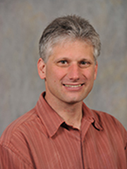

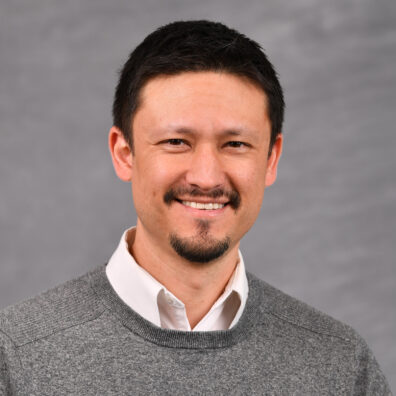

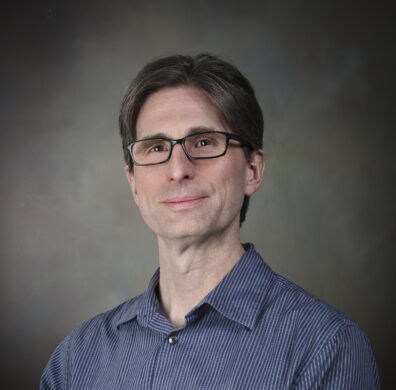

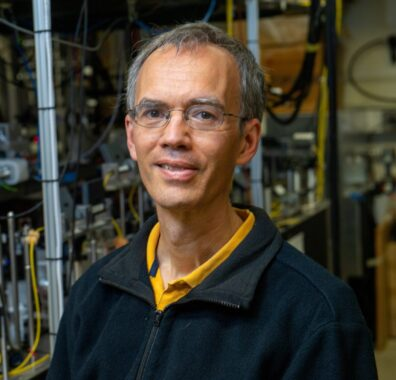

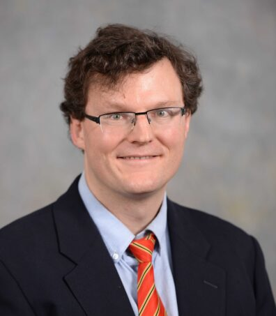

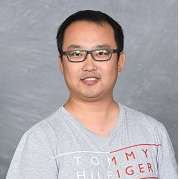

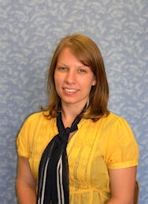

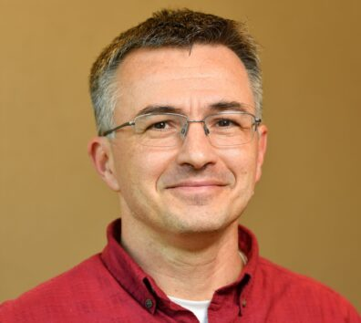

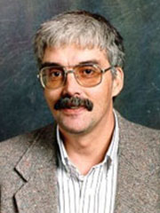

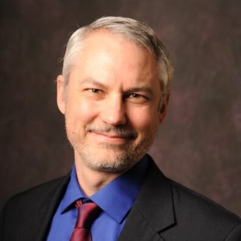

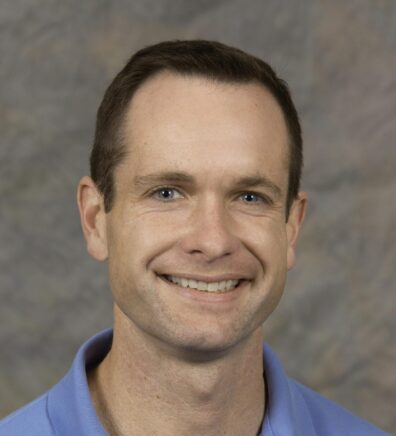

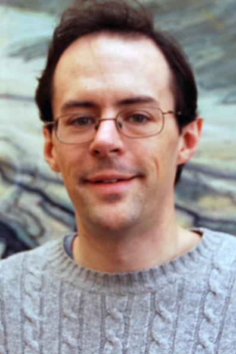

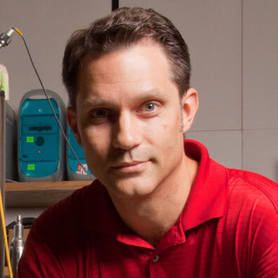

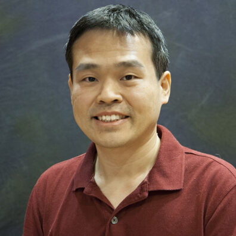

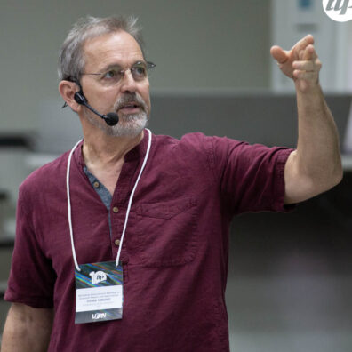

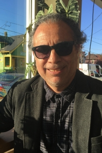

### ⚠️ Images Missing Alt Text (31)

- `Allen_Michael1.jpg` — https://s3.wp.wsu.edu/uploads/sites/908/2023/11/Allen_Michael1.jpg
- `Baldassare-Vivienne.jpg` — https://s3.wp.wsu.edu/uploads/sites/908/2023/11/Baldassare-Vivienne.jpg
- `Bose-Sukanta-e1733406722960-396x396.png` — https://s3.wp.wsu.edu/uploads/sites/908/2023/11/Bose-Sukanta-e1733406722960-396x396.png
- `Cerruti_Nicholas1.jpg` — https://s3.wp.wsu.edu/uploads/sites/908/2023/11/Cerruti_Nicholas1.jpg
- `MariaCharisi-396x396.png` — https://s3.wp.wsu.edu/uploads/sites/908/2023/11/MariaCharisi-396x396.png
- `Brian-Collins-DSC_6256-396x396.jpg` — https://s3.wp.wsu.edu/uploads/sites/908/2017/11/Brian-Collins-DSC_6256-396x396.jpg
- `Faculty_Dolan-396x390.jpg` — https://s3.wp.wsu.edu/uploads/sites/908/2024/08/Faculty_Dolan-396x390.jpg
- `Duez_Matthew1.jpg` — https://s3.wp.wsu.edu/uploads/sites/908/2023/11/Duez_Matthew1.jpg
- `Eilers_2021-scaled-e1668459340879-396x416.jpg` — https://s3.wp.wsu.edu/uploads/sites/908/2019/12/Eilers_2021-scaled-e1668459340879-396x416.jpg
- `Peter-Engels-scaled-1-e1733405784172-396x380.jpg` — https://s3.wp.wsu.edu/uploads/sites/908/2023/11/Peter-Engels-scaled-1-e1733405784172-396x380.jpg
- `Michael-Forbes-scaled-e1715792875176-396x453.jpeg` — https://s3.wp.wsu.edu/uploads/sites/908/2017/11/Michael-Forbes-scaled-e1715792875176-396x453.jpeg
- `Gittes-2020Awards-e1733511135964.jpg` — https://s3.wp.wsu.edu/uploads/sites/908/2023/11/Gittes-2020Awards-e1733511135964.jpg
- `Yi-Gu.jpg` — https://s3.wp.wsu.edu/uploads/sites/908/2023/11/Yi-Gu.jpg
- `picture-e1733436510415.png` — https://s3.wp.wsu.edu/uploads/sites/908/2023/11/picture-e1733436510415.png
- `AnyaGuy.jpg` — https://s3.wp.wsu.edu/uploads/sites/908/2023/11/AnyaGuy.jpg
- `image-16.jpg` — https://s3.wp.wsu.edu/uploads/sites/908/2022/11/Researcher_Hawreliak-web-2019-1-scaled-e1668467702165-396x354.jpg
- `Jensen_Reduced4-396x396.jpg` — https://s3.wp.wsu.edu/uploads/sites/908/2023/10/Jensen_Reduced4-396x396.jpg
- `Keane_christopher1.jpg` — https://s3.wp.wsu.edu/uploads/sites/908/2023/11/Keane_christopher1.jpg
- `Kuzyk_Mark1-e1738803223263.jpg` — https://s3.wp.wsu.edu/uploads/sites/908/2023/11/Kuzyk_Mark1-e1738803223263.jpg
- `Landry_BW-256px.png` — https://s3.wp.wsu.edu/uploads/sites/908/2025/07/Landry_BW-256px.png
- `Marston_Philip.jpg` — https://s3.wp.wsu.edu/uploads/sites/908/2023/11/Marston_Philip.jpg
- `John-McCloy.jpg` — https://s3.wp.wsu.edu/uploads/sites/908/2021/08/John-McCloy.jpg
- `McCluskey-Matt_Medium-Res-scaled-e1668466777372-396x436.jpg` — https://s3.wp.wsu.edu/uploads/sites/908/2022/11/McCluskey-Matt_Medium-Res-scaled-e1668466777372-396x436.jpg
- `Mei-Yefeng--e1738803348190.jpg` — https://s3.wp.wsu.edu/uploads/sites/908/2023/11/Mei-Yefeng--e1738803348190.jpg
- `George-Newman-396x594-1.jpg` — https://s3.wp.wsu.edu/uploads/sites/908/2023/11/George-Newman-396x594-1.jpg
- `Saam-labcloseup-396x396.jpg` — https://s3.wp.wsu.edu/uploads/sites/908/2023/09/Saam-labcloseup-396x396.jpg
- `Sun-Kuei-396x396-1.jpg` — https://s3.wp.wsu.edu/uploads/sites/908/2024/05/Sun-Kuei-396x396-1.jpg
- `smqpa_2019_0020-e1738803703660-396x396.jpg` — https://s3.wp.wsu.edu/uploads/sites/908/2023/11/smqpa_2019_0020-e1738803703660-396x396.jpg
- `jose-vazquez-bello.jpg` — https://s3.wp.wsu.edu/uploads/sites/908/2023/11/jose-vazquez-bello.jpg
- `KRV-2.8-940-square-396x396.jpeg` — https://s3.wp.wsu.edu/uploads/sites/908/2024/07/KRV-2.8-940-square-396x396.jpeg
- `Worthey-G.jpg` — https://s3.wp.wsu.edu/uploads/sites/908/2023/11/Worthey-G.jpg

## Files

- `01-page-loaded.png` — page-loaded (1.6 MB)
- `page.html` — rendered HTML content
- `metadata.json` — machine-readable scan data
- `errors.log` — JavaScript console errors
- `warnings.log` — JavaScript console warnings
- `info.log` — navigation and timing details
- `actions.log` — interactions performed on the page
- `images/` — 31 page images (1.5 MB)
