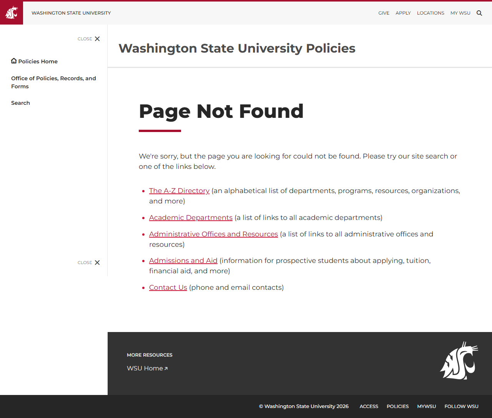
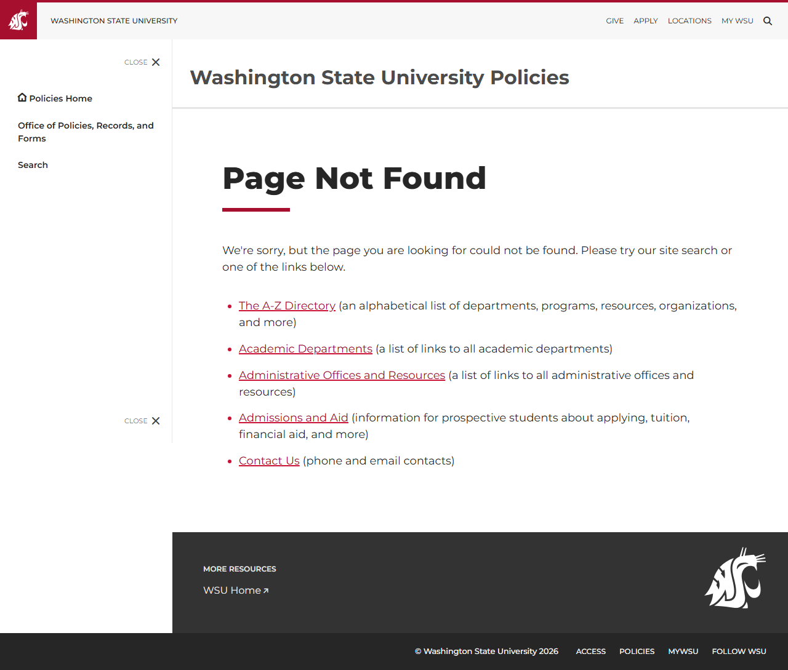

# Site Report: https://policies.wsu.edu/

| Metric | Value |
|--------|-------|
| Status | ⚠️ 1/5 pages OK |
| Pages Scanned | 5 |
| Pages Passed | 1 |
| Pages Failed | 4 |
| Total JS Errors | 8 |
| Total JS Warnings | 0 |
| Total HTML | 283.0 KB |
| Total Screenshots | 661.6 KB |
| Folder | `policies-wsu-edu/` |

## Pages

| Status | Page | HTTP | Title | JS Errors | JS Warnings | Screenshots |
|--------|------|------|-------|-----------|-------------|-------------|
| ✅ | [/](_root/report.md) | 200 | Washington State University Policies ... | 4 | 0 | 1 |
| ❌ | [/about/](about/report.md) | 404 | Page not found \| Washington State Un... | 1 | 0 | 1 |
| ❌ | [/bppm/](bppm/report.md) | 404 | Page not found \| Washington State Un... | 1 | 0 | 1 |
| ❌ | [/manuals/](manuals/report.md) | 404 | Page not found \| Washington State Un... | 1 | 0 | 1 |
| ❌ | [/search/](search/report.md) | 404 | Page not found \| Washington State Un... | 1 | 0 | 1 |

## Page Screenshots

### [/](_root/report.md)

### [/about/](about/report.md)

### [/bppm/](bppm/report.md)

### [/manuals/](manuals/report.md)

### [/search/](search/report.md)

## Failed Pages

### /manuals/

- **URL:** https://policies.wsu.edu/manuals/
- **Status:** 404

### /search/

- **URL:** https://policies.wsu.edu/search/
- **Status:** 404

### /bppm/

- **URL:** https://policies.wsu.edu/bppm/
- **Status:** 404

### /about/

- **URL:** https://policies.wsu.edu/about/
- **Status:** 404

## Pages with JavaScript Errors

### / (4 errors)

- `Failed to load resource: net::ERR_SOCKET_NOT_CONNECTED`
- `Failed to load resource: net::ERR_SOCKET_NOT_CONNECTED`
- `Failed to load resource: net::ERR_SOCKET_NOT_CONNECTED`
- `Failed to load resource: net::ERR_SOCKET_NOT_CONNECTED`

### /manuals/ (1 errors)

- `Failed to load resource: the server responded with a status of 404 ()`

### /search/ (1 errors)

- `Failed to load resource: the server responded with a status of 404 ()`

### /bppm/ (1 errors)

- `Failed to load resource: the server responded with a status of 404 ()`

### /about/ (1 errors)

- `Failed to load resource: the server responded with a status of 404 ()`

---

*Generated by AccessibilityScanner (FreeTools) v1.0*
