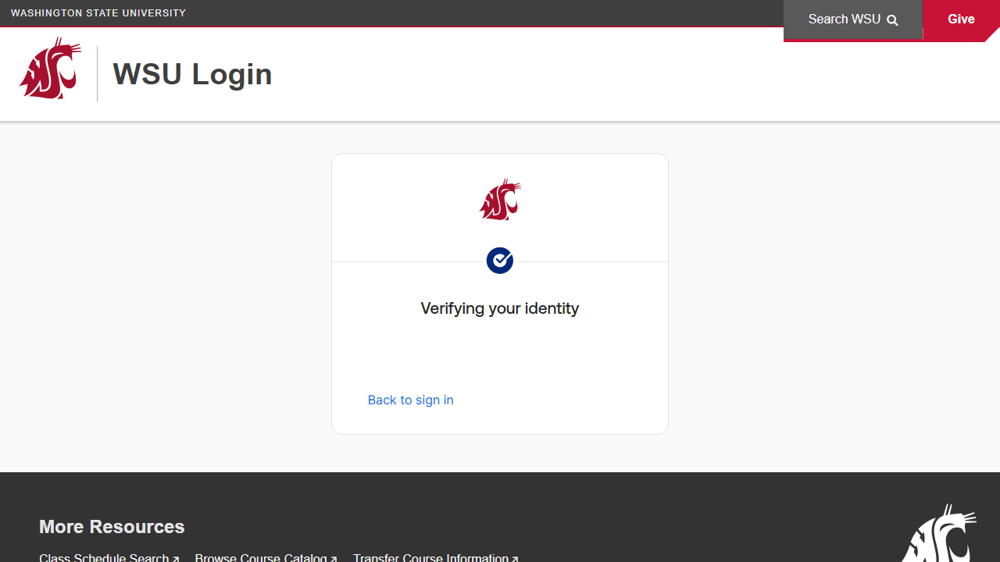
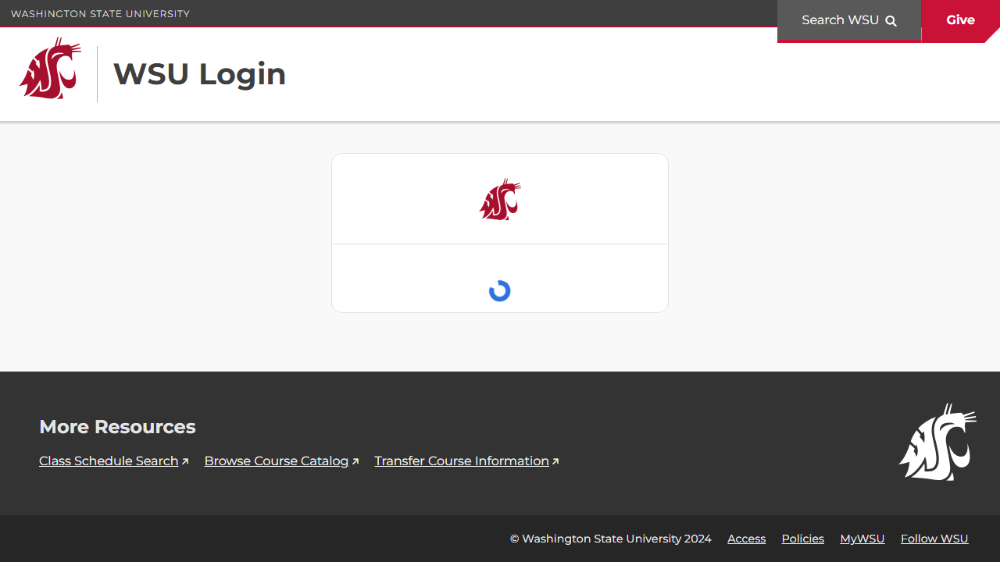

# Site Report: https://portal.wsu.edu/

| Metric | Value |
|--------|-------|
| Status | ⚠️ 0/3 pages OK |
| Pages Scanned | 3 |
| Pages Passed | 0 |
| Pages Failed | 3 |
| Total JS Errors | 8 |
| Total JS Warnings | 0 |
| Total HTML | 282.7 KB |
| Total Screenshots | 114.5 KB |
| Total Images | 3 (23.0 KB) |
| Images Missing Alt | 0 |
| Folder | `portal-wsu-edu/` |

## Pages

| Status | Page | HTTP | Title | JS Errors | Images | Missing Alt |
|--------|------|------|-------|-----------|--------|-------------|
| ❌ | [/](_root/report.md) | 0 | WSU \| Sign In | 8 | 1 | 0 |
| ❌ | [/help/](help/report.md) | 0 | WSU Authentication \| Washington Stat... | 0 | 1 | 0 |
| ❌ | [/services/](services/report.md) | 0 | WSU Authentication \| Washington Stat... | 0 | 1 | 0 |

## Page Screenshots

### [/](_root/report.md)

### [/help/](help/report.md)

### [/services/](services/report.md)

## Failed Pages

### /

- **URL:** https://portal.wsu.edu/
- **Status:** 0

### /help/

- **URL:** https://portal.wsu.edu/help/
- **Status:** 0

### /services/

- **URL:** https://portal.wsu.edu/services/
- **Status:** 0

## Pages with JavaScript Errors

### / (8 errors)

- `Failed to load resource: net::ERR_SOCKET_NOT_CONNECTED`
- `Something unexpected happened while we were checking url http://127.0.0.1:8769`
- `Something unexpected happened while we were checking url http://127.0.0.1:65111`
- `Something unexpected happened while we were checking url http://127.0.0.1:65121`
- `Something unexpected happened while we were checking url http://127.0.0.1:65131`
- `Something unexpected happened while we were checking url http://127.0.0.1:65141`
- `Something unexpected happened while we were checking url http://127.0.0.1:65151`
- `No available ports. Loopback server failed and polling is cancelled.`

---

*Generated by AccessibilityScanner (FreeTools) v1.0*
