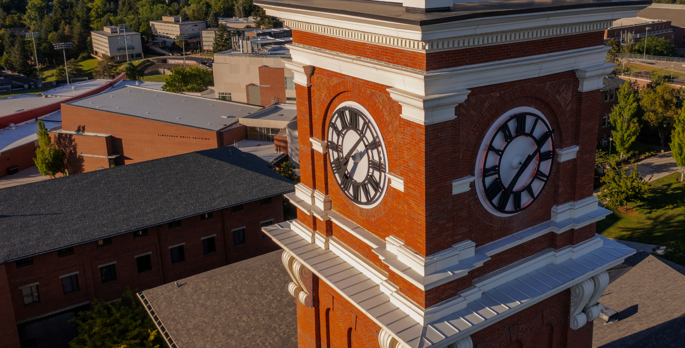
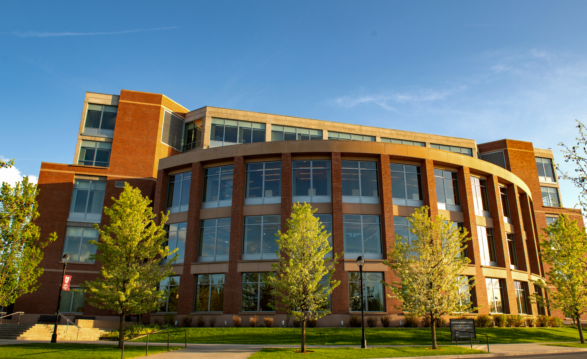
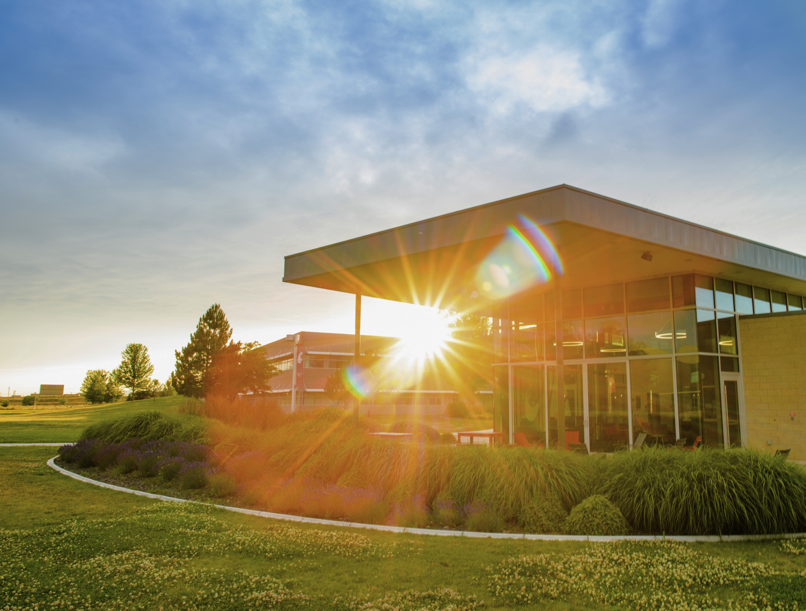
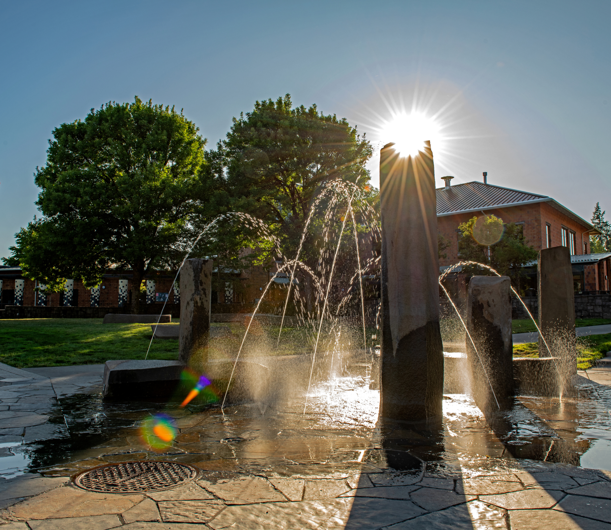
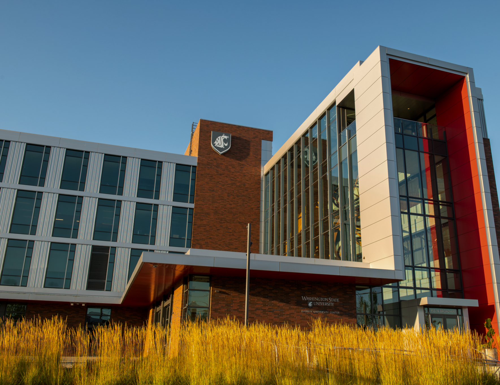

# 📄 Page Scan Report

> **URL:** https://president.wsu.edu/  
> **Captured:** 2026-02-16 22:16:12 UTC  
> **Status:** ✅ 200  

---

## 📑 Contents

- [Summary](#-summary)
- [Screenshots](#-screenshots)
- [Page Images](#-page-images)
- [Actions](#-actions)
- [Files](#-files)

---

## 📋 Summary

| Field | Value |
|-------|-------|
| URL | https://president.wsu.edu/ |
| Title | Office of the President | Washington State University |
| Status | ✅ 200 |
| HTML Size | 65.4 KB |
| Screenshots | 1 (1.0 MB) |
| Images | 7 (14.5 MB) |
| Images Missing Alt | ⚠️ 7 |
| JS Errors | ✅ 0 |
| JS Warnings | 2 |
| Auth | none |
| Captured | 2026-02-16T22:16:12.9910184Z |

## 🔧 Actions

<strong>2 action(s) performed</strong>

- Screenshot #1: page-loaded (1.0 MB)
- Downloaded 7 images to /images/

## 📸 Screenshots

<table>
<tr>
<td align="center" width="50%">

 <strong>1. page-loaded</strong>
 1.0 MB
</td>
<td></td>
</tr>
</table>

## 🖼️ Page Images (7)

<strong>📋 Image Index</strong> — 7 images, 14.5 MB

| # | Image | Alt Text | Size |
|--:|-------|----------|-----:|
| 1 | [Aerial_BryanTower_0323-1-1.jpg](images/Aerial_BryanTower_0323-1-1.jpg) | ⚠️ *(missing)* | 2.0 MB |
| 2 | [WSU-Spokane-Campus_4822-1-1.jpg](images/WSU-Spokane-Campus_4822-1-1.jpg) | ⚠️ *(missing)* | 2.7 MB |
| 3 | [WSUTri_Cities_5842-1.jpg](images/WSUTri_Cities_5842-1.jpg) | ⚠️ *(missing)* | 2.2 MB |
| 4 | [Vancouver-Fall-Core_9402-2.jpg](images/Vancouver-Fall-Core_9402-2.jpg) | ⚠️ *(missing)* | 3.5 MB |
| 5 | [Everett_1947-1.jpg](images/Everett_1947-1.jpg) | ⚠️ *(missing)* | 2.5 MB |
| 6 | [20150429-Dead-Week-Studying-_-1020-1.jpg](images/20150429-Dead-Week-Studying-_-1020-1.jpg) | ⚠️ *(missing)* | 1.5 MB |
| 7 | [Elizabeth-Cantwell_1057-792x567.jpg](images/Elizabeth-Cantwell_1057-792x567.jpg) | ⚠️ *(missing)* | 61.8 KB |

<strong>🖼️ Gallery</strong>

<table>
<tr>
<td align="center" width="33%">

 Aerial_BryanTower_0323-1-1.jpg ⚠️
</td>
<td align="center" width="33%">

 WSU-Spokane-Campus_4822-1-1.jpg ⚠️
</td>
<td align="center" width="33%">

 WSUTri_Cities_5842-1.jpg ⚠️
</td>
</tr>
<tr>
<td align="center" width="33%">

 Vancouver-Fall-Core_9402-2.jpg ⚠️
</td>
<td align="center" width="33%">

 Everett_1947-1.jpg ⚠️
</td>
<td align="center" width="33%">

 20150429-Dead-Week-Studying-_-1020-1.jpg ⚠️
</td>
</tr>
<tr>
<td align="center" width="33%">

 Elizabeth-Cantwell_1057-792x567.jpg ⚠️
</td>
<td></td>
<td></td>
</tr>
</table>

⚠️ <strong>Images Missing Alt Text</strong> (7)

| Image | Source URL |
|-------|-----------|
| `Aerial_BryanTower_0323-1-1.jpg` | https://wpcdn.web.wsu.edu/wp-president/uploads/sites/3090/2022/08/Aerial_Brya... |
| `WSU-Spokane-Campus_4822-1-1.jpg` | https://wpcdn.web.wsu.edu/wp-president/uploads/sites/3090/2022/08/WSU-Spokane... |
| `WSUTri_Cities_5842-1.jpg` | https://wpcdn.web.wsu.edu/wp-president/uploads/sites/3090/2022/08/WSUTri_Citi... |
| `Vancouver-Fall-Core_9402-2.jpg` | https://wpcdn.web.wsu.edu/wp-president/uploads/sites/3090/2022/08/Vancouver-F... |
| `Everett_1947-1.jpg` | https://wpcdn.web.wsu.edu/wp-president/uploads/sites/3090/2022/08/Everett_194... |
| `20150429-Dead-Week-Studying-_-1020-1.jpg` | https://wpcdn.web.wsu.edu/wp-president/uploads/sites/3090/2022/08/20150429-De... |
| `Elizabeth-Cantwell_1057-792x567.jpg` | https://wpcdn.web.wsu.edu/wp-president/uploads/sites/3090/2025/04/Elizabeth-C... |

## 📁 Files

| File | Description |
|------|-------------|
| `01-page-loaded.png` | page-loaded (1.0 MB) |
| `page.html` | Rendered HTML content |
| `metadata.json` | Machine-readable scan data |
| `errors.log` | JavaScript console errors |
| `warnings.log` | JavaScript console warnings |
| `info.log` | Navigation and timing details |
| `actions.log` | Interactions performed |
| `images/` | 7 page images (14.5 MB) |

---

*Generated by AccessibilityScanner (FreeTools) v1.0*
