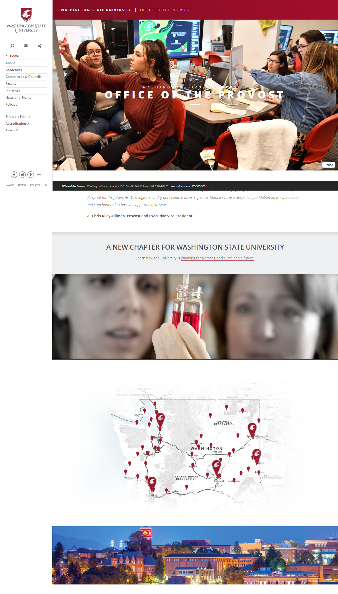
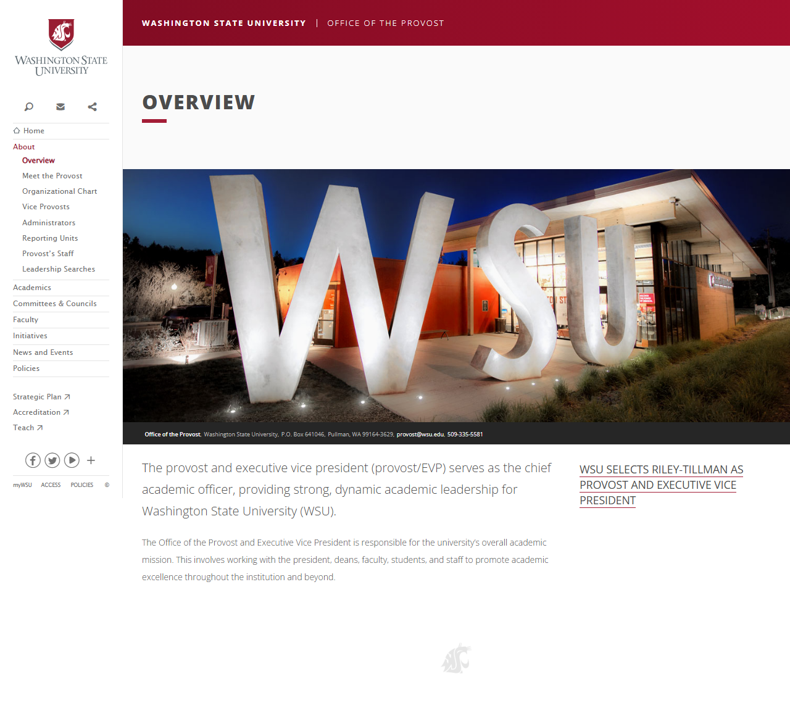
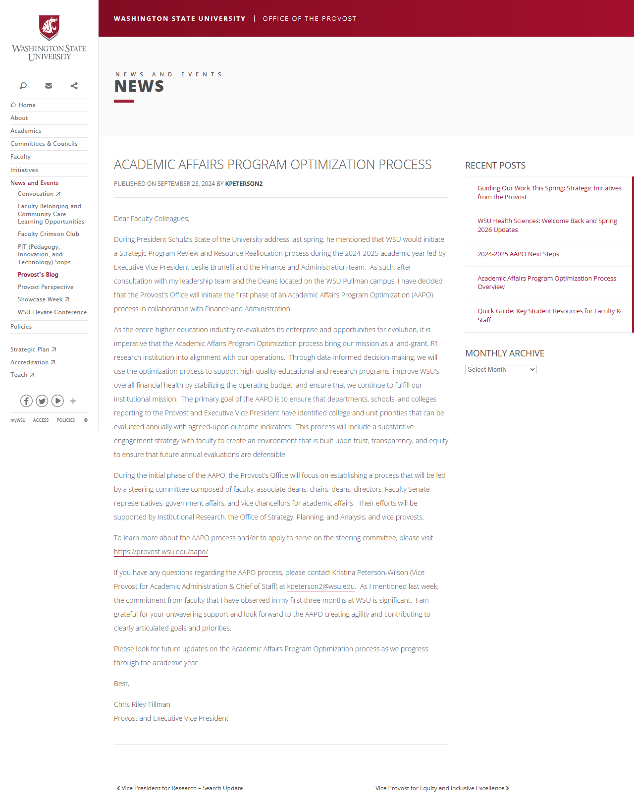
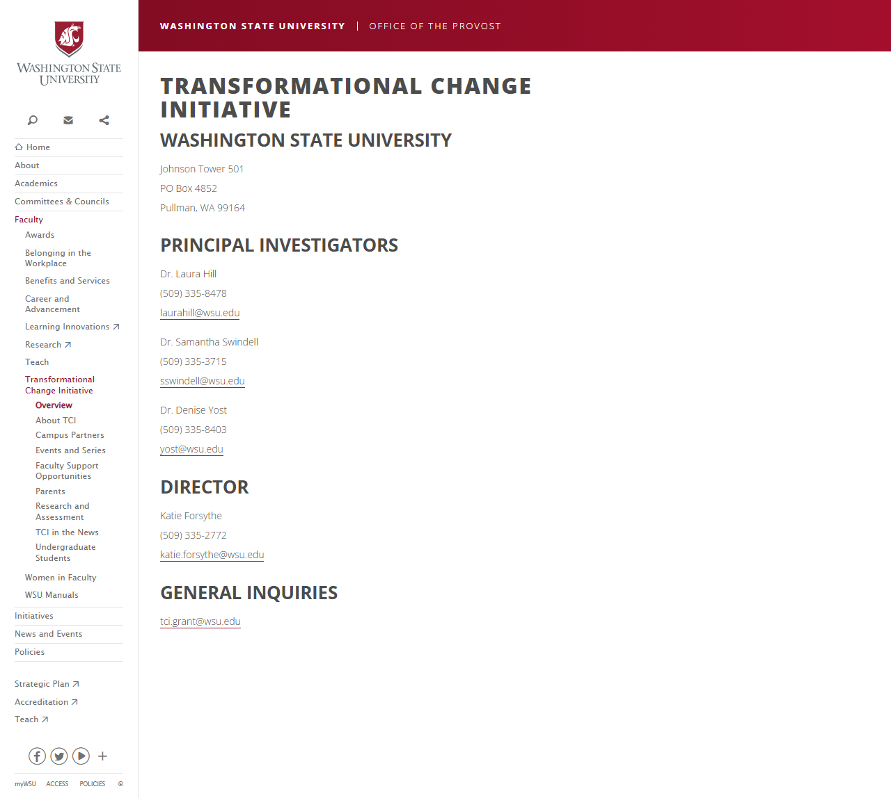
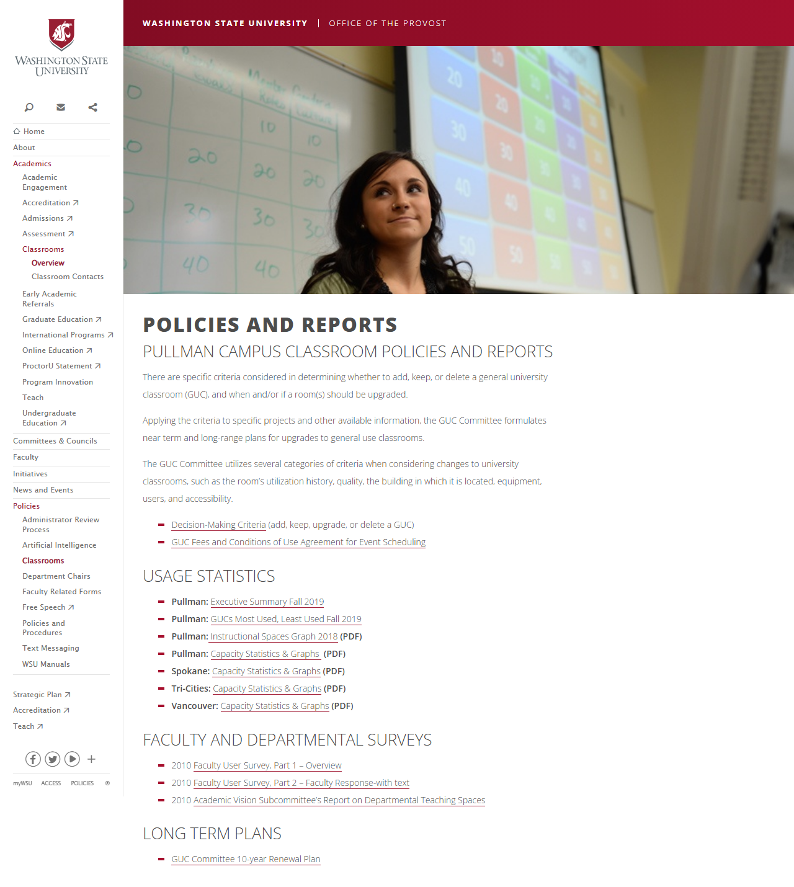
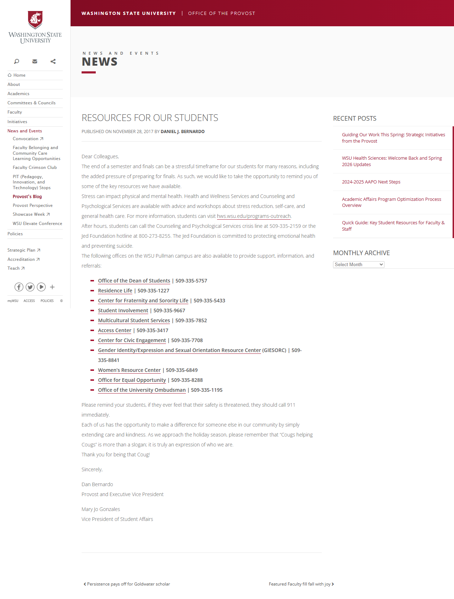

# Site Report: https://provost.wsu.edu/

| Metric | Value |
|--------|-------|
| Status | ✅ 6/6 pages OK |
| Pages Scanned | 6 |
| Pages Passed | 6 |
| Pages Failed | 0 |
| Total JS Errors | 1 |
| Total JS Warnings | 0 |
| Total HTML | 663.4 KB |
| Total Screenshots | 3.6 MB |
| Folder | `provost-wsu-edu/` |

## Pages

| Status | Page | HTTP | Title | JS Errors | JS Warnings | Screenshots |
|--------|------|------|-------|-----------|-------------|-------------|
| ✅ | [/](_root/report.md) | 200 | Office of the Provost \| Washington S... | 1 | 0 | 1 |
| ✅ | [/about/](about/report.md) | 200 | About \| Office of the Provost \| Was... | 0 | 0 | 1 |
| ✅ | [/academic-affairs/](academic-affairs/report.md) | 200 | Academic Affairs Program Optimization... | 0 | 0 | 1 |
| ✅ | [/contact/](contact/report.md) | 200 | Contact Us \| Office of the Provost \... | 0 | 0 | 1 |
| ✅ | [/policies/](policies/report.md) | 200 | Policies and Reports \| Office of the... | 0 | 0 | 1 |
| ✅ | [/resources/](resources/report.md) | 200 | Resources for our students \| Office ... | 0 | 0 | 1 |

## Page Screenshots

### [/](_root/report.md)

### [/about/](about/report.md)

### [/academic-affairs/](academic-affairs/report.md)

### [/contact/](contact/report.md)

### [/policies/](policies/report.md)

### [/resources/](resources/report.md)

## Pages with JavaScript Errors

### / (1 errors)

- `Failed to load resource: net::ERR_SOCKET_NOT_CONNECTED`

---

*Generated by AccessibilityScanner (FreeTools) v1.0*
