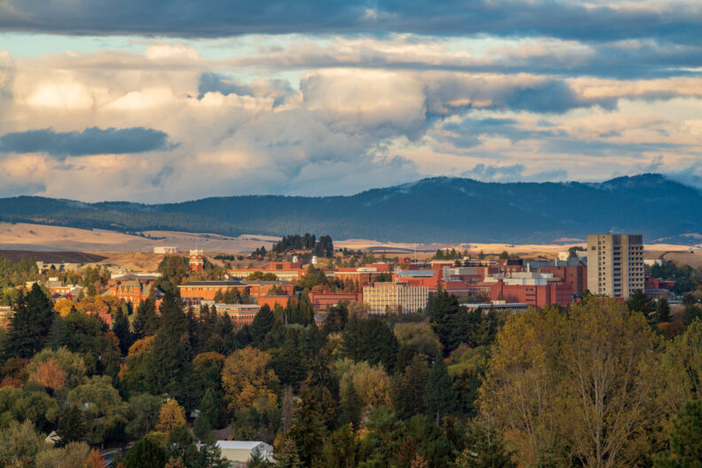

# Page Scan Report

| Field | Value |
|-------|-------|
| URL | https://pullman.wsu.edu/about/ |
| Title | About WSU Pullman | Pullman Campus | Washington State University |
| Status | ❌ 0 |
| HTML Size | 53.8 KB |
| Screenshots | 1 (1.4 MB) |
| Images | 5 (1010.0 KB) |
| Images Missing Alt | 0 |
| JS Errors | 0 |
| JS Warnings | 0 |
| Auth | none |
| Captured | 2026-02-16T20:37:59.9456455Z |

## Actions

- Screenshot #1: page-loaded (1.4 MB)
- Downloaded 5 images to /images/

## Screenshots

### 1. page-loaded

## Page Images (5)

| # | Image | Alt Text | Size |
|---|-------|----------|------|
| 1 | [Campus-Night-View_7754-1900x1252-1.jpg](images/Campus-Night-View_7754-1900x1252-1.jpg) | Scenic view of campus at twilight on ... | 409.4 KB |
| 2 | [SunsetStormClouds_0571-1900x1267-1-792x528.jpg](images/SunsetStormClouds_0571-1900x1267-1-792x528.jpg) | WSU Pullman from the horizion | 112.9 KB |
| 3 | [library-road-e1605824401570-792x564.jpg](images/library-road-e1605824401570-792x564.jpg) | Students walk up the main mall on WSU... | 199.1 KB |
| 4 | [Spark-Building_0032-1900x1241-1-792x517.jpg](images/Spark-Building_0032-1900x1241-1-792x517.jpg) | The Spark on the mall at WSU Pullman | 116.8 KB |
| 5 | [Mask-Group-32@2x-scaled-2-792x566.jpg](images/Mask-Group-32@2x-scaled-2-792x566.jpg) | Students at a sporting event smile at... | 171.8 KB |

### Gallery

## Files

- `01-page-loaded.png` — page-loaded (1.4 MB)
- `page.html` — rendered HTML content
- `metadata.json` — machine-readable scan data
- `errors.log` — JavaScript console errors
- `warnings.log` — JavaScript console warnings
- `info.log` — navigation and timing details
- `actions.log` — interactions performed on the page
- `images/` — 5 page images (1010.0 KB)
