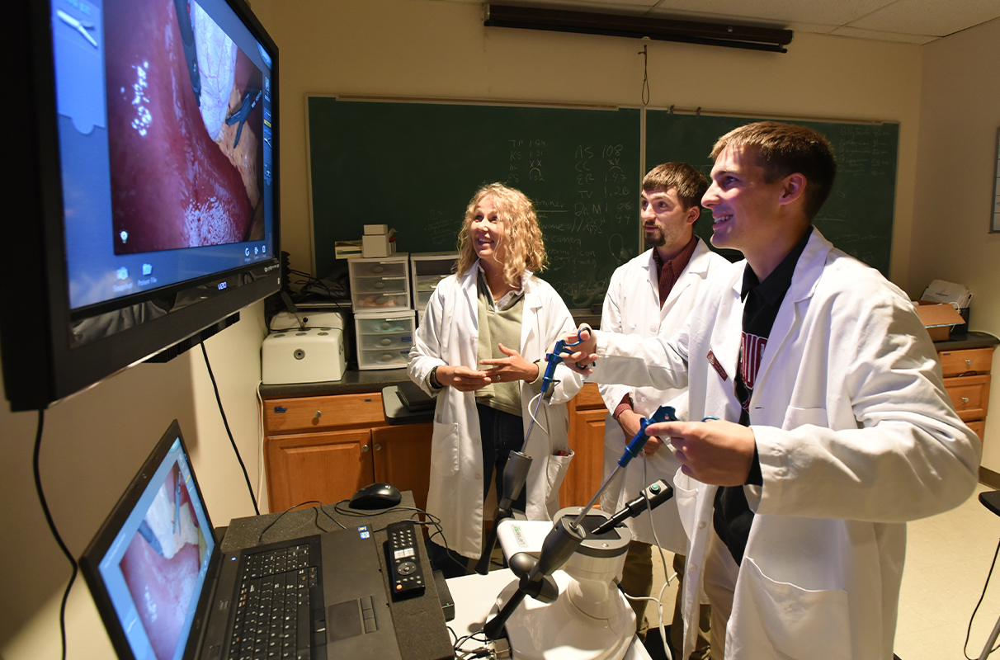

# Page Scan Report

| Field | Value |
|-------|-------|
| URL | https://pullman.wsu.edu/admissions/ |
| Title | WSU Pullman Admissions | Pullman Campus | Washington State University |
| Status | ❌ 0 |
| HTML Size | 62.2 KB |
| Screenshots | 1 (2.4 MB) |
| Images | 6 (2.3 MB) |
| Images Missing Alt | 0 |
| JS Errors | 0 |
| JS Warnings | 0 |
| Auth | none |
| Captured | 2026-02-16T21:00:35.8023837Z |

## Actions

- Screenshot #1: page-loaded (2.4 MB)
- Downloaded 6 images to /images/

## Screenshots

### 1. page-loaded

## Page Images (6)

| # | Image | Alt Text | Size |
|---|-------|----------|------|
| 1 | [Repeat-Grid-1@2x-scaled-e1603917692316.jpg](images/Repeat-Grid-1@2x-scaled-e1603917692316.jpg) | The bronze Cougar statue in front of ... | 461.6 KB |
| 2 | [classroom-1-792x566.jpg](images/classroom-1-792x566.jpg) | Students studying in the spark take n... | 104.0 KB |
| 3 | [laparoscopic.jpg](images/laparoscopic.jpg) | Students conducting an experiment loo... | 526.2 KB |
| 4 | [DroneAerial_0677-1900x1266-1-792x528.jpg](images/DroneAerial_0677-1900x1266-1-792x528.jpg) | Campus from above, shown near the Chi... | 118.4 KB |
| 5 | [Mask-group-23.png](images/Mask-group-23.png) | Two students look at a laptop, smiling | 670.2 KB |
| 6 | [Mask-group-17.png](images/Mask-group-17.png) | A student conducts an experiement in ... | 523.5 KB |

### Gallery

## Files

- `01-page-loaded.png` — page-loaded (2.4 MB)
- `page.html` — rendered HTML content
- `metadata.json` — machine-readable scan data
- `errors.log` — JavaScript console errors
- `warnings.log` — JavaScript console warnings
- `info.log` — navigation and timing details
- `actions.log` — interactions performed on the page
- `images/` — 6 page images (2.3 MB)
