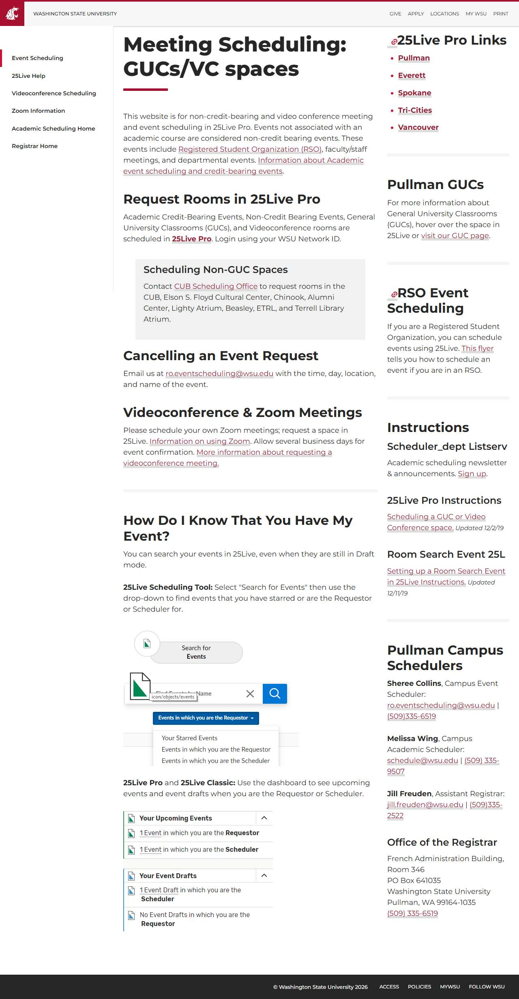

# 📄 Page Scan Report

> **URL:** https://registrar.schedule.wsu.edu/event-scheduling/  
> **Captured:** 2026-02-19 02:12:35 UTC  
> **Status:** ❌ 0  

---

## 📑 Contents

- [Summary](#-summary)
- [Screenshots](#-screenshots)
- [Page Images](#-page-images)
- [JavaScript Errors](#-javascript-errors)
- [Accessibility](#-accessibility)
- [Actions](#-actions)
- [Files](#-files)

---

## 📋 Summary

| Field | Value |
|-------|-------|
| URL | https://registrar.schedule.wsu.edu/event-scheduling/ |
| Title | Event Scheduling |
| Status | ❌ 0 |
| HTML Size | 640.0 KB |
| Screenshots | 1 (264.7 KB) |
| Images | 3 (referenced by URL) |
| Images Missing Alt | ⚠️ 3 |
| JS Errors | 🔴 1 |
| JS Warnings | 1 |
| A11y Violations | ⚠️ 3 |
| 🔴 Critical | 1 |
| 🟠 Serious | 2 |
| 🟡 Moderate | 0 |
| 🔵 Minor | 0 |
| Tools Run | axe, htmlcheck |
| Auth | none |
| Captured | 2026-02-19T02:12:35.5384760Z |

## 🔴 JavaScript Errors

<details>
<summary><strong>1 error(s) detected</strong></summary>

```
Failed to load resource: net::ERR_NAME_NOT_RESOLVED
```

</details>

## 🔧 Actions

<details>
<summary><strong>4 action(s) performed</strong></summary>

- Screenshot #1: page-loaded (264.7 KB)
- Cataloged 3 images by URL (no download)
- axe-core: 1 violations (311ms)
- htmlcheck: 2 violations (0ms)

</details>

## 📸 Screenshots

<table>
<tr>
<td align="center" width="50%">
<a href="01-page-loaded.jpg">

</a>
<br /><strong>1. page-loaded</strong>
<br /><sub>264.7 KB</sub>
</td>
<td></td>
</tr>
</table>

## 🖼️ Page Images (3)

<details open>
<summary><strong>📋 Image Index</strong> — 3 images (referenced by URL)</summary>

| # | Source URL | Alt Text |
|--:|-----------|----------|
| 1 | https://registrar.schedule.wsu.edu/media/761541/searchforevent.png?width=329&... | ⚠️ *(missing)* |
| 2 | https://registrar.schedule.wsu.edu/media/761542/eventsearchdropdown.png?width... | ⚠️ *(missing)* |
| 3 | https://registrar.schedule.wsu.edu/media/761543/dashboardevents.png?width=369... | ⚠️ *(missing)* |

</details>

<details open>
<summary><strong>🖼️ Gallery</strong></summary>

<table>
<tr>
<td align="center" width="33%">
<a href="https://registrar.schedule.wsu.edu/media/761541/searchforevent.png?width=329&height=108">

</a>
<br /><sub>https://registrar.schedule.wsu.edu/media/761541... ⚠️</sub>
</td>
<td align="center" width="33%">
<a href="https://registrar.schedule.wsu.edu/media/761542/eventsearchdropdown.png?width=433&height=237">

</a>
<br /><sub>https://registrar.schedule.wsu.edu/media/761542... ⚠️</sub>
</td>
<td align="center" width="33%">
<a href="https://registrar.schedule.wsu.edu/media/761543/dashboardevents.png?width=369&height=297">

</a>
<br /><sub>https://registrar.schedule.wsu.edu/media/761543... ⚠️</sub>
</td>
</tr>
</table>

</details>

<details>
<summary>⚠️ <strong>Images Missing Alt Text</strong> (3)</summary>

| # | Source URL |
|--:|-----------|
| 1 | https://registrar.schedule.wsu.edu/media/761541/searchforevent.png?width=329&... |
| 2 | https://registrar.schedule.wsu.edu/media/761542/eventsearchdropdown.png?width... |
| 3 | https://registrar.schedule.wsu.edu/media/761543/dashboardevents.png?width=369... |

</details>

## ♿ Accessibility

### Summary

| Severity | axe | htmlcheck |
|----------|:---:|:---:|
| 🔴 critical | 1 | 0 |
| 🟠 serious | 0 | 2 |
| 🟡 moderate | 0 | 0 |
| 🔵 minor | 0 | 0 |
| **Total** | **1** | **2** |

### Violations by Confidence

<details open>
<summary><strong>2 rule(s) violated</strong></summary>

| # | Rule | Sev | Confidence | axe | htmlcheck | Example |
|--:|------|:---:|:----------:|:---:|:---:|---------|
| 1 | [aria-allowed-attr](../../a11y-rules.md#aria-allowed-attr) | 🔴 | 🟢 1/1 | ⚠️ | — | `<div id="wsu-navigation-vertical" class="wsu-slide-in-pan...` |
| 2 | [link-name](../../a11y-rules.md#link-name) | 🟠 | 🟡 1/2 | ✅ | ⚠️ | `<a id="live"></a>` |

</details>

> **Note:** Automated scanning catches ~30-60% of WCAG issues. Manual keyboard and screen reader testing is still required for full compliance.

## 📁 Files

| File | Description |
|------|-------------|
| `01-page-loaded.jpg` | page-loaded (264.7 KB) |
| `page.html` | Rendered HTML content |
| `metadata.json` | Machine-readable scan data |
| `errors.log` | JavaScript console errors |
| `warnings.log` | JavaScript console warnings |
| `info.log` | Navigation and timing details |
| `actions.log` | Interactions performed |
| `a11y-axe.json` | axe accessibility results |
| `a11y-htmlcheck.json` | htmlcheck accessibility results |
| `a11y-summary.json` | Merged cross-tool accessibility summary |

---

*Generated by AccessibilityScanner (FreeTools) v1.0*
