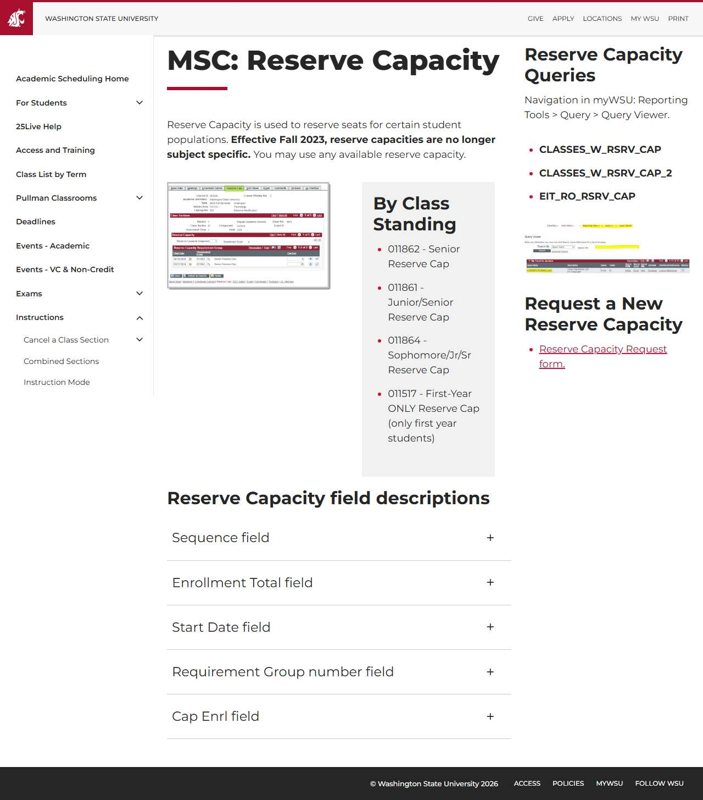

# 📄 Page Scan Report

> **URL:** https://registrar.schedule.wsu.edu/instructions/maintain-schedule-of-classes/reserve-cap-tab/  
> **Captured:** 2026-02-19 02:26:13 UTC  
> **Status:** ❌ 0  

---

## 📑 Contents

- [Summary](#-summary)
- [Screenshots](#-screenshots)
- [Page Images](#-page-images)
- [Accessibility](#-accessibility)
- [Actions](#-actions)
- [Files](#-files)

---

## 📋 Summary

| Field | Value |
|-------|-------|
| URL | https://registrar.schedule.wsu.edu/instructions/maintain-schedule-of-classes/reserve-cap-tab/ |
| Title | Reserve Cap tab | Academic Room Scheduling |
| Status | ❌ 0 |
| HTML Size | 677.5 KB |
| Screenshots | 1 (121.0 KB) |
| Images | 2 (referenced by URL) |
| Images Missing Alt | ⚠️ 1 |
| JS Errors | ✅ 0 |
| JS Warnings | 1 |
| A11y Violations | ⚠️ 1 |
| 🔴 Critical | 1 |
| 🟠 Serious | 0 |
| 🟡 Moderate | 0 |
| 🔵 Minor | 0 |
| Tools Run | axe, htmlcheck |
| Auth | none |
| Captured | 2026-02-19T02:26:13.2828984Z |

## 🔧 Actions

<strong>4 action(s) performed</strong>

- Screenshot #1: page-loaded (121.0 KB)
- Cataloged 2 images by URL (no download)
- axe-core: 1 violations (275ms)
- htmlcheck: 0 violations (0ms)

## 📸 Screenshots

<table>
<tr>
<td align="center" width="50%">

 <strong>1. page-loaded</strong>
 121.0 KB
</td>
<td></td>
</tr>
</table>

## 🖼️ Page Images (2)

<strong>📋 Image Index</strong> — 2 images (referenced by URL)

| # | Source URL | Alt Text |
|--:|-----------|----------|
| 1 | https://registrar.schedule.wsu.edu/media/kyfk0ctx/reservecap.png?rmode=max&wi... | Reserve Capacity tab in Maintain Sche... |
| 2 | https://registrar.schedule.wsu.edu/media/zfudrk3x/reserve-cap-query.jpg?width... | ⚠️ *(missing)* |

<strong>🖼️ Gallery</strong>

<table>
<tr>
<td align="center" width="33%">

 https://registrar.schedule.wsu.edu/media/kyfk0c...
</td>
<td align="center" width="33%">

 https://registrar.schedule.wsu.edu/media/zfudrk... ⚠️
</td>
<td></td>
</tr>
</table>

⚠️ <strong>Images Missing Alt Text</strong> (1)

| # | Source URL |
|--:|-----------|
| 1 | https://registrar.schedule.wsu.edu/media/zfudrk3x/reserve-cap-query.jpg?width... |

## ♿ Accessibility

### Summary

| Severity | axe | htmlcheck |
|----------|:---:|:---:|
| 🔴 critical | 1 | 0 |
| 🟠 serious | 0 | 0 |
| 🟡 moderate | 0 | 0 |
| 🔵 minor | 0 | 0 |
| **Total** | **1** | **0** |

### Violations by Confidence

<strong>1 rule(s) violated</strong>

| # | Rule | Sev | Confidence | axe | htmlcheck | Example |
|--:|------|:---:|:----------:|:---:|:---:|---------|
| 1 | [aria-allowed-attr](../../a11y-rules.md#aria-allowed-attr) | 🔴 | 🟢 1/1 | ⚠️ | — | `

> **Note:** Automated scanning catches ~30-60% of WCAG issues. Manual keyboard and screen reader testing is still required for full compliance.

## 📁 Files

| File | Description |
|------|-------------|
| `01-page-loaded.jpg` | page-loaded (121.0 KB) |
| `page.html` | Rendered HTML content |
| `metadata.json` | Machine-readable scan data |
| `errors.log` | JavaScript console errors |
| `warnings.log` | JavaScript console warnings |
| `info.log` | Navigation and timing details |
| `actions.log` | Interactions performed |
| `a11y-axe.json` | axe accessibility results |
| `a11y-htmlcheck.json` | htmlcheck accessibility results |
| `a11y-summary.json` | Merged cross-tool accessibility summary |

---

*Generated by AccessibilityScanner (FreeTools) v1.0*
