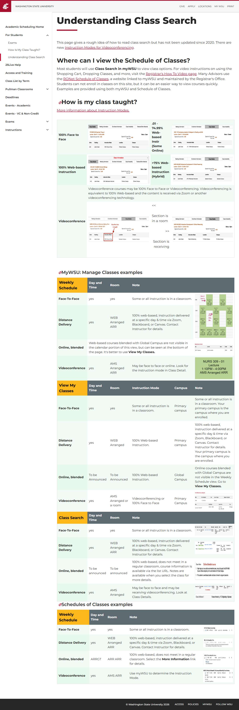

# 📄 Page Scan Report

> **URL:** https://registrar.schedule.wsu.edu/students/class-search/  
> **Captured:** 2026-02-19 02:42:38 UTC  
> **Status:** ❌ 0  

---

## 📑 Contents

- [Summary](#-summary)
- [Screenshots](#-screenshots)
- [Page Images](#-page-images)
- [Accessibility](#-accessibility)
- [Actions](#-actions)
- [Files](#-files)

---

## 📋 Summary

| Field | Value |
|-------|-------|
| URL | https://registrar.schedule.wsu.edu/students/class-search/ |
| Title | Class Search | Academic Room Scheduling |
| Status | ❌ 0 |
| HTML Size | 679.0 KB |
| Screenshots | 1 (357.6 KB) |
| Images | 19 (referenced by URL) |
| Images Missing Alt | ⚠️ 16 |
| JS Errors | ✅ 0 |
| JS Warnings | 1 |
| A11y Violations | ⚠️ 7 |
| 🔴 Critical | 1 |
| 🟠 Serious | 3 |
| 🟡 Moderate | 3 |
| 🔵 Minor | 0 |
| Tools Run | axe, htmlcheck |
| Auth | none |
| Captured | 2026-02-19T02:42:38.2462044Z |

## 🔧 Actions

<strong>4 action(s) performed</strong>

- Screenshot #1: page-loaded (357.6 KB)
- Cataloged 19 images by URL (no download)
- axe-core: 1 violations (285ms)
- htmlcheck: 6 violations (0ms)

## 📸 Screenshots

<table>
<tr>
<td align="center" width="50%">

 <strong>1. page-loaded</strong>
 357.6 KB
</td>
<td></td>
</tr>
</table>

## 🖼️ Page Images (19)

<strong>📋 Image Index</strong> — 19 images (referenced by URL)

| # | Source URL | Alt Text |
|--:|-----------|----------|
| 1 | https://registrar.schedule.wsu.edu/media/762544/classdetails-f2f.png?width=50... | ⚠️ *(missing)* |
| 2 | https://registrar.schedule.wsu.edu/media/762546/classdetails-so.png?width=500... | ⚠️ *(missing)* |
| 3 | https://registrar.schedule.wsu.edu/media/762545/classdetails-online.png?width... | ⚠️ *(missing)* |
| 4 | https://registrar.schedule.wsu.edu/media/762547/classdetails-hybrid.png?width... | ⚠️ *(missing)* |
| 5 | https://registrar.schedule.wsu.edu/media/762552/viewmyclass-vc2.png?width=500... | ⚠️ *(missing)* |
| 6 | https://registrar.schedule.wsu.edu/media/762548/classdetails-vc.png?width=500... | ⚠️ *(missing)* |
| 7 | https://registrar.schedule.wsu.edu/media/762513/weeklyviewmixed.png?width=500... | Weekly Schedule View |
| 8 | https://registrar.schedule.wsu.edu/media/762550/weekly-online.png?width=600&h... | ⚠️ *(missing)* |
| 9 | https://registrar.schedule.wsu.edu/media/762549/weeklyschedule-vc.png?width=2... | ⚠️ *(missing)* |
| 10 | https://registrar.schedule.wsu.edu/media/762551/viewmyclass-vc.png?width=500&... | ⚠️ *(missing)* |
| 11 | https://registrar.schedule.wsu.edu/media/762540/classsearch-f2f.png?width=500... | ⚠️ *(missing)* |
| 12 | https://registrar.schedule.wsu.edu/media/762542/classsearch-dd.png?width=500&... | ⚠️ *(missing)* |
| 13 | https://registrar.schedule.wsu.edu/media/762543/classsearchblendednotes.png?w... | ⚠️ *(missing)* |
| 14 | https://registrar.schedule.wsu.edu/media/762553/classsearch-vc.png?width=500&... | ⚠️ *(missing)* |
| 15 | https://registrar.schedule.wsu.edu/media/762554/classsearch-vc2.png?width=500... | ⚠️ *(missing)* |
| 16 | https://registrar.schedule.wsu.edu/media/762517/soc-f2f.png?width=500&height=... | SOC FaceToFace Section |
| 17 | https://registrar.schedule.wsu.edu/media/762515/soc-pols424-firstview.png?wid... | ⚠️ *(missing)* |
| 18 | https://registrar.schedule.wsu.edu/media/762516/soc-globalsection.png?width=5... | GlobalSection |
| 19 | https://registrar.schedule.wsu.edu/media/762555/soc-vc.png?width=500&height=7... | ⚠️ *(missing)* |

<strong>🖼️ Gallery</strong>

<table>
<tr>
<td align="center" width="33%">

 https://registrar.schedule.wsu.edu/media/762544... ⚠️
</td>
<td align="center" width="33%">

 https://registrar.schedule.wsu.edu/media/762546... ⚠️
</td>
<td align="center" width="33%">

 https://registrar.schedule.wsu.edu/media/762545... ⚠️
</td>
</tr>
<tr>
<td align="center" width="33%">

 https://registrar.schedule.wsu.edu/media/762547... ⚠️
</td>
<td align="center" width="33%">

 https://registrar.schedule.wsu.edu/media/762552... ⚠️
</td>
<td align="center" width="33%">

 https://registrar.schedule.wsu.edu/media/762548... ⚠️
</td>
</tr>
<tr>
<td align="center" width="33%">

 https://registrar.schedule.wsu.edu/media/762513...
</td>
<td align="center" width="33%">

 https://registrar.schedule.wsu.edu/media/762550... ⚠️
</td>
<td align="center" width="33%">

 https://registrar.schedule.wsu.edu/media/762549... ⚠️
</td>
</tr>
<tr>
<td align="center" width="33%">

 https://registrar.schedule.wsu.edu/media/762551... ⚠️
</td>
<td align="center" width="33%">

 https://registrar.schedule.wsu.edu/media/762540... ⚠️
</td>
<td align="center" width="33%">

 https://registrar.schedule.wsu.edu/media/762542... ⚠️
</td>
</tr>
<tr>
<td align="center" width="33%">

 https://registrar.schedule.wsu.edu/media/762543... ⚠️
</td>
<td align="center" width="33%">

 https://registrar.schedule.wsu.edu/media/762553... ⚠️
</td>
<td align="center" width="33%">

 https://registrar.schedule.wsu.edu/media/762554... ⚠️
</td>
</tr>
<tr>
<td align="center" width="33%">

 https://registrar.schedule.wsu.edu/media/762517...
</td>
<td align="center" width="33%">

 https://registrar.schedule.wsu.edu/media/762515... ⚠️
</td>
<td align="center" width="33%">

 https://registrar.schedule.wsu.edu/media/762516...
</td>
</tr>
<tr>
<td align="center" width="33%">

 https://registrar.schedule.wsu.edu/media/762555... ⚠️
</td>
<td></td>
<td></td>
</tr>
</table>

⚠️ <strong>Images Missing Alt Text</strong> (16)

| # | Source URL |
|--:|-----------|
| 1 | https://registrar.schedule.wsu.edu/media/762544/classdetails-f2f.png?width=50... |
| 2 | https://registrar.schedule.wsu.edu/media/762546/classdetails-so.png?width=500... |
| 3 | https://registrar.schedule.wsu.edu/media/762545/classdetails-online.png?width... |
| 4 | https://registrar.schedule.wsu.edu/media/762547/classdetails-hybrid.png?width... |
| 5 | https://registrar.schedule.wsu.edu/media/762552/viewmyclass-vc2.png?width=500... |
| 6 | https://registrar.schedule.wsu.edu/media/762548/classdetails-vc.png?width=500... |
| 7 | https://registrar.schedule.wsu.edu/media/762550/weekly-online.png?width=600&h... |
| 8 | https://registrar.schedule.wsu.edu/media/762549/weeklyschedule-vc.png?width=2... |
| 9 | https://registrar.schedule.wsu.edu/media/762551/viewmyclass-vc.png?width=500&... |
| 10 | https://registrar.schedule.wsu.edu/media/762540/classsearch-f2f.png?width=500... |
| 11 | https://registrar.schedule.wsu.edu/media/762542/classsearch-dd.png?width=500&... |
| 12 | https://registrar.schedule.wsu.edu/media/762543/classsearchblendednotes.png?w... |
| 13 | https://registrar.schedule.wsu.edu/media/762553/classsearch-vc.png?width=500&... |
| 14 | https://registrar.schedule.wsu.edu/media/762554/classsearch-vc2.png?width=500... |
| 15 | https://registrar.schedule.wsu.edu/media/762515/soc-pols424-firstview.png?wid... |
| 16 | https://registrar.schedule.wsu.edu/media/762555/soc-vc.png?width=500&height=7... |

## ♿ Accessibility

### Summary

| Severity | axe | htmlcheck |
|----------|:---:|:---:|
| 🔴 critical | 1 | 0 |
| 🟠 serious | 0 | 3 |
| 🟡 moderate | 0 | 3 |
| 🔵 minor | 0 | 0 |
| **Total** | **1** | **6** |

### Violations by Confidence

<strong>3 rule(s) violated</strong>

| # | Rule | Sev | Confidence | axe | htmlcheck | Example |
|--:|------|:---:|:----------:|:---:|:---:|---------|
| 1 | [aria-allowed-attr](../../a11y-rules.md#aria-allowed-attr) | 🔴 | 🟢 1/1 | ⚠️ | — | `

<tbody>
<tr>
<td class="what">100% Fac...` |

> **Note:** Automated scanning catches ~30-60% of WCAG issues. Manual keyboard and screen reader testing is still required for full compliance.

## 📁 Files

| File | Description |
|------|-------------|
| `01-page-loaded.jpg` | page-loaded (357.6 KB) |
| `page.html` | Rendered HTML content |
| `metadata.json` | Machine-readable scan data |
| `errors.log` | JavaScript console errors |
| `warnings.log` | JavaScript console warnings |
| `info.log` | Navigation and timing details |
| `actions.log` | Interactions performed |
| `a11y-axe.json` | axe accessibility results |
| `a11y-htmlcheck.json` | htmlcheck accessibility results |
| `a11y-summary.json` | Merged cross-tool accessibility summary |

---

*Generated by AccessibilityScanner (FreeTools) v1.0*
