# 🌐 Site Report: https://registrar.wsu.edu/

> **Status:** ⚠️ 1/14 pages OK  
> **Folder:** `registrar-wsu-edu/`  

---

## 📋 Summary

```
Success Rate:  [██░░░░░░░░░░░░░░░░░░░░░░░░░░░░] 7%
```

| Metric | Value |
|--------|-------|
| Pages Scanned | 14 |
| Pages Passed | ✅ 1 |
| Pages Failed | ❌ 13 |
| Total JS Errors | 0 |
| Total JS Warnings | 13 |
| Total Images | 0 (0 bytes) |
| Images Missing Alt | ✅ 0 |
| Total HTML | 8.7 MB |
| Total Screenshots | 12.1 MB |

## 📑 Pages

| Status | Page | HTTP | Title | JS Errors | Images | Missing Alt |
|:------:|------|:----:|-------|:---------:|:------:|:-----------:|
| ❌ | [/](_root/report.md) | 0 | Office of the Registrar | 0 | 0 | 0 |
| ✅ | [/academic-calendar/](academic-calendar/report.md) | 200 |  | 0 | 0 | 0 |
| ❌ | [/academic-regulations/](academic-regulations/report.md) | 0 | Academic Regulations \| Office of the... | 0 | 0 | 0 |
| ❌ | [/change-of-campus/](change-of-campus/report.md) | 0 | Undergraduate Change of Campus Form \... | 0 | 0 | 0 |
| ❌ | [/contact-us/](contact-us/report.md) | 0 | Contact Us \| Office of the Registrar | 0 | 0 | 0 |
| ❌ | [/grades-and-gpa/](grades-and-gpa/report.md) | 0 | Grades and GPA \| Office of the Regis... | 0 | 0 | 0 |
| ❌ | [/how-to-videos/](how-to-videos/report.md) | 0 | How-To Videos \| Office of the Registrar | 0 | 0 | 0 |
| ❌ | [/petitions/](petitions/report.md) | 0 | Academic Calendar Petitions \| Office... | 0 | 0 | 0 |
| ❌ | [/sessions/](sessions/report.md) | 0 | Sessions \| Office of the Registrar | 0 | 0 | 0 |
| ❌ | [/special-enrollment/](special-enrollment/report.md) | 0 | Special Enrollment \| Office of the R... | 0 | 0 | 0 |
| ❌ | [/staff-forms/](staff-forms/report.md) | 0 | Staff Forms \| Office of the Registrar | 0 | 0 | 0 |
| ❌ | [/student-forms/](student-forms/report.md) | 0 | Student Forms \| Office of the Registrar | 0 | 0 | 0 |
| ❌ | [/term-withdrawal/](term-withdrawal/report.md) | 0 | Term Withdrawal \| Office of the Regi... | 0 | 0 | 0 |
| ❌ | [/tuition-adjustments/](tuition-adjustments/report.md) | 0 | Tuition Adjustments \| Office of the ... | 0 | 0 | 0 |

## 📸 Page Screenshots

Click any thumbnail to view the full page report.

<table>
<tr>
<td align="center" width="33%">
<a href="_root/report.md">
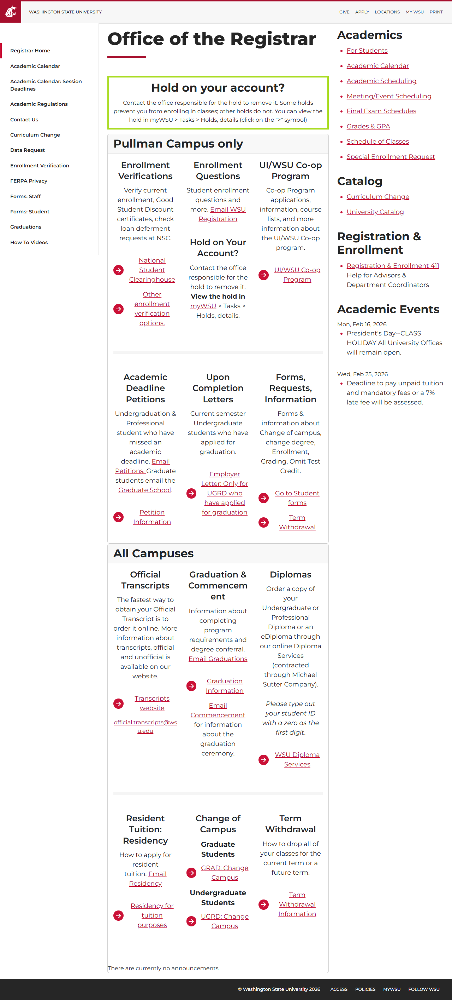
</a>
<br />❌ <code>/</code>
</td>
<td align="center" width="33%">
<a href="academic-calendar/report.md">
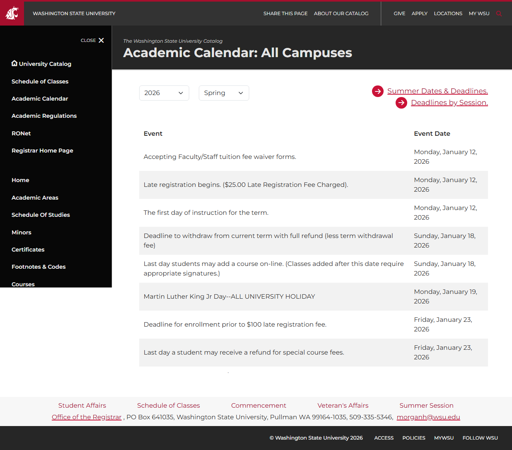
</a>
<br />✅ <code>/academic-calendar/</code>
</td>
<td align="center" width="33%">
<a href="academic-regulations/report.md">

</a>
<br />❌ <code>/academic-regulations/</code>
</td>
</tr>
<tr>
<td align="center" width="33%">
<a href="change-of-campus/report.md">
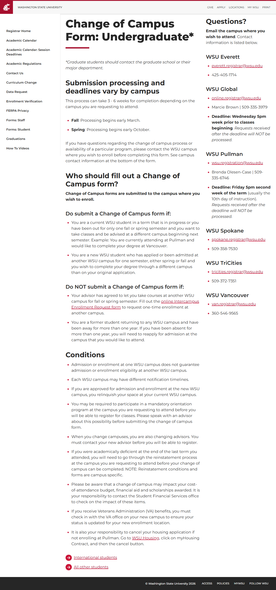
</a>
<br />❌ <code>/change-of-campus/</code>
</td>
<td align="center" width="33%">
<a href="contact-us/report.md">
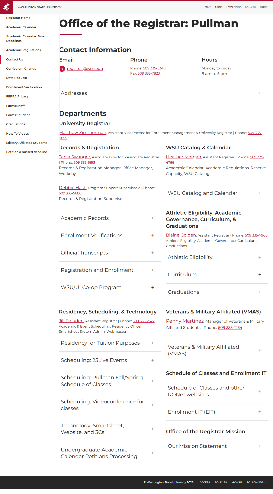
</a>
<br />❌ <code>/contact-us/</code>
</td>
<td align="center" width="33%">
<a href="grades-and-gpa/report.md">
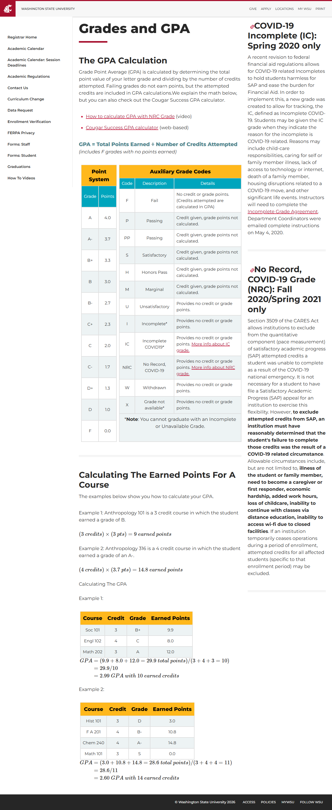
</a>
<br />❌ <code>/grades-and-gpa/</code>
</td>
</tr>
<tr>
<td align="center" width="33%">
<a href="how-to-videos/report.md">
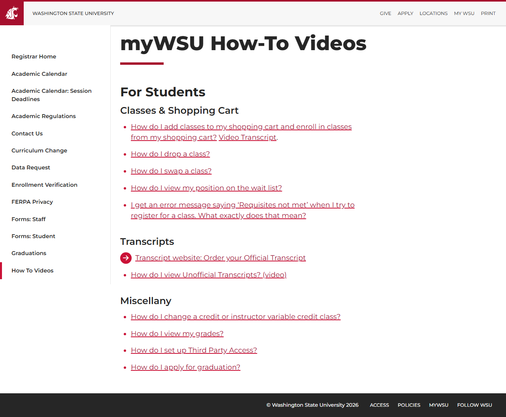
</a>
<br />❌ <code>/how-to-videos/</code>
</td>
<td align="center" width="33%">
<a href="petitions/report.md">
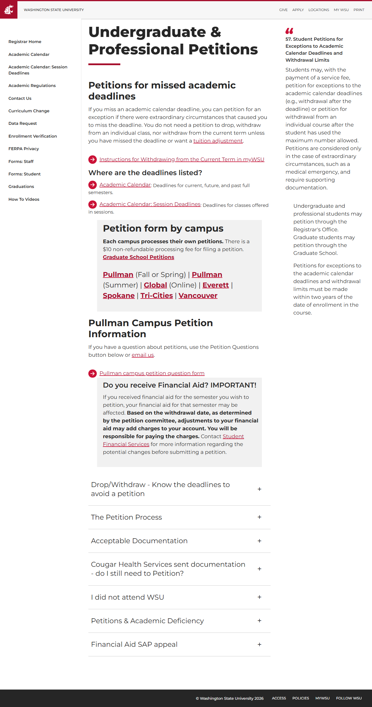
</a>
<br />❌ <code>/petitions/</code>
</td>
<td align="center" width="33%">
<a href="sessions/report.md">
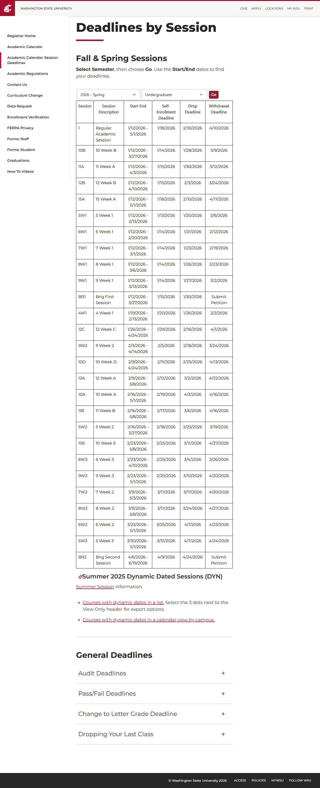
</a>
<br />❌ <code>/sessions/</code>
</td>
</tr>
<tr>
<td align="center" width="33%">
<a href="special-enrollment/report.md">
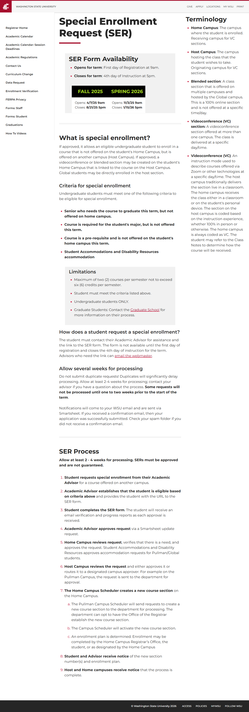
</a>
<br />❌ <code>/special-enrollment/</code>
</td>
<td align="center" width="33%">
<a href="staff-forms/report.md">
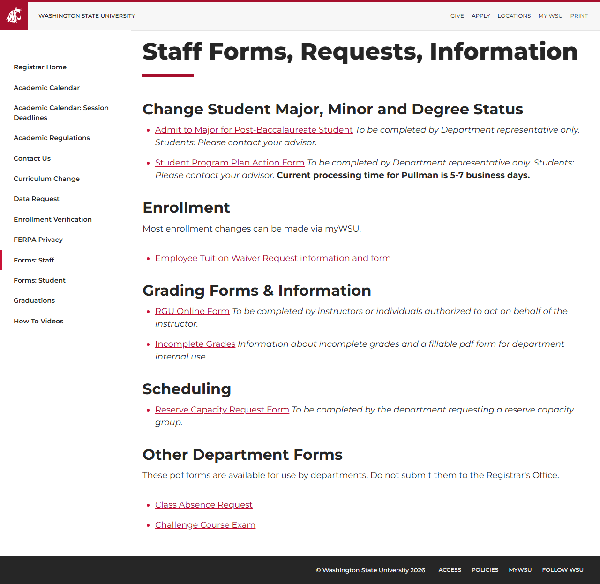
</a>
<br />❌ <code>/staff-forms/</code>
</td>
<td align="center" width="33%">
<a href="student-forms/report.md">
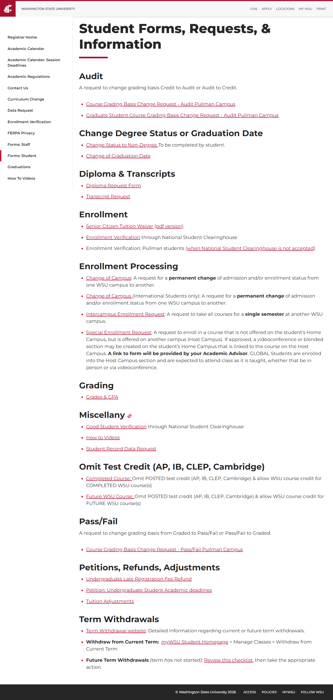
</a>
<br />❌ <code>/student-forms/</code>
</td>
</tr>
<tr>
<td align="center" width="33%">
<a href="term-withdrawal/report.md">
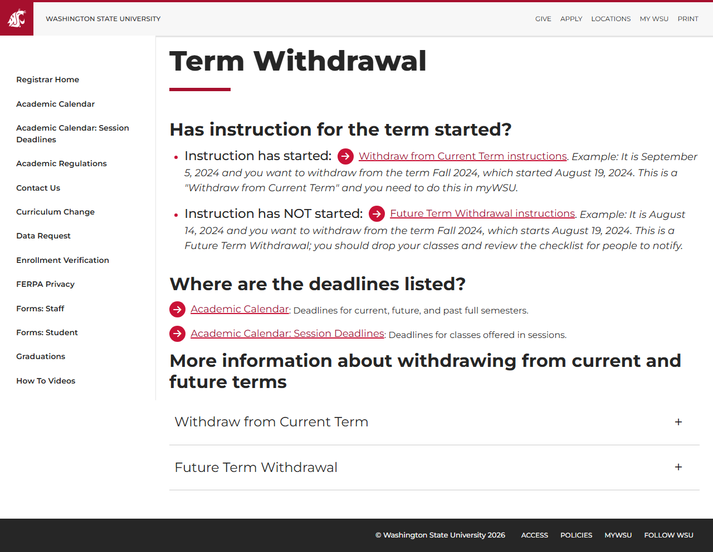
</a>
<br />❌ <code>/term-withdrawal/</code>
</td>
<td align="center" width="33%">
<a href="tuition-adjustments/report.md">
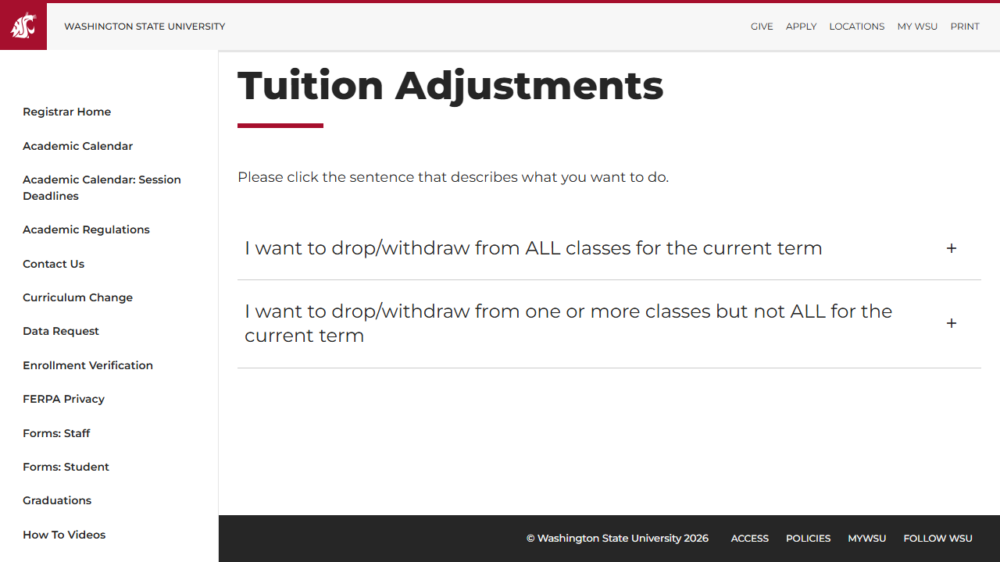
</a>
<br />❌ <code>/tuition-adjustments/</code>
</td>
<td></td>
</tr>
</table>

## ❌ Failed Pages

<details open>
<summary><strong>13 page(s) failed</strong></summary>

| Page | HTTP | Error |
|------|:----:|-------|
| [/](_root/report.md) | 0 | — |
| [/sessions/](sessions/report.md) | 0 | — |
| [/academic-regulations/](academic-regulations/report.md) | 0 | — |
| [/contact-us/](contact-us/report.md) | 0 | — |
| [/staff-forms/](staff-forms/report.md) | 0 | — |
| [/student-forms/](student-forms/report.md) | 0 | — |
| [/how-to-videos/](how-to-videos/report.md) | 0 | — |
| [/petitions/](petitions/report.md) | 0 | — |
| [/term-withdrawal/](term-withdrawal/report.md) | 0 | — |
| [/tuition-adjustments/](tuition-adjustments/report.md) | 0 | — |
| [/grades-and-gpa/](grades-and-gpa/report.md) | 0 | — |
| [/special-enrollment/](special-enrollment/report.md) | 0 | — |
| [/change-of-campus/](change-of-campus/report.md) | 0 | — |

</details>

---

*Generated by AccessibilityScanner (FreeTools) v1.0*
