# 🌐 Site Report: https://registrar.wsu.edu/

> **Status:** ⚠️ 1/17 pages OK  
> **Folder:** `registrar-wsu-edu/`  

---

## 📋 Summary

```
Success Rate:  [█░░░░░░░░░░░░░░░░░░░░░░░░░░░░░] 6%
```

| Metric | Value |
|--------|-------|
| Pages Scanned | 17 |
| Pages Passed | ✅ 1 |
| Pages Failed | ❌ 16 |
| Total JS Errors | 0 |
| Total JS Warnings | 16 |
| Total Images | 2 (by URL) |
| Images Missing Alt | ✅ 0 |
| A11y Violations | ⚠️ 141 |
| 🔴 Critical | 23 |
| 🟠 Serious | 106 |
| 🟡 Moderate | 12 |
| 🔵 Minor | 0 |
| Total HTML | 10.6 MB |
| Total Screenshots | 3.2 MB |

## 🔒 SSL Certificate

| Field | Value |
|-------|-------|
| Subject | `CN=cms.em.wsu.edu, O=Washington State University, S=Washington, C=US` |
| Issuer | `CN=InCommon RSA Server CA 2, O=Internet2, C=US` |
| Valid From | 2025-03-27 |
| Expires | 🟡 2026-03-28 (37 days) |
| Algorithm | sha384RSA |
| Key Size | 2048 bits |
| Thumbprint | `422B0FF3A6D1681FE831C7FDAFEF891649B07426` |
| SANs | 89 domain(s) |

<details>
<summary><strong>Subject Alternative Names (89)</strong></summary>

| Domain | Type |
|--------|------|
| `aas.wsu.edu` | 🏫 WSU |
| `admission.em.wsu.edu` | 🏫 WSU |
| `admissions.em.wsu.edu` | 🏫 WSU |
| `admissionsdocs.wsu.edu` | 🏫 WSU |
| `afd.wsu.edu` | 🏫 WSU |
| `alaskacougs.wsu.edu` | 🏫 WSU |
| `beanoc.wsu.edu` | 🏫 WSU |
| `boisecougs.wsu.edu` | 🏫 WSU |
| `cms.em.wsu.edu` | 🏫 WSU |
| `cmstest1.em.wsu.edu` | 🏫 WSU |
| `cougarinterest.wsu.edu` | 🏫 WSU |
| `cougcompass.wsu.edu` | 🏫 WSU |
| `cougnet.wsu.edu` | 🏫 WSU |
| `counselorbreakfast.wsu.edu` | 🏫 WSU |
| `counselornews.wsu.edu` | 🏫 WSU |
| `curriculum.registrar.wsu.edu` | 🏫 WSU |
| `curriculumchange.registrar.wsu.edu` | 🏫 WSU |
| `datarequest.wsu.edu` | 🏫 WSU |
| `dcms.em.wsu.edu` | 🏫 WSU |
| `dev.finaid.wsu.edu` | 🏫 WSU |
| `divisioninfo.wsu.edu` | 🏫 WSU |
| `easternwacougs.wsu.edu` | 🏫 WSU |
| `edit.em.wsu.edu` | 🏫 WSU |
| `em.wsu.edu` | 🏫 WSU |
| `emcms.wsu.edu` | 🏫 WSU |
| `emsummit.wsu.edu` | 🏫 WSU |
| `enrollmentverification.em.wsu.edu` | 🏫 WSU |
| `fcocwaitlist.wsu.edu` | 🏫 WSU |
| `ferpa.em.wsu.edu` | 🏫 WSU |
| `finaiddev.wsu.edu` | 🏫 WSU |
| `forms.financialaid.wsu.edu` | 🏫 WSU |
| `gocougs.em.wsu.edu` | 🏫 WSU |
| `graduation.wsu.edu` | 🏫 WSU |
| `graduations.wsu.edu` | 🏫 WSU |
| `hawaiicougs.wsu.edu` | 🏫 WSU |
| `icollege.wsu.edu` | 🏫 WSU |
| `idahocougs.wsu.edu` | 🏫 WSU |
| `kelso-longviewcougs.wsu.edu` | 🏫 WSU |
| `kingcountycougs.wsu.edu` | 🏫 WSU |
| `lacougs.wsu.edu` | 🏫 WSU |
| `lvp.wsu.edu` | 🏫 WSU |
| `message.wsu.edu` | 🏫 WSU |
| `mobileapply.wsu.edu` | 🏫 WSU |
| `myfcoc.wsu.edu` | 🏫 WSU |
| `nasc.wsu.edu` | 🏫 WSU |
| `ncaastudy.wsu.edu` | 🏫 WSU |
| `norcalcougs.wsu.edu` | 🏫 WSU |
| `onsite.wsu.edu` | 🏫 WSU |
| `oregoncougs.wsu.edu` | 🏫 WSU |
| `parents.wsu.edu` | 🏫 WSU |
| `pdxcougs.wsu.edu` | 🏫 WSU |
| `peninsulacougs.wsu.edu` | 🏫 WSU |
| `recmark.wsu.edu` | 🏫 WSU |
| `registrar-dev.em.wsu.edu` | 🏫 WSU |
| `registrar.schedule.wsu.edu` | 🏫 WSU |
| `registrar.wsu.edu` | 🏫 WSU |
| `residency.wsu.edu` | 🏫 WSU |
| `ro411.em.wsu.edu` | 🏫 WSU |
| `sandiegocougs.wsu.edu` | 🏫 WSU |
| `scholars.wsu.edu` | 🏫 WSU |
| `scholarships.wsu.edu` | 🏫 WSU |
| `sfs411.wsu.edu` | 🏫 WSU |
| `sfspartners.wsu.edu` | 🏫 WSU |
| `snokingcougs.wsu.edu` | 🏫 WSU |
| `socalcougs.wsu.edu` | 🏫 WSU |
| `submitsfsdocs.wsu.edu` | 🏫 WSU |
| `summerprograms.wsu.edu` | 🏫 WSU |
| `tacomacougs.wsu.edu` | 🏫 WSU |
| `transcript.wsu.edu` | 🏫 WSU |
| `transcripts.wsu.edu` | 🏫 WSU |
| `umbraco.em.wsu.edu` | 🏫 WSU |
| `va.wsu.edu` | 🏫 WSU |
| `vancouvercougs.wsu.edu` | 🏫 WSU |
| `www.boisecougs.wsu.edu` | 🏫 WSU |
| `www.cougarquest.wsu.edu` | 🏫 WSU |
| `www.diversityeducation.wsu.edu` | 🏫 WSU |
| `www.fall-alive.wsu.edu` | 🏫 WSU |
| `www.family.wsu.edu` | 🏫 WSU |
| `www.graduation.wsu.edu` | 🏫 WSU |
| `www.idahocougs.wsu.edu` | 🏫 WSU |
| `www.kingcountycougs.wsu.edu` | 🏫 WSU |
| `www.myfcoc.wsu.edu` | 🏫 WSU |
| `www.orientation-dev.wsu.edu` | 🏫 WSU |
| `www.registrar.wsu.edu` | 🏫 WSU |
| `www.spring-orientation.wsu.edu` | 🏫 WSU |
| `www.tausigma.wsu.edu` | 🏫 WSU |
| `www.transcript.wsu.edu` | 🏫 WSU |
| `www.transcripts.wsu.edu` | 🏫 WSU |
| `www.transfer-days.wsu.edu` | 🏫 WSU |

</details>

## 📑 Pages

| Status | Page | HTTP | Title | 🔴 | 🟠 | 🟡 | 🔵 | A11y |
|:------:|------|:----:|-------|:--:|:--:|:--:|:--:|:----:|
| ❌ | [/](_root/report.md) | 0 | Office of the Registrar | 1 | 1 |  |  | ⚠️ 2 |
| ✅ | [/academic-calendar/](academic-calendar/report.md) | 200 |  | 2 | 2 | 2 |  | ⚠️ 6 |
| ❌ | [/academic-regulations/](academic-regulations/report.md) | 0 | Academic Regulations \| Office of the... | 2 | 94 | 3 |  | ⚠️ 99 |
| ❌ | [/change-of-campus/](change-of-campus/report.md) | 0 | Undergraduate Change of Campus Form \... | 1 |  |  |  | ⚠️ 1 |
| ❌ | [/contact-us/](contact-us/report.md) | 0 | Contact Us \| Office of the Registrar | 1 |  |  |  | ⚠️ 1 |
| ❌ | [/deadlines-drop-withdrawal/](deadlines-drop-withdrawal/report.md) | 0 | Sessions \| Office of the Registrar | 3 | 1 | 1 |  | ⚠️ 5 |
| ❌ | [/grades-and-gpa/](grades-and-gpa/report.md) | 0 | Grades and GPA \| Office of the Regis... | 1 | 2 |  |  | ⚠️ 3 |
| ❌ | [/how-to-videos/](how-to-videos/report.md) | 0 | How-To Videos \| Office of the Registrar | 1 |  |  |  | ⚠️ 1 |
| ❌ | [/petitions/](petitions/report.md) | 0 | Academic Calendar Petitions \| Office... | 1 | 2 | 1 |  | ⚠️ 4 |
| ❌ | [/sessions/](sessions/report.md) | 0 | Sessions \| Office of the Registrar | 3 | 1 | 1 |  | ⚠️ 5 |
| ❌ | [/special-enrollment/](special-enrollment/report.md) | 0 | Special Enrollment \| Office of the R... | 1 |  | 1 |  | ⚠️ 2 |
| ❌ | [/staff-forms/](staff-forms/report.md) | 0 | Staff Forms \| Office of the Registrar | 1 |  |  |  | ⚠️ 1 |
| ❌ | [/student-forms/](student-forms/report.md) | 0 | Student Forms \| Office of the Registrar | 1 | 2 |  |  | ⚠️ 3 |
| ❌ | [/term-withdrawal/](term-withdrawal/report.md) | 0 | Term Withdrawal \| Office of the Regi... | 1 |  |  |  | ⚠️ 1 |
| ❌ | [/term-withdrawal/child/withdraw-from-current-term/](term-withdrawal_child_withdraw-from-current-term/report.md) | 0 | Withdraw from Current Term \| Office ... | 1 | 1 | 2 |  | ⚠️ 4 |
| ❌ | [/term-withdrawal/withdrawing/](term-withdrawal_withdrawing/report.md) | 0 | Withdrawing \| Office of the Registrar | 1 |  |  |  | ⚠️ 1 |
| ❌ | [/tuition-adjustments/](tuition-adjustments/report.md) | 0 | Tuition Adjustments \| Office of the ... | 1 |  | 1 |  | ⚠️ 2 |

## 📸 Page Screenshots

Click any thumbnail to view the full page report.

<table>
<tr>
<td align="center" width="33%">
<a href="_root/report.md">
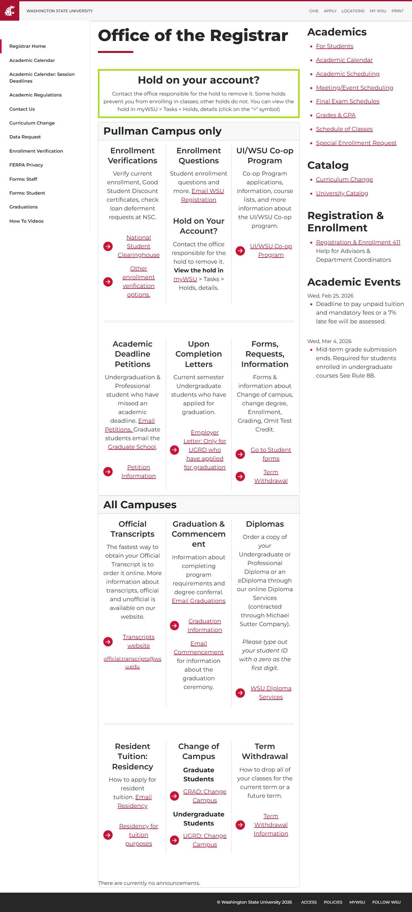
</a>
<br />❌ <code>/</code>
</td>
<td align="center" width="33%">
<a href="academic-calendar/report.md">
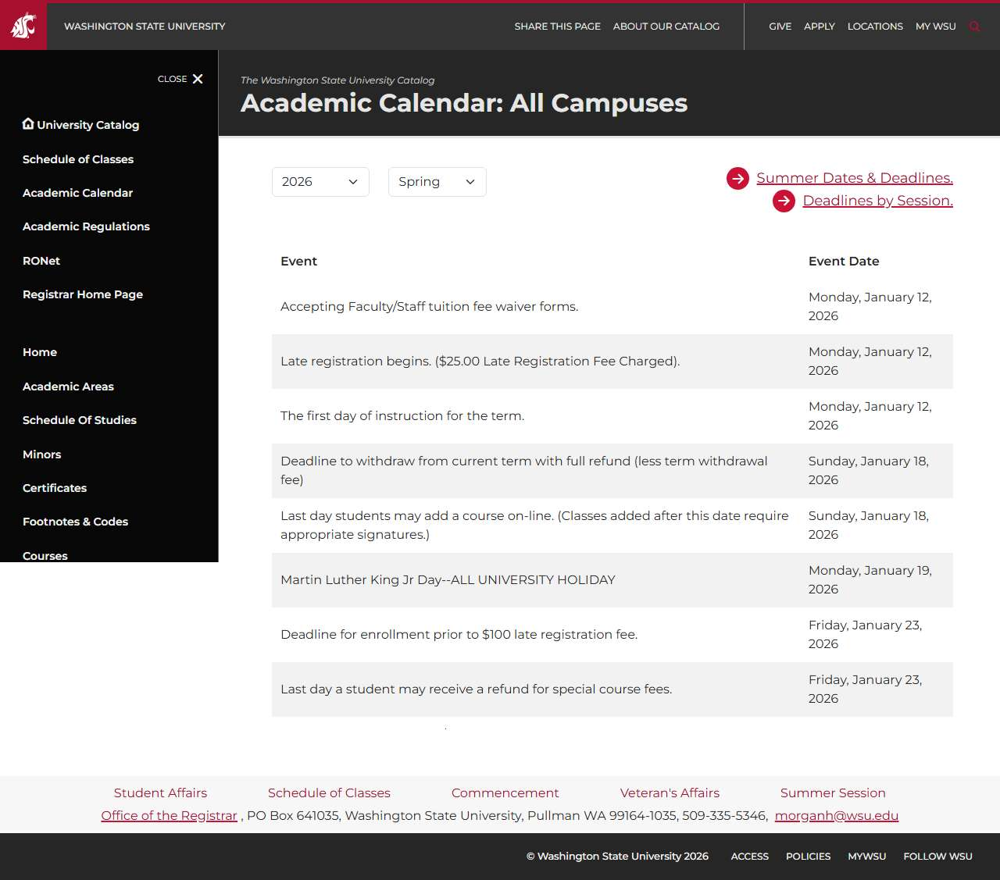
</a>
<br />✅ <code>/academic-calendar/</code>
</td>
<td align="center" width="33%">
<a href="academic-regulations/report.md">

</a>
<br />❌ <code>/academic-regulations/</code>
</td>
</tr>
<tr>
<td align="center" width="33%">
<a href="change-of-campus/report.md">
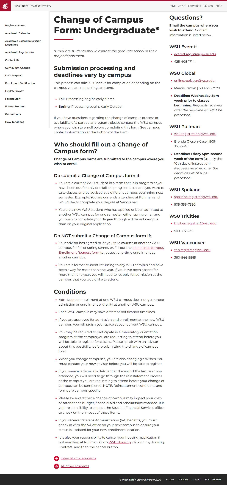
</a>
<br />❌ <code>/change-of-campus/</code>
</td>
<td align="center" width="33%">
<a href="contact-us/report.md">
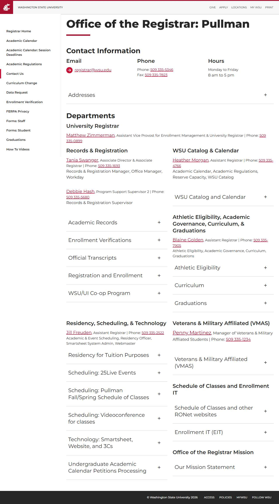
</a>
<br />❌ <code>/contact-us/</code>
</td>
<td align="center" width="33%">
<a href="deadlines-drop-withdrawal/report.md">

</a>
<br />❌ <code>/deadlines-drop-withdrawal/</code>
</td>
</tr>
<tr>
<td align="center" width="33%">
<a href="grades-and-gpa/report.md">
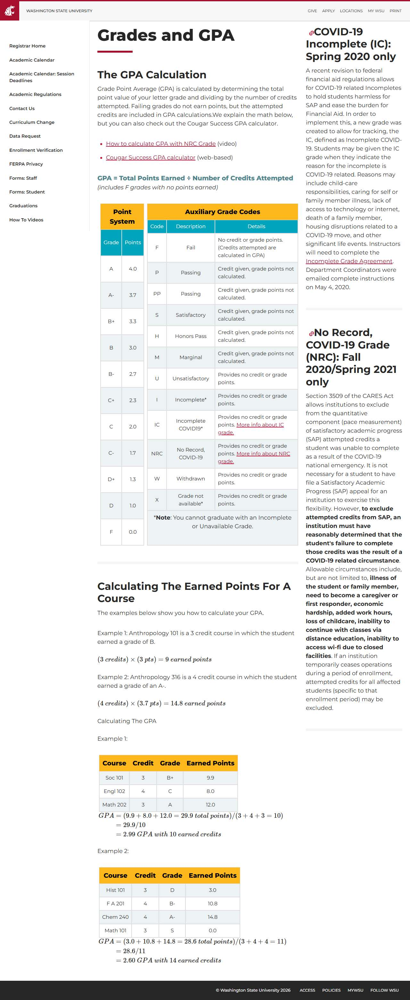
</a>
<br />❌ <code>/grades-and-gpa/</code>
</td>
<td align="center" width="33%">
<a href="how-to-videos/report.md">
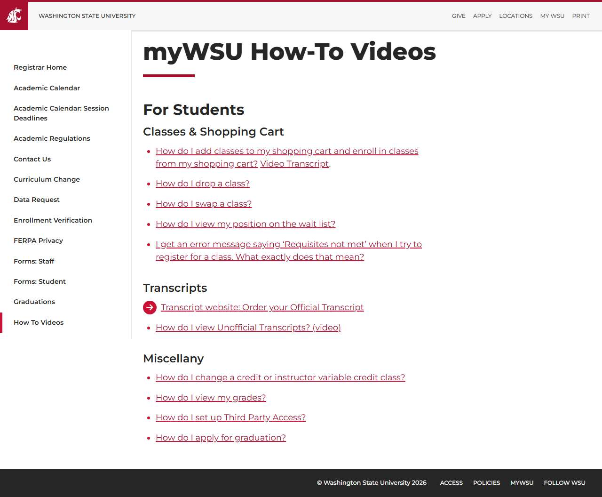
</a>
<br />❌ <code>/how-to-videos/</code>
</td>
<td align="center" width="33%">
<a href="petitions/report.md">
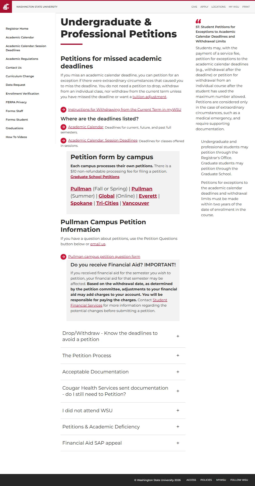
</a>
<br />❌ <code>/petitions/</code>
</td>
</tr>
<tr>
<td align="center" width="33%">
<a href="sessions/report.md">

</a>
<br />❌ <code>/sessions/</code>
</td>
<td align="center" width="33%">
<a href="special-enrollment/report.md">
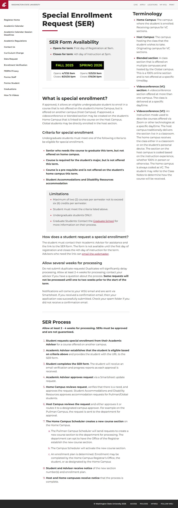
</a>
<br />❌ <code>/special-enrollment/</code>
</td>
<td align="center" width="33%">
<a href="staff-forms/report.md">
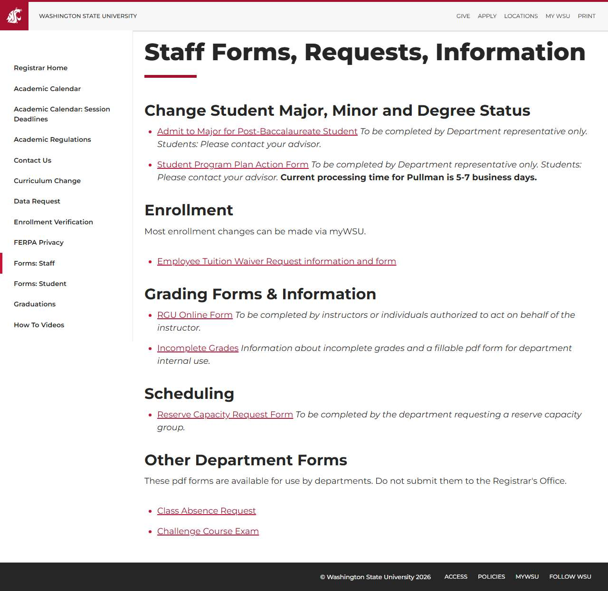
</a>
<br />❌ <code>/staff-forms/</code>
</td>
</tr>
<tr>
<td align="center" width="33%">
<a href="student-forms/report.md">
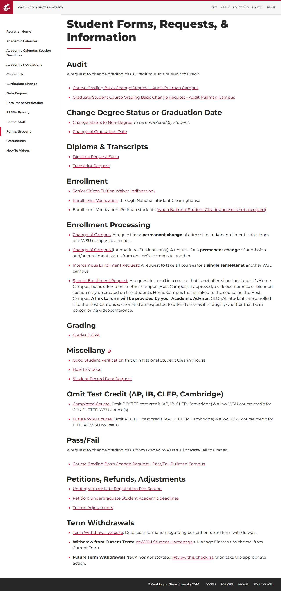
</a>
<br />❌ <code>/student-forms/</code>
</td>
<td align="center" width="33%">
<a href="term-withdrawal/report.md">
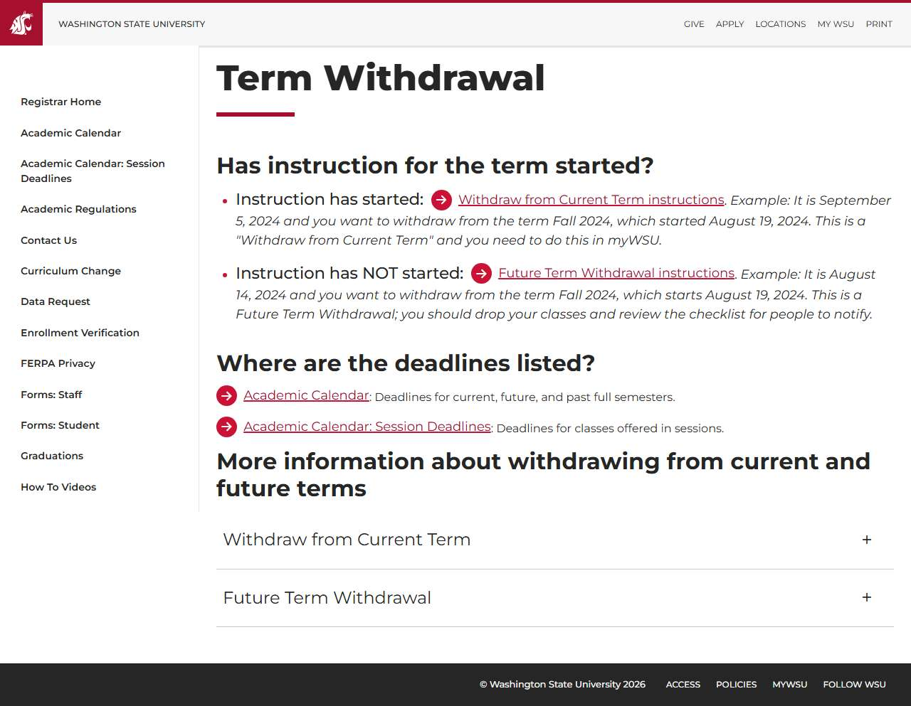
</a>
<br />❌ <code>/term-withdrawal/</code>
</td>
<td align="center" width="33%">
<a href="term-withdrawal_child_withdraw-from-current-term/report.md">
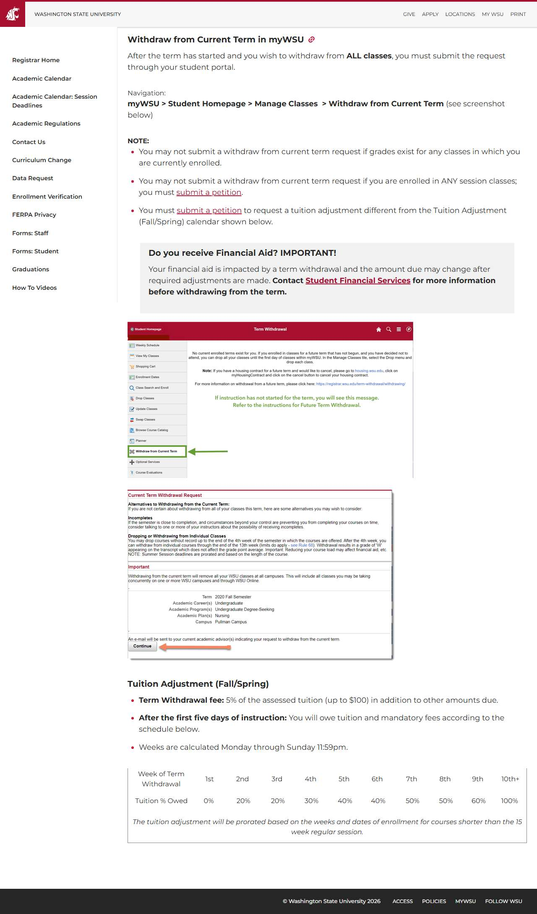
</a>
<br />❌ <code>/term-withdrawal/child/withdraw-from-current-term/</code>
</td>
</tr>
<tr>
<td align="center" width="33%">
<a href="term-withdrawal_withdrawing/report.md">
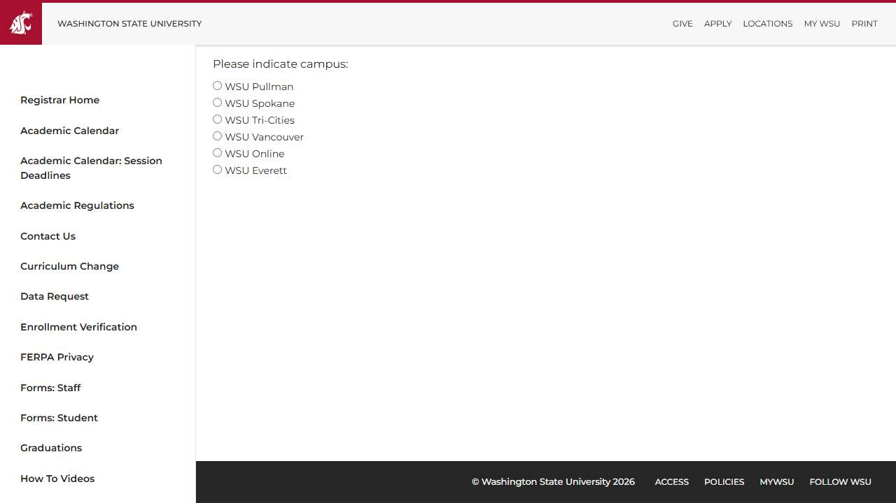
</a>
<br />❌ <code>/term-withdrawal/withdrawing/</code>
</td>
<td align="center" width="33%">
<a href="tuition-adjustments/report.md">
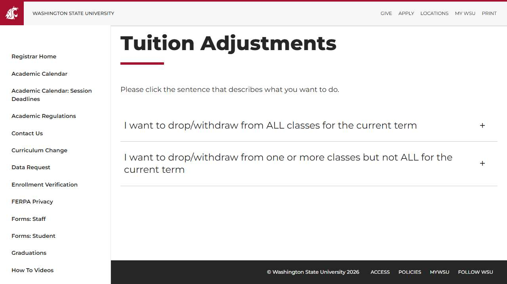
</a>
<br />❌ <code>/tuition-adjustments/</code>
</td>
<td></td>
</tr>
</table>

## ❌ Failed Pages

<details open>
<summary><strong>16 page(s) failed</strong></summary>

| Page | HTTP | Error |
|------|:----:|-------|
| [/](_root/report.md) | 0 | — |
| [/academic-regulations/](academic-regulations/report.md) | 0 | — |
| [/change-of-campus/](change-of-campus/report.md) | 0 | — |
| [/contact-us/](contact-us/report.md) | 0 | — |
| [/deadlines-drop-withdrawal/](deadlines-drop-withdrawal/report.md) | 0 | — |
| [/grades-and-gpa/](grades-and-gpa/report.md) | 0 | — |
| [/how-to-videos/](how-to-videos/report.md) | 0 | — |
| [/petitions/](petitions/report.md) | 0 | — |
| [/sessions/](sessions/report.md) | 0 | — |
| [/special-enrollment/](special-enrollment/report.md) | 0 | — |
| [/staff-forms/](staff-forms/report.md) | 0 | — |
| [/student-forms/](student-forms/report.md) | 0 | — |
| [/term-withdrawal/](term-withdrawal/report.md) | 0 | — |
| [/term-withdrawal/child/withdraw-from-current-term/](term-withdrawal_child_withdraw-from-current-term/report.md) | 0 | — |
| [/term-withdrawal/withdrawing/](term-withdrawal_withdrawing/report.md) | 0 | — |
| [/tuition-adjustments/](tuition-adjustments/report.md) | 0 | — |

</details>

## ♿ Accessibility Summary

| Metric | Value |
|--------|-------|
| Pages with violations | 17/17 |
| Total violations | 141 |
| 🔴 Critical | 23 |
| 🟠 Serious | 106 |
| 🟡 Moderate | 12 |
| 🔵 Minor | 0 |

### Top 10 Issues

| # | Rule | Sev | Pages | Instances |
|--:|------|:---:|:-----:|:---------:|
| 1 | aria-allowed-attr | 🔴 | 16/17 | 16 |
| 2 | label | 🔴 | 1/17 | 2 |
| 3 | link-name | 🟠 | 9/17 | 95 |
| 4 | select-name | 🔴 | 3/17 | 6 |
| 5 | listitem | 🟠 | 1/17 | 8 |
| 6 | document-title | 🟠 | 1/17 | 1 |
| 7 | list | 🟠 | 1/17 | 1 |
| 8 | td-has-header | 🟡 | 6/17 | 8 |
| 9 | heading-order | 🟡 | 2/17 | 2 |
| 10 | skip-link | 🟡 | 1/17 | 1 |

---

*Generated by AccessibilityScanner (FreeTools) v1.0*
