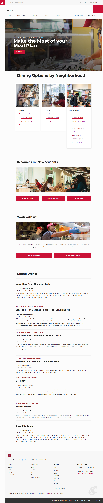

# 📊 Accessibility Scanner — Run Report

> **Generated:** 2026-02-16 22:22:03 UTC  
> **Status:** ⚠️ 28 page(s) failed  
> **Sites:** 120 | **Pages:** 502  

---

## 📑 Contents

- [Dashboard](#-dashboard)
- [Sites](#-sites)
- [Screenshot Gallery](#-screenshot-gallery)
- [All Pages](#-all-pages)
- [Failed Pages](#-failed-pages)
- [JavaScript Errors](#-javascript-errors)

---

## 📋 Dashboard

```
Page Success:     [████████████████████████████░░] 94%
Alt Text Cover:   [████████████████░░░░░░░░░░░░░░] 55%
```

| ✅ Passed | ❌ Failed | 🖼️ Images | ⚠️ Missing Alt | 🔴 JS Errors |
|:---------:|:---------:|:----------:|:--------------:|:------------:|
| 474 | 28 | 2637 | 1189 | 342 |

| Metric | Value |
|--------|-------|
| Sites | 120 |
| Total Pages | 502 |
| Total Images | 2637 (893.6 MB) |
| Total HTML | 92.3 MB |
| Total Screenshots | 468.7 MB |

## 🌐 Sites

| Status | Site | Pages | Passed | Failed | Images | Missing Alt |
|:------:|------|:-----:|:------:|:------:|:------:|:-----------:|
| ✅ | [https://aapi.wsu.edu/](aapi-wsu-edu/report.md) | 1 | 1 | 0 | 1 | 1 |
| ✅ | [https://aastudentcenter.wsu.edu/](aastudentcenter-wsu-edu/report.md) | 1 | 1 | 0 | 2 | 1 |
| ✅ | [https://access.wsu.edu/](access-wsu-edu/report.md) | 2 | 2 | 0 | 0 | 0 |
| ✅ | [https://accesscenter.wsu.edu/](accesscenter-wsu-edu/report.md) | 6 | 6 | 0 | 6 | 6 |
| ✅ | [https://account.wsu.edu/](account-wsu-edu/report.md) | 4 | 4 | 0 | 4 | 0 |
| ✅ | [https://accreditation.wsu.edu/](accreditation-wsu-edu/report.md) | 4 | 4 | 0 | 5 | 3 |
| ✅ | [https://acctspay.wsu.edu/](acctspay-wsu-edu/report.md) | 3 | 3 | 0 | 12 | 12 |
| ✅ | [https://ace.wsu.edu/](ace-wsu-edu/report.md) | 4 | 4 | 0 | 2 | 0 |
| ✅ | [https://adarp.wsu.edu/](adarp-wsu-edu/report.md) | 1 | 1 | 0 | 3 | 3 |
| ✅ | [https://admission.wsu.edu/](admission-wsu-edu/report.md) | 6 | 6 | 0 | 48 | 7 |
| ✅ | [https://advance.wsu.edu/](advance-wsu-edu/report.md) | 3 | 3 | 0 | 5 | 3 |
| ✅ | [https://advising.wsu.edu/](advising-wsu-edu/report.md) | 2 | 2 | 0 | 7 | 1 |
| ✅ | [https://afrotc.wsu.edu/](afrotc-wsu-edu/report.md) | 1 | 1 | 0 | 1 | 1 |
| ✅ | [https://afs.wsu.edu/](afs-wsu-edu/report.md) | 1 | 1 | 0 | 13 | 13 |
| ✅ | [https://afw.wsu.edu/](afw-wsu-edu/report.md) | 1 | 1 | 0 | 0 | 0 |
| ✅ | [https://alert.wsu.edu/](alert-wsu-edu/report.md) | 1 | 1 | 0 | 0 | 0 |
| ✅ | [https://alumni.wsu.edu/](alumni-wsu-edu/report.md) | 6 | 6 | 0 | 25 | 6 |
| ⚠️ | [https://amdt.wsu.edu/](amdt-wsu-edu/report.md) | 3 | 1 | 2 | 24 | 8 |
| ✅ | [https://ansci.wsu.edu/](ansci-wsu-edu/report.md) | 6 | 6 | 0 | 45 | 33 |
| ✅ | [https://anthro.wsu.edu/](anthro-wsu-edu/report.md) | 4 | 4 | 0 | 25 | 18 |
| ✅ | [https://aoi.wsu.edu/](aoi-wsu-edu/report.md) | 1 | 1 | 0 | 1 | 0 |
| ✅ | [https://apac.wsu.edu/](apac-wsu-edu/report.md) | 3 | 3 | 0 | 6 | 3 |
| ✅ | [https://archaeology.wsu.edu/](archaeology-wsu-edu/report.md) | 1 | 1 | 0 | 1 | 0 |
| ✅ | [https://ascc.wsu.edu/](ascc-wsu-edu/report.md) | 2 | 2 | 0 | 80 | 56 |
| ✅ | [https://asce.wsu.edu/](asce-wsu-edu/report.md) | 2 | 2 | 0 | 2 | 2 |
| ✅ | [https://askdruniverse.wsu.edu/](askdruniverse-wsu-edu/report.md) | 2 | 2 | 0 | 16 | 9 |
| ✅ | [https://asl.wsu.edu/](asl-wsu-edu/report.md) | 6 | 6 | 0 | 18 | 13 |
| ✅ | [https://aswsu.wsu.edu/](aswsu-wsu-edu/report.md) | 1 | 1 | 0 | 0 | 0 |
| ✅ | [https://atg.wsu.edu/](atg-wsu-edu/report.md) | 2 | 2 | 0 | 0 | 0 |
| ✅ | [https://brand.wsu.edu/](brand-wsu-edu/report.md) | 5 | 5 | 0 | 44 | 44 |
| ✅ | [https://bursar.wsu.edu/](bursar-wsu-edu/report.md) | 5 | 5 | 0 | 18 | 17 |
| ✅ | [https://business.wsu.edu/](business-wsu-edu/report.md) | 3 | 3 | 0 | 26 | 15 |
| ⚠️ | [https://cahnrs.wsu.edu/](cahnrs-wsu-edu/report.md) | 5 | 4 | 1 | 58 | 0 |
| ⚠️ | [https://campusvet.wsu.edu/](campusvet-wsu-edu/report.md) | 4 | 3 | 1 | 0 | 0 |
| ✅ | [https://cas.wsu.edu/](cas-wsu-edu/report.md) | 5 | 5 | 0 | 18 | 0 |
| ✅ | [https://catalog.wsu.edu/](catalog-wsu-edu/report.md) | 1 | 1 | 0 | 0 | 0 |
| ✅ | [https://ccr.wsu.edu/](ccr-wsu-edu/report.md) | 4 | 4 | 0 | 11 | 0 |
| ✅ | [https://ceshs.wsu.edu/](ceshs-wsu-edu/report.md) | 5 | 5 | 0 | 29 | 18 |
| ✅ | [https://chemistry.wsu.edu/](chemistry-wsu-edu/report.md) | 7 | 7 | 0 | 49 | 0 |
| ✅ | [https://commencement.wsu.edu/](commencement-wsu-edu/report.md) | 2 | 2 | 0 | 7 | 6 |
| ✅ | [https://communitystandards.wsu.edu/](communitystandards-wsu-edu/report.md) | 1 | 1 | 0 | 9 | 0 |
| ✅ | [https://cougarcard.wsu.edu/](cougarcard-wsu-edu/report.md) | 1 | 1 | 0 | 0 | 0 |
| ✅ | [https://degrees.wsu.edu/](degrees-wsu-edu/report.md) | 1 | 1 | 0 | 7 | 7 |
| ✅ | [https://dining.wsu.edu/](dining-wsu-edu/report.md) | 2 | 2 | 0 | 16 | 3 |
| ✅ | [https://diversity.wsu.edu/](diversity-wsu-edu/report.md) | 6 | 6 | 0 | 36 | 30 |
| ⚠️ | [https://education.wsu.edu/](education-wsu-edu/report.md) | 2 | 1 | 1 | 11 | 5 |
| ✅ | [https://ehs.wsu.edu/](ehs-wsu-edu/report.md) | 3 | 3 | 0 | 13 | 11 |
| ⚠️ | [https://em.wsu.edu/](em-wsu-edu/report.md) | 4 | 0 | 4 | 0 | 0 |
| ✅ | [https://email.wsu.edu/](email-wsu-edu/report.md) | 5 | 5 | 0 | 5 | 0 |
| ✅ | [https://english.wsu.edu/](english-wsu-edu/report.md) | 6 | 6 | 0 | 4 | 1 |
| ✅ | [https://events.wsu.edu/](events-wsu-edu/report.md) | 2 | 2 | 0 | 0 | 0 |
| ✅ | [https://everett.wsu.edu/](everett-wsu-edu/report.md) | 6 | 6 | 0 | 115 | 94 |
| ✅ | [https://extension.wsu.edu/](extension-wsu-edu/report.md) | 2 | 2 | 0 | 14 | 0 |
| ✅ | [https://facsen.wsu.edu/](facsen-wsu-edu/report.md) | 4 | 4 | 0 | 11 | 11 |
| ✅ | [https://financialaid.wsu.edu/](financialaid-wsu-edu/report.md) | 3 | 3 | 0 | 26 | 0 |
| ✅ | [https://foundation.wsu.edu/](foundation-wsu-edu/report.md) | 4 | 4 | 0 | 58 | 30 |
| ✅ | [https://genacct.wsu.edu/](genacct-wsu-edu/report.md) | 2 | 2 | 0 | 8 | 0 |
| ✅ | [https://gis.wsu.edu/](gis-wsu-edu/report.md) | 6 | 6 | 0 | 6 | 0 |
| ✅ | [https://go.wsu.edu/](go-wsu-edu/report.md) | 1 | 1 | 0 | 25 | 1 |
| ✅ | [https://gradschool.wsu.edu/](gradschool-wsu-edu/report.md) | 2 | 2 | 0 | 2 | 1 |
| ✅ | [https://history.wsu.edu/](history-wsu-edu/report.md) | 4 | 4 | 0 | 54 | 42 |
| ✅ | [https://honors.wsu.edu/](honors-wsu-edu/report.md) | 2 | 2 | 0 | 15 | 15 |
| ✅ | [https://housing.wsu.edu/](housing-wsu-edu/report.md) | 30 | 30 | 0 | 115 | 32 |
| ✅ | [https://hrs.wsu.edu/](hrs-wsu-edu/report.md) | 5 | 5 | 0 | 25 | 16 |
| ✅ | [https://hub.wsu.edu/](hub-wsu-edu/report.md) | 1 | 1 | 0 | 0 | 0 |
| ✅ | [https://index.wsu.edu/](index-wsu-edu/report.md) | 6 | 6 | 0 | 0 | 0 |
| ✅ | [https://ip.wsu.edu/](ip-wsu-edu/report.md) | 4 | 4 | 0 | 13 | 0 |
| ✅ | [https://its.wsu.edu/](its-wsu-edu/report.md) | 21 | 21 | 0 | 41 | 2 |
| ✅ | [https://li.wsu.edu/](li-wsu-edu/report.md) | 2 | 2 | 0 | 2 | 0 |
| ✅ | [https://libraries.wsu.edu/](libraries-wsu-edu/report.md) | 25 | 25 | 0 | 40 | 17 |
| ✅ | [https://lists.wsu.edu/](lists-wsu-edu/report.md) | 1 | 1 | 0 | 0 | 0 |
| ✅ | [https://livingat.wsu.edu/](livingat-wsu-edu/report.md) | 4 | 4 | 0 | 14 | 3 |
| ✅ | [https://maps.wsu.edu/](maps-wsu-edu/report.md) | 2 | 2 | 0 | 5 | 5 |
| ✅ | [https://math.wsu.edu/](math-wsu-edu/report.md) | 4 | 4 | 0 | 50 | 41 |
| ✅ | [https://medicine.wsu.edu/](medicine-wsu-edu/report.md) | 4 | 4 | 0 | 47 | 8 |
| ✅ | [https://murrow.wsu.edu/](murrow-wsu-edu/report.md) | 6 | 6 | 0 | 93 | 16 |
| ✅ | [https://museum.wsu.edu/](museum-wsu-edu/report.md) | 6 | 6 | 0 | 55 | 5 |
| ✅ | [https://my.wsu.edu/](my-wsu-edu/report.md) | 3 | 3 | 0 | 3 | 0 |
| ✅ | [https://native.wsu.edu/](native-wsu-edu/report.md) | 3 | 3 | 0 | 11 | 7 |
| ✅ | [https://news.wsu.edu/](news-wsu-edu/report.md) | 3 | 3 | 0 | 33 | 1 |
| ✅ | [https://nursing.wsu.edu/](nursing-wsu-edu/report.md) | 4 | 4 | 0 | 15 | 0 |
| ✅ | [https://office365.wsu.edu/](office365-wsu-edu/report.md) | 4 | 4 | 0 | 8 | 4 |
| ✅ | [https://online.wsu.edu/](online-wsu-edu/report.md) | 3 | 3 | 0 | 10 | 0 |
| ✅ | [https://orc.wsu.edu/](orc-wsu-edu/report.md) | 6 | 6 | 0 | 18 | 0 |
| ✅ | [https://parking.wsu.edu/](parking-wsu-edu/report.md) | 1 | 1 | 0 | 1 | 1 |
| ✅ | [https://payroll.wsu.edu/](payroll-wsu-edu/report.md) | 2 | 2 | 0 | 1 | 1 |
| ✅ | [https://pharmacy.wsu.edu/](pharmacy-wsu-edu/report.md) | 5 | 5 | 0 | 55 | 35 |
| ✅ | [https://physics.wsu.edu/](physics-wsu-edu/report.md) | 5 | 5 | 0 | 49 | 38 |
| ✅ | [https://policies.wsu.edu/](policies-wsu-edu/report.md) | 1 | 1 | 0 | 0 | 0 |
| ✅ | [https://portal.wsu.edu/](portal-wsu-edu/report.md) | 3 | 3 | 0 | 3 | 0 |
| ✅ | [https://president.wsu.edu/](president-wsu-edu/report.md) | 2 | 2 | 0 | 15 | 15 |
| ✅ | [https://provost.wsu.edu/](provost-wsu-edu/report.md) | 6 | 6 | 0 | 3 | 1 |
| ✅ | [https://psychology.wsu.edu/](psychology-wsu-edu/report.md) | 6 | 6 | 0 | 64 | 38 |
| ✅ | [https://pullman.wsu.edu/](pullman-wsu-edu/report.md) | 4 | 4 | 0 | 41 | 3 |
| ⚠️ | [https://registrar.wsu.edu/](registrar-wsu-edu/report.md) | 14 | 1 | 13 | 0 | 0 |
| ✅ | [https://research.wsu.edu/](research-wsu-edu/report.md) | 7 | 7 | 0 | 20 | 17 |
| ✅ | [https://rotc.wsu.edu/](rotc-wsu-edu/report.md) | 2 | 2 | 0 | 7 | 7 |
| ✅ | [https://schedules.wsu.edu/](schedules-wsu-edu/report.md) | 7 | 7 | 0 | 0 | 0 |
| ✅ | [https://school.eecs.wsu.edu/](school-eecs-wsu-edu/report.md) | 6 | 6 | 0 | 87 | 70 |
| ✅ | [https://sdc.wsu.edu/](sdc-wsu-edu/report.md) | 4 | 4 | 0 | 67 | 58 |
| ✅ | [https://slcr.wsu.edu/](slcr-wsu-edu/report.md) | 4 | 4 | 0 | 39 | 12 |
| ✅ | [https://socialmedia.wsu.edu/](socialmedia-wsu-edu/report.md) | 1 | 1 | 0 | 9 | 0 |
| ⚠️ | [https://spokane.wsu.edu/](spokane-wsu-edu/report.md) | 6 | 5 | 1 | 72 | 12 |
| ✅ | [https://staff.storefront.wsu.edu/](staff-storefront-wsu-edu/report.md) | 2 | 2 | 0 | 9 | 7 |
| ✅ | [https://studentaffairs.vancouver.wsu.edu/](studentaffairs-vancouver-wsu-edu/report.md) | 2 | 2 | 0 | 15 | 11 |
| ✅ | [https://studentaffairs.wsu.edu/](studentaffairs-wsu-edu/report.md) | 1 | 1 | 0 | 1 | 0 |
| ✅ | [https://studentcare.wsu.edu/](studentcare-wsu-edu/report.md) | 1 | 1 | 0 | 0 | 0 |
| ✅ | [https://sustainability.wsu.edu/](sustainability-wsu-edu/report.md) | 1 | 1 | 0 | 7 | 7 |
| ⚠️ | [https://threatassessment.wsu.edu/](threatassessment-wsu-edu/report.md) | 5 | 2 | 3 | 0 | 0 |
| ✅ | [https://transportation.wsu.edu/](transportation-wsu-edu/report.md) | 5 | 5 | 0 | 9 | 1 |
| ✅ | [https://tricities.wsu.edu/](tricities-wsu-edu/report.md) | 7 | 7 | 0 | 77 | 21 |
| ⚠️ | [https://urec.wsu.edu/](urec-wsu-edu/report.md) | 8 | 7 | 1 | 36 | 13 |
| ⚠️ | [https://vancouver.wsu.edu/](vancouver-wsu-edu/report.md) | 5 | 4 | 1 | 40 | 6 |
| ✅ | [https://vcea.wsu.edu/](vcea-wsu-edu/report.md) | 5 | 5 | 0 | 21 | 4 |
| ✅ | [https://vetmed.wsu.edu/](vetmed-wsu-edu/report.md) | 4 | 4 | 0 | 44 | 2 |
| ✅ | [https://visitor.wsu.edu/](visitor-wsu-edu/report.md) | 2 | 2 | 0 | 15 | 0 |
| ✅ | [https://web.wsu.edu/](web-wsu-edu/report.md) | 5 | 5 | 0 | 0 | 0 |
| ✅ | [https://workday.wsu.edu/](workday-wsu-edu/report.md) | 4 | 4 | 0 | 4 | 0 |
| ✅ | [https://wsu.edu/](wsu-edu/report.md) | 16 | 16 | 0 | 181 | 102 |
| ✅ | [https://wsuacada.wsu.edu/](wsuacada-wsu-edu/report.md) | 1 | 1 | 0 | 0 | 0 |

## 📸 Screenshot Gallery

**502 pages** across **120 sites**. Click any thumbnail to view the full page report.

<details>
<summary><strong>✅ aapi.wsu.edu</strong> — 1 page(s)</summary>

<table>
<tr>
<td align="center" width="33%">
<a href="aapi-wsu-edu/_root/report.md">

</a>
<br />✅ <code>/</code>
</td>
<td></td>
<td></td>
</tr>
</table>

</details>

<details>
<summary><strong>✅ aastudentcenter.wsu.edu</strong> — 1 page(s)</summary>

<table>
<tr>
<td align="center" width="33%">
<a href="aastudentcenter-wsu-edu/_root/report.md">

</a>
<br />✅ <code>/</code>
</td>
<td></td>
<td></td>
</tr>
</table>

</details>

<details>
<summary><strong>✅ access.wsu.edu</strong> — 2 page(s)</summary>

<table>
<tr>
<td align="center" width="33%">
<a href="access-wsu-edu/_root/report.md">

</a>
<br />✅ <code>/</code>
</td>
<td align="center" width="33%">
<a href="access-wsu-edu/resources/report.md">

</a>
<br />✅ <code>/resources/</code>
</td>
<td></td>
</tr>
</table>

</details>

<details>
<summary><strong>✅ accesscenter.wsu.edu</strong> — 6 page(s)</summary>

<table>
<tr>
<td align="center" width="33%">
<a href="accesscenter-wsu-edu/_root/report.md">

</a>
<br />✅ <code>/</code>
</td>
<td align="center" width="33%">
<a href="accesscenter-wsu-edu/accommodations/report.md">

</a>
<br />✅ <code>/accommodations/</code>
</td>
<td align="center" width="33%">
<a href="accesscenter-wsu-edu/contact/report.md">

</a>
<br />✅ <code>/contact/</code>
</td>
</tr>
<tr>
<td align="center" width="33%">
<a href="accesscenter-wsu-edu/faculty/report.md">

</a>
<br />✅ <code>/faculty/</code>
</td>
<td align="center" width="33%">
<a href="accesscenter-wsu-edu/services/report.md">

</a>
<br />✅ <code>/services/</code>
</td>
<td align="center" width="33%">
<a href="accesscenter-wsu-edu/students/report.md">

</a>
<br />✅ <code>/students/</code>
</td>
</tr>
</table>

</details>

<details>
<summary><strong>✅ account.wsu.edu</strong> — 4 page(s)</summary>

<table>
<tr>
<td align="center" width="33%">
<a href="account-wsu-edu/_root/report.md">

</a>
<br />✅ <code>/</code>
</td>
<td align="center" width="33%">
<a href="account-wsu-edu/password-reset/report.md">

</a>
<br />✅ <code>/password-reset/</code>
</td>
<td align="center" width="33%">
<a href="account-wsu-edu/security/report.md">

</a>
<br />✅ <code>/security/</code>
</td>
</tr>
<tr>
<td align="center" width="33%">
<a href="account-wsu-edu/services/report.md">

</a>
<br />✅ <code>/services/</code>
</td>
<td></td>
<td></td>
</tr>
</table>

</details>

<details>
<summary><strong>✅ accreditation.wsu.edu</strong> — 4 page(s)</summary>

<table>
<tr>
<td align="center" width="33%">
<a href="accreditation-wsu-edu/_root/report.md">

</a>
<br />✅ <code>/</code>
</td>
<td align="center" width="33%">
<a href="accreditation-wsu-edu/about/report.md">

</a>
<br />✅ <code>/about/</code>
</td>
<td align="center" width="33%">
<a href="accreditation-wsu-edu/documents/report.md">

</a>
<br />✅ <code>/documents/</code>
</td>
</tr>
<tr>
<td align="center" width="33%">
<a href="accreditation-wsu-edu/standards/report.md">

</a>
<br />✅ <code>/standards/</code>
</td>
<td></td>
<td></td>
</tr>
</table>

</details>

<details>
<summary><strong>✅ acctspay.wsu.edu</strong> — 3 page(s)</summary>

<table>
<tr>
<td align="center" width="33%">
<a href="acctspay-wsu-edu/_root/report.md">

</a>
<br />✅ <code>/</code>
</td>
<td align="center" width="33%">
<a href="acctspay-wsu-edu/contact/report.md">

</a>
<br />✅ <code>/contact/</code>
</td>
<td align="center" width="33%">
<a href="acctspay-wsu-edu/forms/report.md">

</a>
<br />✅ <code>/forms/</code>
</td>
</tr>
</table>

</details>

<details>
<summary><strong>✅ ace.wsu.edu</strong> — 4 page(s)</summary>

<table>
<tr>
<td align="center" width="33%">
<a href="ace-wsu-edu/_root/report.md">

</a>
<br />✅ <code>/</code>
</td>
<td align="center" width="33%">
<a href="ace-wsu-edu/accreditation/report.md">

</a>
<br />✅ <code>/accreditation/</code>
</td>
<td align="center" width="33%">
<a href="ace-wsu-edu/assessment/report.md">

</a>
<br />✅ <code>/assessment/</code>
</td>
</tr>
<tr>
<td align="center" width="33%">
<a href="ace-wsu-edu/reporting/report.md">

</a>
<br />✅ <code>/reporting/</code>
</td>
<td></td>
<td></td>
</tr>
</table>

</details>

<details>
<summary><strong>✅ adarp.wsu.edu</strong> — 1 page(s)</summary>

<table>
<tr>
<td align="center" width="33%">
<a href="adarp-wsu-edu/_root/report.md">

</a>
<br />✅ <code>/</code>
</td>
<td></td>
<td></td>
</tr>
</table>

</details>

<details>
<summary><strong>✅ admission.wsu.edu</strong> — 6 page(s)</summary>

<table>
<tr>
<td align="center" width="33%">
<a href="admission-wsu-edu/_root/report.md">

</a>
<br />✅ <code>/</code>
</td>
<td align="center" width="33%">
<a href="admission-wsu-edu/apply/report.md">

</a>
<br />✅ <code>/apply/</code>
</td>
<td align="center" width="33%">
<a href="admission-wsu-edu/contact/report.md">

</a>
<br />✅ <code>/contact/</code>
</td>
</tr>
<tr>
<td align="center" width="33%">
<a href="admission-wsu-edu/international/report.md">

</a>
<br />✅ <code>/international/</code>
</td>
<td align="center" width="33%">
<a href="admission-wsu-edu/transfer/report.md">

</a>
<br />✅ <code>/transfer/</code>
</td>
<td align="center" width="33%">
<a href="admission-wsu-edu/visit/report.md">

</a>
<br />✅ <code>/visit/</code>
</td>
</tr>
</table>

</details>

<details>
<summary><strong>✅ advance.wsu.edu</strong> — 3 page(s)</summary>

<table>
<tr>
<td align="center" width="33%">
<a href="advance-wsu-edu/_root/report.md">

</a>
<br />✅ <code>/</code>
</td>
<td align="center" width="33%">
<a href="advance-wsu-edu/about/report.md">

</a>
<br />✅ <code>/about/</code>
</td>
<td align="center" width="33%">
<a href="advance-wsu-edu/resources/report.md">

</a>
<br />✅ <code>/resources/</code>
</td>
</tr>
</table>

</details>

<details>
<summary><strong>✅ advising.wsu.edu</strong> — 2 page(s)</summary>

<table>
<tr>
<td align="center" width="33%">
<a href="advising-wsu-edu/_root/report.md">

</a>
<br />✅ <code>/</code>
</td>
<td align="center" width="33%">
<a href="advising-wsu-edu/students/report.md">

</a>
<br />✅ <code>/students/</code>
</td>
<td></td>
</tr>
</table>

</details>

<details>
<summary><strong>✅ afrotc.wsu.edu</strong> — 1 page(s)</summary>

<table>
<tr>
<td align="center" width="33%">
<a href="afrotc-wsu-edu/_root/report.md">

</a>
<br />✅ <code>/</code>
</td>
<td></td>
<td></td>
</tr>
</table>

</details>

<details>
<summary><strong>✅ afs.wsu.edu</strong> — 1 page(s)</summary>

<table>
<tr>
<td align="center" width="33%">
<a href="afs-wsu-edu/_root/report.md">

</a>
<br />✅ <code>/</code>
</td>
<td></td>
<td></td>
</tr>
</table>

</details>

<details>
<summary><strong>✅ afw.wsu.edu</strong> — 1 page(s)</summary>

<table>
<tr>
<td align="center" width="33%">
<a href="afw-wsu-edu/_root/report.md">

</a>
<br />✅ <code>/</code>
</td>
<td></td>
<td></td>
</tr>
</table>

</details>

<details>
<summary><strong>✅ alert.wsu.edu</strong> — 1 page(s)</summary>

<table>
<tr>
<td align="center" width="33%">
<a href="alert-wsu-edu/_root/report.md">

</a>
<br />✅ <code>/</code>
</td>
<td></td>
<td></td>
</tr>
</table>

</details>

<details>
<summary><strong>✅ alumni.wsu.edu</strong> — 6 page(s)</summary>

<table>
<tr>
<td align="center" width="33%">
<a href="alumni-wsu-edu/_root/report.md">

</a>
<br />✅ <code>/</code>
</td>
<td align="center" width="33%">
<a href="alumni-wsu-edu/benefits/report.md">

</a>
<br />✅ <code>/benefits/</code>
</td>
<td align="center" width="33%">
<a href="alumni-wsu-edu/chapters/report.md">

</a>
<br />✅ <code>/chapters/</code>
</td>
</tr>
<tr>
<td align="center" width="33%">
<a href="alumni-wsu-edu/contact/report.md">

</a>
<br />✅ <code>/contact/</code>
</td>
<td align="center" width="33%">
<a href="alumni-wsu-edu/events/report.md">

</a>
<br />✅ <code>/events/</code>
</td>
<td align="center" width="33%">
<a href="alumni-wsu-edu/giving/report.md">

</a>
<br />✅ <code>/giving/</code>
</td>
</tr>
</table>

</details>

<details>
<summary><strong>⚠️ amdt.wsu.edu</strong> — 3 page(s)</summary>

<table>
<tr>
<td align="center" width="33%">
<a href="amdt-wsu-edu/_root/report.md">

</a>
<br />❌ <code>/</code>
</td>
<td align="center" width="33%">
<a href="amdt-wsu-edu/about/report.md">

</a>
<br />❌ <code>/about/</code>
</td>
<td align="center" width="33%">
<a href="amdt-wsu-edu/faculty/report.md">

</a>
<br />✅ <code>/faculty/</code>
</td>
</tr>
</table>

</details>

<details>
<summary><strong>✅ ansci.wsu.edu</strong> — 6 page(s)</summary>

<table>
<tr>
<td align="center" width="33%">
<a href="ansci-wsu-edu/_root/report.md">

</a>
<br />✅ <code>/</code>
</td>
<td align="center" width="33%">
<a href="ansci-wsu-edu/about/report.md">

</a>
<br />✅ <code>/about/</code>
</td>
<td align="center" width="33%">
<a href="ansci-wsu-edu/faculty/report.md">

</a>
<br />✅ <code>/faculty/</code>
</td>
</tr>
<tr>
<td align="center" width="33%">
<a href="ansci-wsu-edu/graduate/report.md">

</a>
<br />✅ <code>/graduate/</code>
</td>
<td align="center" width="33%">
<a href="ansci-wsu-edu/research/report.md">

</a>
<br />✅ <code>/research/</code>
</td>
<td align="center" width="33%">
<a href="ansci-wsu-edu/undergraduate/report.md">

</a>
<br />✅ <code>/undergraduate/</code>
</td>
</tr>
</table>

</details>

<details>
<summary><strong>✅ anthro.wsu.edu</strong> — 4 page(s)</summary>

<table>
<tr>
<td align="center" width="33%">
<a href="anthro-wsu-edu/_root/report.md">

</a>
<br />✅ <code>/</code>
</td>
<td align="center" width="33%">
<a href="anthro-wsu-edu/faculty/report.md">

</a>
<br />✅ <code>/faculty/</code>
</td>
<td align="center" width="33%">
<a href="anthro-wsu-edu/graduate/report.md">

</a>
<br />✅ <code>/graduate/</code>
</td>
</tr>
<tr>
<td align="center" width="33%">
<a href="anthro-wsu-edu/research/report.md">

</a>
<br />✅ <code>/research/</code>
</td>
<td></td>
<td></td>
</tr>
</table>

</details>

<details>
<summary><strong>✅ aoi.wsu.edu</strong> — 1 page(s)</summary>

<table>
<tr>
<td align="center" width="33%">
<a href="aoi-wsu-edu/_root/report.md">

</a>
<br />✅ <code>/</code>
</td>
<td></td>
<td></td>
</tr>
</table>

</details>

<details>
<summary><strong>✅ apac.wsu.edu</strong> — 3 page(s)</summary>

<table>
<tr>
<td align="center" width="33%">
<a href="apac-wsu-edu/_root/report.md">

</a>
<br />✅ <code>/</code>
</td>
<td align="center" width="33%">
<a href="apac-wsu-edu/contact/report.md">

</a>
<br />✅ <code>/contact/</code>
</td>
<td align="center" width="33%">
<a href="apac-wsu-edu/resources/report.md">

</a>
<br />✅ <code>/resources/</code>
</td>
</tr>
</table>

</details>

<details>
<summary><strong>✅ archaeology.wsu.edu</strong> — 1 page(s)</summary>

<table>
<tr>
<td align="center" width="33%">
<a href="archaeology-wsu-edu/_root/report.md">

</a>
<br />✅ <code>/</code>
</td>
<td></td>
<td></td>
</tr>
</table>

</details>

<details>
<summary><strong>✅ ascc.wsu.edu</strong> — 2 page(s)</summary>

<table>
<tr>
<td align="center" width="33%">
<a href="ascc-wsu-edu/_root/report.md">

</a>
<br />✅ <code>/</code>
</td>
<td align="center" width="33%">
<a href="ascc-wsu-edu/career-services/report.md">

</a>
<br />✅ <code>/career-services/</code>
</td>
<td></td>
</tr>
</table>

</details>

<details>
<summary><strong>✅ asce.wsu.edu</strong> — 2 page(s)</summary>

<table>
<tr>
<td align="center" width="33%">
<a href="asce-wsu-edu/_root/report.md">

</a>
<br />✅ <code>/</code>
</td>
<td align="center" width="33%">
<a href="asce-wsu-edu/membership/report.md">

</a>
<br />✅ <code>/membership/</code>
</td>
<td></td>
</tr>
</table>

</details>

<details>
<summary><strong>✅ askdruniverse.wsu.edu</strong> — 2 page(s)</summary>

<table>
<tr>
<td align="center" width="33%">
<a href="askdruniverse-wsu-edu/_root/report.md">

</a>
<br />✅ <code>/</code>
</td>
<td align="center" width="33%">
<a href="askdruniverse-wsu-edu/about/report.md">

</a>
<br />✅ <code>/about/</code>
</td>
<td></td>
</tr>
</table>

</details>

<details>
<summary><strong>✅ asl.wsu.edu</strong> — 6 page(s)</summary>

<table>
<tr>
<td align="center" width="33%">
<a href="asl-wsu-edu/_root/report.md">

</a>
<br />✅ <code>/</code>
</td>
<td align="center" width="33%">
<a href="asl-wsu-edu/about/report.md">

</a>
<br />✅ <code>/about/</code>
</td>
<td align="center" width="33%">
<a href="asl-wsu-edu/contact/report.md">

</a>
<br />✅ <code>/contact/</code>
</td>
</tr>
<tr>
<td align="center" width="33%">
<a href="asl-wsu-edu/facilities/report.md">

</a>
<br />✅ <code>/facilities/</code>
</td>
<td align="center" width="33%">
<a href="asl-wsu-edu/publications/report.md">

</a>
<br />✅ <code>/publications/</code>
</td>
<td align="center" width="33%">
<a href="asl-wsu-edu/research/report.md">

</a>
<br />✅ <code>/research/</code>
</td>
</tr>
</table>

</details>

<details>
<summary><strong>✅ aswsu.wsu.edu</strong> — 1 page(s)</summary>

<table>
<tr>
<td align="center" width="33%">
<a href="aswsu-wsu-edu/_root/report.md">

</a>
<br />✅ <code>/</code>
</td>
<td></td>
<td></td>
</tr>
</table>

</details>

<details>
<summary><strong>✅ atg.wsu.edu</strong> — 2 page(s)</summary>

<table>
<tr>
<td align="center" width="33%">
<a href="atg-wsu-edu/_root/report.md">

</a>
<br />✅ <code>/</code>
</td>
<td align="center" width="33%">
<a href="atg-wsu-edu/contact/report.md">

</a>
<br />✅ <code>/contact/</code>
</td>
<td></td>
</tr>
</table>

</details>

<details>
<summary><strong>✅ brand.wsu.edu</strong> — 5 page(s)</summary>

<table>
<tr>
<td align="center" width="33%">
<a href="brand-wsu-edu/_root/report.md">

</a>
<br />✅ <code>/</code>
</td>
<td align="center" width="33%">
<a href="brand-wsu-edu/colors/report.md">

</a>
<br />✅ <code>/colors/</code>
</td>
<td align="center" width="33%">
<a href="brand-wsu-edu/downloads/report.md">

</a>
<br />✅ <code>/downloads/</code>
</td>
</tr>
<tr>
<td align="center" width="33%">
<a href="brand-wsu-edu/logos/report.md">

</a>
<br />✅ <code>/logos/</code>
</td>
<td align="center" width="33%">
<a href="brand-wsu-edu/typography/report.md">

</a>
<br />✅ <code>/typography/</code>
</td>
<td></td>
</tr>
</table>

</details>

<details>
<summary><strong>✅ bursar.wsu.edu</strong> — 5 page(s)</summary>

<table>
<tr>
<td align="center" width="33%">
<a href="bursar-wsu-edu/_root/report.md">

</a>
<br />✅ <code>/</code>
</td>
<td align="center" width="33%">
<a href="bursar-wsu-edu/billing/report.md">

</a>
<br />✅ <code>/billing/</code>
</td>
<td align="center" width="33%">
<a href="bursar-wsu-edu/contact/report.md">

</a>
<br />✅ <code>/contact/</code>
</td>
</tr>
<tr>
<td align="center" width="33%">
<a href="bursar-wsu-edu/payment/report.md">

</a>
<br />✅ <code>/payment/</code>
</td>
<td align="center" width="33%">
<a href="bursar-wsu-edu/policies/report.md">

</a>
<br />✅ <code>/policies/</code>
</td>
<td></td>
</tr>
</table>

</details>

<details>
<summary><strong>✅ business.wsu.edu</strong> — 3 page(s)</summary>

<table>
<tr>
<td align="center" width="33%">
<a href="business-wsu-edu/_root/report.md">

</a>
<br />✅ <code>/</code>
</td>
<td align="center" width="33%">
<a href="business-wsu-edu/graduate/report.md">

</a>
<br />✅ <code>/graduate/</code>
</td>
<td align="center" width="33%">
<a href="business-wsu-edu/undergraduate/report.md">

</a>
<br />✅ <code>/undergraduate/</code>
</td>
</tr>
</table>

</details>

<details>
<summary><strong>⚠️ cahnrs.wsu.edu</strong> — 5 page(s)</summary>

<table>
<tr>
<td align="center" width="33%">
<a href="cahnrs-wsu-edu/_root/report.md">

</a>
<br />✅ <code>/</code>
</td>
<td align="center" width="33%">
<a href="cahnrs-wsu-edu/about/report.md">

</a>
<br />✅ <code>/about/</code>
</td>
<td align="center" width="33%">
<a href="cahnrs-wsu-edu/academics/report.md">

</a>
<br />❌ <code>/academics/</code>
</td>
</tr>
<tr>
<td align="center" width="33%">
<a href="cahnrs-wsu-edu/extension/report.md">

</a>
<br />✅ <code>/extension/</code>
</td>
<td align="center" width="33%">
<a href="cahnrs-wsu-edu/research/report.md">

</a>
<br />✅ <code>/research/</code>
</td>
<td></td>
</tr>
</table>

</details>

<details>
<summary><strong>⚠️ campusvet.wsu.edu</strong> — 4 page(s)</summary>

<table>
<tr>
<td align="center" width="33%">
<a href="campusvet-wsu-edu/_root/report.md">

</a>
<br />✅ <code>/</code>
</td>
<td align="center" width="33%">
<a href="campusvet-wsu-edu/compliance/report.md">

</a>
<br />❌ <code>/compliance/</code>
</td>
<td align="center" width="33%">
<a href="campusvet-wsu-edu/resources/report.md">

</a>
<br />✅ <code>/resources/</code>
</td>
</tr>
<tr>
<td align="center" width="33%">
<a href="campusvet-wsu-edu/training/report.md">

</a>
<br />✅ <code>/training/</code>
</td>
<td></td>
<td></td>
</tr>
</table>

</details>

<details>
<summary><strong>✅ cas.wsu.edu</strong> — 5 page(s)</summary>

<table>
<tr>
<td align="center" width="33%">
<a href="cas-wsu-edu/_root/report.md">

</a>
<br />✅ <code>/</code>
</td>
<td align="center" width="33%">
<a href="cas-wsu-edu/about/report.md">

</a>
<br />✅ <code>/about/</code>
</td>
<td align="center" width="33%">
<a href="cas-wsu-edu/contact/report.md">

</a>
<br />✅ <code>/contact/</code>
</td>
</tr>
<tr>
<td align="center" width="33%">
<a href="cas-wsu-edu/news/report.md">

</a>
<br />✅ <code>/news/</code>
</td>
<td align="center" width="33%">
<a href="cas-wsu-edu/research/report.md">

</a>
<br />✅ <code>/research/</code>
</td>
<td></td>
</tr>
</table>

</details>

<details>
<summary><strong>✅ catalog.wsu.edu</strong> — 1 page(s)</summary>

<table>
<tr>
<td align="center" width="33%">
<a href="catalog-wsu-edu/_root/report.md">

</a>
<br />✅ <code>/</code>
</td>
<td></td>
<td></td>
</tr>
</table>

</details>

<details>
<summary><strong>✅ ccr.wsu.edu</strong> — 4 page(s)</summary>

<table>
<tr>
<td align="center" width="33%">
<a href="ccr-wsu-edu/_root/report.md">

</a>
<br />✅ <code>/</code>
</td>
<td align="center" width="33%">
<a href="ccr-wsu-edu/policies/report.md">

</a>
<br />✅ <code>/policies/</code>
</td>
<td align="center" width="33%">
<a href="ccr-wsu-edu/reporting/report.md">

</a>
<br />✅ <code>/reporting/</code>
</td>
</tr>
<tr>
<td align="center" width="33%">
<a href="ccr-wsu-edu/resources/report.md">

</a>
<br />✅ <code>/resources/</code>
</td>
<td></td>
<td></td>
</tr>
</table>

</details>

<details>
<summary><strong>✅ ceshs.wsu.edu</strong> — 5 page(s)</summary>

<table>
<tr>
<td align="center" width="33%">
<a href="ceshs-wsu-edu/_root/report.md">

</a>
<br />✅ <code>/</code>
</td>
<td align="center" width="33%">
<a href="ceshs-wsu-edu/about/report.md">

</a>
<br />✅ <code>/about/</code>
</td>
<td align="center" width="33%">
<a href="ceshs-wsu-edu/contact/report.md">

</a>
<br />✅ <code>/contact/</code>
</td>
</tr>
<tr>
<td align="center" width="33%">
<a href="ceshs-wsu-edu/faculty/report.md">

</a>
<br />✅ <code>/faculty/</code>
</td>
<td align="center" width="33%">
<a href="ceshs-wsu-edu/research/report.md">

</a>
<br />✅ <code>/research/</code>
</td>
<td></td>
</tr>
</table>

</details>

<details>
<summary><strong>✅ chemistry.wsu.edu</strong> — 7 page(s)</summary>

<table>
<tr>
<td align="center" width="33%">
<a href="chemistry-wsu-edu/_root/report.md">

</a>
<br />✅ <code>/</code>
</td>
<td align="center" width="33%">
<a href="chemistry-wsu-edu/about/report.md">

</a>
<br />✅ <code>/about/</code>
</td>
<td align="center" width="33%">
<a href="chemistry-wsu-edu/facilities/report.md">

</a>
<br />✅ <code>/facilities/</code>
</td>
</tr>
<tr>
<td align="center" width="33%">
<a href="chemistry-wsu-edu/faculty/report.md">

</a>
<br />✅ <code>/faculty/</code>
</td>
<td align="center" width="33%">
<a href="chemistry-wsu-edu/graduate/report.md">

</a>
<br />✅ <code>/graduate/</code>
</td>
<td align="center" width="33%">
<a href="chemistry-wsu-edu/research/report.md">

</a>
<br />✅ <code>/research/</code>
</td>
</tr>
<tr>
<td align="center" width="33%">
<a href="chemistry-wsu-edu/undergraduate/report.md">

</a>
<br />✅ <code>/undergraduate/</code>
</td>
<td></td>
<td></td>
</tr>
</table>

</details>

<details>
<summary><strong>✅ commencement.wsu.edu</strong> — 2 page(s)</summary>

<table>
<tr>
<td align="center" width="33%">
<a href="commencement-wsu-edu/_root/report.md">

</a>
<br />✅ <code>/</code>
</td>
<td align="center" width="33%">
<a href="commencement-wsu-edu/regalia/report.md">

</a>
<br />✅ <code>/regalia/</code>
</td>
<td></td>
</tr>
</table>

</details>

<details>
<summary><strong>✅ communitystandards.wsu.edu</strong> — 1 page(s)</summary>

<table>
<tr>
<td align="center" width="33%">
<a href="communitystandards-wsu-edu/_root/report.md">

</a>
<br />✅ <code>/</code>
</td>
<td></td>
<td></td>
</tr>
</table>

</details>

<details>
<summary><strong>✅ cougarcard.wsu.edu</strong> — 1 page(s)</summary>

<table>
<tr>
<td align="center" width="33%">
<a href="cougarcard-wsu-edu/_root/report.md">

</a>
<br />✅ <code>/</code>
</td>
<td></td>
<td></td>
</tr>
</table>

</details>

<details>
<summary><strong>✅ degrees.wsu.edu</strong> — 1 page(s)</summary>

<table>
<tr>
<td align="center" width="33%">
<a href="degrees-wsu-edu/_root/report.md">

</a>
<br />✅ <code>/</code>
</td>
<td></td>
<td></td>
</tr>
</table>

</details>

<details>
<summary><strong>✅ dining.wsu.edu</strong> — 2 page(s)</summary>

<table>
<tr>
<td align="center" width="33%">
<a href="dining-wsu-edu/_root/report.md">

</a>
<br />✅ <code>/</code>
</td>
<td align="center" width="33%">
<a href="dining-wsu-edu/nutrition/report.md">

</a>
<br />✅ <code>/nutrition/</code>
</td>
<td></td>
</tr>
</table>

</details>

<details>
<summary><strong>✅ diversity.wsu.edu</strong> — 6 page(s)</summary>

<table>
<tr>
<td align="center" width="33%">
<a href="diversity-wsu-edu/_root/report.md">

</a>
<br />✅ <code>/</code>
</td>
<td align="center" width="33%">
<a href="diversity-wsu-edu/about/report.md">

</a>
<br />✅ <code>/about/</code>
</td>
<td align="center" width="33%">
<a href="diversity-wsu-edu/contact/report.md">

</a>
<br />✅ <code>/contact/</code>
</td>
</tr>
<tr>
<td align="center" width="33%">
<a href="diversity-wsu-edu/events/report.md">

</a>
<br />✅ <code>/events/</code>
</td>
<td align="center" width="33%">
<a href="diversity-wsu-edu/programs/report.md">

</a>
<br />✅ <code>/programs/</code>
</td>
<td align="center" width="33%">
<a href="diversity-wsu-edu/resources/report.md">

</a>
<br />✅ <code>/resources/</code>
</td>
</tr>
</table>

</details>

<details>
<summary><strong>⚠️ education.wsu.edu</strong> — 2 page(s)</summary>

<table>
<tr>
<td align="center" width="33%">
<a href="education-wsu-edu/_root/report.md">

</a>
<br />❌ <code>/</code>
</td>
<td align="center" width="33%">
<a href="education-wsu-edu/graduate/report.md">

</a>
<br />✅ <code>/graduate/</code>
</td>
<td></td>
</tr>
</table>

</details>

<details>
<summary><strong>✅ ehs.wsu.edu</strong> — 3 page(s)</summary>

<table>
<tr>
<td align="center" width="33%">
<a href="ehs-wsu-edu/_root/report.md">

</a>
<br />✅ <code>/</code>
</td>
<td align="center" width="33%">
<a href="ehs-wsu-edu/contact/report.md">

</a>
<br />✅ <code>/contact/</code>
</td>
<td align="center" width="33%">
<a href="ehs-wsu-edu/resources/report.md">

</a>
<br />✅ <code>/resources/</code>
</td>
</tr>
</table>

</details>

<details>
<summary><strong>⚠️ em.wsu.edu</strong> — 4 page(s)</summary>

<table>
<tr>
<td align="center" width="33%">
<a href="em-wsu-edu/_root/report.md">

</a>
<br />❌ <code>/</code>
</td>
<td align="center" width="33%">
<a href="em-wsu-edu/eit/report.md">

</a>
<br />❌ <code>/eit/</code>
</td>
<td align="center" width="33%">
<a href="em-wsu-edu/re411/report.md">

</a>
<br />❌ <code>/re411/</code>
</td>
</tr>
<tr>
<td align="center" width="33%">
<a href="em-wsu-edu/rr411/report.md">

</a>
<br />❌ <code>/rr411/</code>
</td>
<td></td>
<td></td>
</tr>
</table>

</details>

<details>
<summary><strong>✅ email.wsu.edu</strong> — 5 page(s)</summary>

<table>
<tr>
<td align="center" width="33%">
<a href="email-wsu-edu/_root/report.md">

</a>
<br />✅ <code>/</code>
</td>
<td align="center" width="33%">
<a href="email-wsu-edu/access/report.md">

</a>
<br />✅ <code>/access/</code>
</td>
<td align="center" width="33%">
<a href="email-wsu-edu/help/report.md">

</a>
<br />✅ <code>/help/</code>
</td>
</tr>
<tr>
<td align="center" width="33%">
<a href="email-wsu-edu/policies/report.md">

</a>
<br />✅ <code>/policies/</code>
</td>
<td align="center" width="33%">
<a href="email-wsu-edu/resources/report.md">

</a>
<br />✅ <code>/resources/</code>
</td>
<td></td>
</tr>
</table>

</details>

<details>
<summary><strong>✅ english.wsu.edu</strong> — 6 page(s)</summary>

<table>
<tr>
<td align="center" width="33%">
<a href="english-wsu-edu/_root/report.md">

</a>
<br />✅ <code>/</code>
</td>
<td align="center" width="33%">
<a href="english-wsu-edu/about/report.md">

</a>
<br />✅ <code>/about/</code>
</td>
<td align="center" width="33%">
<a href="english-wsu-edu/creative-writing/report.md">

</a>
<br />✅ <code>/creative-writing/</code>
</td>
</tr>
<tr>
<td align="center" width="33%">
<a href="english-wsu-edu/faculty/report.md">

</a>
<br />✅ <code>/faculty/</code>
</td>
<td align="center" width="33%">
<a href="english-wsu-edu/graduate/report.md">

</a>
<br />✅ <code>/graduate/</code>
</td>
<td align="center" width="33%">
<a href="english-wsu-edu/undergraduate/report.md">

</a>
<br />✅ <code>/undergraduate/</code>
</td>
</tr>
</table>

</details>

<details>
<summary><strong>✅ events.wsu.edu</strong> — 2 page(s)</summary>

<table>
<tr>
<td align="center" width="33%">
<a href="events-wsu-edu/_root/report.md">

</a>
<br />✅ <code>/</code>
</td>
<td align="center" width="33%">
<a href="events-wsu-edu/calendar/report.md">

</a>
<br />✅ <code>/calendar/</code>
</td>
<td></td>
</tr>
</table>

</details>

<details>
<summary><strong>✅ everett.wsu.edu</strong> — 6 page(s)</summary>

<table>
<tr>
<td align="center" width="33%">
<a href="everett-wsu-edu/_root/report.md">

</a>
<br />✅ <code>/</code>
</td>
<td align="center" width="33%">
<a href="everett-wsu-edu/about/report.md">

</a>
<br />✅ <code>/about/</code>
</td>
<td align="center" width="33%">
<a href="everett-wsu-edu/academics/report.md">

</a>
<br />✅ <code>/academics/</code>
</td>
</tr>
<tr>
<td align="center" width="33%">
<a href="everett-wsu-edu/admissions/report.md">

</a>
<br />✅ <code>/admissions/</code>
</td>
<td align="center" width="33%">
<a href="everett-wsu-edu/contact/report.md">

</a>
<br />✅ <code>/contact/</code>
</td>
<td align="center" width="33%">
<a href="everett-wsu-edu/student-services/report.md">

</a>
<br />✅ <code>/student-services/</code>
</td>
</tr>
</table>

</details>

<details>
<summary><strong>✅ extension.wsu.edu</strong> — 2 page(s)</summary>

<table>
<tr>
<td align="center" width="33%">
<a href="extension-wsu-edu/_root/report.md">

</a>
<br />✅ <code>/</code>
</td>
<td align="center" width="33%">
<a href="extension-wsu-edu/programs/report.md">

</a>
<br />✅ <code>/programs/</code>
</td>
<td></td>
</tr>
</table>

</details>

<details>
<summary><strong>✅ facsen.wsu.edu</strong> — 4 page(s)</summary>

<table>
<tr>
<td align="center" width="33%">
<a href="facsen-wsu-edu/_root/report.md">

</a>
<br />✅ <code>/</code>
</td>
<td align="center" width="33%">
<a href="facsen-wsu-edu/about/report.md">

</a>
<br />✅ <code>/about/</code>
</td>
<td align="center" width="33%">
<a href="facsen-wsu-edu/documents/report.md">

</a>
<br />✅ <code>/documents/</code>
</td>
</tr>
<tr>
<td align="center" width="33%">
<a href="facsen-wsu-edu/meetings/report.md">

</a>
<br />✅ <code>/meetings/</code>
</td>
<td></td>
<td></td>
</tr>
</table>

</details>

<details>
<summary><strong>✅ financialaid.wsu.edu</strong> — 3 page(s)</summary>

<table>
<tr>
<td align="center" width="33%">
<a href="financialaid-wsu-edu/_root/report.md">

</a>
<br />✅ <code>/</code>
</td>
<td align="center" width="33%">
<a href="financialaid-wsu-edu/apply/report.md">

</a>
<br />✅ <code>/apply/</code>
</td>
<td align="center" width="33%">
<a href="financialaid-wsu-edu/contact/report.md">

</a>
<br />✅ <code>/contact/</code>
</td>
</tr>
</table>

</details>

<details>
<summary><strong>✅ foundation.wsu.edu</strong> — 4 page(s)</summary>

<table>
<tr>
<td align="center" width="33%">
<a href="foundation-wsu-edu/_root/report.md">

</a>
<br />✅ <code>/</code>
</td>
<td align="center" width="33%">
<a href="foundation-wsu-edu/give/report.md">

</a>
<br />✅ <code>/give/</code>
</td>
<td align="center" width="33%">
<a href="foundation-wsu-edu/impact/report.md">

</a>
<br />✅ <code>/impact/</code>
</td>
</tr>
<tr>
<td align="center" width="33%">
<a href="foundation-wsu-edu/ways-to-give/report.md">

</a>
<br />✅ <code>/ways-to-give/</code>
</td>
<td></td>
<td></td>
</tr>
</table>

</details>

<details>
<summary><strong>✅ genacct.wsu.edu</strong> — 2 page(s)</summary>

<table>
<tr>
<td align="center" width="33%">
<a href="genacct-wsu-edu/_root/report.md">

</a>
<br />✅ <code>/</code>
</td>
<td align="center" width="33%">
<a href="genacct-wsu-edu/contact/report.md">

</a>
<br />✅ <code>/contact/</code>
</td>
<td></td>
</tr>
</table>

</details>

<details>
<summary><strong>✅ gis.wsu.edu</strong> — 6 page(s)</summary>

<table>
<tr>
<td align="center" width="33%">
<a href="gis-wsu-edu/_root/report.md">

</a>
<br />✅ <code>/</code>
</td>
<td align="center" width="33%">
<a href="gis-wsu-edu/contact/report.md">

</a>
<br />✅ <code>/contact/</code>
</td>
<td align="center" width="33%">
<a href="gis-wsu-edu/data/report.md">

</a>
<br />✅ <code>/data/</code>
</td>
</tr>
<tr>
<td align="center" width="33%">
<a href="gis-wsu-edu/resources/report.md">

</a>
<br />✅ <code>/resources/</code>
</td>
<td align="center" width="33%">
<a href="gis-wsu-edu/services/report.md">

</a>
<br />✅ <code>/services/</code>
</td>
<td align="center" width="33%">
<a href="gis-wsu-edu/training/report.md">

</a>
<br />✅ <code>/training/</code>
</td>
</tr>
</table>

</details>

<details>
<summary><strong>✅ go.wsu.edu</strong> — 1 page(s)</summary>

<table>
<tr>
<td align="center" width="33%">
<a href="go-wsu-edu/_root/report.md">

</a>
<br />✅ <code>/</code>
</td>
<td></td>
<td></td>
</tr>
</table>

</details>

<details>
<summary><strong>✅ gradschool.wsu.edu</strong> — 2 page(s)</summary>

<table>
<tr>
<td align="center" width="33%">
<a href="gradschool-wsu-edu/_root/report.md">

</a>
<br />✅ <code>/</code>
</td>
<td align="center" width="33%">
<a href="gradschool-wsu-edu/admissions/report.md">

</a>
<br />✅ <code>/admissions/</code>
</td>
<td></td>
</tr>
</table>

</details>

<details>
<summary><strong>✅ history.wsu.edu</strong> — 4 page(s)</summary>

<table>
<tr>
<td align="center" width="33%">
<a href="history-wsu-edu/_root/report.md">

</a>
<br />✅ <code>/</code>
</td>
<td align="center" width="33%">
<a href="history-wsu-edu/faculty/report.md">

</a>
<br />✅ <code>/faculty/</code>
</td>
<td align="center" width="33%">
<a href="history-wsu-edu/graduate/report.md">

</a>
<br />✅ <code>/graduate/</code>
</td>
</tr>
<tr>
<td align="center" width="33%">
<a href="history-wsu-edu/research/report.md">

</a>
<br />✅ <code>/research/</code>
</td>
<td></td>
<td></td>
</tr>
</table>

</details>

<details>
<summary><strong>✅ honors.wsu.edu</strong> — 2 page(s)</summary>

<table>
<tr>
<td align="center" width="33%">
<a href="honors-wsu-edu/_root/report.md">

</a>
<br />✅ <code>/</code>
</td>
<td align="center" width="33%">
<a href="honors-wsu-edu/about/report.md">

</a>
<br />✅ <code>/about/</code>
</td>
<td></td>
</tr>
</table>

</details>

<details>
<summary><strong>✅ housing.wsu.edu</strong> — 30 page(s)</summary>

<table>
<tr>
<td align="center" width="33%">
<a href="housing-wsu-edu/_root/report.md">

</a>
<br />✅ <code>/</code>
</td>
<td align="center" width="33%">
<a href="housing-wsu-edu/about-us/report.md">

</a>
<br />✅ <code>/about-us/</code>
</td>
<td align="center" width="33%">
<a href="housing-wsu-edu/about-us_contact-us/report.md">

</a>
<br />✅ <code>/about-us/contact-us/</code>
</td>
</tr>
<tr>
<td align="center" width="33%">
<a href="housing-wsu-edu/about-us_important-dates/report.md">

</a>
<br />✅ <code>/about-us/important-dates/</code>
</td>
<td align="center" width="33%">
<a href="housing-wsu-edu/about-us_join-our-team/report.md">

</a>
<br />✅ <code>/about-us/join-our-team/</code>
</td>
<td align="center" width="33%">
<a href="housing-wsu-edu/about-us_meet-our-team/report.md">

</a>
<br />✅ <code>/about-us/meet-our-team/</code>
</td>
</tr>
<tr>
<td align="center" width="33%">
<a href="housing-wsu-edu/about-us_on-campus-support/report.md">

</a>
<br />✅ <code>/about-us/on-campus-support/</code>
</td>
<td align="center" width="33%">
<a href="housing-wsu-edu/about-us_payments-billing/report.md">

</a>
<br />✅ <code>/about-us/payments-billing/</code>
</td>
<td align="center" width="33%">
<a href="housing-wsu-edu/about-us_temporary-housing-summer-conferences/report.md">

</a>
<br />✅ <code>/about-us/temporary-housing-summer-conferences/</code>
</td>
</tr>
<tr>
<td align="center" width="33%">
<a href="housing-wsu-edu/apartments/report.md">

</a>
<br />✅ <code>/apartments/</code>
</td>
<td align="center" width="33%">
<a href="housing-wsu-edu/apartments_apply/report.md">

</a>
<br />✅ <code>/apartments/apply/</code>
</td>
<td align="center" width="33%">
<a href="housing-wsu-edu/apartments_rates/report.md">

</a>
<br />✅ <code>/apartments/rates/</code>
</td>
</tr>
<tr>
<td align="center" width="33%">
<a href="housing-wsu-edu/current-students/report.md">

</a>
<br />✅ <code>/current-students/</code>
</td>
<td align="center" width="33%">
<a href="housing-wsu-edu/current-students_academic-breaks/report.md">

</a>
<br />✅ <code>/current-students/academic-breaks/</code>
</td>
<td align="center" width="33%">
<a href="housing-wsu-edu/current-students_contracts-and-policies/report.md">

</a>
<br />✅ <code>/current-students/contracts-and-policies/</code>
</td>
</tr>
<tr>
<td align="center" width="33%">
<a href="housing-wsu-edu/current-students_mail-area-desks/report.md">

</a>
<br />✅ <code>/current-students/mail-area-desks/</code>
</td>
<td align="center" width="33%">
<a href="housing-wsu-edu/current-students_technology-services/report.md">

</a>
<br />✅ <code>/current-students/technology-services/</code>
</td>
<td align="center" width="33%">
<a href="housing-wsu-edu/current-students_work-order/report.md">

</a>
<br />✅ <code>/current-students/work-order/</code>
</td>
</tr>
<tr>
<td align="center" width="33%">
<a href="housing-wsu-edu/prospective-students/report.md">

</a>
<br />✅ <code>/prospective-students/</code>
</td>
<td align="center" width="33%">
<a href="housing-wsu-edu/prospective-students_families-grad-students/report.md">

</a>
<br />✅ <code>/prospective-students/families-grad-students/</code>
</td>
<td align="center" width="33%">
<a href="housing-wsu-edu/prospective-students_first-year-students/report.md">

</a>
<br />✅ <code>/prospective-students/first-year-students/</code>
</td>
</tr>
<tr>
<td align="center" width="33%">
<a href="housing-wsu-edu/prospective-students_parking/report.md">

</a>
<br />✅ <code>/prospective-students/parking/</code>
</td>
<td align="center" width="33%">
<a href="housing-wsu-edu/prospective-students_transfer-students/report.md">

</a>
<br />✅ <code>/prospective-students/transfer-students/</code>
</td>
<td align="center" width="33%">
<a href="housing-wsu-edu/prospective-students_what-to-bring/report.md">

</a>
<br />✅ <code>/prospective-students/what-to-bring/</code>
</td>
</tr>
<tr>
<td align="center" width="33%">
<a href="housing-wsu-edu/residence-halls/report.md">

</a>
<br />✅ <code>/residence-halls/</code>
</td>
<td align="center" width="33%">
<a href="housing-wsu-edu/residence-halls_apply/report.md">

</a>
<br />✅ <code>/residence-halls/apply/</code>
</td>
<td align="center" width="33%">
<a href="housing-wsu-edu/residence-halls_gender-inclusive-housing/report.md">

</a>
<br />✅ <code>/residence-halls/gender-inclusive-housing/</code>
</td>
</tr>
<tr>
<td align="center" width="33%">
<a href="housing-wsu-edu/residence-halls_learning-living-communities/report.md">

</a>
<br />✅ <code>/residence-halls/learning-living-communities/</code>
</td>
<td align="center" width="33%">
<a href="housing-wsu-edu/residence-halls_rates/report.md">

</a>
<br />✅ <code>/residence-halls/rates/</code>
</td>
<td align="center" width="33%">
<a href="housing-wsu-edu/residence-halls_summer-housing/report.md">

</a>
<br />✅ <code>/residence-halls/summer-housing/</code>
</td>
</tr>
</table>

</details>

<details>
<summary><strong>✅ hrs.wsu.edu</strong> — 5 page(s)</summary>

<table>
<tr>
<td align="center" width="33%">
<a href="hrs-wsu-edu/_root/report.md">

</a>
<br />✅ <code>/</code>
</td>
<td align="center" width="33%">
<a href="hrs-wsu-edu/benefits/report.md">

</a>
<br />✅ <code>/benefits/</code>
</td>
<td align="center" width="33%">
<a href="hrs-wsu-edu/contact/report.md">

</a>
<br />✅ <code>/contact/</code>
</td>
</tr>
<tr>
<td align="center" width="33%">
<a href="hrs-wsu-edu/policies/report.md">

</a>
<br />✅ <code>/policies/</code>
</td>
<td align="center" width="33%">
<a href="hrs-wsu-edu/training/report.md">

</a>
<br />✅ <code>/training/</code>
</td>
<td></td>
</tr>
</table>

</details>

<details>
<summary><strong>✅ hub.wsu.edu</strong> — 1 page(s)</summary>

<table>
<tr>
<td align="center" width="33%">
<a href="hub-wsu-edu/_root/report.md">

</a>
<br />✅ <code>/</code>
</td>
<td></td>
<td></td>
</tr>
</table>

</details>

<details>
<summary><strong>✅ index.wsu.edu</strong> — 6 page(s)</summary>

<table>
<tr>
<td align="center" width="33%">
<a href="index-wsu-edu/_root/report.md">

</a>
<br />✅ <code>/</code>
</td>
<td align="center" width="33%">
<a href="index-wsu-edu/_qc-A/report.md">

</a>
<br />✅ <code>/?c=A</code>
</td>
<td align="center" width="33%">
<a href="index-wsu-edu/_qc-B/report.md">

</a>
<br />✅ <code>/?c=B</code>
</td>
</tr>
<tr>
<td align="center" width="33%">
<a href="index-wsu-edu/_qc-C/report.md">

</a>
<br />✅ <code>/?c=C</code>
</td>
<td align="center" width="33%">
<a href="index-wsu-edu/_qc-D/report.md">

</a>
<br />✅ <code>/?c=D</code>
</td>
<td align="center" width="33%">
<a href="index-wsu-edu/_qc-E/report.md">

</a>
<br />✅ <code>/?c=E</code>
</td>
</tr>
</table>

</details>

<details>
<summary><strong>✅ ip.wsu.edu</strong> — 4 page(s)</summary>

<table>
<tr>
<td align="center" width="33%">
<a href="ip-wsu-edu/_root/report.md">

</a>
<br />✅ <code>/</code>
</td>
<td align="center" width="33%">
<a href="ip-wsu-edu/contact/report.md">

</a>
<br />✅ <code>/contact/</code>
</td>
<td align="center" width="33%">
<a href="ip-wsu-edu/resources/report.md">

</a>
<br />✅ <code>/resources/</code>
</td>
</tr>
<tr>
<td align="center" width="33%">
<a href="ip-wsu-edu/study-abroad/report.md">

</a>
<br />✅ <code>/study-abroad/</code>
</td>
<td></td>
<td></td>
</tr>
</table>

</details>

<details>
<summary><strong>✅ its.wsu.edu</strong> — 21 page(s)</summary>

<table>
<tr>
<td align="center" width="33%">
<a href="its-wsu-edu/_root/report.md">

</a>
<br />✅ <code>/</code>
</td>
<td align="center" width="33%">
<a href="its-wsu-edu/about-its/report.md">

</a>
<br />✅ <code>/about-its/</code>
</td>
<td align="center" width="33%">
<a href="its-wsu-edu/about-its_accreditation-submission-introduction-2025/report.md">

</a>
<br />✅ <code>/about-its/accreditation-submission-introduction-2025/</code>
</td>
</tr>
<tr>
<td align="center" width="33%">
<a href="its-wsu-edu/about-its_its-informational-series/report.md">

</a>
<br />✅ <code>/about-its/its-informational-series/</code>
</td>
<td align="center" width="33%">
<a href="its-wsu-edu/about-its_its-leadership-team/report.md">

</a>
<br />✅ <code>/about-its/its-leadership-team/</code>
</td>
<td align="center" width="33%">
<a href="its-wsu-edu/crimson-service-desk/report.md">

</a>
<br />✅ <code>/crimson-service-desk/</code>
</td>
</tr>
<tr>
<td align="center" width="33%">
<a href="its-wsu-edu/enterprise-systems/report.md">

</a>
<br />✅ <code>/enterprise-systems/</code>
</td>
<td align="center" width="33%">
<a href="its-wsu-edu/enterprise-systems_enterprise-systems-project-overview/report.md">

</a>
<br />✅ <code>/enterprise-systems/enterprise-systems-project-overview/</code>
</td>
<td align="center" width="33%">
<a href="its-wsu-edu/how-can-we-help-contact-its/report.md">

</a>
<br />✅ <code>/how-can-we-help-contact-its/</code>
</td>
</tr>
<tr>
<td align="center" width="33%">
<a href="its-wsu-edu/information-security-services/report.md">

</a>
<br />✅ <code>/information-security-services/</code>
</td>
<td align="center" width="33%">
<a href="its-wsu-edu/information-security-services_password-assistance/report.md">

</a>
<br />✅ <code>/information-security-services/password-assistance/</code>
</td>
<td align="center" width="33%">
<a href="its-wsu-edu/information-security-services_security-spam-phishing-and-malware/report.md">

</a>
<br />✅ <code>/information-security-services/security-spam-phishing-and-malware/</code>
</td>
</tr>
<tr>
<td align="center" width="33%">
<a href="its-wsu-edu/its-careers/report.md">

</a>
<br />✅ <code>/its-careers/</code>
</td>
<td align="center" width="33%">
<a href="its-wsu-edu/its-scheduled-maintenance/report.md">

</a>
<br />✅ <code>/its-scheduled-maintenance/</code>
</td>
<td align="center" width="33%">
<a href="its-wsu-edu/msdata-storage/report.md">

</a>
<br />✅ <code>/msdata-storage/</code>
</td>
</tr>
<tr>
<td align="center" width="33%">
<a href="its-wsu-edu/news/report.md">

</a>
<br />✅ <code>/news/</code>
</td>
<td align="center" width="33%">
<a href="its-wsu-edu/news_newsletters/report.md">

</a>
<br />✅ <code>/news/newsletters/</code>
</td>
<td align="center" width="33%">
<a href="its-wsu-edu/piat/report.md">

</a>
<br />✅ <code>/piat/</code>
</td>
</tr>
<tr>
<td align="center" width="33%">
<a href="its-wsu-edu/piat_buildings-and-spaces/report.md">

</a>
<br />✅ <code>/piat/buildings-and-spaces/</code>
</td>
<td align="center" width="33%">
<a href="its-wsu-edu/piat_instructor-support/report.md">

</a>
<br />✅ <code>/piat/instructor-support/</code>
</td>
<td align="center" width="33%">
<a href="its-wsu-edu/services-a-z/report.md">

</a>
<br />✅ <code>/services-a-z/</code>
</td>
</tr>
</table>

</details>

<details>
<summary><strong>✅ li.wsu.edu</strong> — 2 page(s)</summary>

<table>
<tr>
<td align="center" width="33%">
<a href="li-wsu-edu/_root/report.md">

</a>
<br />✅ <code>/</code>
</td>
<td align="center" width="33%">
<a href="li-wsu-edu/support/report.md">

</a>
<br />✅ <code>/support/</code>
</td>
<td></td>
</tr>
</table>

</details>

<details>
<summary><strong>✅ libraries.wsu.edu</strong> — 25 page(s)</summary>

<table>
<tr>
<td align="center" width="33%">
<a href="libraries-wsu-edu/_root/report.md">

</a>
<br />✅ <code>/</code>
</td>
<td align="center" width="33%">
<a href="libraries-wsu-edu/about/report.md">

</a>
<br />✅ <code>/about/</code>
</td>
<td align="center" width="33%">
<a href="libraries-wsu-edu/about_departments/report.md">

</a>
<br />✅ <code>/about/departments/</code>
</td>
</tr>
<tr>
<td align="center" width="33%">
<a href="libraries-wsu-edu/accessibility/report.md">

</a>
<br />✅ <code>/accessibility/</code>
</td>
<td align="center" width="33%">
<a href="libraries-wsu-edu/ask/report.md">

</a>
<br />✅ <code>/ask/</code>
</td>
<td align="center" width="33%">
<a href="libraries-wsu-edu/contact/report.md">

</a>
<br />✅ <code>/contact/</code>
</td>
</tr>
<tr>
<td align="center" width="33%">
<a href="libraries-wsu-edu/course-reserves/report.md">

</a>
<br />✅ <code>/course-reserves/</code>
</td>
<td align="center" width="33%">
<a href="libraries-wsu-edu/directory/report.md">

</a>
<br />✅ <code>/directory/</code>
</td>
<td align="center" width="33%">
<a href="libraries-wsu-edu/help/report.md">

</a>
<br />✅ <code>/help/</code>
</td>
</tr>
<tr>
<td align="center" width="33%">
<a href="libraries-wsu-edu/help_off-campus-access/report.md">

</a>
<br />✅ <code>/help/off-campus-access</code>
</td>
<td align="center" width="33%">
<a href="libraries-wsu-edu/hours/report.md">

</a>
<br />✅ <code>/hours/</code>
</td>
<td align="center" width="33%">
<a href="libraries-wsu-edu/info-for_community/report.md">

</a>
<br />✅ <code>/info-for/community/</code>
</td>
</tr>
<tr>
<td align="center" width="33%">
<a href="libraries-wsu-edu/info-for_faculty-staff/report.md">

</a>
<br />✅ <code>/info-for/faculty-staff/</code>
</td>
<td align="center" width="33%">
<a href="libraries-wsu-edu/info-for_global-campus/report.md">

</a>
<br />✅ <code>/info-for/global-campus/</code>
</td>
<td align="center" width="33%">
<a href="libraries-wsu-edu/info-for_instructors/report.md">

</a>
<br />✅ <code>/info-for/instructors/</code>
</td>
</tr>
<tr>
<td align="center" width="33%">
<a href="libraries-wsu-edu/info-for_new-users/report.md">

</a>
<br />✅ <code>/info-for/new-users/</code>
</td>
<td align="center" width="33%">
<a href="libraries-wsu-edu/info-for_students/report.md">

</a>
<br />✅ <code>/info-for/students/</code>
</td>
<td align="center" width="33%">
<a href="libraries-wsu-edu/information-for/report.md">

</a>
<br />✅ <code>/information-for/</code>
</td>
</tr>
<tr>
<td align="center" width="33%">
<a href="libraries-wsu-edu/interlibrary-loan/report.md">

</a>
<br />✅ <code>/interlibrary-loan/</code>
</td>
<td align="center" width="33%">
<a href="libraries-wsu-edu/jobs/report.md">

</a>
<br />✅ <code>/jobs/</code>
</td>
<td align="center" width="33%">
<a href="libraries-wsu-edu/library-map/report.md">

</a>
<br />✅ <code>/library-map/</code>
</td>
</tr>
<tr>
<td align="center" width="33%">
<a href="libraries-wsu-edu/my-accounts/report.md">

</a>
<br />✅ <code>/my-accounts/</code>
</td>
<td align="center" width="33%">
<a href="libraries-wsu-edu/policies/report.md">

</a>
<br />✅ <code>/policies/</code>
</td>
<td align="center" width="33%">
<a href="libraries-wsu-edu/services/report.md">

</a>
<br />✅ <code>/services/</code>
</td>
</tr>
<tr>
<td align="center" width="33%">
<a href="libraries-wsu-edu/spaces/report.md">

</a>
<br />✅ <code>/spaces/</code>
</td>
<td></td>
<td></td>
</tr>
</table>

</details>

<details>
<summary><strong>✅ lists.wsu.edu</strong> — 1 page(s)</summary>

<table>
<tr>
<td align="center" width="33%">
<a href="lists-wsu-edu/_root/report.md">

</a>
<br />✅ <code>/</code>
</td>
<td></td>
<td></td>
</tr>
</table>

</details>

<details>
<summary><strong>✅ livingat.wsu.edu</strong> — 4 page(s)</summary>

<table>
<tr>
<td align="center" width="33%">
<a href="livingat-wsu-edu/_root/report.md">

</a>
<br />✅ <code>/</code>
</td>
<td align="center" width="33%">
<a href="livingat-wsu-edu/fam/report.md">

</a>
<br />✅ <code>/fam/</code>
</td>
<td align="center" width="33%">
<a href="livingat-wsu-edu/reshall/report.md">

</a>
<br />✅ <code>/reshall/</code>
</td>
</tr>
<tr>
<td align="center" width="33%">
<a href="livingat-wsu-edu/ssa/report.md">

</a>
<br />✅ <code>/ssa/</code>
</td>
<td></td>
<td></td>
</tr>
</table>

</details>

<details>
<summary><strong>✅ maps.wsu.edu</strong> — 2 page(s)</summary>

<table>
<tr>
<td align="center" width="33%">
<a href="maps-wsu-edu/_root/report.md">

</a>
<br />✅ <code>/</code>
</td>
<td align="center" width="33%">
<a href="maps-wsu-edu/pullman/report.md">

</a>
<br />✅ <code>/pullman/</code>
</td>
<td></td>
</tr>
</table>

</details>

<details>
<summary><strong>✅ math.wsu.edu</strong> — 4 page(s)</summary>

<table>
<tr>
<td align="center" width="33%">
<a href="math-wsu-edu/_root/report.md">

</a>
<br />✅ <code>/</code>
</td>
<td align="center" width="33%">
<a href="math-wsu-edu/faculty/report.md">

</a>
<br />✅ <code>/faculty/</code>
</td>
<td align="center" width="33%">
<a href="math-wsu-edu/graduate/report.md">

</a>
<br />✅ <code>/graduate/</code>
</td>
</tr>
<tr>
<td align="center" width="33%">
<a href="math-wsu-edu/research/report.md">

</a>
<br />✅ <code>/research/</code>
</td>
<td></td>
<td></td>
</tr>
</table>

</details>

<details>
<summary><strong>✅ medicine.wsu.edu</strong> — 4 page(s)</summary>

<table>
<tr>
<td align="center" width="33%">
<a href="medicine-wsu-edu/_root/report.md">

</a>
<br />✅ <code>/</code>
</td>
<td align="center" width="33%">
<a href="medicine-wsu-edu/about/report.md">

</a>
<br />✅ <code>/about/</code>
</td>
<td align="center" width="33%">
<a href="medicine-wsu-edu/education/report.md">

</a>
<br />✅ <code>/education/</code>
</td>
</tr>
<tr>
<td align="center" width="33%">
<a href="medicine-wsu-edu/research/report.md">

</a>
<br />✅ <code>/research/</code>
</td>
<td></td>
<td></td>
</tr>
</table>

</details>

<details>
<summary><strong>✅ murrow.wsu.edu</strong> — 6 page(s)</summary>

<table>
<tr>
<td align="center" width="33%">
<a href="murrow-wsu-edu/_root/report.md">

</a>
<br />✅ <code>/</code>
</td>
<td align="center" width="33%">
<a href="murrow-wsu-edu/about/report.md">

</a>
<br />✅ <code>/about/</code>
</td>
<td align="center" width="33%">
<a href="murrow-wsu-edu/faculty/report.md">

</a>
<br />✅ <code>/faculty/</code>
</td>
</tr>
<tr>
<td align="center" width="33%">
<a href="murrow-wsu-edu/graduate/report.md">

</a>
<br />✅ <code>/graduate/</code>
</td>
<td align="center" width="33%">
<a href="murrow-wsu-edu/news/report.md">

</a>
<br />✅ <code>/news/</code>
</td>
<td align="center" width="33%">
<a href="murrow-wsu-edu/undergraduate/report.md">

</a>
<br />✅ <code>/undergraduate/</code>
</td>
</tr>
</table>

</details>

<details>
<summary><strong>✅ museum.wsu.edu</strong> — 6 page(s)</summary>

<table>
<tr>
<td align="center" width="33%">
<a href="museum-wsu-edu/_root/report.md">

</a>
<br />✅ <code>/</code>
</td>
<td align="center" width="33%">
<a href="museum-wsu-edu/collections/report.md">

</a>
<br />✅ <code>/collections/</code>
</td>
<td align="center" width="33%">
<a href="museum-wsu-edu/education/report.md">

</a>
<br />✅ <code>/education/</code>
</td>
</tr>
<tr>
<td align="center" width="33%">
<a href="museum-wsu-edu/exhibitions/report.md">

</a>
<br />✅ <code>/exhibitions/</code>
</td>
<td align="center" width="33%">
<a href="museum-wsu-edu/support/report.md">

</a>
<br />✅ <code>/support/</code>
</td>
<td align="center" width="33%">
<a href="museum-wsu-edu/visit/report.md">

</a>
<br />✅ <code>/visit/</code>
</td>
</tr>
</table>

</details>

<details>
<summary><strong>✅ my.wsu.edu</strong> — 3 page(s)</summary>

<table>
<tr>
<td align="center" width="33%">
<a href="my-wsu-edu/_root/report.md">

</a>
<br />✅ <code>/</code>
</td>
<td align="center" width="33%">
<a href="my-wsu-edu/help/report.md">

</a>
<br />✅ <code>/help/</code>
</td>
<td align="center" width="33%">
<a href="my-wsu-edu/services/report.md">

</a>
<br />✅ <code>/services/</code>
</td>
</tr>
</table>

</details>

<details>
<summary><strong>✅ native.wsu.edu</strong> — 3 page(s)</summary>

<table>
<tr>
<td align="center" width="33%">
<a href="native-wsu-edu/_root/report.md">

</a>
<br />✅ <code>/</code>
</td>
<td align="center" width="33%">
<a href="native-wsu-edu/contact/report.md">

</a>
<br />✅ <code>/contact/</code>
</td>
<td align="center" width="33%">
<a href="native-wsu-edu/resources/report.md">

</a>
<br />✅ <code>/resources/</code>
</td>
</tr>
</table>

</details>

<details>
<summary><strong>✅ news.wsu.edu</strong> — 3 page(s)</summary>

<table>
<tr>
<td align="center" width="33%">
<a href="news-wsu-edu/_root/report.md">

</a>
<br />✅ <code>/</code>
</td>
<td align="center" width="33%">
<a href="news-wsu-edu/news/report.md">

</a>
<br />✅ <code>/news/</code>
</td>
<td align="center" width="33%">
<a href="news-wsu-edu/press-releases/report.md">

</a>
<br />✅ <code>/press-releases/</code>
</td>
</tr>
</table>

</details>

<details>
<summary><strong>✅ nursing.wsu.edu</strong> — 4 page(s)</summary>

<table>
<tr>
<td align="center" width="33%">
<a href="nursing-wsu-edu/_root/report.md">

</a>
<br />✅ <code>/</code>
</td>
<td align="center" width="33%">
<a href="nursing-wsu-edu/about/report.md">

</a>
<br />✅ <code>/about/</code>
</td>
<td align="center" width="33%">
<a href="nursing-wsu-edu/admissions/report.md">

</a>
<br />✅ <code>/admissions/</code>
</td>
</tr>
<tr>
<td align="center" width="33%">
<a href="nursing-wsu-edu/students/report.md">

</a>
<br />✅ <code>/students/</code>
</td>
<td></td>
<td></td>
</tr>
</table>

</details>

<details>
<summary><strong>✅ office365.wsu.edu</strong> — 4 page(s)</summary>

<table>
<tr>
<td align="center" width="33%">
<a href="office365-wsu-edu/_root/report.md">

</a>
<br />✅ <code>/</code>
</td>
<td align="center" width="33%">
<a href="office365-wsu-edu/help/report.md">

</a>
<br />✅ <code>/help/</code>
</td>
<td align="center" width="33%">
<a href="office365-wsu-edu/services/report.md">

</a>
<br />✅ <code>/services/</code>
</td>
</tr>
<tr>
<td align="center" width="33%">
<a href="office365-wsu-edu/training/report.md">

</a>
<br />✅ <code>/training/</code>
</td>
<td></td>
<td></td>
</tr>
</table>

</details>

<details>
<summary><strong>✅ online.wsu.edu</strong> — 3 page(s)</summary>

<table>
<tr>
<td align="center" width="33%">
<a href="online-wsu-edu/_root/report.md">

</a>
<br />✅ <code>/</code>
</td>
<td align="center" width="33%">
<a href="online-wsu-edu/admissions/report.md">

</a>
<br />✅ <code>/admissions/</code>
</td>
<td align="center" width="33%">
<a href="online-wsu-edu/contact/report.md">

</a>
<br />✅ <code>/contact/</code>
</td>
</tr>
</table>

</details>

<details>
<summary><strong>✅ orc.wsu.edu</strong> — 6 page(s)</summary>

<table>
<tr>
<td align="center" width="33%">
<a href="orc-wsu-edu/_root/report.md">

</a>
<br />✅ <code>/</code>
</td>
<td align="center" width="33%">
<a href="orc-wsu-edu/about/report.md">

</a>
<br />✅ <code>/about/</code>
</td>
<td align="center" width="33%">
<a href="orc-wsu-edu/contact/report.md">

</a>
<br />✅ <code>/contact/</code>
</td>
</tr>
<tr>
<td align="center" width="33%">
<a href="orc-wsu-edu/programs/report.md">

</a>
<br />✅ <code>/programs/</code>
</td>
<td align="center" width="33%">
<a href="orc-wsu-edu/rentals/report.md">

</a>
<br />✅ <code>/rentals/</code>
</td>
<td align="center" width="33%">
<a href="orc-wsu-edu/trips/report.md">

</a>
<br />✅ <code>/trips/</code>
</td>
</tr>
</table>

</details>

<details>
<summary><strong>✅ parking.wsu.edu</strong> — 1 page(s)</summary>

<table>
<tr>
<td align="center" width="33%">
<a href="parking-wsu-edu/_root/report.md">

</a>
<br />✅ <code>/</code>
</td>
<td></td>
<td></td>
</tr>
</table>

</details>

<details>
<summary><strong>✅ payroll.wsu.edu</strong> — 2 page(s)</summary>

<table>
<tr>
<td align="center" width="33%">
<a href="payroll-wsu-edu/_root/report.md">

</a>
<br />✅ <code>/</code>
</td>
<td align="center" width="33%">
<a href="payroll-wsu-edu/contact/report.md">

</a>
<br />✅ <code>/contact/</code>
</td>
<td></td>
</tr>
</table>

</details>

<details>
<summary><strong>✅ pharmacy.wsu.edu</strong> — 5 page(s)</summary>

<table>
<tr>
<td align="center" width="33%">
<a href="pharmacy-wsu-edu/_root/report.md">

</a>
<br />✅ <code>/</code>
</td>
<td align="center" width="33%">
<a href="pharmacy-wsu-edu/about/report.md">

</a>
<br />✅ <code>/about/</code>
</td>
<td align="center" width="33%">
<a href="pharmacy-wsu-edu/contact/report.md">

</a>
<br />✅ <code>/contact/</code>
</td>
</tr>
<tr>
<td align="center" width="33%">
<a href="pharmacy-wsu-edu/faculty/report.md">

</a>
<br />✅ <code>/faculty/</code>
</td>
<td align="center" width="33%">
<a href="pharmacy-wsu-edu/research/report.md">

</a>
<br />✅ <code>/research/</code>
</td>
<td></td>
</tr>
</table>

</details>

<details>
<summary><strong>✅ physics.wsu.edu</strong> — 5 page(s)</summary>

<table>
<tr>
<td align="center" width="33%">
<a href="physics-wsu-edu/_root/report.md">

</a>
<br />✅ <code>/</code>
</td>
<td align="center" width="33%">
<a href="physics-wsu-edu/astronomy/report.md">

</a>
<br />✅ <code>/astronomy/</code>
</td>
<td align="center" width="33%">
<a href="physics-wsu-edu/faculty/report.md">

</a>
<br />✅ <code>/faculty/</code>
</td>
</tr>
<tr>
<td align="center" width="33%">
<a href="physics-wsu-edu/graduate/report.md">

</a>
<br />✅ <code>/graduate/</code>
</td>
<td align="center" width="33%">
<a href="physics-wsu-edu/undergraduate/report.md">

</a>
<br />✅ <code>/undergraduate/</code>
</td>
<td></td>
</tr>
</table>

</details>

<details>
<summary><strong>✅ policies.wsu.edu</strong> — 1 page(s)</summary>

<table>
<tr>
<td align="center" width="33%">
<a href="policies-wsu-edu/_root/report.md">

</a>
<br />✅ <code>/</code>
</td>
<td></td>
<td></td>
</tr>
</table>

</details>

<details>
<summary><strong>✅ portal.wsu.edu</strong> — 3 page(s)</summary>

<table>
<tr>
<td align="center" width="33%">
<a href="portal-wsu-edu/_root/report.md">

</a>
<br />✅ <code>/</code>
</td>
<td align="center" width="33%">
<a href="portal-wsu-edu/help/report.md">

</a>
<br />✅ <code>/help/</code>
</td>
<td align="center" width="33%">
<a href="portal-wsu-edu/services/report.md">

</a>
<br />✅ <code>/services/</code>
</td>
</tr>
</table>

</details>

<details>
<summary><strong>✅ president.wsu.edu</strong> — 2 page(s)</summary>

<table>
<tr>
<td align="center" width="33%">
<a href="president-wsu-edu/_root/report.md">

</a>
<br />✅ <code>/</code>
</td>
<td align="center" width="33%">
<a href="president-wsu-edu/contact/report.md">

</a>
<br />✅ <code>/contact/</code>
</td>
<td></td>
</tr>
</table>

</details>

<details>
<summary><strong>✅ provost.wsu.edu</strong> — 6 page(s)</summary>

<table>
<tr>
<td align="center" width="33%">
<a href="provost-wsu-edu/_root/report.md">

</a>
<br />✅ <code>/</code>
</td>
<td align="center" width="33%">
<a href="provost-wsu-edu/about/report.md">

</a>
<br />✅ <code>/about/</code>
</td>
<td align="center" width="33%">
<a href="provost-wsu-edu/academic-affairs/report.md">

</a>
<br />✅ <code>/academic-affairs/</code>
</td>
</tr>
<tr>
<td align="center" width="33%">
<a href="provost-wsu-edu/contact/report.md">

</a>
<br />✅ <code>/contact/</code>
</td>
<td align="center" width="33%">
<a href="provost-wsu-edu/policies/report.md">

</a>
<br />✅ <code>/policies/</code>
</td>
<td align="center" width="33%">
<a href="provost-wsu-edu/resources/report.md">

</a>
<br />✅ <code>/resources/</code>
</td>
</tr>
</table>

</details>

<details>
<summary><strong>✅ psychology.wsu.edu</strong> — 6 page(s)</summary>

<table>
<tr>
<td align="center" width="33%">
<a href="psychology-wsu-edu/_root/report.md">

</a>
<br />✅ <code>/</code>
</td>
<td align="center" width="33%">
<a href="psychology-wsu-edu/about/report.md">

</a>
<br />✅ <code>/about/</code>
</td>
<td align="center" width="33%">
<a href="psychology-wsu-edu/clinic/report.md">

</a>
<br />✅ <code>/clinic/</code>
</td>
</tr>
<tr>
<td align="center" width="33%">
<a href="psychology-wsu-edu/faculty/report.md">

</a>
<br />✅ <code>/faculty/</code>
</td>
<td align="center" width="33%">
<a href="psychology-wsu-edu/graduate/report.md">

</a>
<br />✅ <code>/graduate/</code>
</td>
<td align="center" width="33%">
<a href="psychology-wsu-edu/research/report.md">

</a>
<br />✅ <code>/research/</code>
</td>
</tr>
</table>

</details>

<details>
<summary><strong>✅ pullman.wsu.edu</strong> — 4 page(s)</summary>

<table>
<tr>
<td align="center" width="33%">
<a href="pullman-wsu-edu/_root/report.md">

</a>
<br />✅ <code>/</code>
</td>
<td align="center" width="33%">
<a href="pullman-wsu-edu/about/report.md">

</a>
<br />✅ <code>/about/</code>
</td>
<td align="center" width="33%">
<a href="pullman-wsu-edu/academics/report.md">

</a>
<br />✅ <code>/academics/</code>
</td>
</tr>
<tr>
<td align="center" width="33%">
<a href="pullman-wsu-edu/admissions/report.md">

</a>
<br />✅ <code>/admissions/</code>
</td>
<td></td>
<td></td>
</tr>
</table>

</details>

<details>
<summary><strong>⚠️ registrar.wsu.edu</strong> — 14 page(s)</summary>

<table>
<tr>
<td align="center" width="33%">
<a href="registrar-wsu-edu/_root/report.md">

</a>
<br />❌ <code>/</code>
</td>
<td align="center" width="33%">
<a href="registrar-wsu-edu/academic-calendar/report.md">

</a>
<br />✅ <code>/academic-calendar/</code>
</td>
<td align="center" width="33%">
<a href="registrar-wsu-edu/academic-regulations/report.md">

</a>
<br />❌ <code>/academic-regulations/</code>
</td>
</tr>
<tr>
<td align="center" width="33%">
<a href="registrar-wsu-edu/change-of-campus/report.md">

</a>
<br />❌ <code>/change-of-campus/</code>
</td>
<td align="center" width="33%">
<a href="registrar-wsu-edu/contact-us/report.md">

</a>
<br />❌ <code>/contact-us/</code>
</td>
<td align="center" width="33%">
<a href="registrar-wsu-edu/grades-and-gpa/report.md">

</a>
<br />❌ <code>/grades-and-gpa/</code>
</td>
</tr>
<tr>
<td align="center" width="33%">
<a href="registrar-wsu-edu/how-to-videos/report.md">

</a>
<br />❌ <code>/how-to-videos/</code>
</td>
<td align="center" width="33%">
<a href="registrar-wsu-edu/petitions/report.md">

</a>
<br />❌ <code>/petitions/</code>
</td>
<td align="center" width="33%">
<a href="registrar-wsu-edu/sessions/report.md">

</a>
<br />❌ <code>/sessions/</code>
</td>
</tr>
<tr>
<td align="center" width="33%">
<a href="registrar-wsu-edu/special-enrollment/report.md">

</a>
<br />❌ <code>/special-enrollment/</code>
</td>
<td align="center" width="33%">
<a href="registrar-wsu-edu/staff-forms/report.md">

</a>
<br />❌ <code>/staff-forms/</code>
</td>
<td align="center" width="33%">
<a href="registrar-wsu-edu/student-forms/report.md">

</a>
<br />❌ <code>/student-forms/</code>
</td>
</tr>
<tr>
<td align="center" width="33%">
<a href="registrar-wsu-edu/term-withdrawal/report.md">

</a>
<br />❌ <code>/term-withdrawal/</code>
</td>
<td align="center" width="33%">
<a href="registrar-wsu-edu/tuition-adjustments/report.md">

</a>
<br />❌ <code>/tuition-adjustments/</code>
</td>
<td></td>
</tr>
</table>

</details>

<details>
<summary><strong>✅ research.wsu.edu</strong> — 7 page(s)</summary>

<table>
<tr>
<td align="center" width="33%">
<a href="research-wsu-edu/_root/report.md">

</a>
<br />✅ <code>/</code>
</td>
<td align="center" width="33%">
<a href="research-wsu-edu/about/report.md">

</a>
<br />✅ <code>/about/</code>
</td>
<td align="center" width="33%">
<a href="research-wsu-edu/compliance/report.md">

</a>
<br />✅ <code>/compliance/</code>
</td>
</tr>
<tr>
<td align="center" width="33%">
<a href="research-wsu-edu/contact/report.md">

</a>
<br />✅ <code>/contact/</code>
</td>
<td align="center" width="33%">
<a href="research-wsu-edu/funding/report.md">

</a>
<br />✅ <code>/funding/</code>
</td>
<td align="center" width="33%">
<a href="research-wsu-edu/research-areas/report.md">

</a>
<br />✅ <code>/research-areas/</code>
</td>
</tr>
<tr>
<td align="center" width="33%">
<a href="research-wsu-edu/resources/report.md">

</a>
<br />✅ <code>/resources/</code>
</td>
<td></td>
<td></td>
</tr>
</table>

</details>

<details>
<summary><strong>✅ rotc.wsu.edu</strong> — 2 page(s)</summary>

<table>
<tr>
<td align="center" width="33%">
<a href="rotc-wsu-edu/_root/report.md">

</a>
<br />✅ <code>/</code>
</td>
<td align="center" width="33%">
<a href="rotc-wsu-edu/contact/report.md">

</a>
<br />✅ <code>/contact/</code>
</td>
<td></td>
</tr>
</table>

</details>

<details>
<summary><strong>✅ schedules.wsu.edu</strong> — 7 page(s)</summary>

<table>
<tr>
<td align="center" width="33%">
<a href="schedules-wsu-edu/_root/report.md">

</a>
<br />✅ <code>/</code>
</td>
<td align="center" width="33%">
<a href="schedules-wsu-edu/Coop/report.md">

</a>
<br />✅ <code>/Coop/</code>
</td>
<td align="center" width="33%">
<a href="schedules-wsu-edu/List_Everett/report.md">

</a>
<br />✅ <code>/List/Everett/</code>
</td>
</tr>
<tr>
<td align="center" width="33%">
<a href="schedules-wsu-edu/List_Pullman/report.md">

</a>
<br />✅ <code>/List/Pullman/</code>
</td>
<td align="center" width="33%">
<a href="schedules-wsu-edu/List_Spokane/report.md">

</a>
<br />✅ <code>/List/Spokane/</code>
</td>
<td align="center" width="33%">
<a href="schedules-wsu-edu/List_TriCities/report.md">

</a>
<br />✅ <code>/List/TriCities/</code>
</td>
</tr>
<tr>
<td align="center" width="33%">
<a href="schedules-wsu-edu/List_Vancouver/report.md">

</a>
<br />✅ <code>/List/Vancouver/</code>
</td>
<td></td>
<td></td>
</tr>
</table>

</details>

<details>
<summary><strong>✅ school.eecs.wsu.edu</strong> — 6 page(s)</summary>

<table>
<tr>
<td align="center" width="33%">
<a href="school-eecs-wsu-edu/_root/report.md">

</a>
<br />✅ <code>/</code>
</td>
<td align="center" width="33%">
<a href="school-eecs-wsu-edu/contact/report.md">

</a>
<br />✅ <code>/contact/</code>
</td>
<td align="center" width="33%">
<a href="school-eecs-wsu-edu/faculty/report.md">

</a>
<br />✅ <code>/faculty/</code>
</td>
</tr>
<tr>
<td align="center" width="33%">
<a href="school-eecs-wsu-edu/graduate/report.md">

</a>
<br />✅ <code>/graduate/</code>
</td>
<td align="center" width="33%">
<a href="school-eecs-wsu-edu/research/report.md">

</a>
<br />✅ <code>/research/</code>
</td>
<td align="center" width="33%">
<a href="school-eecs-wsu-edu/undergraduate/report.md">

</a>
<br />✅ <code>/undergraduate/</code>
</td>
</tr>
</table>

</details>

<details>
<summary><strong>✅ sdc.wsu.edu</strong> — 4 page(s)</summary>

<table>
<tr>
<td align="center" width="33%">
<a href="sdc-wsu-edu/_root/report.md">

</a>
<br />✅ <code>/</code>
</td>
<td align="center" width="33%">
<a href="sdc-wsu-edu/about/report.md">

</a>
<br />✅ <code>/about/</code>
</td>
<td align="center" width="33%">
<a href="sdc-wsu-edu/contact/report.md">

</a>
<br />✅ <code>/contact/</code>
</td>
</tr>
<tr>
<td align="center" width="33%">
<a href="sdc-wsu-edu/faculty/report.md">

</a>
<br />✅ <code>/faculty/</code>
</td>
<td></td>
<td></td>
</tr>
</table>

</details>

<details>
<summary><strong>✅ slcr.wsu.edu</strong> — 4 page(s)</summary>

<table>
<tr>
<td align="center" width="33%">
<a href="slcr-wsu-edu/_root/report.md">

</a>
<br />✅ <code>/</code>
</td>
<td align="center" width="33%">
<a href="slcr-wsu-edu/contact/report.md">

</a>
<br />✅ <code>/contact/</code>
</td>
<td align="center" width="33%">
<a href="slcr-wsu-edu/faculty/report.md">

</a>
<br />✅ <code>/faculty/</code>
</td>
</tr>
<tr>
<td align="center" width="33%">
<a href="slcr-wsu-edu/programs/report.md">

</a>
<br />✅ <code>/programs/</code>
</td>
<td></td>
<td></td>
</tr>
</table>

</details>

<details>
<summary><strong>✅ socialmedia.wsu.edu</strong> — 1 page(s)</summary>

<table>
<tr>
<td align="center" width="33%">
<a href="socialmedia-wsu-edu/_root/report.md">

</a>
<br />✅ <code>/</code>
</td>
<td></td>
<td></td>
</tr>
</table>

</details>

<details>
<summary><strong>⚠️ spokane.wsu.edu</strong> — 6 page(s)</summary>

<table>
<tr>
<td align="center" width="33%">
<a href="spokane-wsu-edu/_root/report.md">

</a>
<br />✅ <code>/</code>
</td>
<td align="center" width="33%">
<a href="spokane-wsu-edu/about/report.md">

</a>
<br />✅ <code>/about/</code>
</td>
<td align="center" width="33%">
<a href="spokane-wsu-edu/academics/report.md">

</a>
<br />✅ <code>/academics/</code>
</td>
</tr>
<tr>
<td align="center" width="33%">
<a href="spokane-wsu-edu/admissions/report.md">

</a>
<br />❌ <code>/admissions/</code>
</td>
<td align="center" width="33%">
<a href="spokane-wsu-edu/contact/report.md">

</a>
<br />✅ <code>/contact/</code>
</td>
<td align="center" width="33%">
<a href="spokane-wsu-edu/library/report.md">

</a>
<br />✅ <code>/library/</code>
</td>
</tr>
</table>

</details>

<details>
<summary><strong>✅ staff.storefront.wsu.edu</strong> — 2 page(s)</summary>

<table>
<tr>
<td align="center" width="33%">
<a href="staff-storefront-wsu-edu/_root/report.md">

</a>
<br />✅ <code>/</code>
</td>
<td align="center" width="33%">
<a href="staff-storefront-wsu-edu/contact/report.md">

</a>
<br />✅ <code>/contact/</code>
</td>
<td></td>
</tr>
</table>

</details>

<details>
<summary><strong>✅ studentaffairs.vancouver.wsu.edu</strong> — 2 page(s)</summary>

<table>
<tr>
<td align="center" width="33%">
<a href="studentaffairs-vancouver-wsu-edu/_root/report.md">

</a>
<br />✅ <code>/</code>
</td>
<td align="center" width="33%">
<a href="studentaffairs-vancouver-wsu-edu/student-involvement/report.md">

</a>
<br />✅ <code>/student-involvement/</code>
</td>
<td></td>
</tr>
</table>

</details>

<details>
<summary><strong>✅ studentaffairs.wsu.edu</strong> — 1 page(s)</summary>

<table>
<tr>
<td align="center" width="33%">
<a href="studentaffairs-wsu-edu/_root/report.md">

</a>
<br />✅ <code>/</code>
</td>
<td></td>
<td></td>
</tr>
</table>

</details>

<details>
<summary><strong>✅ studentcare.wsu.edu</strong> — 1 page(s)</summary>

<table>
<tr>
<td align="center" width="33%">
<a href="studentcare-wsu-edu/_root/report.md">

</a>
<br />✅ <code>/</code>
</td>
<td></td>
<td></td>
</tr>
</table>

</details>

<details>
<summary><strong>✅ sustainability.wsu.edu</strong> — 1 page(s)</summary>

<table>
<tr>
<td align="center" width="33%">
<a href="sustainability-wsu-edu/_root/report.md">

</a>
<br />✅ <code>/</code>
</td>
<td></td>
<td></td>
</tr>
</table>

</details>

<details>
<summary><strong>⚠️ threatassessment.wsu.edu</strong> — 5 page(s)</summary>

<table>
<tr>
<td align="center" width="33%">
<a href="threatassessment-wsu-edu/_root/report.md">

</a>
<br />✅ <code>/</code>
</td>
<td align="center" width="33%">
<a href="threatassessment-wsu-edu/about/report.md">

</a>
<br />❌ <code>/about/</code>
</td>
<td align="center" width="33%">
<a href="threatassessment-wsu-edu/contact/report.md">

</a>
<br />✅ <code>/contact/</code>
</td>
</tr>
<tr>
<td align="center" width="33%">
<a href="threatassessment-wsu-edu/report-concern/report.md">

</a>
<br />❌ <code>/report-concern/</code>
</td>
<td align="center" width="33%">
<a href="threatassessment-wsu-edu/resources/report.md">

</a>
<br />❌ <code>/resources/</code>
</td>
<td></td>
</tr>
</table>

</details>

<details>
<summary><strong>✅ transportation.wsu.edu</strong> — 5 page(s)</summary>

<table>
<tr>
<td align="center" width="33%">
<a href="transportation-wsu-edu/_root/report.md">

</a>
<br />✅ <code>/</code>
</td>
<td align="center" width="33%">
<a href="transportation-wsu-edu/bike/report.md">

</a>
<br />✅ <code>/bike/</code>
</td>
<td align="center" width="33%">
<a href="transportation-wsu-edu/contact/report.md">

</a>
<br />✅ <code>/contact/</code>
</td>
</tr>
<tr>
<td align="center" width="33%">
<a href="transportation-wsu-edu/parking/report.md">

</a>
<br />✅ <code>/parking/</code>
</td>
<td align="center" width="33%">
<a href="transportation-wsu-edu/transit/report.md">

</a>
<br />✅ <code>/transit/</code>
</td>
<td></td>
</tr>
</table>

</details>

<details>
<summary><strong>✅ tricities.wsu.edu</strong> — 7 page(s)</summary>

<table>
<tr>
<td align="center" width="33%">
<a href="tricities-wsu-edu/_root/report.md">

</a>
<br />✅ <code>/</code>
</td>
<td align="center" width="33%">
<a href="tricities-wsu-edu/about/report.md">

</a>
<br />✅ <code>/about/</code>
</td>
<td align="center" width="33%">
<a href="tricities-wsu-edu/academics/report.md">

</a>
<br />✅ <code>/academics/</code>
</td>
</tr>
<tr>
<td align="center" width="33%">
<a href="tricities-wsu-edu/admissions/report.md">

</a>
<br />✅ <code>/admissions/</code>
</td>
<td align="center" width="33%">
<a href="tricities-wsu-edu/contact/report.md">

</a>
<br />✅ <code>/contact/</code>
</td>
<td align="center" width="33%">
<a href="tricities-wsu-edu/library/report.md">

</a>
<br />✅ <code>/library/</code>
</td>
</tr>
<tr>
<td align="center" width="33%">
<a href="tricities-wsu-edu/student-services/report.md">

</a>
<br />✅ <code>/student-services/</code>
</td>
<td></td>
<td></td>
</tr>
</table>

</details>

<details>
<summary><strong>⚠️ urec.wsu.edu</strong> — 8 page(s)</summary>

<table>
<tr>
<td align="center" width="33%">
<a href="urec-wsu-edu/_root/report.md">

</a>
<br />✅ <code>/</code>
</td>
<td align="center" width="33%">
<a href="urec-wsu-edu/employment/report.md">

</a>
<br />✅ <code>/employment/</code>
</td>
<td align="center" width="33%">
<a href="urec-wsu-edu/facilities/report.md">

</a>
<br />✅ <code>/facilities/</code>
</td>
</tr>
<tr>
<td align="center" width="33%">
<a href="urec-wsu-edu/imsports/report.md">

</a>
<br />✅ <code>/imsports/</code>
</td>
<td align="center" width="33%">
<a href="urec-wsu-edu/membership/report.md">

</a>
<br />✅ <code>/membership/</code>
</td>
<td align="center" width="33%">
<a href="urec-wsu-edu/orc/report.md">

</a>
<br />✅ <code>/orc/</code>
</td>
</tr>
<tr>
<td align="center" width="33%">
<a href="urec-wsu-edu/programs/report.md">

</a>
<br />❌ <code>/programs/</code>
</td>
<td align="center" width="33%">
<a href="urec-wsu-edu/sportclubs/report.md">

</a>
<br />✅ <code>/sportclubs/</code>
</td>
<td></td>
</tr>
</table>

</details>

<details>
<summary><strong>⚠️ vancouver.wsu.edu</strong> — 5 page(s)</summary>

<table>
<tr>
<td align="center" width="33%">
<a href="vancouver-wsu-edu/_root/report.md">

</a>
<br />✅ <code>/</code>
</td>
<td align="center" width="33%">
<a href="vancouver-wsu-edu/about/report.md">

</a>
<br />✅ <code>/about/</code>
</td>
<td align="center" width="33%">
<a href="vancouver-wsu-edu/admissions/report.md">

</a>
<br />✅ <code>/admissions/</code>
</td>
</tr>
<tr>
<td align="center" width="33%">
<a href="vancouver-wsu-edu/contact/report.md">

</a>
<br />❌ <code>/contact/</code>
</td>
<td align="center" width="33%">
<a href="vancouver-wsu-edu/library/report.md">

</a>
<br />✅ <code>/library/</code>
</td>
<td></td>
</tr>
</table>

</details>

<details>
<summary><strong>✅ vcea.wsu.edu</strong> — 5 page(s)</summary>

<table>
<tr>
<td align="center" width="33%">
<a href="vcea-wsu-edu/_root/report.md">

</a>
<br />✅ <code>/</code>
</td>
<td align="center" width="33%">
<a href="vcea-wsu-edu/contact/report.md">

</a>
<br />✅ <code>/contact/</code>
</td>
<td align="center" width="33%">
<a href="vcea-wsu-edu/graduate/report.md">

</a>
<br />✅ <code>/graduate/</code>
</td>
</tr>
<tr>
<td align="center" width="33%">
<a href="vcea-wsu-edu/research/report.md">

</a>
<br />✅ <code>/research/</code>
</td>
<td align="center" width="33%">
<a href="vcea-wsu-edu/undergraduate/report.md">

</a>
<br />✅ <code>/undergraduate/</code>
</td>
<td></td>
</tr>
</table>

</details>

<details>
<summary><strong>✅ vetmed.wsu.edu</strong> — 4 page(s)</summary>

<table>
<tr>
<td align="center" width="33%">
<a href="vetmed-wsu-edu/_root/report.md">

</a>
<br />✅ <code>/</code>
</td>
<td align="center" width="33%">
<a href="vetmed-wsu-edu/about/report.md">

</a>
<br />✅ <code>/about/</code>
</td>
<td align="center" width="33%">
<a href="vetmed-wsu-edu/education/report.md">

</a>
<br />✅ <code>/education/</code>
</td>
</tr>
<tr>
<td align="center" width="33%">
<a href="vetmed-wsu-edu/research/report.md">

</a>
<br />✅ <code>/research/</code>
</td>
<td></td>
<td></td>
</tr>
</table>

</details>

<details>
<summary><strong>✅ visitor.wsu.edu</strong> — 2 page(s)</summary>

<table>
<tr>
<td align="center" width="33%">
<a href="visitor-wsu-edu/_root/report.md">

</a>
<br />✅ <code>/</code>
</td>
<td align="center" width="33%">
<a href="visitor-wsu-edu/contact/report.md">

</a>
<br />✅ <code>/contact/</code>
</td>
<td></td>
</tr>
</table>

</details>

<details>
<summary><strong>✅ web.wsu.edu</strong> — 5 page(s)</summary>

<table>
<tr>
<td align="center" width="33%">
<a href="web-wsu-edu/_root/report.md">

</a>
<br />✅ <code>/</code>
</td>
<td align="center" width="33%">
<a href="web-wsu-edu/contact/report.md">

</a>
<br />✅ <code>/contact/</code>
</td>
<td align="center" width="33%">
<a href="web-wsu-edu/request/report.md">

</a>
<br />✅ <code>/request/</code>
</td>
</tr>
<tr>
<td align="center" width="33%">
<a href="web-wsu-edu/resources/report.md">

</a>
<br />✅ <code>/resources/</code>
</td>
<td align="center" width="33%">
<a href="web-wsu-edu/services/report.md">

</a>
<br />✅ <code>/services/</code>
</td>
<td></td>
</tr>
</table>

</details>

<details>
<summary><strong>✅ workday.wsu.edu</strong> — 4 page(s)</summary>

<table>
<tr>
<td align="center" width="33%">
<a href="workday-wsu-edu/_root/report.md">

</a>
<br />✅ <code>/</code>
</td>
<td align="center" width="33%">
<a href="workday-wsu-edu/help/report.md">

</a>
<br />✅ <code>/help/</code>
</td>
<td align="center" width="33%">
<a href="workday-wsu-edu/resources/report.md">

</a>
<br />✅ <code>/resources/</code>
</td>
</tr>
<tr>
<td align="center" width="33%">
<a href="workday-wsu-edu/training/report.md">

</a>
<br />✅ <code>/training/</code>
</td>
<td></td>
<td></td>
</tr>
</table>

</details>

<details>
<summary><strong>✅ wsu.edu</strong> — 16 page(s)</summary>

<table>
<tr>
<td align="center" width="33%">
<a href="wsu-edu/_root/report.md">

</a>
<br />✅ <code>/</code>
</td>
<td align="center" width="33%">
<a href="wsu-edu/about/report.md">

</a>
<br />✅ <code>/about/</code>
</td>
<td align="center" width="33%">
<a href="wsu-edu/about_accolades/report.md">

</a>
<br />✅ <code>/about/accolades/</code>
</td>
</tr>
<tr>
<td align="center" width="33%">
<a href="wsu-edu/about_facts/report.md">

</a>
<br />✅ <code>/about/facts/</code>
</td>
<td align="center" width="33%">
<a href="wsu-edu/about_land-acknowledgement/report.md">

</a>
<br />✅ <code>/about/land-acknowledgement/</code>
</td>
<td align="center" width="33%">
<a href="wsu-edu/about_leadership/report.md">

</a>
<br />✅ <code>/about/leadership/</code>
</td>
</tr>
<tr>
<td align="center" width="33%">
<a href="wsu-edu/about_statewide-impact/report.md">

</a>
<br />✅ <code>/about/statewide-impact/</code>
</td>
<td align="center" width="33%">
<a href="wsu-edu/academics/report.md">

</a>
<br />✅ <code>/academics/</code>
</td>
<td align="center" width="33%">
<a href="wsu-edu/admission/report.md">

</a>
<br />✅ <code>/admission/</code>
</td>
</tr>
<tr>
<td align="center" width="33%">
<a href="wsu-edu/admissions/report.md">

</a>
<br />✅ <code>/admissions/</code>
</td>
<td align="center" width="33%">
<a href="wsu-edu/admissions_affordability/report.md">

</a>
<br />✅ <code>/admissions/affordability/</code>
</td>
<td align="center" width="33%">
<a href="wsu-edu/athletics/report.md">

</a>
<br />✅ <code>/athletics/</code>
</td>
</tr>
<tr>
<td align="center" width="33%">
<a href="wsu-edu/campuses/report.md">

</a>
<br />✅ <code>/campuses/</code>
</td>
<td align="center" width="33%">
<a href="wsu-edu/jobs/report.md">

</a>
<br />✅ <code>/jobs/</code>
</td>
<td align="center" width="33%">
<a href="wsu-edu/request-info/report.md">

</a>
<br />✅ <code>/request-info/</code>
</td>
</tr>
<tr>
<td align="center" width="33%">
<a href="wsu-edu/research/report.md">

</a>
<br />✅ <code>/research/</code>
</td>
<td></td>
<td></td>
</tr>
</table>

</details>

<details>
<summary><strong>✅ wsuacada.wsu.edu</strong> — 1 page(s)</summary>

<table>
<tr>
<td align="center" width="33%">
<a href="wsuacada-wsu-edu/_root/report.md">

</a>
<br />✅ <code>/</code>
</td>
<td></td>
<td></td>
</tr>
</table>

</details>

## 📑 All Pages

<details>
<summary><strong>502 pages scanned</strong></summary>

| Status | Site | Page | HTTP | Title | Images | Missing Alt |
|:------:|------|------|:----:|-------|:------:|:-----------:|
| ✅ | aapi.wsu.edu | [/](aapi-wsu-edu/_root/report.md) | 200 | APIDA Student Center | 1 | 1 |
| ✅ | aastudentcenter.wsu.edu | [/](aastudentcenter-wsu-edu/_root/report.md) | 200 | African American Student Center | 2 | 1 |
| ✅ | access.wsu.edu | [/](access-wsu-edu/_root/report.md) | 200 | Access at WSU \| Washington Stat... | 0 | 0 |
| ✅ | access.wsu.edu | [/resources/](access-wsu-edu/resources/report.md) | 200 | Resources for Employees \| Acces... | 0 | 0 |
| ✅ | accesscenter.wsu.edu | [/](accesscenter-wsu-edu/_root/report.md) | 200 |  | 1 | 1 |
| ✅ | accesscenter.wsu.edu | [/accommodations/](accesscenter-wsu-edu/accommodations/report.md) | 200 |  | 1 | 1 |
| ✅ | accesscenter.wsu.edu | [/contact/](accesscenter-wsu-edu/contact/report.md) | 200 |  | 1 | 1 |
| ✅ | accesscenter.wsu.edu | [/faculty/](accesscenter-wsu-edu/faculty/report.md) | 200 |  | 1 | 1 |
| ✅ | accesscenter.wsu.edu | [/services/](accesscenter-wsu-edu/services/report.md) | 200 |  | 1 | 1 |
| ✅ | accesscenter.wsu.edu | [/students/](accesscenter-wsu-edu/students/report.md) | 200 |  | 1 | 1 |
| ✅ | account.wsu.edu | [/](account-wsu-edu/_root/report.md) | 200 | WSU \| Sign In | 1 | 0 |
| ✅ | account.wsu.edu | [/password-reset/](account-wsu-edu/password-reset/report.md) | 200 | WSU \| Sign In | 1 | 0 |
| ✅ | account.wsu.edu | [/security/](account-wsu-edu/security/report.md) | 200 | WSU \| Sign In | 1 | 0 |
| ✅ | account.wsu.edu | [/services/](account-wsu-edu/services/report.md) | 200 | WSU \| Sign In | 1 | 0 |
| ✅ | accreditation.wsu.edu | [/](accreditation-wsu-edu/_root/report.md) | 200 | Accreditation Site \| Washington... | 2 | 1 |
| ✅ | accreditation.wsu.edu | [/about/](accreditation-wsu-edu/about/report.md) | 200 | Accreditation Site \| Washington... | 2 | 1 |
| ✅ | accreditation.wsu.edu | [/documents/](accreditation-wsu-edu/documents/report.md) | 200 | Documents \| Accreditation Site ... | 0 | 0 |
| ✅ | accreditation.wsu.edu | [/standards/](accreditation-wsu-edu/standards/report.md) | 200 | Standards \| Accreditation Site ... | 1 | 1 |
| ✅ | acctspay.wsu.edu | [/](acctspay-wsu-edu/_root/report.md) | 200 | Payment Services \| Washington S... | 1 | 1 |
| ✅ | acctspay.wsu.edu | [/contact/](acctspay-wsu-edu/contact/report.md) | 200 | Contact Us \| Payment Services \... | 11 | 11 |
| ✅ | acctspay.wsu.edu | [/forms/](acctspay-wsu-edu/forms/report.md) | 200 | Forms \| Payment Services \| Was... | 0 | 0 |
| ✅ | ace.wsu.edu | [/](ace-wsu-edu/_root/report.md) | 200 | Office of Assessment for Curricu... | 2 | 0 |
| ✅ | ace.wsu.edu | [/accreditation/](ace-wsu-edu/accreditation/report.md) | 200 | Accreditation Reaffirmed by NWCC... | 0 | 0 |
| ✅ | ace.wsu.edu | [/assessment/](ace-wsu-edu/assessment/report.md) | 200 | Assessment Archives \| Office of... | 0 | 0 |
| ✅ | ace.wsu.edu | [/reporting/](ace-wsu-edu/reporting/report.md) | 200 | Reporting Program Assessment Act... | 0 | 0 |
| ✅ | adarp.wsu.edu | [/](adarp-wsu-edu/_root/report.md) | 200 | ADARP \| Washington State Univer... | 3 | 3 |
| ✅ | admission.wsu.edu | [/](admission-wsu-edu/_root/report.md) | 200 | Admissions \| Washington State U... | 30 | 0 |
| ✅ | admission.wsu.edu | [/apply/](admission-wsu-edu/apply/report.md) | 200 | Apply \| Admissions \| Washingto... | 5 | 3 |
| ✅ | admission.wsu.edu | [/contact/](admission-wsu-edu/contact/report.md) | 200 | Connect \| Admissions \| Washing... | 0 | 0 |
| ✅ | admission.wsu.edu | [/international/](admission-wsu-edu/international/report.md) | 200 | International Students \| Admiss... | 0 | 0 |
| ✅ | admission.wsu.edu | [/transfer/](admission-wsu-edu/transfer/report.md) | 200 | Transfer Students \| Admissions ... | 1 | 1 |
| ✅ | admission.wsu.edu | [/visit/](admission-wsu-edu/visit/report.md) | 200 | Visit & Explore \| Admissions \|... | 12 | 3 |
| ✅ | advance.wsu.edu | [/](advance-wsu-edu/_root/report.md) | 200 | ADVANCE at WSU \| Washington Sta... | 1 | 0 |
| ✅ | advance.wsu.edu | [/about/](advance-wsu-edu/about/report.md) | 200 | About the Program \| ADVANCE at ... | 1 | 1 |
| ✅ | advance.wsu.edu | [/resources/](advance-wsu-edu/resources/report.md) | 200 | Resources \| ADVANCE at WSU \| W... | 3 | 2 |
| ✅ | advising.wsu.edu | [/](advising-wsu-edu/_root/report.md) | 200 | Advising at WSU \| Washington St... | 1 | 1 |
| ✅ | advising.wsu.edu | [/students/](advising-wsu-edu/students/report.md) | 200 | Students \| Advising at WSU \| W... | 6 | 0 |
| ✅ | afrotc.wsu.edu | [/](afrotc-wsu-edu/_root/report.md) | 200 | Air Force ROTC \| Washington Sta... | 1 | 1 |
| ✅ | afs.wsu.edu | [/](afs-wsu-edu/_root/report.md) | 200 | Agricultural and Food Systems \|... | 13 | 13 |
| ✅ | afw.wsu.edu | [/](afw-wsu-edu/_root/report.md) | 200 | Association for Faculty Women \|... | 0 | 0 |
| ✅ | alert.wsu.edu | [/](alert-wsu-edu/_root/report.md) | 200 | Alert \| Washington State Univer... | 0 | 0 |
| ✅ | alumni.wsu.edu | [/](alumni-wsu-edu/_root/report.md) | 200 | Washington State University Alum... | 10 | 6 |
| ✅ | alumni.wsu.edu | [/benefits/](alumni-wsu-edu/benefits/report.md) | 200 | Washington State University Alum... | 3 | 0 |
| ✅ | alumni.wsu.edu | [/chapters/](alumni-wsu-edu/chapters/report.md) | 200 | Washington State University Alum... | 3 | 0 |
| ✅ | alumni.wsu.edu | [/contact/](alumni-wsu-edu/contact/report.md) | 200 | Washington State University Alum... | 3 | 0 |
| ✅ | alumni.wsu.edu | [/events/](alumni-wsu-edu/events/report.md) | 200 | Washington State University Alum... | 3 | 0 |
| ✅ | alumni.wsu.edu | [/giving/](alumni-wsu-edu/giving/report.md) | 200 | Washington State University Alum... | 3 | 0 |
| ❌ | amdt.wsu.edu | [/](amdt-wsu-edu/_root/report.md) | 0 | Department of Apparel, Merchandi... | 8 | 0 |
| ❌ | amdt.wsu.edu | [/about/](amdt-wsu-edu/about/report.md) | 0 | Department of Apparel, Merchandi... | 8 | 0 |
| ✅ | amdt.wsu.edu | [/faculty/](amdt-wsu-edu/faculty/report.md) | 200 | Faculty \| Department of Apparel... | 8 | 8 |
| ✅ | ansci.wsu.edu | [/](ansci-wsu-edu/_root/report.md) | 200 | Animal Sciences \| Washington St... | 3 | 1 |
| ✅ | ansci.wsu.edu | [/about/](ansci-wsu-edu/about/report.md) | 200 | About \| Animal Sciences \| Wash... | 1 | 0 |
| ✅ | ansci.wsu.edu | [/faculty/](ansci-wsu-edu/faculty/report.md) | 200 | Faculty \| Animal Sciences \| Wa... | 28 | 28 |
| ✅ | ansci.wsu.edu | [/graduate/](ansci-wsu-edu/graduate/report.md) | 200 | Graduate Studies \| Animal Scien... | 1 | 1 |
| ✅ | ansci.wsu.edu | [/research/](ansci-wsu-edu/research/report.md) | 200 | Research \| Animal Sciences \| W... | 7 | 1 |
| ✅ | ansci.wsu.edu | [/undergraduate/](ansci-wsu-edu/undergraduate/report.md) | 200 | Undergraduate Studies \| Animal ... | 5 | 2 |
| ✅ | anthro.wsu.edu | [/](anthro-wsu-edu/_root/report.md) | 200 | Department of Anthropology \| Wa... | 5 | 0 |
| ✅ | anthro.wsu.edu | [/faculty/](anthro-wsu-edu/faculty/report.md) | 200 | Faculty \| Department of Anthrop... | 18 | 18 |
| ✅ | anthro.wsu.edu | [/graduate/](anthro-wsu-edu/graduate/report.md) | 200 | Graduate Research and Training i... | 1 | 0 |
| ✅ | anthro.wsu.edu | [/research/](anthro-wsu-edu/research/report.md) | 200 | Research \| Department of Anthro... | 1 | 0 |
| ✅ | aoi.wsu.edu | [/](aoi-wsu-edu/_root/report.md) | 200 | Academic Outreach and Innovation... | 1 | 0 |
| ✅ | apac.wsu.edu | [/](apac-wsu-edu/_root/report.md) | 200 | Administrative Professional Advi... | 6 | 3 |
| ✅ | apac.wsu.edu | [/contact/](apac-wsu-edu/contact/report.md) | 200 | Contact \| Administrative Profes... | 0 | 0 |
| ✅ | apac.wsu.edu | [/resources/](apac-wsu-edu/resources/report.md) | 200 | Resources for APs \| Administrat... | 0 | 0 |
| ✅ | archaeology.wsu.edu | [/](archaeology-wsu-edu/_root/report.md) | 200 | Museum of Anthropology \| Washin... | 1 | 0 |
| ✅ | ascc.wsu.edu | [/](ascc-wsu-edu/_root/report.md) | 200 | Academic Success & Career Center... | 40 | 28 |
| ✅ | ascc.wsu.edu | [/career-services/](ascc-wsu-edu/career-services/report.md) | 200 | Academic Success & Career Center... | 40 | 28 |
| ✅ | asce.wsu.edu | [/](asce-wsu-edu/_root/report.md) | 200 | American Society of Civil Engine... | 2 | 2 |
| ✅ | asce.wsu.edu | [/membership/](asce-wsu-edu/membership/report.md) | 200 | Membership \| American Society o... | 0 | 0 |
| ✅ | askdruniverse.wsu.edu | [/](askdruniverse-wsu-edu/_root/report.md) | 200 | Ask Dr. Universe \| Washington S... | 10 | 5 |
| ✅ | askdruniverse.wsu.edu | [/about/](askdruniverse-wsu-edu/about/report.md) | 200 | About \| Ask Dr. Universe \| Was... | 6 | 4 |
| ✅ | asl.wsu.edu | [/](asl-wsu-edu/_root/report.md) | 200 | Applied Sciences Laboratory \| W... | 6 | 5 |
| ✅ | asl.wsu.edu | [/about/](asl-wsu-edu/about/report.md) | 200 | About \| Applied Sciences Labora... | 1 | 0 |
| ✅ | asl.wsu.edu | [/contact/](asl-wsu-edu/contact/report.md) | 200 | Contact \| Applied Sciences Labo... | 1 | 0 |
| ✅ | asl.wsu.edu | [/facilities/](asl-wsu-edu/facilities/report.md) | 200 | Facilities \| Applied Sciences L... | 1 | 0 |
| ✅ | asl.wsu.edu | [/publications/](asl-wsu-edu/publications/report.md) | 200 | Publications \| Applied Sciences... | 1 | 0 |
| ✅ | asl.wsu.edu | [/research/](asl-wsu-edu/research/report.md) | 200 | Research Staff \| Applied Scienc... | 8 | 8 |
| ✅ | aswsu.wsu.edu | [/](aswsu-wsu-edu/_root/report.md) | 200 | Home | 0 | 0 |
| ✅ | atg.wsu.edu | [/](atg-wsu-edu/_root/report.md) | 200 | Office of the Attorney General \... | 0 | 0 |
| ✅ | atg.wsu.edu | [/contact/](atg-wsu-edu/contact/report.md) | 200 | Contact Us \| Office of the Atto... | 0 | 0 |
| ✅ | brand.wsu.edu | [/](brand-wsu-edu/_root/report.md) | 200 | Washington State University – WS... | 0 | 0 |
| ✅ | brand.wsu.edu | [/colors/](brand-wsu-edu/colors/report.md) | 200 | Colors – Washington State Univer... | 6 | 6 |
| ✅ | brand.wsu.edu | [/downloads/](brand-wsu-edu/downloads/report.md) | 200 | Downloads – Washington State Uni... | 9 | 9 |
| ✅ | brand.wsu.edu | [/logos/](brand-wsu-edu/logos/report.md) | 200 | Logos – Washington State University | 17 | 17 |
| ✅ | brand.wsu.edu | [/typography/](brand-wsu-edu/typography/report.md) | 200 | Typography – Washington State Un... | 12 | 12 |
| ✅ | bursar.wsu.edu | [/](bursar-wsu-edu/_root/report.md) | 200 | Bursar \| Washington State Unive... | 1 | 1 |
| ✅ | bursar.wsu.edu | [/billing/](bursar-wsu-edu/billing/report.md) | 200 | Billing \| Bursar \| Washington ... | 1 | 0 |
| ✅ | bursar.wsu.edu | [/contact/](bursar-wsu-edu/contact/report.md) | 200 | Contact Information \| Bursar \|... | 7 | 7 |
| ✅ | bursar.wsu.edu | [/payment/](bursar-wsu-edu/payment/report.md) | 200 | Payment Plans \| Bursar \| Washi... | 9 | 9 |
| ✅ | bursar.wsu.edu | [/policies/](bursar-wsu-edu/policies/report.md) | 200 | Policies & Procedures for Report... | 0 | 0 |
| ✅ | business.wsu.edu | [/](business-wsu-edu/_root/report.md) | 200 | Home - Carson College of Busines... | 15 | 10 |
| ✅ | business.wsu.edu | [/graduate/](business-wsu-edu/graduate/report.md) | 200 | Graduate Placements - Carson Col... | 4 | 1 |
| ✅ | business.wsu.edu | [/undergraduate/](business-wsu-edu/undergraduate/report.md) | 200 | Academic Advising - Carson Colle... | 7 | 4 |
| ✅ | cahnrs.wsu.edu | [/](cahnrs-wsu-edu/_root/report.md) | 200 | College of Agricultural, Human, ... | 24 | 0 |
| ✅ | cahnrs.wsu.edu | [/about/](cahnrs-wsu-edu/about/report.md) | 200 | About CAHNRS \| College of Agric... | 3 | 0 |
| ❌ | cahnrs.wsu.edu | [/academics/](cahnrs-wsu-edu/academics/report.md) | 0 | Academics \| Washington State Un... | 11 | 0 |
| ✅ | cahnrs.wsu.edu | [/extension/](cahnrs-wsu-edu/extension/report.md) | 200 | WSU Extension \| Washington Stat... | 12 | 0 |
| ✅ | cahnrs.wsu.edu | [/research/](cahnrs-wsu-edu/research/report.md) | 200 | Office of Research \| Washington... | 8 | 0 |
| ✅ | campusvet.wsu.edu | [/](campusvet-wsu-edu/_root/report.md) | 200 | Campus Veterinarian \| Washingto... | 0 | 0 |
| ❌ | campusvet.wsu.edu | [/compliance/](campusvet-wsu-edu/compliance/report.md) | 404 | Page not found \| Campus Veterin... | 0 | 0 |
| ✅ | campusvet.wsu.edu | [/resources/](campusvet-wsu-edu/resources/report.md) | 200 | Resources \| Campus Veterinarian... | 0 | 0 |
| ✅ | campusvet.wsu.edu | [/training/](campusvet-wsu-edu/training/report.md) | 200 | Training \| Campus Veterinarian ... | 0 | 0 |
| ✅ | cas.wsu.edu | [/](cas-wsu-edu/_root/report.md) | 200 | College of Arts and Sciences \| ... | 8 | 0 |
| ✅ | cas.wsu.edu | [/about/](cas-wsu-edu/about/report.md) | 200 | About 16% of couples are divided... | 1 | 0 |
| ✅ | cas.wsu.edu | [/contact/](cas-wsu-edu/contact/report.md) | 200 | Contact Us \| College of Arts an... | 0 | 0 |
| ✅ | cas.wsu.edu | [/news/](cas-wsu-edu/news/report.md) | 200 | News \| College of Arts and Scie... | 9 | 0 |
| ✅ | cas.wsu.edu | [/research/](cas-wsu-edu/research/report.md) | 200 | Research and Creativity \| Colle... | 0 | 0 |
| ✅ | catalog.wsu.edu | [/](catalog-wsu-edu/_root/report.md) | 200 |  | 0 | 0 |
| ✅ | ccr.wsu.edu | [/](ccr-wsu-edu/_root/report.md) | 200 | Compliance and Civil Rights \| W... | 11 | 0 |
| ✅ | ccr.wsu.edu | [/policies/](ccr-wsu-edu/policies/report.md) | 200 | Policies & Procedures \| Complia... | 0 | 0 |
| ✅ | ccr.wsu.edu | [/reporting/](ccr-wsu-edu/reporting/report.md) | 200 | File A Report or Complaint \| Co... | 0 | 0 |
| ✅ | ccr.wsu.edu | [/resources/](ccr-wsu-edu/resources/report.md) | 200 | Resources \| Compliance and Civi... | 0 | 0 |
| ✅ | ceshs.wsu.edu | [/](ceshs-wsu-edu/_root/report.md) | 200 | College of Education, Sport, and... | 9 | 4 |
| ✅ | ceshs.wsu.edu | [/about/](ceshs-wsu-edu/about/report.md) | 200 | About WSU ROAR \| College of Edu... | 3 | 0 |
| ✅ | ceshs.wsu.edu | [/contact/](ceshs-wsu-edu/contact/report.md) | 200 | Contact Us! \| College of Educat... | 2 | 0 |
| ✅ | ceshs.wsu.edu | [/faculty/](ceshs-wsu-edu/faculty/report.md) | 200 | Kinesiology Faculty \| College o... | 15 | 14 |
| ✅ | ceshs.wsu.edu | [/research/](ceshs-wsu-edu/research/report.md) | 200 | Log In ‹ College of Education, S... | 0 | 0 |
| ✅ | chemistry.wsu.edu | [/](chemistry-wsu-edu/_root/report.md) | 200 | Department of Chemistry \| Washi... | 7 | 0 |
| ✅ | chemistry.wsu.edu | [/about/](chemistry-wsu-edu/about/report.md) | 200 | Department of Chemistry \| Washi... | 7 | 0 |
| ✅ | chemistry.wsu.edu | [/facilities/](chemistry-wsu-edu/facilities/report.md) | 200 | Department of Chemistry \| Washi... | 7 | 0 |
| ✅ | chemistry.wsu.edu | [/faculty/](chemistry-wsu-edu/faculty/report.md) | 200 | Department of Chemistry \| Washi... | 7 | 0 |
| ✅ | chemistry.wsu.edu | [/graduate/](chemistry-wsu-edu/graduate/report.md) | 200 | Department of Chemistry \| Washi... | 7 | 0 |
| ✅ | chemistry.wsu.edu | [/research/](chemistry-wsu-edu/research/report.md) | 200 | Department of Chemistry \| Washi... | 7 | 0 |
| ✅ | chemistry.wsu.edu | [/undergraduate/](chemistry-wsu-edu/undergraduate/report.md) | 200 | Department of Chemistry \| Washi... | 7 | 0 |
| ✅ | commencement.wsu.edu | [/](commencement-wsu-edu/_root/report.md) | 200 | WSU Commencement \| Washington S... | 7 | 6 |
| ✅ | commencement.wsu.edu | [/regalia/](commencement-wsu-edu/regalia/report.md) | 200 | Regalia \| WSU Commencement \| W... | 0 | 0 |
| ✅ | communitystandards.wsu.edu | [/](communitystandards-wsu-edu/_root/report.md) | 200 |  | 9 | 0 |
| ✅ | cougarcard.wsu.edu | [/](cougarcard-wsu-edu/_root/report.md) | 200 | Home | 0 | 0 |
| ✅ | degrees.wsu.edu | [/](degrees-wsu-edu/_root/report.md) | 200 | Degree Finder \| Washington Stat... | 7 | 7 |
| ✅ | dining.wsu.edu | [/](dining-wsu-edu/_root/report.md) | 200 | Home | 5 | 2 |
| ✅ | dining.wsu.edu | [/nutrition/](dining-wsu-edu/nutrition/report.md) | 200 | Nutrition | 11 | 1 |
| ✅ | diversity.wsu.edu | [/](diversity-wsu-edu/_root/report.md) | 200 | Human Resource Services, Washing... | 6 | 5 |
| ✅ | diversity.wsu.edu | [/about/](diversity-wsu-edu/about/report.md) | 200 | Human Resource Services, Washing... | 6 | 5 |
| ✅ | diversity.wsu.edu | [/contact/](diversity-wsu-edu/contact/report.md) | 200 | Human Resource Services, Washing... | 6 | 5 |
| ✅ | diversity.wsu.edu | [/events/](diversity-wsu-edu/events/report.md) | 200 | Human Resource Services, Washing... | 6 | 5 |
| ✅ | diversity.wsu.edu | [/programs/](diversity-wsu-edu/programs/report.md) | 200 | Human Resource Services, Washing... | 6 | 5 |
| ✅ | diversity.wsu.edu | [/resources/](diversity-wsu-edu/resources/report.md) | 200 | Human Resource Services, Washing... | 6 | 5 |
| ❌ | education.wsu.edu | [/](education-wsu-edu/_root/report.md) | 0 | College of Education, Sport, and... | 9 | 4 |
| ✅ | education.wsu.edu | [/graduate/](education-wsu-edu/graduate/report.md) | 200 | Office of Graduate Education \| ... | 2 | 1 |
| ✅ | ehs.wsu.edu | [/](ehs-wsu-edu/_root/report.md) | 200 | Environmental Health & Safety \|... | 1 | 0 |
| ✅ | ehs.wsu.edu | [/contact/](ehs-wsu-edu/contact/report.md) | 200 | Contact Us \| Environmental Heal... | 12 | 11 |
| ✅ | ehs.wsu.edu | [/resources/](ehs-wsu-edu/resources/report.md) | 200 | Resources & Contacts \| Environm... | 0 | 0 |
| ❌ | em.wsu.edu | [/](em-wsu-edu/_root/report.md) | 0 | Enrollment Management | 0 | 0 |
| ❌ | em.wsu.edu | [/eit/](em-wsu-edu/eit/report.md) | 0 | Enrollment IT | 0 | 0 |
| ❌ | em.wsu.edu | [/re411/](em-wsu-edu/re411/report.md) | 0 | Registration & Enrollment 411 | 0 | 0 |
| ❌ | em.wsu.edu | [/rr411/](em-wsu-edu/rr411/report.md) | 0 | Registration & Enrollment 411 | 0 | 0 |
| ✅ | email.wsu.edu | [/](email-wsu-edu/_root/report.md) | 200 | WSU Authentication \| Washington... | 1 | 0 |
| ✅ | email.wsu.edu | [/access/](email-wsu-edu/access/report.md) | 200 | WSU Authentication \| Washington... | 1 | 0 |
| ✅ | email.wsu.edu | [/help/](email-wsu-edu/help/report.md) | 200 | WSU Authentication \| Washington... | 1 | 0 |
| ✅ | email.wsu.edu | [/policies/](email-wsu-edu/policies/report.md) | 200 | WSU Authentication \| Washington... | 1 | 0 |
| ✅ | email.wsu.edu | [/resources/](email-wsu-edu/resources/report.md) | 200 | WSU \| Sign In | 1 | 0 |
| ✅ | english.wsu.edu | [/](english-wsu-edu/_root/report.md) | 200 | WSU Department of English \| Was... | 1 | 0 |
| ✅ | english.wsu.edu | [/about/](english-wsu-edu/about/report.md) | 200 | Overview \| WSU Department of En... | 1 | 0 |
| ✅ | english.wsu.edu | [/creative-writing/](english-wsu-edu/creative-writing/report.md) | 200 | Creative Writing Community \| WS... | 1 | 1 |
| ✅ | english.wsu.edu | [/faculty/](english-wsu-edu/faculty/report.md) | 200 | Faculty & Staff \| WSU Departmen... | 0 | 0 |
| ✅ | english.wsu.edu | [/graduate/](english-wsu-edu/graduate/report.md) | 200 | Graduate Certificates \| WSU Dep... | 0 | 0 |
| ✅ | english.wsu.edu | [/undergraduate/](english-wsu-edu/undergraduate/report.md) | 200 | Undergraduate Studies \| WSU Dep... | 1 | 0 |
| ✅ | events.wsu.edu | [/](events-wsu-edu/_root/report.md) | 200 | Events \| Washington State Unive... | 0 | 0 |
| ✅ | events.wsu.edu | [/calendar/](events-wsu-edu/calendar/report.md) | 200 | Calendar Redirect \| Events \| W... | 0 | 0 |
| ✅ | everett.wsu.edu | [/](everett-wsu-edu/_root/report.md) | 200 | Washington State University Ever... | 24 | 15 |
| ✅ | everett.wsu.edu | [/about/](everett-wsu-edu/about/report.md) | 200 | Washington State University Ever... | 24 | 15 |
| ✅ | everett.wsu.edu | [/academics/](everett-wsu-edu/academics/report.md) | 200 | Undergraduate \| Washington Stat... | 17 | 16 |
| ✅ | everett.wsu.edu | [/admissions/](everett-wsu-edu/admissions/report.md) | 200 | Apply to WSU Everett \| Washingt... | 19 | 18 |
| ✅ | everett.wsu.edu | [/contact/](everett-wsu-edu/contact/report.md) | 200 | Contact Us \| Washington State U... | 16 | 15 |
| ✅ | everett.wsu.edu | [/student-services/](everett-wsu-edu/student-services/report.md) | 200 | Student Affairs Fall Preview \| ... | 15 | 15 |
| ✅ | extension.wsu.edu | [/](extension-wsu-edu/_root/report.md) | 200 | WSU Extension \| Washington Stat... | 12 | 0 |
| ✅ | extension.wsu.edu | [/programs/](extension-wsu-edu/programs/report.md) | 200 | WSU Extension Programs and Topic... | 2 | 0 |
| ✅ | facsen.wsu.edu | [/](facsen-wsu-edu/_root/report.md) | 200 | Faculty Senate \| Washington Sta... | 11 | 11 |
| ✅ | facsen.wsu.edu | [/about/](facsen-wsu-edu/about/report.md) | 200 | About the Course Review Process ... | 0 | 0 |
| ✅ | facsen.wsu.edu | [/documents/](facsen-wsu-edu/documents/report.md) | 200 | Documents \| Faculty Senate \| W... | 0 | 0 |
| ✅ | facsen.wsu.edu | [/meetings/](facsen-wsu-edu/meetings/report.md) | 200 | 2023-2024 Faculty Senate Agendas... | 0 | 0 |
| ✅ | financialaid.wsu.edu | [/](financialaid-wsu-edu/_root/report.md) | 200 | Student Financial Services \| Wa... | 10 | 0 |
| ✅ | financialaid.wsu.edu | [/apply/](financialaid-wsu-edu/apply/report.md) | 200 | Apply for Aid \| Student Financi... | 9 | 0 |
| ✅ | financialaid.wsu.edu | [/contact/](financialaid-wsu-edu/contact/report.md) | 200 | Contact Page \| Student Financia... | 7 | 0 |
| ✅ | foundation.wsu.edu | [/](foundation-wsu-edu/_root/report.md) | 200 | WSU Foundation \| Washington Sta... | 13 | 6 |
| ✅ | foundation.wsu.edu | [/give/](foundation-wsu-edu/give/report.md) | 200 | Make A Gift Today! \| WSU Founda... | 9 | 3 |
| ✅ | foundation.wsu.edu | [/impact/](foundation-wsu-edu/impact/report.md) | 200 | Impact Report 2025 \| WSU Founda... | 21 | 15 |
| ✅ | foundation.wsu.edu | [/ways-to-give/](foundation-wsu-edu/ways-to-give/report.md) | 200 | Ways to Give \| WSU Foundation \... | 15 | 6 |
| ✅ | genacct.wsu.edu | [/](genacct-wsu-edu/_root/report.md) | 200 | University Accounting \| Washing... | 1 | 0 |
| ✅ | genacct.wsu.edu | [/contact/](genacct-wsu-edu/contact/report.md) | 200 | Contact Us \| University Account... | 7 | 0 |
| ✅ | gis.wsu.edu | [/](gis-wsu-edu/_root/report.md) | 200 | WSU Administration GIS Portal | 1 | 0 |
| ✅ | gis.wsu.edu | [/contact/](gis-wsu-edu/contact/report.md) | 200 | WSU Administration GIS Portal | 1 | 0 |
| ✅ | gis.wsu.edu | [/data/](gis-wsu-edu/data/report.md) | 200 | WSU Administration GIS Portal | 1 | 0 |
| ✅ | gis.wsu.edu | [/resources/](gis-wsu-edu/resources/report.md) | 200 | WSU Administration GIS Portal | 1 | 0 |
| ✅ | gis.wsu.edu | [/services/](gis-wsu-edu/services/report.md) | 200 | WSU Administration GIS Portal | 1 | 0 |
| ✅ | gis.wsu.edu | [/training/](gis-wsu-edu/training/report.md) | 200 | WSU Administration GIS Portal | 1 | 0 |
| ✅ | go.wsu.edu | [/](go-wsu-edu/_root/report.md) | 200 | Here. We. Go \| Washington State... | 25 | 1 |
| ✅ | gradschool.wsu.edu | [/](gradschool-wsu-edu/_root/report.md) | 200 | The Graduate School \| Washingto... | 2 | 1 |
| ✅ | gradschool.wsu.edu | [/admissions/](gradschool-wsu-edu/admissions/report.md) | 200 | Admissions Offer Letter \| The G... | 0 | 0 |
| ✅ | history.wsu.edu | [/](history-wsu-edu/_root/report.md) | 200 | Department of History \| Washing... | 11 | 0 |
| ✅ | history.wsu.edu | [/faculty/](history-wsu-edu/faculty/report.md) | 200 | Faculty \| Department of History... | 42 | 42 |
| ✅ | history.wsu.edu | [/graduate/](history-wsu-edu/graduate/report.md) | 200 | Graduate Assistant Positions 201... | 0 | 0 |
| ✅ | history.wsu.edu | [/research/](history-wsu-edu/research/report.md) | 200 | Research \| Department of Histor... | 1 | 0 |
| ✅ | honors.wsu.edu | [/](honors-wsu-edu/_root/report.md) | 200 | The Honors College \| Washington... | 12 | 12 |
| ✅ | honors.wsu.edu | [/about/](honors-wsu-edu/about/report.md) | 200 | Why Honors \| The Honors College... | 3 | 3 |
| ✅ | housing.wsu.edu | [/](housing-wsu-edu/_root/report.md) | 200 | Home | 5 | 3 |
| ✅ | housing.wsu.edu | [/about-us/](housing-wsu-edu/about-us/report.md) | 200 | About Us | 6 | 0 |
| ✅ | housing.wsu.edu | [/about-us/contact-us/](housing-wsu-edu/about-us_contact-us/report.md) | 200 | Contact Us | 0 | 0 |
| ✅ | housing.wsu.edu | [/about-us/important-dates/](housing-wsu-edu/about-us_important-dates/report.md) | 200 | Important Dates | 1 | 0 |
| ✅ | housing.wsu.edu | [/about-us/join-our-team/](housing-wsu-edu/about-us_join-our-team/report.md) | 200 | Join Our Team | 5 | 1 |
| ✅ | housing.wsu.edu | [/about-us/meet-our-team/](housing-wsu-edu/about-us_meet-our-team/report.md) | 200 | Meet Our Team | 28 | 0 |
| ✅ | housing.wsu.edu | [/about-us/on-campus-support/](housing-wsu-edu/about-us_on-campus-support/report.md) | 200 | On Campus Support | 1 | 1 |
| ✅ | housing.wsu.edu | [/about-us/payments-billing/](housing-wsu-edu/about-us_payments-billing/report.md) | 200 | Payments & Billing | 0 | 0 |
| ✅ | housing.wsu.edu | [/about-us/temporary-housing-summer-conferences/](housing-wsu-edu/about-us_temporary-housing-summer-conferences/report.md) | 200 | Temporary Housing & Summer Confe... | 0 | 0 |
| ✅ | housing.wsu.edu | [/apartments/](housing-wsu-edu/apartments/report.md) | 200 | Apartments | 9 | 9 |
| ✅ | housing.wsu.edu | [/apartments/apply/](housing-wsu-edu/apartments_apply/report.md) | 200 | Apply | 0 | 0 |
| ✅ | housing.wsu.edu | [/apartments/rates/](housing-wsu-edu/apartments_rates/report.md) | 200 | Rates | 0 | 0 |
| ✅ | housing.wsu.edu | [/current-students/](housing-wsu-edu/current-students/report.md) | 200 | Current Students | 5 | 0 |
| ✅ | housing.wsu.edu | [/current-students/academic-breaks/](housing-wsu-edu/current-students_academic-breaks/report.md) | 200 | Academic Breaks | 0 | 0 |
| ✅ | housing.wsu.edu | [/current-students/contracts-and-policies/](housing-wsu-edu/current-students_contracts-and-policies/report.md) | 200 | Contracts and Policies | 0 | 0 |
| ✅ | housing.wsu.edu | [/current-students/mail-area-desks/](housing-wsu-edu/current-students_mail-area-desks/report.md) | 200 | Mail & Area Desks | 0 | 0 |
| ✅ | housing.wsu.edu | [/current-students/technology-services/](housing-wsu-edu/current-students_technology-services/report.md) | 200 | Technology Services | 1 | 0 |
| ✅ | housing.wsu.edu | [/current-students/work-order/](housing-wsu-edu/current-students_work-order/report.md) | 200 | Work Order | 1 | 0 |
| ✅ | housing.wsu.edu | [/prospective-students/](housing-wsu-edu/prospective-students/report.md) | 200 | Prospective Students | 6 | 0 |
| ✅ | housing.wsu.edu | [/prospective-students/families-grad-students/](housing-wsu-edu/prospective-students_families-grad-students/report.md) | 200 | Families & Grad Students | 5 | 0 |
| ✅ | housing.wsu.edu | [/prospective-students/first-year-students/](housing-wsu-edu/prospective-students_first-year-students/report.md) | 200 | First Year Students | 13 | 0 |
| ✅ | housing.wsu.edu | [/prospective-students/parking/](housing-wsu-edu/prospective-students_parking/report.md) | 200 | Parking | 1 | 1 |
| ✅ | housing.wsu.edu | [/prospective-students/transfer-students/](housing-wsu-edu/prospective-students_transfer-students/report.md) | 200 | Transfer Students | 6 | 0 |
| ✅ | housing.wsu.edu | [/prospective-students/what-to-bring/](housing-wsu-edu/prospective-students_what-to-bring/report.md) | 200 | What to Bring | 1 | 1 |
| ✅ | housing.wsu.edu | [/residence-halls/](housing-wsu-edu/residence-halls/report.md) | 200 | Residence Halls | 15 | 15 |
| ✅ | housing.wsu.edu | [/residence-halls/apply/](housing-wsu-edu/residence-halls_apply/report.md) | 200 | Apply | 0 | 0 |
| ✅ | housing.wsu.edu | [/residence-halls/gender-inclusive-housing/](housing-wsu-edu/residence-halls_gender-inclusive-housing/report.md) | 200 | Gender Inclusive Housing | 0 | 0 |
| ✅ | housing.wsu.edu | [/residence-halls/learning-living-communities/](housing-wsu-edu/residence-halls_learning-living-communities/report.md) | 200 | Learning Living Communities | 5 | 0 |
| ✅ | housing.wsu.edu | [/residence-halls/rates/](housing-wsu-edu/residence-halls_rates/report.md) | 200 | Rates | 0 | 0 |
| ✅ | housing.wsu.edu | [/residence-halls/summer-housing/](housing-wsu-edu/residence-halls_summer-housing/report.md) | 200 | Summer Housing | 1 | 1 |
| ✅ | hrs.wsu.edu | [/](hrs-wsu-edu/_root/report.md) | 200 | Human Resource Services, Washing... | 6 | 5 |
| ✅ | hrs.wsu.edu | [/benefits/](hrs-wsu-edu/benefits/report.md) | 200 | Benefits – Human Resource Servic... | 10 | 3 |
| ✅ | hrs.wsu.edu | [/contact/](hrs-wsu-edu/contact/report.md) | 200 | Contact HRS – Human Resource Ser... | 2 | 2 |
| ✅ | hrs.wsu.edu | [/policies/](hrs-wsu-edu/policies/report.md) | 200 | Policies and Resources – Human R... | 0 | 0 |
| ✅ | hrs.wsu.edu | [/training/](hrs-wsu-edu/training/report.md) | 200 | Learning & Organizational Develo... | 7 | 6 |
| ✅ | hub.wsu.edu | [/](hub-wsu-edu/_root/report.md) | 200 | WSU Hub \| Washington State Univ... | 0 | 0 |
| ✅ | index.wsu.edu | [/](index-wsu-edu/_root/report.md) | 200 | WSU A-Z Index \| Washington Stat... | 0 | 0 |
| ✅ | index.wsu.edu | [/?c=A](index-wsu-edu/_qc-A/report.md) | 200 | WSU A-Z Index \| Washington Stat... | 0 | 0 |
| ✅ | index.wsu.edu | [/?c=B](index-wsu-edu/_qc-B/report.md) | 200 | WSU A-Z Index \| Washington Stat... | 0 | 0 |
| ✅ | index.wsu.edu | [/?c=C](index-wsu-edu/_qc-C/report.md) | 200 | WSU A-Z Index \| Washington Stat... | 0 | 0 |
| ✅ | index.wsu.edu | [/?c=D](index-wsu-edu/_qc-D/report.md) | 200 | WSU A-Z Index \| Washington Stat... | 0 | 0 |
| ✅ | index.wsu.edu | [/?c=E](index-wsu-edu/_qc-E/report.md) | 200 | WSU A-Z Index \| Washington Stat... | 0 | 0 |
| ✅ | ip.wsu.edu | [/](ip-wsu-edu/_root/report.md) | 200 | WSU International \| Washington ... | 5 | 0 |
| ✅ | ip.wsu.edu | [/contact/](ip-wsu-edu/contact/report.md) | 200 | Contact GPRS \| WSU Internationa... | 0 | 0 |
| ✅ | ip.wsu.edu | [/resources/](ip-wsu-edu/resources/report.md) | 200 | Resources \| WSU International \... | 1 | 0 |
| ✅ | ip.wsu.edu | [/study-abroad/](ip-wsu-edu/study-abroad/report.md) | 200 | Education Abroad \| WSU Internat... | 7 | 0 |
| ✅ | its.wsu.edu | [/](its-wsu-edu/_root/report.md) | 200 | Information Technology Services ... | 9 | 0 |
| ✅ | its.wsu.edu | [/about-its/](its-wsu-edu/about-its/report.md) | 200 | About ITS \| Information Technol... | 1 | 0 |
| ✅ | its.wsu.edu | [/about-its/accreditation-submission-introduction-2025/](its-wsu-edu/about-its_accreditation-submission-introduction-2025/report.md) | 200 | Accreditation Submission Introdu... | 0 | 0 |
| ✅ | its.wsu.edu | [/about-its/its-informational-series/](its-wsu-edu/about-its_its-informational-series/report.md) | 200 | ITS Informational Series \| Info... | 0 | 0 |
| ✅ | its.wsu.edu | [/about-its/its-leadership-team/](its-wsu-edu/about-its_its-leadership-team/report.md) | 200 | ITS Leadership Team \| Informati... | 15 | 1 |
| ✅ | its.wsu.edu | [/crimson-service-desk/](its-wsu-edu/crimson-service-desk/report.md) | 200 | Crimson Service Desk \| Informat... | 4 | 0 |
| ✅ | its.wsu.edu | [/enterprise-systems/](its-wsu-edu/enterprise-systems/report.md) | 200 | Enterprise Systems \| Informatio... | 1 | 0 |
| ✅ | its.wsu.edu | [/enterprise-systems/enterprise-systems-project-overview/](its-wsu-edu/enterprise-systems_enterprise-systems-project-overview/report.md) | 200 | Project Overview \| Information ... | 1 | 0 |
| ✅ | its.wsu.edu | [/how-can-we-help-contact-its/](its-wsu-edu/how-can-we-help-contact-its/report.md) | 200 | How Can We Help? \| Information ... | 0 | 0 |
| ✅ | its.wsu.edu | [/information-security-services/](its-wsu-edu/information-security-services/report.md) | 200 | Office of Information Security a... | 1 | 1 |
| ✅ | its.wsu.edu | [/information-security-services/password-assistance/](its-wsu-edu/information-security-services_password-assistance/report.md) | 200 | How to change your password \| I... | 1 | 0 |
| ✅ | its.wsu.edu | [/information-security-services/security-spam-phishing-and-malware/](its-wsu-edu/information-security-services_security-spam-phishing-and-malware/report.md) | 200 | Spam, Phishing, and Malware \| I... | 1 | 0 |
| ✅ | its.wsu.edu | [/its-careers/](its-wsu-edu/its-careers/report.md) | 200 | ITS Careers \| Information Techn... | 4 | 0 |
| ✅ | its.wsu.edu | [/its-scheduled-maintenance/](its-wsu-edu/its-scheduled-maintenance/report.md) | 200 | ITS Scheduled Maintenance \| Inf... | 0 | 0 |
| ✅ | its.wsu.edu | [/msdata-storage/](its-wsu-edu/msdata-storage/report.md) | 200 | How to Manage and Reduce Microso... | 0 | 0 |
| ✅ | its.wsu.edu | [/news/](its-wsu-edu/news/report.md) | 200 | News \| Information Technology S... | 0 | 0 |
| ✅ | its.wsu.edu | [/news/newsletters/](its-wsu-edu/news_newsletters/report.md) | 200 | Newsletters \| Information Techn... | 0 | 0 |
| ✅ | its.wsu.edu | [/piat/](its-wsu-edu/piat/report.md) | 200 | Piat \| Information Technology S... | 1 | 0 |
| ✅ | its.wsu.edu | [/piat/buildings-and-spaces/](its-wsu-edu/piat_buildings-and-spaces/report.md) | 200 | Buildings and Spaces \| Informat... | 1 | 0 |
| ✅ | its.wsu.edu | [/piat/instructor-support/](its-wsu-edu/piat_instructor-support/report.md) | 200 | Instructor Support \| Informatio... | 0 | 0 |
| ✅ | its.wsu.edu | [/services-a-z/](its-wsu-edu/services-a-z/report.md) | 200 | Services A-Z \| Information Tech... | 1 | 0 |
| ✅ | li.wsu.edu | [/](li-wsu-edu/_root/report.md) | 200 | Academic Outreach and Innovation... | 2 | 0 |
| ✅ | li.wsu.edu | [/support/](li-wsu-edu/support/report.md) | 200 | Supporting Students Who have App... | 0 | 0 |
| ✅ | libraries.wsu.edu | [/](libraries-wsu-edu/_root/report.md) | 200 | WSU Libraries | 2 | 0 |
| ✅ | libraries.wsu.edu | [/about/](libraries-wsu-edu/about/report.md) | 200 | About the WSU Libraries – WSU Li... | 0 | 0 |
| ✅ | libraries.wsu.edu | [/about/departments/](libraries-wsu-edu/about_departments/report.md) | 200 | Departments – WSU Libraries | 0 | 0 |
| ✅ | libraries.wsu.edu | [/accessibility/](libraries-wsu-edu/accessibility/report.md) | 200 | Accessibility – WSU Libraries | 2 | 0 |
| ✅ | libraries.wsu.edu | [/ask/](libraries-wsu-edu/ask/report.md) | 200 | Ask Us – WSU Libraries | 0 | 0 |
| ✅ | libraries.wsu.edu | [/contact/](libraries-wsu-edu/contact/report.md) | 200 | Contact Us – WSU Libraries | 0 | 0 |
| ✅ | libraries.wsu.edu | [/course-reserves/](libraries-wsu-edu/course-reserves/report.md) | 200 | Course Reserves – WSU Libraries | 0 | 0 |
| ✅ | libraries.wsu.edu | [/directory/](libraries-wsu-edu/directory/report.md) | 200 | Library Directory – WSU Libraries | 0 | 0 |
| ✅ | libraries.wsu.edu | [/help/](libraries-wsu-edu/help/report.md) | 200 | Help – WSU Libraries | 0 | 0 |
| ✅ | libraries.wsu.edu | [/help/off-campus-access](libraries-wsu-edu/help_off-campus-access/report.md) | 200 | Access Online Resources from Off... | 1 | 0 |
| ✅ | libraries.wsu.edu | [/hours/](libraries-wsu-edu/hours/report.md) | 200 | Hours – WSU Libraries | 0 | 0 |
| ✅ | libraries.wsu.edu | [/info-for/community/](libraries-wsu-edu/info-for_community/report.md) | 200 | Community Members – WSU Libraries | 0 | 0 |
| ✅ | libraries.wsu.edu | [/info-for/faculty-staff/](libraries-wsu-edu/info-for_faculty-staff/report.md) | 200 | Faculty & Staff – WSU Libraries | 1 | 0 |
| ✅ | libraries.wsu.edu | [/info-for/global-campus/](libraries-wsu-edu/info-for_global-campus/report.md) | 200 | Information for Global Campus St... | 1 | 0 |
| ✅ | libraries.wsu.edu | [/info-for/instructors/](libraries-wsu-edu/info-for_instructors/report.md) | 200 | Instructors – WSU Libraries | 0 | 0 |
| ✅ | libraries.wsu.edu | [/info-for/new-users/](libraries-wsu-edu/info-for_new-users/report.md) | 200 | New Users – WSU Libraries | 1 | 0 |
| ✅ | libraries.wsu.edu | [/info-for/students/](libraries-wsu-edu/info-for_students/report.md) | 200 | Students – WSU Libraries | 1 | 0 |
| ✅ | libraries.wsu.edu | [/information-for/](libraries-wsu-edu/information-for/report.md) | 200 | Info For – WSU Libraries | 0 | 0 |
| ✅ | libraries.wsu.edu | [/interlibrary-loan/](libraries-wsu-edu/interlibrary-loan/report.md) | 200 | Interlibrary Loan – WSU Libraries | 17 | 17 |
| ✅ | libraries.wsu.edu | [/jobs/](libraries-wsu-edu/jobs/report.md) | 200 | Jobs in the WSU Pullman Librarie... | 0 | 0 |
| ✅ | libraries.wsu.edu | [/library-map/](libraries-wsu-edu/library-map/report.md) | 200 | Library Map – WSU Libraries | 13 | 0 |
| ✅ | libraries.wsu.edu | [/my-accounts/](libraries-wsu-edu/my-accounts/report.md) | 200 | My Accounts – WSU Libraries | 0 | 0 |
| ✅ | libraries.wsu.edu | [/policies/](libraries-wsu-edu/policies/report.md) | 200 | Policies – WSU Libraries | 0 | 0 |
| ✅ | libraries.wsu.edu | [/services/](libraries-wsu-edu/services/report.md) | 200 | Services – WSU Libraries | 0 | 0 |
| ✅ | libraries.wsu.edu | [/spaces/](libraries-wsu-edu/spaces/report.md) | 200 | Library Locations and Spaces – W... | 1 | 0 |
| ✅ | lists.wsu.edu | [/](lists-wsu-edu/_root/report.md) | 200 | Home \| Information Technology S... | 0 | 0 |
| ✅ | livingat.wsu.edu | [/](livingat-wsu-edu/_root/report.md) | 200 | Home | 5 | 3 |
| ✅ | livingat.wsu.edu | [/fam/](livingat-wsu-edu/fam/report.md) | 200 | Online Family & Graduate Housing | 1 | 0 |
| ✅ | livingat.wsu.edu | [/reshall/](livingat-wsu-edu/reshall/report.md) | 200 | Home \| StarRez Portal | 4 | 0 |
| ✅ | livingat.wsu.edu | [/ssa/](livingat-wsu-edu/ssa/report.md) | 200 | Home \| StarRez Portal | 4 | 0 |
| ✅ | maps.wsu.edu | [/](maps-wsu-edu/_root/report.md) | 200 | WSU Maps \| Washington State Uni... | 5 | 5 |
| ✅ | maps.wsu.edu | [/pullman/](maps-wsu-edu/pullman/report.md) | 200 | Pullman Campus \| WSU Maps \| Wa... | 0 | 0 |
| ✅ | math.wsu.edu | [/](math-wsu-edu/_root/report.md) | 200 | Department of Mathematics and St... | 9 | 0 |
| ✅ | math.wsu.edu | [/faculty/](math-wsu-edu/faculty/report.md) | 200 | Faculty \| Department of Mathema... | 41 | 41 |
| ✅ | math.wsu.edu | [/graduate/](math-wsu-edu/graduate/report.md) | 200 | Graduate Course Rotation \| Depa... | 0 | 0 |
| ✅ | math.wsu.edu | [/research/](math-wsu-edu/research/report.md) | 200 | Research Strengths \| Department... | 0 | 0 |
| ✅ | medicine.wsu.edu | [/](medicine-wsu-edu/_root/report.md) | 200 | Elson S. Floyd College of Medici... | 13 | 1 |
| ✅ | medicine.wsu.edu | [/about/](medicine-wsu-edu/about/report.md) | 200 | About \| Elson S. Floyd College ... | 12 | 0 |
| ✅ | medicine.wsu.edu | [/education/](medicine-wsu-edu/education/report.md) | 200 | Education Scholars Program \| El... | 3 | 2 |
| ✅ | medicine.wsu.edu | [/research/](medicine-wsu-edu/research/report.md) | 200 | Research Overview \| Elson S. Fl... | 19 | 5 |
| ✅ | murrow.wsu.edu | [/](murrow-wsu-edu/_root/report.md) | 200 | Edward R. Murrow College of Comm... | 46 | 9 |
| ✅ | murrow.wsu.edu | [/about/](murrow-wsu-edu/about/report.md) | 200 | About Edward R. Murrow \| Edward... | 10 | 0 |
| ✅ | murrow.wsu.edu | [/faculty/](murrow-wsu-edu/faculty/report.md) | 200 | Faculty Directory Update Form \|... | 0 | 0 |
| ✅ | murrow.wsu.edu | [/graduate/](murrow-wsu-edu/graduate/report.md) | 200 | Graduate Programs \| Edward R. M... | 7 | 1 |
| ✅ | murrow.wsu.edu | [/news/](murrow-wsu-edu/news/report.md) | 200 | News Articles \| Edward R. Murro... | 7 | 2 |
| ✅ | murrow.wsu.edu | [/undergraduate/](murrow-wsu-edu/undergraduate/report.md) | 200 | Undergraduate Programs \| Edward... | 23 | 4 |
| ✅ | museum.wsu.edu | [/](museum-wsu-edu/_root/report.md) | 200 | Jordan Schnitzer Museum of Art W... | 12 | 0 |
| ✅ | museum.wsu.edu | [/collections/](museum-wsu-edu/collections/report.md) | 200 | Museum Collections \| Jordan Sch... | 12 | 4 |
| ✅ | museum.wsu.edu | [/education/](museum-wsu-edu/education/report.md) | 200 | Education Highlights \| Jordan S... | 6 | 0 |
| ✅ | museum.wsu.edu | [/exhibitions/](museum-wsu-edu/exhibitions/report.md) | 200 | Exhibitions & Programs \| Jordan... | 7 | 1 |
| ✅ | museum.wsu.edu | [/support/](museum-wsu-edu/support/report.md) | 200 | Support the Museum \| Jordan Sch... | 5 | 0 |
| ✅ | museum.wsu.edu | [/visit/](museum-wsu-edu/visit/report.md) | 200 | Visit \| Jordan Schnitzer Museum... | 13 | 0 |
| ✅ | my.wsu.edu | [/](my-wsu-edu/_root/report.md) | 200 | WSU Authentication \| Washington... | 1 | 0 |
| ✅ | my.wsu.edu | [/help/](my-wsu-edu/help/report.md) | 200 | WSU \| Sign In | 1 | 0 |
| ✅ | my.wsu.edu | [/services/](my-wsu-edu/services/report.md) | 200 | WSU \| Sign In | 1 | 0 |
| ✅ | native.wsu.edu | [/](native-wsu-edu/_root/report.md) | 200 | Office of Native American Progra... | 1 | 0 |
| ✅ | native.wsu.edu | [/contact/](native-wsu-edu/contact/report.md) | 200 | Contact Us \| Office of Native A... | 10 | 7 |
| ✅ | native.wsu.edu | [/resources/](native-wsu-edu/resources/report.md) | 200 | Resources for Collaborative Rese... | 0 | 0 |
| ✅ | news.wsu.edu | [/](news-wsu-edu/_root/report.md) | 200 | WSU Insider \| Washington State ... | 11 | 1 |
| ✅ | news.wsu.edu | [/news/](news-wsu-edu/news/report.md) | 200 | News Articles \| WSU Insider \| ... | 11 | 0 |
| ✅ | news.wsu.edu | [/press-releases/](news-wsu-edu/press-releases/report.md) | 200 | Press Releases \| WSU Insider \|... | 11 | 0 |
| ✅ | nursing.wsu.edu | [/](nursing-wsu-edu/_root/report.md) | 200 | College of Nursing \| Washington... | 11 | 0 |
| ✅ | nursing.wsu.edu | [/about/](nursing-wsu-edu/about/report.md) | 200 | About RN to BSN Day \| College o... | 1 | 0 |
| ✅ | nursing.wsu.edu | [/admissions/](nursing-wsu-edu/admissions/report.md) | 200 | Admissions Appeal Policy \| Coll... | 1 | 0 |
| ✅ | nursing.wsu.edu | [/students/](nursing-wsu-edu/students/report.md) | 200 | Students can get COVID vax or bo... | 2 | 0 |
| ✅ | office365.wsu.edu | [/](office365-wsu-edu/_root/report.md) | 200 | Sign in to your account | 2 | 1 |
| ✅ | office365.wsu.edu | [/help/](office365-wsu-edu/help/report.md) | 200 | Sign in to your account | 2 | 1 |
| ✅ | office365.wsu.edu | [/services/](office365-wsu-edu/services/report.md) | 200 | Sign in to your account | 2 | 1 |
| ✅ | office365.wsu.edu | [/training/](office365-wsu-edu/training/report.md) | 200 | Sign in to your account | 2 | 1 |
| ✅ | online.wsu.edu | [/](online-wsu-edu/_root/report.md) | 200 | WSU Global Campus \| Washington ... | 4 | 0 |
| ✅ | online.wsu.edu | [/admissions/](online-wsu-edu/admissions/report.md) | 200 | Apply to WSU Global Campus \| WS... | 6 | 0 |
| ✅ | online.wsu.edu | [/contact/](online-wsu-edu/contact/report.md) | 200 | Contact Us \| WSU Global Campus ... | 0 | 0 |
| ✅ | orc.wsu.edu | [/](orc-wsu-edu/_root/report.md) | 200 | Outdoor Recreation Center | 3 | 0 |
| ✅ | orc.wsu.edu | [/about/](orc-wsu-edu/about/report.md) | 200 | Outdoor Recreation Center | 3 | 0 |
| ✅ | orc.wsu.edu | [/contact/](orc-wsu-edu/contact/report.md) | 200 | Outdoor Recreation Center | 3 | 0 |
| ✅ | orc.wsu.edu | [/programs/](orc-wsu-edu/programs/report.md) | 200 | Outdoor Recreation Center | 3 | 0 |
| ✅ | orc.wsu.edu | [/rentals/](orc-wsu-edu/rentals/report.md) | 200 | Outdoor Recreation Center | 3 | 0 |
| ✅ | orc.wsu.edu | [/trips/](orc-wsu-edu/trips/report.md) | 200 | Outdoor Recreation Center | 3 | 0 |
| ✅ | parking.wsu.edu | [/](parking-wsu-edu/_root/report.md) | 200 | Home Page \| Washington State Un... | 1 | 1 |
| ✅ | payroll.wsu.edu | [/](payroll-wsu-edu/_root/report.md) | 200 | Payroll Services \| Washington S... | 1 | 1 |
| ✅ | payroll.wsu.edu | [/contact/](payroll-wsu-edu/contact/report.md) | 200 | contact \| Payroll Services \| W... | 0 | 0 |
| ✅ | pharmacy.wsu.edu | [/](pharmacy-wsu-edu/_root/report.md) | 200 | Pharmacy and Pharmaceutical Scie... | 20 | 14 |
| ✅ | pharmacy.wsu.edu | [/about/](pharmacy-wsu-edu/about/report.md) | 200 | About the College \| Pharmacy an... | 11 | 8 |
| ✅ | pharmacy.wsu.edu | [/contact/](pharmacy-wsu-edu/contact/report.md) | 200 | Contact Us \| Pharmacy and Pharm... | 0 | 0 |
| ✅ | pharmacy.wsu.edu | [/faculty/](pharmacy-wsu-edu/faculty/report.md) | 200 | Faculty Experts Index \| Pharmac... | 0 | 0 |
| ✅ | pharmacy.wsu.edu | [/research/](pharmacy-wsu-edu/research/report.md) | 200 | Research \| Pharmacy and Pharmac... | 24 | 13 |
| ✅ | physics.wsu.edu | [/](physics-wsu-edu/_root/report.md) | 200 | Department of Physics & Astronom... | 7 | 0 |
| ✅ | physics.wsu.edu | [/astronomy/](physics-wsu-edu/astronomy/report.md) | 200 | Astronomy and astrophysics \| De... | 10 | 7 |
| ✅ | physics.wsu.edu | [/faculty/](physics-wsu-edu/faculty/report.md) | 200 | Faculty \| Department of Physics... | 31 | 31 |
| ✅ | physics.wsu.edu | [/graduate/](physics-wsu-edu/graduate/report.md) | 200 | Application \| Department of Phy... | 0 | 0 |
| ✅ | physics.wsu.edu | [/undergraduate/](physics-wsu-edu/undergraduate/report.md) | 200 | Undergraduate labs renovation \|... | 1 | 0 |
| ✅ | policies.wsu.edu | [/](policies-wsu-edu/_root/report.md) | 200 | Washington State University Poli... | 0 | 0 |
| ✅ | portal.wsu.edu | [/](portal-wsu-edu/_root/report.md) | 200 | WSU \| Sign In | 1 | 0 |
| ✅ | portal.wsu.edu | [/help/](portal-wsu-edu/help/report.md) | 200 | WSU \| Sign In | 1 | 0 |
| ✅ | portal.wsu.edu | [/services/](portal-wsu-edu/services/report.md) | 200 | WSU Authentication \| Washington... | 1 | 0 |
| ✅ | president.wsu.edu | [/](president-wsu-edu/_root/report.md) | 200 | Office of the President \| Washi... | 7 | 7 |
| ✅ | president.wsu.edu | [/contact/](president-wsu-edu/contact/report.md) | 200 | Contact Us \| Office of the Pres... | 8 | 8 |
| ✅ | provost.wsu.edu | [/](provost-wsu-edu/_root/report.md) | 200 | Office of the Provost \| Washing... | 1 | 0 |
| ✅ | provost.wsu.edu | [/about/](provost-wsu-edu/about/report.md) | 200 | About \| Office of the Provost \... | 1 | 0 |
| ✅ | provost.wsu.edu | [/academic-affairs/](provost-wsu-edu/academic-affairs/report.md) | 200 | Academic Affairs Program Optimiz... | 0 | 0 |
| ✅ | provost.wsu.edu | [/contact/](provost-wsu-edu/contact/report.md) | 200 | Contact Us \| Office of the Prov... | 0 | 0 |
| ✅ | provost.wsu.edu | [/policies/](provost-wsu-edu/policies/report.md) | 200 | Policies and Reports \| Office o... | 1 | 1 |
| ✅ | provost.wsu.edu | [/resources/](provost-wsu-edu/resources/report.md) | 200 | Resources for our students \| Of... | 0 | 0 |
| ✅ | psychology.wsu.edu | [/](psychology-wsu-edu/_root/report.md) | 200 | Department of Psychology \| Wash... | 5 | 0 |
| ✅ | psychology.wsu.edu | [/about/](psychology-wsu-edu/about/report.md) | 200 | About \| Department of Psycholog... | 1 | 0 |
| ✅ | psychology.wsu.edu | [/clinic/](psychology-wsu-edu/clinic/report.md) | 200 | PhD in Clinical Psychology \| De... | 0 | 0 |
| ✅ | psychology.wsu.edu | [/faculty/](psychology-wsu-edu/faculty/report.md) | 200 | Faculty \| Department of Psychol... | 37 | 37 |
| ✅ | psychology.wsu.edu | [/graduate/](psychology-wsu-edu/graduate/report.md) | 200 | Apply for Admissions \| Departme... | 0 | 0 |
| ✅ | psychology.wsu.edu | [/research/](psychology-wsu-edu/research/report.md) | 200 | Research \| Department of Psycho... | 21 | 1 |
| ✅ | pullman.wsu.edu | [/](pullman-wsu-edu/_root/report.md) | 200 | Pullman Campus \| Washington Sta... | 25 | 3 |
| ✅ | pullman.wsu.edu | [/about/](pullman-wsu-edu/about/report.md) | 200 | About WSU Pullman \| Pullman Cam... | 5 | 0 |
| ✅ | pullman.wsu.edu | [/academics/](pullman-wsu-edu/academics/report.md) | 200 | Academics \| Pullman Campus \| W... | 5 | 0 |
| ✅ | pullman.wsu.edu | [/admissions/](pullman-wsu-edu/admissions/report.md) | 200 | WSU Pullman Admissions \| Pullma... | 6 | 0 |
| ❌ | registrar.wsu.edu | [/](registrar-wsu-edu/_root/report.md) | 0 | Office of the Registrar | 0 | 0 |
| ✅ | registrar.wsu.edu | [/academic-calendar/](registrar-wsu-edu/academic-calendar/report.md) | 200 |  | 0 | 0 |
| ❌ | registrar.wsu.edu | [/academic-regulations/](registrar-wsu-edu/academic-regulations/report.md) | 0 | Academic Regulations \| Office o... | 0 | 0 |
| ❌ | registrar.wsu.edu | [/change-of-campus/](registrar-wsu-edu/change-of-campus/report.md) | 0 | Undergraduate Change of Campus F... | 0 | 0 |
| ❌ | registrar.wsu.edu | [/contact-us/](registrar-wsu-edu/contact-us/report.md) | 0 | Contact Us \| Office of the Regi... | 0 | 0 |
| ❌ | registrar.wsu.edu | [/grades-and-gpa/](registrar-wsu-edu/grades-and-gpa/report.md) | 0 | Grades and GPA \| Office of the ... | 0 | 0 |
| ❌ | registrar.wsu.edu | [/how-to-videos/](registrar-wsu-edu/how-to-videos/report.md) | 0 | How-To Videos \| Office of the R... | 0 | 0 |
| ❌ | registrar.wsu.edu | [/petitions/](registrar-wsu-edu/petitions/report.md) | 0 | Academic Calendar Petitions \| O... | 0 | 0 |
| ❌ | registrar.wsu.edu | [/sessions/](registrar-wsu-edu/sessions/report.md) | 0 | Sessions \| Office of the Registrar | 0 | 0 |
| ❌ | registrar.wsu.edu | [/special-enrollment/](registrar-wsu-edu/special-enrollment/report.md) | 0 | Special Enrollment \| Office of ... | 0 | 0 |
| ❌ | registrar.wsu.edu | [/staff-forms/](registrar-wsu-edu/staff-forms/report.md) | 0 | Staff Forms \| Office of the Reg... | 0 | 0 |
| ❌ | registrar.wsu.edu | [/student-forms/](registrar-wsu-edu/student-forms/report.md) | 0 | Student Forms \| Office of the R... | 0 | 0 |
| ❌ | registrar.wsu.edu | [/term-withdrawal/](registrar-wsu-edu/term-withdrawal/report.md) | 0 | Term Withdrawal \| Office of the... | 0 | 0 |
| ❌ | registrar.wsu.edu | [/tuition-adjustments/](registrar-wsu-edu/tuition-adjustments/report.md) | 0 | Tuition Adjustments \| Office of... | 0 | 0 |
| ✅ | research.wsu.edu | [/](research-wsu-edu/_root/report.md) | 200 | Office of Research \| Washington... | 19 | 17 |
| ✅ | research.wsu.edu | [/about/](research-wsu-edu/about/report.md) | 200 | About Us \| Office of Research \... | 1 | 0 |
| ✅ | research.wsu.edu | [/compliance/](research-wsu-edu/compliance/report.md) | 200 | Log In ‹ Office of Research — Wo... | 0 | 0 |
| ✅ | research.wsu.edu | [/contact/](research-wsu-edu/contact/report.md) | 200 | Contact Us \| Office of Research... | 0 | 0 |
| ✅ | research.wsu.edu | [/funding/](research-wsu-edu/funding/report.md) | 200 | Log In ‹ Office of Research — Wo... | 0 | 0 |
| ✅ | research.wsu.edu | [/research-areas/](research-wsu-edu/research-areas/report.md) | 200 | Log In ‹ Office of Research — Wo... | 0 | 0 |
| ✅ | research.wsu.edu | [/resources/](research-wsu-edu/resources/report.md) | 200 | Log In ‹ Office of Research — Wo... | 0 | 0 |
| ✅ | rotc.wsu.edu | [/](rotc-wsu-edu/_root/report.md) | 200 | WSU Army ROTC \| Washington Stat... | 4 | 4 |
| ✅ | rotc.wsu.edu | [/contact/](rotc-wsu-edu/contact/report.md) | 200 | Contact Us \| WSU Army ROTC \| W... | 3 | 3 |
| ✅ | schedules.wsu.edu | [/](schedules-wsu-edu/_root/report.md) | 200 | Schedule of Classes | 0 | 0 |
| ✅ | schedules.wsu.edu | [/Coop/](schedules-wsu-edu/Coop/report.md) | 200 | Schedule of Classes | 0 | 0 |
| ✅ | schedules.wsu.edu | [/List/Everett/](schedules-wsu-edu/List_Everett/report.md) | 200 | Schedule of Classes | 0 | 0 |
| ✅ | schedules.wsu.edu | [/List/Pullman/](schedules-wsu-edu/List_Pullman/report.md) | 200 | Schedule of Classes | 0 | 0 |
| ✅ | schedules.wsu.edu | [/List/Spokane/](schedules-wsu-edu/List_Spokane/report.md) | 200 | Schedule of Classes | 0 | 0 |
| ✅ | schedules.wsu.edu | [/List/TriCities/](schedules-wsu-edu/List_TriCities/report.md) | 200 | Schedule of Classes | 0 | 0 |
| ✅ | schedules.wsu.edu | [/List/Vancouver/](schedules-wsu-edu/List_Vancouver/report.md) | 200 | Schedule of Classes | 0 | 0 |
| ✅ | school.eecs.wsu.edu | [/](school-eecs-wsu-edu/_root/report.md) | 200 | School of Electrical Engineering... | 13 | 0 |
| ✅ | school.eecs.wsu.edu | [/contact/](school-eecs-wsu-edu/contact/report.md) | 200 | Contact Us \| School of Electric... | 0 | 0 |
| ✅ | school.eecs.wsu.edu | [/faculty/](school-eecs-wsu-edu/faculty/report.md) | 200 | Directory \| School of Electrica... | 70 | 70 |
| ✅ | school.eecs.wsu.edu | [/graduate/](school-eecs-wsu-edu/graduate/report.md) | 200 | Graduate Course Transfer Require... | 0 | 0 |
| ✅ | school.eecs.wsu.edu | [/research/](school-eecs-wsu-edu/research/report.md) | 200 | Research \| School of Electrical... | 1 | 0 |
| ✅ | school.eecs.wsu.edu | [/undergraduate/](school-eecs-wsu-edu/undergraduate/report.md) | 200 | Undergraduate Advising \| School... | 3 | 0 |
| ✅ | sdc.wsu.edu | [/](sdc-wsu-edu/_root/report.md) | 200 | School of Design and Constructio... | 5 | 0 |
| ✅ | sdc.wsu.edu | [/about/](sdc-wsu-edu/about/report.md) | 200 | About Us \| School of Design and... | 3 | 0 |
| ✅ | sdc.wsu.edu | [/contact/](sdc-wsu-edu/contact/report.md) | 200 | Contact Us \| School of Design a... | 1 | 0 |
| ✅ | sdc.wsu.edu | [/faculty/](sdc-wsu-edu/faculty/report.md) | 200 | Faculty and Staff \| School of D... | 58 | 58 |
| ✅ | slcr.wsu.edu | [/](slcr-wsu-edu/_root/report.md) | 200 | School of Languages, Cultures, a... | 1 | 0 |
| ✅ | slcr.wsu.edu | [/contact/](slcr-wsu-edu/contact/report.md) | 200 | Contact Us \| School of Language... | 1 | 0 |
| ✅ | slcr.wsu.edu | [/faculty/](slcr-wsu-edu/faculty/report.md) | 200 | Faculty \| School of Languages, ... | 37 | 12 |
| ✅ | slcr.wsu.edu | [/programs/](slcr-wsu-edu/programs/report.md) | 200 | Programs \| School of Languages,... | 0 | 0 |
| ✅ | socialmedia.wsu.edu | [/](socialmedia-wsu-edu/_root/report.md) | 200 | Social Media at WSU \| Washingto... | 9 | 0 |
| ✅ | spokane.wsu.edu | [/](spokane-wsu-edu/_root/report.md) | 200 | WSU Spokane \| Washington State ... | 29 | 4 |
| ✅ | spokane.wsu.edu | [/about/](spokane-wsu-edu/about/report.md) | 200 | WSU Spokane \| Washington State ... | 29 | 4 |
| ✅ | spokane.wsu.edu | [/academics/](spokane-wsu-edu/academics/report.md) | 200 | Academic Programs \| WSU Spokane... | 4 | 3 |
| ❌ | spokane.wsu.edu | [/admissions/](spokane-wsu-edu/admissions/report.md) | 0 | Admissions \| WSU Spokane \| Was... | 3 | 1 |
| ✅ | spokane.wsu.edu | [/contact/](spokane-wsu-edu/contact/report.md) | 200 | Contact Us \| WSU Spokane \| Was... | 2 | 0 |
| ✅ | spokane.wsu.edu | [/library/](spokane-wsu-edu/library/report.md) | 200 | Health Sciences Library \| Washi... | 5 | 0 |
| ✅ | staff.storefront.wsu.edu | [/](staff-storefront-wsu-edu/_root/report.md) | 200 | Home - WSU Coug Prints Plus | 7 | 6 |
| ✅ | staff.storefront.wsu.edu | [/contact/](staff-storefront-wsu-edu/contact/report.md) | 200 | Contact Us - WSU Coug Prints Plus | 2 | 1 |
| ✅ | studentaffairs.vancouver.wsu.edu | [/](studentaffairs-vancouver-wsu-edu/_root/report.md) | 200 | Student Affairs - WSU Vancouver ... | 4 | 2 |
| ✅ | studentaffairs.vancouver.wsu.edu | [/student-involvement/](studentaffairs-vancouver-wsu-edu/student-involvement/report.md) | 200 | Office of Student Involvement - ... | 11 | 9 |
| ✅ | studentaffairs.wsu.edu | [/](studentaffairs-wsu-edu/_root/report.md) | 200 |  | 1 | 0 |
| ✅ | studentcare.wsu.edu | [/](studentcare-wsu-edu/_root/report.md) | 200 |  | 0 | 0 |
| ✅ | sustainability.wsu.edu | [/](sustainability-wsu-edu/_root/report.md) | 200 | WSU Sustainability \| Washington... | 7 | 7 |
| ✅ | threatassessment.wsu.edu | [/](threatassessment-wsu-edu/_root/report.md) | 200 | Threat Assessment \| Washington ... | 0 | 0 |
| ❌ | threatassessment.wsu.edu | [/about/](threatassessment-wsu-edu/about/report.md) | 404 | Page not found \| Threat Assessm... | 0 | 0 |
| ✅ | threatassessment.wsu.edu | [/contact/](threatassessment-wsu-edu/contact/report.md) | 200 | Contact Threat Assessment Team \... | 0 | 0 |
| ❌ | threatassessment.wsu.edu | [/report-concern/](threatassessment-wsu-edu/report-concern/report.md) | 404 | Page not found \| Threat Assessm... | 0 | 0 |
| ❌ | threatassessment.wsu.edu | [/resources/](threatassessment-wsu-edu/resources/report.md) | 404 | Page not found \| Threat Assessm... | 0 | 0 |
| ✅ | transportation.wsu.edu | [/](transportation-wsu-edu/_root/report.md) | 200 | Transportation Services \| Washi... | 0 | 0 |
| ✅ | transportation.wsu.edu | [/bike/](transportation-wsu-edu/bike/report.md) | 200 | Bike_Ped_Plan \| Transportation ... | 0 | 0 |
| ✅ | transportation.wsu.edu | [/contact/](transportation-wsu-edu/contact/report.md) | 200 | Contact \| Transportation Servic... | 5 | 0 |
| ✅ | transportation.wsu.edu | [/parking/](transportation-wsu-edu/parking/report.md) | 200 | Parking \| Transportation Servic... | 1 | 1 |
| ✅ | transportation.wsu.edu | [/transit/](transportation-wsu-edu/transit/report.md) | 200 | Transit Options \| Transportatio... | 3 | 0 |
| ✅ | tricities.wsu.edu | [/](tricities-wsu-edu/_root/report.md) | 200 | WSU Tri-Cities - apply now to ea... | 32 | 11 |
| ✅ | tricities.wsu.edu | [/about/](tricities-wsu-edu/about/report.md) | 200 | About WSU Tri-Cities - WSU Tri-C... | 16 | 9 |
| ✅ | tricities.wsu.edu | [/academics/](tricities-wsu-edu/academics/report.md) | 200 | Academics \| WSU Tri-Cities | 6 | 0 |
| ✅ | tricities.wsu.edu | [/admissions/](tricities-wsu-edu/admissions/report.md) | 200 | Admissions \| WSU Tri-Cities | 12 | 0 |
| ✅ | tricities.wsu.edu | [/contact/](tricities-wsu-edu/contact/report.md) | 200 | Contact Us - WSU Tri-Cities | 5 | 0 |
| ✅ | tricities.wsu.edu | [/library/](tricities-wsu-edu/library/report.md) | 200 | WSU Tri-Cities Library | 5 | 0 |
| ✅ | tricities.wsu.edu | [/student-services/](tricities-wsu-edu/student-services/report.md) | 200 | Student-Services.png (1680×700) | 1 | 1 |
| ✅ | urec.wsu.edu | [/](urec-wsu-edu/_root/report.md) | 200 | Home | 4 | 0 |
| ✅ | urec.wsu.edu | [/employment/](urec-wsu-edu/employment/report.md) | 200 | Employment | 0 | 0 |
| ✅ | urec.wsu.edu | [/facilities/](urec-wsu-edu/facilities/report.md) | 200 | Locations & Facilities | 9 | 9 |
| ✅ | urec.wsu.edu | [/imsports/](urec-wsu-edu/imsports/report.md) | 200 | Intramurals | 3 | 3 |
| ✅ | urec.wsu.edu | [/membership/](urec-wsu-edu/membership/report.md) | 200 | Memberships & Lockers | 4 | 0 |
| ✅ | urec.wsu.edu | [/orc/](urec-wsu-edu/orc/report.md) | 200 | Outdoor Adventures | 15 | 0 |
| ❌ | urec.wsu.edu | [/programs/](urec-wsu-edu/programs/report.md) | 404 | Page Not Found | 0 | 0 |
| ✅ | urec.wsu.edu | [/sportclubs/](urec-wsu-edu/sportclubs/report.md) | 200 | Sport Clubs | 1 | 1 |
| ✅ | vancouver.wsu.edu | [/](vancouver-wsu-edu/_root/report.md) | 200 | Washington State University Vanc... | 16 | 0 |
| ✅ | vancouver.wsu.edu | [/about/](vancouver-wsu-edu/about/report.md) | 200 | About WSU Vancouver - About - WS... | 3 | 0 |
| ✅ | vancouver.wsu.edu | [/admissions/](vancouver-wsu-edu/admissions/report.md) | 200 | Office of Admissions - Home - WS... | 13 | 6 |
| ❌ | vancouver.wsu.edu | [/contact/](vancouver-wsu-edu/contact/report.md) | 403 | Access denied - About - WSU Vanc... | 2 | 0 |
| ✅ | vancouver.wsu.edu | [/library/](vancouver-wsu-edu/library/report.md) | 200 | Library - Home - WSU Vancouver | 6 | 0 |
| ✅ | vcea.wsu.edu | [/](vcea-wsu-edu/_root/report.md) | 200 | Voiland College of Engineering a... | 10 | 0 |
| ✅ | vcea.wsu.edu | [/contact/](vcea-wsu-edu/contact/report.md) | 200 | Contacts \| Voiland College of E... | 4 | 4 |
| ✅ | vcea.wsu.edu | [/graduate/](vcea-wsu-edu/graduate/report.md) | 200 | Graduate Students Present Resear... | 0 | 0 |
| ✅ | vcea.wsu.edu | [/research/](vcea-wsu-edu/research/report.md) | 200 | Research \| Voiland College of E... | 7 | 0 |
| ✅ | vcea.wsu.edu | [/undergraduate/](vcea-wsu-edu/undergraduate/report.md) | 200 | Undergraduate Pass/Fail Option, ... | 0 | 0 |
| ✅ | vetmed.wsu.edu | [/](vetmed-wsu-edu/_root/report.md) | 200 | College of Veterinary Medicine \... | 13 | 0 |
| ✅ | vetmed.wsu.edu | [/about/](vetmed-wsu-edu/about/report.md) | 200 | About \| College of Veterinary M... | 4 | 0 |
| ✅ | vetmed.wsu.edu | [/education/](vetmed-wsu-edu/education/report.md) | 200 | Education \| College of Veterina... | 7 | 0 |
| ✅ | vetmed.wsu.edu | [/research/](vetmed-wsu-edu/research/report.md) | 200 | Research \| College of Veterinar... | 20 | 2 |
| ✅ | visitor.wsu.edu | [/](visitor-wsu-edu/_root/report.md) | 200 | Brelsford WSU Visitor Center \| ... | 13 | 0 |
| ✅ | visitor.wsu.edu | [/contact/](visitor-wsu-edu/contact/report.md) | 200 | Contact Us \| Brelsford WSU Visi... | 2 | 0 |
| ✅ | web.wsu.edu | [/](web-wsu-edu/_root/report.md) | 200 | Web Communication \| Washington ... | 0 | 0 |
| ✅ | web.wsu.edu | [/contact/](web-wsu-edu/contact/report.md) | 200 | Contact Web Communication \| Web... | 0 | 0 |
| ✅ | web.wsu.edu | [/request/](web-wsu-edu/request/report.md) | 200 | Request a Website \| Web Communi... | 0 | 0 |
| ✅ | web.wsu.edu | [/resources/](web-wsu-edu/resources/report.md) | 200 | Resources \| Web Communication \... | 0 | 0 |
| ✅ | web.wsu.edu | [/services/](web-wsu-edu/services/report.md) | 200 | Procedures & Web Services \| Web... | 0 | 0 |
| ✅ | workday.wsu.edu | [/](workday-wsu-edu/_root/report.md) | 200 | WSU \| Sign In | 1 | 0 |
| ✅ | workday.wsu.edu | [/help/](workday-wsu-edu/help/report.md) | 200 | WSU \| Sign In | 1 | 0 |
| ✅ | workday.wsu.edu | [/resources/](workday-wsu-edu/resources/report.md) | 200 | WSU \| Sign In | 1 | 0 |
| ✅ | workday.wsu.edu | [/training/](workday-wsu-edu/training/report.md) | 200 | WSU Authentication \| Washington... | 1 | 0 |
| ✅ | wsu.edu | [/](wsu-edu/_root/report.md) | 200 | Washington State University \| W... | 38 | 13 |
| ✅ | wsu.edu | [/about/](wsu-edu/about/report.md) | 200 | About WSU \| Washington State Un... | 16 | 10 |
| ✅ | wsu.edu | [/about/accolades/](wsu-edu/about_accolades/report.md) | 200 | Accolades \| Washington State Un... | 11 | 11 |
| ✅ | wsu.edu | [/about/facts/](wsu-edu/about_facts/report.md) | 200 | About WSU \| Washington State Un... | 16 | 10 |
| ✅ | wsu.edu | [/about/land-acknowledgement/](wsu-edu/about_land-acknowledgement/report.md) | 200 | Land Acknowledgement \| Washingt... | 0 | 0 |
| ✅ | wsu.edu | [/about/leadership/](wsu-edu/about_leadership/report.md) | 200 | Leadership \| Washington State U... | 15 | 13 |
| ✅ | wsu.edu | [/about/statewide-impact/](wsu-edu/about_statewide-impact/report.md) | 200 | Statewide Impact \| Washington S... | 2 | 2 |
| ✅ | wsu.edu | [/academics/](wsu-edu/academics/report.md) | 200 | WSU Academics \| Washington Stat... | 14 | 10 |
| ✅ | wsu.edu | [/admission/](wsu-edu/admission/report.md) | 200 | WSU Admissions \| Washington Sta... | 11 | 2 |
| ✅ | wsu.edu | [/admissions/](wsu-edu/admissions/report.md) | 200 | WSU Admissions \| Washington Sta... | 11 | 2 |
| ✅ | wsu.edu | [/admissions/affordability/](wsu-edu/admissions_affordability/report.md) | 200 | Affordability \| Washington Stat... | 3 | 3 |
| ✅ | wsu.edu | [/athletics/](wsu-edu/athletics/report.md) | 200 | WSU Athletics \| Washington Stat... | 14 | 8 |
| ✅ | wsu.edu | [/campuses/](wsu-edu/campuses/report.md) | 200 | WSU Campuses \| Washington State... | 12 | 6 |
| ✅ | wsu.edu | [/jobs/](wsu-edu/jobs/report.md) | 200 | Careers – Human Resource Service... | 2 | 1 |
| ✅ | wsu.edu | [/request-info/](wsu-edu/request-info/report.md) | 200 | Request for Information \| Washi... | 0 | 0 |
| ✅ | wsu.edu | [/research/](wsu-edu/research/report.md) | 200 | WSU Research \| Washington State... | 16 | 11 |
| ✅ | wsuacada.wsu.edu | [/](wsuacada-wsu-edu/_root/report.md) | 200 | WSU Academic Advising Associatio... | 0 | 0 |

</details>

## ❌ Failed Pages

<details open>
<summary><strong>28 page(s) failed</strong></summary>

| Site | Page | HTTP | Error |
|------|------|:----:|-------|
| amdt.wsu.edu | / | 0 | — |
| amdt.wsu.edu | /about/ | 0 | — |
| cahnrs.wsu.edu | /academics/ | 0 | — |
| campusvet.wsu.edu | /compliance/ | 404 | — |
| education.wsu.edu | / | 0 | — |
| em.wsu.edu | / | 0 | — |
| em.wsu.edu | /eit/ | 0 | — |
| em.wsu.edu | /re411/ | 0 | — |
| em.wsu.edu | /rr411/ | 0 | — |
| registrar.wsu.edu | / | 0 | — |
| registrar.wsu.edu | /sessions/ | 0 | — |
| registrar.wsu.edu | /academic-regulations/ | 0 | — |
| registrar.wsu.edu | /contact-us/ | 0 | — |
| registrar.wsu.edu | /staff-forms/ | 0 | — |
| registrar.wsu.edu | /student-forms/ | 0 | — |
| registrar.wsu.edu | /how-to-videos/ | 0 | — |
| registrar.wsu.edu | /petitions/ | 0 | — |
| registrar.wsu.edu | /term-withdrawal/ | 0 | — |
| registrar.wsu.edu | /tuition-adjustments/ | 0 | — |
| registrar.wsu.edu | /grades-and-gpa/ | 0 | — |
| registrar.wsu.edu | /special-enrollment/ | 0 | — |
| registrar.wsu.edu | /change-of-campus/ | 0 | — |
| spokane.wsu.edu | /admissions/ | 0 | — |
| threatassessment.wsu.edu | /about/ | 404 | — |
| threatassessment.wsu.edu | /report-concern/ | 404 | — |
| threatassessment.wsu.edu | /resources/ | 404 | — |
| urec.wsu.edu | /programs/ | 404 | — |
| vancouver.wsu.edu | /contact/ | 403 | — |

</details>

## 🔴 JavaScript Errors

<details>
<summary><strong>Top 15 pages by JS error count</strong></summary>

| Errors | Site | Page |
|:------:|------|------|
| 🔴 76 | pharmacy.wsu.edu | [/faculty/](pharmacy-wsu-edu/faculty/report.md) |
| 🔴 24 | ip.wsu.edu | [/study-abroad/](ip-wsu-edu/study-abroad/report.md) |
| 🔴 12 | livingat.wsu.edu | [/fam/](livingat-wsu-edu/fam/report.md) |
| 🔴 8 | account.wsu.edu | [/](account-wsu-edu/_root/report.md) |
| 🔴 8 | account.wsu.edu | [/services/](account-wsu-edu/services/report.md) |
| 🔴 8 | account.wsu.edu | [/password-reset/](account-wsu-edu/password-reset/report.md) |
| 🔴 8 | account.wsu.edu | [/security/](account-wsu-edu/security/report.md) |
| 🔴 7 | email.wsu.edu | [/resources/](email-wsu-edu/resources/report.md) |
| 🔴 7 | my.wsu.edu | [/help/](my-wsu-edu/help/report.md) |
| 🔴 7 | my.wsu.edu | [/services/](my-wsu-edu/services/report.md) |
| 🔴 7 | portal.wsu.edu | [/](portal-wsu-edu/_root/report.md) |
| 🔴 7 | portal.wsu.edu | [/help/](portal-wsu-edu/help/report.md) |
| 🔴 7 | workday.wsu.edu | [/](workday-wsu-edu/_root/report.md) |
| 🔴 7 | workday.wsu.edu | [/help/](workday-wsu-edu/help/report.md) |
| 🔴 7 | workday.wsu.edu | [/resources/](workday-wsu-edu/resources/report.md) |

</details>

---

*Generated by AccessibilityScanner (FreeTools) v1.0*

**[FreeTools](https://github.com/WSU-EIT/FreeTools)** — Open source accessibility scanning tools for .NET projects
