# Accessibility Scanner — Run Report

| Metric | Value |
|--------|-------|
| Run Status | ⚠️ 689 page(s) failed |
| Sites | 124 |
| Total Pages | 800 |
| Pages Passed | 111 |
| Pages Failed | 689 |
| Total JS Errors | 825 |
| Total JS Warnings | 143 |
| Total Images | 2433 (415.1 MB) |
| Images Missing Alt | 1164 |
| Total HTML | 109.7 MB |
| Total Screenshots | 393.5 MB |
| Generated | 2026-02-16T20:42:32.3813413Z |

## Sites

| Status | Site | Pages | Passed | Failed | Images | Missing Alt |
|--------|------|-------|--------|--------|--------|-------------|
| ⚠️ | [https://aapi.wsu.edu/](aapi-wsu-edu/report.md) | 6 | 0 | 6 | 0 | 0 |
| ⚠️ | [https://aastudentcenter.wsu.edu/](aastudentcenter-wsu-edu/report.md) | 6 | 0 | 6 | 0 | 0 |
| ⚠️ | [https://access.wsu.edu/](access-wsu-edu/report.md) | 5 | 0 | 5 | 0 | 0 |
| ⚠️ | [https://accesscenter.wsu.edu/](accesscenter-wsu-edu/report.md) | 6 | 2 | 4 | 3 | 3 |
| ⚠️ | [https://account.wsu.edu/](account-wsu-edu/report.md) | 5 | 0 | 5 | 0 | 0 |
| ⚠️ | [https://accreditation.wsu.edu/](accreditation-wsu-edu/report.md) | 6 | 0 | 6 | 5 | 3 |
| ⚠️ | [https://acctspay.wsu.edu/](acctspay-wsu-edu/report.md) | 6 | 0 | 6 | 9 | 9 |
| ⚠️ | [https://ace.wsu.edu/](ace-wsu-edu/report.md) | 6 | 0 | 6 | 1 | 0 |
| ⚠️ | [https://adarp.wsu.edu/](adarp-wsu-edu/report.md) | 6 | 0 | 6 | 3 | 3 |
| ⚠️ | [https://admission.wsu.edu/](admission-wsu-edu/report.md) | 8 | 2 | 6 | 16 | 3 |
| ⚠️ | [https://advance.wsu.edu/](advance-wsu-edu/report.md) | 6 | 0 | 6 | 5 | 3 |
| ⚠️ | [https://advising.wsu.edu/](advising-wsu-edu/report.md) | 6 | 0 | 6 | 6 | 0 |
| ⚠️ | [https://afrotc.wsu.edu/](afrotc-wsu-edu/report.md) | 6 | 0 | 6 | 2 | 2 |
| ⚠️ | [https://afs.wsu.edu/](afs-wsu-edu/report.md) | 6 | 0 | 6 | 9 | 9 |
| ⚠️ | [https://afw.wsu.edu/](afw-wsu-edu/report.md) | 6 | 0 | 6 | 0 | 0 |
| ⚠️ | [https://alert.wsu.edu/](alert-wsu-edu/report.md) | 5 | 0 | 5 | 0 | 0 |
| ⚠️ | [https://alumni.wsu.edu/](alumni-wsu-edu/report.md) | 6 | 1 | 5 | 24 | 6 |
| ⚠️ | [https://amdt.wsu.edu/](amdt-wsu-edu/report.md) | 6 | 0 | 6 | 23 | 8 |
| ⚠️ | [https://ansci.wsu.edu/](ansci-wsu-edu/report.md) | 7 | 0 | 7 | 44 | 32 |
| ⚠️ | [https://anthro.wsu.edu/](anthro-wsu-edu/report.md) | 6 | 0 | 6 | 24 | 18 |
| ⚠️ | [https://aoi.wsu.edu/](aoi-wsu-edu/report.md) | 6 | 0 | 6 | 1 | 0 |
| ⚠️ | [https://apac.wsu.edu/](apac-wsu-edu/report.md) | 6 | 0 | 6 | 6 | 3 |
| ⚠️ | [https://arboretum.wsu.edu/](arboretum-wsu-edu/report.md) | 6 | 0 | 6 | 0 | 0 |
| ⚠️ | [https://archaeology.wsu.edu/](archaeology-wsu-edu/report.md) | 6 | 0 | 6 | 0 | 0 |
| ⚠️ | [https://ascc.wsu.edu/](ascc-wsu-edu/report.md) | 6 | 0 | 6 | 175 | 132 |
| ⚠️ | [https://asce.wsu.edu/](asce-wsu-edu/report.md) | 6 | 0 | 6 | 2 | 2 |
| ⚠️ | [https://askdruniverse.wsu.edu/](askdruniverse-wsu-edu/report.md) | 5 | 0 | 5 | 24 | 17 |
| ⚠️ | [https://asl.wsu.edu/](asl-wsu-edu/report.md) | 6 | 0 | 6 | 14 | 12 |
| ⚠️ | [https://aswsu.wsu.edu/](aswsu-wsu-edu/report.md) | 6 | 0 | 6 | 0 | 0 |
| ⚠️ | [https://atg.wsu.edu/](atg-wsu-edu/report.md) | 5 | 0 | 5 | 0 | 0 |
| ⚠️ | [https://brand.wsu.edu/](brand-wsu-edu/report.md) | 7 | 0 | 7 | 44 | 44 |
| ⚠️ | [https://bursar.wsu.edu/](bursar-wsu-edu/report.md) | 6 | 0 | 6 | 16 | 15 |
| ⚠️ | [https://business.wsu.edu/](business-wsu-edu/report.md) | 8 | 1 | 7 | 57 | 19 |
| ⚠️ | [https://cahnrs.wsu.edu/](cahnrs-wsu-edu/report.md) | 7 | 1 | 6 | 66 | 0 |
| ⚠️ | [https://campusvet.wsu.edu/](campusvet-wsu-edu/report.md) | 6 | 0 | 6 | 0 | 0 |
| ⚠️ | [https://cas.wsu.edu/](cas-wsu-edu/report.md) | 7 | 1 | 6 | 16 | 0 |
| ⚠️ | [https://catalog.wsu.edu/](catalog-wsu-edu/report.md) | 5 | 0 | 5 | 0 | 0 |
| ⚠️ | [https://ccr.wsu.edu/](ccr-wsu-edu/report.md) | 6 | 0 | 6 | 10 | 0 |
| ⚠️ | [https://ceshs.wsu.edu/](ceshs-wsu-edu/report.md) | 6 | 0 | 6 | 24 | 18 |
| ⚠️ | [https://chemistry.wsu.edu/](chemistry-wsu-edu/report.md) | 7 | 0 | 7 | 46 | 0 |
| ⚠️ | [https://commencement.wsu.edu/](commencement-wsu-edu/report.md) | 6 | 0 | 6 | 6 | 5 |
| ⚠️ | [https://communitystandards.wsu.edu/](communitystandards-wsu-edu/report.md) | 6 | 0 | 6 | 0 | 0 |
| ⚠️ | [https://cougarcard.wsu.edu/](cougarcard-wsu-edu/report.md) | 6 | 0 | 6 | 0 | 0 |
| ⚠️ | [https://degrees.wsu.edu/](degrees-wsu-edu/report.md) | 6 | 0 | 6 | 7 | 7 |
| ⚠️ | [https://dining.wsu.edu/](dining-wsu-edu/report.md) | 6 | 0 | 6 | 11 | 1 |
| ⚠️ | [https://diversity.wsu.edu/](diversity-wsu-edu/report.md) | 6 | 2 | 4 | 30 | 25 |
| ⚠️ | [https://education.wsu.edu/](education-wsu-edu/report.md) | 7 | 1 | 6 | 30 | 17 |
| ⚠️ | [https://ehs.wsu.edu/](ehs-wsu-edu/report.md) | 6 | 0 | 6 | 11 | 9 |
| ⚠️ | [https://em.wsu.edu/](em-wsu-edu/report.md) | 4 | 0 | 4 | 0 | 0 |
| ⚠️ | [https://email.wsu.edu/](email-wsu-edu/report.md) | 5 | 0 | 5 | 4 | 0 |
| ⚠️ | [https://english.wsu.edu/](english-wsu-edu/report.md) | 6 | 0 | 6 | 3 | 1 |
| ⚠️ | [https://events.wsu.edu/](events-wsu-edu/report.md) | 4 | 0 | 4 | 0 | 0 |
| ⚠️ | [https://everett.wsu.edu/](everett-wsu-edu/report.md) | 6 | 3 | 3 | 112 | 92 |
| ⚠️ | [https://extension.wsu.edu/](extension-wsu-edu/report.md) | 6 | 0 | 6 | 16 | 0 |
| ⚠️ | [https://facsen.wsu.edu/](facsen-wsu-edu/report.md) | 6 | 0 | 6 | 1 | 1 |
| ⚠️ | [https://financialaid.wsu.edu/](financialaid-wsu-edu/report.md) | 6 | 0 | 6 | 22 | 0 |
| ⚠️ | [https://foundation.wsu.edu/](foundation-wsu-edu/report.md) | 5 | 0 | 5 | 55 | 28 |
| ⚠️ | [https://genacct.wsu.edu/](genacct-wsu-edu/report.md) | 6 | 0 | 6 | 6 | 0 |
| ⚠️ | [https://gis.wsu.edu/](gis-wsu-edu/report.md) | 6 | 0 | 6 | 2 | 0 |
| ⚠️ | [https://go.wsu.edu/](go-wsu-edu/report.md) | 4 | 0 | 4 | 25 | 11 |
| ⚠️ | [https://gradschool.wsu.edu/](gradschool-wsu-edu/report.md) | 7 | 0 | 7 | 0 | 0 |
| ⚠️ | [https://history.wsu.edu/](history-wsu-edu/report.md) | 6 | 0 | 6 | 43 | 42 |
| ⚠️ | [https://honors.wsu.edu/](honors-wsu-edu/report.md) | 7 | 0 | 7 | 13 | 13 |
| ⚠️ | [https://housing.wsu.edu/](housing-wsu-edu/report.md) | 30 | 26 | 4 | 102 | 29 |
| ⚠️ | [https://hrs.wsu.edu/](hrs-wsu-edu/report.md) | 6 | 1 | 5 | 23 | 14 |
| ⚠️ | [https://hub.wsu.edu/](hub-wsu-edu/report.md) | 5 | 0 | 5 | 0 | 0 |
| ⚠️ | [https://index.wsu.edu/](index-wsu-edu/report.md) | 6 | 0 | 6 | 0 | 0 |
| ⚠️ | [https://ip.wsu.edu/](ip-wsu-edu/report.md) | 6 | 0 | 6 | 8 | 0 |
| ⚠️ | [https://its.wsu.edu/](its-wsu-edu/report.md) | 21 | 15 | 6 | 34 | 2 |
| ⚠️ | [https://li.wsu.edu/](li-wsu-edu/report.md) | 6 | 0 | 6 | 1 | 0 |
| ⚠️ | [https://libraries.wsu.edu/](libraries-wsu-edu/report.md) | 25 | 17 | 8 | 39 | 17 |
| ⚠️ | [https://lists.wsu.edu/](lists-wsu-edu/report.md) | 4 | 0 | 4 | 0 | 0 |
| ⚠️ | [https://livingat.wsu.edu/](livingat-wsu-edu/report.md) | 4 | 1 | 3 | 9 | 0 |
| ⚠️ | [https://maps.wsu.edu/](maps-wsu-edu/report.md) | 6 | 0 | 6 | 0 | 0 |
| ⚠️ | [https://math.wsu.edu/](math-wsu-edu/report.md) | 6 | 0 | 6 | 49 | 41 |
| ⚠️ | [https://medicine.wsu.edu/](medicine-wsu-edu/report.md) | 6 | 0 | 6 | 44 | 8 |
| ⚠️ | [https://murrow.wsu.edu/](murrow-wsu-edu/report.md) | 7 | 3 | 4 | 86 | 10 |
| ⚠️ | [https://museum.wsu.edu/](museum-wsu-edu/report.md) | 7 | 2 | 5 | 48 | 5 |
| ⚠️ | [https://my.wsu.edu/](my-wsu-edu/report.md) | 3 | 0 | 3 | 3 | 0 |
| ⚠️ | [https://native.wsu.edu/](native-wsu-edu/report.md) | 6 | 0 | 6 | 9 | 5 |
| ⚠️ | [https://news.wsu.edu/](news-wsu-edu/report.md) | 6 | 0 | 6 | 32 | 1 |
| ⚠️ | [https://nursing.wsu.edu/](nursing-wsu-edu/report.md) | 7 | 0 | 7 | 17 | 0 |
| ⚠️ | [https://office365.wsu.edu/](office365-wsu-edu/report.md) | 4 | 0 | 4 | 3 | 1 |
| ⚠️ | [https://online.wsu.edu/](online-wsu-edu/report.md) | 6 | 0 | 6 | 9 | 0 |
| ⚠️ | [https://orc.wsu.edu/](orc-wsu-edu/report.md) | 6 | 1 | 5 | 9 | 0 |
| ⚠️ | [https://parking.wsu.edu/](parking-wsu-edu/report.md) | 6 | 0 | 6 | 0 | 0 |
| ⚠️ | [https://payroll.wsu.edu/](payroll-wsu-edu/report.md) | 6 | 0 | 6 | 1 | 1 |
| ⚠️ | [https://pharmacy.wsu.edu/](pharmacy-wsu-edu/report.md) | 7 | 2 | 5 | 51 | 32 |
| ⚠️ | [https://physics.wsu.edu/](physics-wsu-edu/report.md) | 7 | 0 | 7 | 17 | 7 |
| ⚠️ | [https://policies.wsu.edu/](policies-wsu-edu/report.md) | 5 | 0 | 5 | 0 | 0 |
| ⚠️ | [https://portal.wsu.edu/](portal-wsu-edu/report.md) | 3 | 0 | 3 | 3 | 0 |
| ⚠️ | [https://president.wsu.edu/](president-wsu-edu/report.md) | 6 | 0 | 6 | 9 | 9 |
| ⚠️ | [https://provost.wsu.edu/](provost-wsu-edu/report.md) | 6 | 0 | 6 | 3 | 1 |
| ⚠️ | [https://psychology.wsu.edu/](psychology-wsu-edu/report.md) | 7 | 1 | 6 | 63 | 38 |
| ⚠️ | [https://pullman.wsu.edu/](pullman-wsu-edu/report.md) | 6 | 0 | 6 | 27 | 3 |
| ⚠️ | [https://registrar.wsu.edu/](registrar-wsu-edu/report.md) | 14 | 0 | 14 | 0 | 0 |
| ⚠️ | [https://research.wsu.edu/](research-wsu-edu/report.md) | 7 | 0 | 7 | 18 | 17 |
| ⚠️ | [https://rotc.wsu.edu/](rotc-wsu-edu/report.md) | 6 | 0 | 6 | 19 | 19 |
| ⚠️ | [https://s3.wp.wsu.edu/](s3-wp-wsu-edu/report.md) | 1 | 0 | 1 | 0 | 0 |
| ⚠️ | [https://schedules.wsu.edu/](schedules-wsu-edu/report.md) | 7 | 3 | 4 | 0 | 0 |
| ⚠️ | [https://school.eecs.wsu.edu/](school-eecs-wsu-edu/report.md) | 7 | 1 | 6 | 85 | 70 |
| ⚠️ | [https://sdc.wsu.edu/](sdc-wsu-edu/report.md) | 7 | 0 | 7 | 65 | 58 |
| ⚠️ | [https://slcr.wsu.edu/](slcr-wsu-edu/report.md) | 6 | 0 | 6 | 35 | 12 |
| ⚠️ | [https://socialmedia.wsu.edu/](socialmedia-wsu-edu/report.md) | 5 | 0 | 5 | 2 | 0 |
| ⚠️ | [https://spokane.wsu.edu/](spokane-wsu-edu/report.md) | 7 | 2 | 5 | 56 | 6 |
| ⚠️ | [https://staff.storefront.wsu.edu/](staff-storefront-wsu-edu/report.md) | 5 | 1 | 4 | 12 | 7 |
| ⚠️ | [https://studentaffairs.vancouver.wsu.edu/](studentaffairs-vancouver-wsu-edu/report.md) | 6 | 0 | 6 | 20 | 8 |
| ⚠️ | [https://studentaffairs.wsu.edu/](studentaffairs-wsu-edu/report.md) | 6 | 0 | 6 | 0 | 0 |
| ⚠️ | [https://studentcare.wsu.edu/](studentcare-wsu-edu/report.md) | 5 | 0 | 5 | 0 | 0 |
| ⚠️ | [https://sustainability.wsu.edu/](sustainability-wsu-edu/report.md) | 6 | 0 | 6 | 2 | 2 |
| ⚠️ | [https://threatassessment.wsu.edu/](threatassessment-wsu-edu/report.md) | 5 | 0 | 5 | 0 | 0 |
| ⚠️ | [https://transportation.wsu.edu/](transportation-wsu-edu/report.md) | 6 | 0 | 6 | 5 | 0 |
| ⚠️ | [https://tricities.wsu.edu/](tricities-wsu-edu/report.md) | 7 | 4 | 3 | 66 | 19 |
| ⚠️ | [https://urec.wsu.edu/](urec-wsu-edu/report.md) | 8 | 4 | 4 | 20 | 1 |
| ⚠️ | [https://vancouver.wsu.edu/](vancouver-wsu-edu/report.md) | 7 | 1 | 6 | 38 | 5 |
| ⚠️ | [https://vcea.wsu.edu/](vcea-wsu-edu/report.md) | 7 | 0 | 7 | 19 | 4 |
| ⚠️ | [https://vetmed.wsu.edu/](vetmed-wsu-edu/report.md) | 7 | 0 | 7 | 42 | 2 |
| ⚠️ | [https://visitor.wsu.edu/](visitor-wsu-edu/report.md) | 6 | 0 | 6 | 7 | 0 |
| ⚠️ | [https://web.wsu.edu/](web-wsu-edu/report.md) | 6 | 0 | 6 | 0 | 0 |
| ⚠️ | [https://workday.wsu.edu/](workday-wsu-edu/report.md) | 4 | 0 | 4 | 4 | 0 |
| ⚠️ | [https://wpcdn.web.wsu.edu/](wpcdn-web-wsu-edu/report.md) | 1 | 0 | 1 | 0 | 0 |
| ⚠️ | [https://wsu.edu/](wsu-edu/report.md) | 16 | 12 | 4 | 147 | 97 |
| ⚠️ | [https://wsuacada.wsu.edu/](wsuacada-wsu-edu/report.md) | 6 | 0 | 6 | 0 | 0 |
| ⚠️ | [https://zzusis-utilities.wsu.edu/](zzusis-utilities-wsu-edu/report.md) | 1 | 0 | 1 | 0 | 0 |

## All Pages

| Status | Site | Page | HTTP | Title | Images | Missing Alt |
|--------|------|------|------|-------|--------|-------------|
| ❌ | aapi.wsu.edu | [/](aapi-wsu-edu/_root/report.md) | 0 | (none) | 0 | 0 |
| ❌ | aapi.wsu.edu | [/about/](aapi-wsu-edu/about/report.md) | 404 | Page Not Found | 0 | 0 |
| ❌ | aapi.wsu.edu | [/contact/](aapi-wsu-edu/contact/report.md) | 404 | Page Not Found | 0 | 0 |
| ❌ | aapi.wsu.edu | [/events/](aapi-wsu-edu/events/report.md) | 404 | Page Not Found | 0 | 0 |
| ❌ | aapi.wsu.edu | [/programs/](aapi-wsu-edu/programs/report.md) | 0 | Page Not Found | 0 | 0 |
| ❌ | aapi.wsu.edu | [/resources/](aapi-wsu-edu/resources/report.md) | 0 | Resources | 0 | 0 |
| ❌ | aastudentcenter.wsu.edu | [/](aastudentcenter-wsu-edu/_root/report.md) | 0 | (none) | 0 | 0 |
| ❌ | aastudentcenter.wsu.edu | [/about/](aastudentcenter-wsu-edu/about/report.md) | 404 | Page Not Found | 0 | 0 |
| ❌ | aastudentcenter.wsu.edu | [/events/](aastudentcenter-wsu-edu/events/report.md) | 404 | Page Not Found | 0 | 0 |
| ❌ | aastudentcenter.wsu.edu | [/get-involved/](aastudentcenter-wsu-edu/get-involved/report.md) | 0 | (none) | 0 | 0 |
| ❌ | aastudentcenter.wsu.edu | [/programs/](aastudentcenter-wsu-edu/programs/report.md) | 404 | Page Not Found | 0 | 0 |
| ❌ | aastudentcenter.wsu.edu | [/resources/](aastudentcenter-wsu-edu/resources/report.md) | 0 | (none) | 0 | 0 |
| ❌ | access.wsu.edu | [/](access-wsu-edu/_root/report.md) | 0 | Access at WSU \| Washington Stat... | 0 | 0 |
| ❌ | access.wsu.edu | [/contact/](access-wsu-edu/contact/report.md) | 0 | Page not found \| Access at WSU ... | 0 | 0 |
| ❌ | access.wsu.edu | [/digital-accessibility/](access-wsu-edu/digital-accessibility/report.md) | 0 | Page not found \| Access at WSU ... | 0 | 0 |
| ❌ | access.wsu.edu | [/policy/](access-wsu-edu/policy/report.md) | 0 | Page not found \| Access at WSU ... | 0 | 0 |
| ❌ | access.wsu.edu | [/resources/](access-wsu-edu/resources/report.md) | 0 | Resources for Employees \| Acces... | 0 | 0 |
| ❌ | accesscenter.wsu.edu | [/](accesscenter-wsu-edu/_root/report.md) | 0 | (none) | 0 | 0 |
| ✅ | accesscenter.wsu.edu | [/accommodations/](accesscenter-wsu-edu/accommodations/report.md) | 200 |  | 1 | 1 |
| ✅ | accesscenter.wsu.edu | [/contact/](accesscenter-wsu-edu/contact/report.md) | 200 |  | 1 | 1 |
| ❌ | accesscenter.wsu.edu | [/faculty/](accesscenter-wsu-edu/faculty/report.md) | 0 |  | 1 | 1 |
| ❌ | accesscenter.wsu.edu | [/services/](accesscenter-wsu-edu/services/report.md) | 0 |  | 0 | 0 |
| ❌ | accesscenter.wsu.edu | [/students/](accesscenter-wsu-edu/students/report.md) | 0 |  | 0 | 0 |
| ❌ | account.wsu.edu | [/](account-wsu-edu/_root/report.md) | 0 | (none) | 0 | 0 |
| ❌ | account.wsu.edu | [/help/](account-wsu-edu/help/report.md) | 0 | My Settings \| WSU | 0 | 0 |
| ❌ | account.wsu.edu | [/password-reset/](account-wsu-edu/password-reset/report.md) | 0 | My Settings \| WSU | 0 | 0 |
| ❌ | account.wsu.edu | [/security/](account-wsu-edu/security/report.md) | 0 | My Settings \| WSU | 0 | 0 |
| ❌ | account.wsu.edu | [/services/](account-wsu-edu/services/report.md) | 0 | (none) | 0 | 0 |
| ❌ | accreditation.wsu.edu | [/](accreditation-wsu-edu/_root/report.md) | 0 | Accreditation Site \| Washington... | 2 | 1 |
| ❌ | accreditation.wsu.edu | [/about/](accreditation-wsu-edu/about/report.md) | 0 | Accreditation Site \| Washington... | 2 | 1 |
| ❌ | accreditation.wsu.edu | [/contact/](accreditation-wsu-edu/contact/report.md) | 0 | Contact \| Accreditation Site \|... | 0 | 0 |
| ❌ | accreditation.wsu.edu | [/documents/](accreditation-wsu-edu/documents/report.md) | 0 | Documents \| Accreditation Site ... | 0 | 0 |
| ❌ | accreditation.wsu.edu | [/standards/](accreditation-wsu-edu/standards/report.md) | 0 | Standards \| Accreditation Site ... | 1 | 1 |
| ❌ | accreditation.wsu.edu | [/timeline/](accreditation-wsu-edu/timeline/report.md) | 0 | Page not found \| Accreditation ... | 0 | 0 |
| ❌ | acctspay.wsu.edu | [/](acctspay-wsu-edu/_root/report.md) | 0 | Payment Services \| Washington S... | 1 | 1 |
| ❌ | acctspay.wsu.edu | [/contact/](acctspay-wsu-edu/contact/report.md) | 0 | Contact Us \| Payment Services \... | 8 | 8 |
| ❌ | acctspay.wsu.edu | [/forms/](acctspay-wsu-edu/forms/report.md) | 0 | Forms \| Payment Services \| Was... | 0 | 0 |
| ❌ | acctspay.wsu.edu | [/policies/](acctspay-wsu-edu/policies/report.md) | 0 | Page not found \| Payment Servic... | 0 | 0 |
| ❌ | acctspay.wsu.edu | [/purchasing/](acctspay-wsu-edu/purchasing/report.md) | 0 | Page not found \| Payment Servic... | 0 | 0 |
| ❌ | acctspay.wsu.edu | [/travel/](acctspay-wsu-edu/travel/report.md) | 0 | Page not found \| Payment Servic... | 0 | 0 |
| ❌ | ace.wsu.edu | [/](ace-wsu-edu/_root/report.md) | 0 | Office of Assessment for Curricu... | 1 | 0 |
| ❌ | ace.wsu.edu | [/accreditation/](ace-wsu-edu/accreditation/report.md) | 0 | Accreditation Reaffirmed by NWCC... | 0 | 0 |
| ❌ | ace.wsu.edu | [/assessment/](ace-wsu-edu/assessment/report.md) | 0 | Assessment Archives \| Office of... | 0 | 0 |
| ❌ | ace.wsu.edu | [/contact/](ace-wsu-edu/contact/report.md) | 0 | Page not found \| Office of Asse... | 0 | 0 |
| ❌ | ace.wsu.edu | [/reporting/](ace-wsu-edu/reporting/report.md) | 0 | Reporting Program Assessment Act... | 0 | 0 |
| ❌ | ace.wsu.edu | [/resources/](ace-wsu-edu/resources/report.md) | 0 | Page not found \| Office of Asse... | 0 | 0 |
| ❌ | adarp.wsu.edu | [/](adarp-wsu-edu/_root/report.md) | 0 | ADARP \| Washington State Univer... | 3 | 3 |
| ❌ | adarp.wsu.edu | [/about/](adarp-wsu-edu/about/report.md) | 0 | Page not found \| ADARP \| Washi... | 0 | 0 |
| ❌ | adarp.wsu.edu | [/contact/](adarp-wsu-edu/contact/report.md) | 0 | Page not found \| ADARP \| Washi... | 0 | 0 |
| ❌ | adarp.wsu.edu | [/projects/](adarp-wsu-edu/projects/report.md) | 0 | Page not found \| ADARP \| Washi... | 0 | 0 |
| ❌ | adarp.wsu.edu | [/publications/](adarp-wsu-edu/publications/report.md) | 0 | Page not found \| ADARP \| Washi... | 0 | 0 |
| ❌ | adarp.wsu.edu | [/research/](adarp-wsu-edu/research/report.md) | 0 | Page not found \| ADARP \| Washi... | 0 | 0 |
| ❌ | admission.wsu.edu | [/](admission-wsu-edu/_root/report.md) | 0 | Admissions \| Washington State U... | 5 | 0 |
| ❌ | admission.wsu.edu | [/apply/](admission-wsu-edu/apply/report.md) | 0 | Apply \| Admissions \| Washingto... | 1 | 0 |
| ✅ | admission.wsu.edu | [/contact/](admission-wsu-edu/contact/report.md) | 200 | Connect \| Admissions \| Washing... | 0 | 0 |
| ❌ | admission.wsu.edu | [/costs-aid/](admission-wsu-edu/costs-aid/report.md) | 404 | Page not found \| Admissions \| ... | 0 | 0 |
| ❌ | admission.wsu.edu | [/freshman/](admission-wsu-edu/freshman/report.md) | 0 | Page not found \| Admissions \| ... | 0 | 0 |
| ✅ | admission.wsu.edu | [/international/](admission-wsu-edu/international/report.md) | 200 | International Students \| Admiss... | 0 | 0 |
| ❌ | admission.wsu.edu | [/transfer/](admission-wsu-edu/transfer/report.md) | 0 | Transfer Students \| Admissions ... | 1 | 1 |
| ❌ | admission.wsu.edu | [/visit/](admission-wsu-edu/visit/report.md) | 0 | Visit & Explore \| Admissions \|... | 9 | 2 |
| ❌ | advance.wsu.edu | [/](advance-wsu-edu/_root/report.md) | 0 | ADVANCE at WSU \| Washington Sta... | 1 | 0 |
| ❌ | advance.wsu.edu | [/about/](advance-wsu-edu/about/report.md) | 0 | About the Program \| ADVANCE at ... | 1 | 1 |
| ❌ | advance.wsu.edu | [/data/](advance-wsu-edu/data/report.md) | 0 | Page not found \| ADVANCE at WSU... | 0 | 0 |
| ❌ | advance.wsu.edu | [/events/](advance-wsu-edu/events/report.md) | 0 | Human Verification | 0 | 0 |
| ❌ | advance.wsu.edu | [/programs/](advance-wsu-edu/programs/report.md) | 0 | Page not found \| ADVANCE at WSU... | 0 | 0 |
| ❌ | advance.wsu.edu | [/resources/](advance-wsu-edu/resources/report.md) | 0 | Resources \| ADVANCE at WSU \| W... | 3 | 2 |
| ❌ | advising.wsu.edu | [/](advising-wsu-edu/_root/report.md) | 0 | Advising at WSU \| Washington St... | 0 | 0 |
| ❌ | advising.wsu.edu | [/advisors/](advising-wsu-edu/advisors/report.md) | 0 | Page not found \| Advising at WS... | 0 | 0 |
| ❌ | advising.wsu.edu | [/appointments/](advising-wsu-edu/appointments/report.md) | 0 | Page not found \| Advising at WS... | 0 | 0 |
| ❌ | advising.wsu.edu | [/policies/](advising-wsu-edu/policies/report.md) | 0 | Page not found \| Advising at WS... | 0 | 0 |
| ❌ | advising.wsu.edu | [/resources/](advising-wsu-edu/resources/report.md) | 0 | Page not found \| Advising at WS... | 0 | 0 |
| ❌ | advising.wsu.edu | [/students/](advising-wsu-edu/students/report.md) | 0 | Students \| Advising at WSU \| W... | 6 | 0 |
| ❌ | afrotc.wsu.edu | [/](afrotc-wsu-edu/_root/report.md) | 0 | Air Force ROTC \| Washington Sta... | 0 | 0 |
| ❌ | afrotc.wsu.edu | [/about/](afrotc-wsu-edu/about/report.md) | 0 | About AFROTC \| Air Force ROTC \... | 2 | 2 |
| ❌ | afrotc.wsu.edu | [/academics/](afrotc-wsu-edu/academics/report.md) | 0 | Page not found \| Air Force ROTC... | 0 | 0 |
| ❌ | afrotc.wsu.edu | [/admissions/](afrotc-wsu-edu/admissions/report.md) | 0 | Page not found \| Air Force ROTC... | 0 | 0 |
| ❌ | afrotc.wsu.edu | [/contact/](afrotc-wsu-edu/contact/report.md) | 0 | Page not found \| Air Force ROTC... | 0 | 0 |
| ❌ | afrotc.wsu.edu | [/scholarships/](afrotc-wsu-edu/scholarships/report.md) | 0 | Scholarships \| Air Force ROTC \... | 0 | 0 |
| ❌ | afs.wsu.edu | [/](afs-wsu-edu/_root/report.md) | 0 | Agricultural and Food Systems \|... | 9 | 9 |
| ❌ | afs.wsu.edu | [/news/](afs-wsu-edu/news/report.md) | 0 | Page not found \| Agricultural a... | 0 | 0 |
| ❌ | afs.wsu.edu | [/people/](afs-wsu-edu/people/report.md) | 0 | Page not found \| Agricultural a... | 0 | 0 |
| ❌ | afs.wsu.edu | [/programs/](afs-wsu-edu/programs/report.md) | 0 | Page not found \| Agricultural a... | 0 | 0 |
| ❌ | afs.wsu.edu | [/publications/](afs-wsu-edu/publications/report.md) | 0 | Page not found \| Agricultural a... | 0 | 0 |
| ❌ | afs.wsu.edu | [/research/](afs-wsu-edu/research/report.md) | 0 | Page not found \| Agricultural a... | 0 | 0 |
| ❌ | afw.wsu.edu | [/](afw-wsu-edu/_root/report.md) | 0 | Association for Faculty Women \|... | 0 | 0 |
| ❌ | afw.wsu.edu | [/about/](afw-wsu-edu/about/report.md) | 0 | Page not found \| Association fo... | 0 | 0 |
| ❌ | afw.wsu.edu | [/contact/](afw-wsu-edu/contact/report.md) | 0 | Page not found \| Association fo... | 0 | 0 |
| ❌ | afw.wsu.edu | [/events/](afw-wsu-edu/events/report.md) | 405 | Human Verification | 0 | 0 |
| ❌ | afw.wsu.edu | [/membership/](afw-wsu-edu/membership/report.md) | 0 | Human Verification | 0 | 0 |
| ❌ | afw.wsu.edu | [/resources/](afw-wsu-edu/resources/report.md) | 0 | Resources \| Association for Fac... | 0 | 0 |
| ❌ | alert.wsu.edu | [/](alert-wsu-edu/_root/report.md) | 0 | Alert \| Washington State Univer... | 0 | 0 |
| ❌ | alert.wsu.edu | [/emergency-info/](alert-wsu-edu/emergency-info/report.md) | 0 | Page not found \| Alert \| Washi... | 0 | 0 |
| ❌ | alert.wsu.edu | [/procedures/](alert-wsu-edu/procedures/report.md) | 0 | Page not found \| Alert \| Washi... | 0 | 0 |
| ❌ | alert.wsu.edu | [/resources/](alert-wsu-edu/resources/report.md) | 0 | Page not found \| Alert \| Washi... | 0 | 0 |
| ❌ | alert.wsu.edu | [/signup/](alert-wsu-edu/signup/report.md) | 0 | Page not found \| Alert \| Washi... | 0 | 0 |
| ❌ | alumni.wsu.edu | [/](alumni-wsu-edu/_root/report.md) | 0 | Washington State University Alum... | 10 | 6 |
| ✅ | alumni.wsu.edu | [/benefits/](alumni-wsu-edu/benefits/report.md) | 200 | Washington State University Alum... | 2 | 0 |
| ❌ | alumni.wsu.edu | [/chapters/](alumni-wsu-edu/chapters/report.md) | 0 | Washington State University Alum... | 3 | 0 |
| ❌ | alumni.wsu.edu | [/contact/](alumni-wsu-edu/contact/report.md) | 0 | Washington State University Alum... | 3 | 0 |
| ❌ | alumni.wsu.edu | [/events/](alumni-wsu-edu/events/report.md) | 0 | Washington State University Alum... | 3 | 0 |
| ❌ | alumni.wsu.edu | [/giving/](alumni-wsu-edu/giving/report.md) | 0 | Washington State University Alum... | 3 | 0 |
| ❌ | amdt.wsu.edu | [/](amdt-wsu-edu/_root/report.md) | 0 | Department of Apparel, Merchandi... | 7 | 0 |
| ❌ | amdt.wsu.edu | [/about/](amdt-wsu-edu/about/report.md) | 0 | Department of Apparel, Merchandi... | 8 | 0 |
| ❌ | amdt.wsu.edu | [/admissions/](amdt-wsu-edu/admissions/report.md) | 0 | Page not found \| Department of ... | 0 | 0 |
| ❌ | amdt.wsu.edu | [/contact/](amdt-wsu-edu/contact/report.md) | 0 | Page not found \| Department of ... | 0 | 0 |
| ❌ | amdt.wsu.edu | [/faculty/](amdt-wsu-edu/faculty/report.md) | 0 | Faculty \| Department of Apparel... | 8 | 8 |
| ❌ | amdt.wsu.edu | [/programs/](amdt-wsu-edu/programs/report.md) | 0 | Page not found \| Department of ... | 0 | 0 |
| ❌ | ansci.wsu.edu | [/](ansci-wsu-edu/_root/report.md) | 0 | Animal Sciences \| Washington St... | 2 | 0 |
| ❌ | ansci.wsu.edu | [/about/](ansci-wsu-edu/about/report.md) | 0 | About \| Animal Sciences \| Wash... | 1 | 0 |
| ❌ | ansci.wsu.edu | [/contact/](ansci-wsu-edu/contact/report.md) | 0 | Page not found \| Animal Science... | 0 | 0 |
| ❌ | ansci.wsu.edu | [/faculty/](ansci-wsu-edu/faculty/report.md) | 0 | Faculty \| Animal Sciences \| Wa... | 28 | 28 |
| ❌ | ansci.wsu.edu | [/graduate/](ansci-wsu-edu/graduate/report.md) | 0 | Graduate Studies \| Animal Scien... | 1 | 1 |
| ❌ | ansci.wsu.edu | [/research/](ansci-wsu-edu/research/report.md) | 0 | Research \| Animal Sciences \| W... | 7 | 1 |
| ❌ | ansci.wsu.edu | [/undergraduate/](ansci-wsu-edu/undergraduate/report.md) | 0 | Undergraduate Studies \| Animal ... | 5 | 2 |
| ❌ | anthro.wsu.edu | [/](anthro-wsu-edu/_root/report.md) | 0 | Department of Anthropology \| Wa... | 3 | 0 |
| ❌ | anthro.wsu.edu | [/about/](anthro-wsu-edu/about/report.md) | 0 | Page not found \| Department of ... | 0 | 0 |
| ❌ | anthro.wsu.edu | [/faculty/](anthro-wsu-edu/faculty/report.md) | 0 | Faculty \| Department of Anthrop... | 18 | 18 |
| ❌ | anthro.wsu.edu | [/graduate/](anthro-wsu-edu/graduate/report.md) | 0 | Graduate Research and Training i... | 1 | 0 |
| ❌ | anthro.wsu.edu | [/research/](anthro-wsu-edu/research/report.md) | 0 | Research \| Department of Anthro... | 1 | 0 |
| ❌ | anthro.wsu.edu | [/undergraduate/](anthro-wsu-edu/undergraduate/report.md) | 0 | Undergraduate Resources \| Depar... | 1 | 0 |
| ❌ | aoi.wsu.edu | [/](aoi-wsu-edu/_root/report.md) | 0 | Academic Outreach and Innovation... | 1 | 0 |
| ❌ | aoi.wsu.edu | [/about/](aoi-wsu-edu/about/report.md) | 0 | Page not found \| Academic Outre... | 0 | 0 |
| ❌ | aoi.wsu.edu | [/contact/](aoi-wsu-edu/contact/report.md) | 0 | Page not found \| Academic Outre... | 0 | 0 |
| ❌ | aoi.wsu.edu | [/partnerships/](aoi-wsu-edu/partnerships/report.md) | 0 | Page not found \| Academic Outre... | 0 | 0 |
| ❌ | aoi.wsu.edu | [/programs/](aoi-wsu-edu/programs/report.md) | 0 | Page not found \| Academic Outre... | 0 | 0 |
| ❌ | aoi.wsu.edu | [/resources/](aoi-wsu-edu/resources/report.md) | 0 | Page not found \| Academic Outre... | 0 | 0 |
| ❌ | apac.wsu.edu | [/](apac-wsu-edu/_root/report.md) | 0 | Administrative Professional Advi... | 6 | 3 |
| ❌ | apac.wsu.edu | [/about/](apac-wsu-edu/about/report.md) | 0 | About APAC \| Administrative Pro... | 0 | 0 |
| ❌ | apac.wsu.edu | [/contact/](apac-wsu-edu/contact/report.md) | 0 | Contact \| Administrative Profes... | 0 | 0 |
| ❌ | apac.wsu.edu | [/meetings/](apac-wsu-edu/meetings/report.md) | 0 | Meetings and Events \| Administr... | 0 | 0 |
| ❌ | apac.wsu.edu | [/membership/](apac-wsu-edu/membership/report.md) | 0 | Page not found \| Administrative... | 0 | 0 |
| ❌ | apac.wsu.edu | [/resources/](apac-wsu-edu/resources/report.md) | 0 | Resources for APs \| Administrat... | 0 | 0 |
| ❌ | arboretum.wsu.edu | [/](arboretum-wsu-edu/_root/report.md) | 403 |  | 0 | 0 |
| ❌ | arboretum.wsu.edu | [/about/](arboretum-wsu-edu/about/report.md) | 403 |  | 0 | 0 |
| ❌ | arboretum.wsu.edu | [/collections/](arboretum-wsu-edu/collections/report.md) | 403 |  | 0 | 0 |
| ❌ | arboretum.wsu.edu | [/contact/](arboretum-wsu-edu/contact/report.md) | 403 |  | 0 | 0 |
| ❌ | arboretum.wsu.edu | [/events/](arboretum-wsu-edu/events/report.md) | 403 |  | 0 | 0 |
| ❌ | arboretum.wsu.edu | [/visit/](arboretum-wsu-edu/visit/report.md) | 0 |  | 0 | 0 |
| ❌ | archaeology.wsu.edu | [/](archaeology-wsu-edu/_root/report.md) | 0 | Museum of Anthropology \| Washin... | 0 | 0 |
| ❌ | archaeology.wsu.edu | [/collections/](archaeology-wsu-edu/collections/report.md) | 0 | Page not found \| Museum of Anth... | 0 | 0 |
| ❌ | archaeology.wsu.edu | [/education/](archaeology-wsu-edu/education/report.md) | 0 | Page not found \| Museum of Anth... | 0 | 0 |
| ❌ | archaeology.wsu.edu | [/exhibits/](archaeology-wsu-edu/exhibits/report.md) | 0 | Page not found \| Museum of Anth... | 0 | 0 |
| ❌ | archaeology.wsu.edu | [/research/](archaeology-wsu-edu/research/report.md) | 0 | Page not found \| Museum of Anth... | 0 | 0 |
| ❌ | archaeology.wsu.edu | [/visit/](archaeology-wsu-edu/visit/report.md) | 0 | Page not found \| Museum of Anth... | 0 | 0 |
| ❌ | ascc.wsu.edu | [/](ascc-wsu-edu/_root/report.md) | 0 | Academic Success & Career Center... | 38 | 26 |
| ❌ | ascc.wsu.edu | [/academic-success/](ascc-wsu-edu/academic-success/report.md) | 0 | Page not found – Academic Succes... | 20 | 18 |
| ❌ | ascc.wsu.edu | [/appointments/](ascc-wsu-edu/appointments/report.md) | 0 | Academic Success & Career Center... | 38 | 26 |
| ❌ | ascc.wsu.edu | [/career-services/](ascc-wsu-edu/career-services/report.md) | 0 | Academic Success & Career Center... | 38 | 26 |
| ❌ | ascc.wsu.edu | [/contact/](ascc-wsu-edu/contact/report.md) | 404 | Page not found – Academic Succes... | 20 | 18 |
| ❌ | ascc.wsu.edu | [/resources/](ascc-wsu-edu/resources/report.md) | 0 | Resources – Academic Success & C... | 21 | 18 |
| ❌ | asce.wsu.edu | [/](asce-wsu-edu/_root/report.md) | 0 | American Society of Civil Engine... | 2 | 2 |
| ❌ | asce.wsu.edu | [/about/](asce-wsu-edu/about/report.md) | 0 | Page not found \| American Socie... | 0 | 0 |
| ❌ | asce.wsu.edu | [/competitions/](asce-wsu-edu/competitions/report.md) | 0 | Page not found \| American Socie... | 0 | 0 |
| ❌ | asce.wsu.edu | [/contact/](asce-wsu-edu/contact/report.md) | 0 | Page not found \| American Socie... | 0 | 0 |
| ❌ | asce.wsu.edu | [/events/](asce-wsu-edu/events/report.md) | 0 | Human Verification | 0 | 0 |
| ❌ | asce.wsu.edu | [/membership/](asce-wsu-edu/membership/report.md) | 0 | Membership \| American Society o... | 0 | 0 |
| ❌ | askdruniverse.wsu.edu | [/](askdruniverse-wsu-edu/_root/report.md) | 0 | Ask Dr. Universe \| Washington S... | 10 | 5 |
| ❌ | askdruniverse.wsu.edu | [/about/](askdruniverse-wsu-edu/about/report.md) | 0 | About \| Ask Dr. Universe \| Was... | 6 | 4 |
| ❌ | askdruniverse.wsu.edu | [/ask-question/](askdruniverse-wsu-edu/ask-question/report.md) | 0 | Page not found \| Ask Dr. Univer... | 2 | 2 |
| ❌ | askdruniverse.wsu.edu | [/questions/](askdruniverse-wsu-edu/questions/report.md) | 0 | Page not found \| Ask Dr. Univer... | 3 | 3 |
| ❌ | askdruniverse.wsu.edu | [/resources/](askdruniverse-wsu-edu/resources/report.md) | 0 | Page not found \| Ask Dr. Univer... | 3 | 3 |
| ❌ | asl.wsu.edu | [/](asl-wsu-edu/_root/report.md) | 0 | Applied Sciences Laboratory \| W... | 4 | 4 |
| ❌ | asl.wsu.edu | [/about/](asl-wsu-edu/about/report.md) | 0 | About \| Applied Sciences Labora... | 1 | 0 |
| ❌ | asl.wsu.edu | [/contact/](asl-wsu-edu/contact/report.md) | 0 | Contact \| Applied Sciences Labo... | 0 | 0 |
| ❌ | asl.wsu.edu | [/facilities/](asl-wsu-edu/facilities/report.md) | 0 | Facilities \| Applied Sciences L... | 0 | 0 |
| ❌ | asl.wsu.edu | [/publications/](asl-wsu-edu/publications/report.md) | 0 | Publications \| Applied Sciences... | 1 | 0 |
| ❌ | asl.wsu.edu | [/research/](asl-wsu-edu/research/report.md) | 0 | Research Staff \| Applied Scienc... | 8 | 8 |
| ❌ | aswsu.wsu.edu | [/](aswsu-wsu-edu/_root/report.md) | 0 | (none) | 0 | 0 |
| ❌ | aswsu.wsu.edu | [/about/](aswsu-wsu-edu/about/report.md) | 0 | (none) | 0 | 0 |
| ❌ | aswsu.wsu.edu | [/contact/](aswsu-wsu-edu/contact/report.md) | 404 | MARCOM - MARCOM | 0 | 0 |
| ❌ | aswsu.wsu.edu | [/get-involved/](aswsu-wsu-edu/get-involved/report.md) | 0 | MARCOM - MARCOM | 0 | 0 |
| ❌ | aswsu.wsu.edu | [/senate/](aswsu-wsu-edu/senate/report.md) | 0 | (none) | 0 | 0 |
| ❌ | aswsu.wsu.edu | [/services/](aswsu-wsu-edu/services/report.md) | 0 | MARCOM - MARCOM | 0 | 0 |
| ❌ | atg.wsu.edu | [/](atg-wsu-edu/_root/report.md) | 0 | Office of the Attorney General \... | 0 | 0 |
| ❌ | atg.wsu.edu | [/compliance/](atg-wsu-edu/compliance/report.md) | 0 | Page not found \| Office of the ... | 0 | 0 |
| ❌ | atg.wsu.edu | [/contact/](atg-wsu-edu/contact/report.md) | 0 | Contact Us \| Office of the Atto... | 0 | 0 |
| ❌ | atg.wsu.edu | [/resources/](atg-wsu-edu/resources/report.md) | 0 | Page not found \| Office of the ... | 0 | 0 |
| ❌ | atg.wsu.edu | [/services/](atg-wsu-edu/services/report.md) | 0 | Page not found \| Office of the ... | 0 | 0 |
| ❌ | brand.wsu.edu | [/](brand-wsu-edu/_root/report.md) | 0 | Washington State University – WS... | 0 | 0 |
| ❌ | brand.wsu.edu | [/colors/](brand-wsu-edu/colors/report.md) | 0 | Colors – Washington State Univer... | 6 | 6 |
| ❌ | brand.wsu.edu | [/downloads/](brand-wsu-edu/downloads/report.md) | 0 | Downloads – Washington State Uni... | 9 | 9 |
| ❌ | brand.wsu.edu | [/logos/](brand-wsu-edu/logos/report.md) | 0 | Logos – Washington State University | 17 | 17 |
| ❌ | brand.wsu.edu | [/templates/](brand-wsu-edu/templates/report.md) | 0 | Page not found – Washington Stat... | 0 | 0 |
| ❌ | brand.wsu.edu | [/typography/](brand-wsu-edu/typography/report.md) | 0 | Typography – Washington State Un... | 12 | 12 |
| ❌ | brand.wsu.edu | [/visual-identity/](brand-wsu-edu/visual-identity/report.md) | 0 | Page not found – Washington Stat... | 0 | 0 |
| ❌ | bursar.wsu.edu | [/](bursar-wsu-edu/_root/report.md) | 0 | Bursar \| Washington State Unive... | 0 | 0 |
| ❌ | bursar.wsu.edu | [/billing/](bursar-wsu-edu/billing/report.md) | 0 | Billing \| Bursar \| Washington ... | 1 | 0 |
| ❌ | bursar.wsu.edu | [/contact/](bursar-wsu-edu/contact/report.md) | 0 | Contact Information \| Bursar \|... | 6 | 6 |
| ❌ | bursar.wsu.edu | [/payment/](bursar-wsu-edu/payment/report.md) | 0 | Payment Plans \| Bursar \| Washi... | 9 | 9 |
| ❌ | bursar.wsu.edu | [/policies/](bursar-wsu-edu/policies/report.md) | 0 | Policies & Procedures for Report... | 0 | 0 |
| ❌ | bursar.wsu.edu | [/refunds/](bursar-wsu-edu/refunds/report.md) | 0 | Page not found \| Bursar \| Wash... | 0 | 0 |
| ❌ | business.wsu.edu | [/](business-wsu-edu/_root/report.md) | 0 | Home - Carson College of Busines... | 14 | 9 |
| ❌ | business.wsu.edu | [/about/](business-wsu-edu/about/report.md) | 0 | (none) | 0 | 0 |
| ❌ | business.wsu.edu | [/admissions/](business-wsu-edu/admissions/report.md) | 404 | Page not found - Carson College ... | 3 | 1 |
| ❌ | business.wsu.edu | [/faculty/](business-wsu-edu/faculty/report.md) | 405 | Human Verification | 0 | 0 |
| ❌ | business.wsu.edu | [/graduate/](business-wsu-edu/graduate/report.md) | 0 | Graduate Placements - Carson Col... | 4 | 1 |
| ✅ | business.wsu.edu | [/news/](business-wsu-edu/news/report.md) | 200 | Carson College News & Research -... | 26 | 3 |
| ❌ | business.wsu.edu | [/programs/](business-wsu-edu/programs/report.md) | 0 | Page not found - Carson College ... | 3 | 1 |
| ❌ | business.wsu.edu | [/undergraduate/](business-wsu-edu/undergraduate/report.md) | 0 | Academic Advising - Carson Colle... | 7 | 4 |
| ❌ | cahnrs.wsu.edu | [/](cahnrs-wsu-edu/_root/report.md) | 0 | College of Agricultural, Human, ... | 22 | 0 |
| ❌ | cahnrs.wsu.edu | [/about/](cahnrs-wsu-edu/about/report.md) | 0 | About CAHNRS \| College of Agric... | 3 | 0 |
| ❌ | cahnrs.wsu.edu | [/academics/](cahnrs-wsu-edu/academics/report.md) | 0 | Academics \| Washington State Un... | 9 | 0 |
| ❌ | cahnrs.wsu.edu | [/contact/](cahnrs-wsu-edu/contact/report.md) | 404 | Page not found \| College of Agr... | 0 | 0 |
| ❌ | cahnrs.wsu.edu | [/extension/](cahnrs-wsu-edu/extension/report.md) | 0 | WSU Extension \| Washington Stat... | 12 | 0 |
| ✅ | cahnrs.wsu.edu | [/news/](cahnrs-wsu-edu/news/report.md) | 200 | CAHNRS News \| Washington State ... | 12 | 0 |
| ❌ | cahnrs.wsu.edu | [/research/](cahnrs-wsu-edu/research/report.md) | 0 | Office of Research \| Washington... | 8 | 0 |
| ❌ | campusvet.wsu.edu | [/](campusvet-wsu-edu/_root/report.md) | 0 | Campus Veterinarian \| Washingto... | 0 | 0 |
| ❌ | campusvet.wsu.edu | [/animal-care/](campusvet-wsu-edu/animal-care/report.md) | 0 | (none) | 0 | 0 |
| ❌ | campusvet.wsu.edu | [/compliance/](campusvet-wsu-edu/compliance/report.md) | 0 | Page not found \| Campus Veterin... | 0 | 0 |
| ❌ | campusvet.wsu.edu | [/contact/](campusvet-wsu-edu/contact/report.md) | 0 | Page not found \| Campus Veterin... | 0 | 0 |
| ❌ | campusvet.wsu.edu | [/resources/](campusvet-wsu-edu/resources/report.md) | 0 | Resources \| Campus Veterinarian... | 0 | 0 |
| ❌ | campusvet.wsu.edu | [/training/](campusvet-wsu-edu/training/report.md) | 0 | Training \| Campus Veterinarian ... | 0 | 0 |
| ❌ | cas.wsu.edu | [/](cas-wsu-edu/_root/report.md) | 0 | College of Arts and Sciences \| ... | 6 | 0 |
| ❌ | cas.wsu.edu | [/about/](cas-wsu-edu/about/report.md) | 0 | About 16% of couples are divided... | 1 | 0 |
| ✅ | cas.wsu.edu | [/contact/](cas-wsu-edu/contact/report.md) | 200 | Contact Us \| College of Arts an... | 0 | 0 |
| ❌ | cas.wsu.edu | [/departments/](cas-wsu-edu/departments/report.md) | 0 | Page not found \| College of Art... | 0 | 0 |
| ❌ | cas.wsu.edu | [/news/](cas-wsu-edu/news/report.md) | 0 | News \| College of Arts and Scie... | 9 | 0 |
| ❌ | cas.wsu.edu | [/programs/](cas-wsu-edu/programs/report.md) | 0 | Page not found \| College of Art... | 0 | 0 |
| ❌ | cas.wsu.edu | [/research/](cas-wsu-edu/research/report.md) | 0 | Research and Creativity \| Colle... | 0 | 0 |
| ❌ | catalog.wsu.edu | [/](catalog-wsu-edu/_root/report.md) | 0 |  | 0 | 0 |
| ❌ | catalog.wsu.edu | [/academic-regulations/](catalog-wsu-edu/academic-regulations/report.md) | 404 |  | 0 | 0 |
| ❌ | catalog.wsu.edu | [/courses/](catalog-wsu-edu/courses/report.md) | 0 |  | 0 | 0 |
| ❌ | catalog.wsu.edu | [/general-requirements/](catalog-wsu-edu/general-requirements/report.md) | 404 |  | 0 | 0 |
| ❌ | catalog.wsu.edu | [/programs/](catalog-wsu-edu/programs/report.md) | 404 |  | 0 | 0 |
| ❌ | ccr.wsu.edu | [/](ccr-wsu-edu/_root/report.md) | 0 | Compliance and Civil Rights \| W... | 10 | 0 |
| ❌ | ccr.wsu.edu | [/contact/](ccr-wsu-edu/contact/report.md) | 0 | Contact Us \| Compliance and Civ... | 0 | 0 |
| ❌ | ccr.wsu.edu | [/policies/](ccr-wsu-edu/policies/report.md) | 0 | Policies & Procedures \| Complia... | 0 | 0 |
| ❌ | ccr.wsu.edu | [/reporting/](ccr-wsu-edu/reporting/report.md) | 0 | File A Report or Complaint \| Co... | 0 | 0 |
| ❌ | ccr.wsu.edu | [/resources/](ccr-wsu-edu/resources/report.md) | 0 | Resources \| Compliance and Civi... | 0 | 0 |
| ❌ | ccr.wsu.edu | [/training/](ccr-wsu-edu/training/report.md) | 0 | Page not found \| Compliance and... | 0 | 0 |
| ❌ | ceshs.wsu.edu | [/](ceshs-wsu-edu/_root/report.md) | 0 | College of Education, Sport, and... | 6 | 4 |
| ❌ | ceshs.wsu.edu | [/about/](ceshs-wsu-edu/about/report.md) | 0 | About WSU ROAR \| College of Edu... | 2 | 0 |
| ❌ | ceshs.wsu.edu | [/contact/](ceshs-wsu-edu/contact/report.md) | 0 | Contact Us! \| College of Educat... | 2 | 0 |
| ❌ | ceshs.wsu.edu | [/faculty/](ceshs-wsu-edu/faculty/report.md) | 0 | Kinesiology Faculty \| College o... | 14 | 14 |
| ❌ | ceshs.wsu.edu | [/programs/](ceshs-wsu-edu/programs/report.md) | 0 | Page not found \| College of Edu... | 0 | 0 |
| ❌ | ceshs.wsu.edu | [/research/](ceshs-wsu-edu/research/report.md) | 0 | Log In ‹ College of Education, S... | 0 | 0 |
| ❌ | chemistry.wsu.edu | [/](chemistry-wsu-edu/_root/report.md) | 0 | Department of Chemistry \| Washi... | 6 | 0 |
| ❌ | chemistry.wsu.edu | [/about/](chemistry-wsu-edu/about/report.md) | 0 | Department of Chemistry \| Washi... | 7 | 0 |
| ❌ | chemistry.wsu.edu | [/facilities/](chemistry-wsu-edu/facilities/report.md) | 0 | Department of Chemistry \| Washi... | 7 | 0 |
| ❌ | chemistry.wsu.edu | [/faculty/](chemistry-wsu-edu/faculty/report.md) | 0 | Department of Chemistry \| Washi... | 7 | 0 |
| ❌ | chemistry.wsu.edu | [/graduate/](chemistry-wsu-edu/graduate/report.md) | 0 | Department of Chemistry \| Washi... | 6 | 0 |
| ❌ | chemistry.wsu.edu | [/research/](chemistry-wsu-edu/research/report.md) | 0 | Department of Chemistry \| Washi... | 7 | 0 |
| ❌ | chemistry.wsu.edu | [/undergraduate/](chemistry-wsu-edu/undergraduate/report.md) | 0 | Department of Chemistry \| Washi... | 6 | 0 |
| ❌ | commencement.wsu.edu | [/](commencement-wsu-edu/_root/report.md) | 0 | WSU Commencement \| Washington S... | 6 | 5 |
| ❌ | commencement.wsu.edu | [/ceremony-info/](commencement-wsu-edu/ceremony-info/report.md) | 0 | Page not found \| WSU Commenceme... | 0 | 0 |
| ❌ | commencement.wsu.edu | [/contact/](commencement-wsu-edu/contact/report.md) | 0 | Contact us \| WSU Commencement \... | 0 | 0 |
| ❌ | commencement.wsu.edu | [/regalia/](commencement-wsu-edu/regalia/report.md) | 0 | Regalia \| WSU Commencement \| W... | 0 | 0 |
| ❌ | commencement.wsu.edu | [/resources/](commencement-wsu-edu/resources/report.md) | 0 | Page not found \| WSU Commenceme... | 0 | 0 |
| ❌ | commencement.wsu.edu | [/tickets/](commencement-wsu-edu/tickets/report.md) | 0 | Page not found \| WSU Commenceme... | 0 | 0 |
| ❌ | communitystandards.wsu.edu | [/](communitystandards-wsu-edu/_root/report.md) | 0 | (none) | 0 | 0 |
| ❌ | communitystandards.wsu.edu | [/conduct-process/](communitystandards-wsu-edu/conduct-process/report.md) | 0 | Page Not Found | 0 | 0 |
| ❌ | communitystandards.wsu.edu | [/contact/](communitystandards-wsu-edu/contact/report.md) | 404 | Page Not Found | 0 | 0 |
| ❌ | communitystandards.wsu.edu | [/for-students/](communitystandards-wsu-edu/for-students/report.md) | 404 | Page Not Found | 0 | 0 |
| ❌ | communitystandards.wsu.edu | [/policies/](communitystandards-wsu-edu/policies/report.md) | 404 | Page Not Found | 0 | 0 |
| ❌ | communitystandards.wsu.edu | [/resources/](communitystandards-wsu-edu/resources/report.md) | 0 | (none) | 0 | 0 |
| ❌ | cougarcard.wsu.edu | [/](cougarcard-wsu-edu/_root/report.md) | 0 | (none) | 0 | 0 |
| ❌ | cougarcard.wsu.edu | [/add-funds/](cougarcard-wsu-edu/add-funds/report.md) | 0 | Page Not Found | 0 | 0 |
| ❌ | cougarcard.wsu.edu | [/contact/](cougarcard-wsu-edu/contact/report.md) | 404 | Page Not Found | 0 | 0 |
| ❌ | cougarcard.wsu.edu | [/get-card/](cougarcard-wsu-edu/get-card/report.md) | 0 | (none) | 0 | 0 |
| ❌ | cougarcard.wsu.edu | [/lost-stolen/](cougarcard-wsu-edu/lost-stolen/report.md) | 0 | Page Not Found | 0 | 0 |
| ❌ | cougarcard.wsu.edu | [/services/](cougarcard-wsu-edu/services/report.md) | 0 | Page Not Found | 0 | 0 |
| ❌ | degrees.wsu.edu | [/](degrees-wsu-edu/_root/report.md) | 0 | Degree Finder \| Washington Stat... | 7 | 7 |
| ❌ | degrees.wsu.edu | [/graduate/](degrees-wsu-edu/graduate/report.md) | 0 | Page not found \| Degree Finder ... | 0 | 0 |
| ❌ | degrees.wsu.edu | [/online/](degrees-wsu-edu/online/report.md) | 0 | Page not found \| Degree Finder ... | 0 | 0 |
| ❌ | degrees.wsu.edu | [/professional/](degrees-wsu-edu/professional/report.md) | 0 | Page not found \| Degree Finder ... | 0 | 0 |
| ❌ | degrees.wsu.edu | [/search/](degrees-wsu-edu/search/report.md) | 0 | Page not found \| Degree Finder ... | 0 | 0 |
| ❌ | degrees.wsu.edu | [/undergraduate/](degrees-wsu-edu/undergraduate/report.md) | 0 | Page not found \| Degree Finder ... | 0 | 0 |
| ❌ | dining.wsu.edu | [/](dining-wsu-edu/_root/report.md) | 0 | (none) | 0 | 0 |
| ❌ | dining.wsu.edu | [/contact/](dining-wsu-edu/contact/report.md) | 404 | Page Not Found | 0 | 0 |
| ❌ | dining.wsu.edu | [/locations/](dining-wsu-edu/locations/report.md) | 0 | Page Not Found | 0 | 0 |
| ❌ | dining.wsu.edu | [/meal-plans/](dining-wsu-edu/meal-plans/report.md) | 0 | (none) | 0 | 0 |
| ❌ | dining.wsu.edu | [/menus/](dining-wsu-edu/menus/report.md) | 0 | Page Not Found | 0 | 0 |
| ❌ | dining.wsu.edu | [/nutrition/](dining-wsu-edu/nutrition/report.md) | 0 | Nutrition | 11 | 1 |
| ❌ | diversity.wsu.edu | [/](diversity-wsu-edu/_root/report.md) | 0 | Human Resource Services, Washing... | 3 | 3 |
| ❌ | diversity.wsu.edu | [/about/](diversity-wsu-edu/about/report.md) | 0 | Human Resource Services, Washing... | 4 | 3 |
| ✅ | diversity.wsu.edu | [/contact/](diversity-wsu-edu/contact/report.md) | 200 | Human Resource Services, Washing... | 6 | 5 |
| ✅ | diversity.wsu.edu | [/events/](diversity-wsu-edu/events/report.md) | 200 | Human Resource Services, Washing... | 6 | 5 |
| ❌ | diversity.wsu.edu | [/programs/](diversity-wsu-edu/programs/report.md) | 0 | Human Resource Services, Washing... | 5 | 4 |
| ❌ | diversity.wsu.edu | [/resources/](diversity-wsu-edu/resources/report.md) | 0 | Human Resource Services, Washing... | 6 | 5 |
| ❌ | education.wsu.edu | [/](education-wsu-edu/_root/report.md) | 0 | College of Education, Sport, and... | 4 | 2 |
| ❌ | education.wsu.edu | [/about/](education-wsu-edu/about/report.md) | 0 | About WSU ROAR \| College of Edu... | 3 | 0 |
| ✅ | education.wsu.edu | [/admissions/](education-wsu-edu/admissions/report.md) | 200 | Athletic Training Admissions \| ... | 8 | 0 |
| ❌ | education.wsu.edu | [/faculty/](education-wsu-edu/faculty/report.md) | 0 | Kinesiology Faculty \| College o... | 14 | 14 |
| ❌ | education.wsu.edu | [/graduate/](education-wsu-edu/graduate/report.md) | 0 | Office of Graduate Education \| ... | 1 | 1 |
| ❌ | education.wsu.edu | [/programs/](education-wsu-edu/programs/report.md) | 0 | Page not found \| College of Edu... | 0 | 0 |
| ❌ | education.wsu.edu | [/undergraduate/](education-wsu-edu/undergraduate/report.md) | 0 | Page not found \| College of Edu... | 0 | 0 |
| ❌ | ehs.wsu.edu | [/](ehs-wsu-edu/_root/report.md) | 0 | Environmental Health & Safety \|... | 0 | 0 |
| ❌ | ehs.wsu.edu | [/compliance/](ehs-wsu-edu/compliance/report.md) | 0 | Compliance \| Environmental Heal... | 1 | 0 |
| ❌ | ehs.wsu.edu | [/contact/](ehs-wsu-edu/contact/report.md) | 0 | Contact Us \| Environmental Heal... | 10 | 9 |
| ❌ | ehs.wsu.edu | [/resources/](ehs-wsu-edu/resources/report.md) | 0 | Resources & Contacts \| Environm... | 0 | 0 |
| ❌ | ehs.wsu.edu | [/services/](ehs-wsu-edu/services/report.md) | 0 | Page not found \| Environmental ... | 0 | 0 |
| ❌ | ehs.wsu.edu | [/training/](ehs-wsu-edu/training/report.md) | 0 | (none) | 0 | 0 |
| ❌ | em.wsu.edu | [/](em-wsu-edu/_root/report.md) | 0 | Enrollment Management | 0 | 0 |
| ❌ | em.wsu.edu | [/eit/](em-wsu-edu/eit/report.md) | 0 | Enrollment IT | 0 | 0 |
| ❌ | em.wsu.edu | [/re411/](em-wsu-edu/re411/report.md) | 0 | Registration & Enrollment 411 | 0 | 0 |
| ❌ | em.wsu.edu | [/rr411/](em-wsu-edu/rr411/report.md) | 0 | Registration & Enrollment 411 | 0 | 0 |
| ❌ | email.wsu.edu | [/](email-wsu-edu/_root/report.md) | 0 | (none) | 0 | 0 |
| ❌ | email.wsu.edu | [/access/](email-wsu-edu/access/report.md) | 0 | Outlook | 1 | 0 |
| ❌ | email.wsu.edu | [/help/](email-wsu-edu/help/report.md) | 0 | Outlook | 1 | 0 |
| ❌ | email.wsu.edu | [/policies/](email-wsu-edu/policies/report.md) | 0 | (none) | 1 | 0 |
| ❌ | email.wsu.edu | [/resources/](email-wsu-edu/resources/report.md) | 0 | Outlook | 1 | 0 |
| ❌ | english.wsu.edu | [/](english-wsu-edu/_root/report.md) | 0 | WSU Department of English \| Was... | 0 | 0 |
| ❌ | english.wsu.edu | [/about/](english-wsu-edu/about/report.md) | 0 | Overview \| WSU Department of En... | 1 | 0 |
| ❌ | english.wsu.edu | [/creative-writing/](english-wsu-edu/creative-writing/report.md) | 0 | Creative Writing Community \| WS... | 1 | 1 |
| ❌ | english.wsu.edu | [/faculty/](english-wsu-edu/faculty/report.md) | 0 | Faculty & Staff \| WSU Departmen... | 0 | 0 |
| ❌ | english.wsu.edu | [/graduate/](english-wsu-edu/graduate/report.md) | 0 | Graduate Certificates \| WSU Dep... | 0 | 0 |
| ❌ | english.wsu.edu | [/undergraduate/](english-wsu-edu/undergraduate/report.md) | 0 | Undergraduate Studies \| WSU Dep... | 1 | 0 |
| ❌ | events.wsu.edu | [/](events-wsu-edu/_root/report.md) | 0 | Events \| Washington State Unive... | 0 | 0 |
| ❌ | events.wsu.edu | [/calendar/](events-wsu-edu/calendar/report.md) | 0 | Calendar Redirect \| Events \| W... | 0 | 0 |
| ❌ | events.wsu.edu | [/categories/](events-wsu-edu/categories/report.md) | 0 | Page not found \| Events \| Wash... | 0 | 0 |
| ❌ | events.wsu.edu | [/submit-event/](events-wsu-edu/submit-event/report.md) | 0 | Page not found \| Events \| Wash... | 0 | 0 |
| ❌ | everett.wsu.edu | [/](everett-wsu-edu/_root/report.md) | 0 | Washington State University Ever... | 24 | 15 |
| ❌ | everett.wsu.edu | [/about/](everett-wsu-edu/about/report.md) | 0 | Washington State University Ever... | 22 | 14 |
| ❌ | everett.wsu.edu | [/academics/](everett-wsu-edu/academics/report.md) | 0 | Undergraduate \| Washington Stat... | 17 | 16 |
| ✅ | everett.wsu.edu | [/admissions/](everett-wsu-edu/admissions/report.md) | 200 | Apply to WSU Everett \| Washingt... | 19 | 18 |
| ✅ | everett.wsu.edu | [/contact/](everett-wsu-edu/contact/report.md) | 200 | Contact Us \| Washington State U... | 16 | 15 |
| ✅ | everett.wsu.edu | [/student-services/](everett-wsu-edu/student-services/report.md) | 200 | Student Affairs Fall Preview \| ... | 14 | 14 |
| ❌ | extension.wsu.edu | [/](extension-wsu-edu/_root/report.md) | 0 | WSU Extension \| Washington Stat... | 10 | 0 |
| ❌ | extension.wsu.edu | [/contact/](extension-wsu-edu/contact/report.md) | 0 | Page not found \| WSU Extension ... | 2 | 0 |
| ❌ | extension.wsu.edu | [/counties/](extension-wsu-edu/counties/report.md) | 0 | Page not found \| WSU Extension ... | 1 | 0 |
| ❌ | extension.wsu.edu | [/programs/](extension-wsu-edu/programs/report.md) | 0 | WSU Extension Programs and Topic... | 1 | 0 |
| ❌ | extension.wsu.edu | [/publications/](extension-wsu-edu/publications/report.md) | 0 | Page not found \| WSU Extension ... | 1 | 0 |
| ❌ | extension.wsu.edu | [/resources/](extension-wsu-edu/resources/report.md) | 0 | Page not found \| WSU Extension ... | 1 | 0 |
| ❌ | facsen.wsu.edu | [/](facsen-wsu-edu/_root/report.md) | 0 | Faculty Senate \| Washington Sta... | 1 | 1 |
| ❌ | facsen.wsu.edu | [/about/](facsen-wsu-edu/about/report.md) | 0 | About the Course Review Process ... | 0 | 0 |
| ❌ | facsen.wsu.edu | [/committees/](facsen-wsu-edu/committees/report.md) | 0 | Page not found \| Faculty Senate... | 0 | 0 |
| ❌ | facsen.wsu.edu | [/contact/](facsen-wsu-edu/contact/report.md) | 404 | Page not found \| Faculty Senate... | 0 | 0 |
| ❌ | facsen.wsu.edu | [/documents/](facsen-wsu-edu/documents/report.md) | 0 | Documents \| Faculty Senate \| W... | 0 | 0 |
| ❌ | facsen.wsu.edu | [/meetings/](facsen-wsu-edu/meetings/report.md) | 0 | 2023-2024 Faculty Senate Agendas... | 0 | 0 |
| ❌ | financialaid.wsu.edu | [/](financialaid-wsu-edu/_root/report.md) | 0 | Student Financial Services \| Wa... | 9 | 0 |
| ❌ | financialaid.wsu.edu | [/apply/](financialaid-wsu-edu/apply/report.md) | 0 | Apply for Aid \| Student Financi... | 6 | 0 |
| ❌ | financialaid.wsu.edu | [/contact/](financialaid-wsu-edu/contact/report.md) | 0 | Contact Page \| Student Financia... | 7 | 0 |
| ❌ | financialaid.wsu.edu | [/eligibility/](financialaid-wsu-edu/eligibility/report.md) | 0 | Page not found \| Student Financ... | 0 | 0 |
| ❌ | financialaid.wsu.edu | [/resources/](financialaid-wsu-edu/resources/report.md) | 0 | Page not found \| Student Financ... | 0 | 0 |
| ❌ | financialaid.wsu.edu | [/types-of-aid/](financialaid-wsu-edu/types-of-aid/report.md) | 0 | Page not found \| Student Financ... | 0 | 0 |
| ❌ | foundation.wsu.edu | [/](foundation-wsu-edu/_root/report.md) | 0 | WSU Foundation \| Washington Sta... | 12 | 5 |
| ❌ | foundation.wsu.edu | [/contact/](foundation-wsu-edu/contact/report.md) | 0 | Page not found \| WSU Foundation... | 0 | 0 |
| ❌ | foundation.wsu.edu | [/give/](foundation-wsu-edu/give/report.md) | 0 | Make A Gift Today! \| WSU Founda... | 9 | 3 |
| ❌ | foundation.wsu.edu | [/impact/](foundation-wsu-edu/impact/report.md) | 0 | Impact Report 2025 \| WSU Founda... | 20 | 14 |
| ❌ | foundation.wsu.edu | [/ways-to-give/](foundation-wsu-edu/ways-to-give/report.md) | 0 | Ways to Give \| WSU Foundation \... | 14 | 6 |
| ❌ | genacct.wsu.edu | [/](genacct-wsu-edu/_root/report.md) | 0 | University Accounting \| Washing... | 0 | 0 |
| ❌ | genacct.wsu.edu | [/contact/](genacct-wsu-edu/contact/report.md) | 0 | Contact Us \| University Account... | 6 | 0 |
| ❌ | genacct.wsu.edu | [/forms/](genacct-wsu-edu/forms/report.md) | 0 | Page not found \| University Acc... | 0 | 0 |
| ❌ | genacct.wsu.edu | [/policies/](genacct-wsu-edu/policies/report.md) | 0 | Page not found \| University Acc... | 0 | 0 |
| ❌ | genacct.wsu.edu | [/resources/](genacct-wsu-edu/resources/report.md) | 0 | Page not found \| University Acc... | 0 | 0 |
| ❌ | genacct.wsu.edu | [/services/](genacct-wsu-edu/services/report.md) | 0 | Page not found \| University Acc... | 0 | 0 |
| ❌ | gis.wsu.edu | [/](gis-wsu-edu/_root/report.md) | 0 | WSU Administration GIS Portal | 1 | 0 |
| ❌ | gis.wsu.edu | [/contact/](gis-wsu-edu/contact/report.md) | 0 | WSU Administration GIS Portal | 1 | 0 |
| ❌ | gis.wsu.edu | [/data/](gis-wsu-edu/data/report.md) | 0 |  | 0 | 0 |
| ❌ | gis.wsu.edu | [/resources/](gis-wsu-edu/resources/report.md) | 0 |  | 0 | 0 |
| ❌ | gis.wsu.edu | [/services/](gis-wsu-edu/services/report.md) | 0 |  | 0 | 0 |
| ❌ | gis.wsu.edu | [/training/](gis-wsu-edu/training/report.md) | 0 |  | 0 | 0 |
| ❌ | go.wsu.edu | [/](go-wsu-edu/_root/report.md) | 0 | Here. We. Go \| Washington State... | 9 | 1 |
| ❌ | go.wsu.edu | [/about/](go-wsu-edu/about/report.md) | 0 | About WSU \| Washington State Un... | 14 | 10 |
| ❌ | go.wsu.edu | [/create/](go-wsu-edu/create/report.md) | 404 | Page not found \| Here. We. Go \... | 1 | 0 |
| ❌ | go.wsu.edu | [/manage/](go-wsu-edu/manage/report.md) | 404 | Page not found \| Here. We. Go \... | 1 | 0 |
| ❌ | gradschool.wsu.edu | [/](gradschool-wsu-edu/_root/report.md) | 0 | The Graduate School \| Washingto... | 0 | 0 |
| ❌ | gradschool.wsu.edu | [/admissions/](gradschool-wsu-edu/admissions/report.md) | 0 | Admissions Offer Letter \| The G... | 0 | 0 |
| ❌ | gradschool.wsu.edu | [/contact/](gradschool-wsu-edu/contact/report.md) | 0 | Page not found \| The Graduate S... | 0 | 0 |
| ❌ | gradschool.wsu.edu | [/current-students/](gradschool-wsu-edu/current-students/report.md) | 0 | Page not found \| The Graduate S... | 0 | 0 |
| ❌ | gradschool.wsu.edu | [/funding/](gradschool-wsu-edu/funding/report.md) | 0 | Graduate Student Funding Opportu... | 0 | 0 |
| ❌ | gradschool.wsu.edu | [/policies/](gradschool-wsu-edu/policies/report.md) | 0 | (none) | 0 | 0 |
| ❌ | gradschool.wsu.edu | [/programs/](gradschool-wsu-edu/programs/report.md) | 0 | Page not found \| The Graduate S... | 0 | 0 |
| ❌ | history.wsu.edu | [/](history-wsu-edu/_root/report.md) | 0 | (none) | 0 | 0 |
| ❌ | history.wsu.edu | [/about/](history-wsu-edu/about/report.md) | 0 | Page not found \| Department of ... | 0 | 0 |
| ❌ | history.wsu.edu | [/faculty/](history-wsu-edu/faculty/report.md) | 0 | Faculty \| Department of History... | 42 | 42 |
| ❌ | history.wsu.edu | [/graduate/](history-wsu-edu/graduate/report.md) | 0 | Graduate Assistant Positions 201... | 0 | 0 |
| ❌ | history.wsu.edu | [/research/](history-wsu-edu/research/report.md) | 0 | Research \| Department of Histor... | 1 | 0 |
| ❌ | history.wsu.edu | [/undergraduate/](history-wsu-edu/undergraduate/report.md) | 0 | Undergraduate, Dean Reuterdahl, ... | 0 | 0 |
| ❌ | honors.wsu.edu | [/](honors-wsu-edu/_root/report.md) | 0 | The Honors College \| Washington... | 12 | 12 |
| ❌ | honors.wsu.edu | [/about/](honors-wsu-edu/about/report.md) | 0 | Why Honors \| The Honors College... | 1 | 1 |
| ❌ | honors.wsu.edu | [/admissions/](honors-wsu-edu/admissions/report.md) | 0 | Page not found \| The Honors Col... | 0 | 0 |
| ❌ | honors.wsu.edu | [/contact/](honors-wsu-edu/contact/report.md) | 0 | Page not found \| The Honors Col... | 0 | 0 |
| ❌ | honors.wsu.edu | [/current-students/](honors-wsu-edu/current-students/report.md) | 0 | Page not found \| The Honors Col... | 0 | 0 |
| ❌ | honors.wsu.edu | [/faculty/](honors-wsu-edu/faculty/report.md) | 0 | Human Verification | 0 | 0 |
| ❌ | honors.wsu.edu | [/programs/](honors-wsu-edu/programs/report.md) | 0 | Page not found \| The Honors Col... | 0 | 0 |
| ❌ | housing.wsu.edu | [/](housing-wsu-edu/_root/report.md) | 0 | (none) | 0 | 0 |
| ✅ | housing.wsu.edu | [/about-us/](housing-wsu-edu/about-us/report.md) | 200 | About Us | 6 | 0 |
| ✅ | housing.wsu.edu | [/about-us/contact-us/](housing-wsu-edu/about-us_contact-us/report.md) | 200 | Contact Us | 0 | 0 |
| ✅ | housing.wsu.edu | [/about-us/important-dates/](housing-wsu-edu/about-us_important-dates/report.md) | 200 | Important Dates | 1 | 0 |
| ✅ | housing.wsu.edu | [/about-us/join-our-team/](housing-wsu-edu/about-us_join-our-team/report.md) | 200 | Join Our Team | 5 | 1 |
| ✅ | housing.wsu.edu | [/about-us/meet-our-team/](housing-wsu-edu/about-us_meet-our-team/report.md) | 200 | Meet Our Team | 28 | 0 |
| ✅ | housing.wsu.edu | [/about-us/on-campus-support/](housing-wsu-edu/about-us_on-campus-support/report.md) | 200 | On Campus Support | 1 | 1 |
| ✅ | housing.wsu.edu | [/about-us/payments-billing/](housing-wsu-edu/about-us_payments-billing/report.md) | 200 | Payments & Billing | 0 | 0 |
| ✅ | housing.wsu.edu | [/about-us/temporary-housing-summer-conferences/](housing-wsu-edu/about-us_temporary-housing-summer-conferences/report.md) | 200 | Temporary Housing & Summer Confe... | 0 | 0 |
| ✅ | housing.wsu.edu | [/apartments/](housing-wsu-edu/apartments/report.md) | 200 | Apartments | 9 | 9 |
| ✅ | housing.wsu.edu | [/apartments/apply/](housing-wsu-edu/apartments_apply/report.md) | 200 | Apply | 0 | 0 |
| ✅ | housing.wsu.edu | [/apartments/rates/](housing-wsu-edu/apartments_rates/report.md) | 200 | Rates | 0 | 0 |
| ✅ | housing.wsu.edu | [/current-students/](housing-wsu-edu/current-students/report.md) | 200 | Current Students | 5 | 0 |
| ✅ | housing.wsu.edu | [/current-students/academic-breaks/](housing-wsu-edu/current-students_academic-breaks/report.md) | 200 | Academic Breaks | 0 | 0 |
| ✅ | housing.wsu.edu | [/current-students/contracts-and-policies/](housing-wsu-edu/current-students_contracts-and-policies/report.md) | 200 | Contracts and Policies | 0 | 0 |
| ✅ | housing.wsu.edu | [/current-students/mail-area-desks/](housing-wsu-edu/current-students_mail-area-desks/report.md) | 200 | Mail & Area Desks | 0 | 0 |
| ✅ | housing.wsu.edu | [/current-students/technology-services/](housing-wsu-edu/current-students_technology-services/report.md) | 200 | Technology Services | 1 | 0 |
| ✅ | housing.wsu.edu | [/current-students/work-order/](housing-wsu-edu/current-students_work-order/report.md) | 200 | Work Order | 1 | 0 |
| ❌ | housing.wsu.edu | [/prospective-students/](housing-wsu-edu/prospective-students/report.md) | 0 | Prospective Students | 0 | 0 |
| ✅ | housing.wsu.edu | [/prospective-students/families-grad-students/](housing-wsu-edu/prospective-students_families-grad-students/report.md) | 200 | Families & Grad Students | 5 | 0 |
| ❌ | housing.wsu.edu | [/prospective-students/first-year-students/](housing-wsu-edu/prospective-students_first-year-students/report.md) | 0 | First Year Students | 11 | 0 |
| ✅ | housing.wsu.edu | [/prospective-students/parking/](housing-wsu-edu/prospective-students_parking/report.md) | 200 | Parking | 1 | 1 |
| ❌ | housing.wsu.edu | [/prospective-students/transfer-students/](housing-wsu-edu/prospective-students_transfer-students/report.md) | 0 | Transfer Students | 6 | 0 |
| ✅ | housing.wsu.edu | [/prospective-students/what-to-bring/](housing-wsu-edu/prospective-students_what-to-bring/report.md) | 200 | What to Bring | 1 | 1 |
| ✅ | housing.wsu.edu | [/residence-halls/](housing-wsu-edu/residence-halls/report.md) | 200 | Residence Halls | 15 | 15 |
| ✅ | housing.wsu.edu | [/residence-halls/apply/](housing-wsu-edu/residence-halls_apply/report.md) | 200 | Apply | 0 | 0 |
| ✅ | housing.wsu.edu | [/residence-halls/gender-inclusive-housing/](housing-wsu-edu/residence-halls_gender-inclusive-housing/report.md) | 200 | Gender Inclusive Housing | 0 | 0 |
| ✅ | housing.wsu.edu | [/residence-halls/learning-living-communities/](housing-wsu-edu/residence-halls_learning-living-communities/report.md) | 200 | Learning Living Communities | 5 | 0 |
| ✅ | housing.wsu.edu | [/residence-halls/rates/](housing-wsu-edu/residence-halls_rates/report.md) | 200 | Rates | 0 | 0 |
| ✅ | housing.wsu.edu | [/residence-halls/summer-housing/](housing-wsu-edu/residence-halls_summer-housing/report.md) | 200 | Summer Housing | 1 | 1 |
| ❌ | hrs.wsu.edu | [/](hrs-wsu-edu/_root/report.md) | 0 | Human Resource Services, Washing... | 4 | 3 |
| ❌ | hrs.wsu.edu | [/benefits/](hrs-wsu-edu/benefits/report.md) | 0 | Benefits – Human Resource Servic... | 10 | 3 |
| ✅ | hrs.wsu.edu | [/contact/](hrs-wsu-edu/contact/report.md) | 200 | Contact HRS – Human Resource Ser... | 2 | 2 |
| ❌ | hrs.wsu.edu | [/employment/](hrs-wsu-edu/employment/report.md) | 0 | Page not found – Human Resource ... | 0 | 0 |
| ❌ | hrs.wsu.edu | [/policies/](hrs-wsu-edu/policies/report.md) | 0 | Policies and Resources – Human R... | 0 | 0 |
| ❌ | hrs.wsu.edu | [/training/](hrs-wsu-edu/training/report.md) | 0 | Learning & Organizational Develo... | 7 | 6 |
| ❌ | hub.wsu.edu | [/](hub-wsu-edu/_root/report.md) | 0 | WSU Hub \| Washington State Univ... | 0 | 0 |
| ❌ | hub.wsu.edu | [/events/](hub-wsu-edu/events/report.md) | 0 | Human Verification | 0 | 0 |
| ❌ | hub.wsu.edu | [/leadership/](hub-wsu-edu/leadership/report.md) | 0 | Page not found \| WSU Hub \| Was... | 0 | 0 |
| ❌ | hub.wsu.edu | [/organizations/](hub-wsu-edu/organizations/report.md) | 0 | Page not found \| WSU Hub \| Was... | 0 | 0 |
| ❌ | hub.wsu.edu | [/resources/](hub-wsu-edu/resources/report.md) | 0 | Page not found \| WSU Hub \| Was... | 0 | 0 |
| ❌ | index.wsu.edu | [/](index-wsu-edu/_root/report.md) | 0 | WSU A-Z Index \| Washington Stat... | 0 | 0 |
| ❌ | index.wsu.edu | [/?c=A](index-wsu-edu/_qc-A/report.md) | 0 | WSU A-Z Index \| Washington Stat... | 0 | 0 |
| ❌ | index.wsu.edu | [/?c=B](index-wsu-edu/_qc-B/report.md) | 0 | WSU A-Z Index \| Washington Stat... | 0 | 0 |
| ❌ | index.wsu.edu | [/?c=C](index-wsu-edu/_qc-C/report.md) | 0 | WSU A-Z Index \| Washington Stat... | 0 | 0 |
| ❌ | index.wsu.edu | [/?c=D](index-wsu-edu/_qc-D/report.md) | 0 | WSU A-Z Index \| Washington Stat... | 0 | 0 |
| ❌ | index.wsu.edu | [/?c=E](index-wsu-edu/_qc-E/report.md) | 0 | WSU A-Z Index \| Washington Stat... | 0 | 0 |
| ❌ | ip.wsu.edu | [/](ip-wsu-edu/_root/report.md) | 0 | WSU International \| Washington ... | 4 | 0 |
| ❌ | ip.wsu.edu | [/contact/](ip-wsu-edu/contact/report.md) | 0 | Contact GPRS \| WSU Internationa... | 0 | 0 |
| ❌ | ip.wsu.edu | [/international-students/](ip-wsu-edu/international-students/report.md) | 0 | Page not found \| WSU Internatio... | 0 | 0 |
| ❌ | ip.wsu.edu | [/programs/](ip-wsu-edu/programs/report.md) | 0 | Page not found \| WSU Internatio... | 0 | 0 |
| ❌ | ip.wsu.edu | [/resources/](ip-wsu-edu/resources/report.md) | 0 | Resources \| WSU International \... | 0 | 0 |
| ❌ | ip.wsu.edu | [/study-abroad/](ip-wsu-edu/study-abroad/report.md) | 0 | Education Abroad \| WSU Internat... | 4 | 0 |
| ❌ | its.wsu.edu | [/](its-wsu-edu/_root/report.md) | 0 | Information Technology Services ... | 7 | 0 |
| ❌ | its.wsu.edu | [/about-its/](its-wsu-edu/about-its/report.md) | 0 | About ITS \| Information Technol... | 0 | 0 |
| ❌ | its.wsu.edu | [/about-its/accreditation-submission-introduction-2025/](its-wsu-edu/about-its_accreditation-submission-introduction-2025/report.md) | 0 | Accreditation Submission Introdu... | 0 | 0 |
| ❌ | its.wsu.edu | [/about-its/its-informational-series/](its-wsu-edu/about-its_its-informational-series/report.md) | 0 | ITS Informational Series \| Info... | 0 | 0 |
| ❌ | its.wsu.edu | [/about-its/its-leadership-team/](its-wsu-edu/about-its_its-leadership-team/report.md) | 0 | ITS Leadership Team \| Informati... | 11 | 1 |
| ❌ | its.wsu.edu | [/crimson-service-desk/](its-wsu-edu/crimson-service-desk/report.md) | 0 | Crimson Service Desk \| Informat... | 4 | 0 |
| ✅ | its.wsu.edu | [/enterprise-systems/](its-wsu-edu/enterprise-systems/report.md) | 200 | Enterprise Systems \| Informatio... | 1 | 0 |
| ✅ | its.wsu.edu | [/enterprise-systems/enterprise-systems-project-overview/](its-wsu-edu/enterprise-systems_enterprise-systems-project-overview/report.md) | 200 | Project Overview \| Information ... | 1 | 0 |
| ✅ | its.wsu.edu | [/how-can-we-help-contact-its/](its-wsu-edu/how-can-we-help-contact-its/report.md) | 200 | How Can We Help? \| Information ... | 0 | 0 |
| ✅ | its.wsu.edu | [/information-security-services/](its-wsu-edu/information-security-services/report.md) | 200 | Office of Information Security a... | 1 | 1 |
| ✅ | its.wsu.edu | [/information-security-services/password-assistance/](its-wsu-edu/information-security-services_password-assistance/report.md) | 200 | How to change your password \| I... | 1 | 0 |
| ✅ | its.wsu.edu | [/information-security-services/security-spam-phishing-and-malware/](its-wsu-edu/information-security-services_security-spam-phishing-and-malware/report.md) | 200 | Spam, Phishing, and Malware \| I... | 1 | 0 |
| ✅ | its.wsu.edu | [/its-careers/](its-wsu-edu/its-careers/report.md) | 200 | ITS Careers \| Information Techn... | 4 | 0 |
| ✅ | its.wsu.edu | [/its-scheduled-maintenance/](its-wsu-edu/its-scheduled-maintenance/report.md) | 200 | ITS Scheduled Maintenance \| Inf... | 0 | 0 |
| ✅ | its.wsu.edu | [/msdata-storage/](its-wsu-edu/msdata-storage/report.md) | 200 | How to Manage and Reduce Microso... | 0 | 0 |
| ✅ | its.wsu.edu | [/news/](its-wsu-edu/news/report.md) | 200 | News \| Information Technology S... | 0 | 0 |
| ✅ | its.wsu.edu | [/news/newsletters/](its-wsu-edu/news_newsletters/report.md) | 200 | Newsletters \| Information Techn... | 0 | 0 |
| ✅ | its.wsu.edu | [/piat/](its-wsu-edu/piat/report.md) | 200 | Piat \| Information Technology S... | 1 | 0 |
| ✅ | its.wsu.edu | [/piat/buildings-and-spaces/](its-wsu-edu/piat_buildings-and-spaces/report.md) | 200 | Buildings and Spaces \| Informat... | 1 | 0 |
| ✅ | its.wsu.edu | [/piat/instructor-support/](its-wsu-edu/piat_instructor-support/report.md) | 200 | Instructor Support \| Informatio... | 0 | 0 |
| ✅ | its.wsu.edu | [/services-a-z/](its-wsu-edu/services-a-z/report.md) | 200 | Services A-Z \| Information Tech... | 1 | 0 |
| ❌ | li.wsu.edu | [/](li-wsu-edu/_root/report.md) | 0 | Academic Outreach and Innovation... | 1 | 0 |
| ❌ | li.wsu.edu | [/contact/](li-wsu-edu/contact/report.md) | 0 | Page not found \| Academic Outre... | 0 | 0 |
| ❌ | li.wsu.edu | [/resources/](li-wsu-edu/resources/report.md) | 0 | Page not found \| Academic Outre... | 0 | 0 |
| ❌ | li.wsu.edu | [/services/](li-wsu-edu/services/report.md) | 0 | Page not found \| Academic Outre... | 0 | 0 |
| ❌ | li.wsu.edu | [/support/](li-wsu-edu/support/report.md) | 0 | Supporting Students Who have App... | 0 | 0 |
| ❌ | li.wsu.edu | [/technology/](li-wsu-edu/technology/report.md) | 0 | Page not found \| Academic Outre... | 0 | 0 |
| ❌ | libraries.wsu.edu | [/](libraries-wsu-edu/_root/report.md) | 0 | WSU Libraries | 2 | 0 |
| ❌ | libraries.wsu.edu | [/about/](libraries-wsu-edu/about/report.md) | 0 | About the WSU Libraries – WSU Li... | 0 | 0 |
| ❌ | libraries.wsu.edu | [/about/departments/](libraries-wsu-edu/about_departments/report.md) | 0 | Departments – WSU Libraries | 0 | 0 |
| ✅ | libraries.wsu.edu | [/accessibility/](libraries-wsu-edu/accessibility/report.md) | 200 | Accessibility – WSU Libraries | 2 | 0 |
| ✅ | libraries.wsu.edu | [/ask/](libraries-wsu-edu/ask/report.md) | 200 | Ask Us – WSU Libraries | 0 | 0 |
| ❌ | libraries.wsu.edu | [/contact/](libraries-wsu-edu/contact/report.md) | 0 | Contact Us – WSU Libraries | 0 | 0 |
| ✅ | libraries.wsu.edu | [/course-reserves/](libraries-wsu-edu/course-reserves/report.md) | 200 | Course Reserves – WSU Libraries | 0 | 0 |
| ❌ | libraries.wsu.edu | [/directory/](libraries-wsu-edu/directory/report.md) | 0 | Library Directory – WSU Libraries | 0 | 0 |
| ✅ | libraries.wsu.edu | [/help/](libraries-wsu-edu/help/report.md) | 200 | Help – WSU Libraries | 0 | 0 |
| ✅ | libraries.wsu.edu | [/help/off-campus-access](libraries-wsu-edu/help_off-campus-access/report.md) | 200 | Access Online Resources from Off... | 1 | 0 |
| ❌ | libraries.wsu.edu | [/hours/](libraries-wsu-edu/hours/report.md) | 0 | Hours – WSU Libraries | 0 | 0 |
| ✅ | libraries.wsu.edu | [/info-for/community/](libraries-wsu-edu/info-for_community/report.md) | 200 | Community Members – WSU Libraries | 0 | 0 |
| ✅ | libraries.wsu.edu | [/info-for/faculty-staff/](libraries-wsu-edu/info-for_faculty-staff/report.md) | 200 | Faculty & Staff – WSU Libraries | 1 | 0 |
| ✅ | libraries.wsu.edu | [/info-for/global-campus/](libraries-wsu-edu/info-for_global-campus/report.md) | 200 | Information for Global Campus St... | 1 | 0 |
| ✅ | libraries.wsu.edu | [/info-for/instructors/](libraries-wsu-edu/info-for_instructors/report.md) | 200 | Instructors – WSU Libraries | 0 | 0 |
| ✅ | libraries.wsu.edu | [/info-for/new-users/](libraries-wsu-edu/info-for_new-users/report.md) | 200 | New Users – WSU Libraries | 1 | 0 |
| ✅ | libraries.wsu.edu | [/info-for/students/](libraries-wsu-edu/info-for_students/report.md) | 200 | Students – WSU Libraries | 1 | 0 |
| ✅ | libraries.wsu.edu | [/information-for/](libraries-wsu-edu/information-for/report.md) | 200 | Info For – WSU Libraries | 0 | 0 |
| ✅ | libraries.wsu.edu | [/interlibrary-loan/](libraries-wsu-edu/interlibrary-loan/report.md) | 200 | Interlibrary Loan – WSU Libraries | 17 | 17 |
| ✅ | libraries.wsu.edu | [/jobs/](libraries-wsu-edu/jobs/report.md) | 200 | Jobs in the WSU Pullman Librarie... | 0 | 0 |
| ❌ | libraries.wsu.edu | [/library-map/](libraries-wsu-edu/library-map/report.md) | 0 | Library Map – WSU Libraries | 13 | 0 |
| ✅ | libraries.wsu.edu | [/my-accounts/](libraries-wsu-edu/my-accounts/report.md) | 200 | My Accounts – WSU Libraries | 0 | 0 |
| ✅ | libraries.wsu.edu | [/policies/](libraries-wsu-edu/policies/report.md) | 200 | Policies – WSU Libraries | 0 | 0 |
| ✅ | libraries.wsu.edu | [/services/](libraries-wsu-edu/services/report.md) | 200 | Services – WSU Libraries | 0 | 0 |
| ❌ | libraries.wsu.edu | [/spaces/](libraries-wsu-edu/spaces/report.md) | 0 | Library Locations and Spaces – W... | 0 | 0 |
| ❌ | lists.wsu.edu | [/](lists-wsu-edu/_root/report.md) | 0 | Home \| Information Technology S... | 0 | 0 |
| ❌ | lists.wsu.edu | [/help/](lists-wsu-edu/help/report.md) | 404 | 404 Not Found | 0 | 0 |
| ❌ | lists.wsu.edu | [/manage/](lists-wsu-edu/manage/report.md) | 404 | 404 Not Found | 0 | 0 |
| ❌ | lists.wsu.edu | [/subscribe/](lists-wsu-edu/subscribe/report.md) | 404 | 404 Not Found | 0 | 0 |
| ❌ | livingat.wsu.edu | [/](livingat-wsu-edu/_root/report.md) | 0 | (none) | 0 | 0 |
| ✅ | livingat.wsu.edu | [/fam/](livingat-wsu-edu/fam/report.md) | 200 | Online Family & Graduate Housing | 1 | 0 |
| ❌ | livingat.wsu.edu | [/reshall/](livingat-wsu-edu/reshall/report.md) | 0 | Home \| StarRez Portal | 4 | 0 |
| ❌ | livingat.wsu.edu | [/ssa/](livingat-wsu-edu/ssa/report.md) | 0 | Home \| StarRez Portal | 4 | 0 |
| ❌ | maps.wsu.edu | [/](maps-wsu-edu/_root/report.md) | 0 | (none) | 0 | 0 |
| ❌ | maps.wsu.edu | [/everett/](maps-wsu-edu/everett/report.md) | 0 | Page not found \| WSU Maps \| Wa... | 0 | 0 |
| ❌ | maps.wsu.edu | [/pullman/](maps-wsu-edu/pullman/report.md) | 0 | Pullman Campus \| WSU Maps \| Wa... | 0 | 0 |
| ❌ | maps.wsu.edu | [/spokane/](maps-wsu-edu/spokane/report.md) | 0 | Page not found \| WSU Maps \| Wa... | 0 | 0 |
| ❌ | maps.wsu.edu | [/tricities/](maps-wsu-edu/tricities/report.md) | 0 | Page not found \| WSU Maps \| Wa... | 0 | 0 |
| ❌ | maps.wsu.edu | [/vancouver/](maps-wsu-edu/vancouver/report.md) | 0 | Page not found \| WSU Maps \| Wa... | 0 | 0 |
| ❌ | math.wsu.edu | [/](math-wsu-edu/_root/report.md) | 0 | Department of Mathematics and St... | 8 | 0 |
| ❌ | math.wsu.edu | [/about/](math-wsu-edu/about/report.md) | 0 | Page not found \| Department of ... | 0 | 0 |
| ❌ | math.wsu.edu | [/faculty/](math-wsu-edu/faculty/report.md) | 0 | Faculty \| Department of Mathema... | 41 | 41 |
| ❌ | math.wsu.edu | [/graduate/](math-wsu-edu/graduate/report.md) | 0 | Graduate Course Rotation \| Depa... | 0 | 0 |
| ❌ | math.wsu.edu | [/research/](math-wsu-edu/research/report.md) | 0 | Research Strengths \| Department... | 0 | 0 |
| ❌ | math.wsu.edu | [/undergraduate/](math-wsu-edu/undergraduate/report.md) | 0 | Undergraduate Learning Assistanc... | 0 | 0 |
| ❌ | medicine.wsu.edu | [/](medicine-wsu-edu/_root/report.md) | 0 | Elson S. Floyd College of Medici... | 13 | 1 |
| ❌ | medicine.wsu.edu | [/about/](medicine-wsu-edu/about/report.md) | 0 | About \| Elson S. Floyd College ... | 7 | 0 |
| ❌ | medicine.wsu.edu | [/admissions/](medicine-wsu-edu/admissions/report.md) | 0 | Page not found \| Elson S. Floyd... | 1 | 0 |
| ❌ | medicine.wsu.edu | [/contact/](medicine-wsu-edu/contact/report.md) | 404 | Page not found \| Elson S. Floyd... | 1 | 0 |
| ❌ | medicine.wsu.edu | [/education/](medicine-wsu-edu/education/report.md) | 0 | Education Scholars Program \| El... | 3 | 2 |
| ❌ | medicine.wsu.edu | [/research/](medicine-wsu-edu/research/report.md) | 0 | Research Overview \| Elson S. Fl... | 19 | 5 |
| ❌ | murrow.wsu.edu | [/](murrow-wsu-edu/_root/report.md) | 0 | Edward R. Murrow College of Comm... | 39 | 3 |
| ❌ | murrow.wsu.edu | [/about/](murrow-wsu-edu/about/report.md) | 0 | About Edward R. Murrow \| Edward... | 10 | 0 |
| ✅ | murrow.wsu.edu | [/faculty/](murrow-wsu-edu/faculty/report.md) | 200 | Faculty Directory Update Form \|... | 0 | 0 |
| ✅ | murrow.wsu.edu | [/graduate/](murrow-wsu-edu/graduate/report.md) | 200 | Graduate Programs \| Edward R. M... | 7 | 1 |
| ✅ | murrow.wsu.edu | [/news/](murrow-wsu-edu/news/report.md) | 200 | News Articles \| Edward R. Murro... | 7 | 2 |
| ❌ | murrow.wsu.edu | [/programs/](murrow-wsu-edu/programs/report.md) | 404 | Page not found \| Edward R. Murr... | 0 | 0 |
| ❌ | murrow.wsu.edu | [/undergraduate/](murrow-wsu-edu/undergraduate/report.md) | 0 | Undergraduate Programs \| Edward... | 23 | 4 |
| ❌ | museum.wsu.edu | [/](museum-wsu-edu/_root/report.md) | 0 | Jordan Schnitzer Museum of Art W... | 10 | 0 |
| ❌ | museum.wsu.edu | [/collections/](museum-wsu-edu/collections/report.md) | 0 | Museum Collections \| Jordan Sch... | 12 | 4 |
| ✅ | museum.wsu.edu | [/education/](museum-wsu-edu/education/report.md) | 200 | Education Highlights \| Jordan S... | 6 | 0 |
| ❌ | museum.wsu.edu | [/events/](museum-wsu-edu/events/report.md) | 405 | Human Verification | 0 | 0 |
| ❌ | museum.wsu.edu | [/exhibitions/](museum-wsu-edu/exhibitions/report.md) | 0 | Exhibitions & Programs \| Jordan... | 3 | 1 |
| ✅ | museum.wsu.edu | [/support/](museum-wsu-edu/support/report.md) | 200 | Support the Museum \| Jordan Sch... | 5 | 0 |
| ❌ | museum.wsu.edu | [/visit/](museum-wsu-edu/visit/report.md) | 0 | Visit \| Jordan Schnitzer Museum... | 12 | 0 |
| ❌ | my.wsu.edu | [/](my-wsu-edu/_root/report.md) | 0 | WSU \| Bad request. | 1 | 0 |
| ❌ | my.wsu.edu | [/help/](my-wsu-edu/help/report.md) | 0 | WSU Authentication \| Washington... | 1 | 0 |
| ❌ | my.wsu.edu | [/services/](my-wsu-edu/services/report.md) | 0 | WSU \| Sign In | 1 | 0 |
| ❌ | native.wsu.edu | [/](native-wsu-edu/_root/report.md) | 0 | Office of Native American Progra... | 1 | 0 |
| ❌ | native.wsu.edu | [/about/](native-wsu-edu/about/report.md) | 0 | Page not found \| Office of Nati... | 0 | 0 |
| ❌ | native.wsu.edu | [/contact/](native-wsu-edu/contact/report.md) | 0 | Contact Us \| Office of Native A... | 7 | 4 |
| ❌ | native.wsu.edu | [/programs/](native-wsu-edu/programs/report.md) | 0 | Page not found \| Office of Nati... | 0 | 0 |
| ❌ | native.wsu.edu | [/resources/](native-wsu-edu/resources/report.md) | 0 | Resources for Collaborative Rese... | 0 | 0 |
| ❌ | native.wsu.edu | [/students/](native-wsu-edu/students/report.md) | 0 | students \| Office of Native Ame... | 1 | 1 |
| ❌ | news.wsu.edu | [/](news-wsu-edu/_root/report.md) | 0 | WSU Insider \| Washington State ... | 11 | 1 |
| ❌ | news.wsu.edu | [/media-contacts/](news-wsu-edu/media-contacts/report.md) | 0 | Page not found \| WSU Insider \|... | 0 | 0 |
| ❌ | news.wsu.edu | [/news/](news-wsu-edu/news/report.md) | 0 | News Articles \| WSU Insider \| ... | 11 | 0 |
| ❌ | news.wsu.edu | [/press-releases/](news-wsu-edu/press-releases/report.md) | 0 | Press Releases \| WSU Insider \|... | 10 | 0 |
| ❌ | news.wsu.edu | [/stories/](news-wsu-edu/stories/report.md) | 0 | Page not found \| WSU Insider \|... | 0 | 0 |
| ❌ | news.wsu.edu | [/submit-news/](news-wsu-edu/submit-news/report.md) | 0 | Page not found \| WSU Insider \|... | 0 | 0 |
| ❌ | nursing.wsu.edu | [/](nursing-wsu-edu/_root/report.md) | 0 | College of Nursing \| Washington... | 10 | 0 |
| ❌ | nursing.wsu.edu | [/about/](nursing-wsu-edu/about/report.md) | 0 | About RN to BSN Day \| College o... | 1 | 0 |
| ❌ | nursing.wsu.edu | [/admissions/](nursing-wsu-edu/admissions/report.md) | 0 | Admissions Appeal Policy \| Coll... | 1 | 0 |
| ❌ | nursing.wsu.edu | [/contact/](nursing-wsu-edu/contact/report.md) | 0 | Page not found \| College of Nur... | 1 | 0 |
| ❌ | nursing.wsu.edu | [/faculty/](nursing-wsu-edu/faculty/report.md) | 0 | Faculty Biosketch Form \| Colleg... | 1 | 0 |
| ❌ | nursing.wsu.edu | [/programs/](nursing-wsu-edu/programs/report.md) | 0 | Page not found \| College of Nur... | 1 | 0 |
| ❌ | nursing.wsu.edu | [/students/](nursing-wsu-edu/students/report.md) | 0 | Students can get COVID vax or bo... | 2 | 0 |
| ❌ | office365.wsu.edu | [/](office365-wsu-edu/_root/report.md) | 0 | Sign in to your account | 2 | 1 |
| ❌ | office365.wsu.edu | [/help/](office365-wsu-edu/help/report.md) | 0 | Sign in to your account | 0 | 0 |
| ❌ | office365.wsu.edu | [/services/](office365-wsu-edu/services/report.md) | 0 | Sign in to your account | 1 | 0 |
| ❌ | office365.wsu.edu | [/training/](office365-wsu-edu/training/report.md) | 0 | Sign in to your account | 0 | 0 |
| ❌ | online.wsu.edu | [/](online-wsu-edu/_root/report.md) | 0 | WSU Global Campus \| Washington ... | 3 | 0 |
| ❌ | online.wsu.edu | [/admissions/](online-wsu-edu/admissions/report.md) | 0 | Apply to WSU Global Campus \| WS... | 6 | 0 |
| ❌ | online.wsu.edu | [/contact/](online-wsu-edu/contact/report.md) | 0 | Contact Us \| WSU Global Campus ... | 0 | 0 |
| ❌ | online.wsu.edu | [/current-students/](online-wsu-edu/current-students/report.md) | 0 | Page not found \| WSU Global Cam... | 0 | 0 |
| ❌ | online.wsu.edu | [/programs/](online-wsu-edu/programs/report.md) | 0 | Page not found \| WSU Global Cam... | 0 | 0 |
| ❌ | online.wsu.edu | [/resources/](online-wsu-edu/resources/report.md) | 0 | Page not found \| WSU Global Cam... | 0 | 0 |
| ❌ | orc.wsu.edu | [/](orc-wsu-edu/_root/report.md) | 0 | (none) | 0 | 0 |
| ❌ | orc.wsu.edu | [/about/](orc-wsu-edu/about/report.md) | 0 | (none) | 0 | 0 |
| ✅ | orc.wsu.edu | [/contact/](orc-wsu-edu/contact/report.md) | 200 | Outdoor Recreation Center | 3 | 0 |
| ❌ | orc.wsu.edu | [/programs/](orc-wsu-edu/programs/report.md) | 0 | Outdoor Recreation Center | 3 | 0 |
| ❌ | orc.wsu.edu | [/rentals/](orc-wsu-edu/rentals/report.md) | 0 | (none) | 0 | 0 |
| ❌ | orc.wsu.edu | [/trips/](orc-wsu-edu/trips/report.md) | 0 | Outdoor Recreation Center | 3 | 0 |
| ❌ | parking.wsu.edu | [/](parking-wsu-edu/_root/report.md) | 0 | (none) | 0 | 0 |
| ❌ | parking.wsu.edu | [/contact/](parking-wsu-edu/contact/report.md) | 404 | 404 Not Found | 0 | 0 |
| ❌ | parking.wsu.edu | [/maps/](parking-wsu-edu/maps/report.md) | 404 | 404 Not Found | 0 | 0 |
| ❌ | parking.wsu.edu | [/permits/](parking-wsu-edu/permits/report.md) | 0 | Login \| Washington State Univer... | 0 | 0 |
| ❌ | parking.wsu.edu | [/policies/](parking-wsu-edu/policies/report.md) | 404 | 404 Not Found | 0 | 0 |
| ❌ | parking.wsu.edu | [/visitor-parking/](parking-wsu-edu/visitor-parking/report.md) | 404 | 404 Not Found | 0 | 0 |
| ❌ | payroll.wsu.edu | [/](payroll-wsu-edu/_root/report.md) | 0 | Payroll Services \| Washington S... | 1 | 1 |
| ❌ | payroll.wsu.edu | [/contact/](payroll-wsu-edu/contact/report.md) | 0 | contact \| Payroll Services \| W... | 0 | 0 |
| ❌ | payroll.wsu.edu | [/forms/](payroll-wsu-edu/forms/report.md) | 0 | Page not found \| Payroll Servic... | 0 | 0 |
| ❌ | payroll.wsu.edu | [/resources/](payroll-wsu-edu/resources/report.md) | 0 | Page not found \| Payroll Servic... | 0 | 0 |
| ❌ | payroll.wsu.edu | [/services/](payroll-wsu-edu/services/report.md) | 0 | Page not found \| Payroll Servic... | 0 | 0 |
| ❌ | payroll.wsu.edu | [/tax-information/](payroll-wsu-edu/tax-information/report.md) | 0 | Page not found \| Payroll Servic... | 0 | 0 |
| ❌ | pharmacy.wsu.edu | [/](pharmacy-wsu-edu/_root/report.md) | 0 | Pharmacy and Pharmaceutical Scie... | 17 | 11 |
| ❌ | pharmacy.wsu.edu | [/about/](pharmacy-wsu-edu/about/report.md) | 0 | About the College \| Pharmacy an... | 8 | 6 |
| ❌ | pharmacy.wsu.edu | [/admissions/](pharmacy-wsu-edu/admissions/report.md) | 0 | PharmD Admissions \| Pharmacy an... | 2 | 2 |
| ✅ | pharmacy.wsu.edu | [/contact/](pharmacy-wsu-edu/contact/report.md) | 200 | Contact Us \| Pharmacy and Pharm... | 0 | 0 |
| ✅ | pharmacy.wsu.edu | [/faculty/](pharmacy-wsu-edu/faculty/report.md) | 200 | Faculty Experts Index \| Pharmac... | 0 | 0 |
| ❌ | pharmacy.wsu.edu | [/programs/](pharmacy-wsu-edu/programs/report.md) | 0 | Page not found \| Pharmacy and P... | 0 | 0 |
| ❌ | pharmacy.wsu.edu | [/research/](pharmacy-wsu-edu/research/report.md) | 0 | Research \| Pharmacy and Pharmac... | 24 | 13 |
| ❌ | physics.wsu.edu | [/](physics-wsu-edu/_root/report.md) | 0 | Department of Physics & Astronom... | 6 | 0 |
| ❌ | physics.wsu.edu | [/about/](physics-wsu-edu/about/report.md) | 0 | Page not found \| Department of ... | 0 | 0 |
| ❌ | physics.wsu.edu | [/astronomy/](physics-wsu-edu/astronomy/report.md) | 0 | Astronomy and astrophysics \| De... | 10 | 7 |
| ❌ | physics.wsu.edu | [/faculty/](physics-wsu-edu/faculty/report.md) | 0 | Faculty \| Department of Physics... | 0 | 0 |
| ❌ | physics.wsu.edu | [/graduate/](physics-wsu-edu/graduate/report.md) | 0 | Application \| Department of Phy... | 0 | 0 |
| ❌ | physics.wsu.edu | [/research/](physics-wsu-edu/research/report.md) | 0 | Page not found \| Department of ... | 0 | 0 |
| ❌ | physics.wsu.edu | [/undergraduate/](physics-wsu-edu/undergraduate/report.md) | 0 | Undergraduate labs renovation \|... | 1 | 0 |
| ❌ | policies.wsu.edu | [/](policies-wsu-edu/_root/report.md) | 0 | Washington State University Poli... | 0 | 0 |
| ❌ | policies.wsu.edu | [/about/](policies-wsu-edu/about/report.md) | 0 | Page not found \| Washington Sta... | 0 | 0 |
| ❌ | policies.wsu.edu | [/bppm/](policies-wsu-edu/bppm/report.md) | 0 | Page not found \| Washington Sta... | 0 | 0 |
| ❌ | policies.wsu.edu | [/manuals/](policies-wsu-edu/manuals/report.md) | 0 | Page not found \| Washington Sta... | 0 | 0 |
| ❌ | policies.wsu.edu | [/search/](policies-wsu-edu/search/report.md) | 0 | Page not found \| Washington Sta... | 0 | 0 |
| ❌ | portal.wsu.edu | [/](portal-wsu-edu/_root/report.md) | 0 | WSU \| Sign In | 1 | 0 |
| ❌ | portal.wsu.edu | [/help/](portal-wsu-edu/help/report.md) | 0 | WSU Authentication \| Washington... | 1 | 0 |
| ❌ | portal.wsu.edu | [/services/](portal-wsu-edu/services/report.md) | 0 | WSU Authentication \| Washington... | 1 | 0 |
| ❌ | president.wsu.edu | [/](president-wsu-edu/_root/report.md) | 0 | Office of the President \| Washi... | 1 | 1 |
| ❌ | president.wsu.edu | [/about/](president-wsu-edu/about/report.md) | 0 | Page not found \| Office of the ... | 0 | 0 |
| ❌ | president.wsu.edu | [/contact/](president-wsu-edu/contact/report.md) | 0 | Contact Us \| Office of the Pres... | 8 | 8 |
| ❌ | president.wsu.edu | [/news/](president-wsu-edu/news/report.md) | 0 | Page not found \| Office of the ... | 0 | 0 |
| ❌ | president.wsu.edu | [/priorities/](president-wsu-edu/priorities/report.md) | 0 | Page not found \| Office of the ... | 0 | 0 |
| ❌ | president.wsu.edu | [/speeches/](president-wsu-edu/speeches/report.md) | 0 | Page not found \| Office of the ... | 0 | 0 |
| ❌ | provost.wsu.edu | [/](provost-wsu-edu/_root/report.md) | 0 | Office of the Provost \| Washing... | 1 | 0 |
| ❌ | provost.wsu.edu | [/about/](provost-wsu-edu/about/report.md) | 0 | About \| Office of the Provost \... | 1 | 0 |
| ❌ | provost.wsu.edu | [/academic-affairs/](provost-wsu-edu/academic-affairs/report.md) | 0 | Academic Affairs Program Optimiz... | 0 | 0 |
| ❌ | provost.wsu.edu | [/contact/](provost-wsu-edu/contact/report.md) | 0 | Contact Us \| Office of the Prov... | 0 | 0 |
| ❌ | provost.wsu.edu | [/policies/](provost-wsu-edu/policies/report.md) | 0 | Policies and Reports \| Office o... | 1 | 1 |
| ❌ | provost.wsu.edu | [/resources/](provost-wsu-edu/resources/report.md) | 0 | Resources for our students \| Of... | 0 | 0 |
| ❌ | psychology.wsu.edu | [/](psychology-wsu-edu/_root/report.md) | 0 | Department of Psychology \| Wash... | 5 | 0 |
| ❌ | psychology.wsu.edu | [/about/](psychology-wsu-edu/about/report.md) | 0 | About \| Department of Psycholog... | 1 | 0 |
| ✅ | psychology.wsu.edu | [/clinic/](psychology-wsu-edu/clinic/report.md) | 200 | PhD in Clinical Psychology \| De... | 0 | 0 |
| ❌ | psychology.wsu.edu | [/faculty/](psychology-wsu-edu/faculty/report.md) | 0 | Faculty \| Department of Psychol... | 37 | 37 |
| ❌ | psychology.wsu.edu | [/graduate/](psychology-wsu-edu/graduate/report.md) | 0 | Apply for Admissions \| Departme... | 0 | 0 |
| ❌ | psychology.wsu.edu | [/research/](psychology-wsu-edu/research/report.md) | 0 | Research \| Department of Psycho... | 20 | 1 |
| ❌ | psychology.wsu.edu | [/undergraduate/](psychology-wsu-edu/undergraduate/report.md) | 0 | Page not found \| Department of ... | 0 | 0 |
| ❌ | pullman.wsu.edu | [/](pullman-wsu-edu/_root/report.md) | 0 | Pullman Campus \| Washington Sta... | 15 | 3 |
| ❌ | pullman.wsu.edu | [/about/](pullman-wsu-edu/about/report.md) | 0 | About WSU Pullman \| Pullman Cam... | 5 | 0 |
| ❌ | pullman.wsu.edu | [/academics/](pullman-wsu-edu/academics/report.md) | 0 | Academics \| Pullman Campus \| W... | 4 | 0 |
| ❌ | pullman.wsu.edu | [/admissions/](pullman-wsu-edu/admissions/report.md) | 0 | WSU Pullman Admissions \| Pullma... | 3 | 0 |
| ❌ | pullman.wsu.edu | [/campus-life/](pullman-wsu-edu/campus-life/report.md) | 0 | Page not found \| Pullman Campus... | 0 | 0 |
| ❌ | pullman.wsu.edu | [/contact/](pullman-wsu-edu/contact/report.md) | 0 | Page not found \| Pullman Campus... | 0 | 0 |
| ❌ | registrar.wsu.edu | [/](registrar-wsu-edu/_root/report.md) | 0 | Office of the Registrar | 0 | 0 |
| ❌ | registrar.wsu.edu | [/academic-calendar/](registrar-wsu-edu/academic-calendar/report.md) | 0 |  | 0 | 0 |
| ❌ | registrar.wsu.edu | [/academic-regulations/](registrar-wsu-edu/academic-regulations/report.md) | 0 | (none) | 0 | 0 |
| ❌ | registrar.wsu.edu | [/change-of-campus/](registrar-wsu-edu/change-of-campus/report.md) | 0 | Undergraduate Change of Campus F... | 0 | 0 |
| ❌ | registrar.wsu.edu | [/contact-us/](registrar-wsu-edu/contact-us/report.md) | 0 | Contact Us \| Office of the Regi... | 0 | 0 |
| ❌ | registrar.wsu.edu | [/grades-and-gpa/](registrar-wsu-edu/grades-and-gpa/report.md) | 0 | Grades and GPA \| Office of the ... | 0 | 0 |
| ❌ | registrar.wsu.edu | [/how-to-videos/](registrar-wsu-edu/how-to-videos/report.md) | 0 | How-To Videos \| Office of the R... | 0 | 0 |
| ❌ | registrar.wsu.edu | [/petitions/](registrar-wsu-edu/petitions/report.md) | 0 | Academic Calendar Petitions \| O... | 0 | 0 |
| ❌ | registrar.wsu.edu | [/sessions/](registrar-wsu-edu/sessions/report.md) | 0 | Sessions \| Office of the Registrar | 0 | 0 |
| ❌ | registrar.wsu.edu | [/special-enrollment/](registrar-wsu-edu/special-enrollment/report.md) | 0 | Special Enrollment \| Office of ... | 0 | 0 |
| ❌ | registrar.wsu.edu | [/staff-forms/](registrar-wsu-edu/staff-forms/report.md) | 0 | Staff Forms \| Office of the Reg... | 0 | 0 |
| ❌ | registrar.wsu.edu | [/student-forms/](registrar-wsu-edu/student-forms/report.md) | 0 | Student Forms \| Office of the R... | 0 | 0 |
| ❌ | registrar.wsu.edu | [/term-withdrawal/](registrar-wsu-edu/term-withdrawal/report.md) | 0 | Term Withdrawal \| Office of the... | 0 | 0 |
| ❌ | registrar.wsu.edu | [/tuition-adjustments/](registrar-wsu-edu/tuition-adjustments/report.md) | 0 | Tuition Adjustments \| Office of... | 0 | 0 |
| ❌ | research.wsu.edu | [/](research-wsu-edu/_root/report.md) | 0 | Office of Research \| Washington... | 18 | 17 |
| ❌ | research.wsu.edu | [/about/](research-wsu-edu/about/report.md) | 0 | About Us \| Office of Research \... | 0 | 0 |
| ❌ | research.wsu.edu | [/compliance/](research-wsu-edu/compliance/report.md) | 0 | Log In ‹ Office of Research — Wo... | 0 | 0 |
| ❌ | research.wsu.edu | [/contact/](research-wsu-edu/contact/report.md) | 0 | Contact Us \| Office of Research... | 0 | 0 |
| ❌ | research.wsu.edu | [/funding/](research-wsu-edu/funding/report.md) | 0 | Log In ‹ Office of Research — Wo... | 0 | 0 |
| ❌ | research.wsu.edu | [/research-areas/](research-wsu-edu/research-areas/report.md) | 0 | Log In ‹ Office of Research — Wo... | 0 | 0 |
| ❌ | research.wsu.edu | [/resources/](research-wsu-edu/resources/report.md) | 0 | Log In ‹ Office of Research — Wo... | 0 | 0 |
| ❌ | rotc.wsu.edu | [/](rotc-wsu-edu/_root/report.md) | 0 | WSU Army ROTC \| Washington Stat... | 4 | 4 |
| ❌ | rotc.wsu.edu | [/about/](rotc-wsu-edu/about/report.md) | 0 | Page not found \| WSU Army ROTC ... | 3 | 3 |
| ❌ | rotc.wsu.edu | [/admissions/](rotc-wsu-edu/admissions/report.md) | 0 | Page not found \| WSU Army ROTC ... | 3 | 3 |
| ❌ | rotc.wsu.edu | [/cadets/](rotc-wsu-edu/cadets/report.md) | 0 | Page not found \| WSU Army ROTC ... | 3 | 3 |
| ❌ | rotc.wsu.edu | [/contact/](rotc-wsu-edu/contact/report.md) | 0 | Contact Us \| WSU Army ROTC \| W... | 3 | 3 |
| ❌ | rotc.wsu.edu | [/scholarships/](rotc-wsu-edu/scholarships/report.md) | 0 | Page not found \| WSU Army ROTC ... | 3 | 3 |
| ❌ | s3.wp.wsu.edu | [/](s3-wp-wsu-edu/_root/report.md) | 403 |  | 0 | 0 |
| ❌ | schedules.wsu.edu | [/](schedules-wsu-edu/_root/report.md) | 0 | (none) | 0 | 0 |
| ✅ | schedules.wsu.edu | [/Coop/](schedules-wsu-edu/Coop/report.md) | 200 | Schedule of Classes | 0 | 0 |
| ✅ | schedules.wsu.edu | [/List/Everett/](schedules-wsu-edu/List_Everett/report.md) | 200 | Schedule of Classes | 0 | 0 |
| ❌ | schedules.wsu.edu | [/List/Pullman/](schedules-wsu-edu/List_Pullman/report.md) | 0 | (none) | 0 | 0 |
| ❌ | schedules.wsu.edu | [/List/Spokane/](schedules-wsu-edu/List_Spokane/report.md) | 0 | (none) | 0 | 0 |
| ❌ | schedules.wsu.edu | [/List/TriCities/](schedules-wsu-edu/List_TriCities/report.md) | 0 | Schedule of Classes | 0 | 0 |
| ✅ | schedules.wsu.edu | [/List/Vancouver/](schedules-wsu-edu/List_Vancouver/report.md) | 200 | Schedule of Classes | 0 | 0 |
| ❌ | school.eecs.wsu.edu | [/](school-eecs-wsu-edu/_root/report.md) | 0 | School of Electrical Engineering... | 13 | 0 |
| ❌ | school.eecs.wsu.edu | [/about/](school-eecs-wsu-edu/about/report.md) | 0 | Page not found \| School of Elec... | 0 | 0 |
| ✅ | school.eecs.wsu.edu | [/contact/](school-eecs-wsu-edu/contact/report.md) | 200 | Contact Us \| School of Electric... | 0 | 0 |
| ❌ | school.eecs.wsu.edu | [/faculty/](school-eecs-wsu-edu/faculty/report.md) | 0 | Directory \| School of Electrica... | 70 | 70 |
| ❌ | school.eecs.wsu.edu | [/graduate/](school-eecs-wsu-edu/graduate/report.md) | 0 | Graduate Course Transfer Require... | 0 | 0 |
| ❌ | school.eecs.wsu.edu | [/research/](school-eecs-wsu-edu/research/report.md) | 0 | Research \| School of Electrical... | 0 | 0 |
| ❌ | school.eecs.wsu.edu | [/undergraduate/](school-eecs-wsu-edu/undergraduate/report.md) | 0 | Undergraduate Advising \| School... | 2 | 0 |
| ❌ | sdc.wsu.edu | [/](sdc-wsu-edu/_root/report.md) | 0 | School of Design and Constructio... | 3 | 0 |
| ❌ | sdc.wsu.edu | [/about/](sdc-wsu-edu/about/report.md) | 0 | About Us \| School of Design and... | 3 | 0 |
| ❌ | sdc.wsu.edu | [/contact/](sdc-wsu-edu/contact/report.md) | 0 | Contact Us \| School of Design a... | 1 | 0 |
| ❌ | sdc.wsu.edu | [/faculty/](sdc-wsu-edu/faculty/report.md) | 0 | Faculty and Staff \| School of D... | 58 | 58 |
| ❌ | sdc.wsu.edu | [/graduate/](sdc-wsu-edu/graduate/report.md) | 0 | (none) | 0 | 0 |
| ❌ | sdc.wsu.edu | [/programs/](sdc-wsu-edu/programs/report.md) | 0 | Page not found \| School of Desi... | 0 | 0 |
| ❌ | sdc.wsu.edu | [/undergraduate/](sdc-wsu-edu/undergraduate/report.md) | 0 | Page not found \| School of Desi... | 0 | 0 |
| ❌ | slcr.wsu.edu | [/](slcr-wsu-edu/_root/report.md) | 0 | School of Languages, Cultures, a... | 1 | 0 |
| ❌ | slcr.wsu.edu | [/about/](slcr-wsu-edu/about/report.md) | 0 | Page not found \| School of Lang... | 0 | 0 |
| ❌ | slcr.wsu.edu | [/contact/](slcr-wsu-edu/contact/report.md) | 0 | Contact Us \| School of Language... | 1 | 0 |
| ❌ | slcr.wsu.edu | [/courses/](slcr-wsu-edu/courses/report.md) | 0 | Page not found \| School of Lang... | 0 | 0 |
| ❌ | slcr.wsu.edu | [/faculty/](slcr-wsu-edu/faculty/report.md) | 0 | Faculty \| School of Languages, ... | 33 | 12 |
| ❌ | slcr.wsu.edu | [/programs/](slcr-wsu-edu/programs/report.md) | 0 | Programs \| School of Languages,... | 0 | 0 |
| ❌ | socialmedia.wsu.edu | [/](socialmedia-wsu-edu/_root/report.md) | 0 | Social Media at WSU \| Washingto... | 2 | 0 |
| ❌ | socialmedia.wsu.edu | [/directory/](socialmedia-wsu-edu/directory/report.md) | 0 | Page not found \| Social Media a... | 0 | 0 |
| ❌ | socialmedia.wsu.edu | [/guidelines/](socialmedia-wsu-edu/guidelines/report.md) | 0 | Page not found \| Social Media a... | 0 | 0 |
| ❌ | socialmedia.wsu.edu | [/resources/](socialmedia-wsu-edu/resources/report.md) | 0 | Page not found \| Social Media a... | 0 | 0 |
| ❌ | socialmedia.wsu.edu | [/training/](socialmedia-wsu-edu/training/report.md) | 0 | Page not found \| Social Media a... | 0 | 0 |
| ❌ | spokane.wsu.edu | [/](spokane-wsu-edu/_root/report.md) | 0 | WSU Spokane \| Washington State ... | 18 | 0 |
| ❌ | spokane.wsu.edu | [/about/](spokane-wsu-edu/about/report.md) | 0 | WSU Spokane \| Washington State ... | 23 | 2 |
| ❌ | spokane.wsu.edu | [/academics/](spokane-wsu-edu/academics/report.md) | 0 | Academic Programs \| WSU Spokane... | 4 | 3 |
| ❌ | spokane.wsu.edu | [/admissions/](spokane-wsu-edu/admissions/report.md) | 0 | Admissions \| WSU Spokane \| Was... | 3 | 1 |
| ✅ | spokane.wsu.edu | [/contact/](spokane-wsu-edu/contact/report.md) | 200 | Contact Us \| WSU Spokane \| Was... | 2 | 0 |
| ✅ | spokane.wsu.edu | [/library/](spokane-wsu-edu/library/report.md) | 200 | Health Sciences Library \| Washi... | 5 | 0 |
| ❌ | spokane.wsu.edu | [/student-services/](spokane-wsu-edu/student-services/report.md) | 404 | Page not found \| WSU Spokane \|... | 1 | 0 |
| ❌ | staff.storefront.wsu.edu | [/](staff-storefront-wsu-edu/_root/report.md) | 0 | Home - WSU Coug Prints Plus | 7 | 6 |
| ✅ | staff.storefront.wsu.edu | [/contact/](staff-storefront-wsu-edu/contact/report.md) | 200 | Contact Us - WSU Coug Prints Plus | 2 | 1 |
| ❌ | staff.storefront.wsu.edu | [/design/](staff-storefront-wsu-edu/design/report.md) | 0 | 404 Page Error - WSU Coug Prints... | 1 | 0 |
| ❌ | staff.storefront.wsu.edu | [/printing/](staff-storefront-wsu-edu/printing/report.md) | 0 | 404 Page Error - WSU Coug Prints... | 1 | 0 |
| ❌ | staff.storefront.wsu.edu | [/services/](staff-storefront-wsu-edu/services/report.md) | 0 | 404 Page Error - WSU Coug Prints... | 1 | 0 |
| ❌ | studentaffairs.vancouver.wsu.edu | [/](studentaffairs-vancouver-wsu-edu/_root/report.md) | 0 | Student Affairs - WSU Vancouver ... | 3 | 1 |
| ❌ | studentaffairs.vancouver.wsu.edu | [/about/](studentaffairs-vancouver-wsu-edu/about/report.md) | 0 | Page not found - Student Affairs... | 2 | 0 |
| ❌ | studentaffairs.vancouver.wsu.edu | [/contact/](studentaffairs-vancouver-wsu-edu/contact/report.md) | 403 | Access denied - Student Affairs ... | 2 | 0 |
| ❌ | studentaffairs.vancouver.wsu.edu | [/resources/](studentaffairs-vancouver-wsu-edu/resources/report.md) | 0 | Page not found - Student Affairs... | 2 | 0 |
| ❌ | studentaffairs.vancouver.wsu.edu | [/services/](studentaffairs-vancouver-wsu-edu/services/report.md) | 0 | Page not found - Student Affairs... | 2 | 0 |
| ❌ | studentaffairs.vancouver.wsu.edu | [/student-involvement/](studentaffairs-vancouver-wsu-edu/student-involvement/report.md) | 0 | Office of Student Involvement - ... | 9 | 7 |
| ❌ | studentaffairs.wsu.edu | [/](studentaffairs-wsu-edu/_root/report.md) | 0 | (none) | 0 | 0 |
| ❌ | studentaffairs.wsu.edu | [/about/](studentaffairs-wsu-edu/about/report.md) | 404 | Page Not Found | 0 | 0 |
| ❌ | studentaffairs.wsu.edu | [/contact/](studentaffairs-wsu-edu/contact/report.md) | 404 | Page Not Found | 0 | 0 |
| ❌ | studentaffairs.wsu.edu | [/departments/](studentaffairs-wsu-edu/departments/report.md) | 404 | Page Not Found | 0 | 0 |
| ❌ | studentaffairs.wsu.edu | [/policies/](studentaffairs-wsu-edu/policies/report.md) | 0 | Page Not Found | 0 | 0 |
| ❌ | studentaffairs.wsu.edu | [/resources/](studentaffairs-wsu-edu/resources/report.md) | 0 | Page Not Found | 0 | 0 |
| ❌ | studentcare.wsu.edu | [/](studentcare-wsu-edu/_root/report.md) | 0 | (none) | 0 | 0 |
| ❌ | studentcare.wsu.edu | [/for-faculty-staff/](studentcare-wsu-edu/for-faculty-staff/report.md) | 404 | Page Not Found | 0 | 0 |
| ❌ | studentcare.wsu.edu | [/resources/](studentcare-wsu-edu/resources/report.md) | 404 | Page Not Found | 0 | 0 |
| ❌ | studentcare.wsu.edu | [/services/](studentcare-wsu-edu/services/report.md) | 0 | Page Not Found | 0 | 0 |
| ❌ | studentcare.wsu.edu | [/submit-concern/](studentcare-wsu-edu/submit-concern/report.md) | 404 | Page Not Found | 0 | 0 |
| ❌ | sustainability.wsu.edu | [/](sustainability-wsu-edu/_root/report.md) | 0 | WSU Sustainability \| Washington... | 2 | 2 |
| ❌ | sustainability.wsu.edu | [/about/](sustainability-wsu-edu/about/report.md) | 0 | Page not found \| WSU Sustainabi... | 0 | 0 |
| ❌ | sustainability.wsu.edu | [/contact/](sustainability-wsu-edu/contact/report.md) | 0 | Contact Us \| WSU Sustainability... | 0 | 0 |
| ❌ | sustainability.wsu.edu | [/get-involved/](sustainability-wsu-edu/get-involved/report.md) | 0 | Page not found \| WSU Sustainabi... | 0 | 0 |
| ❌ | sustainability.wsu.edu | [/initiatives/](sustainability-wsu-edu/initiatives/report.md) | 0 | Page not found \| WSU Sustainabi... | 0 | 0 |
| ❌ | sustainability.wsu.edu | [/resources/](sustainability-wsu-edu/resources/report.md) | 0 | Page not found \| WSU Sustainabi... | 0 | 0 |
| ❌ | threatassessment.wsu.edu | [/](threatassessment-wsu-edu/_root/report.md) | 0 | Threat Assessment \| Washington ... | 0 | 0 |
| ❌ | threatassessment.wsu.edu | [/about/](threatassessment-wsu-edu/about/report.md) | 0 | Page not found \| Threat Assessm... | 0 | 0 |
| ❌ | threatassessment.wsu.edu | [/contact/](threatassessment-wsu-edu/contact/report.md) | 0 | Contact Threat Assessment Team \... | 0 | 0 |
| ❌ | threatassessment.wsu.edu | [/report-concern/](threatassessment-wsu-edu/report-concern/report.md) | 0 | Page not found \| Threat Assessm... | 0 | 0 |
| ❌ | threatassessment.wsu.edu | [/resources/](threatassessment-wsu-edu/resources/report.md) | 0 | Page not found \| Threat Assessm... | 0 | 0 |
| ❌ | transportation.wsu.edu | [/](transportation-wsu-edu/_root/report.md) | 0 | Transportation Services \| Washi... | 0 | 0 |
| ❌ | transportation.wsu.edu | [/bike/](transportation-wsu-edu/bike/report.md) | 0 | Bike_Ped_Plan \| Transportation ... | 0 | 0 |
| ❌ | transportation.wsu.edu | [/contact/](transportation-wsu-edu/contact/report.md) | 0 | Contact \| Transportation Servic... | 5 | 0 |
| ❌ | transportation.wsu.edu | [/parking/](transportation-wsu-edu/parking/report.md) | 0 | (none) | 0 | 0 |
| ❌ | transportation.wsu.edu | [/policies/](transportation-wsu-edu/policies/report.md) | 0 | Page not found \| Transportation... | 0 | 0 |
| ❌ | transportation.wsu.edu | [/transit/](transportation-wsu-edu/transit/report.md) | 0 | (none) | 0 | 0 |
| ❌ | tricities.wsu.edu | [/](tricities-wsu-edu/_root/report.md) | 0 | WSU Tri-Cities - apply now to ea... | 21 | 9 |
| ❌ | tricities.wsu.edu | [/about/](tricities-wsu-edu/about/report.md) | 0 | About WSU Tri-Cities - WSU Tri-C... | 16 | 9 |
| ❌ | tricities.wsu.edu | [/academics/](tricities-wsu-edu/academics/report.md) | 0 | Academics \| WSU Tri-Cities | 6 | 0 |
| ✅ | tricities.wsu.edu | [/admissions/](tricities-wsu-edu/admissions/report.md) | 200 | Admissions \| WSU Tri-Cities | 12 | 0 |
| ✅ | tricities.wsu.edu | [/contact/](tricities-wsu-edu/contact/report.md) | 200 | Contact Us - WSU Tri-Cities | 5 | 0 |
| ✅ | tricities.wsu.edu | [/library/](tricities-wsu-edu/library/report.md) | 200 | WSU Tri-Cities Library | 5 | 0 |
| ✅ | tricities.wsu.edu | [/student-services/](tricities-wsu-edu/student-services/report.md) | 200 | Student-Services.png (1680×700) | 1 | 1 |
| ❌ | urec.wsu.edu | [/](urec-wsu-edu/_root/report.md) | 0 | (none) | 0 | 0 |
| ✅ | urec.wsu.edu | [/employment/](urec-wsu-edu/employment/report.md) | 200 | Employment | 0 | 0 |
| ❌ | urec.wsu.edu | [/facilities/](urec-wsu-edu/facilities/report.md) | 0 | (none) | 0 | 0 |
| ❌ | urec.wsu.edu | [/imsports/](urec-wsu-edu/imsports/report.md) | 0 | (none) | 0 | 0 |
| ✅ | urec.wsu.edu | [/membership/](urec-wsu-edu/membership/report.md) | 200 | Memberships & Lockers | 4 | 0 |
| ✅ | urec.wsu.edu | [/orc/](urec-wsu-edu/orc/report.md) | 200 | Outdoor Adventures | 15 | 0 |
| ❌ | urec.wsu.edu | [/programs/](urec-wsu-edu/programs/report.md) | 0 | (none) | 0 | 0 |
| ✅ | urec.wsu.edu | [/sportclubs/](urec-wsu-edu/sportclubs/report.md) | 200 | Sport Clubs | 1 | 1 |
| ❌ | vancouver.wsu.edu | [/](vancouver-wsu-edu/_root/report.md) | 0 | Washington State University Vanc... | 12 | 0 |
| ❌ | vancouver.wsu.edu | [/about/](vancouver-wsu-edu/about/report.md) | 0 | About WSU Vancouver - About - WS... | 2 | 0 |
| ❌ | vancouver.wsu.edu | [/academics/](vancouver-wsu-edu/academics/report.md) | 0 | Page not found - About - WSU Van... | 2 | 0 |
| ❌ | vancouver.wsu.edu | [/admissions/](vancouver-wsu-edu/admissions/report.md) | 0 | Office of Admissions - Home - WS... | 12 | 5 |
| ❌ | vancouver.wsu.edu | [/contact/](vancouver-wsu-edu/contact/report.md) | 403 | Access denied - About - WSU Vanc... | 2 | 0 |
| ✅ | vancouver.wsu.edu | [/library/](vancouver-wsu-edu/library/report.md) | 200 | Library - Home - WSU Vancouver | 6 | 0 |
| ❌ | vancouver.wsu.edu | [/student-services/](vancouver-wsu-edu/student-services/report.md) | 404 | Page not found - About - WSU Van... | 2 | 0 |
| ❌ | vcea.wsu.edu | [/](vcea-wsu-edu/_root/report.md) | 0 | Voiland College of Engineering a... | 7 | 0 |
| ❌ | vcea.wsu.edu | [/about/](vcea-wsu-edu/about/report.md) | 0 | Page not found \| Voiland Colleg... | 0 | 0 |
| ❌ | vcea.wsu.edu | [/contact/](vcea-wsu-edu/contact/report.md) | 0 | Contacts \| Voiland College of E... | 4 | 4 |
| ❌ | vcea.wsu.edu | [/departments/](vcea-wsu-edu/departments/report.md) | 0 | Schools and Departments \| Voila... | 1 | 0 |
| ❌ | vcea.wsu.edu | [/graduate/](vcea-wsu-edu/graduate/report.md) | 0 | Graduate Students Present Resear... | 0 | 0 |
| ❌ | vcea.wsu.edu | [/research/](vcea-wsu-edu/research/report.md) | 0 | Research \| Voiland College of E... | 7 | 0 |
| ❌ | vcea.wsu.edu | [/undergraduate/](vcea-wsu-edu/undergraduate/report.md) | 0 | Undergraduate Pass/Fail Option, ... | 0 | 0 |
| ❌ | vetmed.wsu.edu | [/](vetmed-wsu-edu/_root/report.md) | 0 | College of Veterinary Medicine \... | 11 | 0 |
| ❌ | vetmed.wsu.edu | [/about/](vetmed-wsu-edu/about/report.md) | 0 | About \| College of Veterinary M... | 4 | 0 |
| ❌ | vetmed.wsu.edu | [/admissions/](vetmed-wsu-edu/admissions/report.md) | 0 | Page not found \| College of Vet... | 0 | 0 |
| ❌ | vetmed.wsu.edu | [/contact/](vetmed-wsu-edu/contact/report.md) | 404 | Page not found \| College of Vet... | 0 | 0 |
| ❌ | vetmed.wsu.edu | [/education/](vetmed-wsu-edu/education/report.md) | 0 | Education \| College of Veterina... | 7 | 0 |
| ❌ | vetmed.wsu.edu | [/research/](vetmed-wsu-edu/research/report.md) | 0 | Research \| College of Veterinar... | 20 | 2 |
| ❌ | vetmed.wsu.edu | [/services/](vetmed-wsu-edu/services/report.md) | 0 | Page not found \| College of Vet... | 0 | 0 |
| ❌ | visitor.wsu.edu | [/](visitor-wsu-edu/_root/report.md) | 0 | Brelsford WSU Visitor Center \| ... | 5 | 0 |
| ❌ | visitor.wsu.edu | [/accommodations/](visitor-wsu-edu/accommodations/report.md) | 0 | Page not found \| Brelsford WSU ... | 0 | 0 |
| ❌ | visitor.wsu.edu | [/contact/](visitor-wsu-edu/contact/report.md) | 0 | Contact Us \| Brelsford WSU Visi... | 2 | 0 |
| ❌ | visitor.wsu.edu | [/dining/](visitor-wsu-edu/dining/report.md) | 0 | Page not found \| Brelsford WSU ... | 0 | 0 |
| ❌ | visitor.wsu.edu | [/plan-visit/](visitor-wsu-edu/plan-visit/report.md) | 0 | Page not found \| Brelsford WSU ... | 0 | 0 |
| ❌ | visitor.wsu.edu | [/tours/](visitor-wsu-edu/tours/report.md) | 0 | Page not found \| Brelsford WSU ... | 0 | 0 |
| ❌ | web.wsu.edu | [/](web-wsu-edu/_root/report.md) | 0 | Web Communication \| Washington ... | 0 | 0 |
| ❌ | web.wsu.edu | [/contact/](web-wsu-edu/contact/report.md) | 0 | Contact Web Communication \| Web... | 0 | 0 |
| ❌ | web.wsu.edu | [/request/](web-wsu-edu/request/report.md) | 0 | Request a Website \| Web Communi... | 0 | 0 |
| ❌ | web.wsu.edu | [/resources/](web-wsu-edu/resources/report.md) | 0 | Resources \| Web Communication \... | 0 | 0 |
| ❌ | web.wsu.edu | [/services/](web-wsu-edu/services/report.md) | 0 | Procedures & Web Services \| Web... | 0 | 0 |
| ❌ | web.wsu.edu | [/training/](web-wsu-edu/training/report.md) | 0 | Page not found \| Web Communicat... | 0 | 0 |
| ❌ | workday.wsu.edu | [/](workday-wsu-edu/_root/report.md) | 0 | WSU \| Bad request. | 1 | 0 |
| ❌ | workday.wsu.edu | [/help/](workday-wsu-edu/help/report.md) | 0 | WSU Authentication \| Washington... | 1 | 0 |
| ❌ | workday.wsu.edu | [/resources/](workday-wsu-edu/resources/report.md) | 0 | WSU \| Sign In | 1 | 0 |
| ❌ | workday.wsu.edu | [/training/](workday-wsu-edu/training/report.md) | 0 | WSU Authentication \| Washington... | 1 | 0 |
| ❌ | wpcdn.web.wsu.edu | [/](wpcdn-web-wsu-edu/_root/report.md) | 404 | 404 Not Found | 0 | 0 |
| ❌ | wsu.edu | [/](wsu-edu/_root/report.md) | 0 | Washington State University \| W... | 9 | 8 |
| ❌ | wsu.edu | [/about/](wsu-edu/about/report.md) | 0 | About WSU \| Washington State Un... | 11 | 10 |
| ❌ | wsu.edu | [/about/accolades/](wsu-edu/about_accolades/report.md) | 0 | Accolades \| Washington State Un... | 11 | 11 |
| ❌ | wsu.edu | [/about/facts/](wsu-edu/about_facts/report.md) | 0 | About WSU \| Washington State Un... | 16 | 10 |
| ✅ | wsu.edu | [/about/land-acknowledgement/](wsu-edu/about_land-acknowledgement/report.md) | 200 | Land Acknowledgement \| Washingt... | 0 | 0 |
| ✅ | wsu.edu | [/about/leadership/](wsu-edu/about_leadership/report.md) | 200 | Leadership \| Washington State U... | 15 | 13 |
| ✅ | wsu.edu | [/about/statewide-impact/](wsu-edu/about_statewide-impact/report.md) | 200 | Statewide Impact \| Washington S... | 2 | 2 |
| ✅ | wsu.edu | [/academics/](wsu-edu/academics/report.md) | 200 | WSU Academics \| Washington Stat... | 14 | 10 |
| ✅ | wsu.edu | [/admission/](wsu-edu/admission/report.md) | 200 | WSU Admissions \| Washington Sta... | 11 | 2 |
| ✅ | wsu.edu | [/admissions/](wsu-edu/admissions/report.md) | 200 | WSU Admissions \| Washington Sta... | 11 | 2 |
| ✅ | wsu.edu | [/admissions/affordability/](wsu-edu/admissions_affordability/report.md) | 200 | Affordability \| Washington Stat... | 3 | 3 |
| ✅ | wsu.edu | [/athletics/](wsu-edu/athletics/report.md) | 200 | WSU Athletics \| Washington Stat... | 14 | 8 |
| ✅ | wsu.edu | [/campuses/](wsu-edu/campuses/report.md) | 200 | WSU Campuses \| Washington State... | 12 | 6 |
| ✅ | wsu.edu | [/jobs/](wsu-edu/jobs/report.md) | 200 | Careers – Human Resource Service... | 2 | 1 |
| ✅ | wsu.edu | [/request-info/](wsu-edu/request-info/report.md) | 200 | Request for Information \| Washi... | 0 | 0 |
| ✅ | wsu.edu | [/research/](wsu-edu/research/report.md) | 200 | WSU Research \| Washington State... | 16 | 11 |
| ❌ | wsuacada.wsu.edu | [/](wsuacada-wsu-edu/_root/report.md) | 0 | WSU Academic Advising Associatio... | 0 | 0 |
| ❌ | wsuacada.wsu.edu | [/about/](wsuacada-wsu-edu/about/report.md) | 0 | Page not found \| WSU Academic A... | 0 | 0 |
| ❌ | wsuacada.wsu.edu | [/contact/](wsuacada-wsu-edu/contact/report.md) | 0 | Page not found \| WSU Academic A... | 0 | 0 |
| ❌ | wsuacada.wsu.edu | [/events/](wsuacada-wsu-edu/events/report.md) | 0 | Human Verification | 0 | 0 |
| ❌ | wsuacada.wsu.edu | [/membership/](wsuacada-wsu-edu/membership/report.md) | 0 | WSU Academic Advising Associatio... | 0 | 0 |
| ❌ | wsuacada.wsu.edu | [/resources/](wsuacada-wsu-edu/resources/report.md) | 0 | Page not found \| WSU Academic A... | 0 | 0 |
| ❌ | zzusis-utilities.wsu.edu | [/](zzusis-utilities-wsu-edu/_root/report.md) | 403 |  | 0 | 0 |

## Screenshot Gallery

### aapi.wsu.edu

#### [/about/](aapi-wsu-edu/about/report.md)

#### [/contact/](aapi-wsu-edu/contact/report.md)

#### [/events/](aapi-wsu-edu/events/report.md)

#### [/programs/](aapi-wsu-edu/programs/report.md)

#### [/resources/](aapi-wsu-edu/resources/report.md)

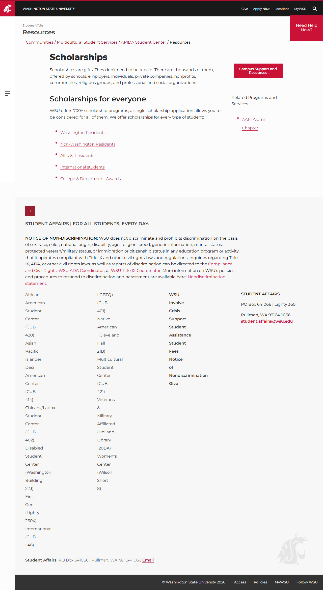

### aastudentcenter.wsu.edu

#### [/about/](aastudentcenter-wsu-edu/about/report.md)

#### [/events/](aastudentcenter-wsu-edu/events/report.md)

#### [/programs/](aastudentcenter-wsu-edu/programs/report.md)

### access.wsu.edu

#### [/](access-wsu-edu/_root/report.md)

#### [/contact/](access-wsu-edu/contact/report.md)

#### [/digital-accessibility/](access-wsu-edu/digital-accessibility/report.md)

#### [/policy/](access-wsu-edu/policy/report.md)

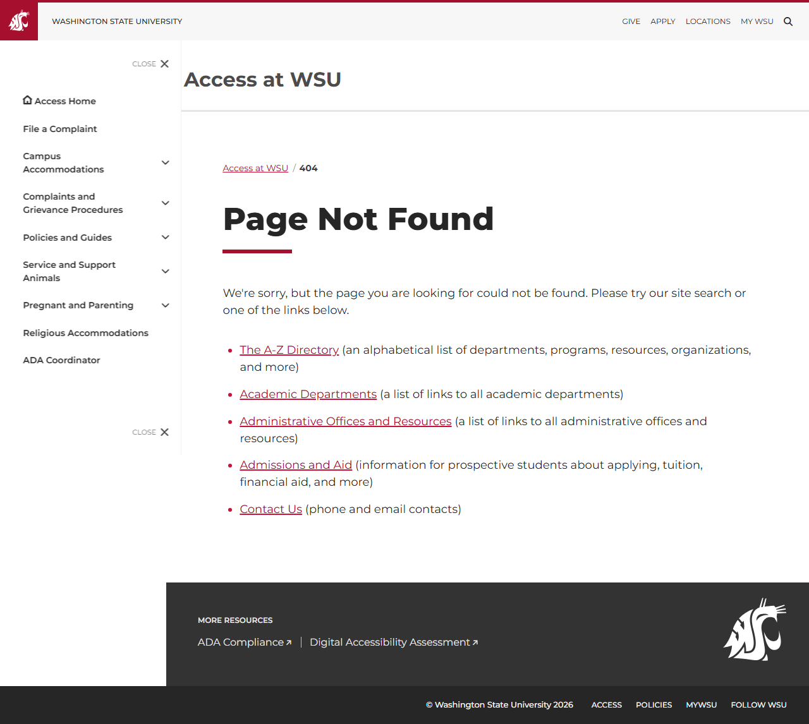

#### [/resources/](access-wsu-edu/resources/report.md)

### accesscenter.wsu.edu

#### [/accommodations/](accesscenter-wsu-edu/accommodations/report.md)

#### [/contact/](accesscenter-wsu-edu/contact/report.md)

#### [/faculty/](accesscenter-wsu-edu/faculty/report.md)

#### [/services/](accesscenter-wsu-edu/services/report.md)

#### [/students/](accesscenter-wsu-edu/students/report.md)

### account.wsu.edu

#### [/help/](account-wsu-edu/help/report.md)

#### [/password-reset/](account-wsu-edu/password-reset/report.md)

#### [/security/](account-wsu-edu/security/report.md)

#### [/services/](account-wsu-edu/services/report.md)

### accreditation.wsu.edu

#### [/](accreditation-wsu-edu/_root/report.md)

#### [/about/](accreditation-wsu-edu/about/report.md)

#### [/contact/](accreditation-wsu-edu/contact/report.md)

#### [/documents/](accreditation-wsu-edu/documents/report.md)

#### [/standards/](accreditation-wsu-edu/standards/report.md)

#### [/timeline/](accreditation-wsu-edu/timeline/report.md)

### acctspay.wsu.edu

#### [/](acctspay-wsu-edu/_root/report.md)

#### [/contact/](acctspay-wsu-edu/contact/report.md)

#### [/forms/](acctspay-wsu-edu/forms/report.md)

#### [/policies/](acctspay-wsu-edu/policies/report.md)

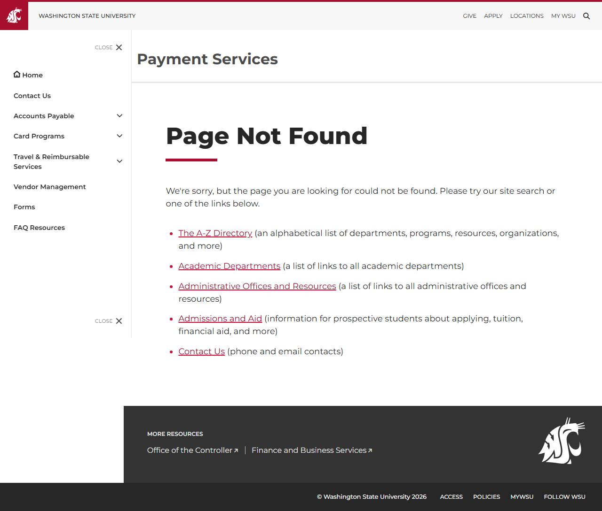

#### [/purchasing/](acctspay-wsu-edu/purchasing/report.md)

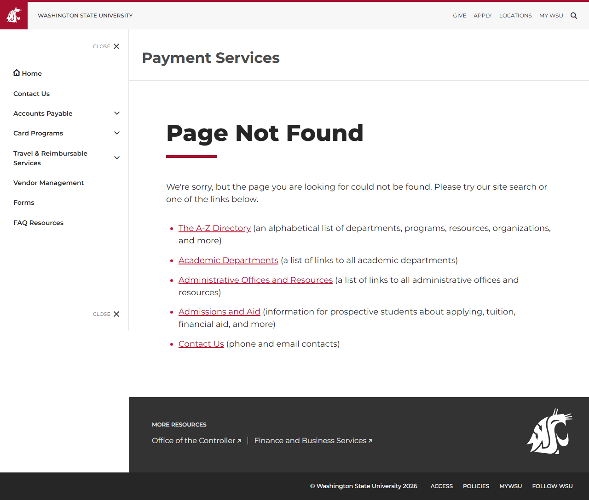

#### [/travel/](acctspay-wsu-edu/travel/report.md)

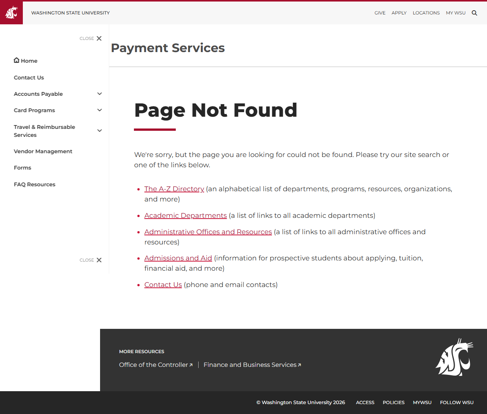

### ace.wsu.edu

#### [/](ace-wsu-edu/_root/report.md)

#### [/accreditation/](ace-wsu-edu/accreditation/report.md)

#### [/assessment/](ace-wsu-edu/assessment/report.md)

#### [/contact/](ace-wsu-edu/contact/report.md)

#### [/reporting/](ace-wsu-edu/reporting/report.md)

#### [/resources/](ace-wsu-edu/resources/report.md)

### adarp.wsu.edu

#### [/](adarp-wsu-edu/_root/report.md)

#### [/about/](adarp-wsu-edu/about/report.md)

#### [/contact/](adarp-wsu-edu/contact/report.md)

#### [/projects/](adarp-wsu-edu/projects/report.md)

#### [/publications/](adarp-wsu-edu/publications/report.md)

#### [/research/](adarp-wsu-edu/research/report.md)

### admission.wsu.edu

#### [/](admission-wsu-edu/_root/report.md)

#### [/apply/](admission-wsu-edu/apply/report.md)

#### [/contact/](admission-wsu-edu/contact/report.md)

#### [/costs-aid/](admission-wsu-edu/costs-aid/report.md)

#### [/freshman/](admission-wsu-edu/freshman/report.md)

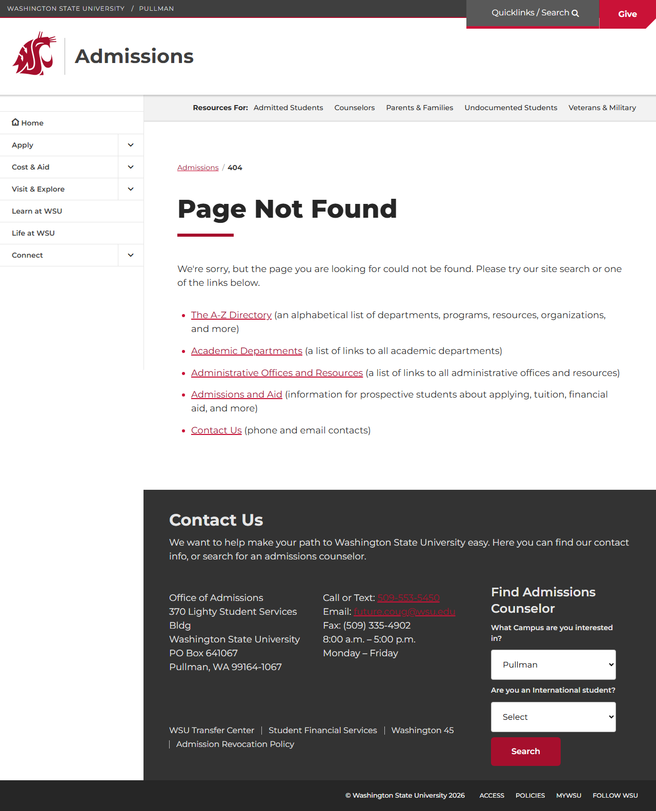

#### [/international/](admission-wsu-edu/international/report.md)

#### [/transfer/](admission-wsu-edu/transfer/report.md)

#### [/visit/](admission-wsu-edu/visit/report.md)

### advance.wsu.edu

#### [/](advance-wsu-edu/_root/report.md)

#### [/about/](advance-wsu-edu/about/report.md)

#### [/data/](advance-wsu-edu/data/report.md)

#### [/events/](advance-wsu-edu/events/report.md)

#### [/programs/](advance-wsu-edu/programs/report.md)

#### [/resources/](advance-wsu-edu/resources/report.md)

### advising.wsu.edu

#### [/](advising-wsu-edu/_root/report.md)

#### [/advisors/](advising-wsu-edu/advisors/report.md)

#### [/appointments/](advising-wsu-edu/appointments/report.md)

#### [/policies/](advising-wsu-edu/policies/report.md)

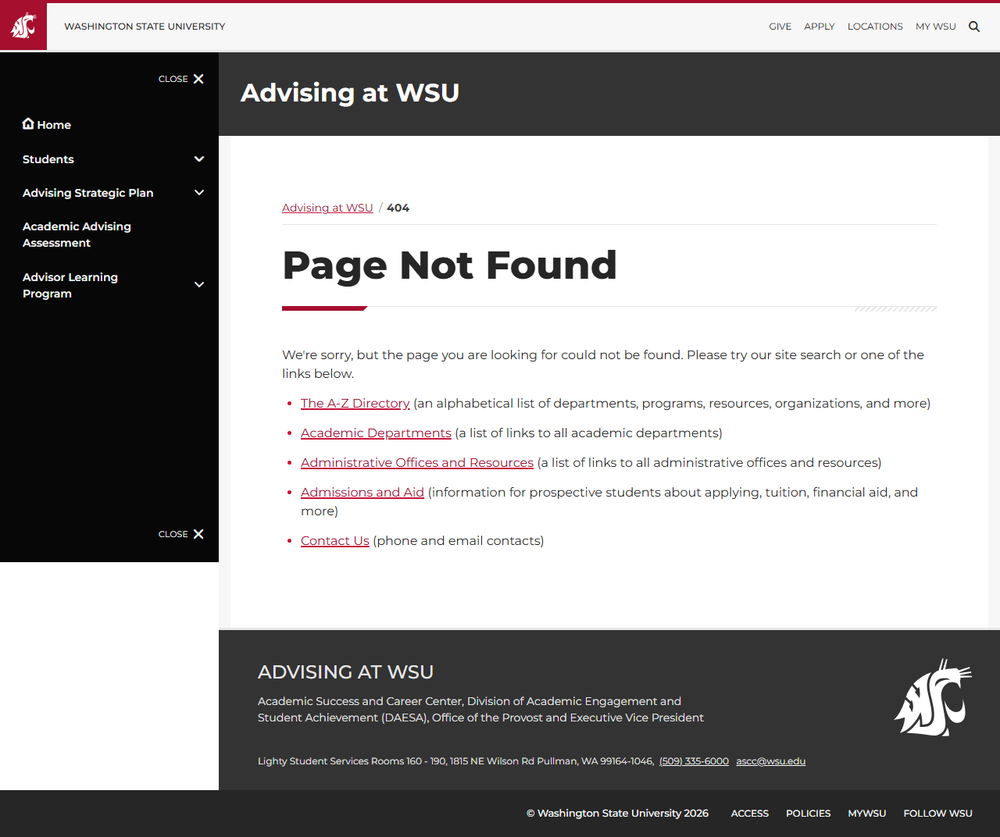

#### [/resources/](advising-wsu-edu/resources/report.md)

#### [/students/](advising-wsu-edu/students/report.md)

### afrotc.wsu.edu

#### [/](afrotc-wsu-edu/_root/report.md)

#### [/about/](afrotc-wsu-edu/about/report.md)

#### [/academics/](afrotc-wsu-edu/academics/report.md)

#### [/admissions/](afrotc-wsu-edu/admissions/report.md)

#### [/contact/](afrotc-wsu-edu/contact/report.md)

#### [/scholarships/](afrotc-wsu-edu/scholarships/report.md)

### afs.wsu.edu

#### [/](afs-wsu-edu/_root/report.md)

#### [/news/](afs-wsu-edu/news/report.md)

#### [/people/](afs-wsu-edu/people/report.md)

#### [/programs/](afs-wsu-edu/programs/report.md)

#### [/publications/](afs-wsu-edu/publications/report.md)

#### [/research/](afs-wsu-edu/research/report.md)

### afw.wsu.edu

#### [/](afw-wsu-edu/_root/report.md)

#### [/about/](afw-wsu-edu/about/report.md)

#### [/contact/](afw-wsu-edu/contact/report.md)

#### [/events/](afw-wsu-edu/events/report.md)

#### [/membership/](afw-wsu-edu/membership/report.md)

#### [/resources/](afw-wsu-edu/resources/report.md)

### alert.wsu.edu

#### [/](alert-wsu-edu/_root/report.md)

#### [/emergency-info/](alert-wsu-edu/emergency-info/report.md)

#### [/procedures/](alert-wsu-edu/procedures/report.md)

#### [/resources/](alert-wsu-edu/resources/report.md)

#### [/signup/](alert-wsu-edu/signup/report.md)

### alumni.wsu.edu

#### [/](alumni-wsu-edu/_root/report.md)

#### [/benefits/](alumni-wsu-edu/benefits/report.md)

#### [/chapters/](alumni-wsu-edu/chapters/report.md)

#### [/contact/](alumni-wsu-edu/contact/report.md)

#### [/events/](alumni-wsu-edu/events/report.md)

#### [/giving/](alumni-wsu-edu/giving/report.md)

### amdt.wsu.edu

#### [/](amdt-wsu-edu/_root/report.md)

#### [/about/](amdt-wsu-edu/about/report.md)

#### [/admissions/](amdt-wsu-edu/admissions/report.md)

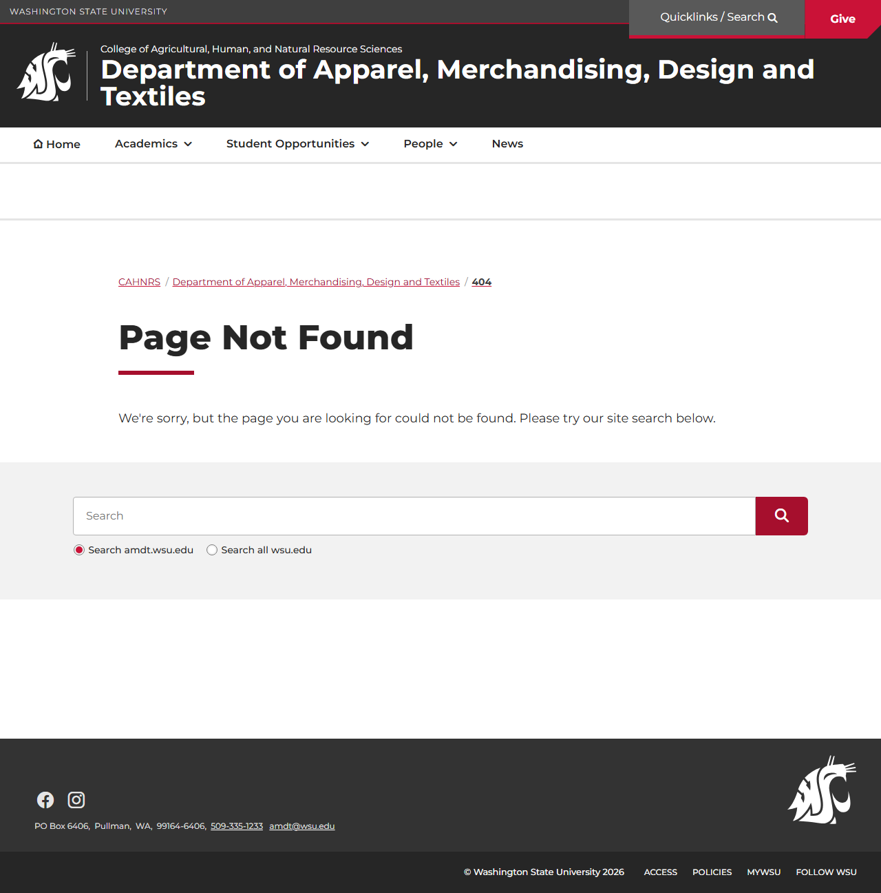

#### [/contact/](amdt-wsu-edu/contact/report.md)

#### [/faculty/](amdt-wsu-edu/faculty/report.md)

#### [/programs/](amdt-wsu-edu/programs/report.md)

### ansci.wsu.edu

#### [/](ansci-wsu-edu/_root/report.md)

#### [/about/](ansci-wsu-edu/about/report.md)

#### [/contact/](ansci-wsu-edu/contact/report.md)

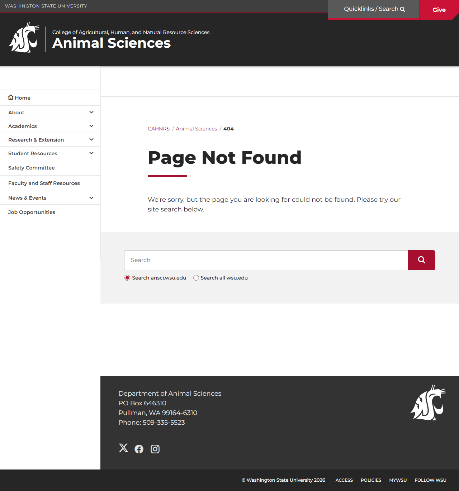

#### [/faculty/](ansci-wsu-edu/faculty/report.md)

#### [/graduate/](ansci-wsu-edu/graduate/report.md)

#### [/research/](ansci-wsu-edu/research/report.md)

#### [/undergraduate/](ansci-wsu-edu/undergraduate/report.md)

### anthro.wsu.edu

#### [/](anthro-wsu-edu/_root/report.md)

#### [/about/](anthro-wsu-edu/about/report.md)

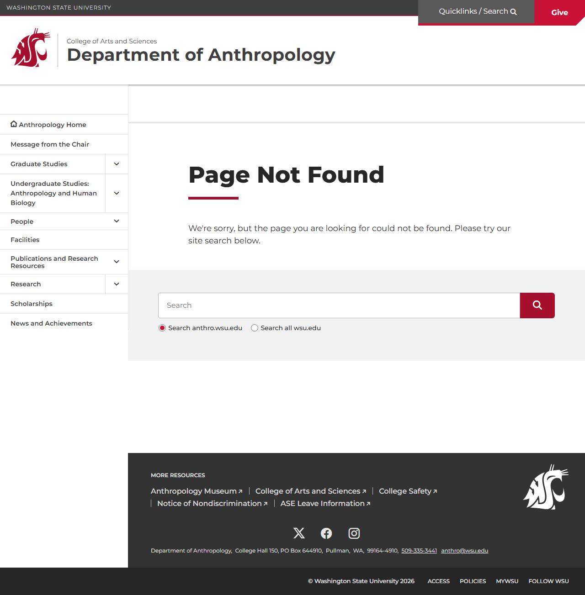

#### [/faculty/](anthro-wsu-edu/faculty/report.md)

#### [/graduate/](anthro-wsu-edu/graduate/report.md)

#### [/research/](anthro-wsu-edu/research/report.md)

#### [/undergraduate/](anthro-wsu-edu/undergraduate/report.md)

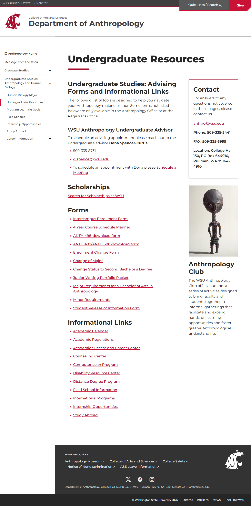

### aoi.wsu.edu

#### [/](aoi-wsu-edu/_root/report.md)

#### [/about/](aoi-wsu-edu/about/report.md)

#### [/contact/](aoi-wsu-edu/contact/report.md)

#### [/partnerships/](aoi-wsu-edu/partnerships/report.md)

#### [/programs/](aoi-wsu-edu/programs/report.md)

#### [/resources/](aoi-wsu-edu/resources/report.md)

### apac.wsu.edu

#### [/](apac-wsu-edu/_root/report.md)

#### [/about/](apac-wsu-edu/about/report.md)

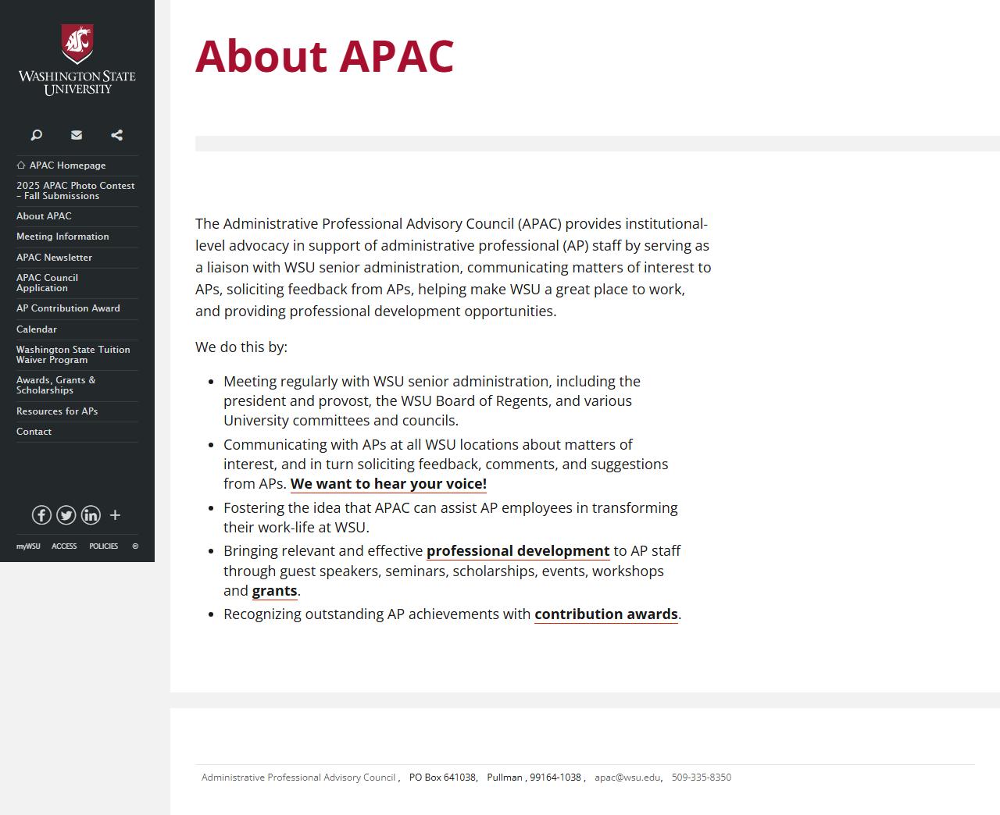

#### [/contact/](apac-wsu-edu/contact/report.md)

#### [/meetings/](apac-wsu-edu/meetings/report.md)

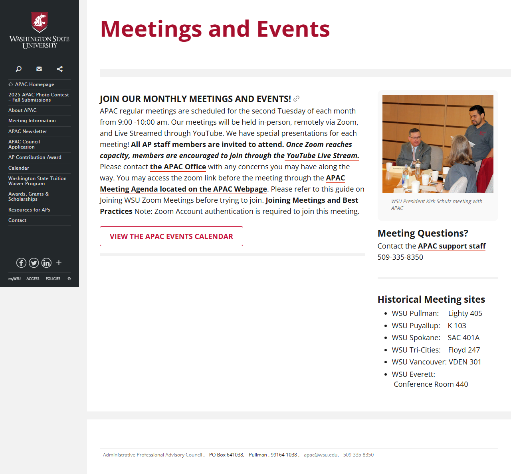

#### [/membership/](apac-wsu-edu/membership/report.md)

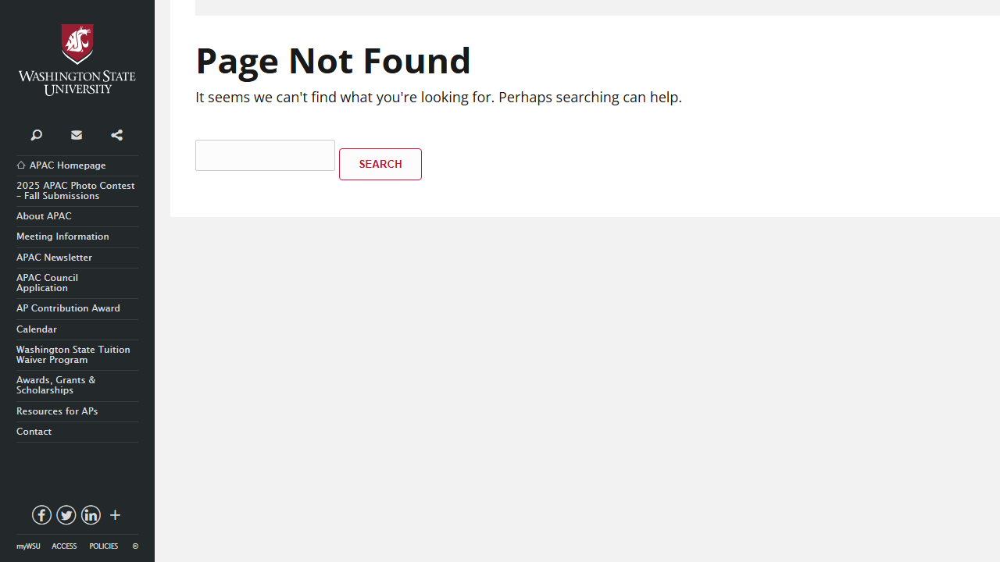

#### [/resources/](apac-wsu-edu/resources/report.md)

### arboretum.wsu.edu

#### [/](arboretum-wsu-edu/_root/report.md)

#### [/about/](arboretum-wsu-edu/about/report.md)

#### [/collections/](arboretum-wsu-edu/collections/report.md)

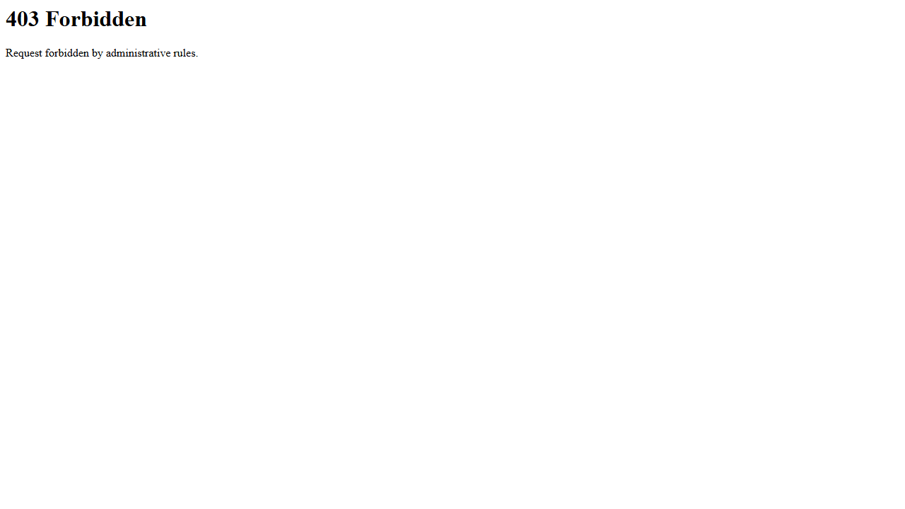

#### [/contact/](arboretum-wsu-edu/contact/report.md)

#### [/events/](arboretum-wsu-edu/events/report.md)

#### [/visit/](arboretum-wsu-edu/visit/report.md)

### archaeology.wsu.edu

#### [/](archaeology-wsu-edu/_root/report.md)

#### [/collections/](archaeology-wsu-edu/collections/report.md)

#### [/education/](archaeology-wsu-edu/education/report.md)

#### [/exhibits/](archaeology-wsu-edu/exhibits/report.md)

#### [/research/](archaeology-wsu-edu/research/report.md)

#### [/visit/](archaeology-wsu-edu/visit/report.md)

### ascc.wsu.edu

#### [/](ascc-wsu-edu/_root/report.md)

#### [/academic-success/](ascc-wsu-edu/academic-success/report.md)

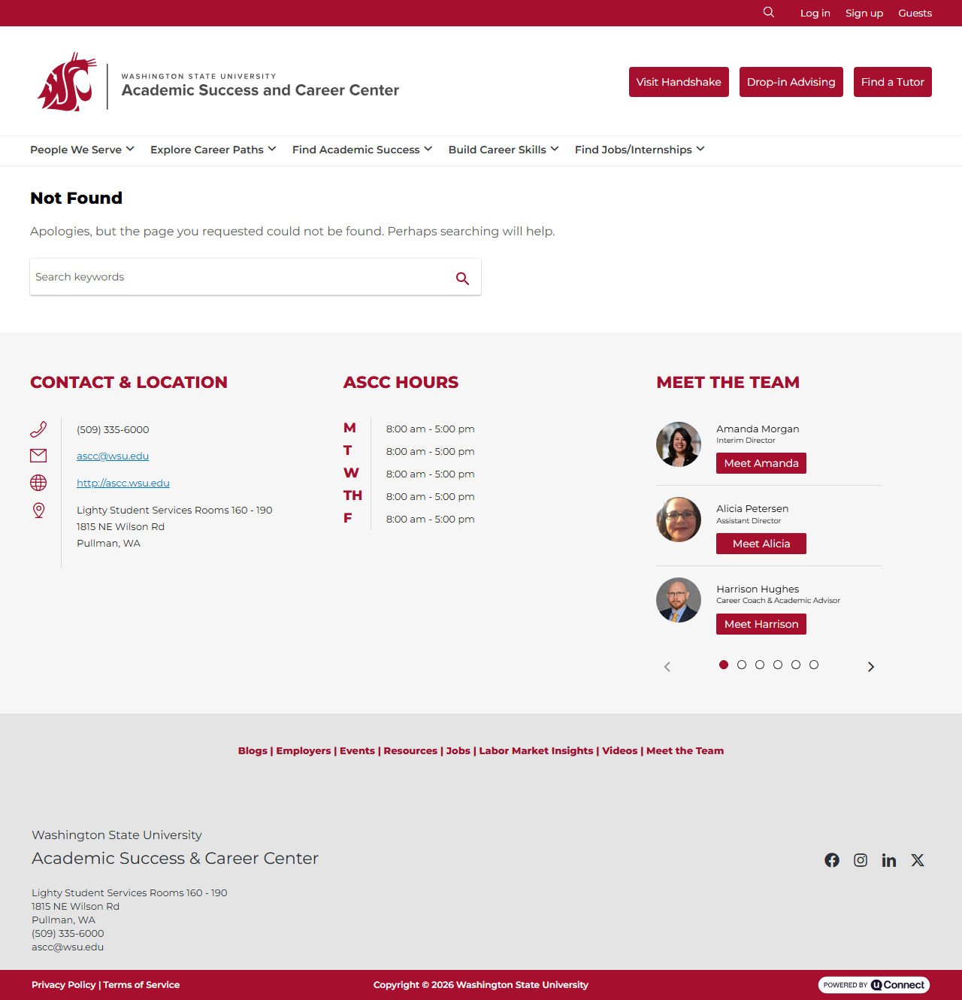

#### [/appointments/](ascc-wsu-edu/appointments/report.md)

#### [/career-services/](ascc-wsu-edu/career-services/report.md)

#### [/contact/](ascc-wsu-edu/contact/report.md)

#### [/resources/](ascc-wsu-edu/resources/report.md)

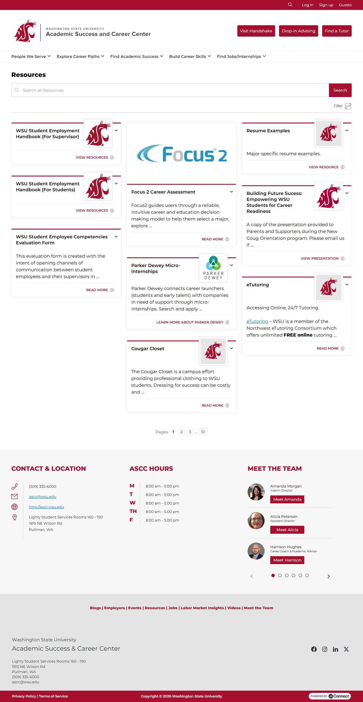

### asce.wsu.edu

#### [/](asce-wsu-edu/_root/report.md)

#### [/about/](asce-wsu-edu/about/report.md)

#### [/competitions/](asce-wsu-edu/competitions/report.md)

#### [/contact/](asce-wsu-edu/contact/report.md)

#### [/events/](asce-wsu-edu/events/report.md)

#### [/membership/](asce-wsu-edu/membership/report.md)

### askdruniverse.wsu.edu

#### [/](askdruniverse-wsu-edu/_root/report.md)

#### [/about/](askdruniverse-wsu-edu/about/report.md)

#### [/ask-question/](askdruniverse-wsu-edu/ask-question/report.md)

#### [/questions/](askdruniverse-wsu-edu/questions/report.md)

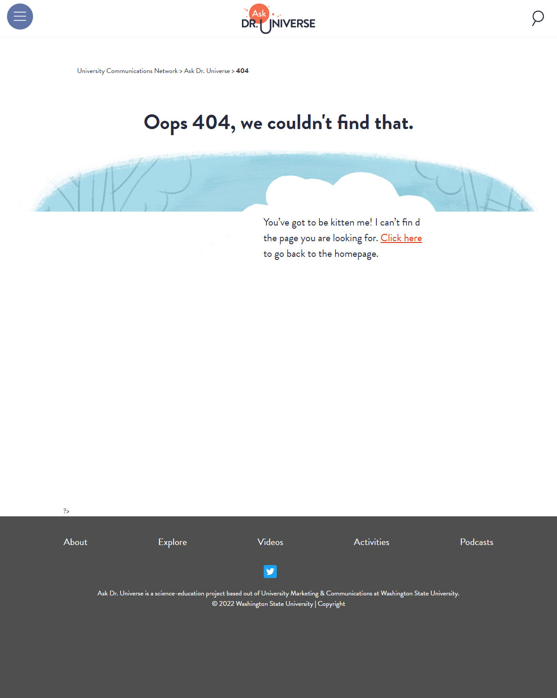

#### [/resources/](askdruniverse-wsu-edu/resources/report.md)

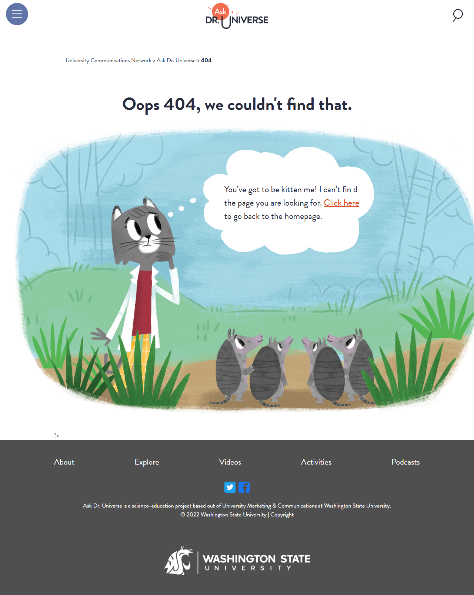

### asl.wsu.edu

#### [/](asl-wsu-edu/_root/report.md)

#### [/about/](asl-wsu-edu/about/report.md)

#### [/contact/](asl-wsu-edu/contact/report.md)

#### [/facilities/](asl-wsu-edu/facilities/report.md)

#### [/publications/](asl-wsu-edu/publications/report.md)

#### [/research/](asl-wsu-edu/research/report.md)

### aswsu.wsu.edu

#### [/contact/](aswsu-wsu-edu/contact/report.md)

#### [/get-involved/](aswsu-wsu-edu/get-involved/report.md)

#### [/services/](aswsu-wsu-edu/services/report.md)

### atg.wsu.edu

#### [/](atg-wsu-edu/_root/report.md)

#### [/compliance/](atg-wsu-edu/compliance/report.md)

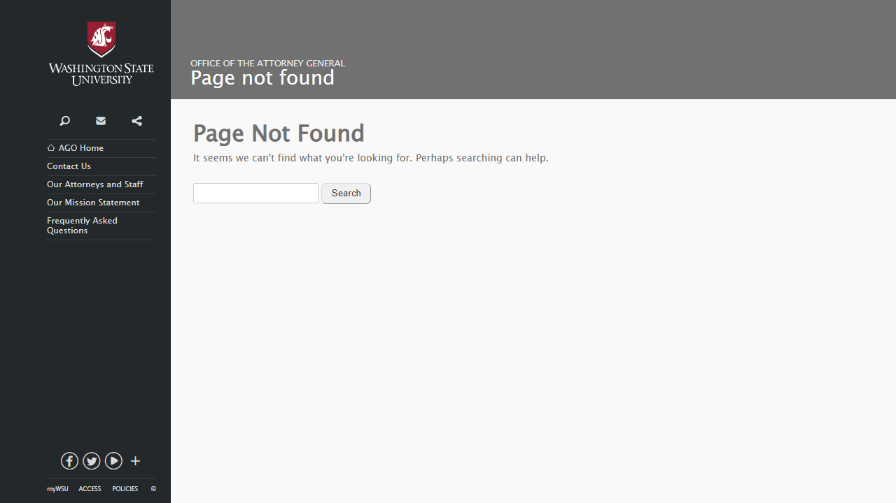

#### [/contact/](atg-wsu-edu/contact/report.md)

#### [/resources/](atg-wsu-edu/resources/report.md)

#### [/services/](atg-wsu-edu/services/report.md)

### brand.wsu.edu

#### [/](brand-wsu-edu/_root/report.md)

#### [/colors/](brand-wsu-edu/colors/report.md)

#### [/downloads/](brand-wsu-edu/downloads/report.md)

#### [/logos/](brand-wsu-edu/logos/report.md)

#### [/templates/](brand-wsu-edu/templates/report.md)

#### [/typography/](brand-wsu-edu/typography/report.md)

#### [/visual-identity/](brand-wsu-edu/visual-identity/report.md)

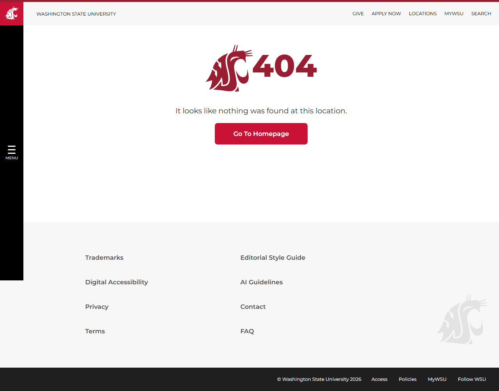

### bursar.wsu.edu

#### [/](bursar-wsu-edu/_root/report.md)

#### [/billing/](bursar-wsu-edu/billing/report.md)

#### [/contact/](bursar-wsu-edu/contact/report.md)

#### [/payment/](bursar-wsu-edu/payment/report.md)

#### [/policies/](bursar-wsu-edu/policies/report.md)

#### [/refunds/](bursar-wsu-edu/refunds/report.md)

### business.wsu.edu

#### [/](business-wsu-edu/_root/report.md)

#### [/admissions/](business-wsu-edu/admissions/report.md)

#### [/faculty/](business-wsu-edu/faculty/report.md)

#### [/graduate/](business-wsu-edu/graduate/report.md)

#### [/news/](business-wsu-edu/news/report.md)

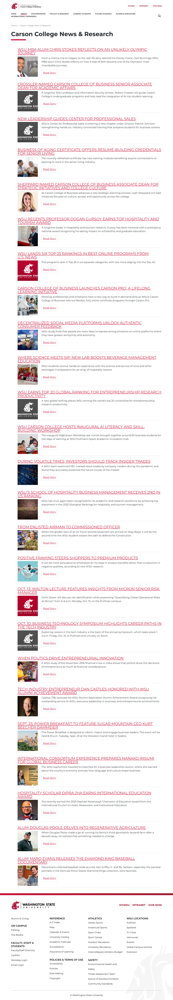

#### [/programs/](business-wsu-edu/programs/report.md)

#### [/undergraduate/](business-wsu-edu/undergraduate/report.md)

### cahnrs.wsu.edu

#### [/](cahnrs-wsu-edu/_root/report.md)

#### [/about/](cahnrs-wsu-edu/about/report.md)

#### [/academics/](cahnrs-wsu-edu/academics/report.md)

#### [/contact/](cahnrs-wsu-edu/contact/report.md)

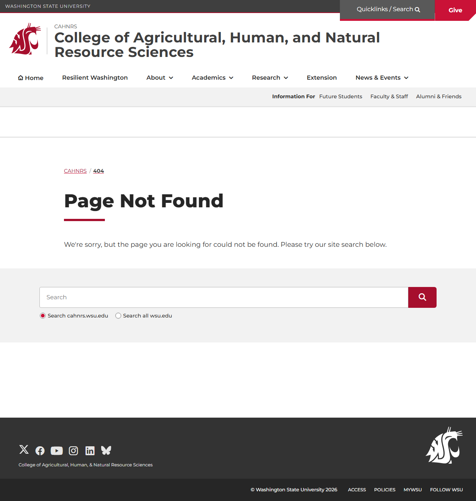

#### [/extension/](cahnrs-wsu-edu/extension/report.md)

#### [/news/](cahnrs-wsu-edu/news/report.md)

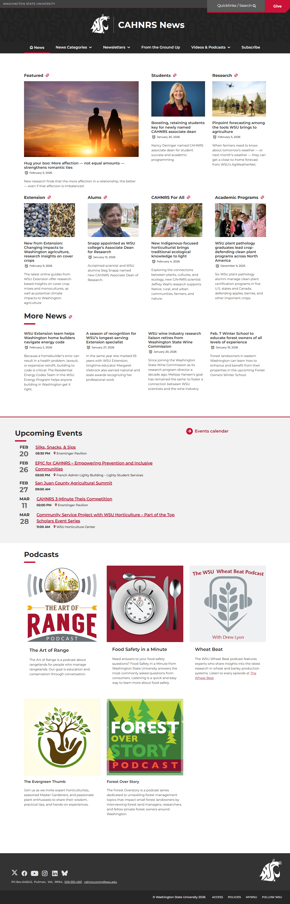

#### [/research/](cahnrs-wsu-edu/research/report.md)

### campusvet.wsu.edu

#### [/](campusvet-wsu-edu/_root/report.md)

#### [/compliance/](campusvet-wsu-edu/compliance/report.md)

#### [/contact/](campusvet-wsu-edu/contact/report.md)

#### [/resources/](campusvet-wsu-edu/resources/report.md)

#### [/training/](campusvet-wsu-edu/training/report.md)

### cas.wsu.edu

#### [/](cas-wsu-edu/_root/report.md)

#### [/about/](cas-wsu-edu/about/report.md)

#### [/contact/](cas-wsu-edu/contact/report.md)

#### [/departments/](cas-wsu-edu/departments/report.md)

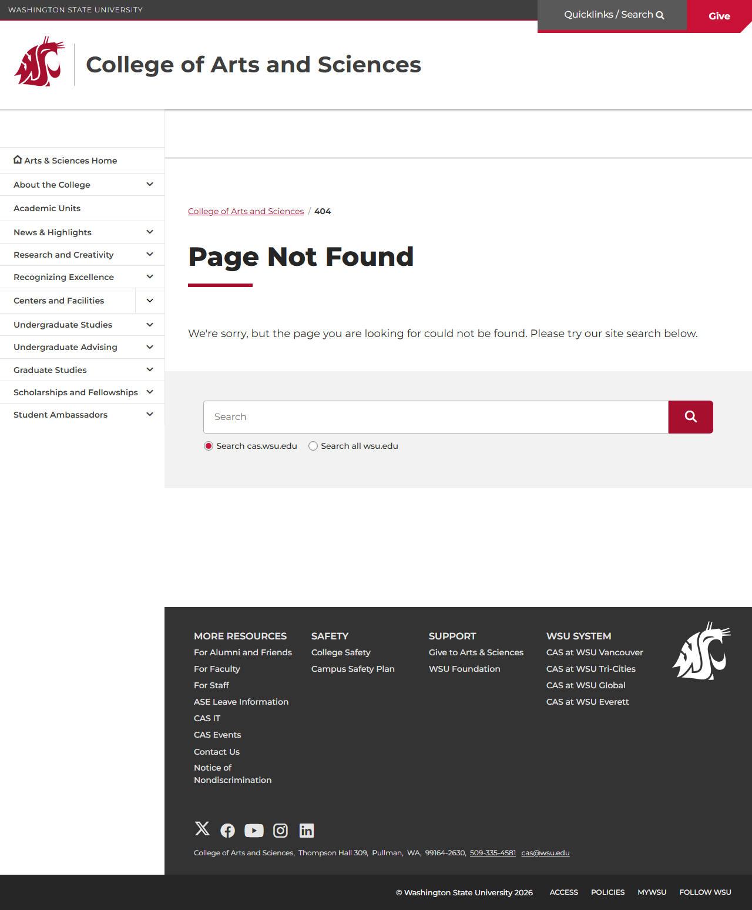

#### [/news/](cas-wsu-edu/news/report.md)

#### [/programs/](cas-wsu-edu/programs/report.md)

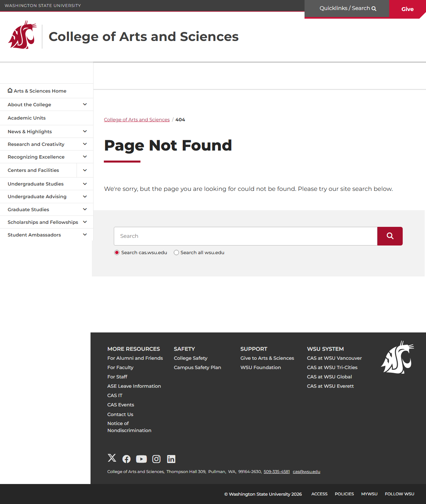

#### [/research/](cas-wsu-edu/research/report.md)

### catalog.wsu.edu

#### [/](catalog-wsu-edu/_root/report.md)

#### [/academic-regulations/](catalog-wsu-edu/academic-regulations/report.md)

#### [/courses/](catalog-wsu-edu/courses/report.md)

#### [/general-requirements/](catalog-wsu-edu/general-requirements/report.md)

#### [/programs/](catalog-wsu-edu/programs/report.md)

### ccr.wsu.edu

#### [/](ccr-wsu-edu/_root/report.md)

#### [/contact/](ccr-wsu-edu/contact/report.md)

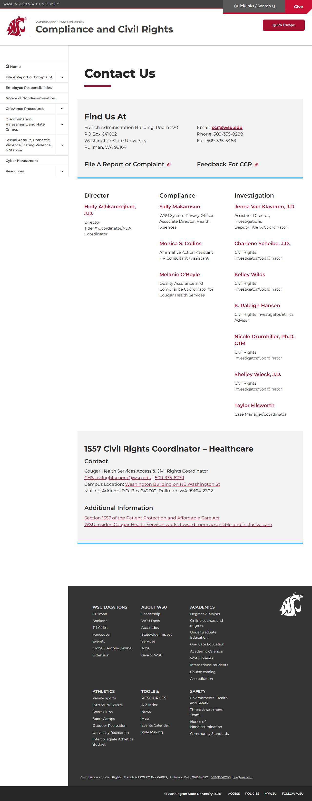

#### [/policies/](ccr-wsu-edu/policies/report.md)

#### [/reporting/](ccr-wsu-edu/reporting/report.md)

#### [/resources/](ccr-wsu-edu/resources/report.md)

#### [/training/](ccr-wsu-edu/training/report.md)

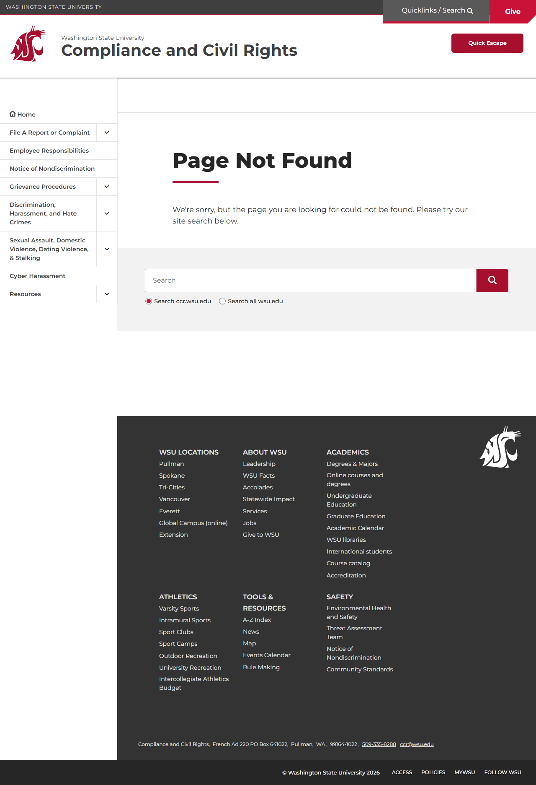

### ceshs.wsu.edu

#### [/](ceshs-wsu-edu/_root/report.md)

#### [/about/](ceshs-wsu-edu/about/report.md)

#### [/contact/](ceshs-wsu-edu/contact/report.md)

#### [/faculty/](ceshs-wsu-edu/faculty/report.md)

#### [/programs/](ceshs-wsu-edu/programs/report.md)

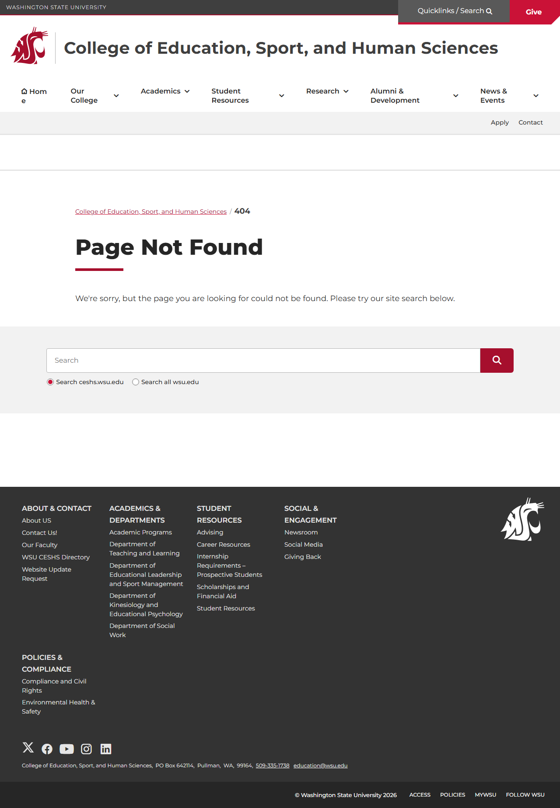

#### [/research/](ceshs-wsu-edu/research/report.md)

### chemistry.wsu.edu

#### [/](chemistry-wsu-edu/_root/report.md)

#### [/about/](chemistry-wsu-edu/about/report.md)

#### [/facilities/](chemistry-wsu-edu/facilities/report.md)

#### [/faculty/](chemistry-wsu-edu/faculty/report.md)

#### [/graduate/](chemistry-wsu-edu/graduate/report.md)

#### [/research/](chemistry-wsu-edu/research/report.md)

#### [/undergraduate/](chemistry-wsu-edu/undergraduate/report.md)

### commencement.wsu.edu

#### [/](commencement-wsu-edu/_root/report.md)

#### [/ceremony-info/](commencement-wsu-edu/ceremony-info/report.md)

#### [/contact/](commencement-wsu-edu/contact/report.md)

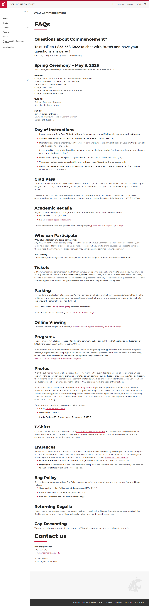

#### [/regalia/](commencement-wsu-edu/regalia/report.md)

#### [/resources/](commencement-wsu-edu/resources/report.md)

#### [/tickets/](commencement-wsu-edu/tickets/report.md)

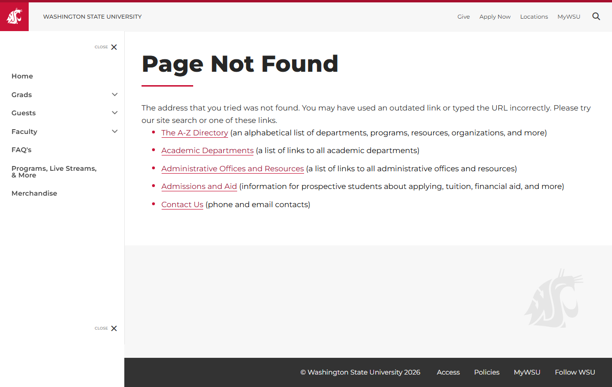

### communitystandards.wsu.edu

#### [/conduct-process/](communitystandards-wsu-edu/conduct-process/report.md)

#### [/contact/](communitystandards-wsu-edu/contact/report.md)

#### [/for-students/](communitystandards-wsu-edu/for-students/report.md)

#### [/policies/](communitystandards-wsu-edu/policies/report.md)

### cougarcard.wsu.edu

#### [/add-funds/](cougarcard-wsu-edu/add-funds/report.md)

#### [/contact/](cougarcard-wsu-edu/contact/report.md)

#### [/lost-stolen/](cougarcard-wsu-edu/lost-stolen/report.md)

#### [/services/](cougarcard-wsu-edu/services/report.md)

### degrees.wsu.edu

#### [/](degrees-wsu-edu/_root/report.md)

#### [/graduate/](degrees-wsu-edu/graduate/report.md)

#### [/online/](degrees-wsu-edu/online/report.md)

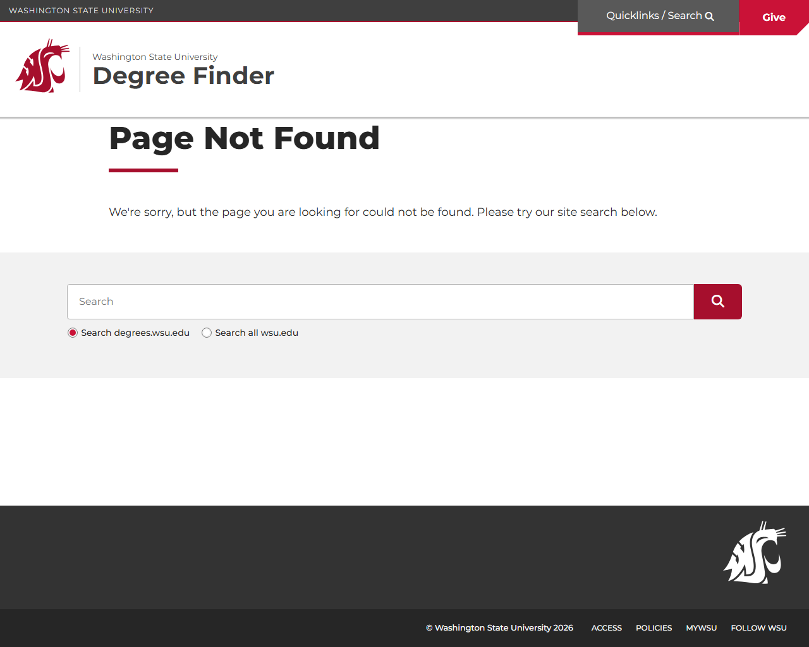

#### [/professional/](degrees-wsu-edu/professional/report.md)

#### [/search/](degrees-wsu-edu/search/report.md)

#### [/undergraduate/](degrees-wsu-edu/undergraduate/report.md)

### dining.wsu.edu

#### [/contact/](dining-wsu-edu/contact/report.md)

#### [/locations/](dining-wsu-edu/locations/report.md)

#### [/menus/](dining-wsu-edu/menus/report.md)

#### [/nutrition/](dining-wsu-edu/nutrition/report.md)

### diversity.wsu.edu

#### [/](diversity-wsu-edu/_root/report.md)

#### [/about/](diversity-wsu-edu/about/report.md)

#### [/contact/](diversity-wsu-edu/contact/report.md)

#### [/events/](diversity-wsu-edu/events/report.md)

#### [/programs/](diversity-wsu-edu/programs/report.md)

#### [/resources/](diversity-wsu-edu/resources/report.md)

### education.wsu.edu

#### [/](education-wsu-edu/_root/report.md)

#### [/about/](education-wsu-edu/about/report.md)

#### [/admissions/](education-wsu-edu/admissions/report.md)

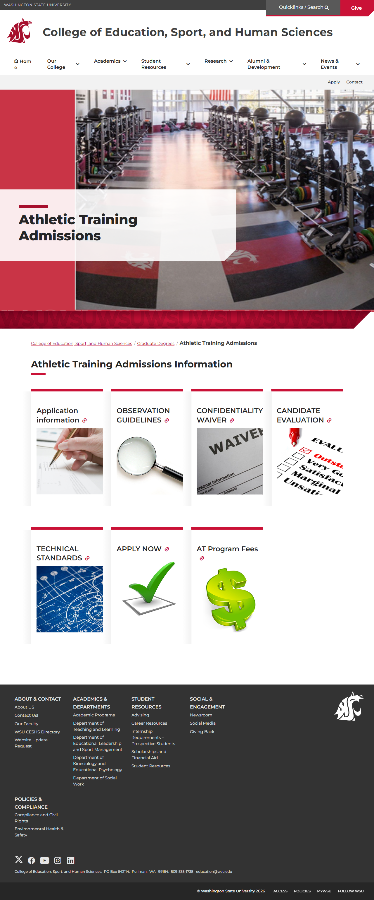

#### [/faculty/](education-wsu-edu/faculty/report.md)

#### [/graduate/](education-wsu-edu/graduate/report.md)

#### [/programs/](education-wsu-edu/programs/report.md)

#### [/undergraduate/](education-wsu-edu/undergraduate/report.md)

### ehs.wsu.edu

#### [/](ehs-wsu-edu/_root/report.md)

#### [/compliance/](ehs-wsu-edu/compliance/report.md)

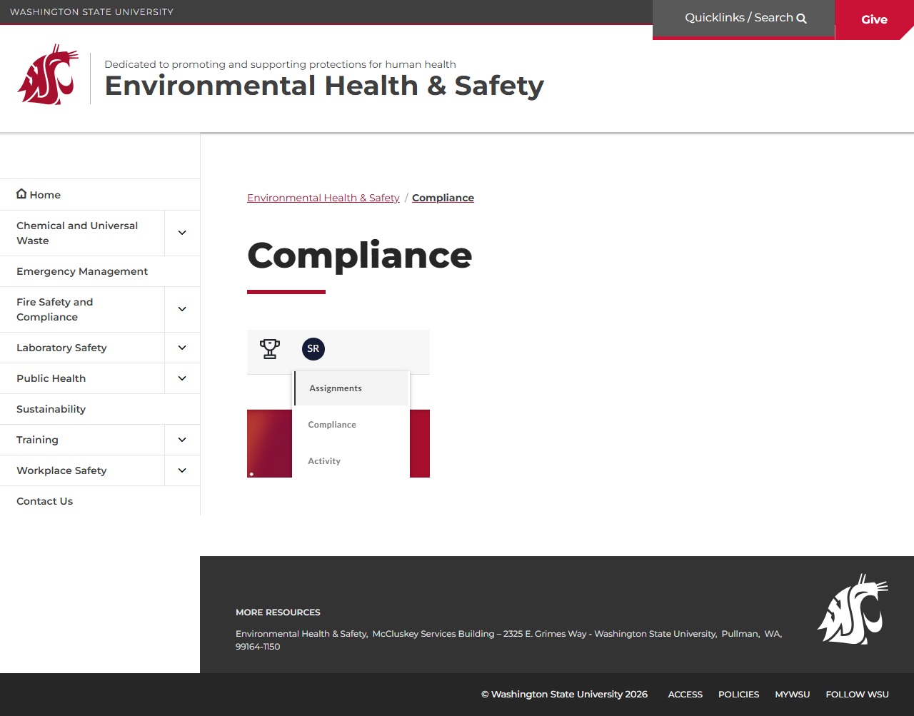

#### [/contact/](ehs-wsu-edu/contact/report.md)

#### [/resources/](ehs-wsu-edu/resources/report.md)

#### [/services/](ehs-wsu-edu/services/report.md)

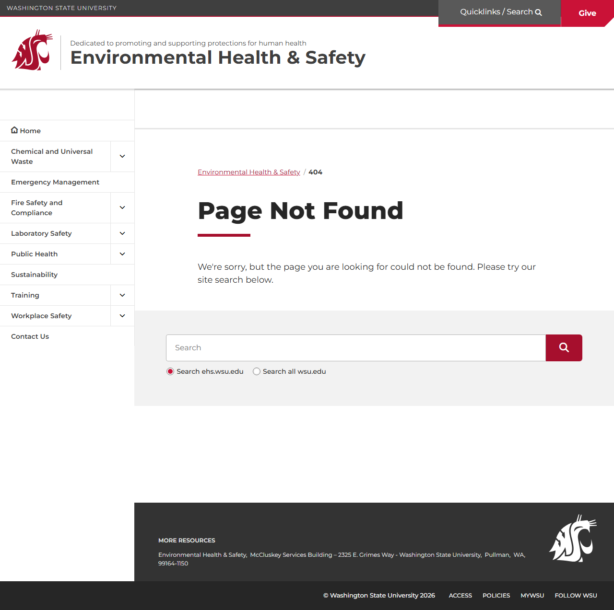

### em.wsu.edu

#### [/](em-wsu-edu/_root/report.md)

#### [/eit/](em-wsu-edu/eit/report.md)

#### [/re411/](em-wsu-edu/re411/report.md)

#### [/rr411/](em-wsu-edu/rr411/report.md)

### email.wsu.edu

#### [/](email-wsu-edu/_root/report.md)

#### [/access/](email-wsu-edu/access/report.md)

#### [/help/](email-wsu-edu/help/report.md)

#### [/policies/](email-wsu-edu/policies/report.md)

#### [/resources/](email-wsu-edu/resources/report.md)

### english.wsu.edu

#### [/](english-wsu-edu/_root/report.md)

#### [/about/](english-wsu-edu/about/report.md)

#### [/creative-writing/](english-wsu-edu/creative-writing/report.md)

#### [/faculty/](english-wsu-edu/faculty/report.md)

#### [/graduate/](english-wsu-edu/graduate/report.md)

#### [/undergraduate/](english-wsu-edu/undergraduate/report.md)

### events.wsu.edu

#### [/](events-wsu-edu/_root/report.md)

#### [/calendar/](events-wsu-edu/calendar/report.md)

#### [/categories/](events-wsu-edu/categories/report.md)

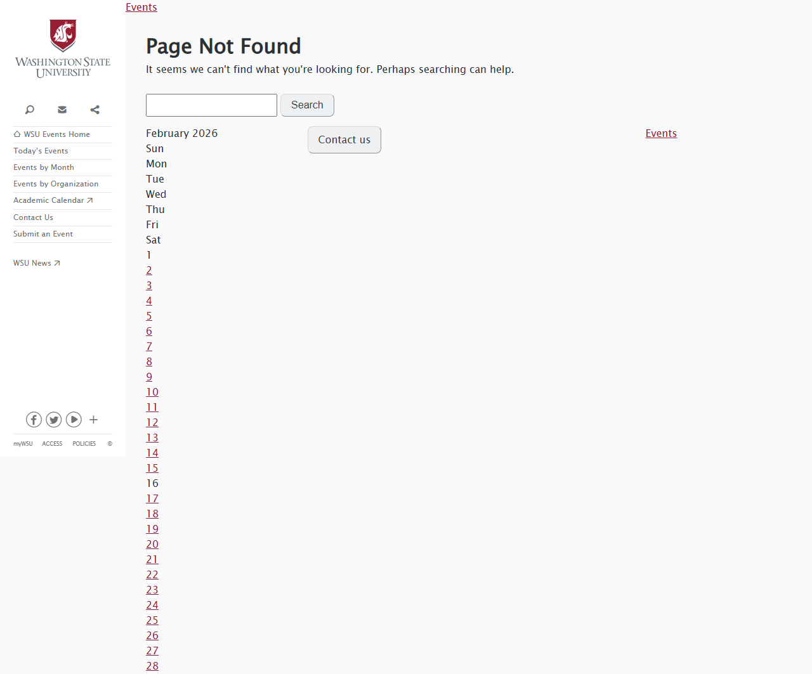

#### [/submit-event/](events-wsu-edu/submit-event/report.md)

### everett.wsu.edu

#### [/](everett-wsu-edu/_root/report.md)

#### [/about/](everett-wsu-edu/about/report.md)

#### [/academics/](everett-wsu-edu/academics/report.md)

#### [/admissions/](everett-wsu-edu/admissions/report.md)

#### [/contact/](everett-wsu-edu/contact/report.md)

#### [/student-services/](everett-wsu-edu/student-services/report.md)

### extension.wsu.edu

#### [/](extension-wsu-edu/_root/report.md)

#### [/contact/](extension-wsu-edu/contact/report.md)

#### [/counties/](extension-wsu-edu/counties/report.md)

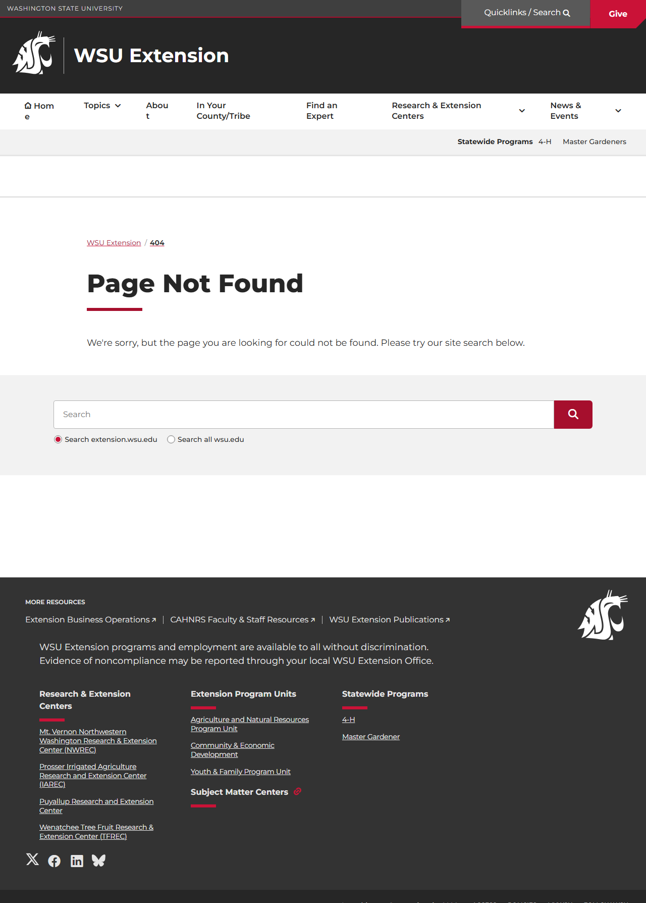

#### [/programs/](extension-wsu-edu/programs/report.md)

#### [/publications/](extension-wsu-edu/publications/report.md)

#### [/resources/](extension-wsu-edu/resources/report.md)

### facsen.wsu.edu

#### [/](facsen-wsu-edu/_root/report.md)

#### [/about/](facsen-wsu-edu/about/report.md)

#### [/committees/](facsen-wsu-edu/committees/report.md)

#### [/contact/](facsen-wsu-edu/contact/report.md)

#### [/documents/](facsen-wsu-edu/documents/report.md)

#### [/meetings/](facsen-wsu-edu/meetings/report.md)

### financialaid.wsu.edu

#### [/](financialaid-wsu-edu/_root/report.md)

#### [/apply/](financialaid-wsu-edu/apply/report.md)

#### [/contact/](financialaid-wsu-edu/contact/report.md)

#### [/eligibility/](financialaid-wsu-edu/eligibility/report.md)

#### [/resources/](financialaid-wsu-edu/resources/report.md)

#### [/types-of-aid/](financialaid-wsu-edu/types-of-aid/report.md)

### foundation.wsu.edu

#### [/](foundation-wsu-edu/_root/report.md)

#### [/contact/](foundation-wsu-edu/contact/report.md)

#### [/give/](foundation-wsu-edu/give/report.md)

#### [/impact/](foundation-wsu-edu/impact/report.md)

#### [/ways-to-give/](foundation-wsu-edu/ways-to-give/report.md)

### genacct.wsu.edu

#### [/](genacct-wsu-edu/_root/report.md)

#### [/contact/](genacct-wsu-edu/contact/report.md)

#### [/forms/](genacct-wsu-edu/forms/report.md)

#### [/policies/](genacct-wsu-edu/policies/report.md)

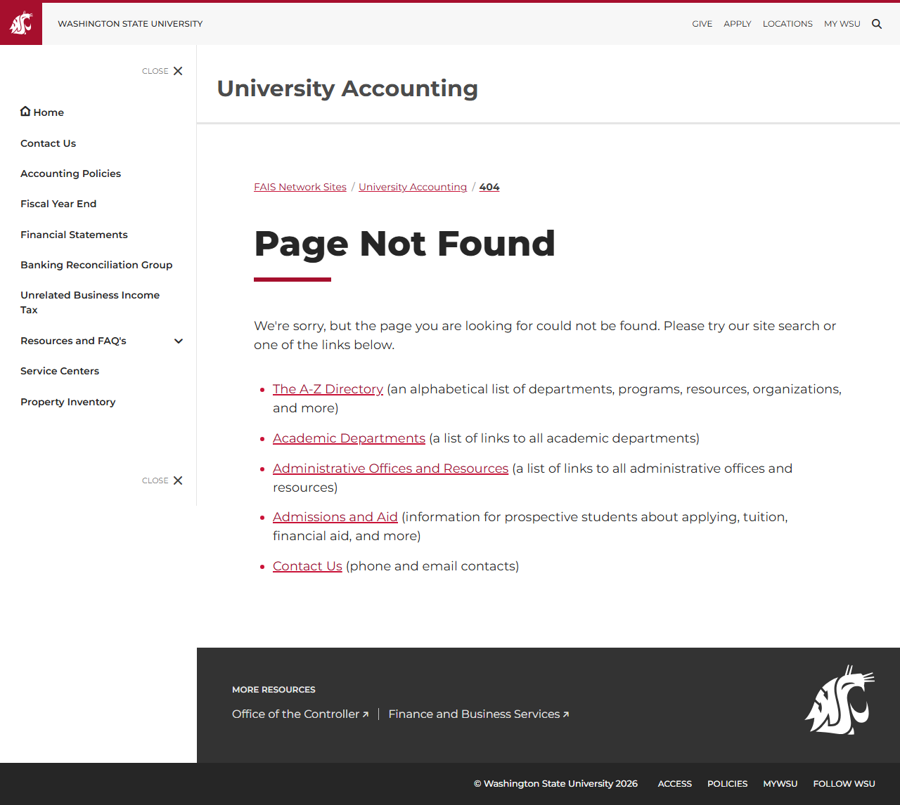

#### [/resources/](genacct-wsu-edu/resources/report.md)

#### [/services/](genacct-wsu-edu/services/report.md)

### gis.wsu.edu

#### [/](gis-wsu-edu/_root/report.md)

#### [/contact/](gis-wsu-edu/contact/report.md)

#### [/data/](gis-wsu-edu/data/report.md)

#### [/resources/](gis-wsu-edu/resources/report.md)

#### [/services/](gis-wsu-edu/services/report.md)

#### [/training/](gis-wsu-edu/training/report.md)

### go.wsu.edu

#### [/](go-wsu-edu/_root/report.md)

#### [/about/](go-wsu-edu/about/report.md)

#### [/create/](go-wsu-edu/create/report.md)

#### [/manage/](go-wsu-edu/manage/report.md)

### gradschool.wsu.edu

#### [/](gradschool-wsu-edu/_root/report.md)

#### [/admissions/](gradschool-wsu-edu/admissions/report.md)

#### [/contact/](gradschool-wsu-edu/contact/report.md)

#### [/current-students/](gradschool-wsu-edu/current-students/report.md)

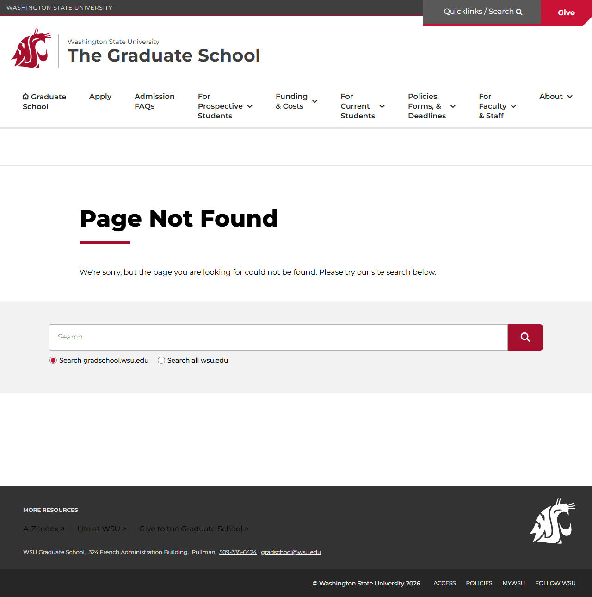

#### [/funding/](gradschool-wsu-edu/funding/report.md)

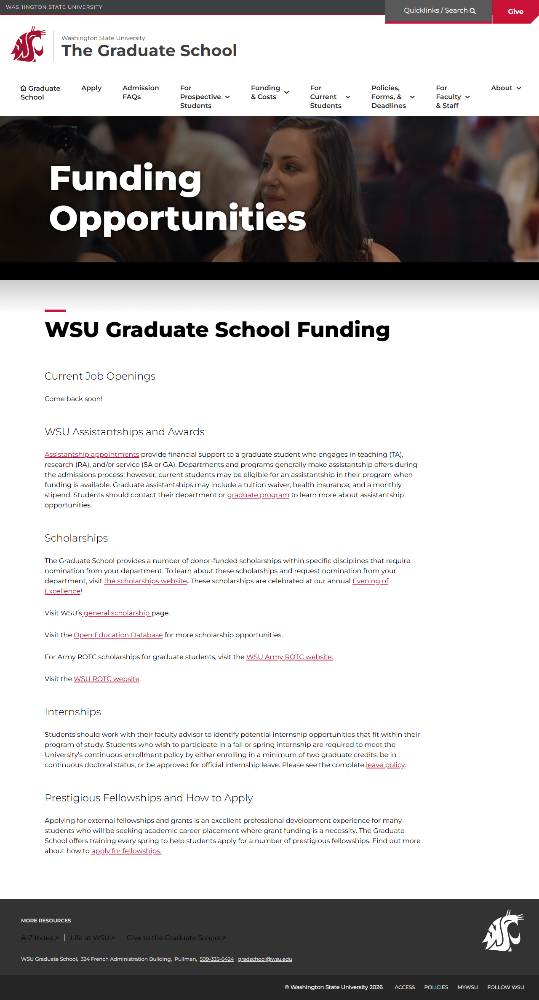

#### [/programs/](gradschool-wsu-edu/programs/report.md)

### history.wsu.edu

#### [/about/](history-wsu-edu/about/report.md)

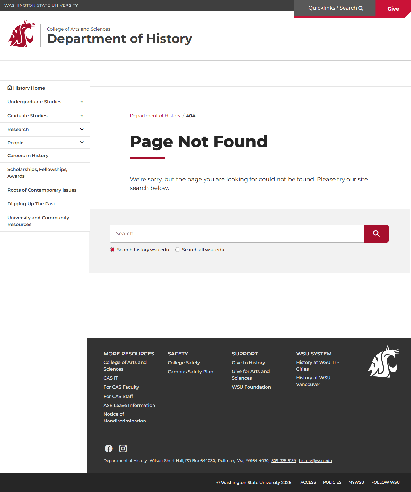

#### [/faculty/](history-wsu-edu/faculty/report.md)

#### [/graduate/](history-wsu-edu/graduate/report.md)

#### [/research/](history-wsu-edu/research/report.md)

#### [/undergraduate/](history-wsu-edu/undergraduate/report.md)

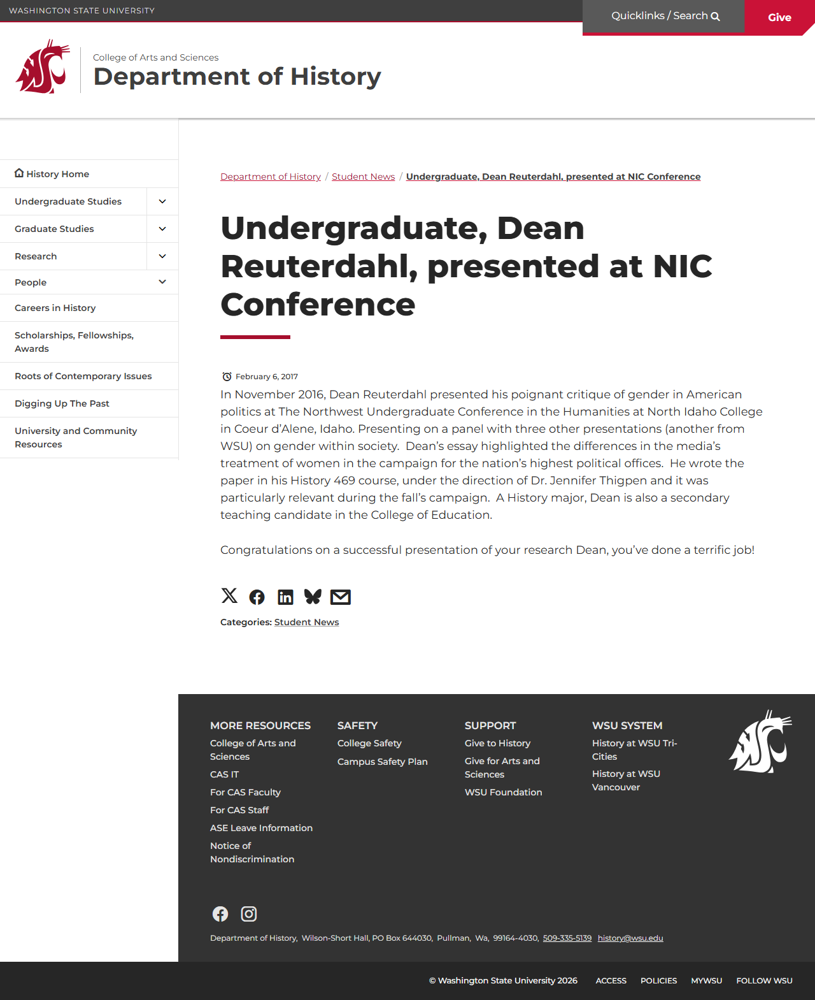

### honors.wsu.edu

#### [/](honors-wsu-edu/_root/report.md)

#### [/about/](honors-wsu-edu/about/report.md)

#### [/admissions/](honors-wsu-edu/admissions/report.md)

#### [/contact/](honors-wsu-edu/contact/report.md)

#### [/current-students/](honors-wsu-edu/current-students/report.md)

#### [/faculty/](honors-wsu-edu/faculty/report.md)

#### [/programs/](honors-wsu-edu/programs/report.md)

### housing.wsu.edu

#### [/about-us/](housing-wsu-edu/about-us/report.md)

#### [/about-us/contact-us/](housing-wsu-edu/about-us_contact-us/report.md)

#### [/about-us/important-dates/](housing-wsu-edu/about-us_important-dates/report.md)

#### [/about-us/join-our-team/](housing-wsu-edu/about-us_join-our-team/report.md)

#### [/about-us/meet-our-team/](housing-wsu-edu/about-us_meet-our-team/report.md)

#### [/about-us/on-campus-support/](housing-wsu-edu/about-us_on-campus-support/report.md)

#### [/about-us/payments-billing/](housing-wsu-edu/about-us_payments-billing/report.md)

#### [/about-us/temporary-housing-summer-conferences/](housing-wsu-edu/about-us_temporary-housing-summer-conferences/report.md)

#### [/apartments/](housing-wsu-edu/apartments/report.md)

#### [/apartments/apply/](housing-wsu-edu/apartments_apply/report.md)

#### [/apartments/rates/](housing-wsu-edu/apartments_rates/report.md)

#### [/current-students/](housing-wsu-edu/current-students/report.md)

#### [/current-students/academic-breaks/](housing-wsu-edu/current-students_academic-breaks/report.md)

#### [/current-students/contracts-and-policies/](housing-wsu-edu/current-students_contracts-and-policies/report.md)

#### [/current-students/mail-area-desks/](housing-wsu-edu/current-students_mail-area-desks/report.md)

#### [/current-students/technology-services/](housing-wsu-edu/current-students_technology-services/report.md)

#### [/current-students/work-order/](housing-wsu-edu/current-students_work-order/report.md)

#### [/prospective-students/](housing-wsu-edu/prospective-students/report.md)

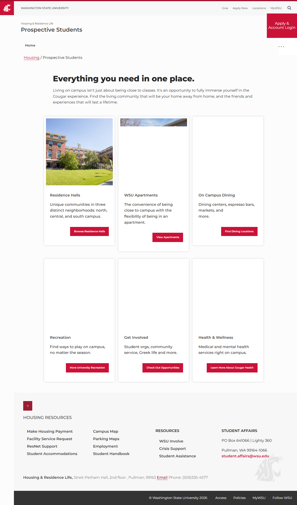

#### [/prospective-students/families-grad-students/](housing-wsu-edu/prospective-students_families-grad-students/report.md)

#### [/prospective-students/first-year-students/](housing-wsu-edu/prospective-students_first-year-students/report.md)

#### [/prospective-students/parking/](housing-wsu-edu/prospective-students_parking/report.md)

#### [/prospective-students/transfer-students/](housing-wsu-edu/prospective-students_transfer-students/report.md)

#### [/prospective-students/what-to-bring/](housing-wsu-edu/prospective-students_what-to-bring/report.md)

#### [/residence-halls/](housing-wsu-edu/residence-halls/report.md)

#### [/residence-halls/apply/](housing-wsu-edu/residence-halls_apply/report.md)

#### [/residence-halls/gender-inclusive-housing/](housing-wsu-edu/residence-halls_gender-inclusive-housing/report.md)

#### [/residence-halls/learning-living-communities/](housing-wsu-edu/residence-halls_learning-living-communities/report.md)

#### [/residence-halls/rates/](housing-wsu-edu/residence-halls_rates/report.md)

#### [/residence-halls/summer-housing/](housing-wsu-edu/residence-halls_summer-housing/report.md)

### hrs.wsu.edu

#### [/](hrs-wsu-edu/_root/report.md)

#### [/benefits/](hrs-wsu-edu/benefits/report.md)

#### [/contact/](hrs-wsu-edu/contact/report.md)

#### [/employment/](hrs-wsu-edu/employment/report.md)

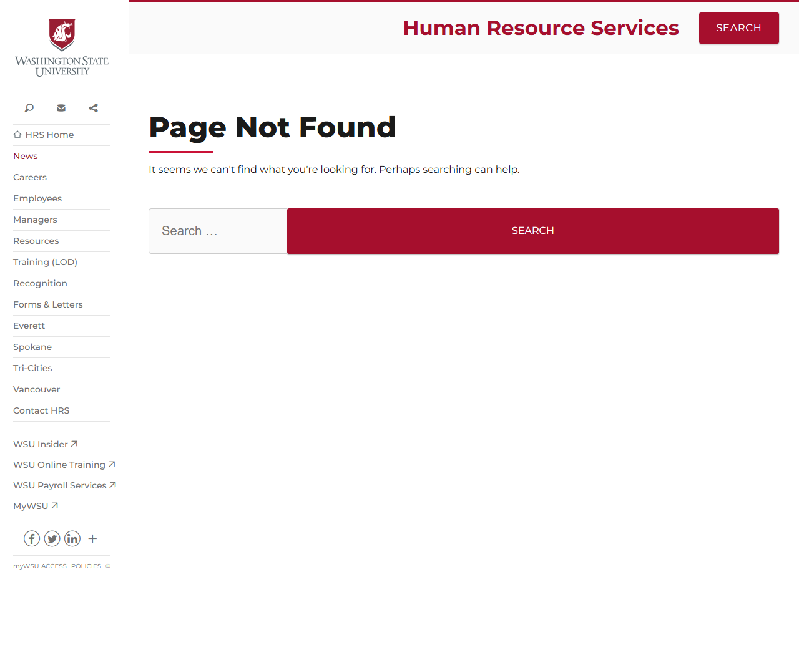

#### [/policies/](hrs-wsu-edu/policies/report.md)

#### [/training/](hrs-wsu-edu/training/report.md)

### hub.wsu.edu

#### [/](hub-wsu-edu/_root/report.md)

#### [/events/](hub-wsu-edu/events/report.md)

#### [/leadership/](hub-wsu-edu/leadership/report.md)

#### [/organizations/](hub-wsu-edu/organizations/report.md)

#### [/resources/](hub-wsu-edu/resources/report.md)

### index.wsu.edu

#### [/](index-wsu-edu/_root/report.md)

#### [/?c=A](index-wsu-edu/_qc-A/report.md)

#### [/?c=B](index-wsu-edu/_qc-B/report.md)

#### [/?c=C](index-wsu-edu/_qc-C/report.md)

#### [/?c=D](index-wsu-edu/_qc-D/report.md)

#### [/?c=E](index-wsu-edu/_qc-E/report.md)

### ip.wsu.edu

#### [/](ip-wsu-edu/_root/report.md)

#### [/contact/](ip-wsu-edu/contact/report.md)

#### [/international-students/](ip-wsu-edu/international-students/report.md)

#### [/programs/](ip-wsu-edu/programs/report.md)

#### [/resources/](ip-wsu-edu/resources/report.md)

#### [/study-abroad/](ip-wsu-edu/study-abroad/report.md)

### its.wsu.edu

#### [/](its-wsu-edu/_root/report.md)

#### [/about-its/](its-wsu-edu/about-its/report.md)

#### [/about-its/accreditation-submission-introduction-2025/](its-wsu-edu/about-its_accreditation-submission-introduction-2025/report.md)

#### [/about-its/its-informational-series/](its-wsu-edu/about-its_its-informational-series/report.md)

#### [/about-its/its-leadership-team/](its-wsu-edu/about-its_its-leadership-team/report.md)

#### [/crimson-service-desk/](its-wsu-edu/crimson-service-desk/report.md)

#### [/enterprise-systems/](its-wsu-edu/enterprise-systems/report.md)

#### [/enterprise-systems/enterprise-systems-project-overview/](its-wsu-edu/enterprise-systems_enterprise-systems-project-overview/report.md)

#### [/how-can-we-help-contact-its/](its-wsu-edu/how-can-we-help-contact-its/report.md)

#### [/information-security-services/](its-wsu-edu/information-security-services/report.md)

#### [/information-security-services/password-assistance/](its-wsu-edu/information-security-services_password-assistance/report.md)

#### [/information-security-services/security-spam-phishing-and-malware/](its-wsu-edu/information-security-services_security-spam-phishing-and-malware/report.md)

#### [/its-careers/](its-wsu-edu/its-careers/report.md)

#### [/its-scheduled-maintenance/](its-wsu-edu/its-scheduled-maintenance/report.md)

#### [/msdata-storage/](its-wsu-edu/msdata-storage/report.md)

#### [/news/](its-wsu-edu/news/report.md)

#### [/news/newsletters/](its-wsu-edu/news_newsletters/report.md)

#### [/piat/](its-wsu-edu/piat/report.md)

#### [/piat/buildings-and-spaces/](its-wsu-edu/piat_buildings-and-spaces/report.md)

#### [/piat/instructor-support/](its-wsu-edu/piat_instructor-support/report.md)

#### [/services-a-z/](its-wsu-edu/services-a-z/report.md)

### li.wsu.edu

#### [/](li-wsu-edu/_root/report.md)

#### [/contact/](li-wsu-edu/contact/report.md)

#### [/resources/](li-wsu-edu/resources/report.md)

#### [/services/](li-wsu-edu/services/report.md)

#### [/support/](li-wsu-edu/support/report.md)

#### [/technology/](li-wsu-edu/technology/report.md)

### libraries.wsu.edu

#### [/](libraries-wsu-edu/_root/report.md)

#### [/about/](libraries-wsu-edu/about/report.md)

#### [/about/departments/](libraries-wsu-edu/about_departments/report.md)

#### [/accessibility/](libraries-wsu-edu/accessibility/report.md)

#### [/ask/](libraries-wsu-edu/ask/report.md)

#### [/contact/](libraries-wsu-edu/contact/report.md)

#### [/course-reserves/](libraries-wsu-edu/course-reserves/report.md)

#### [/directory/](libraries-wsu-edu/directory/report.md)

#### [/help/](libraries-wsu-edu/help/report.md)

#### [/help/off-campus-access](libraries-wsu-edu/help_off-campus-access/report.md)

#### [/hours/](libraries-wsu-edu/hours/report.md)

#### [/info-for/community/](libraries-wsu-edu/info-for_community/report.md)

#### [/info-for/faculty-staff/](libraries-wsu-edu/info-for_faculty-staff/report.md)

#### [/info-for/global-campus/](libraries-wsu-edu/info-for_global-campus/report.md)

#### [/info-for/instructors/](libraries-wsu-edu/info-for_instructors/report.md)

#### [/info-for/new-users/](libraries-wsu-edu/info-for_new-users/report.md)

#### [/info-for/students/](libraries-wsu-edu/info-for_students/report.md)

#### [/information-for/](libraries-wsu-edu/information-for/report.md)

#### [/interlibrary-loan/](libraries-wsu-edu/interlibrary-loan/report.md)

#### [/jobs/](libraries-wsu-edu/jobs/report.md)

#### [/library-map/](libraries-wsu-edu/library-map/report.md)

#### [/my-accounts/](libraries-wsu-edu/my-accounts/report.md)

#### [/policies/](libraries-wsu-edu/policies/report.md)

#### [/services/](libraries-wsu-edu/services/report.md)

#### [/spaces/](libraries-wsu-edu/spaces/report.md)

### lists.wsu.edu

#### [/](lists-wsu-edu/_root/report.md)

#### [/help/](lists-wsu-edu/help/report.md)

#### [/manage/](lists-wsu-edu/manage/report.md)

#### [/subscribe/](lists-wsu-edu/subscribe/report.md)

### livingat.wsu.edu

#### [/fam/](livingat-wsu-edu/fam/report.md)

#### [/reshall/](livingat-wsu-edu/reshall/report.md)

#### [/ssa/](livingat-wsu-edu/ssa/report.md)

### maps.wsu.edu

#### [/everett/](maps-wsu-edu/everett/report.md)

#### [/pullman/](maps-wsu-edu/pullman/report.md)

#### [/spokane/](maps-wsu-edu/spokane/report.md)

#### [/tricities/](maps-wsu-edu/tricities/report.md)

#### [/vancouver/](maps-wsu-edu/vancouver/report.md)

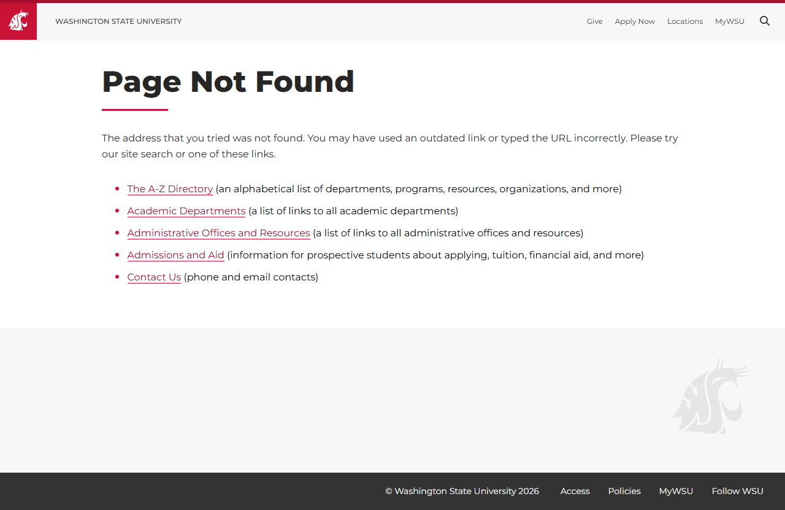

### math.wsu.edu

#### [/](math-wsu-edu/_root/report.md)

#### [/about/](math-wsu-edu/about/report.md)

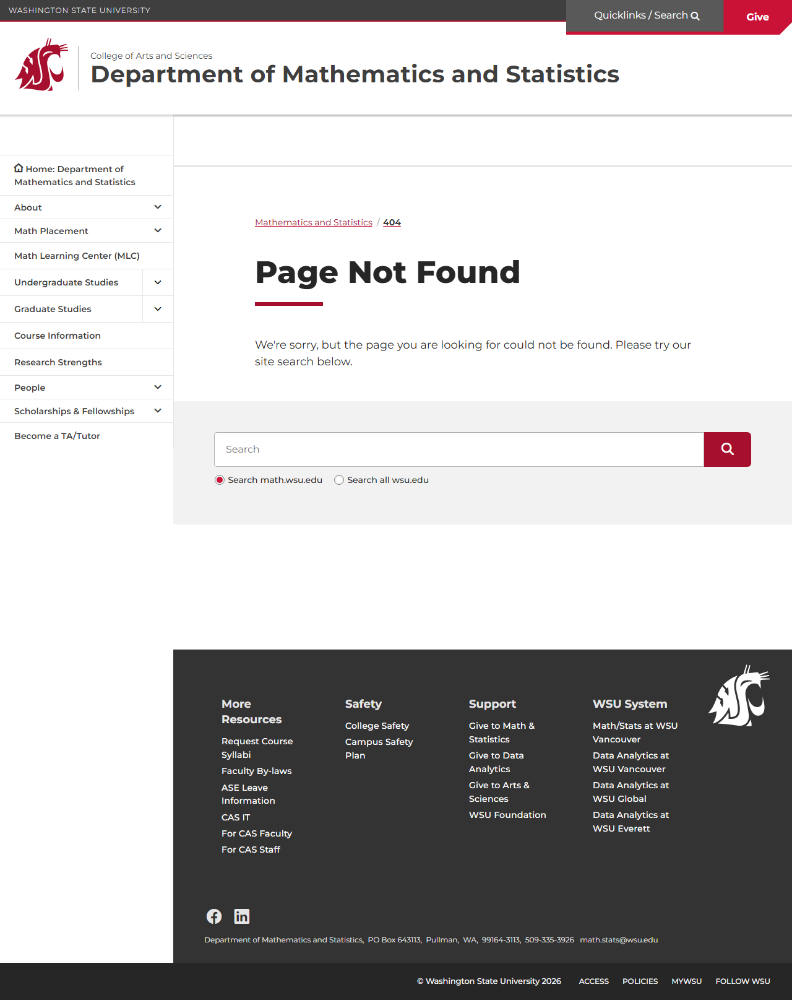

#### [/faculty/](math-wsu-edu/faculty/report.md)

#### [/graduate/](math-wsu-edu/graduate/report.md)

#### [/research/](math-wsu-edu/research/report.md)

#### [/undergraduate/](math-wsu-edu/undergraduate/report.md)

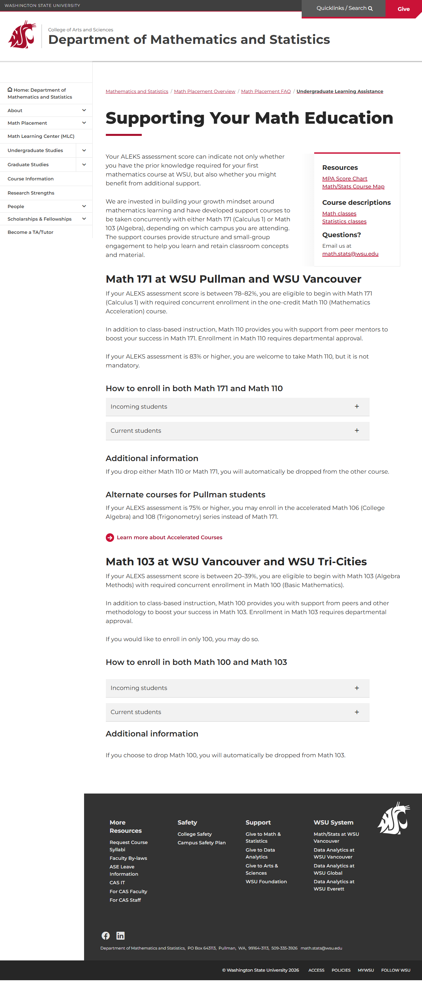

### medicine.wsu.edu

#### [/](medicine-wsu-edu/_root/report.md)

#### [/about/](medicine-wsu-edu/about/report.md)

#### [/admissions/](medicine-wsu-edu/admissions/report.md)

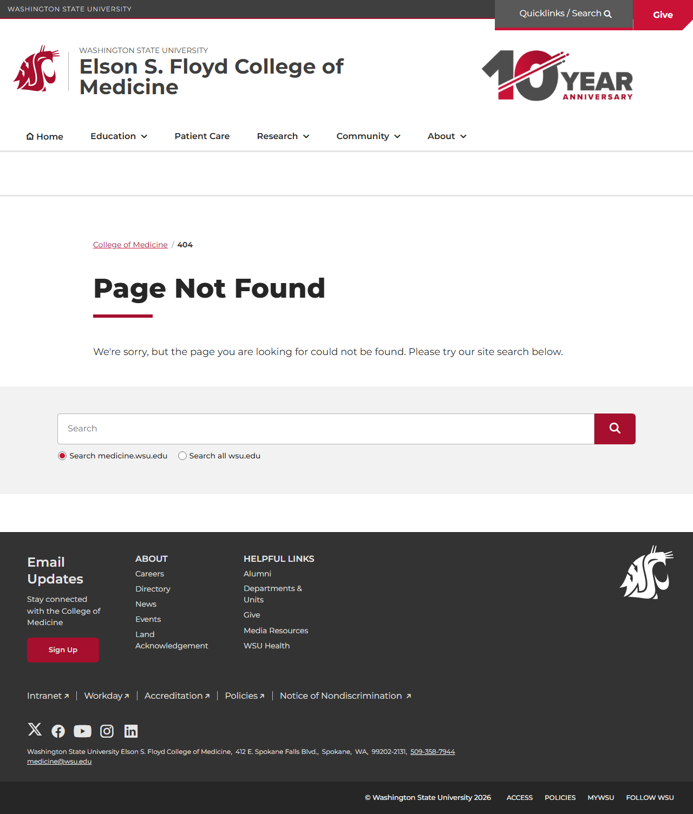

#### [/contact/](medicine-wsu-edu/contact/report.md)

#### [/education/](medicine-wsu-edu/education/report.md)

#### [/research/](medicine-wsu-edu/research/report.md)

### murrow.wsu.edu

#### [/](murrow-wsu-edu/_root/report.md)

#### [/about/](murrow-wsu-edu/about/report.md)

#### [/faculty/](murrow-wsu-edu/faculty/report.md)

#### [/graduate/](murrow-wsu-edu/graduate/report.md)

#### [/news/](murrow-wsu-edu/news/report.md)

#### [/programs/](murrow-wsu-edu/programs/report.md)

#### [/undergraduate/](murrow-wsu-edu/undergraduate/report.md)

### museum.wsu.edu

#### [/](museum-wsu-edu/_root/report.md)

#### [/collections/](museum-wsu-edu/collections/report.md)

#### [/education/](museum-wsu-edu/education/report.md)

#### [/events/](museum-wsu-edu/events/report.md)

#### [/exhibitions/](museum-wsu-edu/exhibitions/report.md)

#### [/support/](museum-wsu-edu/support/report.md)

#### [/visit/](museum-wsu-edu/visit/report.md)

### my.wsu.edu

#### [/](my-wsu-edu/_root/report.md)

#### [/help/](my-wsu-edu/help/report.md)

#### [/services/](my-wsu-edu/services/report.md)

### native.wsu.edu

#### [/](native-wsu-edu/_root/report.md)

#### [/about/](native-wsu-edu/about/report.md)

#### [/contact/](native-wsu-edu/contact/report.md)

#### [/programs/](native-wsu-edu/programs/report.md)

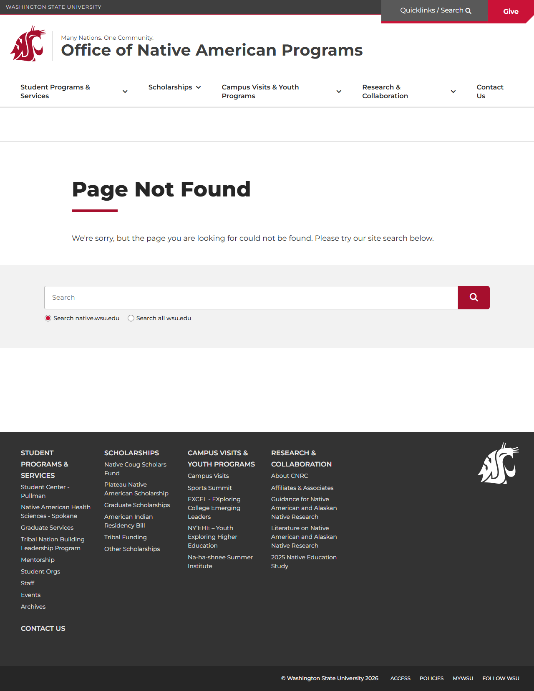

#### [/resources/](native-wsu-edu/resources/report.md)

#### [/students/](native-wsu-edu/students/report.md)

### news.wsu.edu

#### [/](news-wsu-edu/_root/report.md)

#### [/media-contacts/](news-wsu-edu/media-contacts/report.md)

#### [/news/](news-wsu-edu/news/report.md)

#### [/press-releases/](news-wsu-edu/press-releases/report.md)

#### [/stories/](news-wsu-edu/stories/report.md)

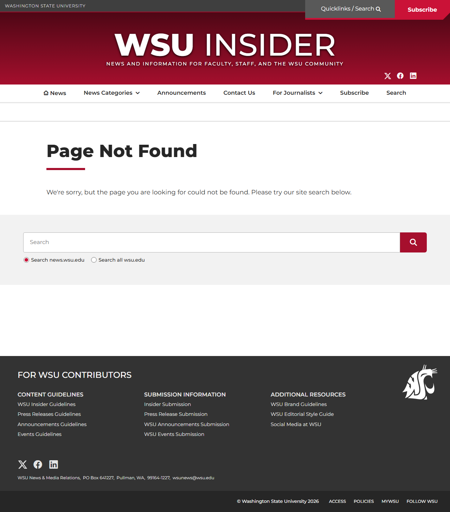

#### [/submit-news/](news-wsu-edu/submit-news/report.md)

### nursing.wsu.edu

#### [/](nursing-wsu-edu/_root/report.md)

#### [/about/](nursing-wsu-edu/about/report.md)

#### [/admissions/](nursing-wsu-edu/admissions/report.md)

#### [/contact/](nursing-wsu-edu/contact/report.md)

#### [/faculty/](nursing-wsu-edu/faculty/report.md)

#### [/programs/](nursing-wsu-edu/programs/report.md)

#### [/students/](nursing-wsu-edu/students/report.md)

### office365.wsu.edu

#### [/](office365-wsu-edu/_root/report.md)

#### [/help/](office365-wsu-edu/help/report.md)

#### [/services/](office365-wsu-edu/services/report.md)

#### [/training/](office365-wsu-edu/training/report.md)

### online.wsu.edu

#### [/](online-wsu-edu/_root/report.md)

#### [/admissions/](online-wsu-edu/admissions/report.md)

#### [/contact/](online-wsu-edu/contact/report.md)

#### [/current-students/](online-wsu-edu/current-students/report.md)

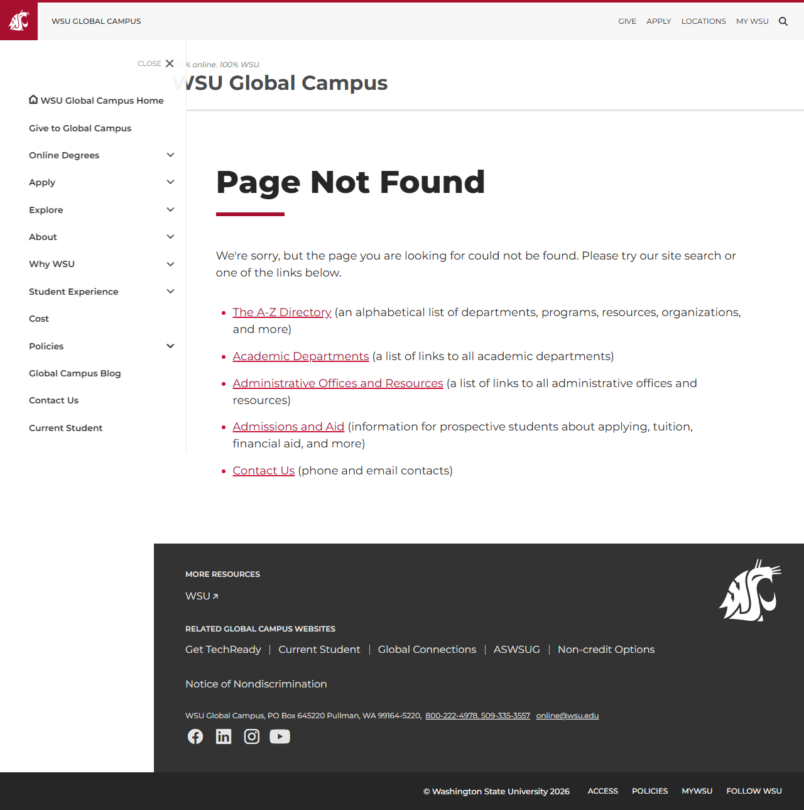

#### [/programs/](online-wsu-edu/programs/report.md)

#### [/resources/](online-wsu-edu/resources/report.md)

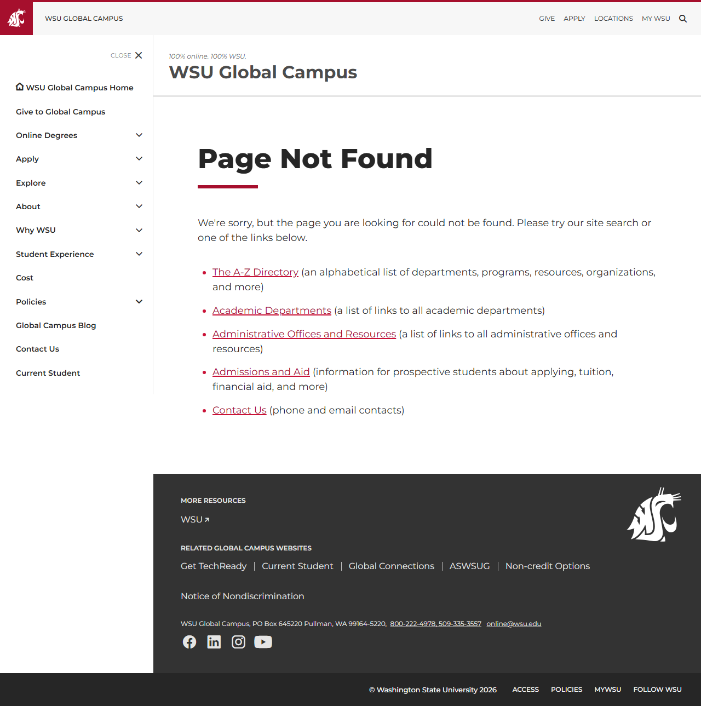

### orc.wsu.edu

#### [/contact/](orc-wsu-edu/contact/report.md)

#### [/programs/](orc-wsu-edu/programs/report.md)

#### [/trips/](orc-wsu-edu/trips/report.md)

### parking.wsu.edu

#### [/contact/](parking-wsu-edu/contact/report.md)

#### [/maps/](parking-wsu-edu/maps/report.md)

#### [/permits/](parking-wsu-edu/permits/report.md)

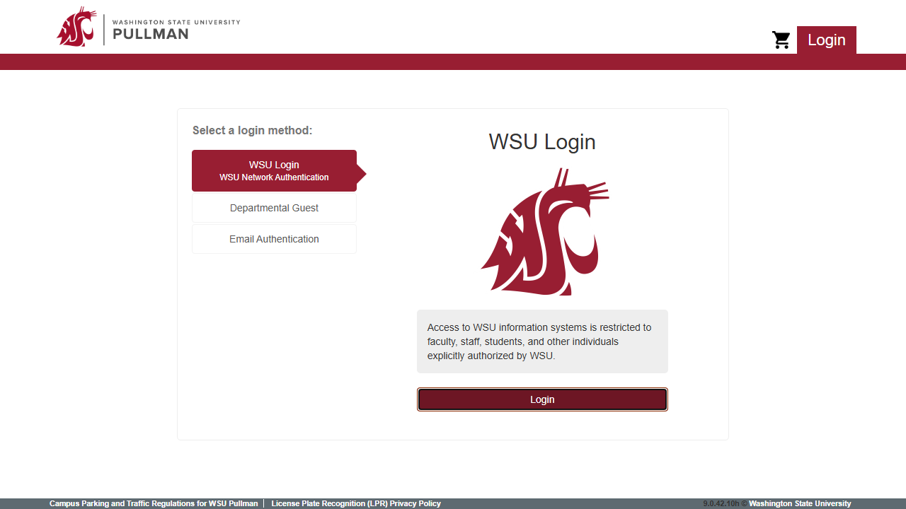

#### [/policies/](parking-wsu-edu/policies/report.md)

#### [/visitor-parking/](parking-wsu-edu/visitor-parking/report.md)

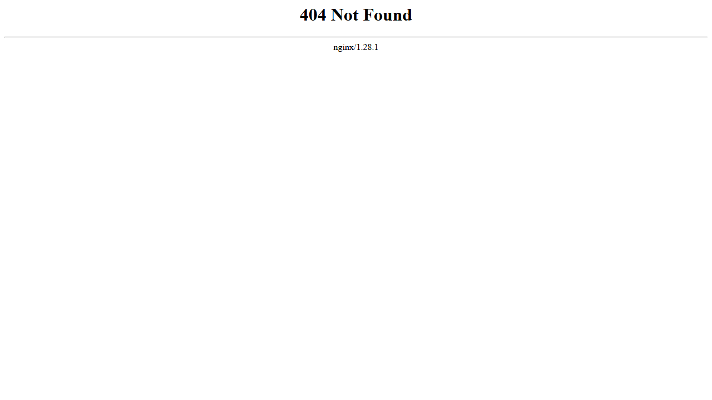

### payroll.wsu.edu

#### [/](payroll-wsu-edu/_root/report.md)

#### [/contact/](payroll-wsu-edu/contact/report.md)

#### [/forms/](payroll-wsu-edu/forms/report.md)

#### [/resources/](payroll-wsu-edu/resources/report.md)

#### [/services/](payroll-wsu-edu/services/report.md)

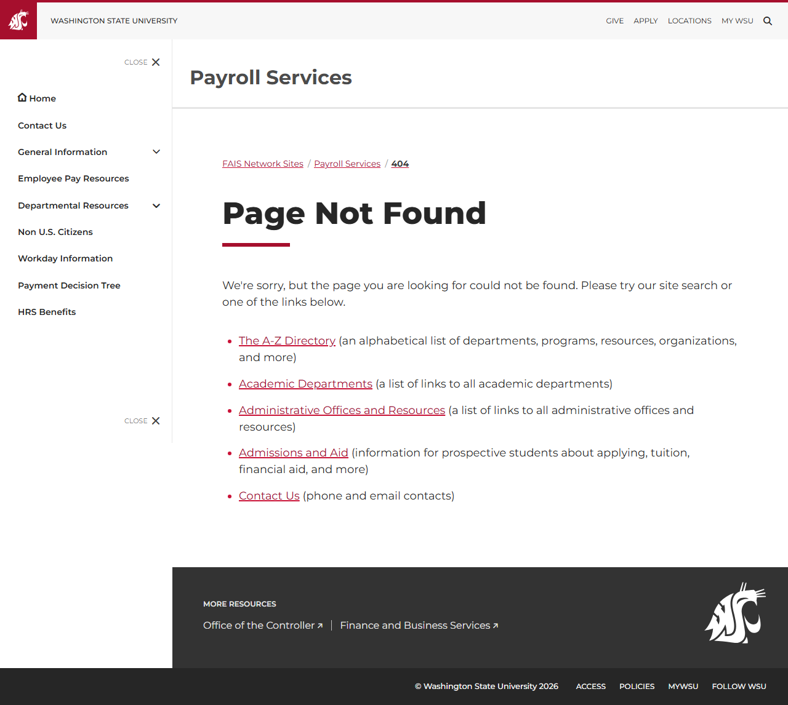

#### [/tax-information/](payroll-wsu-edu/tax-information/report.md)

### pharmacy.wsu.edu

#### [/](pharmacy-wsu-edu/_root/report.md)

#### [/about/](pharmacy-wsu-edu/about/report.md)

#### [/admissions/](pharmacy-wsu-edu/admissions/report.md)

#### [/contact/](pharmacy-wsu-edu/contact/report.md)

#### [/faculty/](pharmacy-wsu-edu/faculty/report.md)

#### [/programs/](pharmacy-wsu-edu/programs/report.md)

#### [/research/](pharmacy-wsu-edu/research/report.md)

### physics.wsu.edu

#### [/](physics-wsu-edu/_root/report.md)

#### [/about/](physics-wsu-edu/about/report.md)

#### [/astronomy/](physics-wsu-edu/astronomy/report.md)

#### [/faculty/](physics-wsu-edu/faculty/report.md)

#### [/graduate/](physics-wsu-edu/graduate/report.md)

#### [/research/](physics-wsu-edu/research/report.md)

#### [/undergraduate/](physics-wsu-edu/undergraduate/report.md)

### policies.wsu.edu

#### [/](policies-wsu-edu/_root/report.md)

#### [/about/](policies-wsu-edu/about/report.md)

#### [/bppm/](policies-wsu-edu/bppm/report.md)

#### [/manuals/](policies-wsu-edu/manuals/report.md)

#### [/search/](policies-wsu-edu/search/report.md)

### portal.wsu.edu

#### [/](portal-wsu-edu/_root/report.md)

#### [/help/](portal-wsu-edu/help/report.md)

#### [/services/](portal-wsu-edu/services/report.md)

### president.wsu.edu

#### [/](president-wsu-edu/_root/report.md)

#### [/about/](president-wsu-edu/about/report.md)

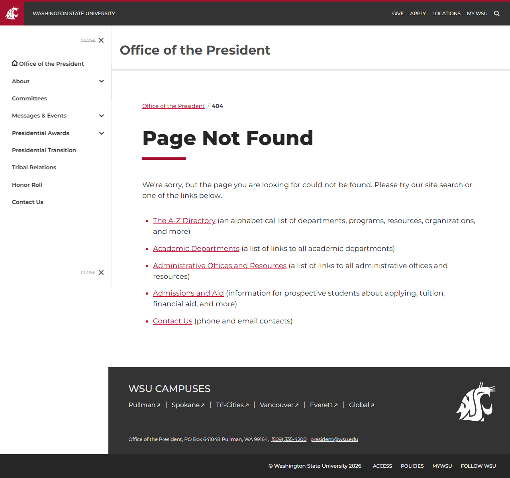

#### [/contact/](president-wsu-edu/contact/report.md)

#### [/news/](president-wsu-edu/news/report.md)

#### [/priorities/](president-wsu-edu/priorities/report.md)

#### [/speeches/](president-wsu-edu/speeches/report.md)

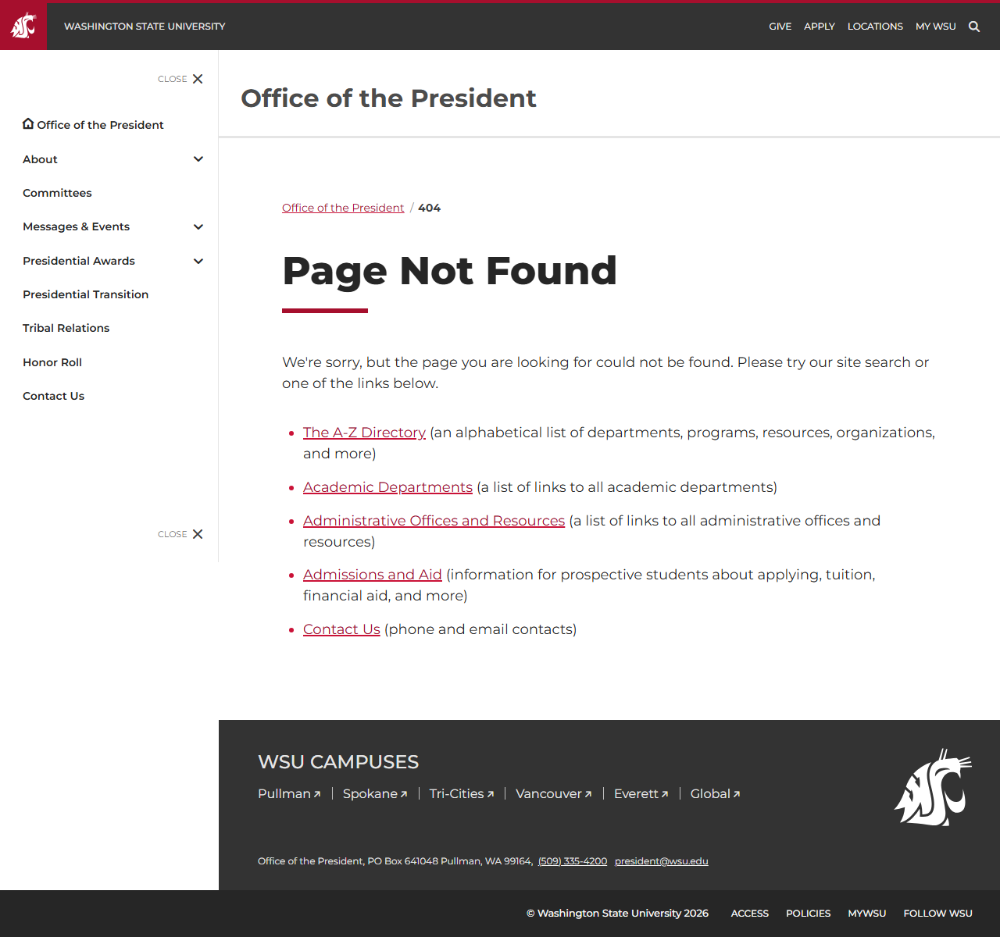

### provost.wsu.edu

#### [/](provost-wsu-edu/_root/report.md)

#### [/about/](provost-wsu-edu/about/report.md)

#### [/academic-affairs/](provost-wsu-edu/academic-affairs/report.md)

#### [/contact/](provost-wsu-edu/contact/report.md)

#### [/policies/](provost-wsu-edu/policies/report.md)

#### [/resources/](provost-wsu-edu/resources/report.md)

### psychology.wsu.edu

#### [/](psychology-wsu-edu/_root/report.md)

#### [/about/](psychology-wsu-edu/about/report.md)

#### [/clinic/](psychology-wsu-edu/clinic/report.md)

#### [/faculty/](psychology-wsu-edu/faculty/report.md)

#### [/graduate/](psychology-wsu-edu/graduate/report.md)

#### [/research/](psychology-wsu-edu/research/report.md)

#### [/undergraduate/](psychology-wsu-edu/undergraduate/report.md)

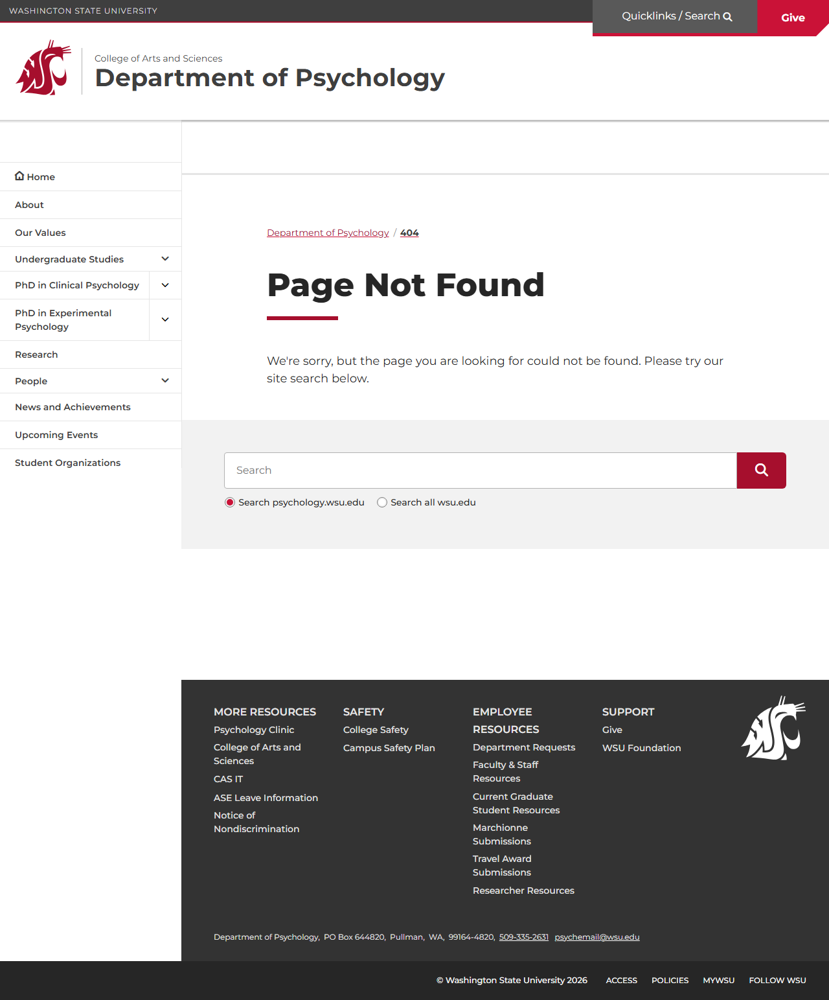

### pullman.wsu.edu

#### [/](pullman-wsu-edu/_root/report.md)

#### [/about/](pullman-wsu-edu/about/report.md)

#### [/academics/](pullman-wsu-edu/academics/report.md)

#### [/admissions/](pullman-wsu-edu/admissions/report.md)

#### [/campus-life/](pullman-wsu-edu/campus-life/report.md)

#### [/contact/](pullman-wsu-edu/contact/report.md)

### registrar.wsu.edu

#### [/](registrar-wsu-edu/_root/report.md)

#### [/academic-calendar/](registrar-wsu-edu/academic-calendar/report.md)

#### [/change-of-campus/](registrar-wsu-edu/change-of-campus/report.md)

#### [/contact-us/](registrar-wsu-edu/contact-us/report.md)

#### [/grades-and-gpa/](registrar-wsu-edu/grades-and-gpa/report.md)

#### [/how-to-videos/](registrar-wsu-edu/how-to-videos/report.md)

#### [/petitions/](registrar-wsu-edu/petitions/report.md)

#### [/sessions/](registrar-wsu-edu/sessions/report.md)

#### [/special-enrollment/](registrar-wsu-edu/special-enrollment/report.md)

#### [/staff-forms/](registrar-wsu-edu/staff-forms/report.md)

#### [/student-forms/](registrar-wsu-edu/student-forms/report.md)

#### [/term-withdrawal/](registrar-wsu-edu/term-withdrawal/report.md)

#### [/tuition-adjustments/](registrar-wsu-edu/tuition-adjustments/report.md)

### research.wsu.edu

#### [/](research-wsu-edu/_root/report.md)

#### [/about/](research-wsu-edu/about/report.md)

#### [/compliance/](research-wsu-edu/compliance/report.md)

#### [/contact/](research-wsu-edu/contact/report.md)

#### [/funding/](research-wsu-edu/funding/report.md)

#### [/research-areas/](research-wsu-edu/research-areas/report.md)

#### [/resources/](research-wsu-edu/resources/report.md)

### rotc.wsu.edu

#### [/](rotc-wsu-edu/_root/report.md)

#### [/about/](rotc-wsu-edu/about/report.md)

#### [/admissions/](rotc-wsu-edu/admissions/report.md)

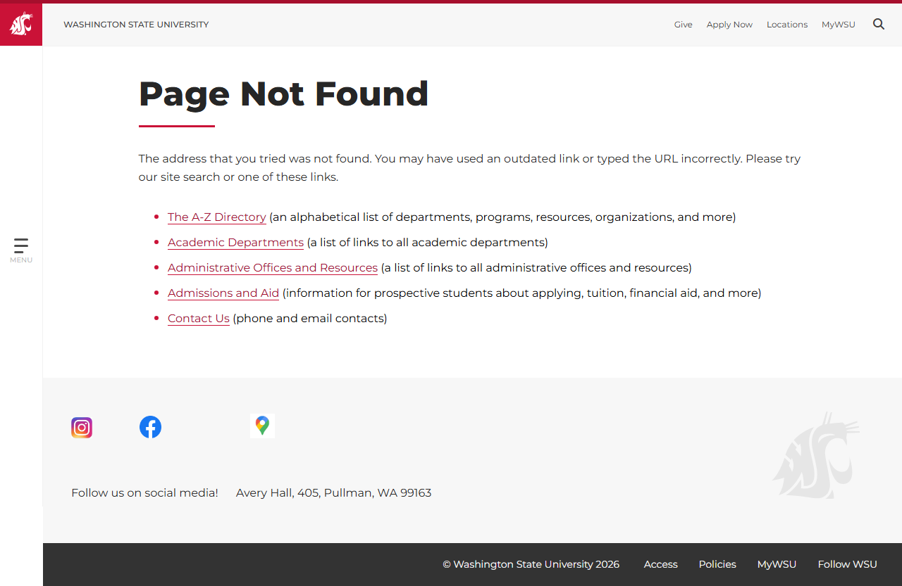

#### [/cadets/](rotc-wsu-edu/cadets/report.md)

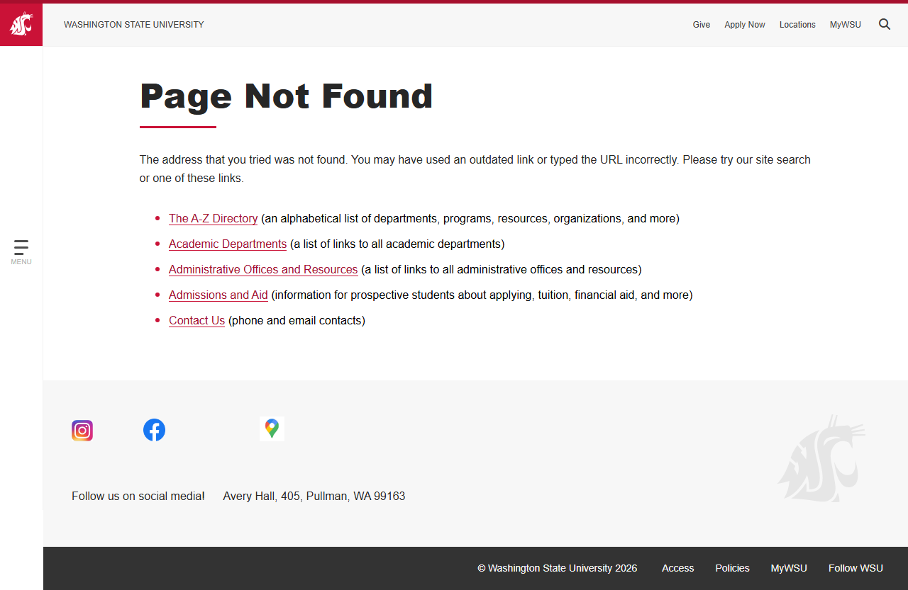

#### [/contact/](rotc-wsu-edu/contact/report.md)

#### [/scholarships/](rotc-wsu-edu/scholarships/report.md)

### s3.wp.wsu.edu

#### [/](s3-wp-wsu-edu/_root/report.md)

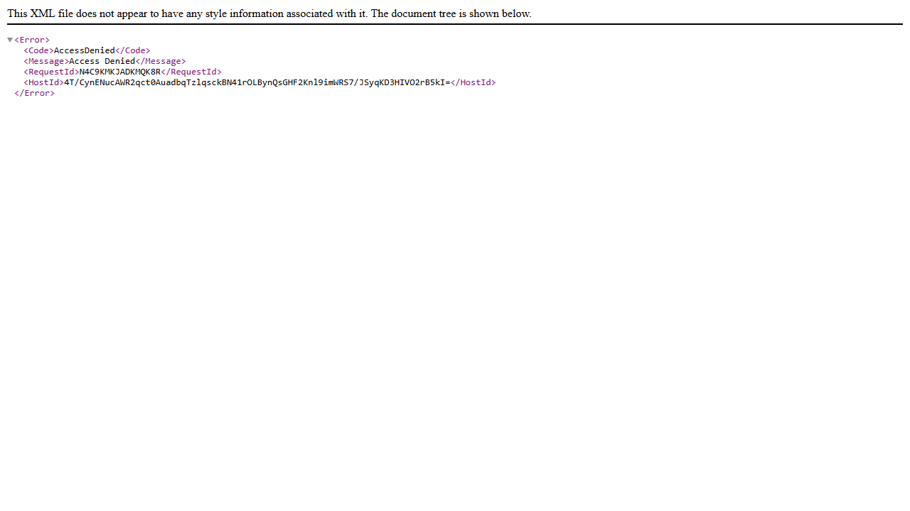

### schedules.wsu.edu

#### [/Coop/](schedules-wsu-edu/Coop/report.md)

#### [/List/Everett/](schedules-wsu-edu/List_Everett/report.md)

#### [/List/TriCities/](schedules-wsu-edu/List_TriCities/report.md)

#### [/List/Vancouver/](schedules-wsu-edu/List_Vancouver/report.md)

### school.eecs.wsu.edu

#### [/](school-eecs-wsu-edu/_root/report.md)

#### [/about/](school-eecs-wsu-edu/about/report.md)

#### [/contact/](school-eecs-wsu-edu/contact/report.md)

#### [/faculty/](school-eecs-wsu-edu/faculty/report.md)

#### [/graduate/](school-eecs-wsu-edu/graduate/report.md)

#### [/research/](school-eecs-wsu-edu/research/report.md)

#### [/undergraduate/](school-eecs-wsu-edu/undergraduate/report.md)

### sdc.wsu.edu

#### [/](sdc-wsu-edu/_root/report.md)

#### [/about/](sdc-wsu-edu/about/report.md)

#### [/contact/](sdc-wsu-edu/contact/report.md)

#### [/faculty/](sdc-wsu-edu/faculty/report.md)

#### [/programs/](sdc-wsu-edu/programs/report.md)

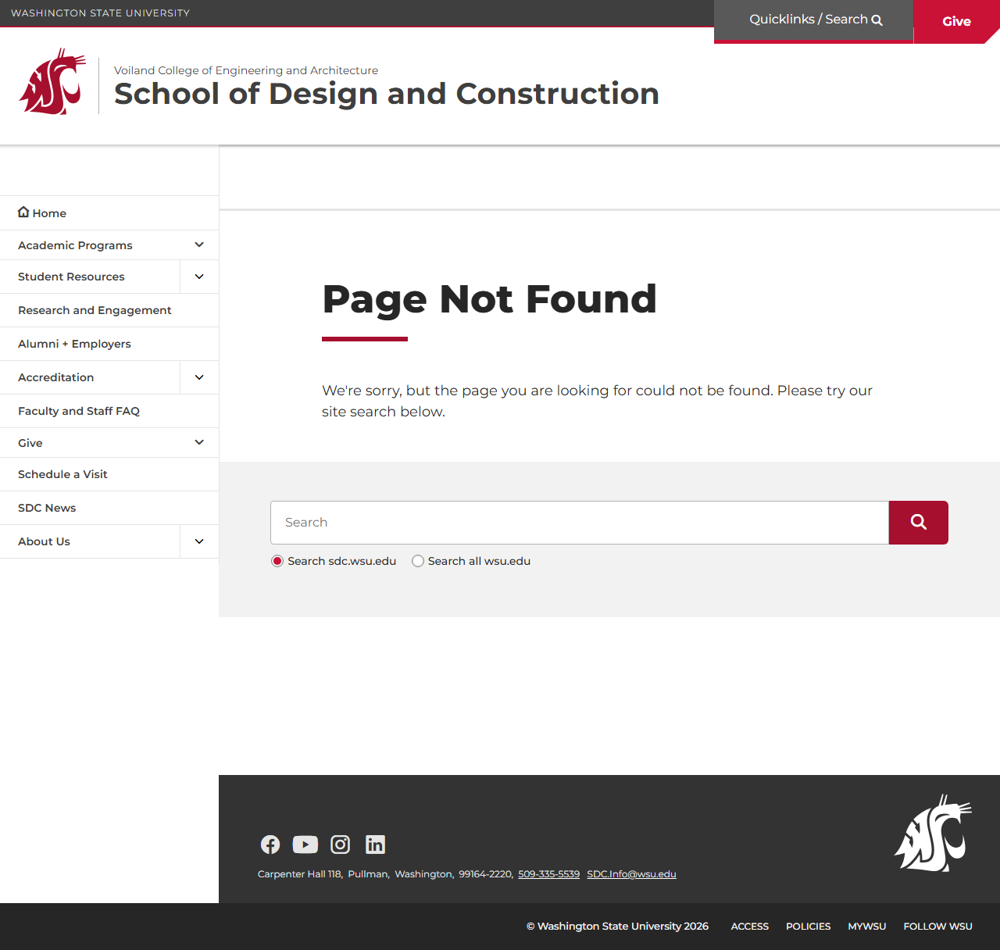

#### [/undergraduate/](sdc-wsu-edu/undergraduate/report.md)

### slcr.wsu.edu

#### [/](slcr-wsu-edu/_root/report.md)

#### [/about/](slcr-wsu-edu/about/report.md)

#### [/contact/](slcr-wsu-edu/contact/report.md)

#### [/courses/](slcr-wsu-edu/courses/report.md)

#### [/faculty/](slcr-wsu-edu/faculty/report.md)

#### [/programs/](slcr-wsu-edu/programs/report.md)

### socialmedia.wsu.edu

#### [/](socialmedia-wsu-edu/_root/report.md)

#### [/directory/](socialmedia-wsu-edu/directory/report.md)

#### [/guidelines/](socialmedia-wsu-edu/guidelines/report.md)

#### [/resources/](socialmedia-wsu-edu/resources/report.md)

#### [/training/](socialmedia-wsu-edu/training/report.md)

### spokane.wsu.edu

#### [/](spokane-wsu-edu/_root/report.md)

#### [/about/](spokane-wsu-edu/about/report.md)

#### [/academics/](spokane-wsu-edu/academics/report.md)

#### [/admissions/](spokane-wsu-edu/admissions/report.md)

#### [/contact/](spokane-wsu-edu/contact/report.md)

#### [/library/](spokane-wsu-edu/library/report.md)

#### [/student-services/](spokane-wsu-edu/student-services/report.md)

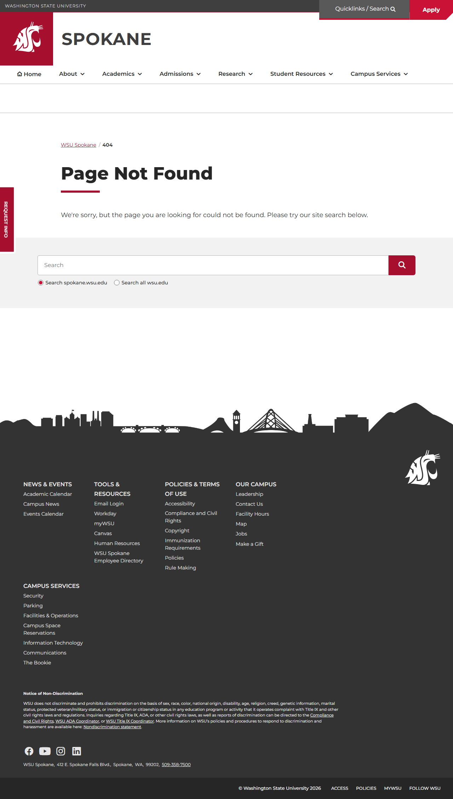

### staff.storefront.wsu.edu

#### [/](staff-storefront-wsu-edu/_root/report.md)

#### [/contact/](staff-storefront-wsu-edu/contact/report.md)

#### [/design/](staff-storefront-wsu-edu/design/report.md)

#### [/printing/](staff-storefront-wsu-edu/printing/report.md)

#### [/services/](staff-storefront-wsu-edu/services/report.md)

### studentaffairs.vancouver.wsu.edu

#### [/](studentaffairs-vancouver-wsu-edu/_root/report.md)

#### [/about/](studentaffairs-vancouver-wsu-edu/about/report.md)

#### [/contact/](studentaffairs-vancouver-wsu-edu/contact/report.md)

#### [/resources/](studentaffairs-vancouver-wsu-edu/resources/report.md)

#### [/services/](studentaffairs-vancouver-wsu-edu/services/report.md)

#### [/student-involvement/](studentaffairs-vancouver-wsu-edu/student-involvement/report.md)

### studentaffairs.wsu.edu

#### [/about/](studentaffairs-wsu-edu/about/report.md)

#### [/contact/](studentaffairs-wsu-edu/contact/report.md)

#### [/departments/](studentaffairs-wsu-edu/departments/report.md)

#### [/policies/](studentaffairs-wsu-edu/policies/report.md)

#### [/resources/](studentaffairs-wsu-edu/resources/report.md)

### studentcare.wsu.edu

#### [/for-faculty-staff/](studentcare-wsu-edu/for-faculty-staff/report.md)

#### [/resources/](studentcare-wsu-edu/resources/report.md)

#### [/services/](studentcare-wsu-edu/services/report.md)

#### [/submit-concern/](studentcare-wsu-edu/submit-concern/report.md)

### sustainability.wsu.edu

#### [/](sustainability-wsu-edu/_root/report.md)

#### [/about/](sustainability-wsu-edu/about/report.md)

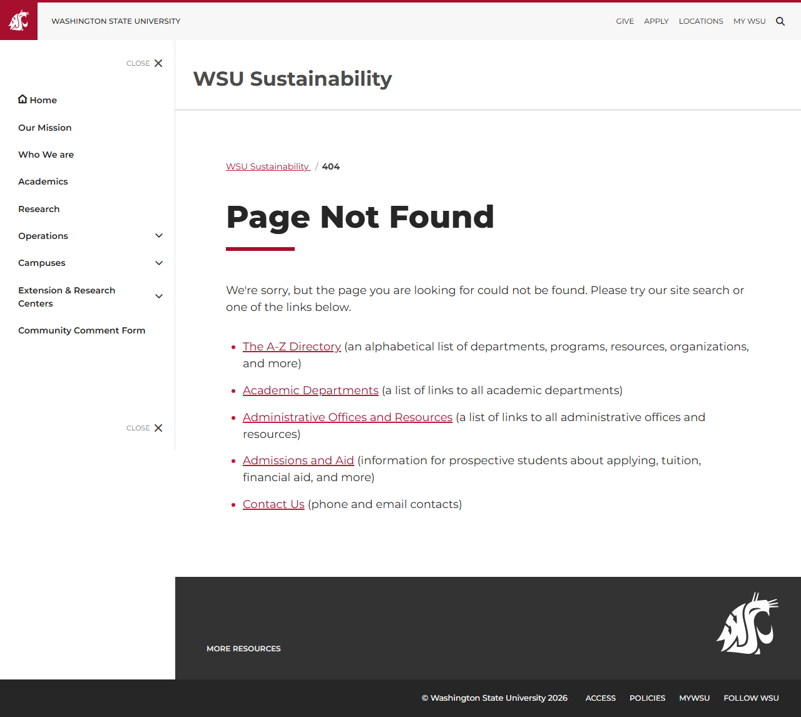

#### [/contact/](sustainability-wsu-edu/contact/report.md)

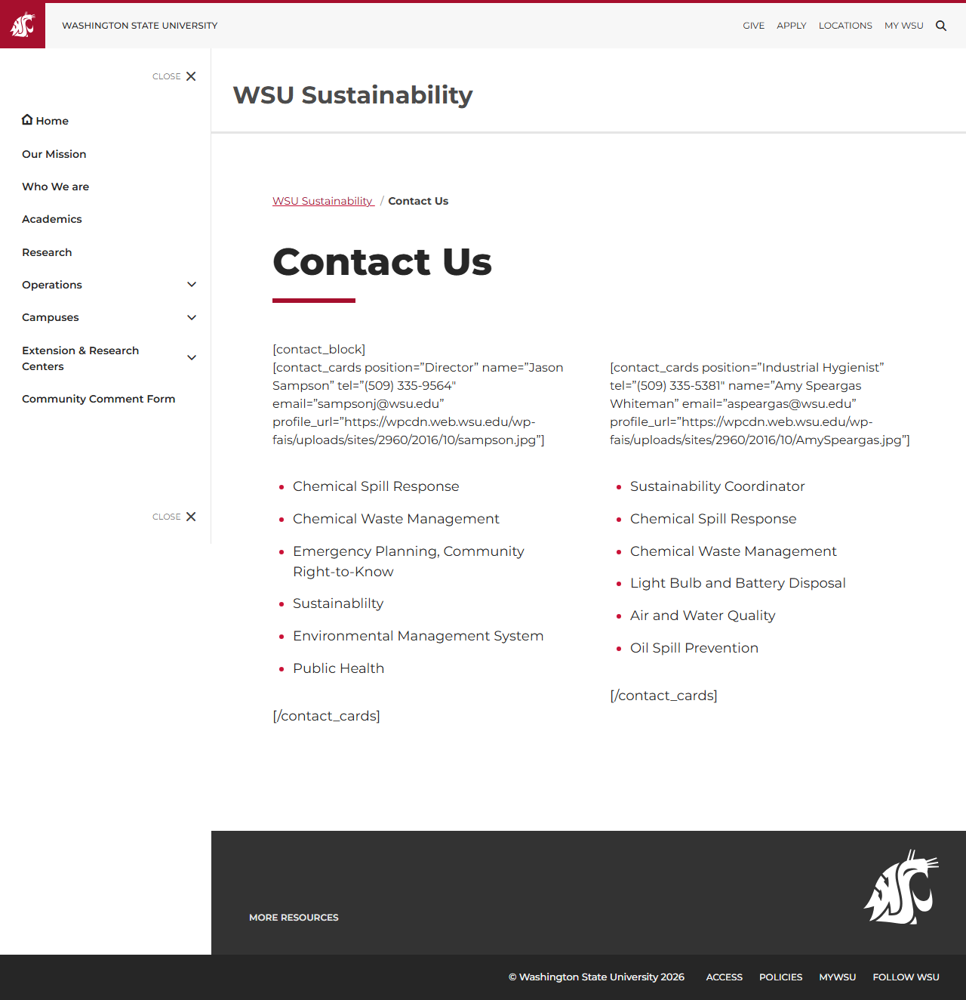

#### [/get-involved/](sustainability-wsu-edu/get-involved/report.md)

#### [/initiatives/](sustainability-wsu-edu/initiatives/report.md)

#### [/resources/](sustainability-wsu-edu/resources/report.md)

### threatassessment.wsu.edu

#### [/](threatassessment-wsu-edu/_root/report.md)

#### [/about/](threatassessment-wsu-edu/about/report.md)

#### [/contact/](threatassessment-wsu-edu/contact/report.md)

#### [/report-concern/](threatassessment-wsu-edu/report-concern/report.md)

#### [/resources/](threatassessment-wsu-edu/resources/report.md)

### transportation.wsu.edu

#### [/](transportation-wsu-edu/_root/report.md)

#### [/bike/](transportation-wsu-edu/bike/report.md)

#### [/contact/](transportation-wsu-edu/contact/report.md)

#### [/policies/](transportation-wsu-edu/policies/report.md)

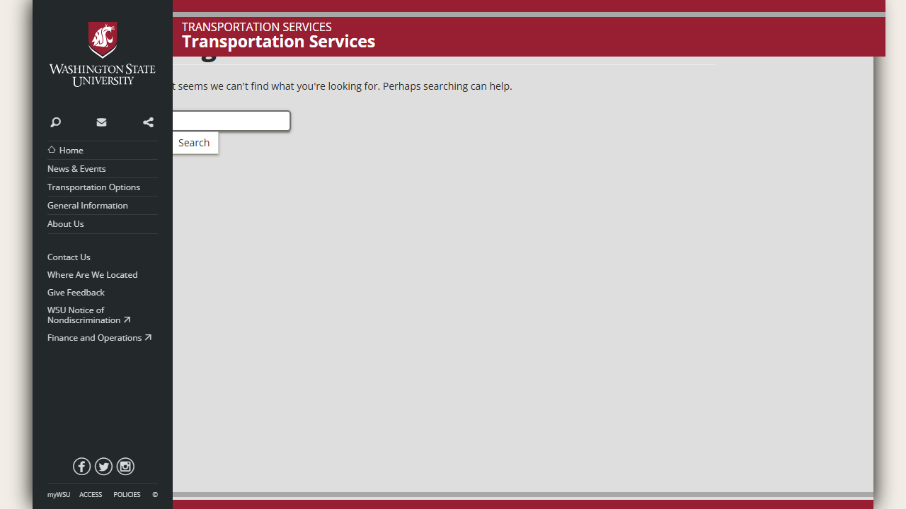

### tricities.wsu.edu

#### [/](tricities-wsu-edu/_root/report.md)

#### [/about/](tricities-wsu-edu/about/report.md)

#### [/academics/](tricities-wsu-edu/academics/report.md)

#### [/admissions/](tricities-wsu-edu/admissions/report.md)

#### [/contact/](tricities-wsu-edu/contact/report.md)

#### [/library/](tricities-wsu-edu/library/report.md)

#### [/student-services/](tricities-wsu-edu/student-services/report.md)

### urec.wsu.edu

#### [/employment/](urec-wsu-edu/employment/report.md)

#### [/membership/](urec-wsu-edu/membership/report.md)

#### [/orc/](urec-wsu-edu/orc/report.md)

#### [/sportclubs/](urec-wsu-edu/sportclubs/report.md)

### vancouver.wsu.edu

#### [/](vancouver-wsu-edu/_root/report.md)

#### [/about/](vancouver-wsu-edu/about/report.md)

#### [/academics/](vancouver-wsu-edu/academics/report.md)

#### [/admissions/](vancouver-wsu-edu/admissions/report.md)

#### [/contact/](vancouver-wsu-edu/contact/report.md)

#### [/library/](vancouver-wsu-edu/library/report.md)

#### [/student-services/](vancouver-wsu-edu/student-services/report.md)

### vcea.wsu.edu

#### [/](vcea-wsu-edu/_root/report.md)

#### [/about/](vcea-wsu-edu/about/report.md)

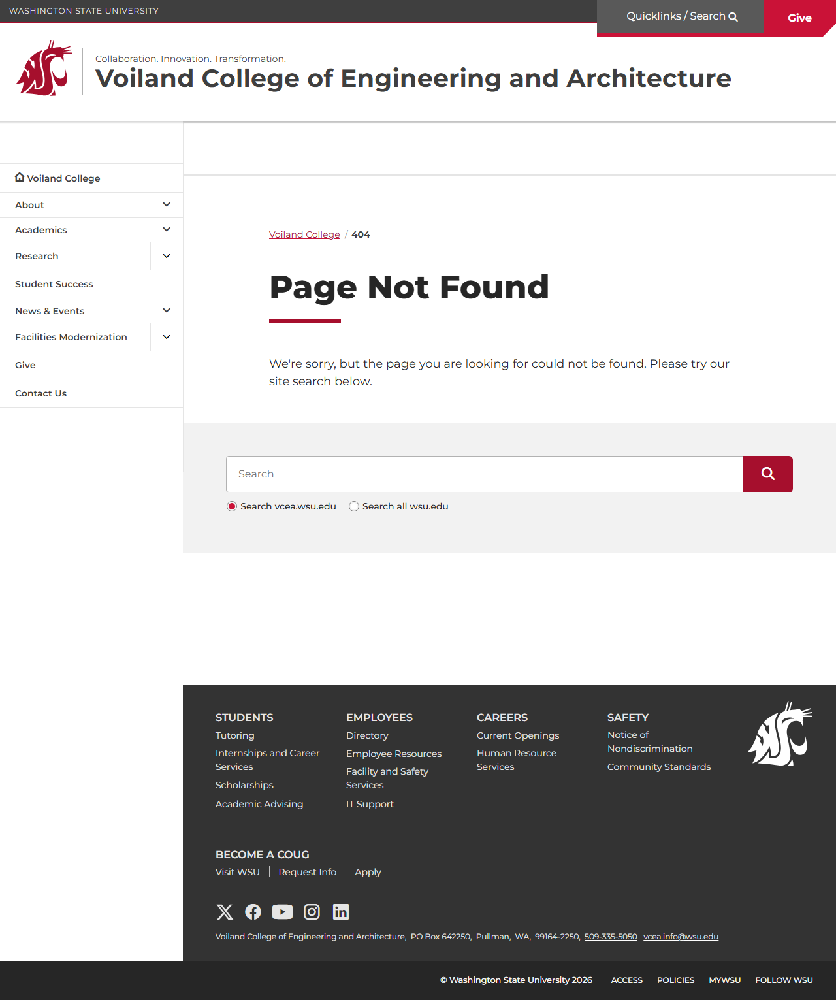

#### [/contact/](vcea-wsu-edu/contact/report.md)

#### [/departments/](vcea-wsu-edu/departments/report.md)

#### [/graduate/](vcea-wsu-edu/graduate/report.md)

#### [/research/](vcea-wsu-edu/research/report.md)

#### [/undergraduate/](vcea-wsu-edu/undergraduate/report.md)

### vetmed.wsu.edu

#### [/](vetmed-wsu-edu/_root/report.md)

#### [/about/](vetmed-wsu-edu/about/report.md)

#### [/admissions/](vetmed-wsu-edu/admissions/report.md)

#### [/contact/](vetmed-wsu-edu/contact/report.md)

#### [/education/](vetmed-wsu-edu/education/report.md)

#### [/research/](vetmed-wsu-edu/research/report.md)

#### [/services/](vetmed-wsu-edu/services/report.md)

### visitor.wsu.edu

#### [/](visitor-wsu-edu/_root/report.md)

#### [/accommodations/](visitor-wsu-edu/accommodations/report.md)

#### [/contact/](visitor-wsu-edu/contact/report.md)

#### [/dining/](visitor-wsu-edu/dining/report.md)

#### [/plan-visit/](visitor-wsu-edu/plan-visit/report.md)

#### [/tours/](visitor-wsu-edu/tours/report.md)

### web.wsu.edu

#### [/](web-wsu-edu/_root/report.md)

#### [/contact/](web-wsu-edu/contact/report.md)

#### [/request/](web-wsu-edu/request/report.md)

#### [/resources/](web-wsu-edu/resources/report.md)

#### [/services/](web-wsu-edu/services/report.md)

#### [/training/](web-wsu-edu/training/report.md)

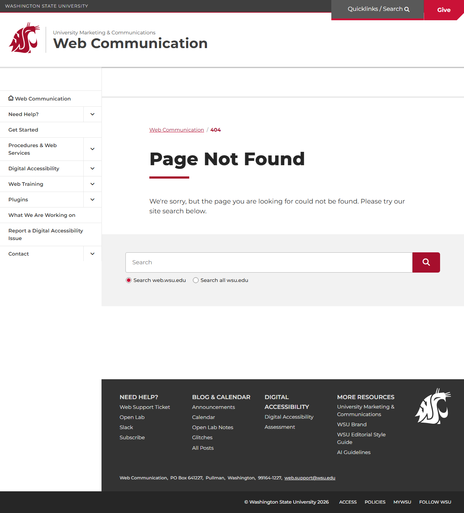

### workday.wsu.edu

#### [/](workday-wsu-edu/_root/report.md)

#### [/help/](workday-wsu-edu/help/report.md)

#### [/resources/](workday-wsu-edu/resources/report.md)

#### [/training/](workday-wsu-edu/training/report.md)

### wpcdn.web.wsu.edu

#### [/](wpcdn-web-wsu-edu/_root/report.md)

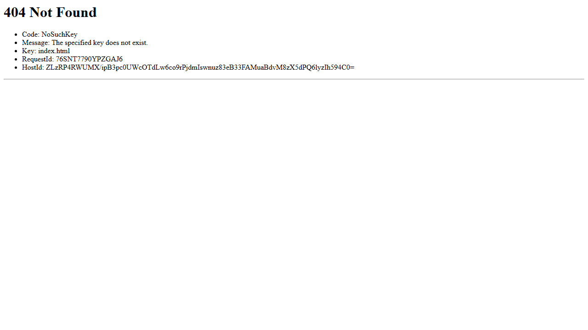

### wsu.edu

#### [/](wsu-edu/_root/report.md)

#### [/about/](wsu-edu/about/report.md)

#### [/about/accolades/](wsu-edu/about_accolades/report.md)

#### [/about/facts/](wsu-edu/about_facts/report.md)

#### [/about/land-acknowledgement/](wsu-edu/about_land-acknowledgement/report.md)

#### [/about/leadership/](wsu-edu/about_leadership/report.md)

#### [/about/statewide-impact/](wsu-edu/about_statewide-impact/report.md)

#### [/academics/](wsu-edu/academics/report.md)

#### [/admission/](wsu-edu/admission/report.md)

#### [/admissions/](wsu-edu/admissions/report.md)

#### [/admissions/affordability/](wsu-edu/admissions_affordability/report.md)

#### [/athletics/](wsu-edu/athletics/report.md)

#### [/campuses/](wsu-edu/campuses/report.md)

#### [/jobs/](wsu-edu/jobs/report.md)

#### [/request-info/](wsu-edu/request-info/report.md)

#### [/research/](wsu-edu/research/report.md)

### wsuacada.wsu.edu

#### [/](wsuacada-wsu-edu/_root/report.md)

#### [/about/](wsuacada-wsu-edu/about/report.md)

#### [/contact/](wsuacada-wsu-edu/contact/report.md)

#### [/events/](wsuacada-wsu-edu/events/report.md)

#### [/membership/](wsuacada-wsu-edu/membership/report.md)

#### [/resources/](wsuacada-wsu-edu/resources/report.md)

### zzusis-utilities.wsu.edu

#### [/](zzusis-utilities-wsu-edu/_root/report.md)

## Failed Pages

- **aapi.wsu.edu/** — HTTP 0
  - `Timeout 30000ms exceeded.
Call log:
  - taking page screenshot
  - waiting for fonts to load...`
- **aapi.wsu.edu/about/** — HTTP 404
- **aapi.wsu.edu/programs/** — HTTP 0
- **aapi.wsu.edu/events/** — HTTP 404
- **aapi.wsu.edu/resources/** — HTTP 0
- **aapi.wsu.edu/contact/** — HTTP 404
- **aastudentcenter.wsu.edu/** — HTTP 0
  - `Timeout 30000ms exceeded.
Call log:
  - taking page screenshot
  - waiting for fonts to load...`
- **aastudentcenter.wsu.edu/about/** — HTTP 404
- **aastudentcenter.wsu.edu/programs/** — HTTP 404
- **aastudentcenter.wsu.edu/events/** — HTTP 404
- **aastudentcenter.wsu.edu/resources/** — HTTP 0
  - `Timeout 30000ms exceeded.
Call log:
  - taking page screenshot
  - waiting for fonts to load...`
- **aastudentcenter.wsu.edu/get-involved/** — HTTP 0
  - `Timeout 30000ms exceeded.
Call log:
  - taking page screenshot
  - waiting for fonts to load...`
- **access.wsu.edu/** — HTTP 0
- **access.wsu.edu/policy/** — HTTP 0
- **access.wsu.edu/digital-accessibility/** — HTTP 0
- **access.wsu.edu/resources/** — HTTP 0
- **access.wsu.edu/contact/** — HTTP 0
- **accesscenter.wsu.edu/** — HTTP 0
  - `Timeout 30000ms exceeded.
Call log:
  - taking page screenshot
  - waiting for fonts to load...`
- **accesscenter.wsu.edu/services/** — HTTP 0
- **accesscenter.wsu.edu/students/** — HTTP 0
- **accesscenter.wsu.edu/faculty/** — HTTP 0
- **account.wsu.edu/** — HTTP 0
  - `Timeout 30000ms exceeded.
Call log:
  - taking page screenshot
  - waiting for fonts to load...
  - fonts loaded`
- **account.wsu.edu/services/** — HTTP 0
  - `Execution context was destroyed, most likely because of a navigation`
- **account.wsu.edu/password-reset/** — HTTP 0
- **account.wsu.edu/security/** — HTTP 0
- **account.wsu.edu/help/** — HTTP 0
- **accreditation.wsu.edu/** — HTTP 0
- **accreditation.wsu.edu/about/** — HTTP 0
- **accreditation.wsu.edu/standards/** — HTTP 0
- **accreditation.wsu.edu/documents/** — HTTP 0
- **accreditation.wsu.edu/timeline/** — HTTP 0
- **accreditation.wsu.edu/contact/** — HTTP 0
- **acctspay.wsu.edu/** — HTTP 0
- **acctspay.wsu.edu/forms/** — HTTP 0
- **acctspay.wsu.edu/policies/** — HTTP 0
- **acctspay.wsu.edu/contact/** — HTTP 0
- **acctspay.wsu.edu/travel/** — HTTP 0
- **acctspay.wsu.edu/purchasing/** — HTTP 0
- **ace.wsu.edu/** — HTTP 0
- **ace.wsu.edu/assessment/** — HTTP 0
- **ace.wsu.edu/accreditation/** — HTTP 0
- **ace.wsu.edu/reporting/** — HTTP 0
- **ace.wsu.edu/resources/** — HTTP 0
- **ace.wsu.edu/contact/** — HTTP 0
- **adarp.wsu.edu/** — HTTP 0
- **adarp.wsu.edu/research/** — HTTP 0
- **adarp.wsu.edu/projects/** — HTTP 0
- **adarp.wsu.edu/publications/** — HTTP 0
- **adarp.wsu.edu/about/** — HTTP 0
- **adarp.wsu.edu/contact/** — HTTP 0
- **admission.wsu.edu/** — HTTP 0
- **admission.wsu.edu/apply/** — HTTP 0
- **admission.wsu.edu/visit/** — HTTP 0
- **admission.wsu.edu/freshman/** — HTTP 0
- **admission.wsu.edu/transfer/** — HTTP 0
- **admission.wsu.edu/costs-aid/** — HTTP 404
- **advance.wsu.edu/** — HTTP 0
- **advance.wsu.edu/about/** — HTTP 0
- **advance.wsu.edu/programs/** — HTTP 0
- **advance.wsu.edu/resources/** — HTTP 0
- **advance.wsu.edu/events/** — HTTP 0
- **advance.wsu.edu/data/** — HTTP 0
- **advising.wsu.edu/** — HTTP 0
- **advising.wsu.edu/students/** — HTTP 0
- **advising.wsu.edu/advisors/** — HTTP 0
- **advising.wsu.edu/resources/** — HTTP 0
- **advising.wsu.edu/appointments/** — HTTP 0
- **advising.wsu.edu/policies/** — HTTP 0
- **afrotc.wsu.edu/** — HTTP 0
- **afrotc.wsu.edu/about/** — HTTP 0
- **afrotc.wsu.edu/admissions/** — HTTP 0
- **afrotc.wsu.edu/academics/** — HTTP 0
- **afrotc.wsu.edu/scholarships/** — HTTP 0
- **afrotc.wsu.edu/contact/** — HTTP 0
- **afs.wsu.edu/** — HTTP 0
- **afs.wsu.edu/research/** — HTTP 0
- **afs.wsu.edu/programs/** — HTTP 0
- **afs.wsu.edu/people/** — HTTP 0
- **afs.wsu.edu/publications/** — HTTP 0
- **afs.wsu.edu/news/** — HTTP 0
- **afw.wsu.edu/** — HTTP 0
- **afw.wsu.edu/about/** — HTTP 0
- **afw.wsu.edu/membership/** — HTTP 0
- **afw.wsu.edu/events/** — HTTP 405
- **afw.wsu.edu/resources/** — HTTP 0
- **afw.wsu.edu/contact/** — HTTP 0
- **alert.wsu.edu/** — HTTP 0
- **alert.wsu.edu/emergency-info/** — HTTP 0
- **alert.wsu.edu/signup/** — HTTP 0
- **alert.wsu.edu/procedures/** — HTTP 0
- **alert.wsu.edu/resources/** — HTTP 0
- **alumni.wsu.edu/** — HTTP 0
- **alumni.wsu.edu/events/** — HTTP 0
- **alumni.wsu.edu/giving/** — HTTP 0
- **alumni.wsu.edu/chapters/** — HTTP 0
- **alumni.wsu.edu/contact/** — HTTP 0
- **amdt.wsu.edu/** — HTTP 0
- **amdt.wsu.edu/about/** — HTTP 0
- **amdt.wsu.edu/programs/** — HTTP 0
- **amdt.wsu.edu/faculty/** — HTTP 0
- **amdt.wsu.edu/admissions/** — HTTP 0
- **amdt.wsu.edu/contact/** — HTTP 0
- **ansci.wsu.edu/** — HTTP 0
- **ansci.wsu.edu/about/** — HTTP 0
- **ansci.wsu.edu/undergraduate/** — HTTP 0
- **ansci.wsu.edu/graduate/** — HTTP 0
- **ansci.wsu.edu/research/** — HTTP 0
- **ansci.wsu.edu/faculty/** — HTTP 0
- **ansci.wsu.edu/contact/** — HTTP 0
- **anthro.wsu.edu/** — HTTP 0
- **anthro.wsu.edu/about/** — HTTP 0
- **anthro.wsu.edu/undergraduate/** — HTTP 0
- **anthro.wsu.edu/graduate/** — HTTP 0
- **anthro.wsu.edu/faculty/** — HTTP 0
- **anthro.wsu.edu/research/** — HTTP 0
- **aoi.wsu.edu/** — HTTP 0
- **aoi.wsu.edu/about/** — HTTP 0
- **aoi.wsu.edu/programs/** — HTTP 0
- **aoi.wsu.edu/partnerships/** — HTTP 0
- **aoi.wsu.edu/resources/** — HTTP 0
- **aoi.wsu.edu/contact/** — HTTP 0
- **apac.wsu.edu/** — HTTP 0
- **apac.wsu.edu/about/** — HTTP 0
- **apac.wsu.edu/membership/** — HTTP 0
- **apac.wsu.edu/meetings/** — HTTP 0
- **apac.wsu.edu/resources/** — HTTP 0
- **apac.wsu.edu/contact/** — HTTP 0
- **arboretum.wsu.edu/** — HTTP 403
- **arboretum.wsu.edu/about/** — HTTP 403
- **arboretum.wsu.edu/visit/** — HTTP 0
- **arboretum.wsu.edu/collections/** — HTTP 403
- **arboretum.wsu.edu/events/** — HTTP 403
- **arboretum.wsu.edu/contact/** — HTTP 403
- **archaeology.wsu.edu/** — HTTP 0
- **archaeology.wsu.edu/collections/** — HTTP 0
- **archaeology.wsu.edu/exhibits/** — HTTP 0
- **archaeology.wsu.edu/visit/** — HTTP 0
- **archaeology.wsu.edu/education/** — HTTP 0
- **archaeology.wsu.edu/research/** — HTTP 0
- **ascc.wsu.edu/** — HTTP 0
- **ascc.wsu.edu/academic-success/** — HTTP 0
- **ascc.wsu.edu/career-services/** — HTTP 0
- **ascc.wsu.edu/appointments/** — HTTP 0
- **ascc.wsu.edu/resources/** — HTTP 0
- **ascc.wsu.edu/contact/** — HTTP 404
- **asce.wsu.edu/** — HTTP 0
- **asce.wsu.edu/about/** — HTTP 0
- **asce.wsu.edu/events/** — HTTP 0
- **asce.wsu.edu/competitions/** — HTTP 0
- **asce.wsu.edu/membership/** — HTTP 0
- **asce.wsu.edu/contact/** — HTTP 0
- **askdruniverse.wsu.edu/** — HTTP 0
- **askdruniverse.wsu.edu/about/** — HTTP 0
- **askdruniverse.wsu.edu/ask-question/** — HTTP 0
- **askdruniverse.wsu.edu/questions/** — HTTP 0
- **askdruniverse.wsu.edu/resources/** — HTTP 0
- **asl.wsu.edu/** — HTTP 0
- **asl.wsu.edu/about/** — HTTP 0
- **asl.wsu.edu/research/** — HTTP 0
- **asl.wsu.edu/facilities/** — HTTP 0
- **asl.wsu.edu/publications/** — HTTP 0
- **asl.wsu.edu/contact/** — HTTP 0
- **aswsu.wsu.edu/** — HTTP 0
  - `Timeout 30000ms exceeded.
Call log:
  - taking page screenshot
  - waiting for fonts to load...
  - fonts loaded`
- **aswsu.wsu.edu/about/** — HTTP 0
  - `Timeout 30000ms exceeded.
Call log:
  - taking page screenshot
  - waiting for fonts to load...
  - fonts loaded`
- **aswsu.wsu.edu/senate/** — HTTP 0
  - `Timeout 30000ms exceeded.
Call log:
  - taking page screenshot
  - waiting for fonts to load...
  - fonts loaded`
- **aswsu.wsu.edu/services/** — HTTP 0
- **aswsu.wsu.edu/get-involved/** — HTTP 0
- **aswsu.wsu.edu/contact/** — HTTP 404
- **atg.wsu.edu/** — HTTP 0
- **atg.wsu.edu/services/** — HTTP 0
- **atg.wsu.edu/resources/** — HTTP 0
- **atg.wsu.edu/compliance/** — HTTP 0
- **atg.wsu.edu/contact/** — HTTP 0
- **brand.wsu.edu/** — HTTP 0
- **brand.wsu.edu/visual-identity/** — HTTP 0
- **brand.wsu.edu/logos/** — HTTP 0
- **brand.wsu.edu/colors/** — HTTP 0
- **brand.wsu.edu/typography/** — HTTP 0
- **brand.wsu.edu/templates/** — HTTP 0
- **brand.wsu.edu/downloads/** — HTTP 0
- **bursar.wsu.edu/** — HTTP 0
- **bursar.wsu.edu/billing/** — HTTP 0
- **bursar.wsu.edu/payment/** — HTTP 0
- **bursar.wsu.edu/refunds/** — HTTP 0
- **bursar.wsu.edu/policies/** — HTTP 0
- **bursar.wsu.edu/contact/** — HTTP 0
- **business.wsu.edu/** — HTTP 0
- **business.wsu.edu/about/** — HTTP 0
  - `Timeout 30000ms exceeded.
Call log:
  - taking page screenshot
  - waiting for fonts to load...`
- **business.wsu.edu/programs/** — HTTP 0
- **business.wsu.edu/undergraduate/** — HTTP 0
- **business.wsu.edu/graduate/** — HTTP 0
- **business.wsu.edu/faculty/** — HTTP 405
- **business.wsu.edu/admissions/** — HTTP 404
- **cahnrs.wsu.edu/** — HTTP 0
- **cahnrs.wsu.edu/about/** — HTTP 0
- **cahnrs.wsu.edu/academics/** — HTTP 0
- **cahnrs.wsu.edu/research/** — HTTP 0
- **cahnrs.wsu.edu/extension/** — HTTP 0
- **cahnrs.wsu.edu/contact/** — HTTP 404
- **campusvet.wsu.edu/** — HTTP 0
- **campusvet.wsu.edu/animal-care/** — HTTP 0
  - `Download is starting
Call log:
  - navigating to "https://campusvet.wsu.edu/animal-care/", waiting until "networkidle"`
- **campusvet.wsu.edu/compliance/** — HTTP 0
- **campusvet.wsu.edu/training/** — HTTP 0
- **campusvet.wsu.edu/resources/** — HTTP 0
- **campusvet.wsu.edu/contact/** — HTTP 0
- **cas.wsu.edu/** — HTTP 0
- **cas.wsu.edu/about/** — HTTP 0
- **cas.wsu.edu/departments/** — HTTP 0
- **cas.wsu.edu/programs/** — HTTP 0
- **cas.wsu.edu/research/** — HTTP 0
- **cas.wsu.edu/news/** — HTTP 0
- **catalog.wsu.edu/** — HTTP 0
- **catalog.wsu.edu/programs/** — HTTP 404
- **catalog.wsu.edu/courses/** — HTTP 0
- **catalog.wsu.edu/academic-regulations/** — HTTP 404
- **catalog.wsu.edu/general-requirements/** — HTTP 404
- **ccr.wsu.edu/** — HTTP 0
- **ccr.wsu.edu/policies/** — HTTP 0
- **ccr.wsu.edu/reporting/** — HTTP 0
- **ccr.wsu.edu/resources/** — HTTP 0
- **ccr.wsu.edu/training/** — HTTP 0
- **ccr.wsu.edu/contact/** — HTTP 0
- **ceshs.wsu.edu/** — HTTP 0
- **ceshs.wsu.edu/about/** — HTTP 0
- **ceshs.wsu.edu/programs/** — HTTP 0
- **ceshs.wsu.edu/research/** — HTTP 0
- **ceshs.wsu.edu/faculty/** — HTTP 0
- **ceshs.wsu.edu/contact/** — HTTP 0
- **chemistry.wsu.edu/** — HTTP 0
- **chemistry.wsu.edu/about/** — HTTP 0
- **chemistry.wsu.edu/undergraduate/** — HTTP 0
- **chemistry.wsu.edu/graduate/** — HTTP 0
- **chemistry.wsu.edu/research/** — HTTP 0
- **chemistry.wsu.edu/faculty/** — HTTP 0
- **chemistry.wsu.edu/facilities/** — HTTP 0
- **commencement.wsu.edu/** — HTTP 0
- **commencement.wsu.edu/ceremony-info/** — HTTP 0
- **commencement.wsu.edu/tickets/** — HTTP 0
- **commencement.wsu.edu/regalia/** — HTTP 0
- **commencement.wsu.edu/resources/** — HTTP 0
- **commencement.wsu.edu/contact/** — HTTP 0
- **communitystandards.wsu.edu/** — HTTP 0
  - `Timeout 30000ms exceeded.
Call log:
  - taking page screenshot
  - waiting for fonts to load...
  - fonts loaded`
- **communitystandards.wsu.edu/conduct-process/** — HTTP 0
- **communitystandards.wsu.edu/policies/** — HTTP 404
- **communitystandards.wsu.edu/resources/** — HTTP 0
  - `Timeout 30000ms exceeded.
Call log:
  - taking page screenshot
  - waiting for fonts to load...`
- **communitystandards.wsu.edu/for-students/** — HTTP 404
- **communitystandards.wsu.edu/contact/** — HTTP 404
- **cougarcard.wsu.edu/** — HTTP 0
  - `Timeout 30000ms exceeded.
Call log:
  - taking page screenshot
  - waiting for fonts to load...
  - fonts loaded`
- **cougarcard.wsu.edu/services/** — HTTP 0
- **cougarcard.wsu.edu/get-card/** — HTTP 0
  - `Timeout 30000ms exceeded.
Call log:
  - taking page screenshot
  - waiting for fonts to load...`
- **cougarcard.wsu.edu/add-funds/** — HTTP 0
- **cougarcard.wsu.edu/lost-stolen/** — HTTP 0
- **cougarcard.wsu.edu/contact/** — HTTP 404
- **degrees.wsu.edu/** — HTTP 0
- **degrees.wsu.edu/search/** — HTTP 0
- **degrees.wsu.edu/undergraduate/** — HTTP 0
- **degrees.wsu.edu/graduate/** — HTTP 0
- **degrees.wsu.edu/online/** — HTTP 0
- **degrees.wsu.edu/professional/** — HTTP 0
- **dining.wsu.edu/** — HTTP 0
  - `Timeout 30000ms exceeded.
Call log:
  - taking page screenshot
  - waiting for fonts to load...`
- **dining.wsu.edu/locations/** — HTTP 0
- **dining.wsu.edu/meal-plans/** — HTTP 0
  - `Timeout 30000ms exceeded.
Call log:
  - taking page screenshot
  - waiting for fonts to load...`
- **dining.wsu.edu/menus/** — HTTP 0
- **dining.wsu.edu/nutrition/** — HTTP 0
- **dining.wsu.edu/contact/** — HTTP 404
- **diversity.wsu.edu/** — HTTP 0
- **diversity.wsu.edu/about/** — HTTP 0
- **diversity.wsu.edu/programs/** — HTTP 0
- **diversity.wsu.edu/resources/** — HTTP 0
- **education.wsu.edu/** — HTTP 0
- **education.wsu.edu/about/** — HTTP 0
- **education.wsu.edu/programs/** — HTTP 0
- **education.wsu.edu/undergraduate/** — HTTP 0
- **education.wsu.edu/graduate/** — HTTP 0
- **education.wsu.edu/faculty/** — HTTP 0
- **ehs.wsu.edu/** — HTTP 0
- **ehs.wsu.edu/services/** — HTTP 0
- **ehs.wsu.edu/training/** — HTTP 0
  - `Download is starting
Call log:
  - navigating to "https://ehs.wsu.edu/training/", waiting until "networkidle"`
- **ehs.wsu.edu/compliance/** — HTTP 0
- **ehs.wsu.edu/resources/** — HTTP 0
- **ehs.wsu.edu/contact/** — HTTP 0
- **em.wsu.edu/** — HTTP 0
- **em.wsu.edu/eit/** — HTTP 0
- **em.wsu.edu/re411/** — HTTP 0
- **em.wsu.edu/rr411/** — HTTP 0
- **email.wsu.edu/** — HTTP 0
  - `Unable to retrieve content because the page is navigating and changing the content.`
- **email.wsu.edu/access/** — HTTP 0
- **email.wsu.edu/help/** — HTTP 0
- **email.wsu.edu/policies/** — HTTP 0
  - `Execution context was destroyed, most likely because of a navigation`
- **email.wsu.edu/resources/** — HTTP 0
- **english.wsu.edu/** — HTTP 0
- **english.wsu.edu/about/** — HTTP 0
- **english.wsu.edu/undergraduate/** — HTTP 0
- **english.wsu.edu/graduate/** — HTTP 0
- **english.wsu.edu/creative-writing/** — HTTP 0
- **english.wsu.edu/faculty/** — HTTP 0
- **events.wsu.edu/** — HTTP 0
- **events.wsu.edu/calendar/** — HTTP 0
- **events.wsu.edu/submit-event/** — HTTP 0
- **events.wsu.edu/categories/** — HTTP 0
- **everett.wsu.edu/** — HTTP 0
- **everett.wsu.edu/about/** — HTTP 0
- **everett.wsu.edu/academics/** — HTTP 0
- **extension.wsu.edu/** — HTTP 0
- **extension.wsu.edu/programs/** — HTTP 0
- **extension.wsu.edu/counties/** — HTTP 0
- **extension.wsu.edu/resources/** — HTTP 0
- **extension.wsu.edu/publications/** — HTTP 0
- **extension.wsu.edu/contact/** — HTTP 0
- **facsen.wsu.edu/** — HTTP 0
- **facsen.wsu.edu/about/** — HTTP 0
- **facsen.wsu.edu/meetings/** — HTTP 0
- **facsen.wsu.edu/committees/** — HTTP 0
- **facsen.wsu.edu/documents/** — HTTP 0
- **facsen.wsu.edu/contact/** — HTTP 404
- **financialaid.wsu.edu/** — HTTP 0
- **financialaid.wsu.edu/apply/** — HTTP 0
- **financialaid.wsu.edu/types-of-aid/** — HTTP 0
- **financialaid.wsu.edu/eligibility/** — HTTP 0
- **financialaid.wsu.edu/resources/** — HTTP 0
- **financialaid.wsu.edu/contact/** — HTTP 0
- **foundation.wsu.edu/** — HTTP 0
- **foundation.wsu.edu/give/** — HTTP 0
- **foundation.wsu.edu/ways-to-give/** — HTTP 0
- **foundation.wsu.edu/impact/** — HTTP 0
- **foundation.wsu.edu/contact/** — HTTP 0
- **genacct.wsu.edu/** — HTTP 0
- **genacct.wsu.edu/services/** — HTTP 0
- **genacct.wsu.edu/forms/** — HTTP 0
- **genacct.wsu.edu/policies/** — HTTP 0
- **genacct.wsu.edu/resources/** — HTTP 0
- **genacct.wsu.edu/contact/** — HTTP 0
- **gis.wsu.edu/** — HTTP 0
- **gis.wsu.edu/services/** — HTTP 0
- **gis.wsu.edu/data/** — HTTP 0
- **gis.wsu.edu/resources/** — HTTP 0
- **gis.wsu.edu/training/** — HTTP 0
- **gis.wsu.edu/contact/** — HTTP 0
- **go.wsu.edu/** — HTTP 0
- **go.wsu.edu/about/** — HTTP 0
- **go.wsu.edu/create/** — HTTP 404
- **go.wsu.edu/manage/** — HTTP 404
- **gradschool.wsu.edu/** — HTTP 0
- **gradschool.wsu.edu/admissions/** — HTTP 0
- **gradschool.wsu.edu/programs/** — HTTP 0
- **gradschool.wsu.edu/current-students/** — HTTP 0
- **gradschool.wsu.edu/funding/** — HTTP 0
- **gradschool.wsu.edu/policies/** — HTTP 0
  - `Download is starting
Call log:
  - navigating to "https://gradschool.wsu.edu/policies/", waiting until "networkidle"`
- **gradschool.wsu.edu/contact/** — HTTP 0
- **history.wsu.edu/** — HTTP 0
  - `Timeout 30000ms exceeded.
Call log:
  - taking page screenshot
  - waiting for fonts to load...
  - fonts loaded`
- **history.wsu.edu/about/** — HTTP 0
- **history.wsu.edu/undergraduate/** — HTTP 0
- **history.wsu.edu/graduate/** — HTTP 0
- **history.wsu.edu/faculty/** — HTTP 0
- **history.wsu.edu/research/** — HTTP 0
- **honors.wsu.edu/** — HTTP 0
- **honors.wsu.edu/about/** — HTTP 0
- **honors.wsu.edu/admissions/** — HTTP 0
- **honors.wsu.edu/programs/** — HTTP 0
- **honors.wsu.edu/current-students/** — HTTP 0
- **honors.wsu.edu/faculty/** — HTTP 0
- **honors.wsu.edu/contact/** — HTTP 0
- **housing.wsu.edu/** — HTTP 0
  - `Timeout 30000ms exceeded.
Call log:
  - taking page screenshot
  - waiting for fonts to load...
  - fonts loaded`
- **housing.wsu.edu/prospective-students/** — HTTP 0
- **housing.wsu.edu/prospective-students/first-year-students/** — HTTP 0
- **housing.wsu.edu/prospective-students/transfer-students/** — HTTP 0
- **hrs.wsu.edu/** — HTTP 0
- **hrs.wsu.edu/employment/** — HTTP 0
- **hrs.wsu.edu/benefits/** — HTTP 0
- **hrs.wsu.edu/policies/** — HTTP 0
- **hrs.wsu.edu/training/** — HTTP 0
- **hub.wsu.edu/** — HTTP 0
- **hub.wsu.edu/organizations/** — HTTP 0
- **hub.wsu.edu/events/** — HTTP 0
- **hub.wsu.edu/resources/** — HTTP 0
- **hub.wsu.edu/leadership/** — HTTP 0
- **index.wsu.edu/** — HTTP 0
- **index.wsu.edu/?c=A** — HTTP 0
- **index.wsu.edu/?c=B** — HTTP 0
- **index.wsu.edu/?c=C** — HTTP 0
- **index.wsu.edu/?c=D** — HTTP 0
- **index.wsu.edu/?c=E** — HTTP 0
- **ip.wsu.edu/** — HTTP 0
- **ip.wsu.edu/study-abroad/** — HTTP 0
- **ip.wsu.edu/international-students/** — HTTP 0
- **ip.wsu.edu/programs/** — HTTP 0
- **ip.wsu.edu/resources/** — HTTP 0
- **ip.wsu.edu/contact/** — HTTP 0
- **its.wsu.edu/** — HTTP 0
- **its.wsu.edu/about-its/** — HTTP 0
- **its.wsu.edu/about-its/its-leadership-team/** — HTTP 0
- **its.wsu.edu/about-its/its-informational-series/** — HTTP 0
- **its.wsu.edu/about-its/accreditation-submission-introduction-2025/** — HTTP 0
- **its.wsu.edu/crimson-service-desk/** — HTTP 0
- **li.wsu.edu/** — HTTP 0
- **li.wsu.edu/services/** — HTTP 0
- **li.wsu.edu/technology/** — HTTP 0
- **li.wsu.edu/resources/** — HTTP 0
- **li.wsu.edu/support/** — HTTP 0
- **li.wsu.edu/contact/** — HTTP 0
- **libraries.wsu.edu/** — HTTP 0
- **libraries.wsu.edu/about/** — HTTP 0
- **libraries.wsu.edu/contact/** — HTTP 0
- **libraries.wsu.edu/hours/** — HTTP 0
- **libraries.wsu.edu/spaces/** — HTTP 0
- **libraries.wsu.edu/about/departments/** — HTTP 0
- **libraries.wsu.edu/directory/** — HTTP 0
- **libraries.wsu.edu/library-map/** — HTTP 0
- **lists.wsu.edu/** — HTTP 0
- **lists.wsu.edu/help/** — HTTP 404
- **lists.wsu.edu/subscribe/** — HTTP 404
- **lists.wsu.edu/manage/** — HTTP 404
- **livingat.wsu.edu/** — HTTP 0
  - `Timeout 30000ms exceeded.
Call log:
  - taking page screenshot
  - waiting for fonts to load...
  - fonts loaded`
- **livingat.wsu.edu/reshall/** — HTTP 0
- **livingat.wsu.edu/ssa/** — HTTP 0
- **maps.wsu.edu/** — HTTP 0
  - `Timeout 30000ms exceeded.
Call log:
  - taking page screenshot
  - waiting for fonts to load...
  - fonts loaded`
- **maps.wsu.edu/pullman/** — HTTP 0
- **maps.wsu.edu/spokane/** — HTTP 0
- **maps.wsu.edu/tricities/** — HTTP 0
- **maps.wsu.edu/vancouver/** — HTTP 0
- **maps.wsu.edu/everett/** — HTTP 0
- **math.wsu.edu/** — HTTP 0
- **math.wsu.edu/about/** — HTTP 0
- **math.wsu.edu/undergraduate/** — HTTP 0
- **math.wsu.edu/graduate/** — HTTP 0
- **math.wsu.edu/faculty/** — HTTP 0
- **math.wsu.edu/research/** — HTTP 0
- **medicine.wsu.edu/** — HTTP 0
- **medicine.wsu.edu/about/** — HTTP 0
- **medicine.wsu.edu/admissions/** — HTTP 0
- **medicine.wsu.edu/education/** — HTTP 0
- **medicine.wsu.edu/research/** — HTTP 0
- **medicine.wsu.edu/contact/** — HTTP 404
- **murrow.wsu.edu/** — HTTP 0
- **murrow.wsu.edu/about/** — HTTP 0
- **murrow.wsu.edu/undergraduate/** — HTTP 0
- **murrow.wsu.edu/programs/** — HTTP 404
- **museum.wsu.edu/** — HTTP 0
- **museum.wsu.edu/visit/** — HTTP 0
- **museum.wsu.edu/exhibitions/** — HTTP 0
- **museum.wsu.edu/collections/** — HTTP 0
- **museum.wsu.edu/events/** — HTTP 405
- **my.wsu.edu/** — HTTP 0
- **my.wsu.edu/help/** — HTTP 0
- **my.wsu.edu/services/** — HTTP 0
- **native.wsu.edu/** — HTTP 0
- **native.wsu.edu/about/** — HTTP 0
- **native.wsu.edu/students/** — HTTP 0
- **native.wsu.edu/programs/** — HTTP 0
- **native.wsu.edu/resources/** — HTTP 0
- **native.wsu.edu/contact/** — HTTP 0
- **news.wsu.edu/** — HTTP 0
- **news.wsu.edu/press-releases/** — HTTP 0
- **news.wsu.edu/news/** — HTTP 0
- **news.wsu.edu/stories/** — HTTP 0
- **news.wsu.edu/media-contacts/** — HTTP 0
- **news.wsu.edu/submit-news/** — HTTP 0
- **nursing.wsu.edu/** — HTTP 0
- **nursing.wsu.edu/about/** — HTTP 0
- **nursing.wsu.edu/programs/** — HTTP 0
- **nursing.wsu.edu/admissions/** — HTTP 0
- **nursing.wsu.edu/students/** — HTTP 0
- **nursing.wsu.edu/faculty/** — HTTP 0
- **nursing.wsu.edu/contact/** — HTTP 0
- **office365.wsu.edu/** — HTTP 0
- **office365.wsu.edu/services/** — HTTP 0
- **office365.wsu.edu/help/** — HTTP 0
- **office365.wsu.edu/training/** — HTTP 0
- **online.wsu.edu/** — HTTP 0
- **online.wsu.edu/programs/** — HTTP 0
- **online.wsu.edu/admissions/** — HTTP 0
- **online.wsu.edu/current-students/** — HTTP 0
- **online.wsu.edu/resources/** — HTTP 0
- **online.wsu.edu/contact/** — HTTP 0
- **orc.wsu.edu/** — HTTP 0
  - `Timeout 30000ms exceeded.
Call log:
  - taking page screenshot
  - waiting for fonts to load...
  - fonts loaded`
- **orc.wsu.edu/about/** — HTTP 0
  - `Timeout 30000ms exceeded.
Call log:
  - taking page screenshot
  - waiting for fonts to load...`
- **orc.wsu.edu/rentals/** — HTTP 0
  - `Timeout 30000ms exceeded.
Call log:
  - taking page screenshot
  - waiting for fonts to load...`
- **orc.wsu.edu/trips/** — HTTP 0
- **orc.wsu.edu/programs/** — HTTP 0
- **parking.wsu.edu/** — HTTP 0
  - `Timeout 30000ms exceeded.
Call log:
  - taking page screenshot
  - waiting for fonts to load...`
- **parking.wsu.edu/permits/** — HTTP 0
- **parking.wsu.edu/maps/** — HTTP 404
- **parking.wsu.edu/visitor-parking/** — HTTP 404
- **parking.wsu.edu/policies/** — HTTP 404
- **parking.wsu.edu/contact/** — HTTP 404
- **payroll.wsu.edu/** — HTTP 0
- **payroll.wsu.edu/services/** — HTTP 0
- **payroll.wsu.edu/forms/** — HTTP 0
- **payroll.wsu.edu/tax-information/** — HTTP 0
- **payroll.wsu.edu/resources/** — HTTP 0
- **payroll.wsu.edu/contact/** — HTTP 0
- **pharmacy.wsu.edu/** — HTTP 0
- **pharmacy.wsu.edu/about/** — HTTP 0
- **pharmacy.wsu.edu/programs/** — HTTP 0
- **pharmacy.wsu.edu/admissions/** — HTTP 0
- **pharmacy.wsu.edu/research/** — HTTP 0
- **physics.wsu.edu/** — HTTP 0
- **physics.wsu.edu/about/** — HTTP 0
- **physics.wsu.edu/undergraduate/** — HTTP 0
- **physics.wsu.edu/graduate/** — HTTP 0
- **physics.wsu.edu/research/** — HTTP 0
- **physics.wsu.edu/faculty/** — HTTP 0
- **physics.wsu.edu/astronomy/** — HTTP 0
- **policies.wsu.edu/** — HTTP 0
- **policies.wsu.edu/manuals/** — HTTP 0
- **policies.wsu.edu/search/** — HTTP 0
- **policies.wsu.edu/bppm/** — HTTP 0
- **policies.wsu.edu/about/** — HTTP 0
- **portal.wsu.edu/** — HTTP 0
- **portal.wsu.edu/help/** — HTTP 0
- **portal.wsu.edu/services/** — HTTP 0
- **president.wsu.edu/** — HTTP 0
- **president.wsu.edu/about/** — HTTP 0
- **president.wsu.edu/priorities/** — HTTP 0
- **president.wsu.edu/speeches/** — HTTP 0
- **president.wsu.edu/news/** — HTTP 0
- **president.wsu.edu/contact/** — HTTP 0
- **provost.wsu.edu/** — HTTP 0
- **provost.wsu.edu/about/** — HTTP 0
- **provost.wsu.edu/academic-affairs/** — HTTP 0
- **provost.wsu.edu/policies/** — HTTP 0
- **provost.wsu.edu/resources/** — HTTP 0
- **provost.wsu.edu/contact/** — HTTP 0
- **psychology.wsu.edu/** — HTTP 0
- **psychology.wsu.edu/about/** — HTTP 0
- **psychology.wsu.edu/undergraduate/** — HTTP 0
- **psychology.wsu.edu/graduate/** — HTTP 0
- **psychology.wsu.edu/research/** — HTTP 0
- **psychology.wsu.edu/faculty/** — HTTP 0
- **pullman.wsu.edu/** — HTTP 0
- **pullman.wsu.edu/about/** — HTTP 0
- **pullman.wsu.edu/academics/** — HTTP 0
- **pullman.wsu.edu/admissions/** — HTTP 0
- **pullman.wsu.edu/campus-life/** — HTTP 0
- **pullman.wsu.edu/contact/** — HTTP 0
- **registrar.wsu.edu/** — HTTP 0
- **registrar.wsu.edu/academic-calendar/** — HTTP 0
- **registrar.wsu.edu/sessions/** — HTTP 0
- **registrar.wsu.edu/academic-regulations/** — HTTP 0
  - `Timeout 30000ms exceeded.
Call log:
  - taking page screenshot
  - waiting for fonts to load...`
- **registrar.wsu.edu/contact-us/** — HTTP 0
- **registrar.wsu.edu/staff-forms/** — HTTP 0
- **registrar.wsu.edu/student-forms/** — HTTP 0
- **registrar.wsu.edu/how-to-videos/** — HTTP 0
- **registrar.wsu.edu/petitions/** — HTTP 0
- **registrar.wsu.edu/term-withdrawal/** — HTTP 0
- **registrar.wsu.edu/tuition-adjustments/** — HTTP 0
- **registrar.wsu.edu/grades-and-gpa/** — HTTP 0
- **registrar.wsu.edu/special-enrollment/** — HTTP 0
- **registrar.wsu.edu/change-of-campus/** — HTTP 0
- **research.wsu.edu/** — HTTP 0
- **research.wsu.edu/about/** — HTTP 0
- **research.wsu.edu/research-areas/** — HTTP 0
- **research.wsu.edu/funding/** — HTTP 0
- **research.wsu.edu/compliance/** — HTTP 0
- **research.wsu.edu/resources/** — HTTP 0
- **research.wsu.edu/contact/** — HTTP 0
- **rotc.wsu.edu/** — HTTP 0
- **rotc.wsu.edu/about/** — HTTP 0
- **rotc.wsu.edu/admissions/** — HTTP 0
- **rotc.wsu.edu/cadets/** — HTTP 0
- **rotc.wsu.edu/scholarships/** — HTTP 0
- **rotc.wsu.edu/contact/** — HTTP 0
- **s3.wp.wsu.edu/** — HTTP 403
- **schedules.wsu.edu/** — HTTP 0
  - `Timeout 30000ms exceeded.
Call log:
  - taking page screenshot
  - waiting for fonts to load...
  - fonts loaded`
- **schedules.wsu.edu/List/Pullman/** — HTTP 0
  - `Timeout 30000ms exceeded.
Call log:
  - taking page screenshot
  - waiting for fonts to load...`
- **schedules.wsu.edu/List/Spokane/** — HTTP 0
  - `Timeout 30000ms exceeded.
Call log:
  - taking page screenshot
  - waiting for fonts to load...`
- **schedules.wsu.edu/List/TriCities/** — HTTP 0
- **school.eecs.wsu.edu/** — HTTP 0
- **school.eecs.wsu.edu/about/** — HTTP 0
- **school.eecs.wsu.edu/undergraduate/** — HTTP 0
- **school.eecs.wsu.edu/graduate/** — HTTP 0
- **school.eecs.wsu.edu/research/** — HTTP 0
- **school.eecs.wsu.edu/faculty/** — HTTP 0
- **sdc.wsu.edu/** — HTTP 0
- **sdc.wsu.edu/about/** — HTTP 0
- **sdc.wsu.edu/programs/** — HTTP 0
- **sdc.wsu.edu/undergraduate/** — HTTP 0
- **sdc.wsu.edu/graduate/** — HTTP 0
  - `Download is starting
Call log:
  - navigating to "https://sdc.wsu.edu/graduate/", waiting until "networkidle"`
- **sdc.wsu.edu/faculty/** — HTTP 0
- **sdc.wsu.edu/contact/** — HTTP 0
- **slcr.wsu.edu/** — HTTP 0
- **slcr.wsu.edu/about/** — HTTP 0
- **slcr.wsu.edu/programs/** — HTTP 0
- **slcr.wsu.edu/courses/** — HTTP 0
- **slcr.wsu.edu/faculty/** — HTTP 0
- **slcr.wsu.edu/contact/** — HTTP 0
- **socialmedia.wsu.edu/** — HTTP 0
- **socialmedia.wsu.edu/directory/** — HTTP 0
- **socialmedia.wsu.edu/guidelines/** — HTTP 0
- **socialmedia.wsu.edu/resources/** — HTTP 0
- **socialmedia.wsu.edu/training/** — HTTP 0
- **spokane.wsu.edu/** — HTTP 0
- **spokane.wsu.edu/about/** — HTTP 0
- **spokane.wsu.edu/academics/** — HTTP 0
- **spokane.wsu.edu/admissions/** — HTTP 0
- **spokane.wsu.edu/student-services/** — HTTP 404
- **staff.storefront.wsu.edu/** — HTTP 0
- **staff.storefront.wsu.edu/services/** — HTTP 0
- **staff.storefront.wsu.edu/printing/** — HTTP 0
- **staff.storefront.wsu.edu/design/** — HTTP 0
- **studentaffairs.vancouver.wsu.edu/** — HTTP 0
- **studentaffairs.vancouver.wsu.edu/about/** — HTTP 0
- **studentaffairs.vancouver.wsu.edu/services/** — HTTP 0
- **studentaffairs.vancouver.wsu.edu/student-involvement/** — HTTP 0
- **studentaffairs.vancouver.wsu.edu/resources/** — HTTP 0
- **studentaffairs.vancouver.wsu.edu/contact/** — HTTP 403
- **studentaffairs.wsu.edu/** — HTTP 0
  - `Timeout 30000ms exceeded.
Call log:
  - taking page screenshot
  - waiting for fonts to load...
  - fonts loaded`
- **studentaffairs.wsu.edu/about/** — HTTP 404
- **studentaffairs.wsu.edu/departments/** — HTTP 404
- **studentaffairs.wsu.edu/resources/** — HTTP 0
- **studentaffairs.wsu.edu/policies/** — HTTP 0
- **studentaffairs.wsu.edu/contact/** — HTTP 404
- **studentcare.wsu.edu/** — HTTP 0
  - `Timeout 30000ms exceeded.
Call log:
  - taking page screenshot
  - waiting for fonts to load...
  - fonts loaded`
- **studentcare.wsu.edu/services/** — HTTP 0
- **studentcare.wsu.edu/resources/** — HTTP 404
- **studentcare.wsu.edu/submit-concern/** — HTTP 404
- **studentcare.wsu.edu/for-faculty-staff/** — HTTP 404
- **sustainability.wsu.edu/** — HTTP 0
- **sustainability.wsu.edu/about/** — HTTP 0
- **sustainability.wsu.edu/initiatives/** — HTTP 0
- **sustainability.wsu.edu/get-involved/** — HTTP 0
- **sustainability.wsu.edu/resources/** — HTTP 0
- **sustainability.wsu.edu/contact/** — HTTP 0
- **threatassessment.wsu.edu/** — HTTP 0
- **threatassessment.wsu.edu/about/** — HTTP 0
- **threatassessment.wsu.edu/report-concern/** — HTTP 0
- **threatassessment.wsu.edu/resources/** — HTTP 0
- **threatassessment.wsu.edu/contact/** — HTTP 0
- **transportation.wsu.edu/** — HTTP 0
- **transportation.wsu.edu/parking/** — HTTP 0
  - `Timeout 30000ms exceeded.
Call log:
  - taking page screenshot
  - waiting for fonts to load...`
- **transportation.wsu.edu/transit/** — HTTP 0
  - `Timeout 30000ms exceeded.
Call log:
  - taking page screenshot
  - waiting for fonts to load...`
- **transportation.wsu.edu/bike/** — HTTP 0
- **transportation.wsu.edu/policies/** — HTTP 0
- **transportation.wsu.edu/contact/** — HTTP 0
- **tricities.wsu.edu/** — HTTP 0
- **tricities.wsu.edu/about/** — HTTP 0
- **tricities.wsu.edu/academics/** — HTTP 0
- **urec.wsu.edu/** — HTTP 0
  - `Timeout 30000ms exceeded.
Call log:
  - taking page screenshot
  - waiting for fonts to load...`
- **urec.wsu.edu/facilities/** — HTTP 0
  - `Timeout 30000ms exceeded.
Call log:
  - taking page screenshot
  - waiting for fonts to load...`
- **urec.wsu.edu/programs/** — HTTP 0
  - `Timeout 30000ms exceeded.
Call log:
  - taking page screenshot
  - waiting for fonts to load...`
- **urec.wsu.edu/imsports/** — HTTP 0
  - `Timeout 30000ms exceeded.
Call log:
  - taking page screenshot
  - waiting for fonts to load...`
- **vancouver.wsu.edu/** — HTTP 0
- **vancouver.wsu.edu/about/** — HTTP 0
- **vancouver.wsu.edu/academics/** — HTTP 0
- **vancouver.wsu.edu/admissions/** — HTTP 0
- **vancouver.wsu.edu/student-services/** — HTTP 404
- **vancouver.wsu.edu/contact/** — HTTP 403
- **vcea.wsu.edu/** — HTTP 0
- **vcea.wsu.edu/about/** — HTTP 0
- **vcea.wsu.edu/departments/** — HTTP 0
- **vcea.wsu.edu/undergraduate/** — HTTP 0
- **vcea.wsu.edu/graduate/** — HTTP 0
- **vcea.wsu.edu/research/** — HTTP 0
- **vcea.wsu.edu/contact/** — HTTP 0
- **vetmed.wsu.edu/** — HTTP 0
- **vetmed.wsu.edu/about/** — HTTP 0
- **vetmed.wsu.edu/admissions/** — HTTP 0
- **vetmed.wsu.edu/education/** — HTTP 0
- **vetmed.wsu.edu/services/** — HTTP 0
- **vetmed.wsu.edu/research/** — HTTP 0
- **vetmed.wsu.edu/contact/** — HTTP 404
- **visitor.wsu.edu/** — HTTP 0
- **visitor.wsu.edu/plan-visit/** — HTTP 0
- **visitor.wsu.edu/tours/** — HTTP 0
- **visitor.wsu.edu/accommodations/** — HTTP 0
- **visitor.wsu.edu/dining/** — HTTP 0
- **visitor.wsu.edu/contact/** — HTTP 0
- **web.wsu.edu/** — HTTP 0
- **web.wsu.edu/services/** — HTTP 0
- **web.wsu.edu/resources/** — HTTP 0
- **web.wsu.edu/training/** — HTTP 0
- **web.wsu.edu/request/** — HTTP 0
- **web.wsu.edu/contact/** — HTTP 0
- **workday.wsu.edu/** — HTTP 0
- **workday.wsu.edu/help/** — HTTP 0
- **workday.wsu.edu/training/** — HTTP 0
- **workday.wsu.edu/resources/** — HTTP 0
- **wpcdn.web.wsu.edu/** — HTTP 404
- **wsu.edu/** — HTTP 0
- **wsu.edu/about/** — HTTP 0
- **wsu.edu/about/accolades/** — HTTP 0
- **wsu.edu/about/facts/** — HTTP 0
- **wsuacada.wsu.edu/** — HTTP 0
- **wsuacada.wsu.edu/about/** — HTTP 0
- **wsuacada.wsu.edu/membership/** — HTTP 0
- **wsuacada.wsu.edu/events/** — HTTP 0
- **wsuacada.wsu.edu/resources/** — HTTP 0
- **wsuacada.wsu.edu/contact/** — HTTP 0
- **zzusis-utilities.wsu.edu/** — HTTP 403

## Top Pages by JavaScript Errors

| Errors | Site | Page |
|--------|------|------|
| 76 | pharmacy.wsu.edu | /faculty/ |
| 24 | ip.wsu.edu | /study-abroad/ |
| 19 | events.wsu.edu | / |
| 12 | livingat.wsu.edu | /fam/ |
| 10 | everett.wsu.edu | / |
| 9 | my.wsu.edu | / |
| 9 | tricities.wsu.edu | / |
| 9 | workday.wsu.edu | / |
| 8 | ace.wsu.edu | / |
| 8 | archaeology.wsu.edu | / |

---

*Generated by AccessibilityScanner (FreeTools) v1.0*
