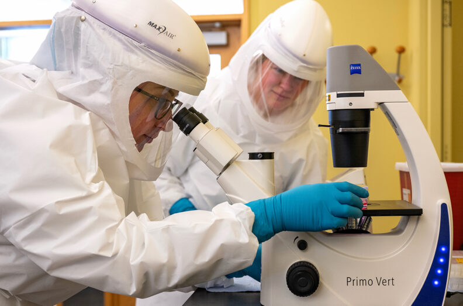
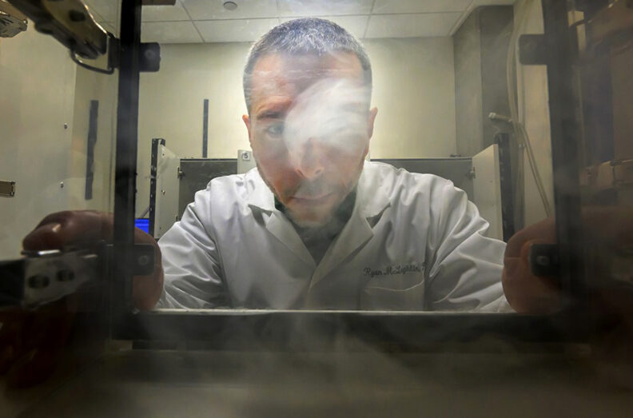
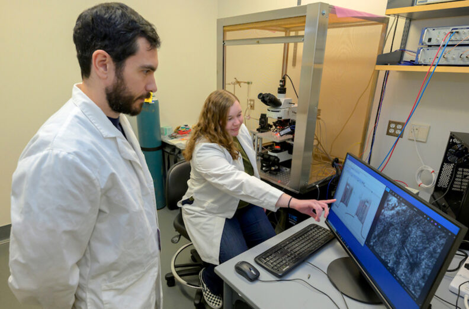
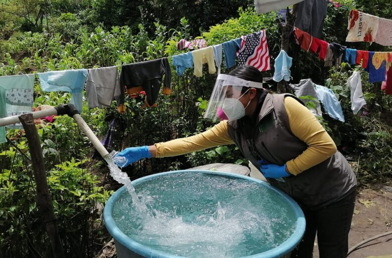
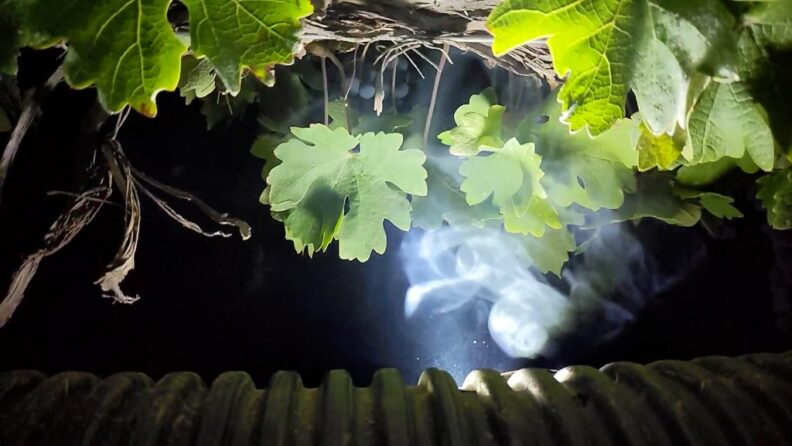
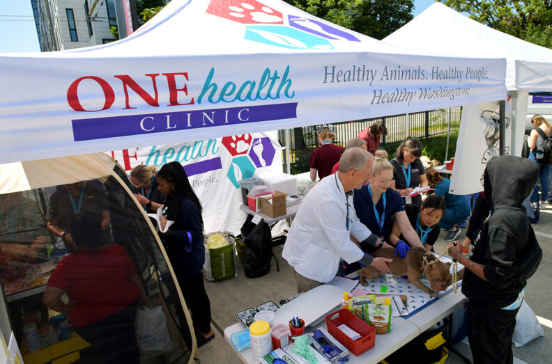
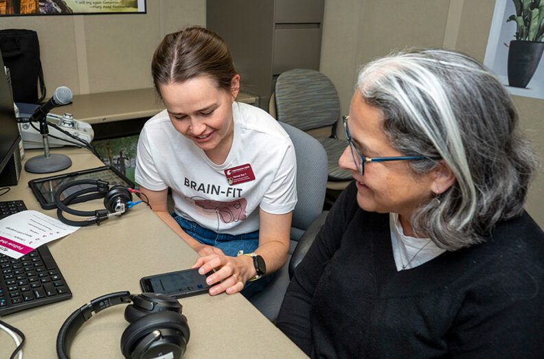
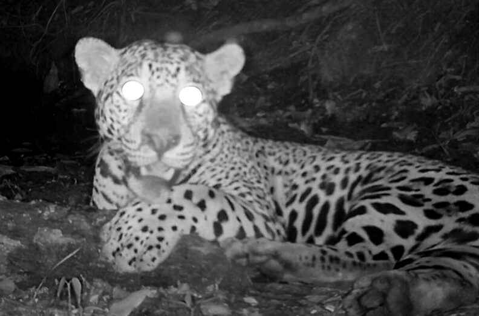
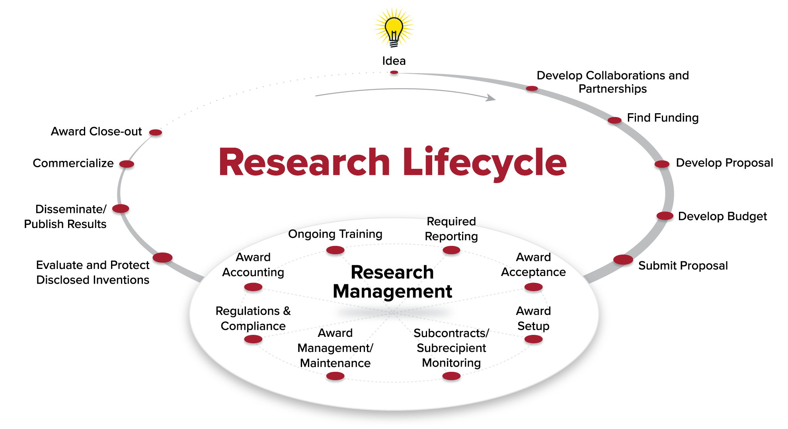

# Page Scan Report

| Field | Value |
|-------|-------|
| URL | https://research.wsu.edu/ |
| Title | Office of Research | Washington State University |
| Status | ❌ 0 |
| HTML Size | 257.3 KB |
| Screenshots | 1 (249.5 KB) |
| Images | 18 (1.8 MB) |
| Images Missing Alt | 17 |
| JS Errors | 2 |
| JS Warnings | 1 |
| Auth | none |
| Captured | 2026-02-16T20:37:05.1524560Z |

## JavaScript Errors

- `Failed to load resource: net::ERR_SOCKET_NOT_CONNECTED`
- `Failed to load resource: net::ERR_SOCKET_NOT_CONNECTED`

## Actions

- Screenshot #1: page-loaded (249.5 KB)
- Downloaded 18 images to /images/

## Screenshots

### 1. page-loaded

## Page Images (18)

| # | Image | Alt Text | Size |
|---|-------|----------|------|
| 1 | [Stephanie-Seifert-in-PPE-with-microscope-792x523.jpg](images/Stephanie-Seifert-in-PPE-with-microscope-792x523.jpg) | *(none)* | 69.0 KB |
| 2 | [Dr-Universe-and-ruler-floating-in-space-792x523.jpg](images/Dr-Universe-and-ruler-floating-in-space-792x523.jpg) | *(none)* | 113.2 KB |
| 3 | [social-media-792x523.jpg](images/social-media-792x523.jpg) | *(none)* | 60.5 KB |
| 4 | [kruger-and-girardi-792x480.jpg](images/kruger-and-girardi-792x480.jpg) | *(none)* | 71.7 KB |
| 5 | [Ryan-McLaughlin-and-chamber-792x523.jpg](images/Ryan-McLaughlin-and-chamber-792x523.jpg) | *(none)* | 50.4 KB |
| 6 | [Giuseppe-Giannotti-and-Allison-Jensen-792x523.jpg](images/Giuseppe-Giannotti-and-Allison-Jensen-792x523.jpg) | *(none)* | 87.4 KB |
| 7 | [eye-and-brain-composite-792x523.jpg](images/eye-and-brain-composite-792x523.jpg) | *(none)* | 60.1 KB |
| 8 | [Guatemala-water-3-792x523.jpg](images/Guatemala-water-3-792x523.jpg) | *(none)* | 132.6 KB |
| 9 | [Peng-He-and-Tingting-Li-and-school-bus-792x523.jpg](images/Peng-He-and-Tingting-Li-and-school-bus-792x523.jpg) | *(none)* | 84.3 KB |
| 10 | [Smoke-Exposure-Lauren-phone-1024x576-2-792x446.jpg](images/Smoke-Exposure-Lauren-phone-1024x576-2-792x446.jpg) | *(none)* | 54.0 KB |
| 11 | [solar-panels-in-orchard-aerial-792x523.jpg](images/solar-panels-in-orchard-aerial-792x523.jpg) | *(none)* | 210.4 KB |
| 12 | [One-Health-Clinic-outdoor-tent-792x523.jpg](images/One-Health-Clinic-outdoor-tent-792x523.jpg) | *(none)* | 116.1 KB |
| 13 | [night-owl-vs-early-bird--792x520.jpg](images/night-owl-vs-early-bird--792x520.jpg) | *(none)* | 58.2 KB |
| 14 | [BRAIN-FIT-Hannah-Tjelle-792x523.jpg](images/BRAIN-FIT-Hannah-Tjelle-792x523.jpg) | *(none)* | 91.3 KB |
| 15 | [ev-shopping-consumer-market.jpg-copy-1024x676-1-792x523.jpg](images/ev-shopping-consumer-market.jpg-copy-1024x676-1-792x523.jpg) | *(none)* | 50.4 KB |
| 16 | [jaguar-at-watering-hole-792x523.jpg](images/jaguar-at-watering-hole-792x523.jpg) | *(none)* | 60.1 KB |
| 17 | [research-lifecycle-v2b2.png](images/research-lifecycle-v2b2.png) | Steps of the Research Lifecycle. The ... | 189.0 KB |
| 18 | [presentation-out-of-focus-scaled.jpeg](images/presentation-out-of-focus-scaled.jpeg) | *(none)* | 272.1 KB |

### Gallery

### ⚠️ Images Missing Alt Text (17)

- `Stephanie-Seifert-in-PPE-with-microscope-792x523.jpg` — https://wpcdn.web.wsu.edu/wp-research/uploads/sites/3409/2026/02/Stephanie-Seifert-in-PPE-with-microscope-792x523.jpg
- `Dr-Universe-and-ruler-floating-in-space-792x523.jpg` — https://wpcdn.web.wsu.edu/wp-research/uploads/sites/3409/2026/02/Dr-Universe-and-ruler-floating-in-space-792x523.jpg
- `social-media-792x523.jpg` — https://wpcdn.web.wsu.edu/wp-research/uploads/sites/3409/2026/02/social-media-792x523.jpg
- `kruger-and-girardi-792x480.jpg` — https://wpcdn.web.wsu.edu/wp-research/uploads/sites/3409/2025/12/kruger-and-girardi-792x480.jpg
- `Ryan-McLaughlin-and-chamber-792x523.jpg` — https://wpcdn.web.wsu.edu/wp-research/uploads/sites/3409/2026/02/Ryan-McLaughlin-and-chamber-792x523.jpg
- `Giuseppe-Giannotti-and-Allison-Jensen-792x523.jpg` — https://wpcdn.web.wsu.edu/wp-research/uploads/sites/3409/2026/02/Giuseppe-Giannotti-and-Allison-Jensen-792x523.jpg
- `eye-and-brain-composite-792x523.jpg` — https://wpcdn.web.wsu.edu/wp-research/uploads/sites/3409/2026/01/eye-and-brain-composite-792x523.jpg
- `Guatemala-water-3-792x523.jpg` — https://wpcdn.web.wsu.edu/wp-research/uploads/sites/3409/2026/01/Guatemala-water-3-792x523.jpg
- `Peng-He-and-Tingting-Li-and-school-bus-792x523.jpg` — https://wpcdn.web.wsu.edu/wp-research/uploads/sites/3409/2025/11/Peng-He-and-Tingting-Li-and-school-bus-792x523.jpg
- `Smoke-Exposure-Lauren-phone-1024x576-2-792x446.jpg` — https://wpcdn.web.wsu.edu/wp-research/uploads/sites/3409/2025/11/Smoke-Exposure-Lauren-phone-1024x576-2-792x446.jpg
- `solar-panels-in-orchard-aerial-792x523.jpg` — https://wpcdn.web.wsu.edu/wp-research/uploads/sites/3409/2026/01/solar-panels-in-orchard-aerial-792x523.jpg
- `One-Health-Clinic-outdoor-tent-792x523.jpg` — https://wpcdn.web.wsu.edu/wp-research/uploads/sites/3409/2025/11/One-Health-Clinic-outdoor-tent-792x523.jpg
- `night-owl-vs-early-bird--792x520.jpg` — https://wpcdn.web.wsu.edu/wp-research/uploads/sites/3409/2025/11/night-owl-vs-early-bird--792x520.jpg
- `BRAIN-FIT-Hannah-Tjelle-792x523.jpg` — https://wpcdn.web.wsu.edu/wp-research/uploads/sites/3409/2025/11/BRAIN-FIT-Hannah-Tjelle-792x523.jpg
- `ev-shopping-consumer-market.jpg-copy-1024x676-1-792x523.jpg` — https://wpcdn.web.wsu.edu/wp-research/uploads/sites/3409/2025/10/ev-shopping-consumer-market.jpg-copy-1024x676-1-792x523.jpg
- `jaguar-at-watering-hole-792x523.jpg` — https://wpcdn.web.wsu.edu/wp-research/uploads/sites/3409/2025/10/jaguar-at-watering-hole-792x523.jpg
- `presentation-out-of-focus-scaled.jpeg` — https://wpcdn.web.wsu.edu/wp-research/uploads/sites/3409/2024/07/presentation-out-of-focus-scaled.jpeg

## Files

- `01-page-loaded.png` — page-loaded (249.5 KB)
- `page.html` — rendered HTML content
- `metadata.json` — machine-readable scan data
- `errors.log` — JavaScript console errors
- `warnings.log` — JavaScript console warnings
- `info.log` — navigation and timing details
- `actions.log` — interactions performed on the page
- `images/` — 18 page images (1.8 MB)
