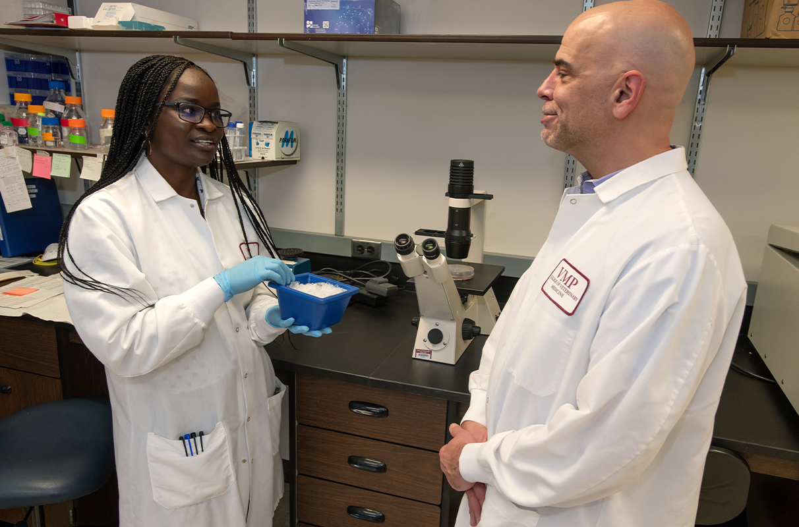

# 📄 Page Scan Report

> **URL:** https://research.wsu.edu/  
> **Captured:** 2026-02-16 22:14:57 UTC  
> **Status:** ✅ 200  

---

## 📑 Contents

- [Summary](#-summary)
- [Screenshots](#-screenshots)
- [Page Images](#-page-images)
- [JavaScript Errors](#-javascript-errors)
- [Actions](#-actions)
- [Files](#-files)

---

## 📋 Summary

| Field | Value |
|-------|-------|
| URL | https://research.wsu.edu/ |
| Title | Office of Research | Washington State University |
| Status | ✅ 200 |
| HTML Size | 266.5 KB |
| Screenshots | 1 (1.6 MB) |
| Images | 19 (2.5 MB) |
| Images Missing Alt | ⚠️ 17 |
| JS Errors | 🔴 1 |
| JS Warnings | 1 |
| Auth | none |
| Captured | 2026-02-16T22:14:57.8397453Z |

## 🔴 JavaScript Errors

<details>
<summary><strong>1 error(s) detected</strong></summary>

```
Failed to load resource: the server responded with a status of 405 ()
```

</details>

## 🔧 Actions

<details>
<summary><strong>2 action(s) performed</strong></summary>

- Screenshot #1: page-loaded (1.6 MB)
- Downloaded 19 images to /images/

</details>

## 📸 Screenshots

<table>
<tr>
<td align="center" width="50%">
<a href="01-page-loaded.png">

</a>
<br /><strong>1. page-loaded</strong>
<br /><sub>1.6 MB</sub>
</td>
<td></td>
</tr>
</table>

## 🖼️ Page Images (19)

<details open>
<summary><strong>📋 Image Index</strong> — 19 images, 2.5 MB</summary>

| # | Image | Alt Text | Size |
|--:|-------|----------|-----:|
| 1 | [Stephanie-Seifert-in-PPE-with-microscope-792x523.jpg](images/Stephanie-Seifert-in-PPE-with-microscope-792x523.jpg) | ⚠️ *(missing)* | 69.0 KB |
| 2 | [Dr-Universe-and-ruler-floating-in-space-792x523.jpg](images/Dr-Universe-and-ruler-floating-in-space-792x523.jpg) | ⚠️ *(missing)* | 113.2 KB |
| 3 | [social-media-792x523.jpg](images/social-media-792x523.jpg) | ⚠️ *(missing)* | 60.5 KB |
| 4 | [kruger-and-girardi-792x480.jpg](images/kruger-and-girardi-792x480.jpg) | ⚠️ *(missing)* | 71.7 KB |
| 5 | [Ryan-McLaughlin-and-chamber-792x523.jpg](images/Ryan-McLaughlin-and-chamber-792x523.jpg) | ⚠️ *(missing)* | 50.4 KB |
| 6 | [Giuseppe-Giannotti-and-Allison-Jensen-792x523.jpg](images/Giuseppe-Giannotti-and-Allison-Jensen-792x523.jpg) | ⚠️ *(missing)* | 87.4 KB |
| 7 | [eye-and-brain-composite-792x523.jpg](images/eye-and-brain-composite-792x523.jpg) | ⚠️ *(missing)* | 60.1 KB |
| 8 | [Guatemala-water-3-792x523.jpg](images/Guatemala-water-3-792x523.jpg) | ⚠️ *(missing)* | 132.6 KB |
| 9 | [Peng-He-and-Tingting-Li-and-school-bus-792x523.jpg](images/Peng-He-and-Tingting-Li-and-school-bus-792x523.jpg) | ⚠️ *(missing)* | 84.3 KB |
| 10 | [Smoke-Exposure-Lauren-phone-1024x576-2-792x446.jpg](images/Smoke-Exposure-Lauren-phone-1024x576-2-792x446.jpg) | ⚠️ *(missing)* | 54.0 KB |
| 11 | [solar-panels-in-orchard-aerial-792x523.jpg](images/solar-panels-in-orchard-aerial-792x523.jpg) | ⚠️ *(missing)* | 210.4 KB |
| 12 | [One-Health-Clinic-outdoor-tent-792x523.jpg](images/One-Health-Clinic-outdoor-tent-792x523.jpg) | ⚠️ *(missing)* | 116.1 KB |
| 13 | [night-owl-vs-early-bird--792x520.jpg](images/night-owl-vs-early-bird--792x520.jpg) | ⚠️ *(missing)* | 58.2 KB |
| 14 | [BRAIN-FIT-Hannah-Tjelle-792x523.jpg](images/BRAIN-FIT-Hannah-Tjelle-792x523.jpg) | ⚠️ *(missing)* | 91.3 KB |
| 15 | [ev-shopping-consumer-market.jpg-copy-1024x676-1-792x523.jpg](images/ev-shopping-consumer-market.jpg-copy-1024x676-1-792x523.jpg) | ⚠️ *(missing)* | 50.4 KB |
| 16 | [jaguar-at-watering-hole-792x523.jpg](images/jaguar-at-watering-hole-792x523.jpg) | ⚠️ *(missing)* | 60.1 KB |
| 17 | [Reasearch-to-stop-viral-infections.jpg](images/Reasearch-to-stop-viral-infections.jpg) | Graduate student Albina Makio, left, ... | 703.4 KB |
| 18 | [research-lifecycle-v2b2.png](images/research-lifecycle-v2b2.png) | Steps of the Research Lifecycle. The ... | 189.0 KB |
| 19 | [presentation-out-of-focus-scaled.jpeg](images/presentation-out-of-focus-scaled.jpeg) | ⚠️ *(missing)* | 272.1 KB |

</details>

<details open>
<summary><strong>🖼️ Gallery</strong></summary>

<table>
<tr>
<td align="center" width="33%">
<a href="images/Stephanie-Seifert-in-PPE-with-microscope-792x523.jpg">

</a>
<br /><sub>Stephanie-Seifert-in-PPE-with-microscope-792x523.jpg ⚠️</sub>
</td>
<td align="center" width="33%">
<a href="images/Dr-Universe-and-ruler-floating-in-space-792x523.jpg">

</a>
<br /><sub>Dr-Universe-and-ruler-floating-in-space-792x523.jpg ⚠️</sub>
</td>
<td align="center" width="33%">
<a href="images/social-media-792x523.jpg">

</a>
<br /><sub>social-media-792x523.jpg ⚠️</sub>
</td>
</tr>
<tr>
<td align="center" width="33%">
<a href="images/kruger-and-girardi-792x480.jpg">

</a>
<br /><sub>kruger-and-girardi-792x480.jpg ⚠️</sub>
</td>
<td align="center" width="33%">
<a href="images/Ryan-McLaughlin-and-chamber-792x523.jpg">

</a>
<br /><sub>Ryan-McLaughlin-and-chamber-792x523.jpg ⚠️</sub>
</td>
<td align="center" width="33%">
<a href="images/Giuseppe-Giannotti-and-Allison-Jensen-792x523.jpg">

</a>
<br /><sub>Giuseppe-Giannotti-and-Allison-Jensen-792x523.jpg ⚠️</sub>
</td>
</tr>
<tr>
<td align="center" width="33%">
<a href="images/eye-and-brain-composite-792x523.jpg">

</a>
<br /><sub>eye-and-brain-composite-792x523.jpg ⚠️</sub>
</td>
<td align="center" width="33%">
<a href="images/Guatemala-water-3-792x523.jpg">

</a>
<br /><sub>Guatemala-water-3-792x523.jpg ⚠️</sub>
</td>
<td align="center" width="33%">
<a href="images/Peng-He-and-Tingting-Li-and-school-bus-792x523.jpg">

</a>
<br /><sub>Peng-He-and-Tingting-Li-and-school-bus-792x523.jpg ⚠️</sub>
</td>
</tr>
<tr>
<td align="center" width="33%">
<a href="images/Smoke-Exposure-Lauren-phone-1024x576-2-792x446.jpg">

</a>
<br /><sub>Smoke-Exposure-Lauren-phone-1024x576-2-792x446.jpg ⚠️</sub>
</td>
<td align="center" width="33%">
<a href="images/solar-panels-in-orchard-aerial-792x523.jpg">

</a>
<br /><sub>solar-panels-in-orchard-aerial-792x523.jpg ⚠️</sub>
</td>
<td align="center" width="33%">
<a href="images/One-Health-Clinic-outdoor-tent-792x523.jpg">

</a>
<br /><sub>One-Health-Clinic-outdoor-tent-792x523.jpg ⚠️</sub>
</td>
</tr>
<tr>
<td align="center" width="33%">
<a href="images/night-owl-vs-early-bird--792x520.jpg">

</a>
<br /><sub>night-owl-vs-early-bird--792x520.jpg ⚠️</sub>
</td>
<td align="center" width="33%">
<a href="images/BRAIN-FIT-Hannah-Tjelle-792x523.jpg">

</a>
<br /><sub>BRAIN-FIT-Hannah-Tjelle-792x523.jpg ⚠️</sub>
</td>
<td align="center" width="33%">
<a href="images/ev-shopping-consumer-market.jpg-copy-1024x676-1-792x523.jpg">

</a>
<br /><sub>ev-shopping-consumer-market.jpg-copy-1024x676-1-792x523.jpg ⚠️</sub>
</td>
</tr>
<tr>
<td align="center" width="33%">
<a href="images/jaguar-at-watering-hole-792x523.jpg">

</a>
<br /><sub>jaguar-at-watering-hole-792x523.jpg ⚠️</sub>
</td>
<td align="center" width="33%">
<a href="images/Reasearch-to-stop-viral-infections.jpg">

</a>
<br /><sub>Reasearch-to-stop-viral-infections.jpg</sub>
</td>
<td align="center" width="33%">
<a href="images/research-lifecycle-v2b2.png">

</a>
<br /><sub>research-lifecycle-v2b2.png</sub>
</td>
</tr>
<tr>
<td align="center" width="33%">
<a href="images/presentation-out-of-focus-scaled.jpeg">

</a>
<br /><sub>presentation-out-of-focus-scaled.jpeg ⚠️</sub>
</td>
<td></td>
<td></td>
</tr>
</table>

</details>

<details>
<summary>⚠️ <strong>Images Missing Alt Text</strong> (17)</summary>

| Image | Source URL |
|-------|-----------|
| `Stephanie-Seifert-in-PPE-with-microscope-792x523.jpg` | https://wpcdn.web.wsu.edu/wp-research/uploads/sites/3409/2026/02/Stephanie-Se... |
| `Dr-Universe-and-ruler-floating-in-space-792x523.jpg` | https://wpcdn.web.wsu.edu/wp-research/uploads/sites/3409/2026/02/Dr-Universe-... |
| `social-media-792x523.jpg` | https://wpcdn.web.wsu.edu/wp-research/uploads/sites/3409/2026/02/social-media... |
| `kruger-and-girardi-792x480.jpg` | https://wpcdn.web.wsu.edu/wp-research/uploads/sites/3409/2025/12/kruger-and-g... |
| `Ryan-McLaughlin-and-chamber-792x523.jpg` | https://wpcdn.web.wsu.edu/wp-research/uploads/sites/3409/2026/02/Ryan-McLaugh... |
| `Giuseppe-Giannotti-and-Allison-Jensen-792x523.jpg` | https://wpcdn.web.wsu.edu/wp-research/uploads/sites/3409/2026/02/Giuseppe-Gia... |
| `eye-and-brain-composite-792x523.jpg` | https://wpcdn.web.wsu.edu/wp-research/uploads/sites/3409/2026/01/eye-and-brai... |
| `Guatemala-water-3-792x523.jpg` | https://wpcdn.web.wsu.edu/wp-research/uploads/sites/3409/2026/01/Guatemala-wa... |
| `Peng-He-and-Tingting-Li-and-school-bus-792x523.jpg` | https://wpcdn.web.wsu.edu/wp-research/uploads/sites/3409/2025/11/Peng-He-and-... |
| `Smoke-Exposure-Lauren-phone-1024x576-2-792x446.jpg` | https://wpcdn.web.wsu.edu/wp-research/uploads/sites/3409/2025/11/Smoke-Exposu... |
| `solar-panels-in-orchard-aerial-792x523.jpg` | https://wpcdn.web.wsu.edu/wp-research/uploads/sites/3409/2026/01/solar-panels... |
| `One-Health-Clinic-outdoor-tent-792x523.jpg` | https://wpcdn.web.wsu.edu/wp-research/uploads/sites/3409/2025/11/One-Health-C... |
| `night-owl-vs-early-bird--792x520.jpg` | https://wpcdn.web.wsu.edu/wp-research/uploads/sites/3409/2025/11/night-owl-vs... |
| `BRAIN-FIT-Hannah-Tjelle-792x523.jpg` | https://wpcdn.web.wsu.edu/wp-research/uploads/sites/3409/2025/11/BRAIN-FIT-Ha... |
| `ev-shopping-consumer-market.jpg-copy-1024x676-1-792x523.jpg` | https://wpcdn.web.wsu.edu/wp-research/uploads/sites/3409/2025/10/ev-shopping-... |
| `jaguar-at-watering-hole-792x523.jpg` | https://wpcdn.web.wsu.edu/wp-research/uploads/sites/3409/2025/10/jaguar-at-wa... |
| `presentation-out-of-focus-scaled.jpeg` | https://wpcdn.web.wsu.edu/wp-research/uploads/sites/3409/2024/07/presentation... |

</details>

## 📁 Files

| File | Description |
|------|-------------|
| `01-page-loaded.png` | page-loaded (1.6 MB) |
| `page.html` | Rendered HTML content |
| `metadata.json` | Machine-readable scan data |
| `errors.log` | JavaScript console errors |
| `warnings.log` | JavaScript console warnings |
| `info.log` | Navigation and timing details |
| `actions.log` | Interactions performed |
| `images/` | 19 page images (2.5 MB) |

---

*Generated by AccessibilityScanner (FreeTools) v1.0*
