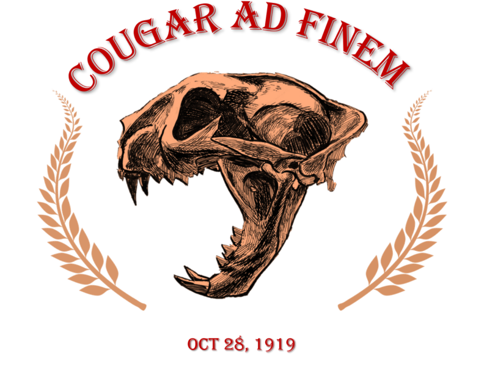
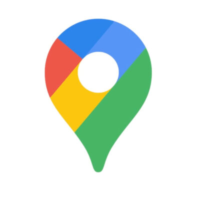

# Page Scan Report

| Field | Value |
|-------|-------|
| URL | https://rotc.wsu.edu/ |
| Title | WSU Army ROTC | Washington State University |
| Status | ❌ 0 |
| HTML Size | 63.8 KB |
| Screenshots | 1 (207.9 KB) |
| Images | 4 (378.7 KB) |
| Images Missing Alt | 4 |
| JS Errors | 0 |
| JS Warnings | 12 |
| Auth | none |
| Captured | 2026-02-16T20:58:42.4711951Z |

## Actions

- Screenshot #1: page-loaded (207.9 KB)
- Downloaded 4 images to /images/

## Screenshots

### 1. page-loaded

## Page Images (4)

| # | Image | Alt Text | Size |
|---|-------|----------|------|
| 1 | [Cougar_BN_front-1-792x601.png](images/Cougar_BN_front-1-792x601.png) | *(none)* | 350.5 KB |
| 2 | [instagram.jpg](images/instagram.jpg) | *(none)* | 7.8 KB |
| 3 | [f_logo_RGB-Hex-Blue_512-396x396.png](images/f_logo_RGB-Hex-Blue_512-396x396.png) | *(none)* | 11.3 KB |
| 4 | [googlemaps-1-396x396.jpg](images/googlemaps-1-396x396.jpg) | *(none)* | 9.2 KB |

### Gallery

### ⚠️ Images Missing Alt Text (4)

- `Cougar_BN_front-1-792x601.png` — https://wpcdn.web.wsu.edu/wp-wpsites/uploads/sites/2710/2021/08/Cougar_BN_front-1-792x601.png
- `instagram.jpg` — https://wpcdn.web.wsu.edu/wp-wpsites/uploads/sites/2710/2021/08/instagram.jpg
- `f_logo_RGB-Hex-Blue_512-396x396.png` — https://wpcdn.web.wsu.edu/wp-wpsites/uploads/sites/2710/2021/08/f_logo_RGB-Hex-Blue_512-396x396.png
- `googlemaps-1-396x396.jpg` — https://wpcdn.web.wsu.edu/wp-wpsites/uploads/sites/2710/2021/08/googlemaps-1-396x396.jpg

## Files

- `01-page-loaded.png` — page-loaded (207.9 KB)
- `page.html` — rendered HTML content
- `metadata.json` — machine-readable scan data
- `errors.log` — JavaScript console errors
- `warnings.log` — JavaScript console warnings
- `info.log` — navigation and timing details
- `actions.log` — interactions performed on the page
- `images/` — 4 page images (378.7 KB)
