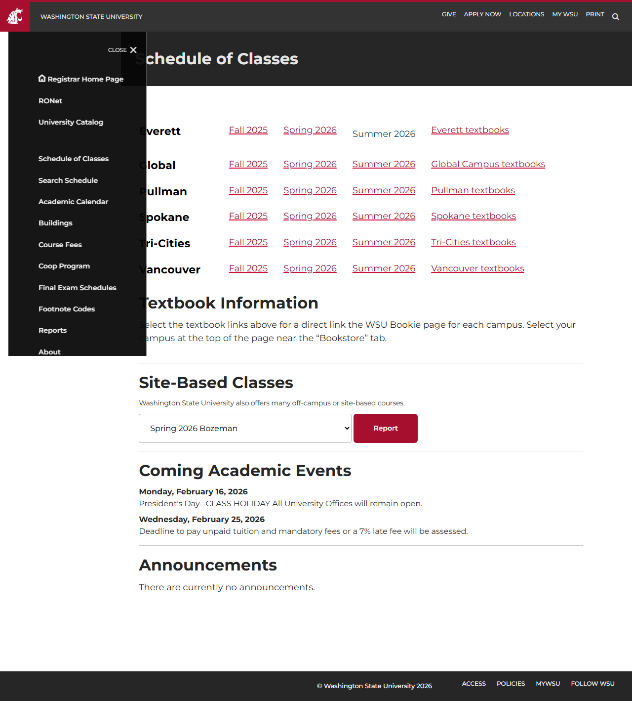

# Site Report: https://schedules.wsu.edu/

| Metric | Value |
|--------|-------|
| Status | ✅ 7/7 pages OK |
| Pages Scanned | 7 |
| Pages Passed | 7 |
| Pages Failed | 0 |
| Total JS Errors | 0 |
| Total JS Warnings | 0 |
| Total HTML | 4.8 MB |
| Total Screenshots | 462.6 KB |
| Folder | `schedules-wsu-edu/` |

## Pages

| Status | Page | HTTP | Title | JS Errors | JS Warnings | Screenshots |
|--------|------|------|-------|-----------|-------------|-------------|
| ✅ | [/](_root/report.md) | 200 | Schedule of Classes | 0 | 0 | 1 |
| ✅ | [/Coop/](Coop/report.md) | 200 | Schedule of Classes | 0 | 0 | 1 |
| ✅ | [/List/Everett/](List_Everett/report.md) | 200 | Schedule of Classes | 0 | 0 | 1 |
| ✅ | [/List/Pullman/](List_Pullman/report.md) | 200 | Schedule of Classes | 0 | 0 | 1 |
| ✅ | [/List/Spokane/](List_Spokane/report.md) | 200 | Schedule of Classes | 0 | 0 | 1 |
| ✅ | [/List/TriCities/](List_TriCities/report.md) | 200 | Schedule of Classes | 0 | 0 | 1 |
| ✅ | [/List/Vancouver/](List_Vancouver/report.md) | 200 | Schedule of Classes | 0 | 0 | 1 |

## Page Screenshots

### [/](_root/report.md)

### [/Coop/](Coop/report.md)

### [/List/Everett/](List_Everett/report.md)

### [/List/Pullman/](List_Pullman/report.md)

### [/List/Spokane/](List_Spokane/report.md)

### [/List/TriCities/](List_TriCities/report.md)

### [/List/Vancouver/](List_Vancouver/report.md)

---

*Generated by AccessibilityScanner (FreeTools) v1.0*
