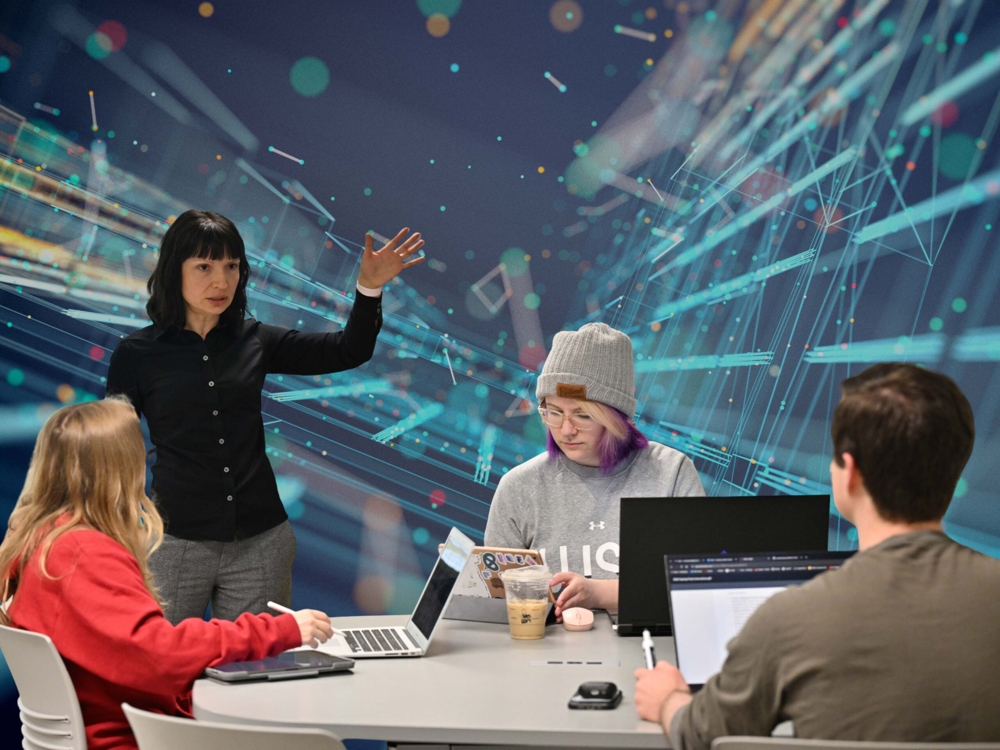

# 📄 Page Scan Report

> **URL:** https://school.eecs.wsu.edu/  
> **Captured:** 2026-02-16 22:14:19 UTC  
> **Status:** ✅ 200  

---

## 📑 Contents

- [Summary](#-summary)
- [Screenshots](#-screenshots)
- [Page Images](#-page-images)
- [Actions](#-actions)
- [Files](#-files)

---

## 📋 Summary

| Field | Value |
|-------|-------|
| URL | https://school.eecs.wsu.edu/ |
| Title | School of Electrical Engineering & Computer Science | Washington State University |
| Status | ✅ 200 |
| HTML Size | 251.5 KB |
| Screenshots | 1 (1.8 MB) |
| Images | 13 (2.3 MB) |
| Images Missing Alt | ✅ 0 |
| JS Errors | ✅ 0 |
| JS Warnings | 0 |
| Auth | none |
| Captured | 2026-02-16T22:14:19.1996604Z |

## 🔧 Actions

<strong>2 action(s) performed</strong>

- Screenshot #1: page-loaded (1.8 MB)
- Downloaded 13 images to /images/

## 📸 Screenshots

<table>
<tr>
<td align="center" width="50%">

 <strong>1. page-loaded</strong>
 1.8 MB
</td>
<td></td>
</tr>
</table>

## 🖼️ Page Images (13)

<strong>📋 Image Index</strong> — 13 images, 2.3 MB

| # | Image | Alt Text | Size |
|--:|-------|----------|-----:|
| 1 | [Computer-Science-in-AI-scaled.jpg](images/Computer-Science-in-AI-scaled.jpg) | A professor and three students using ... | 546.6 KB |
| 2 | [Yassine-NeurIPS-2025-e1768322109629.jpeg](images/Yassine-NeurIPS-2025-e1768322109629.jpeg) | Four people wearing lanyards stand in... | 216.4 KB |
| 3 | [Yan-and-Hasan-7-e1767726118966.png](images/Yan-and-Hasan-7-e1767726118966.png) | Two men posing in suits against a gra... | 443.5 KB |
| 4 | [hackathon-1024x676-1.jpg](images/hackathon-1024x676-1.jpg) | Hackathon team members working on a p... | 165.2 KB |
| 5 | [eng-student-1.jpg](images/eng-student-1.jpg) | A WSU Electrical Engineering student ... | 71.6 KB |
| 6 | [Abhishek-Moitra.png](images/Abhishek-Moitra.png) | Head shot of a man in a blue shirt po... | 135.7 KB |
| 7 | [Ishaani-Priyadarshini.jpg](images/Ishaani-Priyadarshini.jpg) | Head shot of a woman wearing glasses ... | 18.8 KB |
| 8 | [cybersecurity-792x528.jpg](images/cybersecurity-792x528.jpg) | A blue padlock icon is centered withi... | 54.5 KB |
| 9 | [GRID-PHOTO-1024x676.jpg](images/GRID-PHOTO-1024x676.jpg) | Power lines spanning farm fields in W... | 157.6 KB |
| 10 | [rural-roadmap-for-AI-1024x676.jpg](images/rural-roadmap-for-AI-1024x676.jpg) | A composite featuring closeups of a s... | 75.9 KB |
| 11 | [pruning-robot-1024x676.jpg](images/pruning-robot-1024x676.jpg) | A researcher watches a robotic pruner... | 218.8 KB |
| 12 | [researchers-flying-drone-over-orchard-1024x676.jpg](images/researchers-flying-drone-over-orchard-1024x676.jpg) | A team of WSU researchers in an orcha... | 165.0 KB |
| 13 | [Theia-Grady.jpg](images/Theia-Grady.jpg) | A smiling woman wearing a black top a... | 66.5 KB |

<strong>🖼️ Gallery</strong>

<table>
<tr>
<td align="center" width="33%">

 Computer-Science-in-AI-scaled.jpg
</td>
<td align="center" width="33%">

 Yassine-NeurIPS-2025-e1768322109629.jpeg
</td>
<td align="center" width="33%">

 Yan-and-Hasan-7-e1767726118966.png
</td>
</tr>
<tr>
<td align="center" width="33%">

 hackathon-1024x676-1.jpg
</td>
<td align="center" width="33%">

 eng-student-1.jpg
</td>
<td align="center" width="33%">

 Abhishek-Moitra.png
</td>
</tr>
<tr>
<td align="center" width="33%">

 Ishaani-Priyadarshini.jpg
</td>
<td align="center" width="33%">

 cybersecurity-792x528.jpg
</td>
<td align="center" width="33%">

 GRID-PHOTO-1024x676.jpg
</td>
</tr>
<tr>
<td align="center" width="33%">

 rural-roadmap-for-AI-1024x676.jpg
</td>
<td align="center" width="33%">

 pruning-robot-1024x676.jpg
</td>
<td align="center" width="33%">

 researchers-flying-drone-over-orchard-1024x676.jpg
</td>
</tr>
<tr>
<td align="center" width="33%">

 Theia-Grady.jpg
</td>
<td></td>
<td></td>
</tr>
</table>

## 📁 Files

| File | Description |
|------|-------------|
| `01-page-loaded.png` | page-loaded (1.8 MB) |
| `page.html` | Rendered HTML content |
| `metadata.json` | Machine-readable scan data |
| `errors.log` | JavaScript console errors |
| `warnings.log` | JavaScript console warnings |
| `info.log` | Navigation and timing details |
| `actions.log` | Interactions performed |
| `images/` | 13 page images (2.3 MB) |

---

*Generated by AccessibilityScanner (FreeTools) v1.0*
