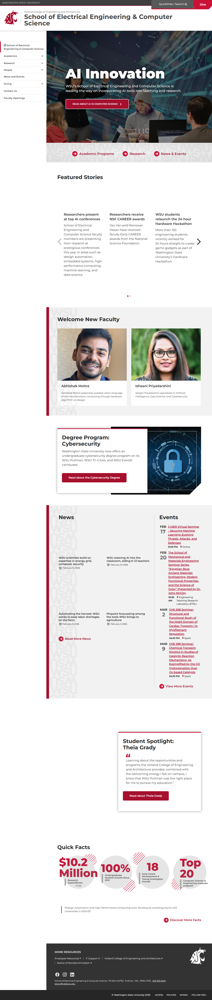
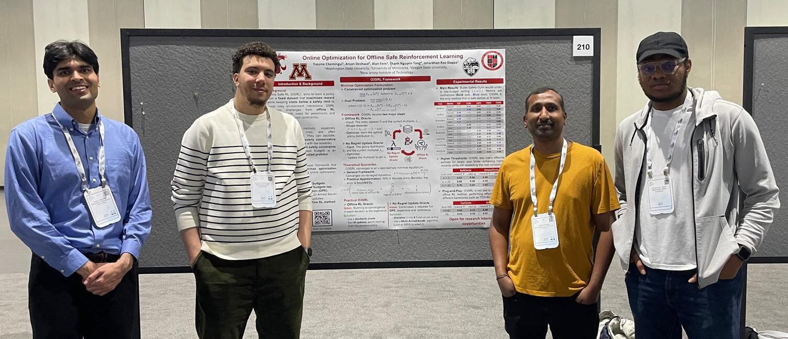
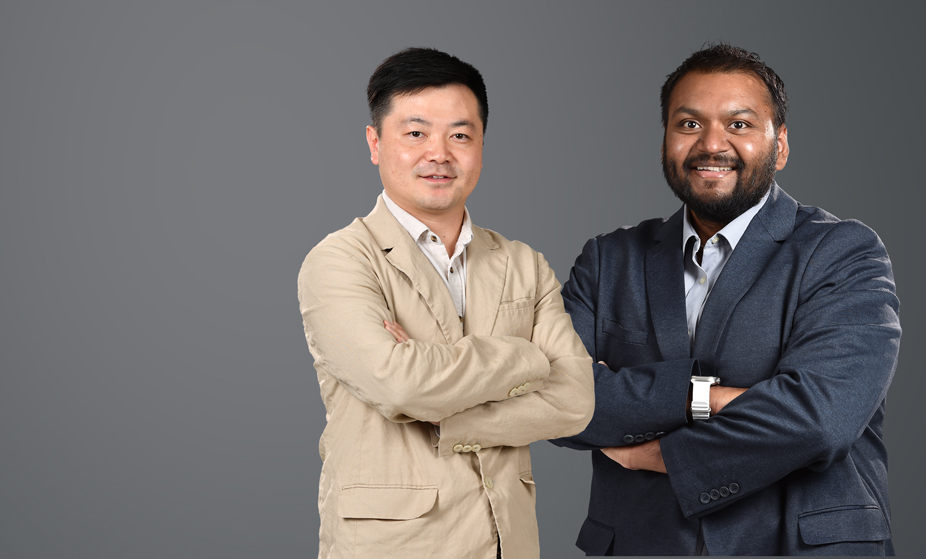
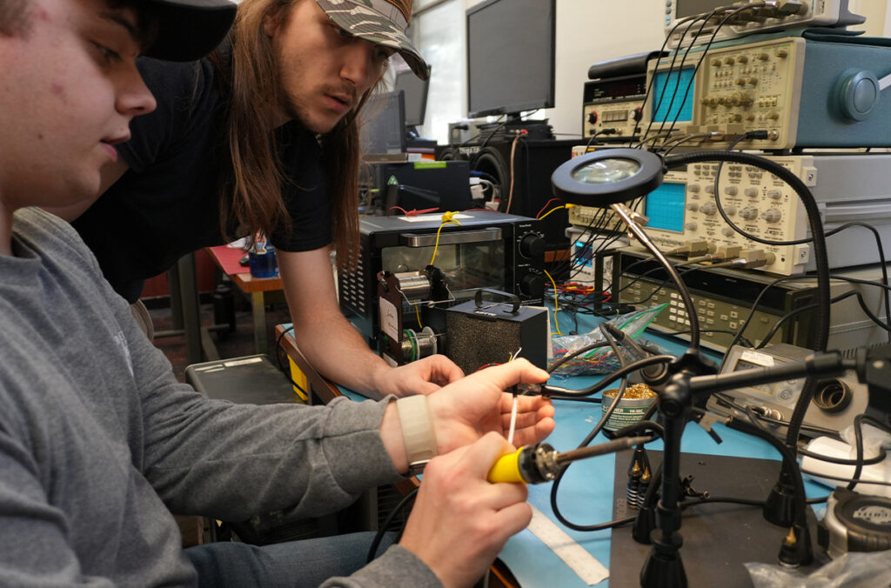
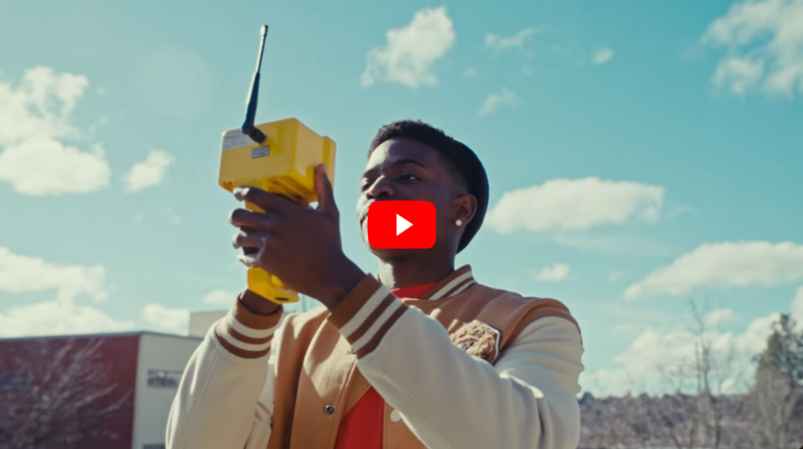
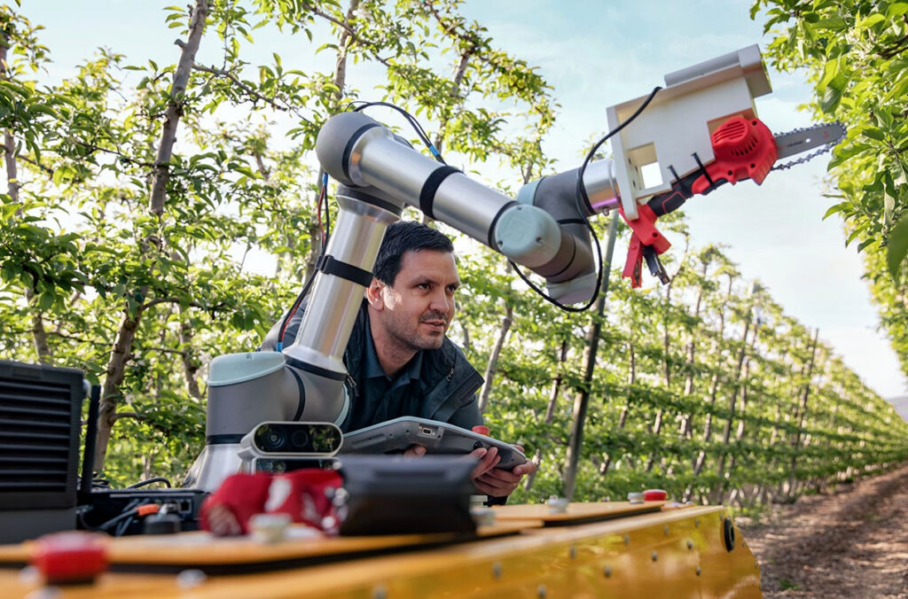
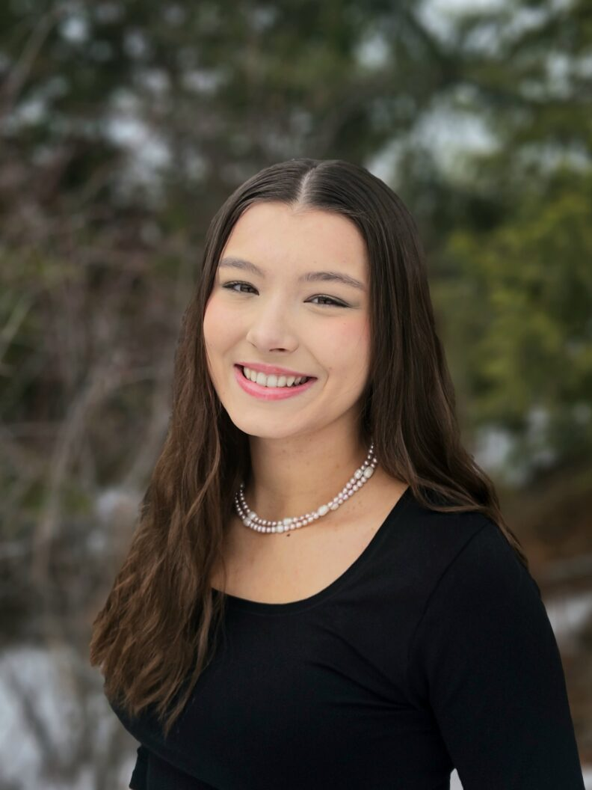

# Page Scan Report

| Field | Value |
|-------|-------|
| URL | https://school.eecs.wsu.edu/ |
| Title | School of Electrical Engineering & Computer Science | Washington State University |
| Status | ❌ 0 |
| HTML Size | 245.1 KB |
| Screenshots | 1 (1.8 MB) |
| Images | 12 (1.7 MB) |
| Images Missing Alt | 0 |
| JS Errors | 2 |
| JS Warnings | 0 |
| Auth | none |
| Captured | 2026-02-16T20:58:42.4715458Z |

## JavaScript Errors

- `Failed to load resource: net::ERR_SOCKET_NOT_CONNECTED`
- `Failed to load resource: net::ERR_SOCKET_NOT_CONNECTED`

## Actions

- Screenshot #1: page-loaded (1.8 MB)
- Downloaded 12 images to /images/

## Screenshots

### 1. page-loaded

## Page Images (12)

| # | Image | Alt Text | Size |
|---|-------|----------|------|
| 1 | [Yassine-NeurIPS-2025-e1768322109629.jpeg](images/Yassine-NeurIPS-2025-e1768322109629.jpeg) | Four people wearing lanyards stand in... | 216.4 KB |
| 2 | [Yan-and-Hasan-7-e1767726118966.png](images/Yan-and-Hasan-7-e1767726118966.png) | Two men posing in suits against a gra... | 443.5 KB |
| 3 | [hackathon-1024x676-1.jpg](images/hackathon-1024x676-1.jpg) | Hackathon team members working on a p... | 165.2 KB |
| 4 | [eng-student-1.jpg](images/eng-student-1.jpg) | A WSU Electrical Engineering student ... | 71.6 KB |
| 5 | [Abhishek-Moitra.png](images/Abhishek-Moitra.png) | Head shot of a man in a blue shirt po... | 135.7 KB |
| 6 | [Ishaani-Priyadarshini.jpg](images/Ishaani-Priyadarshini.jpg) | Head shot of a woman wearing glasses ... | 18.8 KB |
| 7 | [cybersecurity-792x528.jpg](images/cybersecurity-792x528.jpg) | A blue padlock icon is centered withi... | 54.5 KB |
| 8 | [GRID-PHOTO-1024x676.jpg](images/GRID-PHOTO-1024x676.jpg) | Power lines spanning farm fields in W... | 157.6 KB |
| 9 | [rural-roadmap-for-AI-1024x676.jpg](images/rural-roadmap-for-AI-1024x676.jpg) | A composite featuring closeups of a s... | 75.9 KB |
| 10 | [pruning-robot-1024x676.jpg](images/pruning-robot-1024x676.jpg) | A researcher watches a robotic pruner... | 218.8 KB |
| 11 | [researchers-flying-drone-over-orchard-1024x676.jpg](images/researchers-flying-drone-over-orchard-1024x676.jpg) | A team of WSU researchers in an orcha... | 165.0 KB |
| 12 | [Theia-Grady.jpg](images/Theia-Grady.jpg) | A smiling woman wearing a black top a... | 66.5 KB |

### Gallery

## Files

- `01-page-loaded.png` — page-loaded (1.8 MB)
- `page.html` — rendered HTML content
- `metadata.json` — machine-readable scan data
- `errors.log` — JavaScript console errors
- `warnings.log` — JavaScript console warnings
- `info.log` — navigation and timing details
- `actions.log` — interactions performed on the page
- `images/` — 12 page images (1.7 MB)
