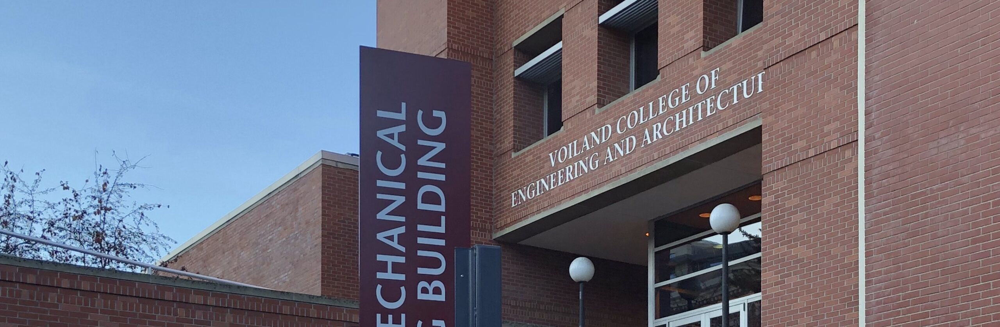

# 📄 Page Scan Report

> **URL:** https://school.eecs.wsu.edu/undergraduate/  
> **Captured:** 2026-02-16 22:14:26 UTC  
> **Status:** ✅ 200  

---

## 📑 Contents

- [Summary](#-summary)
- [Screenshots](#-screenshots)
- [Page Images](#-page-images)
- [Actions](#-actions)
- [Files](#-files)

---

## 📋 Summary

| Field | Value |
|-------|-------|
| URL | https://school.eecs.wsu.edu/undergraduate/ |
| Redirected To | https://school.eecs.wsu.edu/academics/undergraduate-advising/ |
| Title | Undergraduate Advising | School of Electrical Engineering & Computer Science | Washington State University |
| Status | ✅ 200 |
| HTML Size | 228.1 KB |
| Screenshots | 1 (849.1 KB) |
| Images | 3 (643.3 KB) |
| Images Missing Alt | ✅ 0 |
| JS Errors | ✅ 0 |
| JS Warnings | 0 |
| Auth | none |
| Captured | 2026-02-16T22:14:26.5040203Z |

## 🔧 Actions

<strong>2 action(s) performed</strong>

- Screenshot #1: page-loaded (849.1 KB)
- Downloaded 3 images to /images/

## 📸 Screenshots

<table>
<tr>
<td align="center" width="50%">

 <strong>1. page-loaded</strong>
 849.1 KB
</td>
<td></td>
</tr>
</table>

## 🖼️ Page Images (3)

<strong>📋 Image Index</strong> — 3 images, 643.3 KB

| # | Image | Alt Text | Size |
|--:|-------|----------|-----:|
| 1 | [advising-header-scaled-e1646243787278.jpeg](images/advising-header-scaled-e1646243787278.jpeg) | Brick building displaying the name Vo... | 313.0 KB |
| 2 | [academic-advising.png](images/academic-advising.png) | Green arrow pointing up and the words... | 24.6 KB |
| 3 | [advisor-booking.png](images/advisor-booking.png) | Screenshot highlighting the Schedule ... | 305.7 KB |

<strong>🖼️ Gallery</strong>

<table>
<tr>
<td align="center" width="33%">

 advising-header-scaled-e1646243787278.jpeg
</td>
<td align="center" width="33%">

 academic-advising.png
</td>
<td align="center" width="33%">

 advisor-booking.png
</td>
</tr>
</table>

## 📁 Files

| File | Description |
|------|-------------|
| `01-page-loaded.png` | page-loaded (849.1 KB) |
| `page.html` | Rendered HTML content |
| `metadata.json` | Machine-readable scan data |
| `errors.log` | JavaScript console errors |
| `warnings.log` | JavaScript console warnings |
| `info.log` | Navigation and timing details |
| `actions.log` | Interactions performed |
| `images/` | 3 page images (643.3 KB) |

---

*Generated by AccessibilityScanner (FreeTools) v1.0*
