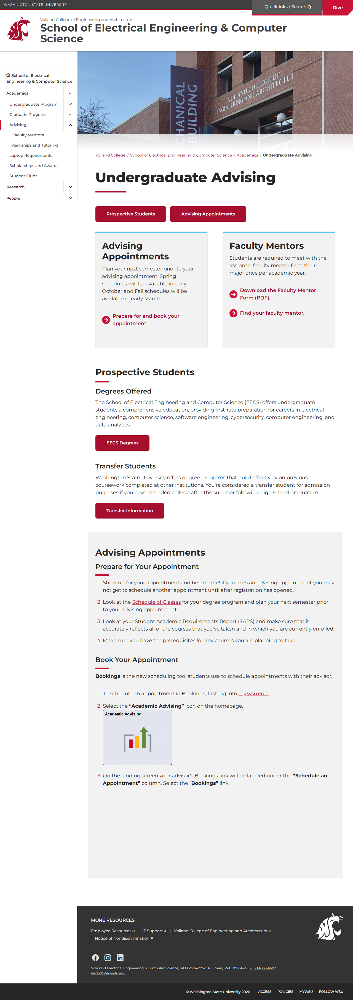
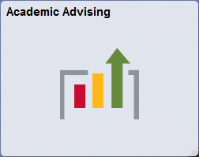
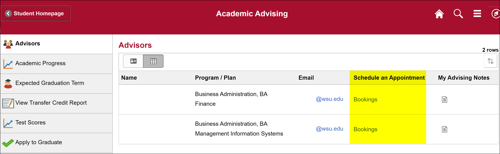

# Page Scan Report

| Field | Value |
|-------|-------|
| URL | https://school.eecs.wsu.edu/undergraduate/ |
| Redirected To | https://school.eecs.wsu.edu/academics/undergraduate-advising/ |
| Title | Undergraduate Advising | School of Electrical Engineering & Computer Science | Washington State University |
| Status | ❌ 0 |
| HTML Size | 217.9 KB |
| Screenshots | 1 (849.1 KB) |
| Images | 2 (330.4 KB) |
| Images Missing Alt | 0 |
| JS Errors | 0 |
| JS Warnings | 0 |
| Auth | none |
| Captured | 2026-02-16T20:38:25.5571325Z |

## Actions

- Screenshot #1: page-loaded (849.1 KB)
- Downloaded 2 images to /images/

## Screenshots

### 1. page-loaded

## Page Images (2)

| # | Image | Alt Text | Size |
|---|-------|----------|------|
| 1 | [academic-advising.png](images/academic-advising.png) | Green arrow pointing up and the words... | 24.6 KB |
| 2 | [advisor-booking.png](images/advisor-booking.png) | Screenshot highlighting the Schedule ... | 305.7 KB |

### Gallery

## Files

- `01-page-loaded.png` — page-loaded (849.1 KB)
- `page.html` — rendered HTML content
- `metadata.json` — machine-readable scan data
- `errors.log` — JavaScript console errors
- `warnings.log` — JavaScript console warnings
- `info.log` — navigation and timing details
- `actions.log` — interactions performed on the page
- `images/` — 2 page images (330.4 KB)
