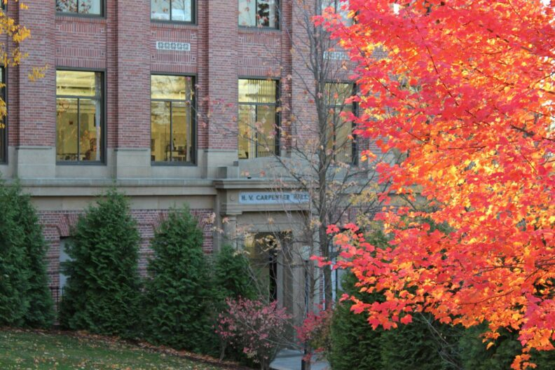
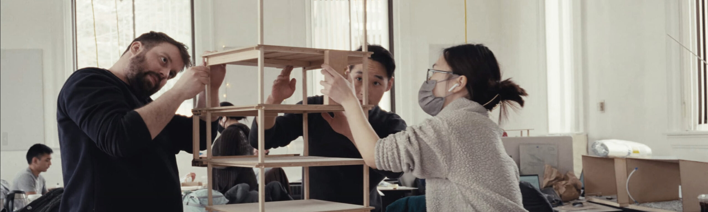
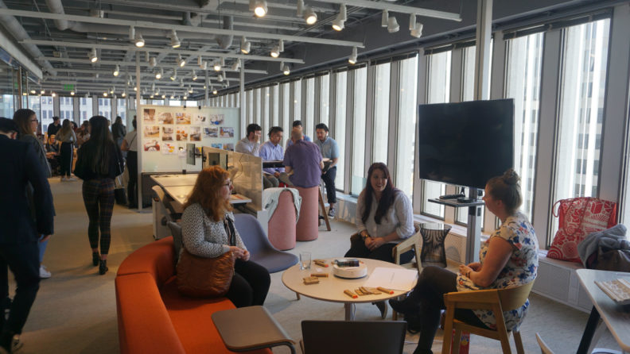

# Page Scan Report

| Field | Value |
|-------|-------|
| URL | https://sdc.wsu.edu/ |
| Title | School of Design and Construction | Washington State University |
| Status | ❌ 0 |
| HTML Size | 224.3 KB |
| Screenshots | 1 (1.6 MB) |
| Images | 3 (389.9 KB) |
| Images Missing Alt | 0 |
| JS Errors | 5 |
| JS Warnings | 1 |
| Auth | none |
| Captured | 2026-02-16T20:37:05.1544376Z |

## JavaScript Errors

- `Failed to load resource: net::ERR_SOCKET_NOT_CONNECTED`
- `Failed to load resource: net::ERR_SOCKET_NOT_CONNECTED`
- `Failed to load resource: net::ERR_SOCKET_NOT_CONNECTED`
- `Failed to load resource: net::ERR_SOCKET_NOT_CONNECTED`
- `Failed to load resource: net::ERR_SOCKET_NOT_CONNECTED`

## Actions

- Screenshot #1: page-loaded (1.6 MB)
- Downloaded 3 images to /images/

## Screenshots

### 1. page-loaded

## Page Images (3)

| # | Image | Alt Text | Size |
|---|-------|----------|------|
| 1 | [Carpenter-hall-792x528-1.jpg](images/Carpenter-hall-792x528-1.jpg) | Carpenter Hall entrance in Fall. | 114.9 KB |
| 2 | [Banner_Arch-Program-Landing-Page-scaled.jpg](images/Banner_Arch-Program-Landing-Page-scaled.jpg) | Architecture Students working on a bu... | 192.8 KB |
| 3 | [115-792x446-1.jpg](images/115-792x446-1.jpg) | Interior design students gathered at ... | 82.3 KB |

### Gallery

## Files

- `01-page-loaded.png` — page-loaded (1.6 MB)
- `page.html` — rendered HTML content
- `metadata.json` — machine-readable scan data
- `errors.log` — JavaScript console errors
- `warnings.log` — JavaScript console warnings
- `info.log` — navigation and timing details
- `actions.log` — interactions performed on the page
- `images/` — 3 page images (389.9 KB)
