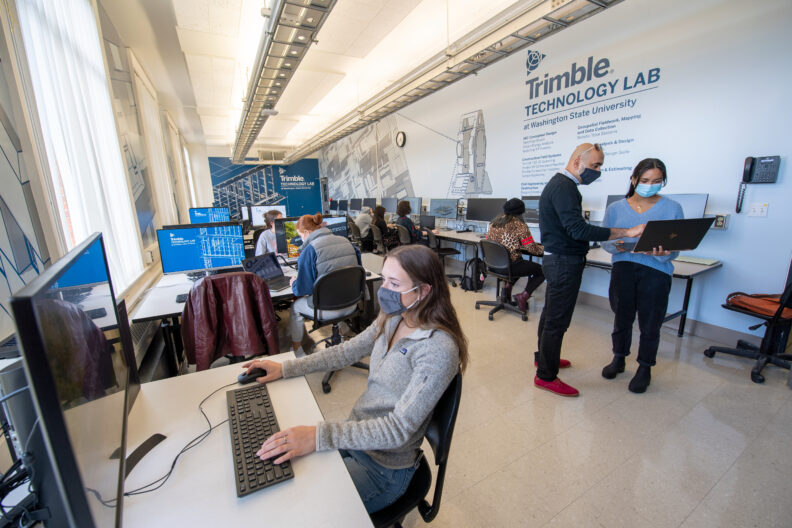
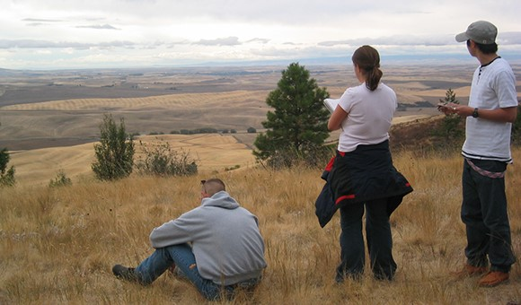

# Page Scan Report

| Field | Value |
|-------|-------|
| URL | https://sdc.wsu.edu/about/ |
| Redirected To | https://sdc.wsu.edu/about-us/ |
| Title | About Us | School of Design and Construction | Washington State University |
| Status | ❌ 0 |
| HTML Size | 213.9 KB |
| Screenshots | 1 (1.0 MB) |
| Images | 3 (272.5 KB) |
| Images Missing Alt | 0 |
| JS Errors | 0 |
| JS Warnings | 0 |
| Auth | none |
| Captured | 2026-02-16T20:38:18.2795469Z |

## Actions

- Screenshot #1: page-loaded (1.0 MB)
- Downloaded 3 images to /images/

## Screenshots

### 1. page-loaded

## Page Images (3)

| # | Image | Alt Text | Size |
|---|-------|----------|------|
| 1 | [TrimbleTechnologyLab_9732-792x528-1.jpg](images/TrimbleTechnologyLab_9732-792x528-1.jpg) | Students and faculty working in Trimb... | 108.7 KB |
| 2 | [Jason-Peschel_1030-396x594.jpg](images/Jason-Peschel_1030-396x594.jpg) | Headshot of Jason Peschel. | 107.8 KB |
| 3 | [thumbnail_Kamiak.jpg](images/thumbnail_Kamiak.jpg) | Students sketch at Kamiak Butte. | 56.0 KB |

### Gallery

## Files

- `01-page-loaded.png` — page-loaded (1.0 MB)
- `page.html` — rendered HTML content
- `metadata.json` — machine-readable scan data
- `errors.log` — JavaScript console errors
- `warnings.log` — JavaScript console warnings
- `info.log` — navigation and timing details
- `actions.log` — interactions performed on the page
- `images/` — 3 page images (272.5 KB)
