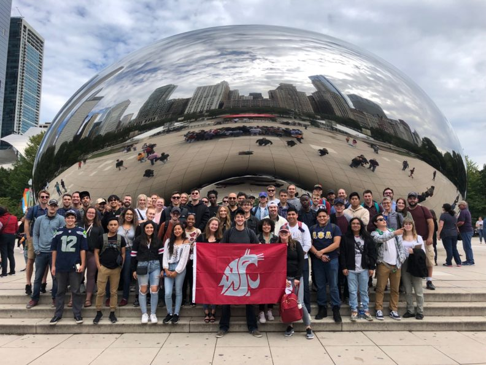

# 📄 Page Scan Report

> **URL:** https://sdc.wsu.edu/contact/  
> **Captured:** 2026-02-16 22:14:12 UTC  
> **Status:** ✅ 200  

---

## 📑 Contents

- [Summary](#-summary)
- [Screenshots](#-screenshots)
- [Page Images](#-page-images)
- [Actions](#-actions)
- [Files](#-files)

---

## 📋 Summary

| Field | Value |
|-------|-------|
| URL | https://sdc.wsu.edu/contact/ |
| Redirected To | https://sdc.wsu.edu/contact-us/ |
| Title | Contact Us | School of Design and Construction | Washington State University |
| Status | ✅ 200 |
| HTML Size | 227.2 KB |
| Screenshots | 1 (882.0 KB) |
| Images | 1 (107.5 KB) |
| Images Missing Alt | ✅ 0 |
| JS Errors | ✅ 0 |
| JS Warnings | 0 |
| Auth | none |
| Captured | 2026-02-16T22:14:12.3197734Z |

## 🔧 Actions

<strong>2 action(s) performed</strong>

- Screenshot #1: page-loaded (882.0 KB)
- Downloaded 1 images to /images/

## 📸 Screenshots

<table>
<tr>
<td align="center" width="50%">

 <strong>1. page-loaded</strong>
 882.0 KB
</td>
<td></td>
</tr>
</table>

## 🖼️ Page Images (1)

<strong>📋 Image Index</strong> — 1 images, 107.5 KB

| # | Image | Alt Text | Size |
|--:|-------|----------|-----:|
| 1 | [Chicago-2019-792x594-2.jpg](images/Chicago-2019-792x594-2.jpg) | SDC Students gathered holding a wsu f... | 107.5 KB |

<strong>🖼️ Gallery</strong>

<table>
<tr>
<td align="center" width="33%">

 Chicago-2019-792x594-2.jpg
</td>
<td></td>
<td></td>
</tr>
</table>

## 📁 Files

| File | Description |
|------|-------------|
| `01-page-loaded.png` | page-loaded (882.0 KB) |
| `page.html` | Rendered HTML content |
| `metadata.json` | Machine-readable scan data |
| `errors.log` | JavaScript console errors |
| `warnings.log` | JavaScript console warnings |
| `info.log` | Navigation and timing details |
| `actions.log` | Interactions performed |
| `images/` | 1 page images (107.5 KB) |

---

*Generated by AccessibilityScanner (FreeTools) v1.0*
