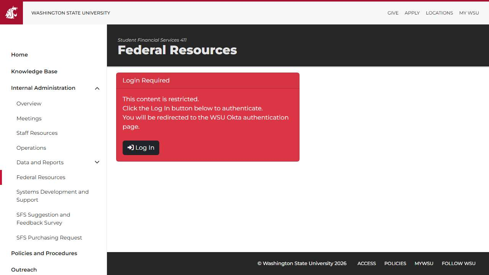
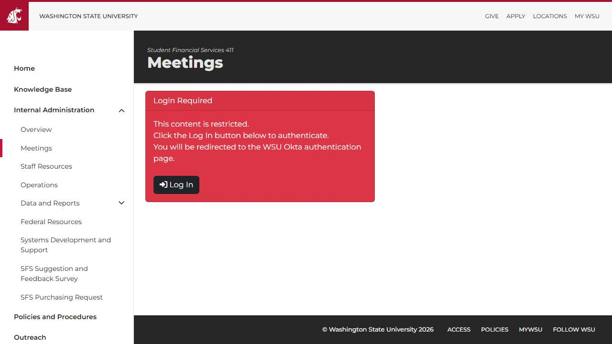
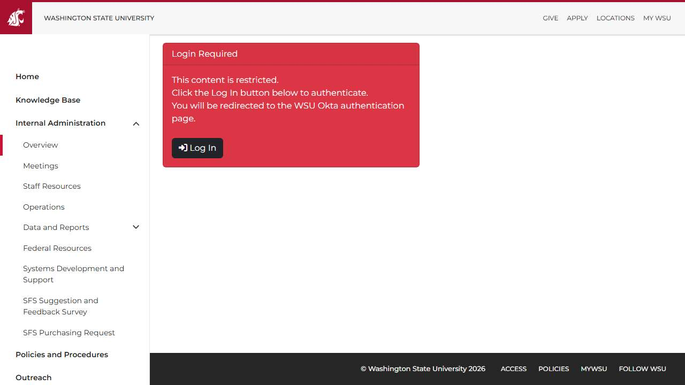
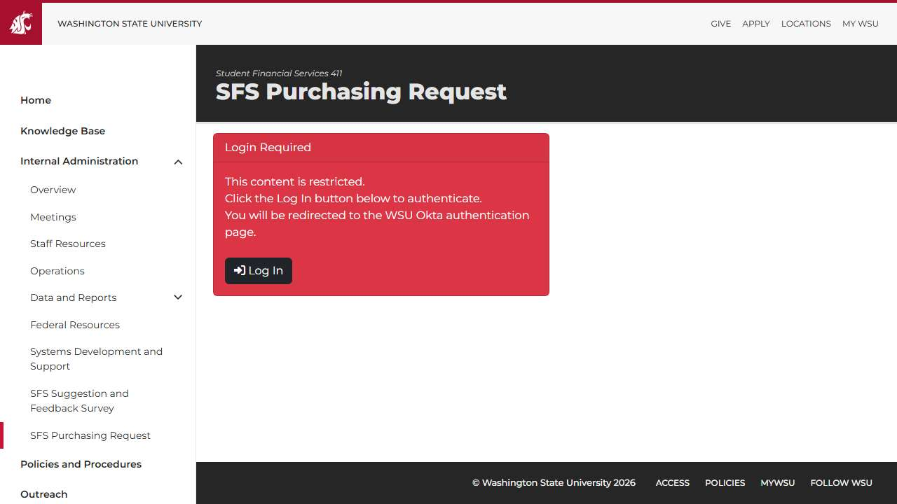
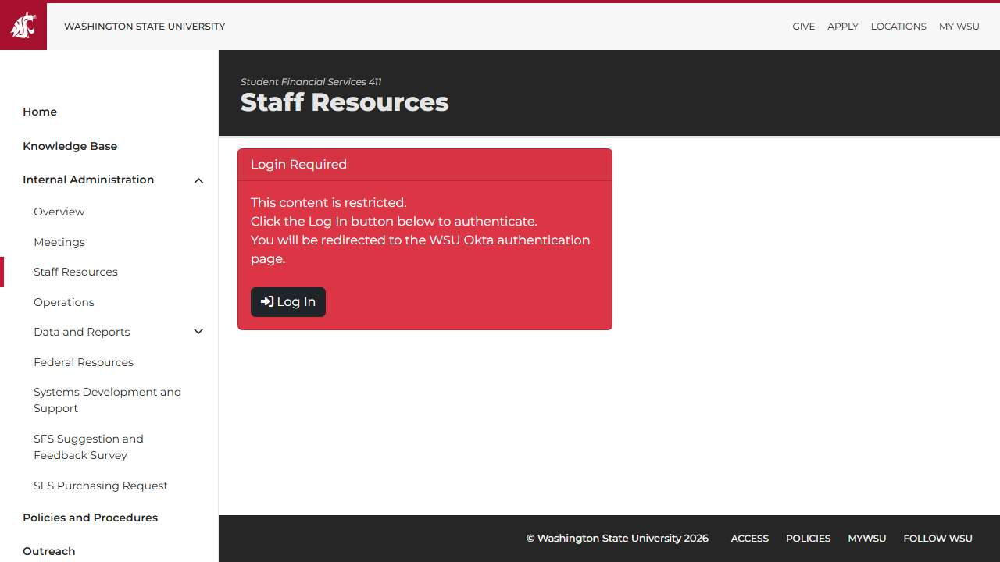
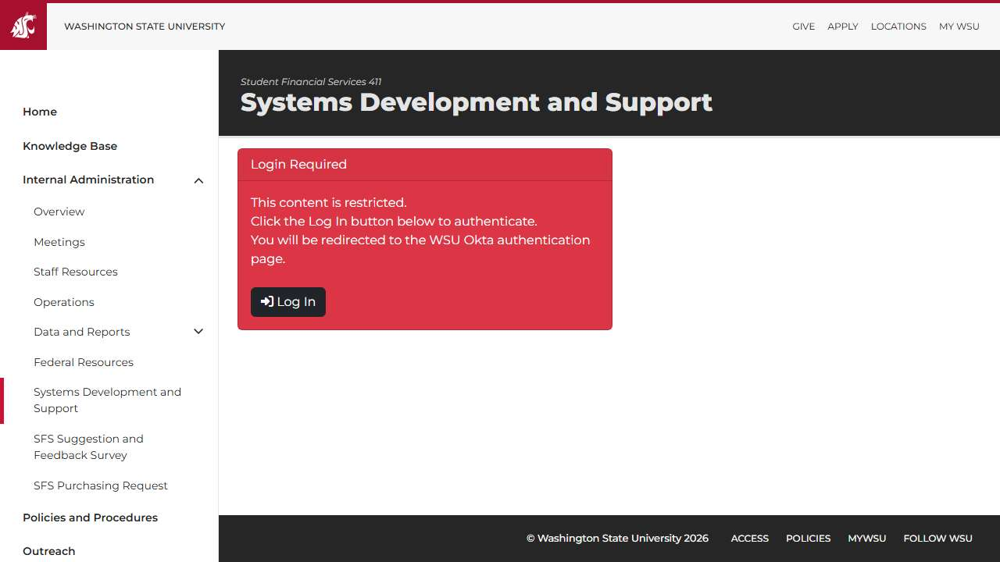
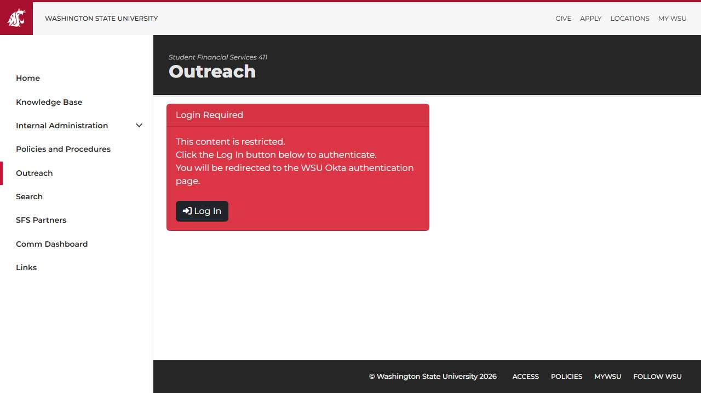
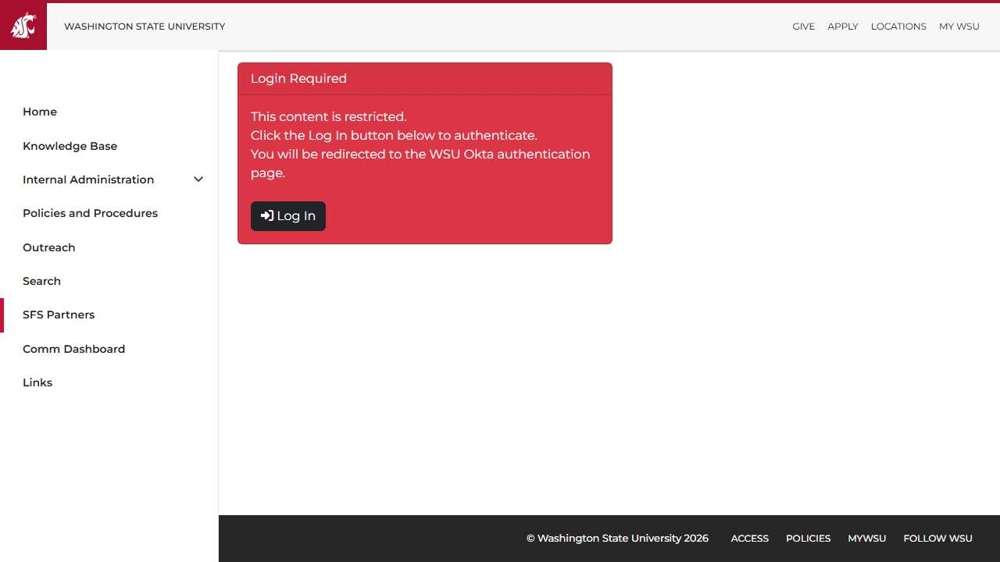

# 🌐 Site Report: https://sfs411.wsu.edu/

> **Status:** ⚠️ 0/19 pages OK  
> **Folder:** `sfs411-wsu-edu/`  

---

## 📋 Summary

```
Success Rate:  [░░░░░░░░░░░░░░░░░░░░░░░░░░░░░░] 0%
```

| Metric | Value |
|--------|-------|
| Pages Scanned | 19 |
| Pages Passed | ✅ 0 |
| Pages Failed | ❌ 19 |
| Total JS Errors | 🔴 2 |
| Total JS Warnings | 19 |
| Total Images | 0 (by URL) |
| Images Missing Alt | ✅ 0 |
| A11y Violations | ⚠️ 19 |
| 🔴 Critical | 19 |
| 🟠 Serious | 0 |
| 🟡 Moderate | 0 |
| 🔵 Minor | 0 |
| Total HTML | 11.9 MB |
| Total Screenshots | 790.6 KB |

## 🔒 SSL Certificate

| Field | Value |
|-------|-------|
| Subject | `CN=cms.em.wsu.edu, O=Washington State University, S=Washington, C=US` |
| Issuer | `CN=InCommon RSA Server CA 2, O=Internet2, C=US` |
| Valid From | 2025-03-27 |
| Expires | 🟡 2026-03-28 (37 days) |
| Algorithm | sha384RSA |
| Key Size | 2048 bits |
| Thumbprint | `422B0FF3A6D1681FE831C7FDAFEF891649B07426` |
| SANs | 89 domain(s) |

<details>
<summary><strong>Subject Alternative Names (89)</strong></summary>

| Domain | Type |
|--------|------|
| `aas.wsu.edu` | 🏫 WSU |
| `admission.em.wsu.edu` | 🏫 WSU |
| `admissions.em.wsu.edu` | 🏫 WSU |
| `admissionsdocs.wsu.edu` | 🏫 WSU |
| `afd.wsu.edu` | 🏫 WSU |
| `alaskacougs.wsu.edu` | 🏫 WSU |
| `beanoc.wsu.edu` | 🏫 WSU |
| `boisecougs.wsu.edu` | 🏫 WSU |
| `cms.em.wsu.edu` | 🏫 WSU |
| `cmstest1.em.wsu.edu` | 🏫 WSU |
| `cougarinterest.wsu.edu` | 🏫 WSU |
| `cougcompass.wsu.edu` | 🏫 WSU |
| `cougnet.wsu.edu` | 🏫 WSU |
| `counselorbreakfast.wsu.edu` | 🏫 WSU |
| `counselornews.wsu.edu` | 🏫 WSU |
| `curriculum.registrar.wsu.edu` | 🏫 WSU |
| `curriculumchange.registrar.wsu.edu` | 🏫 WSU |
| `datarequest.wsu.edu` | 🏫 WSU |
| `dcms.em.wsu.edu` | 🏫 WSU |
| `dev.finaid.wsu.edu` | 🏫 WSU |
| `divisioninfo.wsu.edu` | 🏫 WSU |
| `easternwacougs.wsu.edu` | 🏫 WSU |
| `edit.em.wsu.edu` | 🏫 WSU |
| `em.wsu.edu` | 🏫 WSU |
| `emcms.wsu.edu` | 🏫 WSU |
| `emsummit.wsu.edu` | 🏫 WSU |
| `enrollmentverification.em.wsu.edu` | 🏫 WSU |
| `fcocwaitlist.wsu.edu` | 🏫 WSU |
| `ferpa.em.wsu.edu` | 🏫 WSU |
| `finaiddev.wsu.edu` | 🏫 WSU |
| `forms.financialaid.wsu.edu` | 🏫 WSU |
| `gocougs.em.wsu.edu` | 🏫 WSU |
| `graduation.wsu.edu` | 🏫 WSU |
| `graduations.wsu.edu` | 🏫 WSU |
| `hawaiicougs.wsu.edu` | 🏫 WSU |
| `icollege.wsu.edu` | 🏫 WSU |
| `idahocougs.wsu.edu` | 🏫 WSU |
| `kelso-longviewcougs.wsu.edu` | 🏫 WSU |
| `kingcountycougs.wsu.edu` | 🏫 WSU |
| `lacougs.wsu.edu` | 🏫 WSU |
| `lvp.wsu.edu` | 🏫 WSU |
| `message.wsu.edu` | 🏫 WSU |
| `mobileapply.wsu.edu` | 🏫 WSU |
| `myfcoc.wsu.edu` | 🏫 WSU |
| `nasc.wsu.edu` | 🏫 WSU |
| `ncaastudy.wsu.edu` | 🏫 WSU |
| `norcalcougs.wsu.edu` | 🏫 WSU |
| `onsite.wsu.edu` | 🏫 WSU |
| `oregoncougs.wsu.edu` | 🏫 WSU |
| `parents.wsu.edu` | 🏫 WSU |
| `pdxcougs.wsu.edu` | 🏫 WSU |
| `peninsulacougs.wsu.edu` | 🏫 WSU |
| `recmark.wsu.edu` | 🏫 WSU |
| `registrar-dev.em.wsu.edu` | 🏫 WSU |
| `registrar.schedule.wsu.edu` | 🏫 WSU |
| `registrar.wsu.edu` | 🏫 WSU |
| `residency.wsu.edu` | 🏫 WSU |
| `ro411.em.wsu.edu` | 🏫 WSU |
| `sandiegocougs.wsu.edu` | 🏫 WSU |
| `scholars.wsu.edu` | 🏫 WSU |
| `scholarships.wsu.edu` | 🏫 WSU |
| `sfs411.wsu.edu` | 🏫 WSU |
| `sfspartners.wsu.edu` | 🏫 WSU |
| `snokingcougs.wsu.edu` | 🏫 WSU |
| `socalcougs.wsu.edu` | 🏫 WSU |
| `submitsfsdocs.wsu.edu` | 🏫 WSU |
| `summerprograms.wsu.edu` | 🏫 WSU |
| `tacomacougs.wsu.edu` | 🏫 WSU |
| `transcript.wsu.edu` | 🏫 WSU |
| `transcripts.wsu.edu` | 🏫 WSU |
| `umbraco.em.wsu.edu` | 🏫 WSU |
| `va.wsu.edu` | 🏫 WSU |
| `vancouvercougs.wsu.edu` | 🏫 WSU |
| `www.boisecougs.wsu.edu` | 🏫 WSU |
| `www.cougarquest.wsu.edu` | 🏫 WSU |
| `www.diversityeducation.wsu.edu` | 🏫 WSU |
| `www.fall-alive.wsu.edu` | 🏫 WSU |
| `www.family.wsu.edu` | 🏫 WSU |
| `www.graduation.wsu.edu` | 🏫 WSU |
| `www.idahocougs.wsu.edu` | 🏫 WSU |
| `www.kingcountycougs.wsu.edu` | 🏫 WSU |
| `www.myfcoc.wsu.edu` | 🏫 WSU |
| `www.orientation-dev.wsu.edu` | 🏫 WSU |
| `www.registrar.wsu.edu` | 🏫 WSU |
| `www.spring-orientation.wsu.edu` | 🏫 WSU |
| `www.tausigma.wsu.edu` | 🏫 WSU |
| `www.transcript.wsu.edu` | 🏫 WSU |
| `www.transcripts.wsu.edu` | 🏫 WSU |
| `www.transfer-days.wsu.edu` | 🏫 WSU |

</details>

## 📑 Pages

| Status | Page | HTTP | Title | 🔴 | 🟠 | 🟡 | 🔵 | A11y |
|:------:|------|:----:|-------|:--:|:--:|:--:|:--:|:----:|
| ❌ | [/](_root/report.md) | 0 | Student Financial Services 411 | 1 |  |  |  | ⚠️ 1 |
| ❌ | [/comm-dashboard/](comm-dashboard/report.md) | 0 | Comm Calendar \| Student Financial Se... | 1 |  |  |  | ⚠️ 1 |
| ❌ | [/internal-administration/](internal-administration/report.md) | 0 | Search \| Student Financial Services 411 | 1 |  |  |  | ⚠️ 1 |
| ❌ | [/internal-administration/data-and-reports/](internal-administration_data-and-reports/report.md) | 0 | Data and Reports \| Student Financial... | 1 |  |  |  | ⚠️ 1 |
| ❌ | [/internal-administration/data-and-reports/processing-counts/](internal-administration_data-and-reports_processing-counts/report.md) | 0 | PROCESSING COUNTS \| Student Financia... | 1 |  |  |  | ⚠️ 1 |
| ❌ | [/internal-administration/federal-resources/](internal-administration_federal-resources/report.md) | 0 | Federal Resources \| Student Financia... | 1 |  |  |  | ⚠️ 1 |
| ❌ | [/internal-administration/meetings/](internal-administration_meetings/report.md) | 0 | Meetings \| Student Financial Service... | 1 |  |  |  | ⚠️ 1 |
| ❌ | [/internal-administration/operations/](internal-administration_operations/report.md) | 0 | Operations \| Student Financial Servi... | 1 |  |  |  | ⚠️ 1 |
| ❌ | [/internal-administration/overview/](internal-administration_overview/report.md) | 0 | Overview \| Student Financial Service... | 1 |  |  |  | ⚠️ 1 |
| ❌ | [/internal-administration/sfs-purchasing-request/](internal-administration_sfs-purchasing-request/report.md) | 0 | SFS Purchasing Request \| Student Fin... | 1 |  |  |  | ⚠️ 1 |
| ❌ | [/internal-administration/sfs-suggestion-and-feedback-survey/](internal-administration_sfs-suggestion-and-feedback-survey/report.md) | 0 | SFS Suggestion and Feedback Survey \|... | 1 |  |  |  | ⚠️ 1 |
| ❌ | [/internal-administration/staff-resources/](internal-administration_staff-resources/report.md) | 0 | Staff Resources \| Student Financial ... | 1 |  |  |  | ⚠️ 1 |
| ❌ | [/internal-administration/systems-development-and-support/](internal-administration_systems-development-and-support/report.md) | 0 | Systems Development and Support \| St... | 1 |  |  |  | ⚠️ 1 |
| ❌ | [/knowledge-base/](knowledge-base/report.md) | 0 | Search \| Student Financial Services 411 | 1 |  |  |  | ⚠️ 1 |
| ❌ | [/links/](links/report.md) | 0 | Links \| Student Financial Services 411 | 1 |  |  |  | ⚠️ 1 |
| ❌ | [/outreach/](outreach/report.md) | 0 | Outreach \| Student Financial Service... | 1 |  |  |  | ⚠️ 1 |
| ❌ | [/policies-and-procedures/](policies-and-procedures/report.md) | 0 | Policies and Procedures \| Student Fi... | 1 |  |  |  | ⚠️ 1 |
| ❌ | [/search/](search/report.md) | 0 | Search \| Student Financial Services 411 | 1 |  |  |  | ⚠️ 1 |
| ❌ | [/sfs-partners/](sfs-partners/report.md) | 0 | SFS Partners \| Student Financial Ser... | 1 |  |  |  | ⚠️ 1 |

## 📸 Page Screenshots

Click any thumbnail to view the full page report.

<table>
<tr>
<td align="center" width="33%">
<a href="_root/report.md">

</a>
<br />❌ <code>/</code>
</td>
<td align="center" width="33%">
<a href="comm-dashboard/report.md">

</a>
<br />❌ <code>/comm-dashboard/</code>
</td>
<td align="center" width="33%">
<a href="internal-administration/report.md">

</a>
<br />❌ <code>/internal-administration/</code>
</td>
</tr>
<tr>
<td align="center" width="33%">
<a href="internal-administration_data-and-reports/report.md">

</a>
<br />❌ <code>/internal-administration/data-and-reports/</code>
</td>
<td align="center" width="33%">
<a href="internal-administration_data-and-reports_processing-counts/report.md">

</a>
<br />❌ <code>/internal-administration/data-and-reports/processing-counts/</code>
</td>
<td align="center" width="33%">
<a href="internal-administration_federal-resources/report.md">

</a>
<br />❌ <code>/internal-administration/federal-resources/</code>
</td>
</tr>
<tr>
<td align="center" width="33%">
<a href="internal-administration_meetings/report.md">

</a>
<br />❌ <code>/internal-administration/meetings/</code>
</td>
<td align="center" width="33%">
<a href="internal-administration_operations/report.md">

</a>
<br />❌ <code>/internal-administration/operations/</code>
</td>
<td align="center" width="33%">
<a href="internal-administration_overview/report.md">

</a>
<br />❌ <code>/internal-administration/overview/</code>
</td>
</tr>
<tr>
<td align="center" width="33%">
<a href="internal-administration_sfs-purchasing-request/report.md">

</a>
<br />❌ <code>/internal-administration/sfs-purchasing-request/</code>
</td>
<td align="center" width="33%">
<a href="internal-administration_sfs-suggestion-and-feedback-survey/report.md">

</a>
<br />❌ <code>/internal-administration/sfs-suggestion-and-feedback-survey/</code>
</td>
<td align="center" width="33%">
<a href="internal-administration_staff-resources/report.md">

</a>
<br />❌ <code>/internal-administration/staff-resources/</code>
</td>
</tr>
<tr>
<td align="center" width="33%">
<a href="internal-administration_systems-development-and-support/report.md">

</a>
<br />❌ <code>/internal-administration/systems-development-and-support/</code>
</td>
<td align="center" width="33%">
<a href="knowledge-base/report.md">

</a>
<br />❌ <code>/knowledge-base/</code>
</td>
<td align="center" width="33%">
<a href="links/report.md">

</a>
<br />❌ <code>/links/</code>
</td>
</tr>
<tr>
<td align="center" width="33%">
<a href="outreach/report.md">

</a>
<br />❌ <code>/outreach/</code>
</td>
<td align="center" width="33%">
<a href="policies-and-procedures/report.md">

</a>
<br />❌ <code>/policies-and-procedures/</code>
</td>
<td align="center" width="33%">
<a href="search/report.md">

</a>
<br />❌ <code>/search/</code>
</td>
</tr>
<tr>
<td align="center" width="33%">
<a href="sfs-partners/report.md">

</a>
<br />❌ <code>/sfs-partners/</code>
</td>
<td></td>
<td></td>
</tr>
</table>

## ❌ Failed Pages

<details open>
<summary><strong>19 page(s) failed</strong></summary>

| Page | HTTP | Error |
|------|:----:|-------|
| [/](_root/report.md) | 0 | — |
| [/comm-dashboard/](comm-dashboard/report.md) | 0 | — |
| [/internal-administration/](internal-administration/report.md) | 0 | — |
| [/internal-administration/data-and-reports/](internal-administration_data-and-reports/report.md) | 0 | — |
| [/internal-administration/data-and-reports/processing-counts/](internal-administration_data-and-reports_processing-counts/report.md) | 0 | — |
| [/internal-administration/federal-resources/](internal-administration_federal-resources/report.md) | 0 | — |
| [/internal-administration/meetings/](internal-administration_meetings/report.md) | 0 | — |
| [/internal-administration/operations/](internal-administration_operations/report.md) | 0 | — |
| [/internal-administration/overview/](internal-administration_overview/report.md) | 0 | — |
| [/internal-administration/sfs-purchasing-request/](internal-administration_sfs-purchasing-request/report.md) | 0 | — |
| [/internal-administration/sfs-suggestion-and-feedback-survey/](internal-administration_sfs-suggestion-and-feedback-survey/report.md) | 0 | — |
| [/internal-administration/staff-resources/](internal-administration_staff-resources/report.md) | 0 | — |
| [/internal-administration/systems-development-and-support/](internal-administration_systems-development-and-support/report.md) | 0 | — |
| [/knowledge-base/](knowledge-base/report.md) | 0 | — |
| [/links/](links/report.md) | 0 | — |
| [/outreach/](outreach/report.md) | 0 | — |
| [/policies-and-procedures/](policies-and-procedures/report.md) | 0 | — |
| [/search/](search/report.md) | 0 | — |
| [/sfs-partners/](sfs-partners/report.md) | 0 | — |

</details>

## 🔴 JavaScript Errors

<details>
<summary><strong>2 error(s) across 2 page(s)</strong></summary>

**/internal-administration/** (1 errors)

```
Font Awesome Kit: TypeError: Failed to fetch
```

**/knowledge-base/** (1 errors)

```
Font Awesome Kit: TypeError: Failed to fetch
```

</details>

## ♿ Accessibility Summary

| Metric | Value |
|--------|-------|
| Pages with violations | 19/19 |
| Total violations | 19 |
| 🔴 Critical | 19 |
| 🟠 Serious | 0 |
| 🟡 Moderate | 0 |
| 🔵 Minor | 0 |

### Top 1 Issues

| # | Rule | Sev | Pages | Instances |
|--:|------|:---:|:-----:|:---------:|
| 1 | [aria-allowed-attr](../a11y-rules.md#aria-allowed-attr) | 🔴 | 19/19 | 19 |

---

*Generated by AccessibilityScanner (FreeTools) v1.0*
