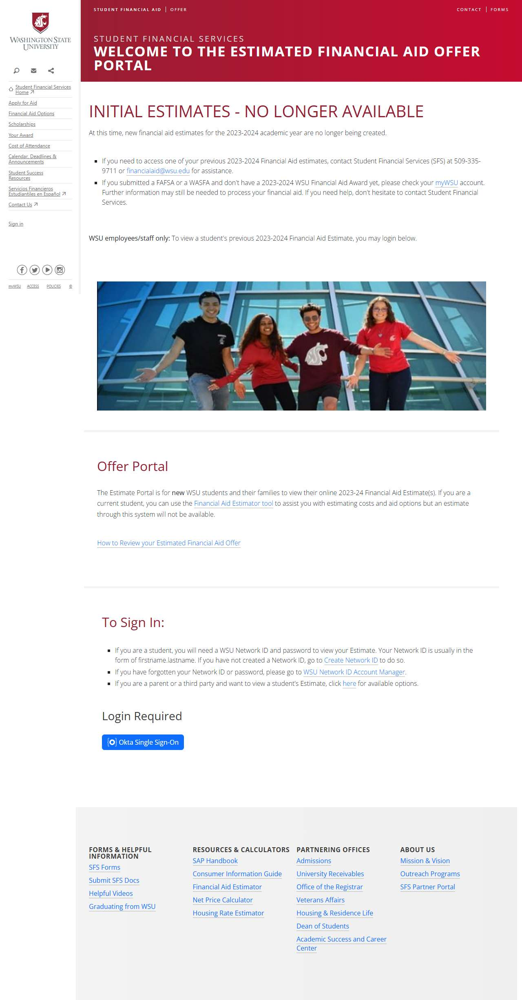

# 📄 Page Scan Report

> **URL:** https://sfsapps.em.wsu.edu/Compass  
> **Captured:** 2026-02-18 18:45:36 UTC  
> **Status:** ✅ 200  

---

## 📑 Contents

- [Summary](#-summary)
- [Screenshots](#-screenshots)
- [Page Images](#-page-images)
- [JavaScript Errors](#-javascript-errors)
- [Accessibility](#-accessibility)
- [Actions](#-actions)
- [Files](#-files)

---

## 📋 Summary

| Field | Value |
|-------|-------|
| URL | https://sfsapps.em.wsu.edu/Compass |
| Title | Login | Student Financial Aid | Washington State University |
| Status | ✅ 200 |
| HTML Size | 46.9 KB |
| Screenshots | 1 (187.1 KB) |
| Images | 1 (referenced by URL) |
| Images Missing Alt | ⚠️ 1 |
| JS Errors | 🔴 17 |
| JS Warnings | 1 |
| A11y Violations | ⚠️ 6 |
| 🔴 Critical | 1 |
| 🟠 Serious | 5 |
| 🟡 Moderate | 0 |
| 🔵 Minor | 0 |
| Tools Run | axe, htmlcheck |
| Auth | none |
| Captured | 2026-02-18T18:45:36.4208092Z |

## 🔴 JavaScript Errors

<details>
<summary><strong>17 error(s) detected</strong></summary>

```
Refused to apply style from 'https://cms.em.wsu.edu/css/mobileForms.css' because its MIME type ('') is not a supported stylesheet MIME type, and strict MIME checking is enabled.
Access to XMLHttpRequest at 'https://financialaid.wsu.edu/wp-content/plugins/tablepress-datatables-buttons/css/buttons.dataTables.min.css?ver=1.0' from origin 'https://sfsapps.em.wsu.edu' has been blo...
Failed to load resource: net::ERR_FAILED
Access to XMLHttpRequest at 'https://financialaid.wsu.edu/wp-content/plugins/tablepress-responsive-tables/css/responsive.dataTables.min.css?ver=1.3' from origin 'https://sfsapps.em.wsu.edu' has been b...
Failed to load resource: net::ERR_FAILED
Access to XMLHttpRequest at 'https://financialaid.wsu.edu/wp-content/plugins/tablepress/css/default.min.css?ver=1.9' from origin 'https://sfsapps.em.wsu.edu' has been blocked by CORS policy: No 'Acces...
Failed to load resource: net::ERR_FAILED
Access to XMLHttpRequest at 'https://repo.wsu.edu/spine/1/spine.min.css?ver=0.29.0-1.7.5-43297' from origin 'https://sfsapps.em.wsu.edu' has been blocked by CORS policy: No 'Access-Control-Allow-Origi...
Failed to load resource: net::ERR_FAILED
Access to XMLHttpRequest at 'https://financialaid.wsu.edu/wp-content/themes/spine/style.css?ver=0.29.0-1.7.5-43297' from origin 'https://sfsapps.em.wsu.edu' has been blocked by CORS policy: No 'Access...
Failed to load resource: net::ERR_FAILED
Access to XMLHttpRequest at 'https://financialaid.wsu.edu/wp-content/themes/wsu-student-financial-services/style.css?ver=0.1.3' from origin 'https://sfsapps.em.wsu.edu' has been blocked by CORS policy...
Failed to load resource: net::ERR_FAILED
Access to XMLHttpRequest at 'https://financialaid.wsu.edu/?custom-css=1&csblog=227&cscache=6&csrev=351&ver=0.29.0-1.7.5-43297' from origin 'https://sfsapps.em.wsu.edu' has been blocked by CORS policy:...
Failed to load resource: net::ERR_FAILED
Access to XMLHttpRequest at 'https://financialaid.wsu.edu/wp-content/plugins/tablepress-responsive-tables/css/tablepress-responsive-flip.min.css?ver=1.3' from origin 'https://sfsapps.em.wsu.edu' has b...
Failed to load resource: net::ERR_FAILED
```

</details>

## 🔧 Actions

<details>
<summary><strong>4 action(s) performed</strong></summary>

- Screenshot #1: page-loaded (187.1 KB)
- Cataloged 1 images by URL (no download)
- axe-core: 2 violations (149ms)
- htmlcheck: 4 violations (0ms)

</details>

## 📸 Screenshots

<table>
<tr>
<td align="center" width="50%">
<a href="01-page-loaded.jpg">

</a>
<br /><strong>1. page-loaded</strong>
<br /><sub>187.1 KB</sub>
</td>
<td></td>
</tr>
</table>

## 🖼️ Page Images (1)

<details open>
<summary><strong>📋 Image Index</strong> — 1 images (referenced by URL)</summary>

| # | Source URL | Alt Text |
|--:|-----------|----------|
| 1 | https://sfsapps.em.wsu.edu/Compass/Content/images/EstimateGraphic2.jpg | ⚠️ *(missing)* |

</details>

<details open>
<summary><strong>🖼️ Gallery</strong></summary>

<table>
<tr>
<td align="center" width="33%">
<a href="https://sfsapps.em.wsu.edu/Compass/Content/images/EstimateGraphic2.jpg">

</a>
<br /><sub>https://sfsapps.em.wsu.edu/Compass/Content/imag... ⚠️</sub>
</td>
<td></td>
<td></td>
</tr>
</table>

</details>

<details>
<summary>⚠️ <strong>Images Missing Alt Text</strong> (1)</summary>

| # | Source URL |
|--:|-----------|
| 1 | https://sfsapps.em.wsu.edu/Compass/Content/images/EstimateGraphic2.jpg |

</details>

## ♿ Accessibility

### Summary

| Severity | axe | htmlcheck |
|----------|:---:|:---:|
| 🔴 critical | 1 | 0 |
| 🟠 serious | 1 | 4 |
| 🟡 moderate | 0 | 0 |
| 🔵 minor | 0 | 0 |
| **Total** | **2** | **4** |

### Violations by Confidence

<details open>
<summary><strong>3 rule(s) violated</strong></summary>

| # | Rule | Sev | Confidence | axe | htmlcheck | Example |
|--:|------|:---:|:----------:|:---:|:---:|---------|
| 1 | image-alt | 🔴 | 🟢 2/2 | ⚠️ | ⚠️ | `

> **Note:** Automated scanning catches ~30-60% of WCAG issues. Manual keyboard and screen reader testing is still required for full compliance.

## 📁 Files

| File | Description |
|------|-------------|
| `01-page-loaded.jpg` | page-loaded (187.1 KB) |
| `page.html` | Rendered HTML content |
| `metadata.json` | Machine-readable scan data |
| `errors.log` | JavaScript console errors |
| `warnings.log` | JavaScript console warnings |
| `info.log` | Navigation and timing details |
| `actions.log` | Interactions performed |
| `a11y-axe.json` | axe accessibility results |
| `a11y-htmlcheck.json` | htmlcheck accessibility results |
| `a11y-summary.json` | Merged cross-tool accessibility summary |

---

*Generated by AccessibilityScanner (FreeTools) v1.0*
