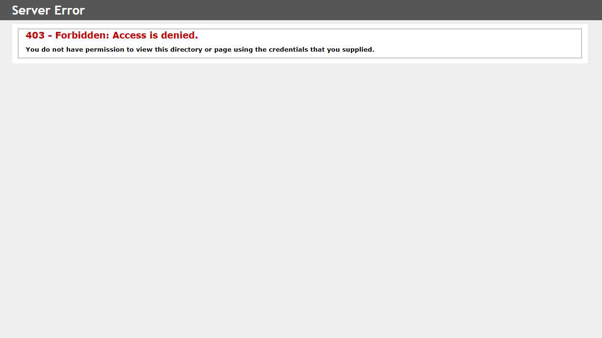
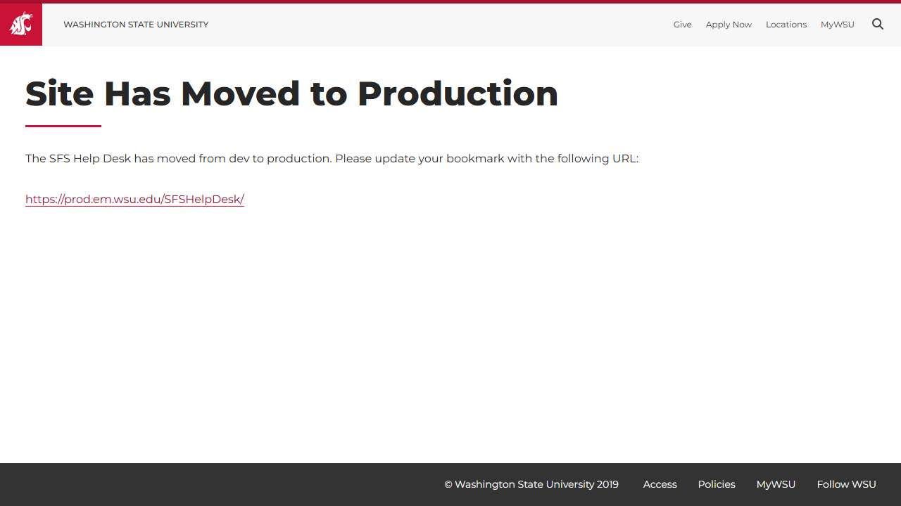
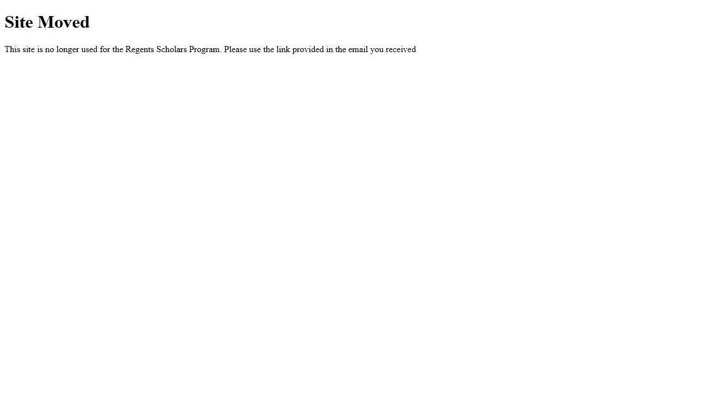

# 🌐 Site Report: https://sfsapps.em.wsu.edu/

> **Status:** ⚠️ 1/4 pages OK  
> **Folder:** `sfsapps-em-wsu-edu/`  

---

## 📋 Summary

```
Success Rate:  [███████░░░░░░░░░░░░░░░░░░░░░░░] 25%
```

| Metric | Value |
|--------|-------|
| Pages Scanned | 4 |
| Pages Passed | ✅ 1 |
| Pages Failed | ❌ 3 |
| Total JS Errors | 🔴 22 |
| Total JS Warnings | 2 |
| Total Images | 1 (by URL) |
| Images Missing Alt | ⚠️ 1 |
| A11y Violations | ⚠️ 20 |
| 🔴 Critical | 1 |
| 🟠 Serious | 11 |
| 🟡 Moderate | 6 |
| 🔵 Minor | 2 |
| Total HTML | 54.5 KB |
| Total Screenshots | 257.2 KB |

## 🔒 SSL Certificate

| Field | Value |
|-------|-------|
| Subject | `CN=sfsapps.em.wsu.edu, O=Washington State University, S=Washington, C=US` |
| Issuer | `CN=InCommon RSA Server CA 2, O=Internet2, C=US` |
| Valid From | 2026-01-11 |
| Expires | 🟢 2027-01-12 (327 days) |
| Algorithm | sha256RSA |
| Key Size | 2048 bits |
| Thumbprint | `4D2478FCF97BC753A8F8D913CABE8C19FD1D7E76` |
| SANs | 1 domain(s) |

<details>
<summary><strong>Subject Alternative Names (1)</strong></summary>

| Domain | Type |
|--------|------|
| `sfsapps.em.wsu.edu` | 🏫 WSU |

</details>

## 📑 Pages

| Status | Page | HTTP | Title | 🔴 | 🟠 | 🟡 | 🔵 | A11y |
|:------:|------|:----:|-------|:--:|:--:|:--:|:--:|:----:|
| ❌ | [/](_root/report.md) | 403 | 403 - Forbidden: Access is denied. |  | 2 | 2 | 1 | ⚠️ 5 |
| ✅ | [/Compass](Compass/report.md) | 200 | Login \| Student Financial Aid \| Was... | 1 | 5 |  |  | ⚠️ 6 |
| ❌ | [/LineManager](LineManager/report.md) | 503 | Site Moved to Production |  | 4 | 2 |  | ⚠️ 6 |
| ❌ | [/RSP](RSP/report.md) | 503 | Site Moved |  |  | 2 | 1 | ⚠️ 3 |

## 📸 Page Screenshots

Click any thumbnail to view the full page report.

<table>
<tr>
<td align="center" width="33%">
<a href="_root/report.md">

</a>
<br />❌ <code>/</code>
</td>
<td align="center" width="33%">
<a href="Compass/report.md">

</a>
<br />✅ <code>/Compass</code>
</td>
<td align="center" width="33%">
<a href="LineManager/report.md">

</a>
<br />❌ <code>/LineManager</code>
</td>
</tr>
<tr>
<td align="center" width="33%">
<a href="RSP/report.md">

</a>
<br />❌ <code>/RSP</code>
</td>
<td></td>
<td></td>
</tr>
</table>

## ❌ Failed Pages

<details open>
<summary><strong>3 page(s) failed</strong></summary>

| Page | HTTP | Error |
|------|:----:|-------|
| [/](_root/report.md) | 403 | — |
| [/LineManager](LineManager/report.md) | 503 | — |
| [/RSP](RSP/report.md) | 503 | — |

</details>

## 🔴 JavaScript Errors

<details>
<summary><strong>22 error(s) across 4 page(s)</strong></summary>

**/Compass** (17 errors)

```
Refused to apply style from 'https://cms.em.wsu.edu/css/mobileForms.css' because its MIME type ('') is not a supported stylesheet MIME type, and strict MIME checking is enabled.
Access to XMLHttpRequest at 'https://financialaid.wsu.edu/wp-content/plugins/tablepress-datatables-buttons/css/buttons.dataTables.min.css?ver=1.0' from origin 'https://sfsapps.em.wsu.edu' has been blo...
Failed to load resource: net::ERR_FAILED
Access to XMLHttpRequest at 'https://financialaid.wsu.edu/wp-content/plugins/tablepress-responsive-tables/css/responsive.dataTables.min.css?ver=1.3' from origin 'https://sfsapps.em.wsu.edu' has been b...
Failed to load resource: net::ERR_FAILED
... and 12 more (see Compass/errors.log)
```

**/LineManager** (3 errors)

```
Failed to load resource: the server responded with a status of 503 ()
Access to XMLHttpRequest at 'https://cdn-web-wsu.s3-us-west-2.amazonaws.com/designsystem/1.x/build/dist/wsu-design-system.bundle.dist.css' from origin 'https://sfsapps.em.wsu.edu' has been blocked by ...
Failed to load resource: net::ERR_FAILED
```

**/** (1 errors)

```
Failed to load resource: the server responded with a status of 403 ()
```

**/RSP** (1 errors)

```
Failed to load resource: the server responded with a status of 503 ()
```

</details>

## ♿ Accessibility Summary

| Metric | Value |
|--------|-------|
| Pages with violations | 4/4 |
| Total violations | 20 |
| 🔴 Critical | 1 |
| 🟠 Serious | 11 |
| 🟡 Moderate | 6 |
| 🔵 Minor | 2 |

### Top 8 Issues

| # | Rule | Sev | Pages | Instances |
|--:|------|:---:|:-----:|:---------:|
| 1 | image-alt | 🔴 | 1/4 | 4 |
| 2 | html-has-lang | 🟠 | 1/4 | 2 |
| 3 | link-name | 🟠 | 2/4 | 3 |
| 4 | button-name | 🟠 | 1/4 | 2 |
| 5 | label | 🟠 | 1/4 | 1 |
| 6 | skip-link | 🟡 | 3/4 | 3 |
| 7 | landmark-one-main | 🟡 | 3/4 | 3 |
| 8 | landmark-nav | 🔵 | 2/4 | 2 |

---

*Generated by AccessibilityScanner (FreeTools) v1.0*
