# 📄 Page Scan Report

> **URL:** https://slcr.wsu.edu/faculty/  
> **Captured:** 2026-02-16 22:13:59 UTC  
> **Status:** ✅ 200  

---

## 📑 Contents

- [Summary](#-summary)
- [Screenshots](#-screenshots)
- [Page Images](#-page-images)
- [Actions](#-actions)
- [Files](#-files)

---

## 📋 Summary

| Field | Value |
|-------|-------|
| URL | https://slcr.wsu.edu/faculty/ |
| Title | Faculty | School of Languages, Cultures, and Race | Washington State University |
| Status | ✅ 200 |
| HTML Size | 84.5 KB |
| Screenshots | 1 (1.4 MB) |
| Images | 37 (13.8 MB) |
| Images Missing Alt | ⚠️ 12 |
| JS Errors | ✅ 0 |
| JS Warnings | 0 |
| Auth | none |
| Captured | 2026-02-16T22:13:59.2340061Z |

## 🔧 Actions

<strong>2 action(s) performed</strong>

- Screenshot #1: page-loaded (1.4 MB)
- Downloaded 37 images to /images/

## 📸 Screenshots

<table>
<tr>
<td align="center" width="50%">

 <strong>1. page-loaded</strong>
 1.4 MB
</td>
<td></td>
</tr>
</table>

## 🖼️ Page Images (37)

<strong>📋 Image Index</strong> — 37 images, 13.8 MB

| # | Image | Alt Text | Size |
|--:|-------|----------|-----:|
| 1 | [Reho-Abo-e1595968250937.jpg](images/Reho-Abo-e1595968250937.jpg) | Reho Abo | 62.2 KB |
| 2 | [arellanos-scaled-e1726071896479-396x548.jpg](images/arellanos-scaled-e1726071896479-396x548.jpg) | ⚠️ *(missing)* | 18.3 KB |
| 3 | [Etna-Avalos-WSU-e1725554665121-396x487.jpg](images/Etna-Avalos-WSU-e1725554665121-396x487.jpg) | ⚠️ *(missing)* | 27.5 KB |
| 4 | [Mary-non-head.jpg](images/Mary-non-head.jpg) | Mary K. Bloodsworth-Lugo | 195.8 KB |
| 5 | [IMG_0622-scaled.jpg](images/IMG_0622-scaled.jpg) | Joshua Bonzo | 598.9 KB |
| 6 | [IMG_0624-scaled.jpg](images/IMG_0624-scaled.jpg) | Weiguo Cao | 554.0 KB |
| 7 | [SabineDavis-88x106.jpg](images/SabineDavis-88x106.jpg) | Sabine Davis | 26.4 KB |
| 8 | [bio-photo.jpg](images/bio-photo.jpg) | Samuel Ginsburg | 14.4 KB |
| 9 | [Lisa-Guerrero.jpg](images/Lisa-Guerrero.jpg) | Lisa Guerrero | 112.8 KB |
| 10 | [20230519_1451272-scaled-e1725555299646-396x503.jpg](images/20230519_1451272-scaled-e1725555299646-396x503.jpg) | ⚠️ *(missing)* | 33.6 KB |
| 11 | [Mike-Hubert-1-scaled.jpg](images/Mike-Hubert-1-scaled.jpg) | Michael Hubert | 710.0 KB |
| 12 | [IMG_0626-e1562861478724.jpg](images/IMG_0626-e1562861478724.jpg) | Amanda Hussain | 1.8 MB |
| 13 | [IMG_0046-scaled.jpg](images/IMG_0046-scaled.jpg) | Xinmin Liu | 843.9 KB |
| 14 | [IMG_4231-scaled.jpg](images/IMG_4231-scaled.jpg) |  Carmen R. Lugo-Lugo  | 489.0 KB |
| 15 | [Amy.jpg](images/Amy.jpg) | Amy Matsumoto | 103.6 KB |
| 16 | [vilma-noche-vieja-2021-en-chile.jpg](images/vilma-noche-vieja-2021-en-chile.jpg) | Vilma Navarro-Daniels | 81.3 KB |
| 17 | [IMG_0618-scaled.jpg](images/IMG_0618-scaled.jpg) | Kayo Niimi | 544.1 KB |
| 18 | [Joseba_Guerrero.jpg](images/Joseba_Guerrero.jpg) | Joseba Perez | 38.7 KB |
| 19 | [Sere-Previto-scaled.jpg](images/Sere-Previto-scaled.jpg) | Maria Serenella Previto | 563.3 KB |
| 20 | [20250121_154350-396x528.jpg](images/20250121_154350-396x528.jpg) | Begoña de Quintana Lasa | 69.6 KB |
| 21 | [image-91-396x495.png](images/image-91-396x495.png) | ⚠️ *(missing)* | 247.6 KB |
| 22 | [jeannie-396x527.jpg](images/jeannie-396x527.jpg) | ⚠️ *(missing)* | 50.8 KB |
| 23 | [Collin-Shull.jpg](images/Collin-Shull.jpg) | Collin Schull. | 2.6 MB |
| 24 | [JohnStreamas-88x106.jpg](images/JohnStreamas-88x106.jpg) | John Streamas. | 24.0 KB |
| 25 | [Montmartre2-396x528.jpg](images/Montmartre2-396x528.jpg) | ⚠️ *(missing)* | 54.9 KB |
| 26 | [Prof-X_Go-Cougs_tall_.jpg](images/Prof-X_Go-Cougs_tall_.jpg) | R. Xach Williams | 718.7 KB |
| 27 | [Bio-Photo-1.jpg](images/Bio-Photo-1.jpg) | Raelene Wyse | 700.4 KB |
| 28 | [black-mark.jpg](images/black-mark.jpg) | Mark Black | 433.3 KB |
| 29 | [PuckBrecher-e1535573960127-scaled.jpg](images/PuckBrecher-e1535573960127-scaled.jpg) | Puck Brecher | 619.0 KB |
| 30 | [Amir-Gilmore-Fall-2021-COE_3270-1188x792-1.jpg](images/Amir-Gilmore-Fall-2021-COE_3270-1188x792-1.jpg) | Amir Gilmore | 149.6 KB |
| 31 | [Sutton-2.jpg](images/Sutton-2.jpg) | Matthew A. Sutton | 110.9 KB |
| 32 | [IMG_1654.jpg](images/IMG_1654.jpg) | ⚠️ *(missing)* | 235.2 KB |
| 33 | [ingemanson_birgitta.jpg](images/ingemanson_birgitta.jpg) | ⚠️ *(missing)* | 45.2 KB |
| 34 | [IMG_0617-scaled.jpg](images/IMG_0617-scaled.jpg) | ⚠️ *(missing)* | 979.8 KB |
| 35 | [RoryOng-88x106.jpg](images/RoryOng-88x106.jpg) | ⚠️ *(missing)* | 18.6 KB |
| 36 | [AnaMariaVivaldi-88x106.jpg](images/AnaMariaVivaldi-88x106.jpg) | ⚠️ *(missing)* | 31.3 KB |
| 37 | [IMG_0609-396x264.jpg](images/IMG_0609-396x264.jpg) | ⚠️ *(missing)* | 56.2 KB |

<strong>🖼️ Gallery</strong>

<table>
<tr>
<td align="center" width="33%">

 Reho-Abo-e1595968250937.jpg
</td>
<td align="center" width="33%">
<a href="images/arellanos-scaled-e1726071896479-396x548.jpg">
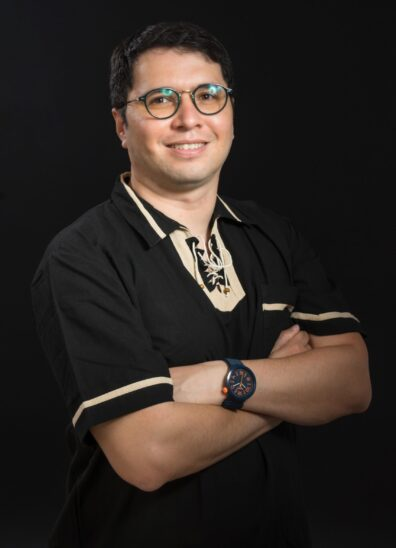
</a>
 arellanos-scaled-e1726071896479-396x548.jpg ⚠️
</td>
<td align="center" width="33%">

 Etna-Avalos-WSU-e1725554665121-396x487.jpg ⚠️
</td>
</tr>
<tr>
<td align="center" width="33%">
<a href="images/Mary-non-head.jpg">
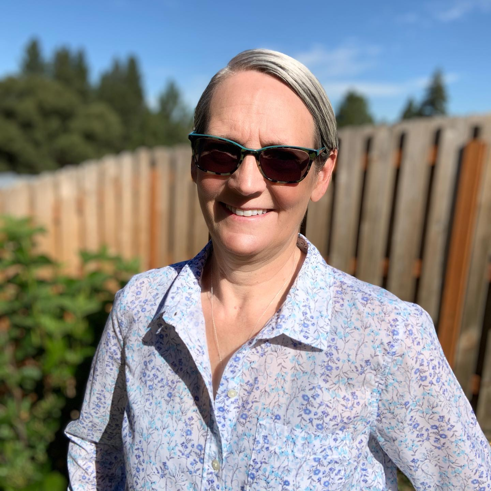
</a>
 Mary-non-head.jpg
</td>
<td align="center" width="33%">
<a href="images/IMG_0622-scaled.jpg">
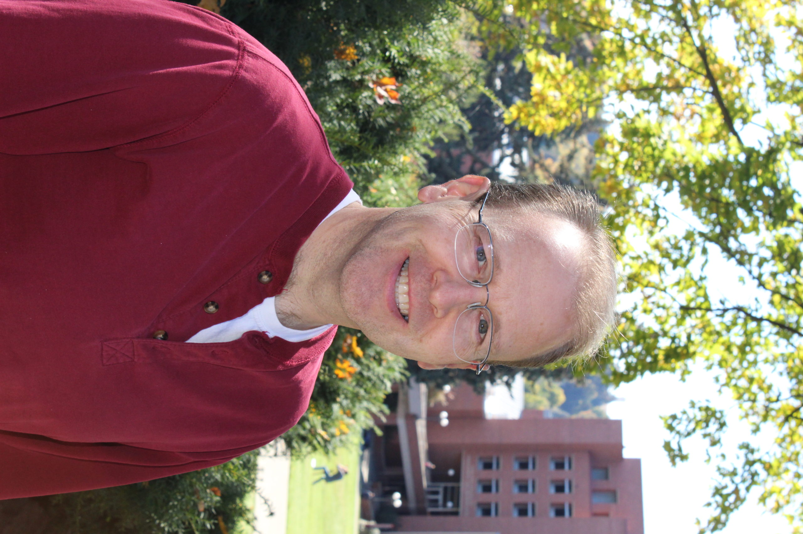
</a>
 IMG_0622-scaled.jpg
</td>
<td align="center" width="33%">

 IMG_0624-scaled.jpg
</td>
</tr>
<tr>
<td align="center" width="33%">

 SabineDavis-88x106.jpg
</td>
<td align="center" width="33%">

 bio-photo.jpg
</td>
<td align="center" width="33%">

 Lisa-Guerrero.jpg
</td>
</tr>
<tr>
<td align="center" width="33%">
<a href="images/20230519_1451272-scaled-e1725555299646-396x503.jpg">
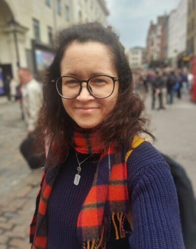
</a>
 20230519_1451272-scaled-e1725555299646-396x503.jpg ⚠️
</td>
<td align="center" width="33%">

 Mike-Hubert-1-scaled.jpg
</td>
<td align="center" width="33%">

 IMG_0626-e1562861478724.jpg
</td>
</tr>
<tr>
<td align="center" width="33%">
<a href="images/IMG_0046-scaled.jpg">
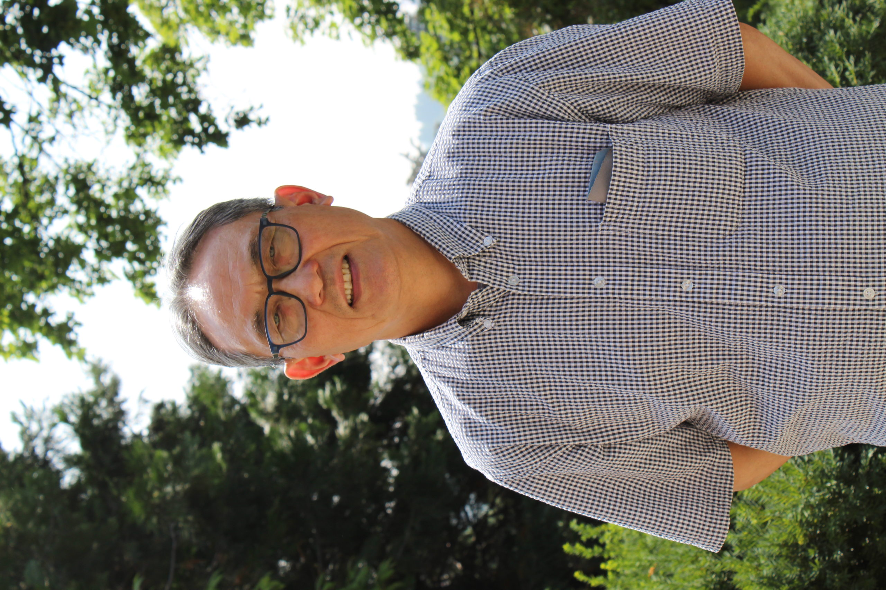
</a>
 IMG_0046-scaled.jpg
</td>
<td align="center" width="33%">

 IMG_4231-scaled.jpg
</td>
<td align="center" width="33%">
<a href="images/Amy.jpg">
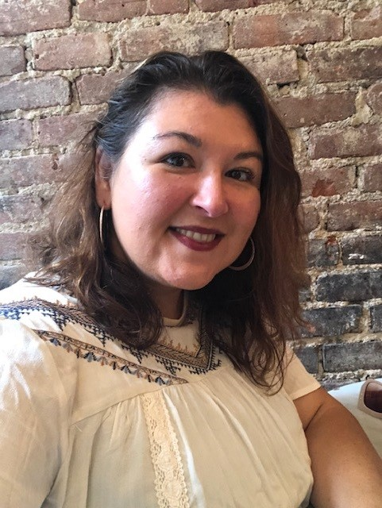
</a>
 Amy.jpg
</td>
</tr>
<tr>
<td align="center" width="33%">

 vilma-noche-vieja-2021-en-chile.jpg
</td>
<td align="center" width="33%">
<a href="images/IMG_0618-scaled.jpg">
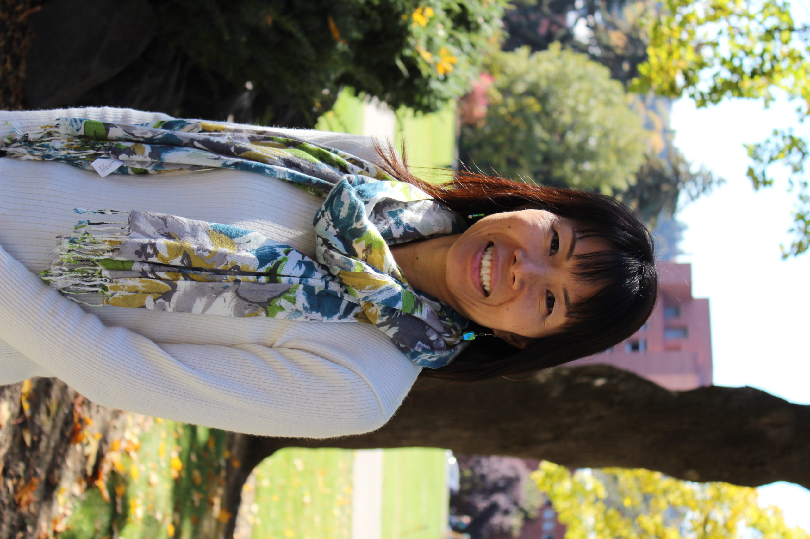
</a>
 IMG_0618-scaled.jpg
</td>
<td align="center" width="33%">

 Joseba_Guerrero.jpg
</td>
</tr>
<tr>
<td align="center" width="33%">

 Sere-Previto-scaled.jpg
</td>
<td align="center" width="33%">
<a href="images/20250121_154350-396x528.jpg">
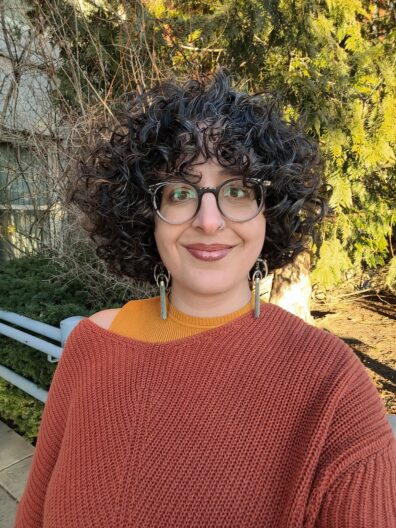
</a>
 20250121_154350-396x528.jpg
</td>
<td align="center" width="33%">

 image-91-396x495.png ⚠️
</td>
</tr>
<tr>
<td align="center" width="33%">
<a href="images/jeannie-396x527.jpg">
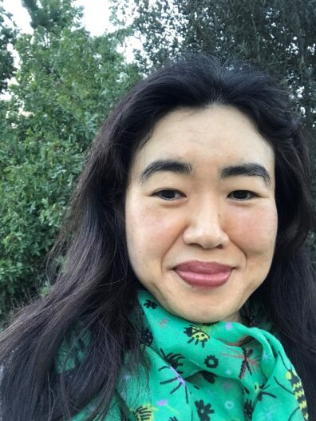
</a>
 jeannie-396x527.jpg ⚠️
</td>
<td align="center" width="33%">
<a href="images/Collin-Shull.jpg">
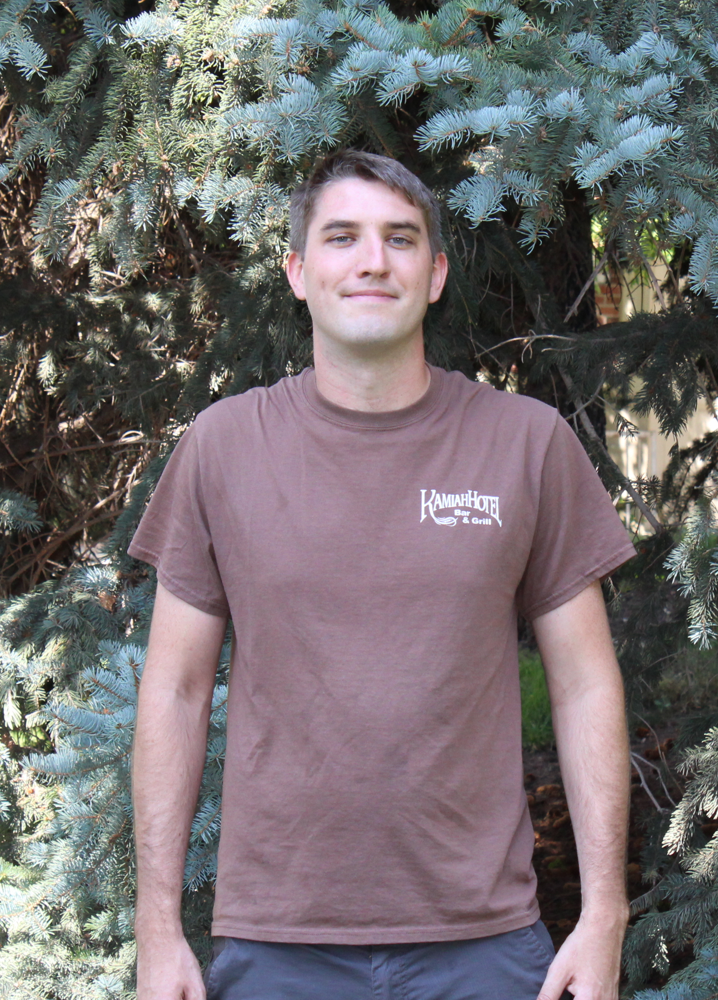
</a>
 Collin-Shull.jpg
</td>
<td align="center" width="33%">
<a href="images/JohnStreamas-88x106.jpg">
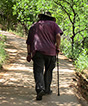
</a>
 JohnStreamas-88x106.jpg
</td>
</tr>
<tr>
<td align="center" width="33%">
<a href="images/Montmartre2-396x528.jpg">
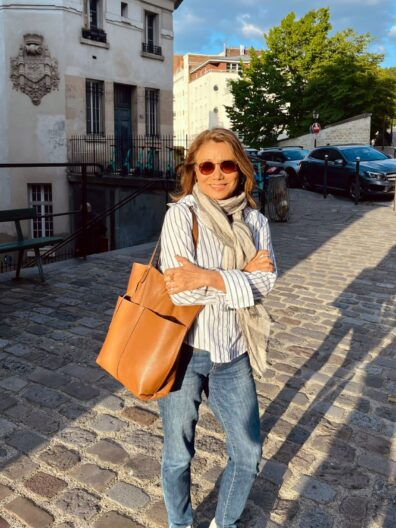
</a>
 Montmartre2-396x528.jpg ⚠️
</td>
<td align="center" width="33%">
<a href="images/Prof-X_Go-Cougs_tall_.jpg">
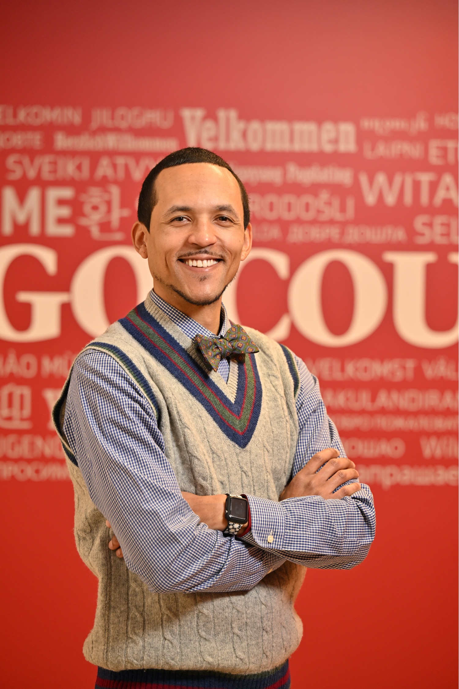
</a>
 Prof-X_Go-Cougs_tall_.jpg
</td>
<td align="center" width="33%">

 Bio-Photo-1.jpg
</td>
</tr>
<tr>
<td align="center" width="33%">

 black-mark.jpg
</td>
<td align="center" width="33%">

 PuckBrecher-e1535573960127-scaled.jpg
</td>
<td align="center" width="33%">

 Amir-Gilmore-Fall-2021-COE_3270-1188x792-1.jpg
</td>
</tr>
<tr>
<td align="center" width="33%">

 Sutton-2.jpg
</td>
<td align="center" width="33%">
<a href="images/IMG_1654.jpg">
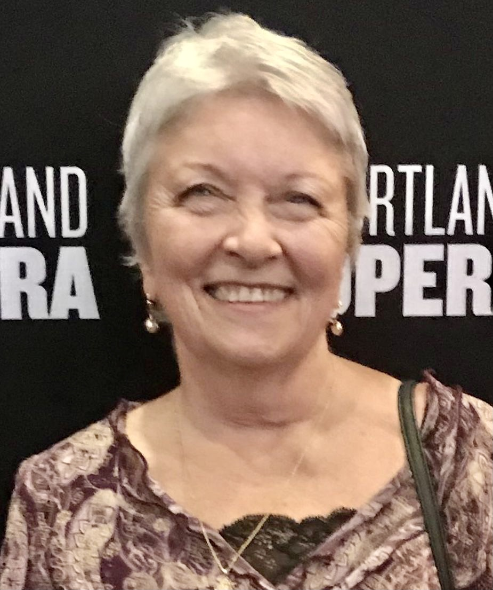
</a>
 IMG_1654.jpg ⚠️
</td>
<td align="center" width="33%">

 ingemanson_birgitta.jpg ⚠️
</td>
</tr>
<tr>
<td align="center" width="33%">
<a href="images/IMG_0617-scaled.jpg">
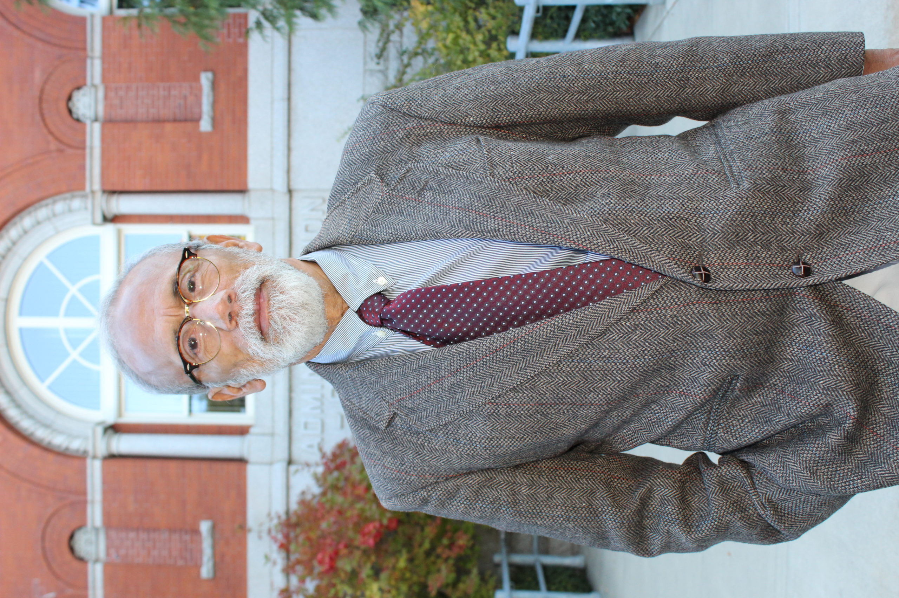
</a>
 IMG_0617-scaled.jpg ⚠️
</td>
<td align="center" width="33%">

 RoryOng-88x106.jpg ⚠️
</td>
<td align="center" width="33%">

 AnaMariaVivaldi-88x106.jpg ⚠️
</td>
</tr>
<tr>
<td align="center" width="33%">

 IMG_0609-396x264.jpg ⚠️
</td>
<td></td>
<td></td>
</tr>
</table>

⚠️ <strong>Images Missing Alt Text</strong> (12)

| Image | Source URL |
|-------|-----------|
| `arellanos-scaled-e1726071896479-396x548.jpg` | https://wpcdn.web.wsu.edu/wp-cas/uploads/sites/2035/2024/09/arellanos-scaled-... |
| `Etna-Avalos-WSU-e1725554665121-396x487.jpg` | https://wpcdn.web.wsu.edu/wp-cas/uploads/sites/2035/2024/09/Etna-Avalos-WSU-e... |
| `20230519_1451272-scaled-e1725555299646-396x503.jpg` | https://wpcdn.web.wsu.edu/wp-cas/uploads/sites/2035/2024/09/20230519_1451272-... |
| `image-91-396x495.png` | https://wpcdn.web.wsu.edu/wp-cas/uploads/sites/2035/2024/09/image-91-396x495.png |
| `jeannie-396x527.jpg` | https://wpcdn.web.wsu.edu/wp-cas/uploads/sites/2035/2023/08/jeannie-396x527.jpg |
| `Montmartre2-396x528.jpg` | https://wpcdn.web.wsu.edu/wp-cas/uploads/sites/2035/2024/09/Montmartre2-396x5... |
| `IMG_1654.jpg` | https://wpcdn.web.wsu.edu/wp-cas/uploads/sites/2035/2021/08/IMG_1654.jpg |
| `ingemanson_birgitta.jpg` | https://wpcdn.web.wsu.edu/wp-cas/uploads/sites/2035/2019/03/ingemanson_birgit... |
| `IMG_0617-scaled.jpg` | https://wpcdn.web.wsu.edu/wp-cas/uploads/sites/2035/2020/07/IMG_0617-scaled.jpg |
| `RoryOng-88x106.jpg` | https://wpcdn.web.wsu.edu/wp-cas/uploads/sites/2035/2018/10/RoryOng-88x106.jpg |
| `AnaMariaVivaldi-88x106.jpg` | https://wpcdn.web.wsu.edu/wp-cas/uploads/sites/2035/2018/06/AnaMariaVivaldi-8... |
| `IMG_0609-396x264.jpg` | https://wpcdn.web.wsu.edu/wp-cas/uploads/sites/2035/2020/07/IMG_0609-396x264.jpg |

## 📁 Files

| File | Description |
|------|-------------|
| `01-page-loaded.png` | page-loaded (1.4 MB) |
| `page.html` | Rendered HTML content |
| `metadata.json` | Machine-readable scan data |
| `errors.log` | JavaScript console errors |
| `warnings.log` | JavaScript console warnings |
| `info.log` | Navigation and timing details |
| `actions.log` | Interactions performed |
| `images/` | 37 page images (13.8 MB) |

---

*Generated by AccessibilityScanner (FreeTools) v1.0*
