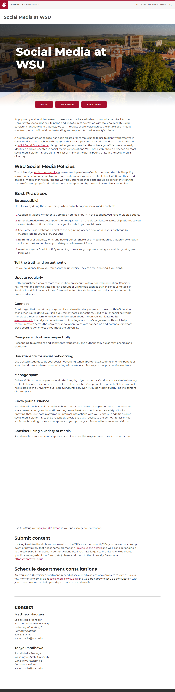

# Page Scan Report

| Field | Value |
|-------|-------|
| URL | https://socialmedia.wsu.edu/ |
| Title | Social Media at WSU | Washington State University |
| Status | ❌ 0 |
| HTML Size | 44.1 KB |
| Screenshots | 1 (1.5 MB) |
| Images | 2 (1.3 MB) |
| Images Missing Alt | 0 |
| JS Errors | 1 |
| JS Warnings | 0 |
| Auth | none |
| Captured | 2026-02-16T20:37:05.1549057Z |

## JavaScript Errors

- `Failed to load resource: net::ERR_SOCKET_NOT_CONNECTED`

## Actions

- Screenshot #1: page-loaded (1.5 MB)
- Downloaded 2 images to /images/

## Screenshots

### 1. page-loaded

## Page Images (2)

| # | Image | Alt Text | Size |
|---|-------|----------|------|
| 1 | [Screen-Shot-2016-01-07-at-4.17.05-PM.png](images/Screen-Shot-2016-01-07-at-4.17.05-PM.png) | Two WSU students jumping for joy at t... | 661.4 KB |
| 2 | [Screen-Shot-2016-01-07-at-4.18.22-PM.png](images/Screen-Shot-2016-01-07-at-4.18.22-PM.png) | A child dressed as a WSU cheerleader ... | 701.2 KB |

### Gallery

## Files

- `01-page-loaded.png` — page-loaded (1.5 MB)
- `page.html` — rendered HTML content
- `metadata.json` — machine-readable scan data
- `errors.log` — JavaScript console errors
- `warnings.log` — JavaScript console warnings
- `info.log` — navigation and timing details
- `actions.log` — interactions performed on the page
- `images/` — 2 page images (1.3 MB)
