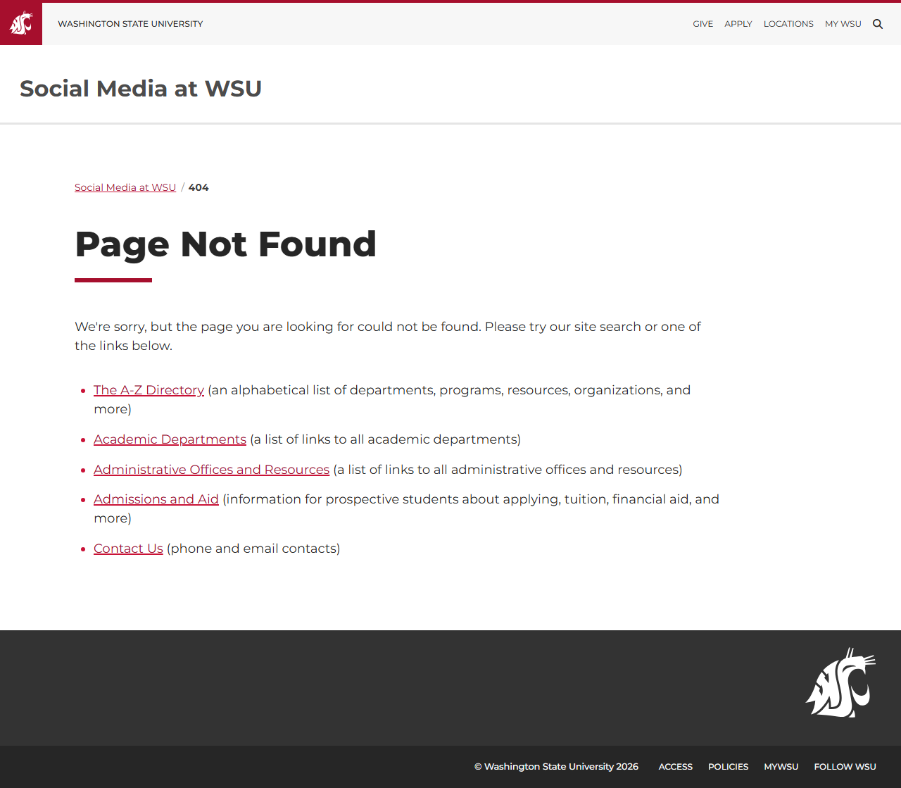

# Site Report: https://socialmedia.wsu.edu/

| Metric | Value |
|--------|-------|
| Status | ⚠️ 0/5 pages OK |
| Pages Scanned | 5 |
| Pages Passed | 0 |
| Pages Failed | 5 |
| Total JS Errors | 5 |
| Total JS Warnings | 0 |
| Total HTML | 159.8 KB |
| Total Screenshots | 1.8 MB |
| Total Images | 2 (1.3 MB) |
| Images Missing Alt | 0 |
| Folder | `socialmedia-wsu-edu/` |

## Pages

| Status | Page | HTTP | Title | JS Errors | Images | Missing Alt |
|--------|------|------|-------|-----------|--------|-------------|
| ❌ | [/](_root/report.md) | 0 | Social Media at WSU \| Washington Sta... | 1 | 2 | 0 |
| ❌ | [/directory/](directory/report.md) | 0 | Page not found \| Social Media at WSU... | 1 | 0 | 0 |
| ❌ | [/guidelines/](guidelines/report.md) | 0 | Page not found \| Social Media at WSU... | 1 | 0 | 0 |
| ❌ | [/resources/](resources/report.md) | 0 | Page not found \| Social Media at WSU... | 1 | 0 | 0 |
| ❌ | [/training/](training/report.md) | 0 | Page not found \| Social Media at WSU... | 1 | 0 | 0 |

## Page Screenshots

### [/](_root/report.md)

### [/directory/](directory/report.md)

### [/guidelines/](guidelines/report.md)

### [/resources/](resources/report.md)

### [/training/](training/report.md)

## Failed Pages

### /

- **URL:** https://socialmedia.wsu.edu/
- **Status:** 0

### /directory/

- **URL:** https://socialmedia.wsu.edu/directory/
- **Status:** 0

### /guidelines/

- **URL:** https://socialmedia.wsu.edu/guidelines/
- **Status:** 0

### /resources/

- **URL:** https://socialmedia.wsu.edu/resources/
- **Status:** 0

### /training/

- **URL:** https://socialmedia.wsu.edu/training/
- **Status:** 0

## Pages with JavaScript Errors

### / (1 errors)

- `Failed to load resource: net::ERR_SOCKET_NOT_CONNECTED`

### /directory/ (1 errors)

- `Failed to load resource: the server responded with a status of 404 (Not Found)`

### /guidelines/ (1 errors)

- `Failed to load resource: the server responded with a status of 404 (Not Found)`

### /resources/ (1 errors)

- `Failed to load resource: the server responded with a status of 404 (Not Found)`

### /training/ (1 errors)

- `Failed to load resource: the server responded with a status of 404 (Not Found)`

---

*Generated by AccessibilityScanner (FreeTools) v1.0*
