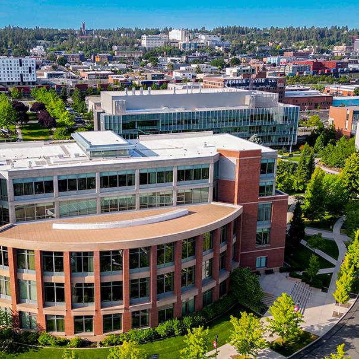
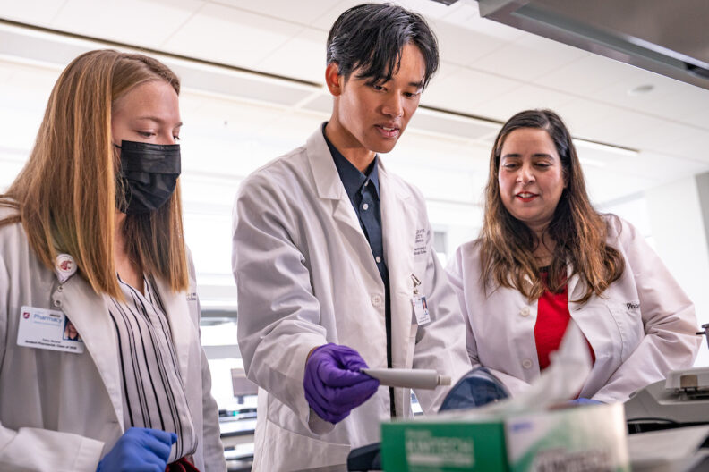
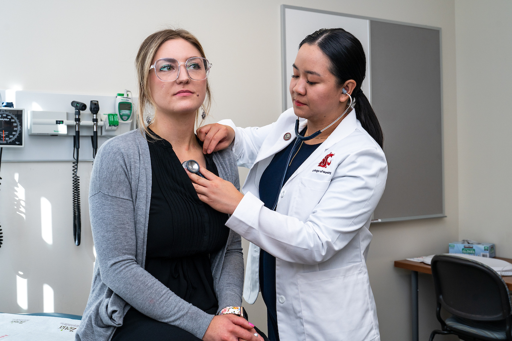
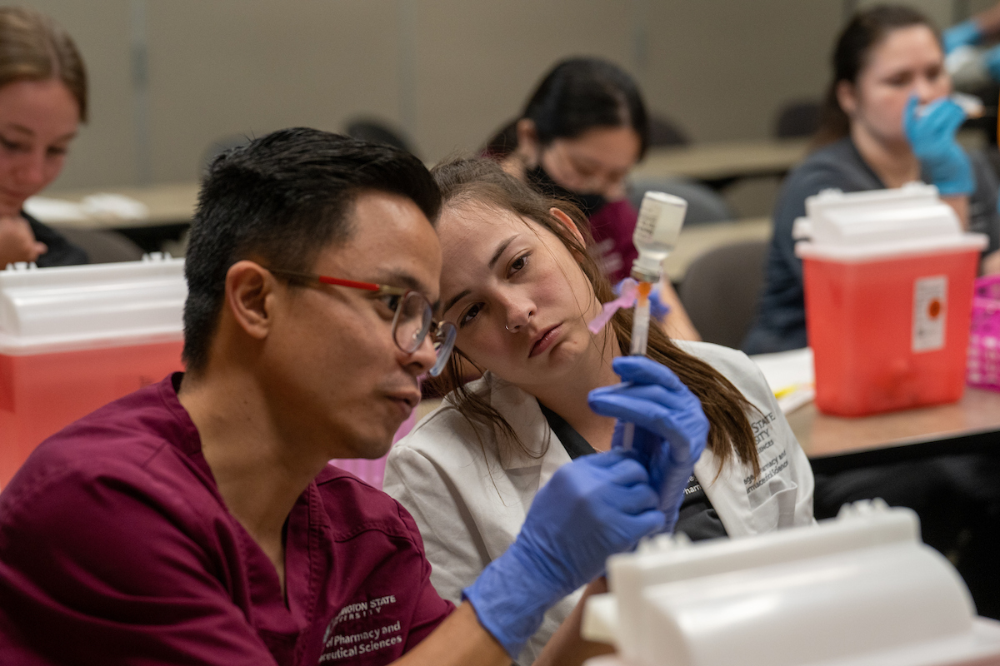
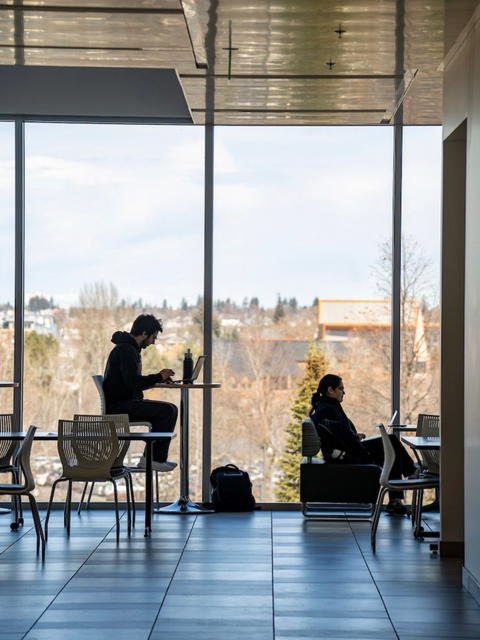
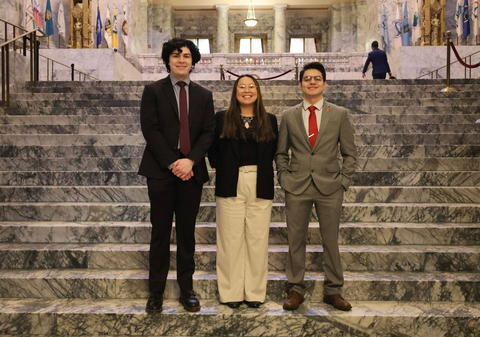
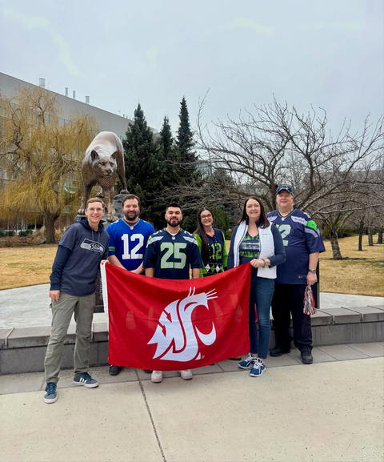
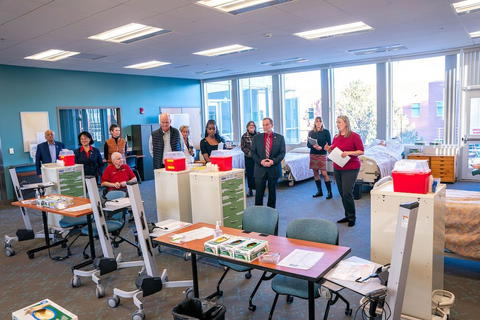
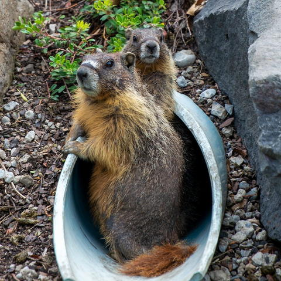
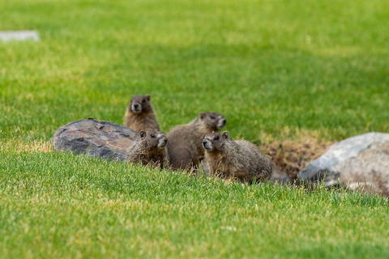

# Page Scan Report

| Field | Value |
|-------|-------|
| URL | https://spokane.wsu.edu/ |
| Title | WSU Spokane | Washington State University |
| Status | ❌ 0 |
| HTML Size | 311.0 KB |
| Screenshots | 1 (3.0 MB) |
| Images | 24 (3.2 MB) |
| Images Missing Alt | 2 |
| JS Errors | 0 |
| JS Warnings | 0 |
| Auth | none |
| Captured | 2026-02-16T20:58:42.4731492Z |

## Actions

- Screenshot #1: page-loaded (3.0 MB)
- Downloaded 24 images to /images/

## Screenshots

### 1. page-loaded

## Page Images (24)

| # | Image | Alt Text | Size |
|---|-------|----------|------|
| 1 | [Home-pharmacy-edit-792x528.jpg](images/Home-pharmacy-edit-792x528.jpg) | pharmacy students walking on campus | 105.4 KB |
| 2 | [Students-on-Campus-Oct-2022-10-792x528.jpg](images/Students-on-Campus-Oct-2022-10-792x528.jpg) | Nursing students walking on campus | 131.3 KB |
| 3 | [Community-Health-Fair-2019-622.jpg](images/Community-Health-Fair-2019-622.jpg) | Students practicing on volunteer pati... | 338.6 KB |
| 4 | [spokane2.jpg](images/spokane2.jpg) | student academic center overlooking W... | 503.1 KB |
| 5 | [Pharmacy-Compound-Lab-shoot-Sep-2022-26-792x528.jpg](images/Pharmacy-Compound-Lab-shoot-Sep-2022-26-792x528.jpg) | Faculty member assisting student duri... | 115.6 KB |
| 6 | [Medical-school-link.jpg](images/Medical-school-link.jpg) | Medicine students practicing medical ... | 110.9 KB |
| 7 | [DNP-White-Coat-Campaign-Interview-26.jpg](images/DNP-White-Coat-Campaign-Interview-26.jpg) | *(none)* | 512.7 KB |
| 8 | [Pharmacy-Immunization-lecture-and-training-Aug-2022-55.jpg](images/Pharmacy-Immunization-lecture-and-training-Aug-2022-55.jpg) | *(none)* | 502.0 KB |
| 9 | [gloves-holding-smartphone-and-glucose-monitor-1024x676.jpg](images/gloves-holding-smartphone-and-glucose-monitor-1024x676.jpg) | Gloved hands holding a smartphone and... | 78.7 KB |
| 10 | [nursing-students-walking-at-WSU-Spokane-1024x676.jpg](images/nursing-students-walking-at-WSU-Spokane-1024x676.jpg) | Nursing students walking across the W... | 172.9 KB |
| 11 | [pharmacyclassof2025-1024x676.jpg](images/pharmacyclassof2025-1024x676.jpg) | The WSU College of Pharmacy and Pharm... | 266.4 KB |
| 12 | [385094280.jpg](images/385094280.jpg) | Image posted by wsuspokane to instagram | 50.2 KB |
| 13 | [385094280_user_image.jpg](images/385094280_user_image.jpg) | Profile image for wsuspokane | 2.5 KB |
| 14 | [384665249.jpg](images/384665249.jpg) | Image posted by wsuspokane to instagram | 41.0 KB |
| 15 | [384665249_user_image.jpg](images/384665249_user_image.jpg) | Profile image for wsuspokane | 2.5 KB |
| 16 | [384854805.jpg](images/384854805.jpg) | Image posted by wsuspokane to instagram | 53.0 KB |
| 17 | [384854805_user_image.jpg](images/384854805_user_image.jpg) | Profile image for wsuspokane | 2.5 KB |
| 18 | [384665250.jpg](images/384665250.jpg) | Image posted by wsuspokane to instagram | 37.8 KB |
| 19 | [384665250_user_image.jpg](images/384665250_user_image.jpg) | Profile image for wsuspokane | 2.5 KB |
| 20 | [384728211.jpg](images/384728211.jpg) | Image posted by wsuspokane to instagram | 68.3 KB |
| 21 | [384728211_user_image.jpg](images/384728211_user_image.jpg) | Profile image for wsuspokane | 2.5 KB |
| 22 | [384665240.jpg](images/384665240.jpg) | Image posted by wsuspokane to instagram | 29.2 KB |
| 23 | [384665240_user_image.jpg](images/384665240_user_image.jpg) | Profile image for wsuspokane | 2.5 KB |
| 24 | [Spokane-Skyline-v3.png](images/Spokane-Skyline-v3.png) | Spokane skyline silhouette | 137.9 KB |

### Gallery

### ⚠️ Images Missing Alt Text (2)

- `DNP-White-Coat-Campaign-Interview-26.jpg` — https://wpcdn.web.wsu.edu/wp-spokane/uploads/sites/3282/2024/03/DNP-White-Coat-Campaign-Interview-26.jpg
- `Pharmacy-Immunization-lecture-and-training-Aug-2022-55.jpg` — https://wpcdn.web.wsu.edu/wp-spokane/uploads/sites/3282/2024/03/Pharmacy-Immunization-lecture-and-training-Aug-2022-55.jpg

## Files

- `01-page-loaded.png` — page-loaded (3.0 MB)
- `page.html` — rendered HTML content
- `metadata.json` — machine-readable scan data
- `errors.log` — JavaScript console errors
- `warnings.log` — JavaScript console warnings
- `info.log` — navigation and timing details
- `actions.log` — interactions performed on the page
- `images/` — 24 page images (3.2 MB)
