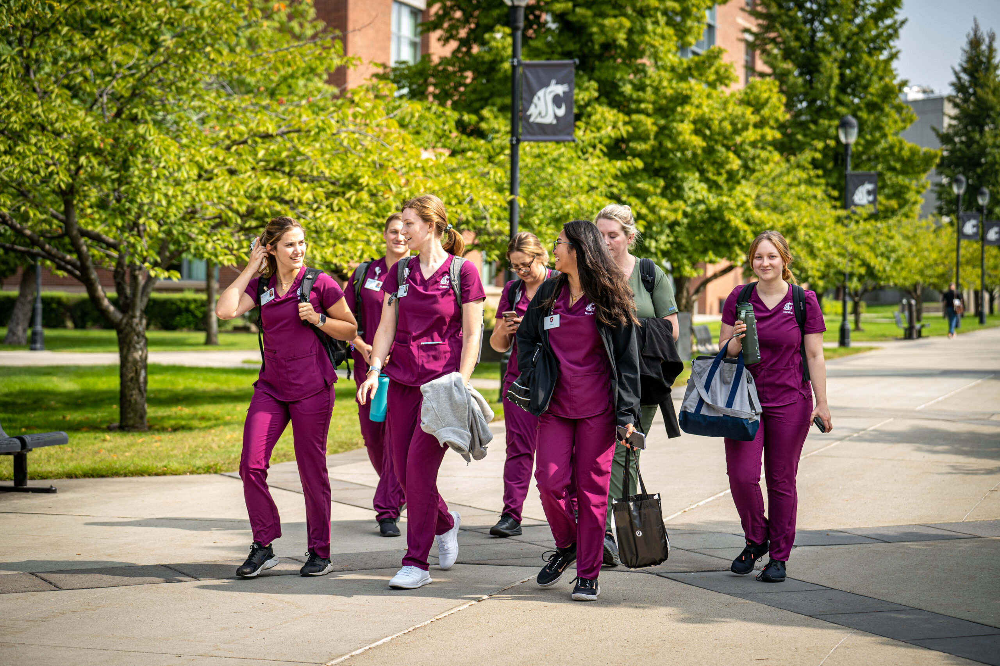
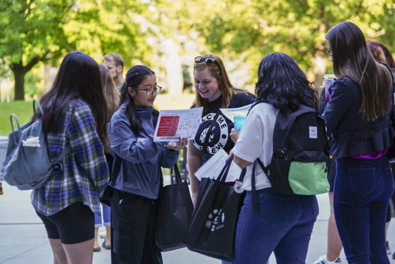

# 📄 Page Scan Report

> **URL:** https://spokane.wsu.edu/admissions/  
> **Captured:** 2026-02-16 22:13:46 UTC  
> **Status:** ❌ 0  

---

## 📑 Contents

- [Summary](#-summary)
- [Screenshots](#-screenshots)
- [Page Images](#-page-images)
- [Actions](#-actions)
- [Files](#-files)

---

## 📋 Summary

| Field | Value |
|-------|-------|
| URL | https://spokane.wsu.edu/admissions/ |
| Title | Admissions | WSU Spokane | Washington State University |
| Status | ❌ 0 |
| HTML Size | 242.3 KB |
| Screenshots | 1 (615.8 KB) |
| Images | 3 (1.2 MB) |
| Images Missing Alt | ⚠️ 1 |
| JS Errors | ✅ 0 |
| JS Warnings | 2 |
| Auth | none |
| Captured | 2026-02-16T22:13:46.1220891Z |

## 🔧 Actions

<strong>2 action(s) performed</strong>

- Screenshot #1: page-loaded (615.8 KB)
- Downloaded 3 images to /images/

## 📸 Screenshots

<table>
<tr>
<td align="center" width="50%">

 <strong>1. page-loaded</strong>
 615.8 KB
</td>
<td></td>
</tr>
</table>

## 🖼️ Page Images (3)

<strong>📋 Image Index</strong> — 3 images, 1.2 MB

| # | Image | Alt Text | Size |
|--:|-------|----------|-----:|
| 1 | [Students-on-Campus-Oct-2022-8-scaled.jpg](images/Students-on-Campus-Oct-2022-8-scaled.jpg) | ⚠️ *(missing)* | 987.3 KB |
| 2 | [Orientation-Day_288-792x529.jpg](images/Orientation-Day_288-792x529.jpg) | WSU Spokane campus orientation employ... | 127.2 KB |
| 3 | [Spokane-Skyline-v3.png](images/Spokane-Skyline-v3.png) | Spokane skyline silhouette | 137.9 KB |

<strong>🖼️ Gallery</strong>

<table>
<tr>
<td align="center" width="33%">

 Students-on-Campus-Oct-2022-8-scaled.jpg ⚠️
</td>
<td align="center" width="33%">

 Orientation-Day_288-792x529.jpg
</td>
<td align="center" width="33%">

 Spokane-Skyline-v3.png
</td>
</tr>
</table>

⚠️ <strong>Images Missing Alt Text</strong> (1)

| Image | Source URL |
|-------|-----------|
| `Students-on-Campus-Oct-2022-8-scaled.jpg` | https://wpcdn.web.wsu.edu/wp-spokane/uploads/sites/3282/2024/01/Students-on-C... |

## 📁 Files

| File | Description |
|------|-------------|
| `01-page-loaded.png` | page-loaded (615.8 KB) |
| `page.html` | Rendered HTML content |
| `metadata.json` | Machine-readable scan data |
| `errors.log` | JavaScript console errors |
| `warnings.log` | JavaScript console warnings |
| `info.log` | Navigation and timing details |
| `actions.log` | Interactions performed |
| `images/` | 3 page images (1.2 MB) |

---

*Generated by AccessibilityScanner (FreeTools) v1.0*
