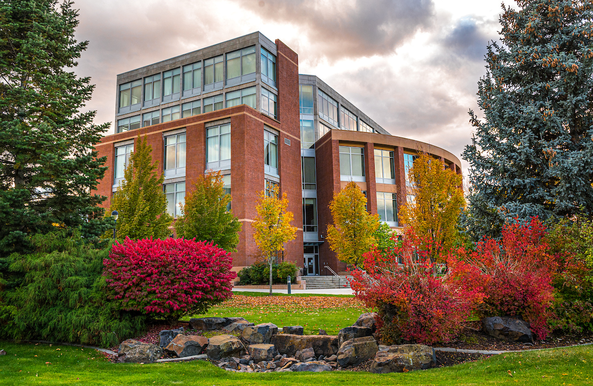

# Page Scan Report

| Field | Value |
|-------|-------|
| URL | https://spokane.wsu.edu/contact/ |
| Redirected To | https://spokane.wsu.edu/contact-us/ |
| Title | Contact Us | WSU Spokane | Washington State University |
| Status | ✅ 200 |
| HTML Size | 236.4 KB |
| Screenshots | 1 (1.8 MB) |
| Images | 2 (1.5 MB) |
| Images Missing Alt | 0 |
| JS Errors | 0 |
| JS Warnings | 0 |
| Auth | none |
| Captured | 2026-02-16T20:40:44.2711574Z |

## Actions

- Screenshot #1: page-loaded (1.8 MB)
- Downloaded 2 images to /images/

## Screenshots

### 1. page-loaded

## Page Images (2)

| # | Image | Alt Text | Size |
|---|-------|----------|------|
| 1 | [campus-in-Fall-2020-66.jpg](images/campus-in-Fall-2020-66.jpg) | Kirk H. Schulz Academic Center | 1.3 MB |
| 2 | [Spokane-Skyline-v3.png](images/Spokane-Skyline-v3.png) | Spokane skyline silhouette | 137.9 KB |

### Gallery

## Files

- `01-page-loaded.png` — page-loaded (1.8 MB)
- `page.html` — rendered HTML content
- `metadata.json` — machine-readable scan data
- `errors.log` — JavaScript console errors
- `warnings.log` — JavaScript console warnings
- `info.log` — navigation and timing details
- `actions.log` — interactions performed on the page
- `images/` — 2 page images (1.5 MB)
