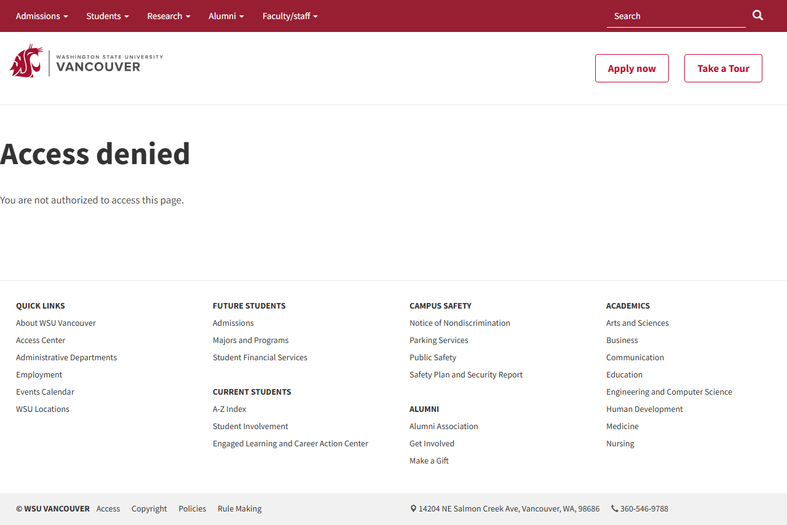
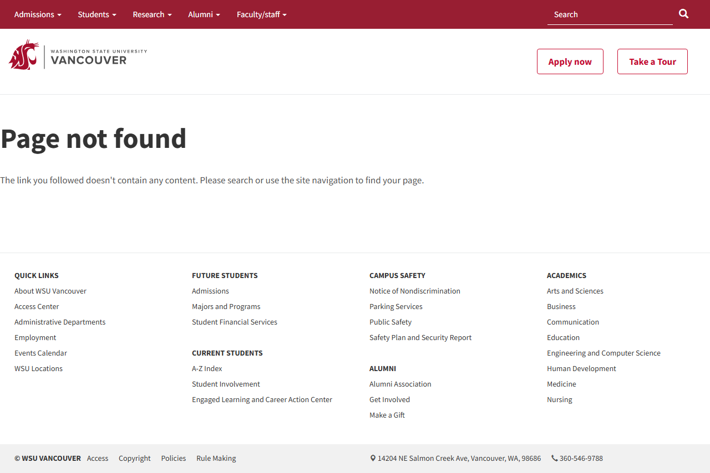

# Site Report: https://studentaffairs.vancouver.wsu.edu/

| Metric | Value |
|--------|-------|
| Status | ⚠️ 2/6 pages OK |
| Pages Scanned | 6 |
| Pages Passed | 2 |
| Pages Failed | 4 |
| Total JS Errors | 4 |
| Total JS Warnings | 0 |
| Total HTML | 211.1 KB |
| Total Screenshots | 3.7 MB |
| Folder | `studentaffairs-vancouver-wsu-edu/` |

## Pages

| Status | Page | HTTP | Title | JS Errors | JS Warnings | Screenshots |
|--------|------|------|-------|-----------|-------------|-------------|
| ✅ | [/](_root/report.md) | 200 | Student Affairs - WSU Vancouver - WSU... | 0 | 0 | 1 |
| ❌ | [/about/](about/report.md) | 404 | Page not found - Student Affairs - WS... | 1 | 0 | 1 |
| ❌ | [/contact/](contact/report.md) | 403 | Access denied - Student Affairs - WSU... | 1 | 0 | 1 |
| ❌ | [/resources/](resources/report.md) | 404 | Page not found - Student Affairs - WS... | 1 | 0 | 1 |
| ❌ | [/services/](services/report.md) | 404 | Page not found - Student Affairs - WS... | 1 | 0 | 1 |
| ✅ | [/student-involvement/](student-involvement/report.md) | 200 | Office of Student Involvement - Home ... | 0 | 0 | 1 |

## Page Screenshots

### [/](_root/report.md)

### [/about/](about/report.md)

### [/contact/](contact/report.md)

### [/resources/](resources/report.md)

### [/services/](services/report.md)

### [/student-involvement/](student-involvement/report.md)

## Failed Pages

### /about/

- **URL:** https://studentaffairs.vancouver.wsu.edu/about/
- **Status:** 404

### /services/

- **URL:** https://studentaffairs.vancouver.wsu.edu/services/
- **Status:** 404

### /resources/

- **URL:** https://studentaffairs.vancouver.wsu.edu/resources/
- **Status:** 404

### /contact/

- **URL:** https://studentaffairs.vancouver.wsu.edu/contact/
- **Status:** 403

## Pages with JavaScript Errors

### /about/ (1 errors)

- `Failed to load resource: the server responded with a status of 404 ()`

### /services/ (1 errors)

- `Failed to load resource: the server responded with a status of 404 ()`

### /resources/ (1 errors)

- `Failed to load resource: the server responded with a status of 404 ()`

### /contact/ (1 errors)

- `Failed to load resource: the server responded with a status of 403 ()`

---

*Generated by AccessibilityScanner (FreeTools) v1.0*
