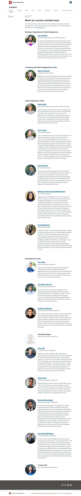

# 📄 Page Scan Report

> **URL:** https://sunapsis.iu.edu/about-us/profiles/index.html  
> **Captured:** 2026-02-19 02:12:08 UTC  
> **Status:** ✅ 200  

---

## 📑 Contents

- [Summary](#-summary)
- [Screenshots](#-screenshots)
- [Page Images](#-page-images)
- [JavaScript Errors](#-javascript-errors)
- [Accessibility](#-accessibility)
- [Actions](#-actions)
- [Files](#-files)

---

## 📋 Summary

| Field | Value |
|-------|-------|
| URL | https://sunapsis.iu.edu/about-us/profiles/index.html |
| Title | Profiles: About Us: sunapsis: Indiana University |
| Status | ✅ 200 |
| HTML Size | 46.4 KB |
| Screenshots | 1 (728.3 KB) |
| Images | 20 (referenced by URL) |
| Images Missing Alt | ⚠️ 17 |
| JS Errors | 🔴 4 |
| JS Warnings | 2 |
| A11y Violations | ✅ 0 |
| Auth | none |
| Captured | 2026-02-19T02:12:08.3054020Z |

## 🔴 JavaScript Errors

<details>
<summary><strong>4 error(s) detected</strong></summary>

```
Access to XMLHttpRequest at 'https://www.google.com/cse/static/element/f71e4ed980f4c082/default_v6+en.css' from origin 'https://sunapsis.iu.edu' has been blocked by CORS policy: No 'Access-Control-All...
Failed to load resource: net::ERR_FAILED
Access to XMLHttpRequest at 'https://www.google.com/cse/static/style/look/v6/default.css' from origin 'https://sunapsis.iu.edu' has been blocked by CORS policy: No 'Access-Control-Allow-Origin' header...
Failed to load resource: net::ERR_FAILED
```

</details>

## 🔧 Actions

<details>
<summary><strong>4 action(s) performed</strong></summary>

- Screenshot #1: page-loaded (728.3 KB)
- Cataloged 20 images by URL (no download)
- axe-core: 0 violations (313ms)
- htmlcheck: 0 violations (0ms)

</details>

## 📸 Screenshots

<table>
<tr>
<td align="center" width="50%">
<a href="01-page-loaded.jpg">

</a>
<br /><strong>1. page-loaded</strong>
<br /><sub>728.3 KB</sub>
</td>
<td></td>
</tr>
</table>

## 🖼️ Page Images (20)

<details open>
<summary><strong>📋 Image Index</strong> — 20 images (referenced by URL)</summary>

| # | Source URL | Alt Text |
|--:|-----------|----------|
| 1 | https://assets.iu.edu/brand/3.x/trident-large.png | ⚠️ *(missing)* |
| 2 | https://assets.iu.edu/search/3.x/search.png | Open Search |
| 3 | https://assets.iu.edu/web/3.x/css/img/search.png | Search |
| 4 | https://sunapsis.iu.edu/images/Joe-Compion.jpg | ⚠️ *(missing)* |
| 5 | https://sunapsis.iu.edu/about-us/profiles/licensing-and-client-engagement%20T... | ⚠️ *(missing)* |
| 6 | https://sunapsis.iu.edu/images/Kathy-Abell.png | ⚠️ *(missing)* |
| 7 | https://sunapsis.iu.edu/images/Amy-Cowin-updated.jpg | ⚠️ *(missing)* |
| 8 | https://sunapsis.iu.edu/images/Anna-Hartwig.jpg | ⚠️ *(missing)* |
| 9 | https://sunapsis.iu.edu/images/Meghana.png | ⚠️ *(missing)* |
| 10 | https://sunapsis.iu.edu/images/Rushali.png | ⚠️ *(missing)* |
| 11 | https://sunapsis.iu.edu/images/climis-tim-2022.jpg | ⚠️ *(missing)* |
| 12 | https://sunapsis.iu.edu/images/John-Lee.jpg | ⚠️ *(missing)* |
| 13 | https://sunapsis.iu.edu/images/santistaffphoto.jpg | ⚠️ *(missing)* |
| 14 | https://sunapsis.iu.edu/images/no-photo.webp | ⚠️ *(missing)* |
| 15 | https://sunapsis.iu.edu/images/Tyler-Dell.jpg | ⚠️ *(missing)* |
| 16 | https://sunapsis.iu.edu/about-us/profiles/AdrianJohn250x250.png | ⚠️ *(missing)* |
| 17 | https://sunapsis.iu.edu/images/dheeraj_picture.png | ⚠️ *(missing)* |
| 18 | https://sunapsis.iu.edu/images/noman-abu.jpg | ⚠️ *(missing)* |
| 19 | https://sunapsis.iu.edu/about-us/profiles/development-team/Trishna.jpg | ⚠️ *(missing)* |
| 20 | https://assets.iu.edu/brand/3.3.x/iu-sig-formal.svg | Indiana University |

</details>

<details open>
<summary><strong>🖼️ Gallery</strong></summary>

<table>
<tr>
<td align="center" width="33%">
<a href="https://assets.iu.edu/brand/3.x/trident-large.png">

</a>
<br /><sub>https://assets.iu.edu/brand/3.x/trident-large.png ⚠️</sub>
</td>
<td align="center" width="33%">
<a href="https://assets.iu.edu/search/3.x/search.png">

</a>
<br /><sub>https://assets.iu.edu/search/3.x/search.png</sub>
</td>
<td align="center" width="33%">
<a href="https://assets.iu.edu/web/3.x/css/img/search.png">

</a>
<br /><sub>https://assets.iu.edu/web/3.x/css/img/search.png</sub>
</td>
</tr>
<tr>
<td align="center" width="33%">
<a href="https://sunapsis.iu.edu/images/Joe-Compion.jpg">

</a>
<br /><sub>https://sunapsis.iu.edu/images/Joe-Compion.jpg ⚠️</sub>
</td>
<td align="center" width="33%">
<a href="https://sunapsis.iu.edu/about-us/profiles/licensing-and-client-engagement%20Team/Marie-OConnell.jpg">

</a>
<br /><sub>https://sunapsis.iu.edu/about-us/profiles/licen... ⚠️</sub>
</td>
<td align="center" width="33%">
<a href="https://sunapsis.iu.edu/images/Kathy-Abell.png">

</a>
<br /><sub>https://sunapsis.iu.edu/images/Kathy-Abell.png ⚠️</sub>
</td>
</tr>
<tr>
<td align="center" width="33%">
<a href="https://sunapsis.iu.edu/images/Amy-Cowin-updated.jpg">

</a>
<br /><sub>https://sunapsis.iu.edu/images/Amy-Cowin-update... ⚠️</sub>
</td>
<td align="center" width="33%">
<a href="https://sunapsis.iu.edu/images/Anna-Hartwig.jpg">

</a>
<br /><sub>https://sunapsis.iu.edu/images/Anna-Hartwig.jpg ⚠️</sub>
</td>
<td align="center" width="33%">
<a href="https://sunapsis.iu.edu/images/Meghana.png">

</a>
<br /><sub>https://sunapsis.iu.edu/images/Meghana.png ⚠️</sub>
</td>
</tr>
<tr>
<td align="center" width="33%">
<a href="https://sunapsis.iu.edu/images/Rushali.png">

</a>
<br /><sub>https://sunapsis.iu.edu/images/Rushali.png ⚠️</sub>
</td>
<td align="center" width="33%">
<a href="https://sunapsis.iu.edu/images/climis-tim-2022.jpg">

</a>
<br /><sub>https://sunapsis.iu.edu/images/climis-tim-2022.jpg ⚠️</sub>
</td>
<td align="center" width="33%">
<a href="https://sunapsis.iu.edu/images/John-Lee.jpg">

</a>
<br /><sub>https://sunapsis.iu.edu/images/John-Lee.jpg ⚠️</sub>
</td>
</tr>
<tr>
<td align="center" width="33%">
<a href="https://sunapsis.iu.edu/images/santistaffphoto.jpg">

</a>
<br /><sub>https://sunapsis.iu.edu/images/santistaffphoto.jpg ⚠️</sub>
</td>
<td align="center" width="33%">
<a href="https://sunapsis.iu.edu/images/no-photo.webp">

</a>
<br /><sub>https://sunapsis.iu.edu/images/no-photo.webp ⚠️</sub>
</td>
<td align="center" width="33%">
<a href="https://sunapsis.iu.edu/images/Tyler-Dell.jpg">

</a>
<br /><sub>https://sunapsis.iu.edu/images/Tyler-Dell.jpg ⚠️</sub>
</td>
</tr>
<tr>
<td align="center" width="33%">
<a href="https://sunapsis.iu.edu/about-us/profiles/AdrianJohn250x250.png">

</a>
<br /><sub>https://sunapsis.iu.edu/about-us/profiles/Adria... ⚠️</sub>
</td>
<td align="center" width="33%">
<a href="https://sunapsis.iu.edu/images/dheeraj_picture.png">

</a>
<br /><sub>https://sunapsis.iu.edu/images/dheeraj_picture.png ⚠️</sub>
</td>
<td align="center" width="33%">
<a href="https://sunapsis.iu.edu/images/noman-abu.jpg">

</a>
<br /><sub>https://sunapsis.iu.edu/images/noman-abu.jpg ⚠️</sub>
</td>
</tr>
<tr>
<td align="center" width="33%">
<a href="https://sunapsis.iu.edu/about-us/profiles/development-team/Trishna.jpg">

</a>
<br /><sub>https://sunapsis.iu.edu/about-us/profiles/devel... ⚠️</sub>
</td>
<td align="center" width="33%">
<a href="https://assets.iu.edu/brand/3.3.x/iu-sig-formal.svg">

</a>
<br /><sub>https://assets.iu.edu/brand/3.3.x/iu-sig-formal...</sub>
</td>
<td></td>
</tr>
</table>

</details>

<details>
<summary>⚠️ <strong>Images Missing Alt Text</strong> (17)</summary>

| # | Source URL |
|--:|-----------|
| 1 | https://assets.iu.edu/brand/3.x/trident-large.png |
| 2 | https://sunapsis.iu.edu/images/Joe-Compion.jpg |
| 3 | https://sunapsis.iu.edu/about-us/profiles/licensing-and-client-engagement%20T... |
| 4 | https://sunapsis.iu.edu/images/Kathy-Abell.png |
| 5 | https://sunapsis.iu.edu/images/Amy-Cowin-updated.jpg |
| 6 | https://sunapsis.iu.edu/images/Anna-Hartwig.jpg |
| 7 | https://sunapsis.iu.edu/images/Meghana.png |
| 8 | https://sunapsis.iu.edu/images/Rushali.png |
| 9 | https://sunapsis.iu.edu/images/climis-tim-2022.jpg |
| 10 | https://sunapsis.iu.edu/images/John-Lee.jpg |
| 11 | https://sunapsis.iu.edu/images/santistaffphoto.jpg |
| 12 | https://sunapsis.iu.edu/images/no-photo.webp |
| 13 | https://sunapsis.iu.edu/images/Tyler-Dell.jpg |
| 14 | https://sunapsis.iu.edu/about-us/profiles/AdrianJohn250x250.png |
| 15 | https://sunapsis.iu.edu/images/dheeraj_picture.png |
| 16 | https://sunapsis.iu.edu/images/noman-abu.jpg |
| 17 | https://sunapsis.iu.edu/about-us/profiles/development-team/Trishna.jpg |

</details>

## ♿ Accessibility

✅ No violations detected by 2 tool(s).

## 📁 Files

| File | Description |
|------|-------------|
| `01-page-loaded.jpg` | page-loaded (728.3 KB) |
| `page.html` | Rendered HTML content |
| `metadata.json` | Machine-readable scan data |
| `errors.log` | JavaScript console errors |
| `warnings.log` | JavaScript console warnings |
| `info.log` | Navigation and timing details |
| `actions.log` | Interactions performed |
| `a11y-axe.json` | axe accessibility results |
| `a11y-htmlcheck.json` | htmlcheck accessibility results |
| `a11y-summary.json` | Merged cross-tool accessibility summary |

---

*Generated by AccessibilityScanner (FreeTools) v1.0*
