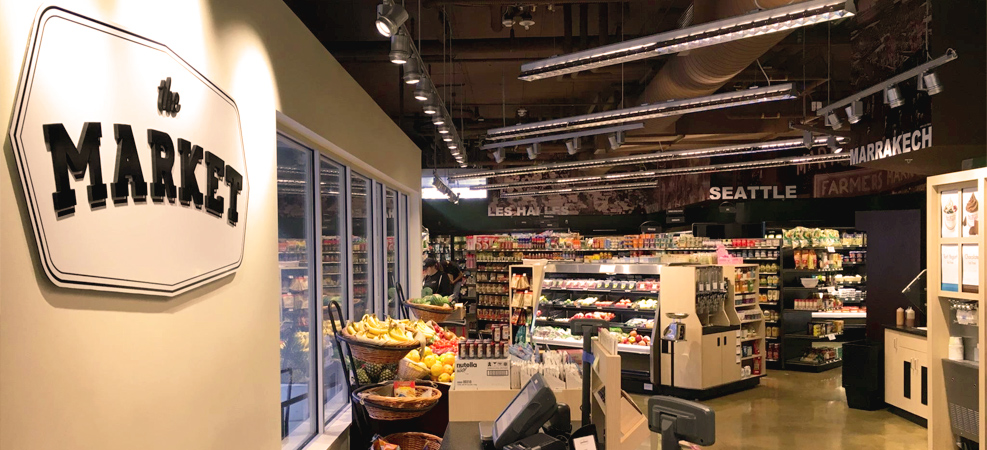
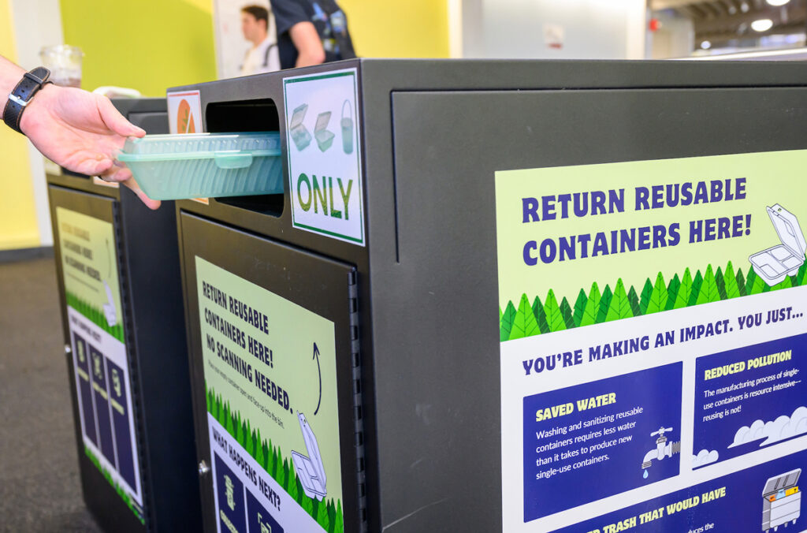

# Page Scan Report

| Field | Value |
|-------|-------|
| URL | https://sustainability.wsu.edu/ |
| Title | WSU Sustainability | Washington State University |
| Status | ❌ 0 |
| HTML Size | 60.2 KB |
| Screenshots | 1 (800.4 KB) |
| Images | 2 (439.3 KB) |
| Images Missing Alt | 2 |
| JS Errors | 5 |
| JS Warnings | 0 |
| Auth | none |
| Captured | 2026-02-16T20:37:05.1650840Z |

## JavaScript Errors

- `Failed to load resource: net::ERR_SOCKET_NOT_CONNECTED`
- `Failed to load resource: net::ERR_SOCKET_NOT_CONNECTED`
- `Failed to load resource: net::ERR_SOCKET_NOT_CONNECTED`
- `Failed to load resource: net::ERR_SOCKET_NOT_CONNECTED`
- `Failed to load resource: net::ERR_SOCKET_NOT_CONNECTED`

## Actions

- Screenshot #1: page-loaded (800.4 KB)
- Downloaded 2 images to /images/

## Screenshots

### 1. page-loaded

## Page Images (2)

| # | Image | Alt Text | Size |
|---|-------|----------|------|
| 1 | [market.jpg](images/market.jpg) | *(none)* | 301.7 KB |
| 2 | [reusable-containers-bin-1024x676-1.jpg](images/reusable-containers-bin-1024x676-1.jpg) | *(none)* | 137.6 KB |

### Gallery

### ⚠️ Images Missing Alt Text (2)

- `market.jpg` — https://wpcdn.web.wsu.edu/wp-fais/uploads/sites/2960/2016/06/market.jpg
- `reusable-containers-bin-1024x676-1.jpg` — https://wpcdn.web.wsu.edu/wp-fais/uploads/sites/2960/2024/09/reusable-containers-bin-1024x676-1.jpg

## Files

- `01-page-loaded.png` — page-loaded (800.4 KB)
- `page.html` — rendered HTML content
- `metadata.json` — machine-readable scan data
- `errors.log` — JavaScript console errors
- `warnings.log` — JavaScript console warnings
- `info.log` — navigation and timing details
- `actions.log` — interactions performed on the page
- `images/` — 2 page images (439.3 KB)
