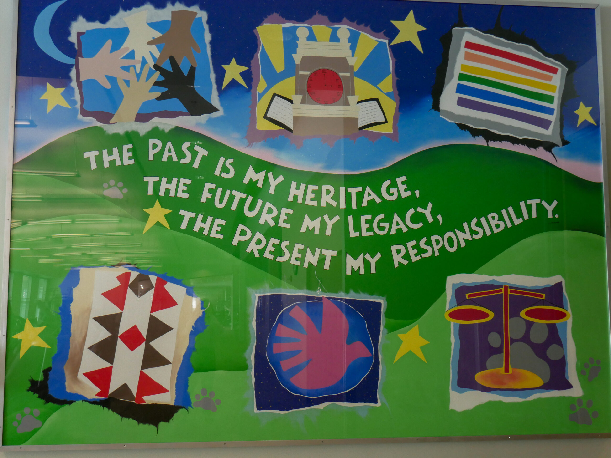
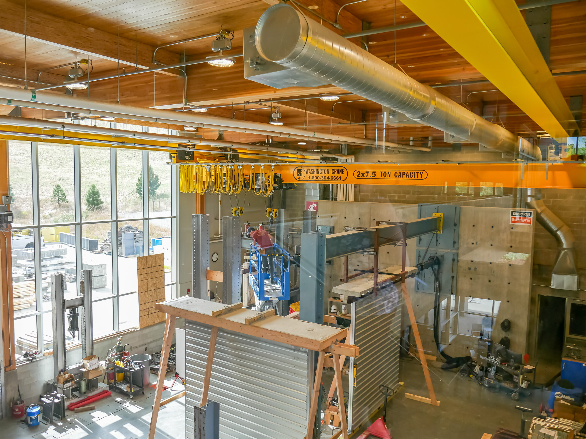
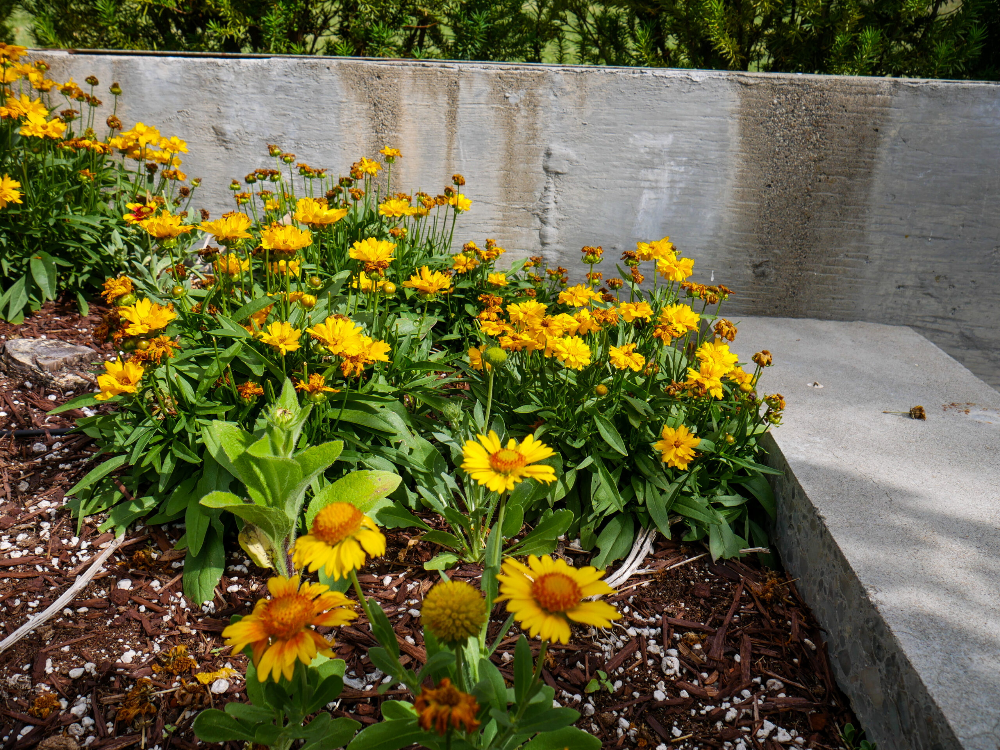

# 📄 Page Scan Report

> **URL:** https://sustainability.wsu.edu/  
> **Captured:** 2026-02-16 22:12:54 UTC  
> **Status:** ✅ 200  

---

## 📑 Contents

- [Summary](#-summary)
- [Screenshots](#-screenshots)
- [Page Images](#-page-images)
- [Actions](#-actions)
- [Files](#-files)

---

## 📋 Summary

| Field | Value |
|-------|-------|
| URL | https://sustainability.wsu.edu/ |
| Title | WSU Sustainability | Washington State University |
| Status | ✅ 200 |
| HTML Size | 70.5 KB |
| Screenshots | 1 (1.1 MB) |
| Images | 7 (4.6 MB) |
| Images Missing Alt | ⚠️ 7 |
| JS Errors | ✅ 0 |
| JS Warnings | 0 |
| Auth | none |
| Captured | 2026-02-16T22:12:54.2302487Z |

## 🔧 Actions

<strong>2 action(s) performed</strong>

- Screenshot #1: page-loaded (1.1 MB)
- Downloaded 7 images to /images/

## 📸 Screenshots

<table>
<tr>
<td align="center" width="50%">

 <strong>1. page-loaded</strong>
 1.1 MB
</td>
<td></td>
</tr>
</table>

## 🖼️ Page Images (7)

<strong>📋 Image Index</strong> — 7 images, 4.6 MB

| # | Image | Alt Text | Size |
|--:|-------|----------|-----:|
| 1 | [Pullman_sustainability-17-scaled.jpg](images/Pullman_sustainability-17-scaled.jpg) | ⚠️ *(missing)* | 646.2 KB |
| 2 | [Pullman_sustainability-04-scaled.jpg](images/Pullman_sustainability-04-scaled.jpg) | ⚠️ *(missing)* | 937.4 KB |
| 3 | [Pullman_sustainability-10-scaled.jpg](images/Pullman_sustainability-10-scaled.jpg) | ⚠️ *(missing)* | 1.4 MB |
| 4 | [Pullman_sustainability-02-scaled.jpg](images/Pullman_sustainability-02-scaled.jpg) | ⚠️ *(missing)* | 898.6 KB |
| 5 | [market.jpg](images/market.jpg) | ⚠️ *(missing)* | 301.7 KB |
| 6 | [reusable-containers-bin-1024x676-1.jpg](images/reusable-containers-bin-1024x676-1.jpg) | ⚠️ *(missing)* | 137.6 KB |
| 7 | [pastureland.jpg](images/pastureland.jpg) | ⚠️ *(missing)* | 302.5 KB |

<strong>🖼️ Gallery</strong>

<table>
<tr>
<td align="center" width="33%">

 Pullman_sustainability-17-scaled.jpg ⚠️
</td>
<td align="center" width="33%">

 Pullman_sustainability-04-scaled.jpg ⚠️
</td>
<td align="center" width="33%">

 Pullman_sustainability-10-scaled.jpg ⚠️
</td>
</tr>
<tr>
<td align="center" width="33%">

 Pullman_sustainability-02-scaled.jpg ⚠️
</td>
<td align="center" width="33%">

 market.jpg ⚠️
</td>
<td align="center" width="33%">

 reusable-containers-bin-1024x676-1.jpg ⚠️
</td>
</tr>
<tr>
<td align="center" width="33%">

 pastureland.jpg ⚠️
</td>
<td></td>
<td></td>
</tr>
</table>

⚠️ <strong>Images Missing Alt Text</strong> (7)

| Image | Source URL |
|-------|-----------|
| `Pullman_sustainability-17-scaled.jpg` | https://wpcdn.web.wsu.edu/wp-fais/uploads/sites/2960/2023/09/Pullman_sustaina... |
| `Pullman_sustainability-04-scaled.jpg` | https://wpcdn.web.wsu.edu/wp-fais/uploads/sites/2960/2023/09/Pullman_sustaina... |
| `Pullman_sustainability-10-scaled.jpg` | https://wpcdn.web.wsu.edu/wp-fais/uploads/sites/2960/2023/09/Pullman_sustaina... |
| `Pullman_sustainability-02-scaled.jpg` | https://wpcdn.web.wsu.edu/wp-fais/uploads/sites/2960/2023/09/Pullman_sustaina... |
| `market.jpg` | https://wpcdn.web.wsu.edu/wp-fais/uploads/sites/2960/2016/06/market.jpg |
| `reusable-containers-bin-1024x676-1.jpg` | https://wpcdn.web.wsu.edu/wp-fais/uploads/sites/2960/2024/09/reusable-contain... |
| `pastureland.jpg` | https://wpcdn.web.wsu.edu/wp-fais/uploads/sites/2960/2024/04/pastureland.jpg |

## 📁 Files

| File | Description |
|------|-------------|
| `01-page-loaded.png` | page-loaded (1.1 MB) |
| `page.html` | Rendered HTML content |
| `metadata.json` | Machine-readable scan data |
| `errors.log` | JavaScript console errors |
| `warnings.log` | JavaScript console warnings |
| `info.log` | Navigation and timing details |
| `actions.log` | Interactions performed |
| `images/` | 7 page images (4.6 MB) |

---

*Generated by AccessibilityScanner (FreeTools) v1.0*
