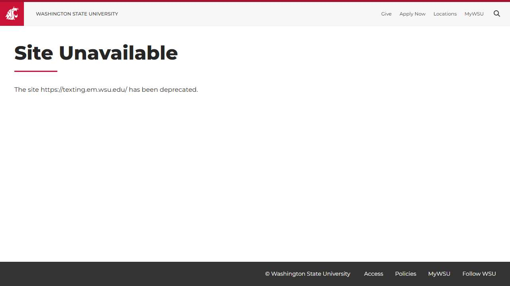

# 🌐 Site Report: https://texting.em.wsu.edu/

> **Status:** ⚠️ 0/1 pages OK  
> **Folder:** `texting-em-wsu-edu/`  

---

## 📋 Summary

```
Success Rate:  [░░░░░░░░░░░░░░░░░░░░░░░░░░░░░░] 0%
```

| Metric | Value |
|--------|-------|
| Pages Scanned | 1 |
| Pages Passed | ✅ 0 |
| Pages Failed | ❌ 1 |
| Total JS Errors | 🔴 3 |
| Total JS Warnings | 1 |
| Total Images | 0 (by URL) |
| Images Missing Alt | ✅ 0 |
| A11y Violations | ⚠️ 6 |
| 🔴 Critical | 0 |
| 🟠 Serious | 4 |
| 🟡 Moderate | 2 |
| 🔵 Minor | 0 |
| Total HTML | 6.1 KB |
| Total Screenshots | 25.0 KB |

## 🔒 SSL Certificate

| Field | Value |
|-------|-------|
| Subject | `CN=texting.em.wsu.edu, O=Washington State University, S=Washington, C=US` |
| Issuer | `CN=InCommon RSA Server CA 2, O=Internet2, C=US` |
| Valid From | 2026-01-11 |
| Expires | 🟢 2027-01-12 (327 days) |
| Algorithm | sha256RSA |
| Key Size | 2048 bits |
| Thumbprint | `8629D6990F48C05849E39A7D437822A4CCED9871` |
| SANs | 1 domain(s) |

<details>
<summary><strong>Subject Alternative Names (1)</strong></summary>

| Domain | Type |
|--------|------|
| `texting.em.wsu.edu` | 🏫 WSU |

</details>

## 📑 Pages

| Status | Page | HTTP | Title | 🔴 | 🟠 | 🟡 | 🔵 | A11y |
|:------:|------|:----:|-------|:--:|:--:|:--:|:--:|:----:|
| ❌ | [/](_root/report.md) | 503 | Site Unavailable |  | 4 | 2 |  | ⚠️ 6 |

## 📸 Page Screenshots

Click any thumbnail to view the full page report.

<table>
<tr>
<td align="center" width="33%">
<a href="_root/report.md">

</a>
<br />❌ <code>/</code>
</td>
<td></td>
<td></td>
</tr>
</table>

## ❌ Failed Pages

<details open>
<summary><strong>1 page(s) failed</strong></summary>

| Page | HTTP | Error |
|------|:----:|-------|
| [/](_root/report.md) | 503 | — |

</details>

## 🔴 JavaScript Errors

<details>
<summary><strong>3 error(s) across 1 page(s)</strong></summary>

**/** (3 errors)

```
Failed to load resource: the server responded with a status of 503 ()
Access to XMLHttpRequest at 'https://cdn-web-wsu.s3-us-west-2.amazonaws.com/designsystem/1.x/build/dist/wsu-design-system.bundle.dist.css' from origin 'https://texting.em.wsu.edu' has been blocked by ...
Failed to load resource: net::ERR_FAILED
```

</details>

## ♿ Accessibility Summary

| Metric | Value |
|--------|-------|
| Pages with violations | 1/1 |
| Total violations | 6 |
| 🔴 Critical | 0 |
| 🟠 Serious | 4 |
| 🟡 Moderate | 2 |
| 🔵 Minor | 0 |

### Top 4 Issues

| # | Rule | Sev | Pages | Instances |
|--:|------|:---:|:-----:|:---------:|
| 1 | link-name | 🟠 | 1/1 | 2 |
| 2 | button-name | 🟠 | 1/1 | 2 |
| 3 | skip-link | 🟡 | 1/1 | 1 |
| 4 | landmark-one-main | 🟡 | 1/1 | 1 |

---

*Generated by AccessibilityScanner (FreeTools) v1.0*
